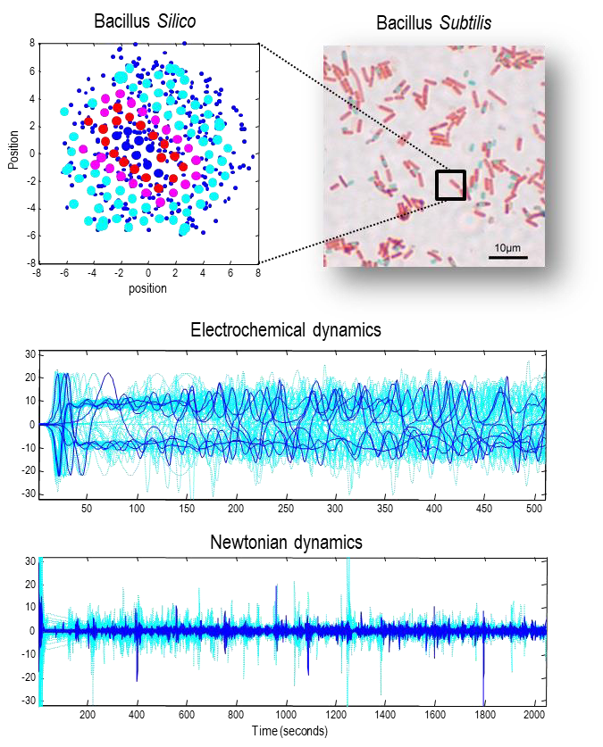

### Synthetic soups and active matter - 합성 수프와 능동 물질

이 섹션에서는 후속 섹션에서 중요한 주제를 설명하는 데 사용될 대표적인 시스템을 설명합니다. 여기서는 이 시스템을 사용하여 원시 수프를 시뮬레이션하고 마르코프 담요와 내부 상태에 따른 자기조직화의 출현을 보여줍니다. 이 수프 또는 능동 물질 (Ramaswamy, 2010)은 단거리 상호작용을 통해 결합된 입자의 집합체로 구성됩니다. 각 입자는 이전 섹션의 로렌츠 시스템에 담요 상태를 '장착'하여 내부 상태를 만들고 입자 간 상호작용을 가능하게 합니다. 그 결과 시뮬레이션은 소모 시스템에서 패턴 형성을 특성화하는데 사용되는 것과 유사합니다. 예를 들어, 튜링 불안정성 (Turing, 1952)과 비균형 시스템의 다른 소모 구조, 예를 들어 유체 동역학의 난류와 대류 (예: 베나르 세포) 또는 벨루소프-자보틴스키 반응과 같은 반응-확산 시스템의 침투 (Belousov, 1959) 등입니다. 우리의 경우, 우리 시스템을 대분자의 집합체로 다룰 수 있습니다. 그러나 시뮬레이션의 세부사항은 중요하지 않으며, 어떤 결합된 무작위 동적 시스템으로도 비슷한 결과를 얻을 수 있습니다. 아래 설명은 (Friston, 2013)에 있는 자료를 요약한 것으로, 관심 있는 독자들은 더 자세한 내용을 찾아볼 수 있습니다.

#### An active soup - 능동 수프

마르코프 담요의 출현을 시뮬레이션하기 위해, 집합체의 각 구성요소 또는 i번째 대분자는 개념적인 뉴턴 상태와 전기화학 상태, $\{b_n^{(i)} , b_e^{(i)}\}$로 갖춰졌습니다. 여기서 $b_n^{(i)}=\{a_n^{(i)} , s_n^{(i)}\}$는 운동의 좌표, 예를 들어 위치와 속도를 간주할 수 있으며, $b_e^{(i)} = \{a_e^{(i)} , s_e^{(i)},\mu^{(i)} \}$는 전기화학 상태, 예를 들어 농도나 전자기 상태에 해당할 수 있습니다. 각 대분자의 전기화학 동력학은 로렌츠 아트랙터를 가지도록 선택되었는데, 이는 이동 시스템의 전형적인 모델을 제공합니다. 예를 들어, 전자역학, 레이저, 화학 반응 등에서 사용됩니다 (Poland, 1993). 그림 5는 동력학의 요약을 제공합니다. 구체적으로, $i$번째 대분자에 대한 랑주뱅 방정식은 다음과 같습니다:

$$
\begin{equation}\tag{3.1}
\begin{aligned}
\begin{bmatrix}
  \dot{s}_e^{(i)} \\
  \dot{a}_e^{(i)}  \\
  \dot{\mu}^{(i)} \\
\end{bmatrix} &= 
\begin{bmatrix}
  10(a_e^{(i)}-s_e^{(i)})+s_e^{(i)}) \\
  32\cdot s_e^{(i)} -a_e^{(i)} -\mu^{(i)} s_e^{(i)} \\
  s_e^{(i)}a_e^{(i)} - \tfrac{8}{3}\mu^{(i)} \\
\end{bmatrix} \cdot K^{(i)} + \omega_e \\
\\
s_e^{(i)} &= \textstyle\sum_{j=\{j:\Delta_{ij}<1\}}s_e^{(i)} \\
\Delta_{ij} &= |a_n^{(j)} - a_n^{(i)}|
\end{aligned}
\end{equation}
$$

여기서, 전기화학 상태의 변화는 다른 매크로분자들의 상태의 지역 평균 $s_e^{(i)}$을 통해 연결됩니다. 이는 $\Delta$가 앙상블의 전기화학 상태 간의 의존성을 인코딩하는 인접 행렬로 간주될 수 있음을 의미합니다. 결정적으로, 이는 전기화학적 결합이 매크로분자들 사이의 공간적 관계에 의존한다는 것을 의미합니다. 해당 비율 매개변수들은 $K^{(i)} = \tfrac{1}{32}(1−exp(−4\cdot u))$; 여기서 $u \in (0,1)$는 균일 분포에서 선택되어, 토폴로지 대칭 파괴를 보장하게 됩니다.

마찬가지로, 각 매크로분자의 (뉴턴의) 움직임은 이웃하는 매크로분자들의 전기화학 상태에 의존합니다.

$$
\begin{equation}\tag{3.2}
\begin{aligned}
\dot{a}_n^{(i)} 
  &= (1+\tfrac{1}{64})\mu^{(i)}s_n^{(i)}+\omega_n \\
\dot{s}_n^{(i)} 
  &=  2F^{(i)} - 8s_n^{(i)} - a_n^{(i)}+\omega_n \\
  \\
F^{(i)} 
  &= \textstyle{\sum_{j=\{j:\Delta_{ij}<1\}}\Delta_{ij}}\left( \frac{8exp(-|a_e^{(j)}-a_e^{(i)}|)-4}{\Delta_{ij}^2}-\frac{1}{\Delta_{ij}^3} \right) \\
\end{aligned}
\end{equation}
$$

이 움직임은 다른 매크로분자들이 가하는 힘 $F^{(i)}$에 기초하고 있으며, 이는 강한 반발력(역제곱 법칙에 따름)과 전기화학 상태에 따라 달라지는 약한 인력을 포함하고 있습니다. 이 힘은 일관된 전기화학 상태를 가진 매크로분자들끼리는 서로 끌리고, 그렇지 않으면 서로 밀치도록 선택되었습니다. 두 번째 방정식에 남은 두 항은 속도에 따라 달라지는 점성과 모든 매크로분자들을 기점으로 끌어당기는 외부 힘을 나타냅니다. 이는 마치 그들이 단순한 (2차) 퍼텐셜 우물에서 움직이는 것처럼 보입니다. 이는 합성된 수프가 우물의 바닥으로 떨어지게 합니다. 이제 이 운동 방정식 하에서 발생하는 자기 조직화에 대해 좀 더 자세히 살펴보겠습니다.

FIGURE 5

합성 수프와 활성 물질. 이 그래픽은 자기 조직화를 설명하기 위해 연결된 (무작위) 동적 시스템 (즉, 입자들)을 시뮬레이션하는데 사용된 운동 방정식을 설명합니다. 이 방정식들은 (전기화학적 요소와 뉴턴 요소로 나누어진) 동력학을 설명합니다. 스케매틱은 각 입자가 그것의 마르코프 담요와 내부 상태를 포함하고 있으며, 입자들 사이의 조건부 종속성을 보여줍니다. 주황색 테두리가 있는 상태들은 전기화학 상태이며, 남아 있는 쌍은 뉴턴 상태를 구성합니다. 주의하십시오, 활성 상태(빨간색 원)는 위치의 역할을 하며, 감각 상태(자홍색 원)는 활성 상태에 따라 달라지는 속도가 됩니다. 이 활성 상태와 감각 상태의 역할은 나중에, 우리가 고전 물리학을 고려할 때 중요해질 것입니다.

#### A random dynamical attractor and its markov blankets - 무작위 동적 끌개와 그것의 마르코프 담요

아래의 시뮬레이션에서는 128개의 입자들 (즉, 매크로분자들)이 오일러의 (전진) 방법을 사용하여 1/512초의 스텝 크기로 통합되었고, 초기 조건은 정규 분포에서 샘플링되었습니다. 운동 방정식 (3.1)과 (3.2)의 매개변수를 조정함으로써, 사람들이 생각할 수 있는 여러 가지 흥미로운 행동들을 만들어낼 수 있습니다 (이 시뮬레이션과 이 서적의 그림들에 대한 코드는 SPM 학술 소프트웨어의 일부로 사용할 수 있습니다 - 소프트웨어 노트 참조). 이러한 행동들은 가스와 같은 행동 (입자들이 때때로 충분히 가까워져서 상호작용하게 됨)부터, 입자들이 퍼텐셜 우물의 바닥에서 함께 억지로 모일 때의 활동성이 넘치는 가마솥 상태까지 다양합니다. 이 정도에서, 매크로분자들은 역제곱 법칙이 그들을 떨어트릴 만큼 충분히 가깝습니다. 다른 정도에서는 더 결정적인 구조가 감소된 상호작용과 함께 나타납니다.

그러나, 대부분의 매개변수 값에 대해, 약하게 혼합된 행동이 나타나게 됩니다. 즉, 입자들의 집합이 무작위로 세계적인 아트랙터에 접근하게 됩니다 (보통 1000초 정도 후에). 일반적으로, 매크로분자들은 초기에 서로를 밀어내고, 그 다음 중심으로 다시 떨어져 나가며, 서로를 찾아가면서 합쳐지게 됩니다. 그 다음에는 지역적인 상호작용이 입자들이 서로 주고받아지게 되는 (때로는 주변으로) 자기 조직화를 중재합니다. 간단히 말해서, 운동과 전기화학적 동력학은 활동적이고 안절부절못하는 수프처럼 보입니다 – 그러나 이것은 마르코프 담요을 포함하고 있을까요?

#### The markov blanket - 마르코프 담요

구조적이고 기능적인 종속성이 같은 인접 행렬을 공유하므로 – 이는 위치에 따라 달라집니다 – 인접 행렬을 사용하여 스펙트럼 그래프 이론을 이용해 주요 마르코프 담요을 확인할 수 있습니다: 이진 벡터의 원소 $\mathcal{X}_i \in {0,1}$에 의해 인코딩된 상태의 하위 집합의 마르코프 담요은 $[B\cdot\mathcal{X}]\in{0,1}$로 주어지며, 마르코프 담요 행렬 $B=A+A^T+A^TA$은 자식, 부모, 그리고 자식의 부모를 인코딩합니다. (대칭적인) 마르코프 담요 행렬의 주요 고유벡터는 – 페론–프로베니우스 이론에 의해 – 양의 값을 포함할 것입니다. 이 값들은 각 상태가 가장 밀접하게 연결된 클러스터에 어느 정도 속해있는지를 반영합니다. 이어서, 내부 입자들 (즉, 매크로분자들)은 가장 큰 값 k = 8을 가진 입자들이었습니다. 내부 입자들을 확인한 후에는 마르코프 담요 행렬을 사용하여 $[B\cdot\mathcal{X}]$로 마르코프 담요을 복구하고, 외부 입자에게 영향을 받는지 여부에 따라 감각 입자와 활성 입자로 나눌 수 있습니다.

FIGURE 6

_앙상블 동역학과 자기 조직화_. 상단 패널들은 2048초 후의 앙상블을 구성하는 (128개의) 매크로분자들의 위치를 보여줍니다. 상단 왼쪽 패널은 각 입자의 위치 (큰 동그라미)를 중심으로 각 입자의 동역학적 상태 (매크로분자당 세 개의 파란색 점)를 보여줍니다. 매크로분자들의 앙상블은 외부 혹은 숨겨진 (청록색), 감각 (자홍색), 활성화 (빨간색) 및 내부 (파란색) 입자로 나뉘었습니다. 상단 오른쪽 패널은 포자화 중인 B. Subtilis의 내부 포자 염색 이미지입니다. 이 그래픽은 시뮬레이션을 실행할 수 있는 공간-시간적 척도를 보여줍니다. 하단 패널들은 시간에 따른 각 입자의 전기화학적 (중간 패널) 및 공간적 (하단 패널) 상태의 진화를 보여줍니다. 내부 (파란색) 및 외부 (청록색) 상태의 (전기화학적) 동역학은 512초 동안 보여집니다. 하단 패널은 전체 시뮬레이션 기간 동안 내부 (파란색) 및 외부 (청록색) 상태의 위치를 보여줍니다. 이 시뮬레이션은 본문에서의 확률적 미분방정식의 해로, 1/512초 시간 간격의 전진 오일러 방법과 표준편차가 1/8인 랜덤 가우시안 노이즈를 사용합니다.

#### The emergence of order - 질서의 출현

내부 입자들과 그들의 마르코프 담요이 주어지면, 이제 구성 요소 매크로분자들의 조립을 따라가고 그들의 궤적을 시각화할 수 있습니다. 그림 6의 상단 패널들은 앙상블을 구성하는 (128개의) 매크로분자들의 위치를 보여줍니다. 상단 왼쪽 패널은 시뮬레이션 종료 시점에 위치를 중심으로 한 각 매크로분자의 전기화학적 상태 (매크로분자당 세 개의 파란색 점)를 보여줍니다. 앙상블은 외부 혹은 숨겨진 (청록색), 감각 (자홍색), 활성화 (빨간색) 및 내부 (파란색) 입자로 나뉘었습니다. 결과적으로 마르코프 담요이 내부 입자 (즉, 박테리아)의 막대모양 구조를 둘러싸고 있는 것을 볼 수 있습니다. 흥미롭게도, 활성화된 매크로분자들은 외부 입자에 노출된 감각 매크로분자들을 지원합니다. 이것은 활성화된 분자 (예: 액틴 필라멘트)의 세포 골격이 감각 분자 (예: 세포 표면)로 둘러싸인 생물학적 세포를 연상시킵니다. 상단 오른쪽 패널은 포자화 중인 B. Subtilis의 내부 포자 염색 이미지입니다. 이 그래픽은 우리가 시뮬레이션을 운영하는 공간-시간적 척도를 상상할 수 있게 합니다. 하단 패널들은 시간에 따른 전기화학적 (중간 패널) 및 뉴턴 (하단 패널) 특정 상태들의 진화를 보여줍니다. 그들이 끌리는 집합에 접근함에 따라 비교적 빨리 해결되는 초기 (혼돈적인) 변이들을 볼 수 있습니다. 하단 패널은 전체 시뮬레이션 기간 동안 내부 (파란색) 및 외부 (청록색) 입자의 위치를 보여줍니다.

여기서 상당히 미묘한 일이 발생하고 있다는 것을 알아차려야 합니다. 우리는 입자들의 앙상블 (예: 매크로분자)로 시작했는데, 각 입자는 특정 (즉, 감각적, 활성화된, 그리고 내부) 상태들로 특징지어졌습니다. 그러다 우리는 단일 입자 (예: 박테리아 혹은 바이러스)로 끝났는데, 이는 특정 (즉, 외부, 감각적, 활성화된, 그리고 내부) 입자들로 특징지어졌습니다. 간단히 말해서, 우리는 담요 상태가 양쪽에 있는 미세한 척도에서 거시적인 척도로 이동했습니다. 다음 섹션에서는 이러한 이동에 대해 더 자세히 살펴봅니다. 여기서는 단지 거시적인 마르코프 담요이 단순한 자기 조직화에서 나타났다는 것을 간단히 지적합니다. 그렇다면 우리가 미세한 동역학을 자기 조직화라고 설명하는 것을 무엇이 합당하게 하는가?

그림 7은 앙상블의 입자들의 특정 엔트로피 측면에서의 미세한 자기 조직화를 보여주며, 이는 상호 정보 (즉, 복잡성 비용 또는 위험) 및 조건부 엔트로피 (즉, 애매함)에 대한 동시 변화를 포함합니다. 여기서, 이러한 (상대적) 엔트로피 측정치들의 앙상블 평균은 모든 (128개의) 매크로분자들에 대해 취해졌으며, 여기서 각 입자의 마르코프 담요은 세 번째 (전기화학적) 숨겨진 상태를 제외한 모든 입자를 포함합니다. 이 정보 이론적 특성화는, 예상대로, 앙상블이 랜덤한 동역학적인 유인자에 접근함에 따른 특정 엔트로피 (그리고 복잡성 비용)의 단조 감소를 밝혀냅니다.

#### Summary - 요약

요약하자면, 이 섹션은 각각 여러 동역학 상태들(세 가지 전기화학적 상태와 위치와 속도를 설명하는 두 가지 상태)을 가진 입자들의 앙상블로 구성된 다소 임의적인 랜덤 동역학 시스템에 대해 설명했습니다. 핵심적으로, 운동의 흐름 또는 방정식은 시뮬레이션된 매크로분자들 사이의 전기화학적 결합이 위치에 의존하도록 만들었고, 그들의 속도를 전기화학적 상태에 의존하게 만들었습니다. 이것은 앙상블에 동적이고 희소한 결합을 부여하여 마르코프 담요의 등장을 쉽게 만들고, 내부 입자와 외부 입자(그리고 그들의 구성 상태)를 분리합니다. 이 예시에서, 내부 입자들(그리고 마르코프 담요)은 작은 바이러스와 같은 입자 또는 막대균을 모델링하는 것으로 생각될 수 있습니다. 이제 우리는 컴퓨터 내에서 만들어진 생명체를 가지게 되었습니다. 이후에 우리는 이 인공 생명체를 조사하여 내부 입자들의 상태들(예를 들어, 세포 내 전기화학 상태)이 외부 입자들의 상태들(예를 들어, 세포 외부 움직임)를 타당하게 추론하거나 대표하는지를 살펴볼 것입니다. 이것은 실제 생명체가 그렇게 하는 것과 유사합니다. 그러나 먼저, 마르코프 담요이 그 자체가 마르코프 담요(그리고 그들의 내부 상태)으로 구성된 입자들의 결합에서 어떻게 발생했는지 이해할 필요가 있습니다.

FIGURE 7

_자기조직화 스프_. 이 시연은 본질적인 (로런츠 끌개) 동역학과 (뉴턴) 단거리 연결을 가진 입자 앙상블을 사용하여 특정 (즉, 자기) 엔트로피와 상호 정보량 (즉, 복잡성 비용 또는 위험)의 동시 변화 관점에서 자기 조직화를 보여줍니다. 여기서 이러한 (상대적인) 엔트로피 측정의 앙상블 평균은 모든 (128개) 입자에 대해 취해졌으며, 각 입자의 마르코프 담요는 세 번째 (전기화학적) 숨겨진 상태를 제외한 모든 것을 포함합니다. 하단 패널은 시스템이 무작위 동역학 끌개에 접근함에 따라 담요 엔트로피 (및 복잡성 비용)의 감소를 보여주며, 각각 굵고 얇은 실선으로 표시됩니다. 가장 아래의 파선은 조건부 엔트로피 (즉, 모호성)에 해당합니다. 상단 세 패널에서는 (확률적) 카오스 전이 동안의 입자들의 궤적이 제공됩니다. 이러한 상대 엔트로피 변화는 단일 입자에 대한 그림 2의 동등한 결과와 비교할 수 있습니다.