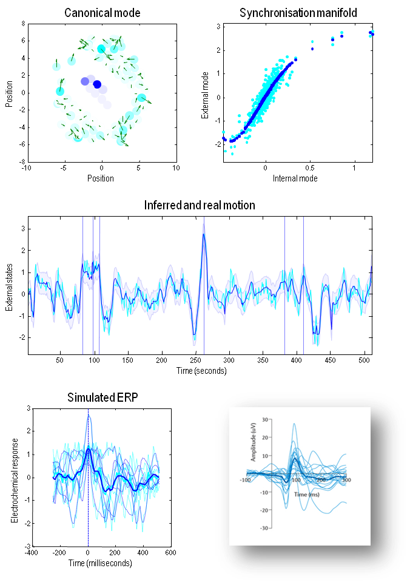

### Simulating sentience - 지각 시뮬레이션

이 섹션에서는 조건부 동기화에 의해 가능해진 베이지안 추론의 본질을 설명하기 위해 우리의 합성 수프의 미세한 거주자을 사용합니다. 간단히 말해서, 우리는 먼저 담요 상태에 의해 조건이 붙은 내부와 외부 모드 사이의 매핑을 어떻게 확인하는지 고려합니다; 이것이 조건부 동기화 매니폴드 $\sigma:\pmb\mu\to\pmb\mu$ 및 이어지는 추론을 보증합니다. 수치적으로 이것은 시계열을 훑어보며 특정 마르코프 담요 상태의 구성이 언제 반복되는지를 파악하고 동시의 내부와 외부 상태의 모드 또는 평균을 취하는 것을 포함합니다. 그런 다음 조건부 동기화 매니폴드는 평균 외부 상태를 평균 내부 상태의 (일부 비선형 함수에 대한) 회귀를 통해 추정할 수 있습니다. 동기화 매니폴드를 확인한 후, 어떤 (예상되는) 내부 상태에 대한 외부 상태에 대한 추론과 불확실성을 (8.24)의 곡률 관점에서 평가하는 것은 간단합니다. 이 표현적인 행동을 보여주기 위해, 우리는 내부 입자의 (전기화학적) 상태의 부분집합을 취하고 그들이 얼마나 외부 입자의 (운동) 상태의 요동을 인코딩하거나 표현하는지 확인하겠습니다.

그런 다음 우리는 신경생리학자의 관점에서 이 행동을 다시 살펴보는데, 그는 내부 상태의 앙상블 평균을 모아 - 이벤트 관련 퍼텐셜의 형태로 - 외부 상태의 요동에 시간적으로 잠금된 어떤 궤적이 있는지를 확인하려고 합니다; 예를 들어, 시각적 움직임 자극의 표현입니다. 우리는 이어지는 앙상블 평균이 경험적 이벤트 관련 퍼텐셜(ERP) 연구에서 본 결과와 놀랄만큼 유사하다는 것을 알게 될 것입니다.

#### The representation of order - 질서의 표현

단순함을 위해, 우리는 외부 세계의 단일 속성, 즉 내부 전기화학 상태에 의해 인코딩된 외부 거대분자의 집단 운동을 표현하는 것에 초점을 맞추겠습니다(매우 많이 시각적 움직임을 인코딩하는 뉴런 활동과 같습니다). 먼저 조건부 기대값을 식별하기 위해, 내부 및 외부 상태는 시뮬레이션의 마지막 512초 동안 담요 상태에 대한 근접성에 따라 평균화되었습니다:

$$
\begin{equation}\tag{9.1}
\begin{aligned}
\pmb \mu(b(\tau))
  &\stackrel \land = \textstyle\sum_t \pmb \sigma(\Delta_\tau)\cdot \mu(t) \\
\pmb \eta(b(\tau))
  &\stackrel \land = \textstyle\sum_t \pmb \sigma(\Delta_\tau)\cdot \eta(t) \\
  \\
\sigma(\Delta_\tau)
  &= \frac{exp(-\Delta_\tau)}{\textstyle\sum_t exp(-\Delta_\tau)} \\
\Delta_\tau
  &= \tfrac {1} {128} || b(t) - b(\tau) ||^2
\end{aligned}
\end{equation}
$$

여기서 $\pmb\sigma(\cdot)$는 시간의 모든 점에서의 담요 상태 $b(t)$와 $b(\tau)$가 조건이 된 시간 사이의 (제곱된) 마할라노비스(Mahalanobis) 거리에 대한 소프트맥스 (즉, 정규화된 지수) 함수입니다. 이 평균화 절차는 마르코프 담요의 실현값에 조건이 된 예상 내부 및 외부 상태의 추정치에 해당하는 두 개의 시계열 집합을 생성합니다. 동기화 매니폴드를 식별하기 위해, 내부 및 외부 상태 사이에서 가장 큰 (정규) 상관 관계를 보여주는 주요 정규 벡터를 식별하기 위해 정규 공변량 분석이 사용되었습니다. 마지막으로, 동기화 매니폴드 _자체_ 는 예상 외부 정규 변량에 대한 예상 내부 변량의 5차 다항식 회귀를 사용하여 식별되었습니다. 직관적으로, 이 표현적 연결 (내부와 외부 상태 사이의)은 정규 벡터에 해당하는 선형 혼합물을 통해 이루어지며, 이 벡터들의 시간에 따른 표현은 정규 변량에 해당합니다. 이 경우 외부 벡터는 분산된 운동 패턴입니다. 이것은 작은 생물 주변의 대류 소용돌이와 같습니다. 내부 벡터는 전기화학적 (예를 들어, 뉴런) 활동 패턴의 분산된 표현으로 간주될 수 있습니다. 간단히 말해, 우리는 실제로 우리의 합성 생물이 그것의 내부 전기화학을 사용하여 그것의 외부 환경에서의 운동을 감지하고 표현하는 증거를 찾고 있었습니다.

그림 19의 왼쪽 상단 패널은 내부 상태에 의해 표현되는 외부 상태의 첫 번째 정규 벡터의 운동 (녹색 화살표)을 보여줍니다. 파란색과 청록색 점은 각각 내부와 외부 상태의 위치에 놓입니다. 색상 수준은 외부 및 내부 상태 사이에서 가장 큰 공변량을 보여주는 첫 번째 정규 벡터의 표준 (제곱의 합)을 반영합니다. 오른쪽 상단 패널은 내부 거대분자의 전기화학 상태에서 외부 거대분자의 속도로 매핑되는 동기화 매니폴드 (마르코프 담요에 따라 조건이 된)를 보여줍니다. 파란색 점은 매니폴드 _자체_ 를 식별하며, 청록색 점은 매니폴드를 추정하는 데 사용된 (9.1)의 기대값입니다 (5차 다항식 회귀를 사용하여). 중간 패널은 동일한 정보를 보여주지만 시뮬레이션의 마지막 512초 동안 시간의 함수로 플로팅됩니다. 이 형식에서, 사후 또는 조건부 기대값은 내부 대분자의 전기화학 상태에 기반하며, 실제 운동은 청록색 선으로 표시됩니다. 파란색 음영 영역은 90% 신뢰 구간에 해당합니다. 여기서 주목해야 할 주요한 점은 실제 운동이 대부분 변분 밀도에 기반한 90% 신뢰 구간 내에 있다는 것입니다: 참조 (8.24).

왼쪽 하단 패널은 아래쪽 오른쪽 삽입에 표시된 것과 같은 유형의 시뮬레이션된 이벤트 관련 전위를 보여줍니다. 이 개념적 예제는 (Modi and Sahin, 2017)에서 보고된 자폐 스펙트럼 장애에 대한 연구에서 가져온 것입니다. 이들은 체커보드 시각자극 전환에 대한 사람들의 응답입니다. 시뮬레이션된 ERP는 놀라운 유사성을 보여주며, 이는 첫 번째 정규 변량의 표현이 가장 큰 6개의 시간 점에 내부 전기화학 상태를 시간 잠금함으로써 얻어졌습니다. 즉, 외부 상태의 운동입니다. 점선은 6개의 시간 점 (중간 패널에서 수직선으로 표시된) 주변의 시뮬레이션된 (내부) 응답에 해당하며, 실선은 평균에 해당합니다 - 이벤트 관련 전위 ERP와 같습니다. 파란색 선은 내부 상태의 응답이며, 청록색 선은 첫 번째 정규 벡터와 관련된 실제 운동에 해당합니다.

FIGURE 19

"지각적 동력학과 질서의 표현". 이 그림은 시스템의 내부 상태와 외부 상태에 대한 변분(즉, 대략적인 사후) 밀도를 연결할 때 따르는 근사 베이지안 추론을 보여줍니다. 왼쪽 상단 패널은 내부 상태(파란색 점)에 의해 표현되는 외부 상태의 움직임에 대한 첫 번째 정규 벡터(녹색 화살표)를 보여줍니다. 파란색과 청록색 점은 각각 내부와 외부 상태의 위치에 놓입니다. 색상 수준은 외부와 내부 상태 사이에서 가장 큰 공변량을 보여주는 첫 번째 정규 벡터의 표준(제곱의 합)을 반영합니다. 오른쪽 상단 패널은 내부 대분자의 전기화학 상태에서 외부 대분자의 속도로 매핑되는 동기화 매니폴드(마르코프 담요에 따라 조건이 된)를 보여줍니다. 파란색 점은 매니폴드 _자체_ 를 식별하며, 청록색 점은 매니폴드를 추정하는 데 사용된 (5차 다항식 회귀를 사용한) 예상치입니다. 중간 패널은 동일한 정보를 보여주지만 시뮬레이션의 마지막 512초 동안 시간의 함수로 플로팅됩니다. 이 형식에서, 조건부 기대값은 내부 대분자의 전기화학 상태에 기반하며, 실제 움직임은 청록색 선으로 표시됩니다. 파란색 음영 영역은 90% 신뢰 구간에 해당합니다. 왼쪽 하단 패널은 오른쪽 하단 패널에 표시된 유형의 시뮬레이션된 이벤트 관련 전위를 보여줍니다. 시뮬레이션된 ERP(왼쪽 하단 패널)는 첫 번째 정규 변량의 가장 큰 표현을 보여주는 6개의 시간 점에 내부 전기화학 상태를 시간 잠금함으로써 얻어졌습니다. 점선은 이들 시간 점 주변의 6개의 궤적을 나타내며, 실선은 평균에 해당합니다. 파란색 선은 내부 상태의 반응을, 청록색 선은 첫 번째 정규 벡터와 관련된 실제 움직임을 나타냅니다. 하단 패널의 타이밍은 경험적인 주변 자극 시간과 일치하도록 임의로 재조정되었습니다.

#### Summary - 요약

요약하면, 수치 분석은 (평균) 내부 상태가 베이지안 의미에서 (평균) 외부 상태를 놀랍도록 높은 정확도로 나타낼 수 있다는 것을 제안합니다. 또한 이러한 형태의 표현은 전기생리학에서 거의 일반적으로 볼 수 있는 평균 내부 뉴런 상태와 반복적인 자극을 맞추려는 기본적인 실천을 지지합니다. 우리는 첫 번째 쌍의 정규 벡터에 초점을 맞추었습니다. 실제로는 24쌍이 있었으며, 많은 쌍이 매우 높은 정규 상관관계를 보였습니다. 이는 우리가 단일 패턴의 외부 움직임의 인코딩을 보여주었지만, 실제 표현은 고차원이었고 외부 환경에서의 대분자 움직임을 재구성하는 데 사용될 수 있었다는 것을 의미합니다. 그러나 이러한 설명은 우리의 목적에 충분하며, 이는 뉴런 표현의 동적이고 분산된 특성을 보여주는 것이었습니다 (Freeman, 1994).

우리는 이전에 베이지안 메카닉스의 차량으로서의 경사 흐름에 초점을 맞추었습니다. 그러나 이 흐름은 발산이 없는 경사 솔레노이드 흐름입니다. 이 흐름이 어떻게 용존 구조와 특히 생물체 시스템에서 나타나는지에 대해 추측하는 것은 흥미로울 것입니다[^note-29]. 중요한 관찰은 마르코프 담요의 존재가 반드시 특정 상태와 그들의 외부 환경 사이의 동적 결합에 대한 비대칭성을 도입한다는 것입니다. 거의 대부분, 이 원소 형태의 대칭성 파괴는 불균형 안정 상태에서의 솔레노이드 흐름을 유도합니다(Yan et al., 2013), 이것은 - 실증적인 눈에게 - 진동으로 나타날 것입니다. 이것은 흥미롭습니다 왜냐하면 실증적인 신경과학 (그 이상)의 대부분은 진동과 그들의 본질에 몰두해 있기 때문입니다(Breakspear et al., 2010; Burgess et al., 2007; Buzsaki, 1998; Buzsaki and Moser, 2013; Giraud and Poeppel, 2012; Jensen et al., 2014; Lisman, 2012; Lopes da Silva, 1991; Sejnowski and Paulsen, 2006; Uhlhaas and Singer, 2010).

> [^note-29]: 이 개념에 대한 교신에 Jin D. Wang에게 감사드립니다. ↩

베이지안 메카닉스의 관점에서 솔레노이드 흐름은 일반화된 베이지안 필터링의 필수적인 구성 요소입니다: 별첨 E를 참조하십시오. 다시 말해, 뉴런 동력학이 변분 자유 에너지에서의 솔레노이드 경사 흐름을 구성한다면, 솔레노이드 부분은 외부 상태가 어떻게 변하는지에 대한 예측과 연관될 수 있으며, 솔레노이드, 컬-프리 부분은 놀라움에 대한 변분 경계를 최소화하기 위해 구동됩니다. 엔지니어의 관점에서, 이것은 정확히 Kalman-Bucy 필터 (신경과학에서는 예측 코딩이라고 함)의 형태입니다 (Dauwels, 2007; Roweis and Ghahramani, 1999). 간단히 말해서, 발산이 없는 흐름 - 마르코프 담요와 함께 용존 구조에 참석하는 -는 자기 증거를 제공하는 데 중요한 역할을 할 수 있습니다; 특히, 한 입자가 다른 입자를 예측하려고 하는데, 그 입자 자체가 진동하고 있다고 생각한다면. 이것은 차례로 우리를 커뮤니케이션을 지지할 수 있는 것들과 같은 용존 구조의 일반화된 동기화에 대한 다른 시각으로 이끕니다 - 입자(예를 들어, 동종체)의 앙상블 사이에서 - 그들이 자신들을 추론하려고 하는 (Friston and Frith, 2015; Hunt et al., 1997).

지금까지, 우리는 외부 상태를 추론하는 베이지안 메카닉스의 지각적 측면을 살펴보았습니다. 남은 섹션에서, 우리는 자기조직화 즉, 자기 증명(Hohwy, 2016; Palacios et al., 2017)을 수반하는 (활성) 추론에서 활성 상태의 역할로 돌아갑니다.
