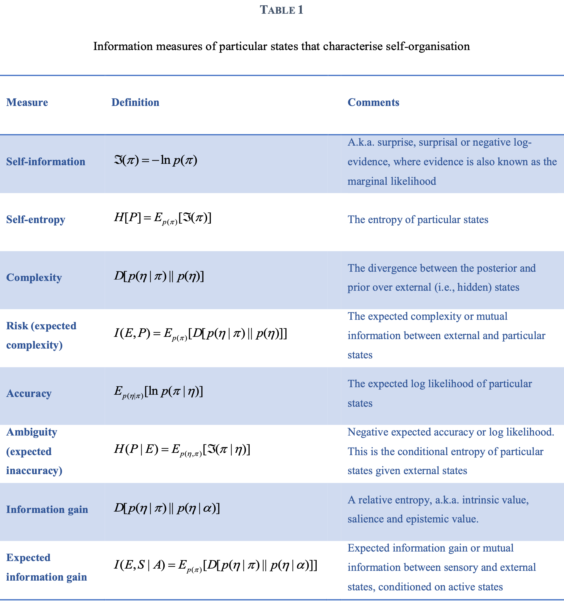

# A Free Energy Principle for A Particular Physics

__Karl Friston__

*The Wellcome Centre for Human Neuroimaging, UCL Queen Square Institute of Neurology, London, UK WC1N 3AR. Email: k.friston@ucl.ac.uk
(This work is under consideration for publication by The MIT Press)*

## Abstract

This monograph attempts a theory of every ‘thing’ that can be distinguished from other ‘things’ in a statistical sense. The ensuing statistical independencies, mediated by Markov blankets, speak to a recursive composition of ensembles (of things) at increasingly higher spatiotemporal scales. This decomposition provides a description of small things; e.g., quantum mechanics – via the Schrödinger equation, ensembles of small things – via statistical mechanics and related fluctuation theorems, through to big things – via classical mechanics. These descriptions are complemented with a Bayesian mechanics for autonomous or active things. Although this work provides a formulation of every ‘thing’, its main contribution is to examine the implications of Markov blankets for self organisation to nonequilibrium steady-state. In brief, we recover an information geometry and accompanying free energy principle that allows one to interpret the internal states of something as representing or making inferences about its external states. The ensuing Bayesian mechanics is compatible with quantum, statistical and classical mechanics and may offer a formal description of lifelike particles.

**Key words**: *self-organisation; nonequilibrium steady-state; active inference; active particles; free energy; entropy; random dynamical attractor; autopoiesis; Markov blanket; Bayesian; variational.*

## Introduction

This monograph attempts a theory of every ‘thing’ – in a tongue in cheek way – starting from the premise that a ‘thing’ is distinguishable from something else and from no ‘thing’. Its ambition is to validate a formulation of dynamical systems by appealing to constructs in physics (e.g., quantum, statistical and classical mechanics) and then use the ensuing formulation to derive an account of self-organisation within the same framework[^note-1]. Our starting point is a definition of things in terms of systems that possess an invariant measure; namely, weakly mixing systems that possess an attracting set. The description of such systems usually starts using the formalism of random dynamical systems; for example, the flow or dynamics of systemic states based on random differential equations (e.g., a Langevin equation). This is where the current treatment starts – and then stops. It stops by asking some obvious questions; like, what are states and where do random fluctuations come from? These questions lead to even simpler questions; namely, if we are dealing with the states of something, what is the thing that possesses those states – and how does one distinguish anything from something else? The answers to these questions lead to a theory of everything in a literal sense.

[^note-1]: This paper was written as an autodidactic exercise to ensure the author’s intuitions played out over complementary formulations in statistical physics. The result is a long, over inclusive paper that tries to adopt conventions from different fields (which the author is not expert in), while emphasizing common themes.

To address the nature of things, we start by asking how something can be distinguished from everything else. In pursuing a formulation of self-organisation, we will call on the notion of conditional independence as the basis of this separation. More specifically, we assume that for something to exist it must possess (internal or intrinsic) states that can be separated statistically from (external or extrinsic) states that do not constitute the thing. This separation implies the existence of a Markov blanket; namely, a set of states that render the internal and external states conditionally independent. The existence of things (i.e., internal states and their blanket) further implies a partition of the Markov blanket into active and sensory states – that are not influenced by external and internal states, respectively. This may sound a bit arbitrary; however, this is the minimal set of conditional independencies – and implicit partition of states – that licenses talk about things (that possess states). Specifically, it provides a partition that constitutes the ‘self’ in self-organisation. The subsequent sections tackle the next obvious question: what are things? At this point, we deploy the Langevin formulation of random dynamical systems as an ansatz that is recursively self-verifying, when considered in the light of Markov blankets. In brief, the formulation on offer says that the states of things (i.e., particles) comprise mixtures of blanket states, where the Markov blanket surrounds things at a smaller scale. Effectively, this eludes the question “what is a thing?” by composing things from the Markov blanket of smaller things. By induction, we have Markov blankets all the way down, which means one never has to specify the nature of things.

More specifically, we will see that the Langevin formulation of dynamics – at any given spatiotemporal scale – can be decomposed into an ensemble of Markov blankets. These blanket states have a dynamics at a higher scale with exactly the same (Langevin) form as the dynamics of the original scale. When lifting the dynamics from one scale to the next, internal states are effectively eliminated, leaving only slow, macroscopic dynamics of blanket states. These become the states of things at the next level, which have their own Markov blankets and so on. The endpoint of this formalism is a description of everything at progressively higher spatial and temporal scales. The implicit separation of temporal scales is used in subsequent sections to examine the sorts of dynamics, physics or mechanics of progressively larger things.

This monograph comprises 12 sections organised into three parts. The first part establishes some basic results, the second part applies these results to limiting cases of dynamical systems to recover quantum, statistical and classical mechanics. The third part considers the special case of active or autonomous systems, in terms of a Bayesian mechanics for particles with internal states that ‘matter’ for their behaviour.

Part One: The first section is a foundational treatment that introduces some constraints on the dynamics of Markov blankets that possess measurable characteristics. The constraint of measurability – or possessing an invariant measure over sufficiently long periods of time – allows one to express the flow of states as a function of their non-equilibrium steady-state (NESS) density[^note-2]. The relationship between flow and the NESS density follows in a straightforward way from the Fokker Planck formulation of density dynamics and, in particular, its eigensolution. The interesting results here are the dependencies – implicit in the system’s equations of motion – that inherit from Markov blankets at nonequilibrium steady-state. The ensuing, relatively straightforward lemma and corollaries concerning marginal flows and conditional independencies then form the basis for emergent behaviours in subsequent sections. The second section looks at various ways in which one can characterise density dynamics in terms of symmetry breaking and self-organisation. This section uses information theory and geometry to characterise different sorts of self-organisation to nonequilibrium steady-state. The third section provides an illustration of self-organisation, using numerical analyses of a particular system (a synthetic primordial soup based on ensemble of Lorenz systems). This system is used throughout the monograph to illustrate how one can take complementary perspectives on the same dynamics. The fourth section considers the behaviour of this (Langevin) formulation of Markov blankets at nested scales. In brief, we assume that as one ascends to higher scales, random and intrinsic fluctuations are progressively suppressed, resulting in a move from dissipative dynamics – that are dominated by random fluctuations – through to large systems whose conservative dynamics are dominated by divergence-free flow.

[^note-2]: NESS could also be an acronym for Nearly Ergodic Steady-State in weakly mixing systems. As observed by my young colleague Brennan Klein, nonequilibrium steady-state puts the “ness” in “thingness” (From Middle English -nes, -nesse: appended to adjectives to form nouns meaning “the state of being”). We will argue later that any ‘state of being’ rests upon a NESS.

Part Two: Section 5 considers the very small in terms of quantum mechanics. This section derives the Schrödinger wave equation using the relationship between a particle’s flow and the NESS density established in the first section. The trick here is to express or factorise the NESS density in terms of (complex) roots that play the role of a wave function. Section 6 then considers the collective behaviour of small things in terms of ensemble dynamics and stochastic thermodynamics. Our focus here is on linking the dissipative dynamics of ensembles to established results in statistical mechanics; namely, the laws of thermodynamics and related fluctuation theorems such as the Jarzynski equality. We then turn to the physics of big things in the limit of small amplitude random fluctuations. This limit allows us to write down equations of motion in terms of a classical Lagrangian or Hamiltonian, leading to classical mechanics, Newtonian laws of motion and Maxwell's equations.

Part Three: Having cast quantum, statistical and classical mechanics as limiting cases of the density dynamics of inert particles, we turn to the ontology of big things – whose internal states cannot be ignored – that show autonomous behaviour (e.g., large active particles like ourselves). Section 8 asks why one might attribute representational or inferential capacities to biological self-organisation. In other words, how notions like the good regulator theorem (Conant and Ashby, 1970) and the Bayesian brain hypothesis (Helmholtz, 1878 (1971); Knill and Pouget, 2004) could be substantiated in terms of a sentient physics. The argument here is fairly straightforward: namely, that the internal states of a system encode probabilistic beliefs about external states that cause sensory impressions on the Markov blanket – and are caused by the influence of active states on external states. This section provides a formal basis for an information geometry and attending free energy principle that describes autonomous things (e.g., cells or brains) as inferring the causes of actively sampled sensations. Here, we pursue a variational theme by showing how variational Bayes (Beal, 2003) is an emergent property of certain kinds of particles, leading to a form of Bayesian mechanics. Section 9 illustrates a particular inference using numerical analyses of the synthetic soup from Part One (and a virus like denizen). Section 10 then considers active states and agency in terms of corollaries of the free energy principle based upon an integral fluctuation theorem and expected free energy. The penultimate section considers the ensuing active inference in light of previous (thermodynamic) treatments. We conclude with a brief discussion of the relationships between quantum, stochastic, classical and Bayesian mechanics.

## Part 1: the setup
### Something or nothing

The *“Siphonaptera”* is a nursery rhyme, sometimes referred to as Fleas:
*Big fleas have little fleas, 
Upon their backs to bite 'em, 
And little fleas have lesser fleas, 
and so, ad infinitum.*

This nicely frames one approach to the question of ‘what is a thing?’ by appealing to an infinite regress in which the question goes away. This deflationary account[^note-3] says that the states of things are constituted by their Markov blanket, while the Markov blanket comprises the states of smaller things with Markov blankets within them – and so on ad infinitum. This appeal to blankets ‘all the way’ down offers a recursive definition of everything – at separable spatial and temporal scales – that are unpacked in Section 4, using notions from the renormalisation group. The idea of blankets all the way down (and up) suggest that there is no privileged scale, other than the scale that ‘matters’ for a thing in question. In the final sections, we will see that to ‘matter’ means there is an information geometry in play at certain scales, which afford autonomous and itinerant dynamics but are sufficiently large to suppress random fluctuations.

[^note-3]: An account that might also dissolve the prime mover (Latin: primum movens), advanced by Aristotle as a primary cause of all motion in the universe. In Book 12 (Greek "Λ") of his Metaphysics, Aristotle describes the prime mover as being perfectly beautiful, indivisible, and contemplating only the perfect contemplation: itself contemplating.

To foreshadow a more technical description, the basic story can be illustrated with a common-sense example. Imagine a solar system whose physics (i.e., dynamics or flow) is described sufficiently by the position, velocity and irradiation of heavenly bodies. These quantities constitute ensemble averages of each body’s surface (i.e., Markov blanket) with internal states fluctuating beneath. Now let us descend a scale and focus on a particular
planet (e.g., Earth). At this scale, the meteorological flows and geography of the planet’s surface now constitute an appropriate level of description with many (internal) microscopic states lying below. Now assume we have zoomed in to a city and can access these microscopic states that transpire to be the ebb and flow of commuters during the daily cycle of a metropolis. Now we come down a further level and appreciate that each element, previously contributing to the average behaviour of commuters, is an individual or entity with its own Markov blanket; namely, an embodied brain. At this level of description, the delicate and structured fluctuations of the inner workings of the brain are hidden behind the Markov blanket and yet, if we zoom in further, now become the Markov blankets of neuronal elements and processes that have been coordinating commuter behaviour. Here, the Markov blanket corresponds to a cell surface that itself surrounds intrinsic or internal intracellular processes; namely, exchange among intracellular organelles with their own Markov blankets. One could imagine going further and further through macromolecules down to atomic and subatomic levels. At each stage, we find a sufficient level of description according to the states of an ensemble that present themselves for engagement with – and coupling to – the Markov blanket of things at the level in question. Crucially, beneath (or sequestered behind) each Markov blanket are intrinsic or internal states that themselves are constituted by (mixtures of) ensembles of blanket states. In what follows, we will retell this story (from the bottom up), trying to show why these hierarchical levels of description are a necessary consequence of any (weakly mixing) random dynamical system that possess Markov blankets. However, first, we consider some preliminaries and background material that will be necessary to connect the different perspectives adopted in subsequent sections.

#### Some preliminaries

This section can be read as a foundational (introductory) treatment of physics. It is not rigorous but is sufficient to convey the basic ideas. To unpack some of the assertions and lemmas, each section is accompanied by numerical examples and comprehensive descriptions in the figure legends [^note-4]. The numerical analyses illustrate various phenomena using stochastic chaos based on a single Lorenz system (Lorenz, 1963) – or an ensemble of Lorenz systems, dressed with blanket states, to simulate active matter. These examples try to emphasise that, although the maths may look complicated, it describes sensible, emergent phenomena.

[^note-4]: These numerical analyses serve two purposes. First, they show how one can characterise the same system from complementary perspectives. For example, one can treat a system as a small particle (e.g., an electron), in terms of quantum mechanics; or we can treat it as an ensemble of particles (e.g., a gas), to examine its statistical mechanics; or we can treat it as a blob of mass (e.g., a ball) in some active medium and describe its response in terms of classical mechanics. In Part Three, we will take this further and look at autonomous behaviour; namely, how one part of a system actively infers or ‘measures’ another. The second purpose is more pedagogical (for biological readers); in the sense that the simulations dispel any mysticism surrounding high end physics. In short, all the mechanics considered in this monograph lend themselves to straightforward and intuitive numerical analyses that allow one kind of mechanics to be understood in relation to the others.

The mathematical notation is largely standard: the section on quantum mechanics will occasionally use the Dirac notation and the section on statistical mechanics follows (Seifert, 2012). Occasionally, we will use the (Einstein) summation convention when dealing with tensors. An exception to standard notation is the use of boldface variables; where $x \in X$ denotes a (generalised) coordinate in phase or state-space, while $x \in X$ denotes the expected or most likely value. $x(a)$ will denote an expectation, conditioned on a variable $a$. Boldface capital letters $X$ will denote operators. For clarity, functional derivatives and integrals involving time are expressed in terms of orbits, trajectories or paths $x[\tau]={x(\tau):\tau\in[0,t]}$ , where a value at time $\tau$ is denoted by $x(\tau)\equiv x_\tau$. We will also be dealing with time-dependent probability densities $p(x,\tau) \equiv p_{\tau}(x{\tau})$ that have stationary or steadystate solutions $p(x,\infty) \equiv p(x)$ in the limit $\tau \to \infty$; similarly, for their negative log density or surprisal $\Im (x,\tau) \equiv \Im _{\tau} (x_{\tau}) = −\ln \space p(x,\tau)$. For ease of reference, a glossary of terms and expressions is provided at the end of the monograph. Most of what follows rests on three equivalent and complementary descriptions of stochastic dynamics; the Langevin equation, path integral formulation and Fokker Planck equation.

**Langevin dynamics**: this formulation expresses the dynamics of systemic states $x(\tau)$  (i.e., states of some system) in terms of a state-dependent flow and some random fluctuations  $\omega (\tau)$:

$$
\begin{equation}\tag{1.1}
\begin{drcases}
\begin{aligned}
\dot{x} (\tau) & = f(x,\tau) + \omega \\
E[\omega(\tau)] & = 0 \\
E[\omega(\tau) \cdot \omega(\tau-t)] & = 2\Gamma \rho(\tau)
\end{aligned}
\end{drcases} \Rightarrow p(\dot{x}|x,\tau) = \mathcal{N}(f,2\Gamma)
\end{equation}
$$

Here, the random fluctuations are normally distributed with a covariance of $2\Gamma$ , under the assumption that they fluctuate sufficiently quickly, in relation to states per se, that we can ignore temporal correlations. This formulation underwrites everything that follows. In section 4, we will look more closely at where the Langevin formulation comes from – and why random fluctuations are Gaussian and uncorrelated.

**The path integral formulation**: this formulation deals with paths or trajectories $x[\tau]$, from $x(0) \equiv x0$ that are generated by the Langevin dynamics above:

$$
\begin{equation}\tag{1.2}
\begin{aligned}
\mathfrak{I}(x[\tau]) & \triangleq - \ln \space p(x[\tau]) = \mathcal{A}(x[\tau]) \\
\mathcal{A}(x[\tau]) & = \int_0^t \mathcal{L}(x,\dot{x}) d\tau \\
\mathcal{L}(x,\.{x}) & = \cfrac{1}{2}[(\.{x}-f) \cdot \cfrac{1}{2\Gamma}() + \nabla \cdot f] \\
&= \cfrac{1}{4\Gamma}\.{x}\cdot\.{x} - \cfrac{1}{2\Gamma}f\cdot\.{x} + \cfrac{1}{h}V(x) \\
V(x) & = \cfrac{h}{4\Gamma}f\cdot f + \cfrac{h}{2} \nabla \cdot f
\end{aligned}
\end{equation}
$$

This formulation expresses the probability of a path in terms of the action associated with a trajectory. It says that the surprisal (i.e., negative log probability) of a path (i.e., action) is the surprisal accumulated along its trajectory, based upon the difference between the path’s motion and the flow expected at each point in state-space. Under Gaussian assumptions about the random fluctuations, the surprisal at each point (i.e., Lagrangian) has a simple quadratic form, with an additional divergence term that arises from the implicit use of Stratonovich integrals (Seifert, 2012). See Appendix A for an explanation of this term. Here, we have expressed the Lagrangian in terms of a Schrödinger potential that will figure later in quantum mechanics. This potential depends on, and only on, the flow. For non-quantum treatments, Planck's constant is usually set to $\hbar=1$.

It will be useful to introduce the Legendre transform of the Lagrangian called a Hamiltonian that will arise in the characterisation of how things behave:

$$
\begin{equation}\tag{1.3}
\begin{aligned}
\mathcal{H}(x,\.{x}) & =\.{x}\cfrac{\partial \mathcal{L}}{\partial \.{x}}-\mathcal{L}(x.\.{x})=\.{x}\cdot p - \mathcal{L}(x,\.{x}) \\
&= \cfrac{1}{4\Gamma}\.{x}\cdot\.{x} + \cfrac{1}{h}V(x) \\
\\
p & \triangleq \cfrac{\partial \mathcal{L}}{\partial \.{x}} = \cfrac{1}{2 \Gamma}(\.{x}-f)
\end{aligned}
\end{equation}
$$

Here, the last equality defines the generalised momentum. Note that the most likely path obtains when the random fluctuations take their most likely value of zero, giving:

$$
\begin{equation}\tag{1.4}
\.{x} = f(x) \Rightarrow \mathcal{H}(x,\.{x}) = \mathcal{L}(x,\.{x}) = - \cfrac{1}{2} \nabla \cdot f(x)
\end{equation}
$$

This means that the Hamiltonian along the most likely path reduces to the divergence of the flow. Furthermore, in conservative systems with divergence-free flow (i.e., with negligible random fluctuations) the Hamiltonian is zero everywhere. This speaks to the importance of the Hamiltonian in characterising conservative (i.e., classical) mechanics. Finally, path-dependent phase measurements $\Omega (x)$ can then be averaged in the following path
integral, given an initial density, $p_0(x_0)\equiv p(x,0)$:

$$
\begin{equation}\tag{1.5}
E_{p(x[\tau],x_0)}[\Omega(x)] = \int dx_0 \int dx[\tau][\Omega(x[\tau])p(x[\tau]|x_0)p_0(x_0)]
\end{equation}
$$

This concludes the key results from the path integral formulation.

**The Fokker Planck equation**: this formulation deals with the probability density over the states, which describes the probability of finding a system in state $x$ at time $\tau$. Given a Langevin system, one can describe the density dynamics as follows:

$$
\begin{equation}\tag{1.6}
\begin{aligned}
\.{p}(x,\tau) &= Lp(x,\tau) = - \nabla \cdot j(x,\tau) \\
L &= \nabla \cdot (\Gamma \nabla - f) \\
j(x,\tau) &= f(x,\tau)p(x, \tau) - \Gamma \nabla p(x,\tau)
\end{aligned}
\end{equation}
$$

Here, $L$ is the Fokker Planck operator and $j(x,\tau)$ is the probability current that provides a convenient summary
of the flow of probability mass. This comprises a flow-dependent term and (a usually opposite) part, generated by random fluctuations over probability gradients.

#### Nonequilibrium steady states

밀도 역학의 포커-플랑크 형식을 갖추고 나면 이제 어떤 무작위 동적 시스템의 비평형 장기 동작을 고려할 수 있습니다. 시스템이 약하게 혼합되어 있기 때문에 충분한 시간이 지난 후에는 pullback 또는 random global attractor라고 하는 불변 상태 집합으로 수렴할 것입니다. attractor는 그 자체가 무작위 집합인 경우(random set) 때문에 무작위로 나타납니다(Crauel, 1999; Crauel and Flandoli, 1994). 관련된 NESS 밀도 p(x)는 포커-플랑크 방정식의 해입니다(Frank, 2004). 식 (6)은 NESS 밀도가 흐름에 의존하며, 이는 항상 회전과 발산이 없는 구성 요소로 표현될 수 있음을 보여줍니다. 이것이 헬름홀츠 분해(Helmholtz decomposition, 벡터 미적분학의 기본 정리라고도 함)이며, 이는 대칭이 아닌 행렬 $Q = -Q^T$와 스칼라 포텐셜 $\Im(x)$의 용어로 구성될 수 있습니다(Ao, 2004)[^note-5].

[^note-5]:간단하게 하기 위해, 우리는 $Q = -QT$가 $x$에 따라 변하지 않는다고 가정하겠습니다, 적어도 지역적으로는 말이죠. 더불어, 무작위 진동의 진폭은 구형이라고 가정되므로, 우리는 $\Gamma$를 스케일링된 항등 행렬 또는 스칼라 양으로 취급할 수 있습니다.

$$
\begin{equation}\tag{1.7}
f =(Q-\Gamma)\nabla\Im
\end{equation}
$$

이 표준 형식을 사용하면(Yuan 등, 2010), $p(x) = exp(-\Im(x))$가 포커-플랑크 방정식의 해임을 간단하게 보여줄 수 있습니다(Friston and Ao, 2012). 정보 이론에서 스칼라 포텐셜 $\Im(x) = -\ln p(x)$는 자기 정보, _surprisal_ 또는 더 간단하게는 놀람(surprise)으로 알려져 있습니다(Jones, 1979; Tribus, 1961). 이는 우리가 NESS 밀도 또는 놀람에 따라 흐름을 표현할 수 있음을 의미하며, 이는 부록 B의 NESS 정리와 (Friston, 2013)에 따릅니다:

$$
\begin{equation}\tag{1.8}
\begin{aligned}
f & = (\Gamma - Q)\nabla\ln p(x) \\
 & \Rightarrow \cfrac{p(x)}{j(x)} = -Q\nabla \ln p(x) \Rightarrow \.{p}(x) = 0 \\
 \space \\
\Im(x) & = - \ln \space p(x) \\
f(x) & = (Q-\Gamma)\nabla\Im(x) \\
\nabla \cdot f(x) & = - \Gamma \nabla^{2}\Im(x)
\end{aligned}
\end{equation}
$$

이것이 이 모노그래프의 대부분을 지지하는 핵심 결과입니다. 이것은 무작위 동적 시스템의 흐름이, 비균형 안정 상태에서, 직교하는 구성 요소를 포함한다고 말합니다: 불균형 안정 상태 밀도의 로그 그래디언트를 상승하는 소산 흐름과, 해당 등고선에서 순환하는 보존적인(발산이 없는) 솔레노이드 흐름입니다. 직관적으로, 소산적인(curl이 없는) 흐름은 무작위 플럭튜에이션에 의해 그렇지 않으면 발생할 밀도의 분산을 반대로합니다. 이는 유일하게 남아 있는 확률 흐름이 솔레노이드라는 것을 의미합니다. 나중에 우리는 이 간단한 결과가 상태의 다양한 부분 집합의 흐름을 고려할 때 놀라운 함의를 가지고 있다는 것을 알게 될 것입니다. 이들은 조건부로 독립적입니다. 이 특정 구조는 모든 이후를 지지하는 두 번째 주요 개념인 마코프 블랭킷 개념에 기반을 두고 있습니다.

다음 단계는 포커-플랑크 방정식의 NESS 해를 경로 적분 형식에 대입하여, 놀람(surprisal)의 관점에서 표현된 작용을 통해 어떤 궤적의 확률을 표현하는 것입니다. 식 (2)와 식(8)에서 이것은 다음을 제공합니다:

$$
\begin{equation}\tag{1.9}
\begin{aligned}
\mathcal{A}(x[\tau]) & = \int_0^t \mathcal{L}(x,\.{x})d\tau \\
\mathcal{L}(x,\.{x}) & = \cfrac{1}{2} [ \cfrac{1}{2\Gamma}( \.{x} - Q \nabla \Im ) \cdot ( \.{x} - Q \nabla \Im) + \.{x} \cdot \nabla \Im + \Gamma(\cfrac{1}{2}\nabla \Im \cdot \nabla \Im - \nabla^{2}\Im)] \\
\mathcal{H}(x,\.{x}) & = \cfrac{1}{2} [ \cfrac{1}{2\Gamma}( \.{x} - Q \nabla \Im ) \cdot ( \.{x} - Q \nabla \Im) - \Gamma(\cfrac{1}{2}\nabla \Im \cdot \nabla \Im - \nabla^{2}\Im)] \\
\end{aligned}
\end{equation}
$$

이 결과는 솔레노이달 흐름과 그래디언트 흐름이 직교한다는 사실을 사용합니다, 즉 $ Q \nabla \Im \cdot \Gamma \nabla \Im $. 식 (9)는 기본적으로 평형상태가 아닌 동력학의 경로적분 표현입니다. 이는 어떤 궤적의 확률을 상태 공간을 통한 경로적분의 라그랑지안으로 표현하며, 여기서 라그랑지안은 운동과 놀람 (즉, NESS potential)을 통해 표현될 수 있습니다.
중요한 점은, 식 (9)의 세 항이 무작위 변동의 진폭에 대해 다르게 의존한다는 것입니다. 이 의존성은 우리가 솔레노이달 흐름이 없는 1차원 시스템의 표현을 고려하면 더욱 명확하게 볼 수 있습니다:

$$
\begin{equation}\tag{1.10}
\begin{aligned}
\mathcal{A}(x[\tau]) & =\underbrace{\frac{1}{2} \int_0^t \frac{1}{2 \Gamma} \dot{x}^2 d \tau}_{\text {kinetic }}+\underbrace{\frac{1}{2} \int_0^t \dot{\mathfrak{I}} d \tau}_{\text {path-independent }}+\underbrace{\frac{1}{h} \int_0^t V(x) d \tau}_{\text {path-dependent }} \\
\int_0^t \dot{\mathfrak{I}} d \tau & =\mathfrak{I}\left(x_t\right)-\mathfrak{I}\left(x_0\right) \\
V(x) & =\frac{h}{2} \Gamma\left(\frac{1}{2} \nabla \mathfrak{I} \cdot \nabla \mathfrak{I}-\nabla^2 \mathfrak{I}\right)
\end{aligned}
\end{equation}
$$

이것은 어떤 경로의 행동을 운동에 의존하는 (운동에너지) 항, 변화하는 놀람에 의존하는 (경로에 독립적인) 항, 그리고 무작위 진동의 진폭에 비례하는 (경로에 종속적인) 항의 형태로 표현될 수 있다는 것을 의미합니다. 부록 C에서는 기대 라그랑지안과 관련된 해밀턴이 간단하게 다루어져 있습니다

여기서 중요하게 주목해야 할 것은 식(10)의 첫 번째 항이 운동 에너지의 형태를 가지며, 여기서 무작위 진동의 진폭은 역질량의 역할을 합니다. 두 번째 항은 단순히 (NESS) 잠재력 차이이며, 세 번째 (슈뢰딩거 포텐셜) 항은 무작위 진동의 진폭에 비례하여 증가합니다. 이는 무작위 진동이 크면 상태가 무시할 만한 질량을 가진 것처럼 행동하고 슈뢰딩거 포텐셜이 지배적이라는 것을 의미합니다. 반대로,작위 진동의 진폭이 무시할 만큼 작으면 첫 번째와 두 번째 항이 우세하게 되어 행동을 운동에너지와 잠재력 항으로 분해할 수 있습니다. 이 양대 주장은 나중에 양자와 고전 역학 사이의 구별로 나타날 것입니다. 식(10)은 $\hbar = 0$이면 슈뢰딩거 포텐셜의 기여가 사라진다는 것을 제안합니다 (파인먼, 1948). 그러나 이 논문에서는 플랑크 상수를 비례 상수로 취급합니다(이것은 무작위 진동의 진폭에 특정 단위를 부여합니다), 따라서 그들의 진폭이 0으로 수렴할 때 고전적인 한계가 도달됩니다; 즉, $\Gamma = 0$.

이 한계에서, 고전적인 경로는 최소 행동의 변분 원칙으로 설명할 수 있는 가장 가능성이 높은 경로입니다:

$$
\begin{equation}\tag{1.11}
\begin{aligned}
\delta_x\mathcal{A}(Xx[\tau]) &= 0 \\ 
&\Rightarrow \.{x}(\tau) = f(x(\tau)) \\
&\Rightarrow x[\tau] = argmin_{x[\tau]} \mathcal{A}(x[\tau])
\end{aligned}
\end{equation}
$$

이것은 가장 가능성이 높은 경로가 행동을 최소화하여 경로에 대한 그것의 변화를 0으로 만든다는 것을 의미합니다. 중요한 것은, 비균형 정상 상태에서, 행동에 대한 경로에 의존적이고 독립적인 기여는 놀람(surprisal)과 그 기울기의 형태로 표현될 수 있다는 것입니다. 우리는 이 비균형 정상 상태 동력학의 결과를 여러 다른 설정에서 활용할 것입니다. 시너제틱스와 패턴 형성의 처리에서, 이 최소 행동 원칙은 때때로 에너지 기울기의 파괴로 표현됩니다 (Tschacher와 Haken, 2007).

#### Fluctuations and information length

_“Time is designed in such a way that given the present, the future is independent of the past”_ (Caticha, 2015b) p6116

우리는 확률 측정과 미분 기하학에서 상속된 측정 척도라는 측면에서 '것들의 측정'에 관심이 있을 것입니다. 이 섹션은 확률 이론에 미분 기하학을 적용할 때 발생하는 길이와 정보 기하학에 대한 간단한 배경을 제공합니다. 여기서의 주요 메시지는 이 모든 측정이 시간에 깊이 있게 의존한다는 것입니다. 이 서문의 일환으로, 무작위 변동의 본질을 고려하는 것이 유용합니다. 나중에 우리는 이러한 변동이 집합 당 상태에 대해 충분히 빠르게 변동하는 상태의 혼합물이라는 것을 알게 될 것입니다. 이런 의미에서 무작위 변동은 (정의상) 느린 상태와 상관없는 빠른 상태입니다. 빠른 상태와 느린 상태의 암시적인 통계적 독립성은 우리가 '무작위' 변동에 대해 이야기할 수 있게 합니다. 식(1)의 랑게빈 동력학의 형태는 이 시간 척도의 분리를 보여줍니다. 예를 들어, $\Gamma$의 단위(초당)는 그것이 비율 상수의 역할을 하는 것을 제안합니다. 실제로, 한 가지 시각에서는, 변동의 진폭은 변동에 의한 상태의 분산 또는 분산이 시간에 걸쳐 얼마나 빠르게 축적되는지에 대응합니다(Cox and Miller, 1965). 또한, 정상 상태에서, 진폭은 흐름을 놀람의 기울기에 결합하는 효과적인 비율 상수입니다 -식(7). 다시 말해, 주어진 NESS 밀도에 대해, 흐름은 변동의 진폭에 비례하여 증가합니다. 길이라는 개념을 도입하여 이를 공식화할 수 있습니다:

$$
\begin{equation}\tag{1.12}
\begin{aligned}
\ell = \int_0^T \sqrt{ \dot{x}(\tau)^{i} g_{ij} \.{x}(\tau)^j } dt
\end{aligned}
\end{equation}
$$

여기서 우리는 (아인슈타인) 합산 규칙을 사용했으며, 반복된 첨자와 아래 첨자에 대한 암시적인 합산이 있습니다. 식 (12)는 메트릭 텐서 $g_{ij}$가 제공하는 리만 메트릭을 사용하여 경로의 길이를 표현합니다. 지역적으로 최소 거리의 경로는 적위선(_geodesics_)이라고 불리며, 유클리드 공간에서의 직선의 아날로그입니다. 식 (10)에서, 낮은 진폭의 변동의 클래식한 한계에서 경로의 행동은 경로 길이의 상한선으로 해석될 수 있습니다 (코시-슈바르츠 부등식에 의해):

$$
\begin{equation}\tag{1.13}
\begin{aligned}
 \lim_{Q,\Gamma \rightarrow 0}\mathcal{A}(x[\tau]) &= \int_0^T \dot{x}(\tau)^{i} g_{ij} \.{x}(\tau)^j dt \geq \ell^2 \\
g &= \cfrac{1}{4\Gamma}
\end{aligned}
\end{equation}
$$

간단히하기 위해, 우리는 회전형 흐름을 무시했습니다. 이것은 만약 길이가 무작위 플럭튜에이션의 정밀도(즉, 공분산의 역수)의 용어로 측정된다면, 가장 가능성이 높은 (클래식한) 경로는 가장 짧을 것이라는 것을 제안합니다. 동일하게, 정밀도는 상태 공간에 대한 기하학을 제공하는 리만 메트릭을 제공하며, 이는 플럭튜에이션이 큰 진폭을 가질 때 점들이 서로 가깝습니다. 무작위 플럭튜에이션의 진폭과 메트릭 텐서 간의 동등성은 우리의 단순화 가정인 무작위 플럭튜에이션의 진폭이 구형(즉, 모든 방향에서 똑같이 보이는)이라는 것을 근거로 합니다. 이는 좌표 선택에 불변인 리만 메트릭을 가진 대칭 상태 공간에서 작업하는 것과 동일합니다.

이 메트릭 처리를 더 나아가서, 밀도의 충분한 통계량(즉, 매개변수)의 공간을 정보 기하학으로 갖추게 할 수 있습니다. 간단히 말해서, 정보 기하학은 통계적 다양체에서 거리를 측정하는 데 사용될 수 있는 리만 메트릭에 근거합니다(Amari, 1998; Ay, 2015). 통계적 다양체란 각 점이 확률 밀도를 나타내는 메트릭 공간입니다. 즉, 매개변수 공간의 점들은 확률 밀도의 충분한 통계량에 해당하며, 통계적 다양체의 가까운 점들은 유사한 밀도에 해당합니다. 예를 들어, 가우시안 밀도의 통계적 순간(즉, 평균과 정밀도)에 의해 생성된 이차원 공간은 일반적인 통계적 다양체를 구성합니다. 통계적 다양체의 특별한 점은 항상 메트릭 텐서를 갖추고 있으며, 이는 피셔 정보 메트릭의 형태로 제공됩니다.

현재의 상황에서는 (Crooks, 2007)에 따라, 피셔 정보를 메트릭으로 사용하는 정보 길이를 통해 체계적인 밀도 동역학을 특성화할 수 있습니다. 밀도를 시간에 독립적인 집합 변수 또는 모드 $\zeta_i(x)$와 시간에 종속적인 충분한 통계적 역할을 하는 공액 변수 $\lambda(\tau)$로 분해하는 것을 고려해보세요 [^note-6] :

[^note-6]: 우리는 Z를 분할 함수 또는 정규화 상수를 나타내는 데 사용할 것입니다. 

$$
\begin{equation}\tag{1.14}
\begin{aligned}
\mathfrak{I}(x,\tau) = \lambda^i (\tau)\zeta_i (x) + \ln Z
\end{aligned}
\end{equation}
$$

이 매개변수화 하에, 피셔 정보 메트릭 $I(\lambda)$는 다음과 같습니다:

$$
\begin{equation}\tag{1.15}
\begin{aligned}
\ell & = \int_0^t \sqrt{g_{ij}\.{\lambda}^{i}\.{\lambda}^{j}} d\tau \\
g &= I(\lambda) \Leftrightarrow g_{ij} = cov(\zeta_i(x),\zeta_j(x)) = E\Bigg[\cfrac{\partial\Im}{\partial\lambda^{i}} \cfrac{\partial\Im}{\partial\lambda^{j}} \Bigg] = \cfrac{\partial D[p_{\lambda^{'}}(x)||p_{\lambda}(x)]}{\partial\lambda^{'i}\partial\lambda^{'j}}\Biggm\vert_{\lambda^{'} = \lambda}
\end{aligned}
\end{equation}
$$

주목할 점은 정보 기하학이 상태 공간 그 자체가 아니라 상태에 대한 밀도를 매개변수화하는 공액 변수 공간에 있다는 것입니다. 이 공간은 통계적 다양체이며, 그 기하학은 나중에 베이지안 역학의 중심적인 측면이 될 것입니다. 현재로서는 정보, 기하학, 통계 역학 간의 깊은 관계를 예고하고 있습니다 (Crooks, 2007; Kleeman, 2014).

(15)의 마지막 등식은 두 확률 분포 사이의 발산의 두 번째 도함수를 단순하게 계산함으로써 확인할 수 있습니다. 이 확률 분포들은 무한히 가까이 있으며, 여기서 $\lambda^{'} = \lambda + d\lambda$입니다. 이는 통계적 다양체 위에서 정보 길이가 매개변수화된 밀도가 빨리 변할 때 더 빨리 축적된다는 것을 의미합니다. 이 해석은 또한 통계적 다양체에서 작은 이동 $d\lambda \rightarrow 0$에 대한 연속적인 밀도 간의 발산(제곱근)의 축적으로 정보 길이를 설명하는 것을 허용합니다.

$$
\begin{equation}\tag{1.16}
\begin{aligned}
\ell & = \int d \ell \\
d\ell^2 & = g_{ij}d\lambda^j d\lambda^i \\
\cfrac{1}{2}d\ell^2 &= D[p_{\lambda^{'}}(x)||p_{\lambda}(x)] = \cfrac{1}{2} \cfrac{\partial D[p_{\lambda^{'}}(x)||p_{\lambda}(x)]}{\partial\lambda^{'i} \partial\lambda^{'j}}\Biggm\vert_{\lambda^{'}=\lambda} d\lambda^j \lambda^i \\
\end{aligned}
\end{equation}
$$

마지막 등식은 발산의 테일러 전개로부터 따르며, 첫 번째로 사라지지 않는 항은 (15)의 두 번째 도함수입니다. 이는 $\lambda^{'}=\lambda$일 때 발산과 그 첫 번째 도함수가 0이기 때문입니다. 방정식 (16)은 정보 길이를 매개변수 공간을 통해 이동하는 밀도가 지나가는 고유한 구성의 수로 이해할 수 있다는 것을 의미합니다. 이 결과는 확률 분포의 매개변수로 시스템의 다양한 구성을 처리함으로써 열역학 변수를 시스템의 다양한 구성과 우아하게 연결하는 방법을 제공합니다 (Crooks, 2007; Kleeman, 2014). 그러나, 우리의 초점은 밀도 동역학에 정보 기하학을 부여하는 특별한 매개변수인 시간에 있을 것입니다.

중요한 정보 길이는 시간 자체가 진화하는 밀도를 매개변수화하고, $\lambda(\tau) = \tau \Rightarrow .{\lambda} = 1$ 그리고 따라서 시간은 정보 기하학을 가지고 있다. 어떤 초기 상태에서 준비된 시스템을 고려하십시오. 밀도 $p_0 \equiv p(x,0)$는 다음과 같습니다.

$$
\begin{equation}\tag{1.17}
\begin{aligned}
p(x,\tau) &= p_{0} + \tau\dot{p}_{0} + ... \\
&= p_{0} + \tau L p_{0} + ... \\
\\
\ell(t) &= \int_{0}^{t} \sqrt{g(\tau)}d\tau \\
g(\tau) &= I(\tau) = E_{p_{0}}[(\partial_{\tau}\Im_{0})^{2}] = \int\cfrac{(L_0 P_0)^2}{p_0}dx \\
L(\tau) &= \nabla\cdot\Gamma\nabla - \nabla\cdot f(\tau)
\end{aligned}
\end{equation}
$$

이 문맥에서, 피셔 정보 메트릭은 밀도가 진화하는 속도를 반영하는 시간적 스케일링을 제공합니다. (16)에서:

$$
\begin{equation}\tag{1.18}
\begin{aligned}
d\ell(\tau)^2 &= g(\tau)d\tau^2 \\
\cfrac{1}{2}d\ell(\tau)^2 &= D[p(x,\tau + d\tau)||p(x,\tau)] \\
\end{aligned}
\end{equation}
$$

다시 말해, 시간에 대한 메트릭은 (제곱된) 속도 상수의 역할을 하며, 단위는 초당 (제곱)입니다. 직관적으로, 시간이 경과함에 따라 정보 길이는 (17)의 폭커-플랑크 연산자를 통한 무작위 플럭튜에이션의 진폭과 (흐름의) 발산에 따라 달라집니다. 이는 상태 공간의 한 부분에서 메트릭 시간이 느리게 진행되고 다른 곳에서는 빠르게 진행될 수 있음을 의미합니다. 방정식 (18)은 또한 정보 길이를 무한히 짧은 시간 간격 동안 (제곱된) 발산의 누적으로 간주할 수 있음을 제안합니다. 이 누적은 (사전 메트릭) 발산으로부터 메트릭을 구성할 수 있게 합니다. 이는 초기 밀도와 나중의 시점에서의 밀도 간의 발산과 대조되어야 합니다. 다음 섹션에서 이에 대한 예를 볼 수 있을 것입니다.

(18)의 정보 길이는 균형 상태 또는 비균형 정상 상태로의 수렴을 유용하게 특성화합니다 (Kim, 2018). 시간이 지나면서 모든 초기 상태에서의 미래 밀도는 NESS 밀도로 수렴하고 정보 길이는 점근적 한계로 수렴합니다. 이 한계는 초기 밀도에서 NESS 밀도까지의 거리를 측정합니다. 수렴 시, (18)의 발산은 사라지고 정보 길이의 추가 증가는 없습니다.

$$
\begin{equation}\tag{1.19}
\begin{aligned}
\lim_{\tau \to \infty}D[p(x,\tau)||p(x)] = 0 \Rightarrow d\ell(\tau) = 0 \\
\end{aligned}
\end{equation}
$$

실질적으로, 정보 길이의 관점에서 보면, 미래에서 시간은 느려집니다. 직관적으로, 한 시간 뒤에 무엇을 하고 있을지, 그것이 현재 당신이 하는 것과 어떻게 다른지 상상해보십시오. 이제, 이 연습을 반복하지만 10년 뒤의 당신과 10년 후 한 시간을 상상해보십시오. 멀리 떨어져 있는 미래에서 당신 자신의 진화하는 버전을 구별하기 어렵다는 점에서, 시간은 실질적으로 멈추었습니다.

요약하면, 시간에 의해 매개변되는 시간 종속적인 밀도의 정보 길이는 초기 밀도와 최종 밀도 사이의 발산을 사용하는 것을 보완하는 척도를 제공합니다. 이는 밀도의 경로나 초기 상태에서의 밀도의 진화에 의존하지 않습니다. 두 가지 모두 비균형 정상 상태로의 수렴을 특성화하는 데 중요한 역할을 합니다. 나중에, (19)의 발산이 확률론적이고 베이지안 역학에서 모두 자유 에너지의 형태로 나타나는 것을 볼 것입니다. 또한 정보 길이가 열역학 형식에서의 확률론적 엔트로피 생성과 밀접하게 관련되어 있음을 볼 것입니다. 지금까지, 우리가 미리 보여준 모든 것은 어떤 무작위 동적 시스템에도 적용됩니다. 다음 섹션에서는, 시스템이 마르코프 담요를 가지고 있을 때 이러한 특성들을 다시 살펴보겠습니다.

#### Random dynamical systems and Markov blankets

A Markov blanket is a set of states that separates two other sets in a statistical sense. The term Markov blanket was introduced in the context of Bayesian networks or graphs (Pearl, 1988) and refers to the children of a set (the set of states that are influenced), its parents (the set of states that influence it) and the parents of its children. The existence of a Markov blanket induces a partition of states into internal and external states, where external states are hidden (insulated) from the internal (insular) states by the Markov blanket. In other words, external states can only be seen vicariously by internal states, through blanket states. Furthermore, the Markov blanket can itself be partitioned into two sets that are, and are not, children of external states. We will refer to these as sensory states and active states respectively: $b = \lbrace s,a \rbrace \in B$ . Put simply, the existence of a Markov blanket implies a partition of states into external, sensory, active and internal states: $x = \lbrace \eta,s,a,\mu \rbrace \in X$. External states cause sensory states that influence – but are not influenced by – internal states, while internal states cause active states that influence – but are not influenced by – external states. Crucially, the dependencies induced by Markov blankets create a circular causality that is reminiscent of the action-perception cycle: see Figure 1 and (Fuster, 2004). Circular causality here means that external states cause changes in internal states, via sensory states, while the internal states couple back to the external states through active states, such that internal and external states influence each other in a vicarious and reciprocal fashion.

#### Markov blankets and marginal flows

In the next section, we will unpack the implications of Markov blankets for self-organisation in terms of information theory. This treatment rests upon the conditional independencies among the partition of states that result from precluding an influence of external states on active and internal states – and an influence of internal states on sensory and external states. This dynamical architecture is summarised in terms of a marginal flow lemma and its corollaries below. In brief, these results express the flow at nonequilibrium steady-state under the conditional independencies implied by a Markov blanket and vice versa. In other words, they connect the sparse influences mediated by Langevin flow to conditional independencies among subsets of states. Effectively, this
generalises the standard form for flow in (1.8) to a partition of states that contains a Markov Blanket. Appendix B contains the accompanying proofs and considers the complementary perspectives on how sparse influences underwrite conditional independence and vice versa.

The generalisation of the NESS density laminar to Markov blankets rests on the notion of marginal flow; namely, the flow of certain states averaged (i.e., marginalised) over other states. We will use the ~ notation to denote the complement of a subset of states; for example, $x = (\mu, \dot{\mu})$.

**Lemma** (marginal flow): for any weakly mixing random dynamical system at nonequilibrium steady-state, the marginal flow $f_{\eta}(\mu)$ of any subset of states $\eta \in X$, averaged under the complement of another $\mu \in X$ can be expressed in terms of the gradients of the logarithm of the corresponding marginal density:

$$
\begin{equation}\tag{1.20}
\begin{aligned}
f_{\eta(\mu)} \triangleq E_{p(\tilde{\mu}|\mu)}[f_{\eta}(\mu,\tilde{\mu})] = (Q_{\eta\eta}-\Gamma_{\eta\eta})\nabla_{\eta} \Im(\mu) + Q_{\eta\tilde{\eta}}\nabla_{\tilde{\eta}}\Im(\mu) \\
\end{aligned}
\end{equation}
$$

**Corollary** (conditional independence): if the flow of one subset of states does not depend on another, then it becomes the flow expected under the second subset. For example, in terms of the Markov blanket:

$$
\begin{equation}\tag{1.21}
\begin{aligned}
\begin{bmatrix}
  f_{\eta}(x) \\
  f_{s}(x)  \\
  f_{\mu}(x) \\
  f_{a}(x)  \\
\end{bmatrix} = 
\begin{bmatrix}
  f_{\eta}(\eta,x) \\
  f_{s}(\eta,x)  \\
  f_{\mu}(\mu,x) \\
  f_{a}(\mu,x)  \\
\end{bmatrix} =
\begin{bmatrix}
  (Q_{\eta\eta}-\Gamma_{\eta\eta})\nabla_{\eta}\Im(\eta,b) \\
  (Q_{ss}-\Gamma_{ss})\nabla_{s}\Im(\eta,b) + Q_{sa}\nabla_{a}\Im(\eta,b) \\
  (Q_{\mu\mu}-\Gamma_{\mu\mu\eta})\nabla_{\mu}\Im(\mu,b) \\
  (Q_{aa}-\Gamma_{aa})\nabla_{a}\Im(\eta,b) + Q_{as}\nabla_{s}\Im(\mu,b) \\
\end{bmatrix}
\end{aligned}
\end{equation}
$$

In short, the conditional independencies induced by the Markov blanket mean that the flow of external states is the same for every internal state, which is just its average over the internal states (similarly for other partitions).

**Corollary** (expected flow): the marginal flow of any subset $\eta \subset \subset x$ averaged over all other states depends only on the gradients of its marginal density, provided there is no solenoidal coupling with its complement:

$$
\begin{equation}\tag{1.22}
\begin{aligned}
f_{\eta}(\eta) = (\Gamma_{\eta\eta} - Q_{\eta\eta})\nabla_{\eta}\ln p(\eta) = (Q_{\eta\eta} - \Gamma_{\eta\eta})\nabla_{\eta}\Im(\eta) \\
\end{aligned}
\end{equation}
$$

This is a special case of the marginal flow lemma, when $\eta = \mu$ and $Q_{\eta\eta}=0$ . It implies that the expected flow of any state or subset of states, averaged over all other states, will behave in exactly the same way as all states considered together. In other words, it will ascend the gradients of its (marginal) density.

The marginal flow lemma allows us to express the conditional independencies implicit in the structural or probabilistic graphical model of Figure 1 in terms of the flows in (21). In other words, if a system maintains a Markov blanket at nonequilibrium steady-state, then it must possess flows that depend only upon certain states. This structured dynamics underwrites everything that follows.

#### Summary

This section has introduced the technical foundations that we will call upon later to characterise dynamics in various settings. Its focus was on self-organisation to nonequilibrium steady-state, which can be characterised as the solution to the Fokker Planck formulation of density dynamics. Crucially, this enables one to express the flow of states in terms of a nonequilibrium steady-state density, surprisal or potential. We have looked briefly at the geometry of density dynamics in terms of information length. Finally, the conditional independencies implied by a Markov blanket have been expressed in terms of how the (marginal) flow of certain states depends on other states. The marginal flows induced by a Markov blanket will become important later, when we interpret gradient flows in relation to information geometry – in Part Three.

FIGURE 1

_Markov blankets_. This probabilistic graphical model illustrates the partition of states into internal states (blue) and hidden or external states (cyan) that are separated by a Markov blanket – comprising sensory (magenta) and active states (red). The upper panel shows this partition as it would be applied to action and perception in a brain. In this setting, self-organisation of internal states then corresponds to perception, while active states couple brain states back to external states. The lower panel shows the same dependencies but rearranged so that the internal states are associated with the intracellular states of a Bacillus, where the sensory states become the surface states or cell membrane overlying active states (e.g., the actin filaments of the cytoskeleton). Note that the only missing influences are between internal and external states – and directed influences from external (respectively internal) to active (respectively sensory) states. The surviving directed influences are highlighted with dotted connectors. Autonomous states are those states that are not influenced by external states, while particular states constitute a particle; namely, autonomous and sensory states – or blanket and internal states. The equations of motion in the upper panel follow from the marginal flow lemma.

### Symmetry breaking and self-organsation

_"How can the events in space and time which take place within the spatial boundary of a living organism be accounted for by physics and chemistry?"_(Schrödinger, 1944)

The introduction of Markov blankets – and the distinction between the external and internal states of a particle – changes the game somewhat, in terms of ensemble densities. In the absence of a partition, we can only talk about the entropy of a density and how it changes with time. However, in the setting of a partition, we can consider the entropy of particular states in relation to hidden states (or vice versa). This relative entropy is known as mutual information. So, are we interested in systems with a high or a low mutual information? It transpires that the answer is both, in the sense that we are interested in particles that explore their state-space but have a well-defined attracting manifold with low measure (i.e., low entropy). This speaks to a dialectic between opposing constraints. In brief, if the NESS entropy of particular states is small, then the average uncertainty about particular states, given external states must be small. In other words, knowing the external state resolves ambiguity about particular states. However, at the same time, the mutual information or coupling between external and particular states must also be small; otherwise, there will be a risk of being unable to disambiguate external from particular states; i.e., the particle will dissipate or dissolve. Heuristically, this allows for the fact that we can identify Markov blankets that are distinct from their external milieu (e.g., disambiguating a fish from the water in which it is swimming), while – at the same time – observing an intricate and self-organised coupling between particular dynamics and external states (e.g., a particular fish swimming in water). Even more simply, a fish remains a fish, despite the myriad of delicate, context-sensitive behaviours that preserve its integrity (Clarke et al., 2015). In what follows, we consider how this dialectic emerges from a straightforward statistical treatment using information theory.

Having established a partition of systemic states, we are now in a position to define the sort of self-organising systems we want to characterise. In brief, these are systems with space-filling random dynamical attractors with low measure. In other words, their probability mass is concentrated in small volumes that are connected in a way that permits itinerant (i.e. wandering) percolation of trajectories through state-space, from one manifold of the attractor to another: c.f., the percolation produced by phase transitions in deterministic systems (Vespignani and Zapperi, 1998). The implicit symmetry breaking (i.e., divergence of nearby trajectories to different regimes of phase-space) is a hallmark of nonequilibrium dynamics (Evans and Searles, 2002) and is intimately related to phenomena like self-organised criticality in dynamical systems (Bak et al., 1988; Vespignani and Zapperi, 1998). Indeed, much of complexity science addresses the problem of how to formalise multiscale, itinerant and chaotic dynamics. This is a vast field, encompassing renormalisation group theory, scale-invariance, criticality and universality (Kwapien and Drozdz, 2012; Nicolis and Prigogine, 1977; Schwabl, 2002). In this monograph, we will elude many of the finer details (and phenomena such as bifurcations, frustration and phase transitions) and suppose that the interesting behaviour of self-organising systems can be captured by nonequilibrium steady-state densities with the right sort of shape.

So, what is the right sort of shape? We start by considering the marginal (NESS) density over particular states. Given a partition into external and particular states, it is straightforward to characterise a simple form of self-organisation in terms of entropy production. This follows because there is a separation between autonomous $\alpha =\lbrace a,\mu\rbrace \in A$ and sensory states $s \in S$. Crucially, by definition, the flow of autonomous states does not depend on external states $\eta \in E$. This means that autonomous states will appear to suppress the self-information or surprisal of particular states $\pi\in P$ and its long-term average; namely, their entropy. From the marginal flow lemma (1.21), we have (ignoring solenoidal coupling between active and sensory states):

$$
\begin{equation} \tag{2.1}
\begin{aligned}
f_{\alpha}(\pi) &= (Q_{\alpha\alpha} -\Gamma_{\alpha\alpha})\nabla_{\alpha}\Im(\pi) \\
E_{p(\pi)}[\Im(\pi)] &= lim_{\tau\to\infty}\frac{1}{\tau}\int_{0}^{\tau}\Im(\pi(t))dt \\
&= H(P)
\end{aligned}
\end{equation}
$$

We will refer to the entropy of particular states as particular or self-entropy. The flow in (2.2) will make it look as if autonomous states are trying, on average, to minimise the entropy of particular states. From elementary information theory, it follows that autonomous states will also look as if they are trying to minimise the mutual information between external states and particular states, while – at the same time – minimising the entropy of particular states, given external states. This is because mutual information is the uncertainty about particular states, minus the uncertainty, given external states (i.e., when there is no reduction in uncertainty afforded by knowing the external states, the mutual information is zero).

The decomposition of (self) entropy into mutual information and conditional entropy can also be expressed, from a statistical perspective, as a decomposition of surprisal into inaccuracy and complexity:

$$
\begin{equation} \tag{2.3}
\begin{aligned}
\Im(\pi) &= E_{p(\eta|\pi)}[\Im(\pi)] \\
&= E_{p(\eta|\pi)}[\ln p(\eta|\pi) - \ln p(\pi|\eta)] \\
&= E_{p(\eta|\pi)}[\ln p(\eta|\pi) - \ln p(\eta) - \ln p(\pi|\eta)] \\
&= \underbrace{E_{p(\eta|b)}[\Im(\pi|\eta)]}_{\text{inaccuracy}} + \underbrace{D[p(\eta|\pi)||p(\eta)]}_{\text{complexity}} \\
\\
E_{p(\pi)}[\Im(\pi)] &= \underbrace{H(P)}_{\text{entropy}} = \underbrace{H(P|E)}_{\text{ambiguity}} + \underbrace{I(E,P)}_{\text{risk}} \\
\underbrace{H(P|E)}_{\text{ambiguity}} &= \underbrace{H(P)}_{\text{entropy}} - \underbrace{I(E,P)}_{\text{info gain}} \\
\end{aligned}
\end{equation}
$$

Complexity here is used in a statistical sense, where it scores the divergence between a posterior and prior distribution over external (hidden) states, while accuracy is the expected log probability of particular states, under the posterior. On this view, the conditional entropy is expected inaccuracy (i.e., ambiguity), while mutual information becomes the expected complexity cost (i.e., risk). The last equality evinces the dialectic that attends mutual information: on the one hand, minimising entropy requires the minimisation of mutual information, where it plays the role of risk, while minimising ambiguity requires a maximisation of mutual information, where it plays the role of information gain. These complementary roles are easily reconciled by noting that ambiguity and risk (or inaccuracy and complexity) are just two sides of the same coin; namely, self-entropy.

Complexity is a ubiquitous cost function in optimal control theory and Bayesian statistics. In optimal control, it scores the divergence between predicted external states, given the sensory and active (control) states and some desired states (Kappen, 2005; Kappen et al., 2012). In economics, this is called risk-sensitive control (Fleming and Sheu, 2002; van den Broek et al., 2010). In Bayesian statistics, the complexity scores the degree to which a posterior density over hidden states diverges from its prior; in other words, the degrees of freedom required to encode posterior beliefs about hidden states (Spiegelhalter et al., 2002). Reducing complexity cost underwrites Occam's principle; i.e., the best explanation provides an accurate account with the smallest change in posterior beliefs relative to prior beliefs (Penny et al., 2004). Formally, this is closely related to the notion of causal entropic forces in the modelling of adaptive behaviour in nonequilibrium systems (Wissner-Gross and Freer, 2013). Finally, the causal entropic forces can, themselves, be related to the maximum entropy principle of Jaynes (Jaynes, 1957). 

The ambiguity term has epistemic, uncertainty reducing, interpretations; in which the marginal flow of autonomous states will appear to minimise the uncertainty about sensory states, given external states. In other words, self-organisation will appear to seek out regimes of phase-space in which external states cause unambiguous sensory states – much like searching under a lamp post for lost keys (Demirdjian et al., 2005). This dynamics is self-organising in the sense that (on average) autonomous states will appear to reduce the entropy of particular states. This particular entropy is the mutual information between blanket and external states plus their conditional uncertainty, conditioned on the external states. In other words, autonomous states will appear to minimise the statistical coupling (i.e., mutual information) with external states while, at the same time, resisting their dispersion, under any given hidden states.

We can express this active resistance to dissipation in terms of entropy production (a full treatment of entropy production can be found in the thermodynamics section below). The entropy production due to the flow of autonomous states can be expressed as:

$$
\begin{equation} \tag{2.4}
\begin{aligned}
\\
\end{aligned}
\end{equation}
$$

It follows that autonomous entropy production is always zero or less (because the covariance of random fluctuations is positive definite – and the solenoidal flow cancels). In other words, at nonequilibrium steady-state, autonomous flow resists the dispersion of particular states due to random fluctuations and the influences of external states. We can drill down on this entropy reducing behaviour by considering the marginal flow of autonomous states expected under sensory states. By the marginal flow lemma (1.22), we have:

$$
\begin{equation} \tag{2.5}
\begin{aligned}
\\
\end{aligned}
\end{equation}
$$

Following (1.11), when random fluctuations dominate, the most likely (marginal) path of autonomous states minimises their action:

$$
\begin{equation} \tag{2.6}
\begin{aligned}
\\
\end{aligned}
\end{equation}
$$

So, what does this entail? To build an intuition about autonomous dynamics, we can use the same inflationary device as in (2.3) to express the surprisal of autonomous states in terms of complexity cost and the information gained by conditioning on sensory states:

$$
\begin{equation} \tag{2.7}
\begin{aligned}
\\
\end{aligned}
\end{equation}
$$

Here,  ={,s} is the complement of autonomous states. This decomposition means that the marginal flow of
autonomous states minimises its surprisal, which can be decomposed into terms that reflect the dialectic between trying to couple to external states and yet resist their dispersive effects. In this decomposition, ambiguity reduction is expressed in terms of information gain:

$$
\begin{equation} \tag{2.8}
\begin{aligned}
\\
\end{aligned}
\end{equation}
$$

This equality has been introduced to establish a connection with characterisations of self-organisation in terms of higher-order mutual information below. Information gain is sometimes referred to as epistemic value or intrinsic motivation in artificial intelligence and robotics (Friston et al., 2015b; Oudeyer and Kaplan, 2007; Schmidhuber, 2010). It corresponds to change in the probability density over external states afforded by sensory states: i.e., the Kullback-Leibler (KL) divergence between the posterior density with and without sensory states, conditioned upon autonomous states. This is also the mutual information between the sensory and hidden states, afforded by autonomous activity. In the life sciences (e.g., cognitive neuroscience), this measure is often referred to as Bayesian surprise or salience (Itti and Baldi, 2009; Mirza et al., 2016; Sun et al., 2011). We will return to these interpretations in Part Three. The expression for expected information gain in (2.8) shows that it comprises the mutual information between external and sensory states minus the third order mutual information (among external, sensory and autonomous states).

In summary, self-organisation can be cast as an autonomous suppression of self-entropy (resp. surprisal). In turn, self-entropy can be decomposed into risk (resp. complexity) and ambiguity (resp. inaccuracy) resolving components that look as if they are mediated by the flow of autonomous states. Clearly, in one sense, all interesting systems that possess a random dynamical attractor will show some degree of self-organisation. Expressing self- organisation in terms of self-entropy, risk and ambiguity just means that one can talk about – and quantify – self- organisation in terms of sentient, epistemic behaviour.

#### Self-organisation and self-evidencing

In statistics, the surprisal of particular states is known as the negative logarithm of the marginal likelihood or evidence. This means self-organisation can be construed as self-evidencing, in the sense that the most likely flow of autonomous states reduces surprisal and therefore increases evidence. This interpretation will play an important role in Part Three, in terms of understanding behaviour – of the sort considered in computational and cognitive neuroscience. The position taken here is not to ask how self-organisation emerges; rather, what properties do self- organising systems exhibit? This may seem as if we are avoiding a hard problem; however, nearly every system encountered in the real world is self-organising to a greater or lesser degree – suggesting that self-organisation is, in itself, unremarkable. Put another way, if systems did not self-organise they would have dissipated before we had a chance to observe them. This means that the interesting questions are what self-organisation looks like and what sort of mechanics does it entail?

In what follows, we look at how self-organisation is manifest and, in Part Three, turn to the apparent teleology that emerges from a Bayesian mechanics. From the point of view of a physicist, this means we are starting from the assumption that any interesting system that has a random dynamical attractor will, in the course of settling onto its attracting set, reduce its entropy. This stands in stark contrast with statistical thermodynamics that normally appeals to an increase in the entropy of a closed system. However, the very closure of the system – in terms of its insulation from external states by a Markov blanket – may be the more interesting problem. In other words, how did the heat bath or container emerge and what explains its persistence? This is not to say that classical (and equilibrium) statistical mechanics go away: we will see in subsequent sections how they emerge as special cases, when we consider ensembles of Markov blankets contained within blankets.

#### Self-organisation, frustration and supersymmetry

The preceding characterisation of self-organisation was introduced heuristically; however, it has some construct validity in relation to various characterisations of complexity. Perhaps the most direct is the relationship between high-order mutual information and the itinerant dynamics associated with (geometrical) frustration in dynamical systems (Kaluza and Meyer-Ortmanns, 2010). In particular, the correlations among ensembles with negative third-order mutual information can be considered frustrated, in the sense that “two-body preferences are simultaneously unsatisfied” (Matsuda, 2000) p3099. These correlations are especially important in frustrated statistical systems such as spin glasses. In these systems, frustration – due to competing interactions or geometrical constraints – can induce complicated phase transitions, partial disorder, and non-exponential relaxation (Fierro et al., 1999; Matsuda, 2000). Interestingly, high-order mutual information also underpins the measures of neural complexity introduced by (Tononi et al., 1994): see (Ay, 2015).

The current formulation (in terms of random dynamical systems) is probably best considered in relation to the supersymmetry theory of stochastic systems (Parisi and Sourlas, 1982). All stochastic differential equations for continuous time dynamical systems – of the sort we are dealing with here – possess topological supersymmetry (Ovchinnikov, 2016). Topological supersymmetry (TS) refers to the preservation of phase-space continuity; in other words, infinitely close points remain close during continuous time evolution, even in the presence of noise. Spontaneous TS breaking underpins ubiquitous dynamical phenomenon; such as chaos, turbulence and self- organized criticality (Ovchinnikov, 2016). Symmetry breaking of this sort entails the emergence of long-range dynamical behaviour by the Goldstone theorem (Goldstone et al., 1962). This manifests as 1/f noise and the scale- free statistics of sudden (instantonic) processes that conform to Zipf's law; e.g., earthquakes, neuronal avalanches, solar flare etc., (Beggs and Plenz, 2003; Kauffman and Johnsen, 1991; Newman, 2005; Plenz and Thiagarajan, 2007; Shew et al., 2011).

To explain this kind of dynamical behaviour, it has been suggested that some random dynamical systems are attracted to critical points. This constitutes the phenomenological approach of self-organized criticality – SOC (Bak et al., 1987; Bak et al., 1988). Spontaneous TS breaking offers an alternative perspective that eschews critical phenomena and regards SOC as noise-induced symmetry breaking. Heuristically, this can be thought of as noise- induced tunnelling among different attracting manifolds. Figure 2 helps build an intuition about symmetry breaking by illustrating its emergence as self-entropy is reduced. A complementary illustration is provided in Figure 3, which shows the emergence of dynamical instability (i.e., criticality) as self-entropy falls.

FIGURE 2 

Self-evidencing, self-organisation and scale-free dynamics. This figure illustrates the itinerant, scale-free dynamics that emerge with the reduction of self-entropy – and the mutual information between external and blanket states. This simple example starts with a fixed-form likelihood (upper left panel) mapping from external or hidden states to a particle’s states. For simplicity, there are no internal states in this simulation, so the particle is constituted by blanket states. Here, one hidden state maps to a blanket state via a nonlinear (quadratic) function with a state-dependent dispersion (modelled with a quadratic function of the hidden state). The self-entropy was minimised with respect to the marginal density over hidden states (using a gradient descent). The ensuing joint distributions are shown in the middle row, as mutual information decreases over iterations of the gradient descent. The black and red lines correspond to the marginal densities over hidden and blanket states, respectively. The key observation here is that the joint distribution progressively concentrates probability mass in regions that reduce mutual information, while avoiding regions with a high conditional uncertainty over sensory states. This is reflected in the mutual information measures shown in the upper right panel. In this example, decreases in self-entropy entail a decrease in mutual information (i.e., expected complexity or risk), with slight increases in conditional uncertainty (i.e., ambiguity). Given the joint distribution, one can derive the flow and solve for particular trajectories (here, over 220 time steps). The lower left panel shows the flow in terms of a quiver plot and part of the trajectory (over 210 time steps, assuming the amplitude of random fluctuations was unity with solenoidal flow of one quarter). This segment was chosen to illustrate noise-induced tunnelling; i.e., a trajectory that connects the two regimes of the attracting set. Technically, this is known as an instanton (Ginzburg, 1987). The associated dynamics show itinerancy as the trajectory wanders within the attracting set. The ensuing scale-free behaviour is illustrated in the lower right panel in terms of a power law. Here, the log spectral density has been plotted against log frequency; showing a roughly linear relationship with a power law exponent of -1.42. Technically, this corresponds to a noised induced (N–phase) breaking of topological supersymmetry or, more colloquially, noise induced tunnelling from one regime of the attracting set to another. Although this scale-free dynamics resembles anomalous diffusion – usually associated with non-extensive (or non-Gaussian) dynamics; e.g., (Pavlos et al., 2012) – it emerges from extensive (Gaussian) dynamics, under a joint density that was optimised to induce self-organising flow. The cyan and magenta dots correspond to the equivalent simulation at earlier iterations, to illustrate the emergence of power law scaling. These simulations used a discretised state-space of 128 bins for each of the two states. The trajectory was integrated using a simple Euler scheme.

FIGURE 3 

Symmetry breaking and bifurcations. This figure illustrates the relationship between particular (i.e., self) entropy and the exponential divergence of trajectories that underlies symmetry breaking in the (stochastic) Lorentz system (Agarwal and Wettlaufer, 2016; Lorenz, 1963). This example illustrates how entropy changes with bifurcations and their associated (random) attracting sets. Here, we integrated a Lorenz system (for 218 time steps of 1/64 units of time) with increasing values of the Rayleigh (control) parameter that, in deterministic systems, induces a pitchfork bifurcation (at  = 1) and a subsequent (subcritical) Hopf bifurcation (at  = 24.74). Because we added small (standard deviation of 1/128) random fluctuations to the flow, noise induced topological symmetry breaking emerges around  = 14 (typically, in a regime of chaotic transients). The exponential divergence of trajectories was measured with the maximal Lyapunov exponent (averaged over the orbits). The resulting changes in the Lyapunov exponent (right panel) cause the attracting set to become space-filling (see insets beneath), with associated changes in self-entropy and mutual information (left panel). Here, we exploited the fact that the flow of the Lorenz system has one missing link (from the third to the first state). This means we can associate the first state with an active state, the second with a sensory state and the last with an external or hidden state (note there are no internal states here and the particular states reduce to blanket states). The remarkable result in this simulation is that the highest degree of self-organisation – as reflected in the entropy of the (active and sensory) blanket states shows a profound dip just before the onset of stochastic chaos – in a regime associated with critical slowing in deterministic systems. The insets illustrate the bifurcations and attracting sets, in terms of illustrative trajectories (right) and associated ensemble densities (left), arbitrarily rescaled to the minimum and maximum values of the trajectory. Cardinal bifurcations are illustrated with vertical lines, while the horizontal line indicates when the principal Lyapunov exponent first crosses zero at the onset of (stochastic) chaos. The mutual information measures (between the first and remaining states) were evaluated using a discretisation of state-space into 32 bins in each of the three dimensions. This example is offered as a numerical study to illustrate that a simple definition of self-organisation – in terms of the entropy of blanket (i.e., particular) states – has some construct validity in relation to self-organised criticality in stochastic chaos: a validation that may or may not generalise. Note that the dynamics illustrated here are not deterministic because each state is equipped with random fluctuations. We will see later that this means each state of the Lorenz attractor is modelled as a mixture of blanket states at lower scale – that inherit fast fluctuations from their internal states.

#### Self-organisation and information length

So far, we have considered self-organisation in terms of particular entropy, where a low entropy appears to go hand-in-hand with the phenomenology of symmetry breaking and self-organised criticality. This begs the question: how can one quantify itinerancy of this sort? One approach borrows the notion of information length; namely, the number of discernible probabilistic configurations a system passes through en route to nonequilibrium steady-state. In other words, one can associate itinerant symmetry breaking (of the sort seen in biological systems) with long information lengths from a particular state to nonequilibrium steady-state. The use of information length eludes difficult questions about the meaning of high versus low self-entropy, which is only defined to within an additive constant (Jones, 1979). Conversely, the information length is a metric that can be applied to any density dynamics to score the wandering, itinerant dynamics we are trying to quantify.

To build an intuition about information length, Figure 4 shows three examples that illustrate the role of flows and random fluctuations in generating itinerant but structured dynamics. In this illustration, we use the Lorentz system of Figure 3 to show the different ways in which an initial density – given a particular state – converges to the nonequilibrium steady-state density. The upper panel shows the familiar self-organisation induced by the Lorentz attractor, using low amplitude random fluctuations. In this regime, the system has undergone a Hopf bifurcation, guaranteed by using a Rayleigh parameter of 28. The evolution of the initial density was evaluated in terms of: (i) itsKLdivergencefromtheNESSdensity D() –and(ii)thedifferenceininformationlengthbetweenthedensity
over time and the final (steady-state) density ( ) .

$$
\begin{equation} \tag{2.9}
\begin{aligned}
\\
\end{aligned}
\end{equation}
$$

The inequality above is known as Pinsker's inequality, where, () is called total variation distance (Rényi, 2007) and is upper bounded by D( ) , which we will refer to as divergence length. Recall from (1.18) that the
 characterisations of statistical distances D() and  ()
are related but differ in their use of KL divergences.
The path length is an accumulation of divergences over small increments over time – to ensure the information length is a (Riemannian) measure of distance. Conversely, the divergence length between initial and final densities is not. The final expression in (2.9) says that after a sufficient period of time the density ‘forgets’ about the particular state it started from; rendering increments in divergence and information length zero. Conversely, particles that ‘remember’ their initial state have a long information length with itinerant density dynamics.

A long information length means, effectively, the initial density is a long way away from the final density and therefore convergence takes longer (indicated by the small blue arrows in Figure 4). In this example, it takes about eight seconds before convergence to steady state. This can be contrasted with the lower panels that illustrate examples of fast convergence; meaning that the initial densities have a short information length.

As one might intuit from inspection of (1.1), there are two ways to reduce information length. First, one can increase the amplitude of random fluctuations while keeping the flow fixed. This enables trajectories to explore state-space quickly and find their attracting set from any initial density. Panel B illustrates this by increasing the amplitude of random fluctuations – by decreasing their log precision from 8 to 0. This markedly attenuates information length, such that convergence to nonequilibrium steady-state takes less than a second. Alternatively, one can change the flow, without changing the amplitude of random fluctuations. The example in panel C features the same reduction of information length – and accompanying KL divergence – when the Rayleigh parameter was reduced from 28 to 1. In this flow regime, the Lorentz attractor becomes a point attractor and the itinerancy due to stochastic chaos is lost (see Figure 3).

Generally speaking, the information length preserves the linearity of the system’s dynamics. For example, with linear flow we have a familiar Ornstein–Uhlenbeck process, where information length decreases with the amplitude of random fluctuations. Following (Kim, 2018):

$$
\begin{equation} \tag{2.10}
\begin{aligned}
\\
\end{aligned}
\end{equation}
$$

In contrast, nonlinear flow changes the linear scaling of geometric structure to produce power-law scaling   1 characteristic of symmetry breaking, itinerancy and self-organised criticality[^note-7]. An interesting aspect of the numerical analyses of chaotic systems in (Kim, 2018) is the dependency of information length on the initial state, where unstable or critical points have the shortest information length. From the numerical analysis in Figure 3, one might picture noise-induced tunnelling from unstable points as mediating ‘shortcuts’ to nonequilibrium steady-state. The linear case suggests that as random fluctuations attain large amplitudes, all initial conditions are drawn close to steady-state and, by implication, self-organisation to nonequilibrium steady-state is (almost) instantaneous (c.f., Panel B of Figure 4). Later, we will associate this sort of behaviour with small (quantum) particles.

[^note-7]: See Kim, E.-j., 2018. Investigating Information Geometry in Classical and Quantum Systems through Information Length. Entropy 20, 574. for further discussion and an (entertaining) application of information length to music.

In Part Three, we will look more closely at self-organisation in systems that have a long information length – and contrast these particles with short information length systems, such as quantum and other small particles (e.g., viruses). On this view, information length distinguishes between the simple, fast, ‘hot’ self-organisation of small (quantum) particles and the itinerant, slow, ‘cold’ behaviour of large (classical) particles.

FIGURE 4 

Convergence to nonequilibrium steady-state. A: this is a simple demonstration of (nearly) deterministic convergence to nonequilibrium steady-state, using the Lorenz system of Figure 3. Deterministic solutions (with a Rayleigh parameter of 28) were obtained for 8192 initial states, integrating over eight seconds (with a time step of 1/64 seconds and low amplitude random fluctuations with a log precision of eight). The initial particular states were the same for each solution and yet their final density converges to non-equilibrium steady-state over time. This manifests as a collapse in the divergence between the sample densities and final (NESS) density – as evaluated using a Gaussian approximation to the ensemble densities at each point in time. The upper insets show the propagated sample densities at four points in time. As time progresses, this density comes to assume the familiar butterfly form of the Lorenz attractor. However, these solutions are not trajectories through state- space, they are the endpoints of paths from an ensemble of starting locations (shown in the right plot). For comparison, convergence is also shown in terms of relative information length. One can see that information length effectively stops increasing when the divergence is zero. The lower panels show the same simulations but using random fluctuations with a log precision of zero (i.e., a variance of one) – panel B – and a Rayleigh parameter of one – panel C. In these illustrations, we treated the first state of the Lorenz system as the active state, the second state constituted the sensory state and the third state played the role of an external or hidden state. This designation is based upon the fact that the first state is not influenced by the third. This numerical example shows how uncertainty about external states is propagated over time to induce uncertainty about a particle’s state; even when the initial (particular) state is known.

#### Summary

The treatment in this section suggests that self-organising systems reduce their self-entropy, to the extent allowed by coupling to external states (or other Markov blankets) and random fluctuations. Using information theory, it is possible to interpret this kind of behaviour in terms of statistical imperatives; namely, the avoidance of complexity cost (i.e., risk) and inaccuracy (i.e., ambiguity). The Nirvana of simple self-organisation is a complete resolution of particular or self-entropy: a trivial solution here would be when a particular density collapses to a point mass (i.e., a delta function). Although we are not interested in these simple solutions, it is interesting to reflect that small particles may be trying to get back to how the universe started. A more interesting example of itinerant self- organisation is provided in Figure 4. In Part Three, we will return to the emergence of self-organisation and symmetry breaking. In brief, we will see that systems with these characteristics can always be construed as engaging in something called active inference (a.k.a. self-evidencing) via a minimisation of a variational free energy.

Table 1 provides a summary of the information measures introduced in the section, which we will refer to later. However, before dealing with the sentient foundations of self-organisation, we will spend some time unpacking the NESS lemma (Appendix B) in terms of Markov blankets (in the remainder of Part One) and its relationship to quantum, statistical and classical mechanics (in Part Two) – to contextualise later treatments of active inference (in Part Three)

### Synthetic soups and active matter
#### An active soup
#### A random dynamical attractor and its Markov blankets
#### The Markov blanket
#### The emergence of order
#### Summary
### States, particles and fluctuations
#### Starting at the end
#### The Markovian partition
#### The adiabatic reduction
#### Elimination and renormalisation
#### Summary

## Part 2: some special cases
## Part 3: a particular case

## Discussion
### Conclusions

## Appendix A: Stratonovich path integrals
## Appendix B: lemmas and proofs
## Appendix C: nonequilibrium steady-static energy functions
## Appendix D: the Fokker-Planck operator
## Appendix E: generalised motion
## Appendix F: discrete state-space models
## References

[Figure 1](./img/01.png)
[Figure 2](./img/02.png)
[Figure 3](./img/03.png)
[Figure 4](./img/04.png)
[Figure 5](./img/05.png)
[Figure 6](./img/06.png)
[Figure 7](./img/07.png)
[Figure 8](./img/08.png)
[Figure 9](./img/09.png)
[Figure 10](./img/10.png)
[Figure 11](./img/11.png)
[Figure 12](./img/12.png)
[Figure 13](./img/13.png)
[Figure 14](./img/14.png)
[Figure 15](./img/15.png)
[Figure 16](./img/16.png)
[Figure 17](./img/17.png)
[Figure 18](./img/18.png)
[Figure 19](./img/19.png)
[Figure 20](./img/20.png)
[Figure 21](./img/21.png)
[Figure 22](./img/22.png)
[Figure 23](./img/23.png)

