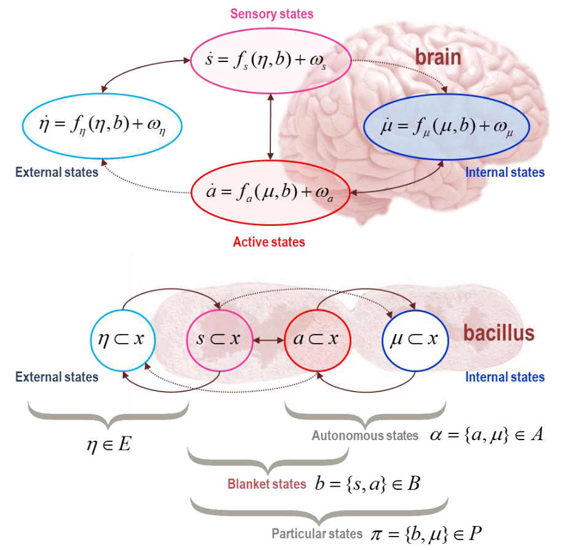
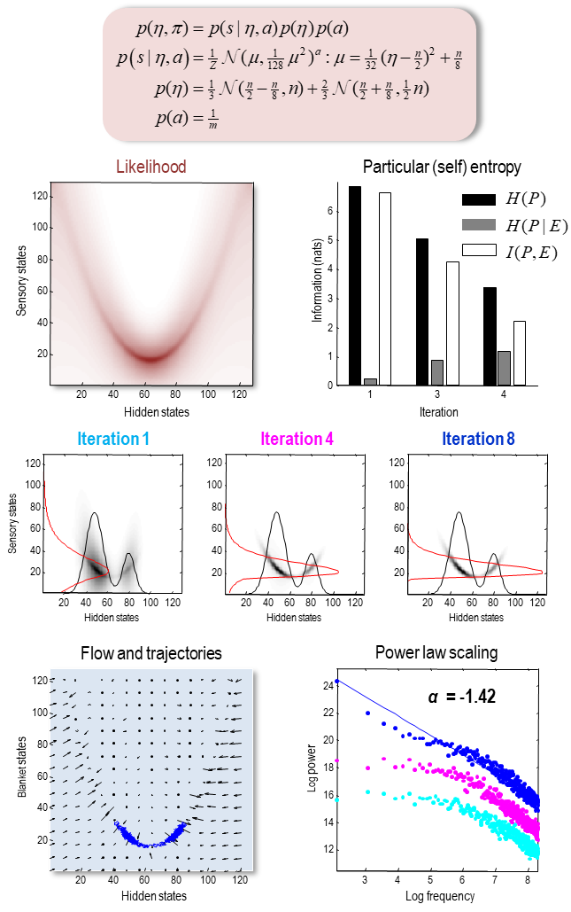
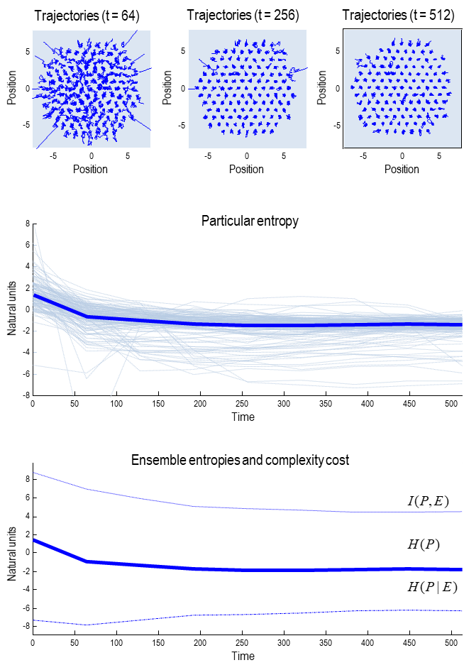
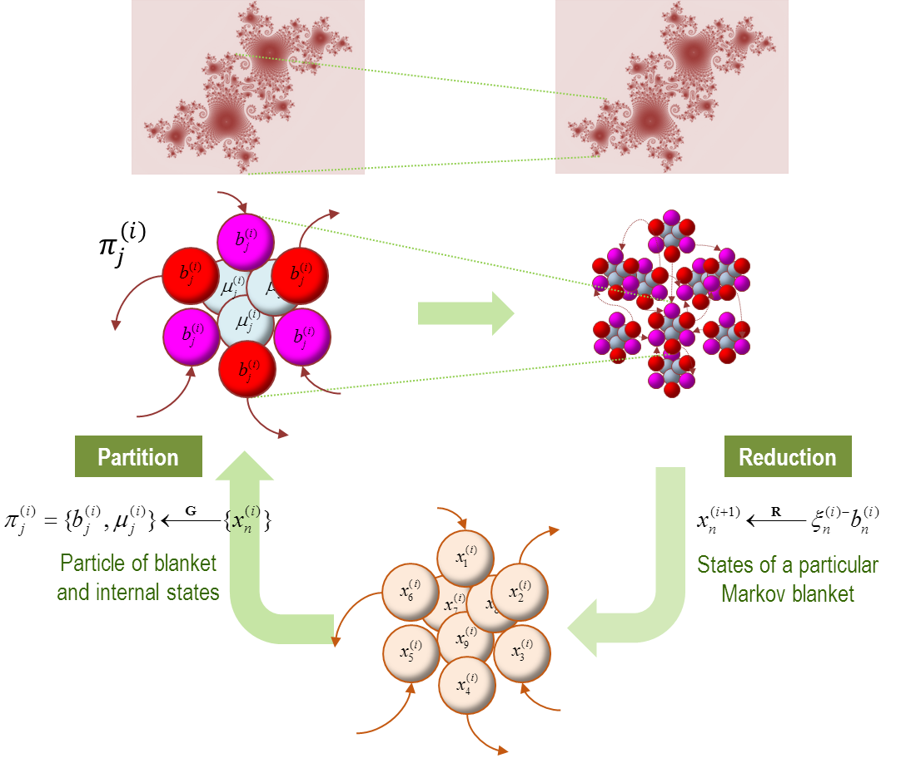
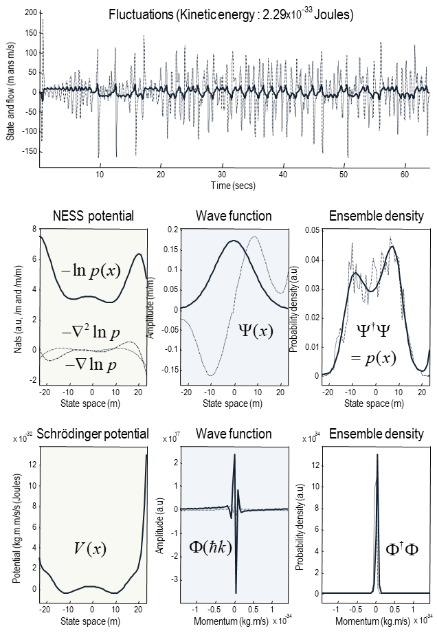
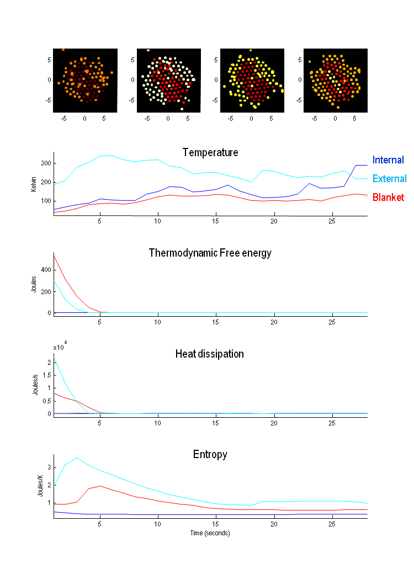
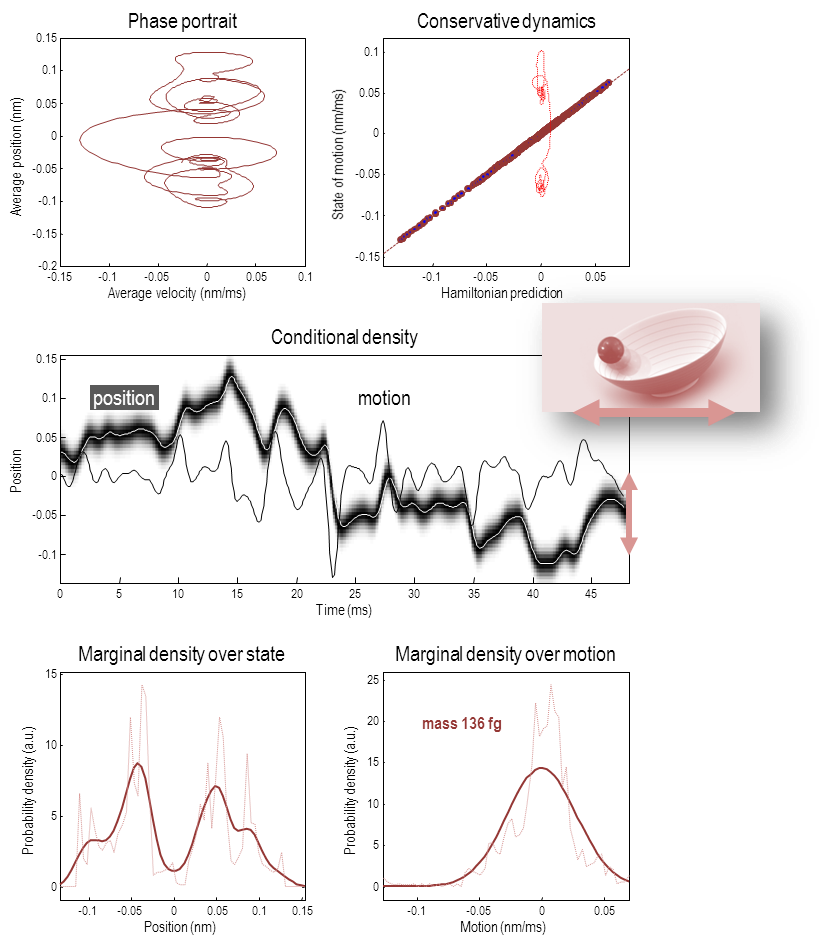
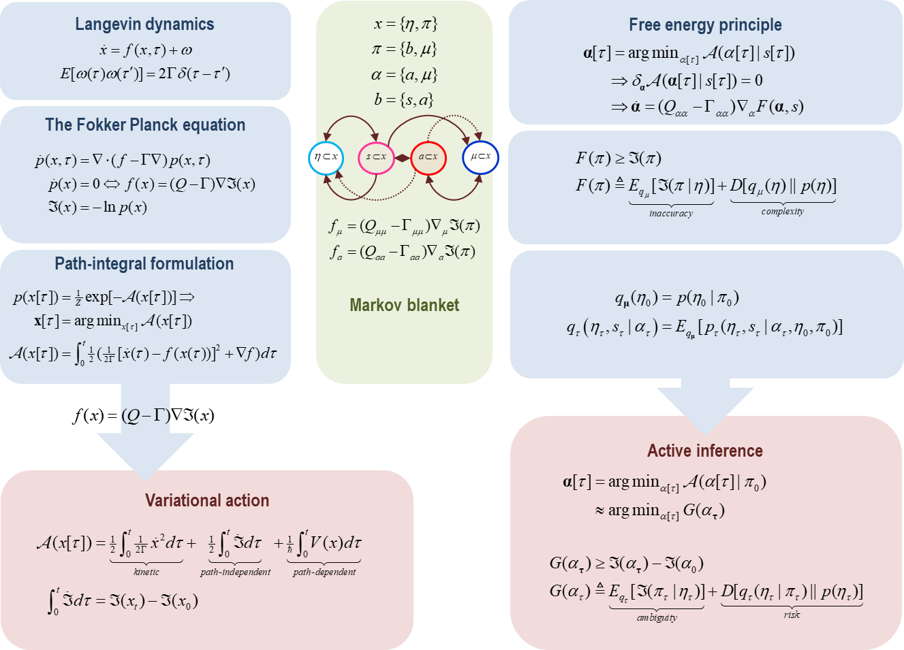
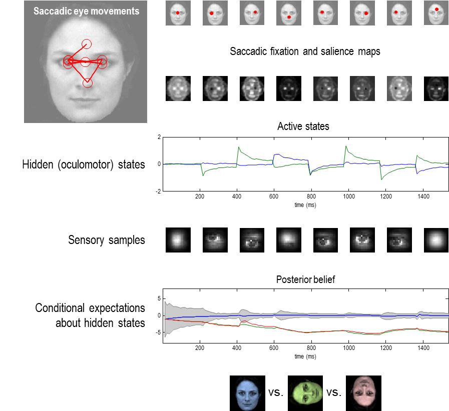

# A Free Energy Principle for A Particular Physics: 어떤 물리학을 위한 자유 에너지 원리

**칼 프리스턴 - Karl Friston**[^note-0]

[^note-0]: The Wellcome Centre for Human Neuroimaging, UCL Queen Square Institute of Neurology, London, UK WC1N 3AR. Email: k.friston@ucl.ac.uk (This work is under consideration for publication by The MIT Press)

## Abstract - 개요

이 원고는 통계적 의미에서 다른 '것'들과 구별할 수 있는 모든 '것'에 대한 이론을 시도합니다. 그 결과로 나타나는 통계적 독립성은 마르코프 담요를 통해 매개되며, 이는 공간적 및 시간적 규모가 점점 높아지는 앙상블(것들의 집합)의 재귀적 구성을 나타냅니다. 이 분해는 작은 것들의 설명을 제공합니다. 예를 들어, 슈뢰딩거 방정식을 통한 양자역학, 통계역학 및 관련 요동 정리를 통해 작은 것들의 앙상블이 고전역학을 통한 큰 것들까지 이어집니다. 이러한 설명은 자율적이거나 활성화된 것들에 대한 베이지안 역학을 보완합니다. 이 작업이 모든 '것'의 형식을 제공하지만, 주요 기여는 비평형 정상상태에서 자기-조직화를 위한 마르코프 담요의 의미를 검토하는 것입니다. 간단히 말해, 우리는 정보 기하학과 함께하는 자유 에너지 원리를 되찾아 어떤 것의 내부 상태를 외부 상태에 대한 추론 또는 표현으로 해석할 수 있게 합니다. 그 결과로 나타나는 베이지안 역학은 양자, 통계, 고전 역학과 호환되며, 생명체와 같은 입자의 정식화된 설명을 제공할 수 있습니다.

**Key words**: *자기-조직화:self-organisation; 비평형 정상상태:nonequilibrium steady-state; 능동 추론:active inference; 능동 입자:active particles; 자유 에너지:free energy; 엔트로피:entropy; 무작위 동적 끌개:random dynamical attractor; 자기생성:autopoiesis; 마르코프 담요:markov blanket; 베이지안:Bayesian; 변분:variational.*

## Introduction - 소개

이 원고는 어떤 '것'이 다른 것과 구별되고, 아무 '것'도 아닌 것과 구별되는 전제에서 시작하여, 조금 농담스럽게 모든 '것'에 대한 이론을 시도합니다. 이 원고의 목표는 물리학(예: 양자, 통계 및 고전 역학)의 구조물에 호소하여 동적 시스템의 공식화을 검증하고, 그 결과로 나오는 수식을 사용하여 동일한 틀 안에서 자기 조직에 대한 설명을 도출하는 것입니다[^note-1]. 우리의 시작점은 불변측도를 가진 시스템의 것들에 대한 정의입니다. 즉, 유인 집합을 가진 약 혼합 시스템입니다. 이러한 시스템의 설명은 일반적으로 무작위 동적 시스템의 형식주의를 사용하여 시작합니다. 예를 들어, 무작위 미분 방정식(예: 랑주뱅 방정식)을 기반으로 한 시스템 상태의 흐름이나 동역학입니다. 여기서 현재의 처리가 시작되고, 그 후 멈춥니다. 그것은 몇 가지 분명한 질문을 하며 멈춥니다. 예를 들어, 상태란 무엇이며, 무작위 요동이 어디서 오는가? 이 질문들은 더 간단한 질문들로 이어집니다. 즉, 우리가 어떤 것의 상태를 다루고 있다면, 그 상태를 가진 것은 무엇이고, 어떻게 다른 것과 구별할 수 있는가? 이 질문들에 대한 답변은 글자 그대로 모든 것에 대한 이론으로 이어집니다.

> [^note-1]:이 논문은 통계물리학의 보완적인 표현들에 대한 저자의 직관을 확실히 하기 위한 자기교육적인 연습으로 작성되었습니다. 결과적으로 이 논문은 길고, 과도하게 포괄적이며, 저자가 전문가가 아닌 다른 분야의 관례를 채택하려고 노력하면서 공통적인 테마를 강조하려고 합니다.

어떤 것들의 본질을 다루기 위해, 우리는 어떻게 어떤 것이 다른 모든 것과 구별될 수 있는지 묻기 시작합니다. 자기조직의 공식화을 추구하면서, 우리는 이러한 분리의 기초로 조건부 독립 개념을 사용합니다. 구체적으로, 어떤 것이 존재하려면 그것을 구성하지 않는 (외부적 또는 외재적) 상태와 통계적으로 분리될 수 있는 (내부적 또는 내재적) 상태를 가져야 한다고 가정합니다. 이러한 분리는 마르코프 담요의 존재를 시사합니다. 즉, 내부 상태와 외부 상태를 조건부로 독립적으로 만드는 상태 집합입니다. 그 것들(즉, 내부 상태와 담요)의 존재는 마르코프 담요를 활성 상태와 감각 상태로 분할해야 함을 시사합니다. 이들은 각각 외부 상태와 내부 상태의 영향을 받지 않습니다. 이것은 약간 임의적으로 들릴 수 있지만, 이것은 상태들에 대한 조건부 독립성의 최소 집합이며, 상태를 가진 것들에 대한 얘기를 허용하는 암시적인 분할입니다. 구체적으로, 이것은 자기조직에서 '자아'를 구성하는 분할을 제공합니다. 이어지는 섹션에서는 다음 분명한 질문을 다룹니다: '것'들이란 무엇인가? 이 시점에서 우리는 무작위 동적 시스템의 랑주뱅 방정식을 마르코프 담요의 관점에서 재귀적으로 자기 확인할 수 있는 답안으로 사용합니다. 간단히 말해, 제안된 공식화는 것들의 상태(즉, 입자)가 담요 상태의 혼합물로 구성되며, 마르코프 담요가 더 작은 규모에서 것들을 둘러싼다고 말합니다. 효과적으로 이것은 더 작은 것들의 마르코프 담요로부터 것들을 구성함으로써 "것이란 무엇인가?"라는 질문을 회피합니다. 귀납적으로, 우리는 모든 방향으로 마르코프 담요를 가지며, 이는 것들의 본질을 명시할 필요가 없음을 의미합니다.

더 구체적으로, 우리는 주어진 공간적-시간적 규모에서의 랑주뱅 동력학 공식화가 마르코프 담요의 앙상블로 분해될 수 있다는 것을 알게 됩니다. 이러한 담요 상태는 더 높은 규모에서 원래 규모의 동력학과 정확히 같은 (랑주뱅) 형태를 가진 동력학을 가집니다. 한 규모에서 다음 규모로 동력학을 올릴 때, 내부 상태는 실질적으로 제거되어 담요 상태의 느린 거시적 동력학만 남깁니다. 이것들은 다음 단계의 것들의 상태가 되며, 그들만의 마르코프 담요를 가지고 있습니다. 이 형식주의의 종착점은 점진적으로 높은 공간적 및 시간적 규모에서의 모든 것에 대한 설명입니다. 암시적인 시간 규모의 분리는 후속 섹션에서 점진적으로 더 큰 것들의 동력학, 물리학 또는 역학의 종류를 검토하는 데 사용됩니다.

이 원고는 기본적인 결과를 확립하는 제1부, 이러한 결과를 동적 시스템의 극한 사례에 적용하여 양자, 통계 및 고전 역학을 되찾는 제2부, 그리고 미립자의 행동에 영향을 주는 내부 상태를 가진 미립자에 대한 베이지안 역학을 통해 활성 또는 자율 시스템의 특수한 경우를 고려하는 제3부로 구성된 3부에 걸쳐 12개의 섹션으로 구성되어 있습니다.

제1부: 섹션 1은 측정 가능한 특성을 가진 마르코프 담요의 동력학에 대한 제약을 도입하는 기초적인 처리입니다. 측정 가능성 제약 – 또는 충분히 긴 시간 동안 불변 척도를 가지고 있는 것 – 은 상태의 흐름을 비평형 정상상태(NonEquilibrium Steady-State; NESS) 밀도의 함수[^note-2]로 표현할 수 있게 합니다. 흐름과 비평형 정상상태 밀도 간의 관계는 밀도 동력학의 폭커-플랑크 방정식과 특히 그 고유 해법에서 직접적으로 따릅니다. 여기서 흥미로운 결과는 비평형 정상상태에서 마르코프 담요로부터 물려받은 시스템의 운동 방정식에서 암시적인 의존성입니다. 그 결과로 나오는 상대적으로 간단한 보조 정리와 조건부 독립성에 관한 따름정리는 이어지는 섹션에서 긴밀한 행동의 기초를 형성합니다. 섹션 2에서는 대칭성 깨짐 및 자기조직 측면에서 밀도 동력학을 특징 짓는 다양한 방법을 살펴봅니다. 이 섹션에서는 정보 이론과 기하학을 사용하여 비평형 정상상태로의 다양한 종류의 자기조직을 특징 짓습니다. 섹션 3에서는 특정 시스템(로렌츠 시스템의 앙상블에 기반한 합성 원시 스프)의 수치 분석을 사용하여 자기조직의 예시를 제공합니다. 이 시스템은 원고 전체에서 동일한 동력학에 대해 상호 보완적인 관점을 취하는 방법을 설명하는 데 사용됩니다. 섹션 4에서는 중첩된 규모에서 마르코프 담요의 이 (랑주뱅) 방정식의 행동을 고려합니다. 간단히 말해, 우리는 더 높은 규모로 올라감에 따라 무작위 및 본질적인 요동이 점진적으로 억제되어, 무작위 요동에 의해 지배되는 에너지 소산 동력학에서 발산이 없는 흐름에 의해 지배되는 대형 시스템의 보존 동력학으로 이동하는 결과가 나타납니다.

> [^note-2]: NESS는 약한 혼합 시스템에서 거의 에르고딕한 안정 상태(Nearly Ergodic Steady-State)의 약자일 수도 있습니다. 제 젊은 동료 브레넌 클레인(Brennan Klein)이 지적했듯이, 평형이 아닌 안정 상태는 "것이라는 상태(thingness)"에 "ness"를 제공합니다(중세 영어에서 -nes, -nesse는 "상태의 존재"를 의미하는 명사를 형성하기 위해 형용사에 첨부됩니다). 우리는 나중에 모든 '존재의 상태'가 NESS에 의존한다는 주장을 할 것입니다.

제2부: 섹션 5에서는 양자역학 측면에서 매우 작은 것들을 고려합니다. 이 섹션에서는 첫 번째 섹션에서 확립된 입자의 흐름과 비평형 정상상태 밀도 간의 관계를 사용하여 슈뢰딩거 파동 방정식을 도출합니다. 여기서의 요령은 비평형 정상상태 밀도를 파동 함수 역할을 하는 (복소수) 근으로 표현하거나 인수분해하는 것입니다. 섹션 6에서는 앙상블 동력학과 확률 열역학 측면에서 작은 것들의 집단 행동을 고려합니다. 여기서의 초점은 앙상블의 소산 동력학을 통계 역학에서의 확립된 결과와 연결하는 것으로, 즉 열역학 법칙과 자르진스키(Jarzynski) 방정식과 같은 관련 요동 정리입니다. 그런 다음 작은 진폭의 무작위 요동에 대한 극한에서 큰 것들의 물리학을 살펴봅니다. 이 극한은 고전적 라그랑지안이나 해밀턴을 사용하여 운동 방정식을 작성할 수 있게 하여, 고전 역학, 뉴턴 운동 법칙 및 맥스웰 방정식으로 이어집니다.

제3부: 무생성 입자의 밀도 동역학을 양자, 통계, 고전 역학의 극한 케이스로 설명한 후, 내부 상태를 무시할 수 없는 자율적 행동을 보이는 큰 것들(예: 우리와 같은 큰 활성 입자)의 존재론에 대해 살펴봅니다. 섹션 8은 생물학적 자기조직에 대표적이거나 추론적 능력을 부여할 수 있는 이유를 논합니다. 다시 말해, 좋은 조절자 이론(Conant and Ashby, 1970)과 베이지안 뇌 가설(Helmholtz, 1878 (1971); Knill and Pouget, 2004)과 같은 개념이 감각 물리학 측면에서 어떻게 실체화될 수 있는지에 대해 설명합니다. 여기서 주장은 상당히 간단한데, 바로 시스템의 내부 상태가 마르코프 담요에 감각적 인상을 남기는 외부 상태에 대한 확률적 신념을 인코딩하며, 활성 상태의 외부 상태에 대한 영향에 의해 발생한다는 것입니다. 이 섹션에서는 자율적인 것들(예: 세포 또는 뇌)이 활동적으로 샘플링된 감각의 원인을 추론하는 것을 설명하는 정보 기하학과 참석하는 자유 에너지 원리에 대한 형식적 기초를 제공합니다. 여기서 우리는 변분 베이즈(Beal, 2003)가 특정 종류의 입자의 출현적 성질임을 보여주어 베이지안 역학의 형태를 구현하는 변분 주제를 추구합니다. 섹션 9는 제1부의 합성 수프(그리고 바이러스와 같은 거주자)에서 수치 분석을 사용하여 특정 추론을 설명합니다. 섹션 10에서는 적분 요동 정리와 예상 자유 에너지를 기반으로한 자유 에너지 원리의 따르는 것들을 통해 활성 상태와 대리를 고려합니다. 마지막 2개 섹션에서는 이전(열역학적) 처리를 고려한 능동 추론을 검토합니다. 양자, 확률, 고전 및 베이지안 역학 간의 관계에 대한 간단한 논의로 마무리합니다.

## Part One: the setup - 1부: 설정

### Something or nothing - 무엇 또는 아닌 것

*"시포냅테라(Siphonaptera)"라는 동요는 때로는 벼룩이라고 불리며, 아래와 같이 알려져 있습니다:
큰 벼룩은 작은 벼룩을 가지고 있어
그들의 등을 물어뜯습니다.
작은 벼룩은 더 작은 벼룩을 가지고 있어
그리고 이런 식으로 무한히 이어집니다.*

'무엇이 사물(thing)인가?'라는 질문에 대한 한 가지 접근법은 무한히 반복되는 과정을 통해 잘 설정됩니다. 이런 반복적 과정에서는 질문 자체가 사라집니다. 이런 타파적 설명[^note-3]은 사물의 상태가 그것의 마르코프 담요에 의해 결정되며, 마르코프 담요는 그 안에 더 작은 마르코프 담요를 가진 더 작은 사물의 상태로 구성된다고 주장합니다. 이렇게 '마르코프 담요가 모든 것을 아래로' 이끈다는 주장은 모든 것에 대한 재귀적인 정의를 제공합니다. 이 정의는 공간적 및 시간적 스케일에서 분리 가능하며, 4장에서는 재정규화 그룹의 개념을 사용하여 해석됩니다. '마르코프 담요가 위아래로 모든 것을 이룬다'는 아이디어는 특정 스케일에 특권이 없음을 나타내며, 다만 질문의 대상이 되는 사물에게 '중요한' 스케일이 존재합니다. 마지막 섹션에서 우리는 '중요한' 것이 특정 스케일에서 정보 기하학이 작용하고 있음을 의미하며, 이는 자율적이고 순회하는 동력학을 제공하지만 충분히 크기 때문에 무작위적인 요동을 억제한다는 것을 알게 될 것입니다.

> [^note-3]: 아리스토텔레스가 우주의 모든 움직임의 주요 원인으로 제시한 최초 움직이는 원인(라틴어: primum movens)을 해소할 수도 있는 설명입니다. 그의 '형이상학'의 12권에서 아리스토텔레스는 최초 움직이는 원인을 완벽한 미, 불가분, 그리고 완벽한 성찰만을 수행하는 것으로 묘사합니다: 그 자체를 성찰하는 것입니다.

더 기술적인 설명을 하기전에, 기본적인 이야기는 상식적인 예를 들어서 설명할 수 있습니다. 천체의 위치, 속도, 및 방사 에너지에 의해 충분히 설명되는 태양계를 상상해 보세요. 이런 양들은 각 천체의 표면(즉, 마르코프 담요)의 앙상블 평균을 구성하며, 내부 상태는 그 아래에서 요동합니다. 이제 우리가 스케일을 내려가 특정한 행성(예를 들어, 지구)에 초점을 맞추면, 이 스케일에서는 행성 표면의 기상 흐름과 지형이 적절한 수준의 설명을 구성하며, 많은 (내부) 미세 상태가 그 아래에 있습니다. 이제 우리가 도시로 확대하여 이러한 미세 상태에 접근할 수 있게 되면, 이것이 대도시의 일일 주기 동안 통근자들의 증감을 구성하게 됩니다. 이제 우리는 한 단계 더 내려가서, 이전에 통근자들의 평균 행동에 기여하던 각 요소가 자신만의 마르코프 담요를 가진 개인 또는 개체임을 알게 됩니다. 즉, 실제로 뇌입니다. 이 설명 수준에서, 뇌의 섬세하고 구조적인 내부 작동의 요동은 마르코프 담요 뒤에 숨어 있지만, 우리가 더 확대하면, 이제 통근자 행동을 조정하던 신경 세포 요소와 과정의 마르코프 담요가 됩니다. 여기서 마르코프 담요는 세포 표면에 해당하며, 이것 자체가 내부 또는 내세포 과정, 즉 자신의 마르코프 담요를 가진 내세포 소기관 간의 교환을 둘러싸고 있습니다. 대분자부터 원자 및 아원자 수준까지 계속 내려갈 수 있다고 상상할 수 있습니다. 각 단계에서, 우리는 질문하는 수준의 사물의 마르코프 담요와 소통하고 연결하기 위해 제시되는 앙상블의 상태에 따른 충분한 설명 수준을 발견합니다. 중요한 것은, 각 마르코프 담요 아래(또는 마르코프 담요 뒤에 숨겨진)에는 자체적으로 (담요 상태의 혼합으로 구성된) 내부 또는 고유한 상태들이 있습니다. 다음에서, 우리는 이 이야기를 (바닥에서 위로) 다시 이야기하면서, 이 계층적 설명 수준이 마르코프 담요를 가진 어떤 (약하게 혼합된) 무작위 동적 시스템의 필연적 결과라는 것을 보여주려고 노력할 것입니다. 그러나 먼저, 이후 섹션에서 채택된 다른 관점을 연결하는데 필요한 몇 가지 사전 준비와 배경 자료를 고려하겠습니다.

#### Some preliminaries - 몇 가지 사전 준비

이 섹션은 물리학의 기초적인(서론적인) 처리로 읽을 수 있습니다. 이는 엄밀하지는 않지만 기본적인 아이디어를 전달하는데 충분합니다. 일부 주장과 보조정리를 설명하기 위해, 각 섹션은 수치 예제와 그림 설명문에 상세한 설명이 포함되어 있습니다[^note-4]. 수치 분석은 로렌츠 시스템(Lorenz, 1963)에 기반한 확률적 혼돈이나, 활성 물질을 시뮬레이션하기 위해 담요 상태로 꾸민 로렌츠 시스템의 앙상블을 사용하여 다양한 현상을 보여줍니다. 이러한 예제들은 수학이 복잡해 보일 수 있지만, 그것이 이치에 맞는, 긴밀한 현상을 설명한다는 것을 강조하려고 합니다.

> [^note-4]:이 수치 분석들은 두 가지 목적을 가지고 있습니다. 첫째, 서로 보완적인 관점에서 동일한 시스템을 어떻게 특성화할 수 있는지 보여줍니다. 예를 들어, 우리는 시스템을 작은 입자(예: 전자)로, 양자역학의 관점에서 다룰 수 있습니다; 또는 입자의 집합체(예: 가스)로서 시스템을 다루어 통계 역학을 검토할 수 있습니다; 또는 어떤 활성 매질에서의 덩어리 질량(예: 공)으로 시스템을 다루고, 고전역학의 관점에서 그 반응을 묘사할 수 있습니다. 세 번째 부분에서는 이를 더 발전시켜 자율적인 행동, 즉 시스템의 한 부분이 다른 부분을 어떻게 적극적으로 추론하거나 '측정'하는지를 살펴볼 것입니다. 두 번째 목적은 보다 교육적인 측면(생물학 독자를 위한)을 가지고 있습니다; 즉, 이 시뮬레이션들은 고급 물리학 주변의 모든 신비주의를 해소합니다. 요컨대, 이 모노그래프에서 고려된 모든 역학은 직관적이고 간단한 수치 분석에 적합하며, 한 종류의 역학이 다른 역학과 어떤 관계에서 이해될 수 있게 합니다.

수학적 표기법은 대체로 표준적입니다: 양자역학에 관한 절에서는 가끔 디랙 표기법을 사용하고, 통계역학에 관한 절은 (Seifert, 2012)를 따릅니다. 가끔, 텐서를 다룰 때 (아인슈타인) 합산 규약을 사용할 것입니다. 표준 표기법에 대한 예외는 굵은 변수의 사용입니다; 여기서 $x \in X$ 는 위상 또는 상태 공간에서의 (일반화된) 좌표를 나타내며, $x \in X$ 는 기대값 또는 가장 가능성이 높은 값을 나타냅니다. $x(a)$ 는 변수 a에 조건을 달아 기대값을 나타냅니다. 굵은 대문자 $X$ 는 연산자를 나타냅니다. 명확성을 위해, 함수 미분과 시간을 포함하는 적분은 궤적, 경로 또는 경로 $x[\tau]={x(\tau):\tau\in[0,t]}$ 의 형태로 표현되며, 여기서 시간 $\tau$에서의 값은 $x(\tau)\equiv x_\tau$로 표시됩니다. 또한 시간에 따라 변하는 확률 밀도 $p(x,\tau)\equiv p_\tau(x_\tau)$를 다룰 것이며, 이것은 $\tau \to \infty$ 한계에서의 정적 또는 안정적 - 상태 해결책 $p(x,\infty) \equiv p(x)$를 갖습니다; 마찬가지로, 그들의 음의 로그 밀도 또는 놀라움 $\Im (x,\tau) \equiv \Im _\tau (x _\tau) = −\ln \space p(x,\tau)$ 에 대해서도 마찬가지입니다. 참조의 편의성을 위해, 용어와 표현의 용어집이 본문의 끝에 제공됩니다. 이어지는 대부분의 내용은 확률 동역학의 세 가지 동등하고 상호 보완적인 설명, 즉 랑주뱅 방정식, 경로 적분 형식, 포커-플랑크 방정식에 의존합니다.
랑주뱅 동역학: 이 형식은 시스템 상태 $x(\tau)$ (즉, 어떤 시스템의 상태)의 동역학을 상태 종속적인 흐름과 일부 무작위 요동 $\omega (\tau)$ 로 표현합니다 :

__랑주뱅 동역학__: 이 방정식은 상태에 따라 달라지는 흐름과 일부 무작위 변동 $\omega (\tau)$ 를 사용하여 시스템 상태 $x(\tau)$ (즉, 시스템의 상태)의 동역학을 표현합니다:

$$
\begin{equation}\tag{1.1}
\begin{drcases}
\begin{aligned}
\dot{x} (\tau) & = f(x,\tau) + \omega \\
E[\omega(\tau)] & = 0 \\
E[\omega(\tau) \cdot \omega(\tau-t)] & = 2\Gamma \rho(\tau)
\end{aligned}
\end{drcases} \Rightarrow p(\dot{x}|x,\tau) = \mathcal{N}(f,2\Gamma)
\end{equation}
$$

여기서, 충분히 빠르게 요동하는 상태 그 자체와 관련하여 시간 상관성을 무시할 수 있다는 가정 하에, 무작위 요동은 공분산 $2\Gamma$를 가진 정규 분포를 따릅니다. 이 방정식은 이후의 모든 것을 뒷받침 합니다. 4장에서는 랑주뱅 동역학이 어디서 비롯되었는지, 그리고 무작위 요동이 가우시안이며 상관관계가 없는 이유에 대해 좀 더 자세히 살펴볼 것입니다.

**경로 적분 공식화:** 이 공식화는 위의 랑주뱅 동역학에 의해 생성된 경로 또는 궤적 $x[\tau]$을, $x(0) \equiv x0$에서 다룹니다:

$$
\begin{equation}\tag{1.2}
\begin{aligned}
\Im(x[\tau]) & \triangleq - \ln \space p(x[\tau]) = \mathcal{A}(x[\tau]) \\
\mathcal{A}(x[\tau]) & = \int_0^t \mathcal{L}(x,\dot{x}) d\tau \\
\mathcal{L}(x,\dot{x}) & = \tfrac{1}{2}[(\dot{x}-f) \cdot \tfrac{1}{2\Gamma}() + \nabla \cdot f] \\
&= \tfrac{1}{4\Gamma}\dot{x}\cdot\dot{x} - \tfrac{1}{2\Gamma}f\cdot\dot{x} + \tfrac{1}{h}V(x) \\
V(x) & = \tfrac{h}{4\Gamma}f\cdot f + \tfrac{h}{2} \nabla \cdot f
\end{aligned}
\end{equation}
$$

이 공식화는 궤적과 관련된 _행동_ 의 관점에서 경로의 확률을 표현합니다. 이것은 경로의 동작(즉, 행동)의 놀라움(즉, 음의 로그 확률)이 상태 공간의 각 점에서 예상되는 흐름과 경로의 동작의 차이에 기반하여 궤적을 따라 축적된 놀라움이라는 것을 말합니다. 무작위 요동에 대한 가우스 가정 하에, 각 점에서의 놀라움(즉, _라그랑지안_)은 간단한 이차 형태를 가지며, 스트라토노비치 적분의 암시적 사용으로 인해 추가적인 발산 항이 발생합니다(Seifert, 2012). 이 항에 대한 설명은 부록 A를 참조하십시오. 여기서, 우리는 나중에 양자 역학에서 중요한 역할을 할 슈뢰딩거 퍼텐셜의 관점에서 라그랑지안을 표현했습니다. 이 퍼텐셜은 흐름에 의존하며, 오직 흐름에만 의존합니다. 비양자 처리에서는 일반적으로 플랑크 상수를 $\hbar=1$로 설정합니다.

사물들이 어떻게 행동하는지의 특성화에 나타날 라그랑지안의 르장드르 변환인 _해밀토니안_ 을 소개하는 것이 유용할 것입니다:

$$
\begin{equation}\tag{1.3}
\begin{aligned}
\mathcal{H}(x,\dot{x}) & =\dot{x}\tfrac{\partial \mathcal{L}}{\partial \dot{x}}-\mathcal{L}(x.\dot{x})=\dot{x}\cdot p - \mathcal{L}(x,\dot{x}) \\
&= \tfrac{1}{4\Gamma}\dot{x}\cdot\dot{x} + \tfrac{1}{h}V(x) \\
\\
p & \triangleq \tfrac{\partial \mathcal{L}}{\partial \dot{x}} = \tfrac{1}{2 \Gamma}(\dot{x}-f)
\end{aligned}
\end{equation}
$$

여기서 마지막 방정식은 일반화된 _운동량_ 을 정의합니다. 무작위 요동이 가장 가능성이 높은 값인 0을 취할 때 가장 가능성이 높은 경로가 얻어진다는 점을 주목하십시오:

$$
\begin{equation}\tag{1.4}
\dot{x} = f(x) \Rightarrow \mathcal{H}(x,\dot{x}) = \mathcal{L}(x,\dot{x}) = - \tfrac{1}{2} \nabla \cdot f(x)
\end{equation}
$$

이는 가장 가능성이 높은 경로에 따른 해밀턴이 흐름의 발산으로 감소한다는 것을 의미합니다. 또한, 발산이 없는 흐름을 가진 보존 시스템(즉, 무시할 만큼 작은 무작위 요동)에서는 해밀턴이 어디에서나 0입니다. 이는 해밀토니언이 보존(즉, 고전) 역학을 특징짓는데 중요하다는 것을 보여줍니다. 마지막으로, 경로 종속적인 위상 측정치 $\Omega (x)$는 주어진 초기 밀도, $p_0(x_0)\equiv p(x,0)$에 대한 다음의 경로 적분에서 평균화될 수 있습니다:

$$
\begin{equation}\tag{1.5}
E_{p(x[\tau],x_0)}[\Omega(x)] = \int dx_0 \int dx[\tau][\Omega(x[\tau])p(x[\tau]|x_0)p_0(x_0)]
\end{equation}
$$

이것으로 경로 적분 형식에서의 주요 결과를 마칩니다.

**포커-플랑크 방정식:** 이 형식은 상태들에 대한 확률 밀도를 다루며, 이는 시간 $\tau$에 시스템이 상태 $x$에 있을 확률을 설명합니다. 랑주뱅 방정식 시스템이 주어지면, 다음과 같이 밀도 동력학을 설명할 수 있습니다:

$$
\begin{equation}\tag{1.6}
\begin{aligned}
\dot{p}(x,\tau) &= Lp(x,\tau) = - \nabla \cdot j(x,\tau) \\
L &= \nabla \cdot (\Gamma \nabla - f) \\
j(x,\tau) &= f(x,\tau)p(x, \tau) - \Gamma \nabla p(x,\tau)
\end{aligned}
\end{equation}
$$

여기서 $L$은 포커-플랑크 연산자이며, $j(x,\tau)$는 확률질량의 흐름을 편리하게 요약하는 확률 흐름입니다. 이는 흐름에 의존하는 항과 (보통 반대 방향의) 확률 기울기에 따른 무작위 변동에 의해 생성되는 부분을 포함합니다.
#### Nonequilibrium steady states - 비평형 정상상태

밀도 역학의 포커-플랑크 형식을 갖추고 나면 이제 어떤 무작위 동적 시스템의 비평형 장기 동작을 고려할 수 있습니다. 시스템이 약하게 혼합되어 있기 때문에 충분한 시간이 지난 후에는 풀백(pullback) 또는 무작위 전역 끌개라고 하는 불변 상태 집합으로 수렴할 것입니다. 끌개는 그 자체가 무작위 집합인 경우(random set) 때문에 무작위로 나타납니다(Crauel, 1999; Crauel and Flandoli, 1994). 관련된 비평형 정상상태 밀도 p(x)는 포커-플랑크 방정식의 해입니다(Frank, 2004). 식 (6)은 비평형 정상상태 밀도가 흐름에 의존하며, 이는 항상 회전과 발산이 없는 구성 요소로 표현될 수 있음을 보여줍니다. 이것이 헬름홀츠 분해(Helmholtz decomposition, 벡터 미적분학의 기본 정리라고도 함)이며, 이는 대칭이 아닌 행렬 $Q = -Q^T$와 스칼라 퍼텐셜 $\Im(x)$의 용어로 구성될 수 있습니다(Ao, 2004)[^note-5].

> [^note-5]:간단하게 하기 위해, 우리는 $Q = -QT$가 $x$에 따라 변하지 않는다고 가정하겠습니다, 적어도 지역적으로는 말이죠. 더불어, 요동의 진폭은 구형이라고 가정되므로, 우리는 $\Gamma$를 스케일링된 항등 행렬 또는 스칼라 양으로 취급할 수 있습니다.

$$
\begin{equation}\tag{1.7}
f =(Q-\Gamma)\nabla\Im
\end{equation}
$$

이 표준 형식을 사용하면(Yuan 등, 2010), $p(x) = exp(-\Im(x))$가 포커-플랑크 방정식의 해임을 간단하게 보여줄 수 있습니다(Friston and Ao, 2012). 정보 이론에서 스칼라 퍼텐셜 $\Im(x) = -\ln p(x)$는 자기 정보, _놀라움_ 또는 더 간단하게는 놀라움(surprise)으로 알려져 있습니다(Jones, 1979; Tribus, 1961). 이는 우리가 비평형 정상상태 밀도 또는 놀라움에 따라 흐름을 표현할 수 있음을 의미하며, 이는 부록 B의 비평형 정상상태 정리와 (Friston, 2013)에 따릅니다:

$$
\begin{equation}\tag{1.8}
\begin{aligned}
f & = (\Gamma - Q)\nabla\ln p(x) \\
 & \Rightarrow \tfrac{p(x)}{j(x)} = -Q\nabla \ln p(x) \Rightarrow \dot{p}(x) = 0 \\
 \space \\
\Im(x) & = - \ln \space p(x) \\
f(x) & = (Q-\Gamma)\nabla\Im(x) \\
\nabla \cdot f(x) & = - \Gamma \nabla^{2}\Im(x)
\end{aligned}
\end{equation}
$$

이것이 이 모노그래프의 대부분을 지지하는 핵심 결과입니다. 이것은 무작위 동적 시스템의 흐름이, 비균형 안정 상태에서, 직교하는 구성 요소를 포함한다고 말합니다: 불균형 안정 상태 밀도의 로그 그래디언트를 상승하는 소산 흐름과, 해당 등고선에서 순환하는 보존적인(발산이 없는) 솔레노이드 흐름입니다. 직관적으로, 소산적인(curl이 없는) 흐름은 무작위 요동에 의해 그렇지 않으면 발생할 밀도의 분산을 반대로합니다. 이는 유일하게 남아 있는 확률 흐름이 솔레노이드라는 것을 의미합니다. 나중에 우리는 이 간단한 결과가 상태의 다양한 부분 집합의 흐름을 고려할 때 놀라운 함의를 가지고 있다는 것을 알게 될 것입니다. 이들은 조건부로 독립적입니다. 이 특정 구조는 모든 이후를 지지하는 두 번째 주요 개념인 마르코프 담요 개념에 기반을 두고 있습니다.

다음 단계는 포커-플랑크 방정식의 비평형 정상상태 해를 경로 적분 형식에 대입하여, 놀라움의 관점에서 표현된 작용을 통해 어떤 궤적의 확률을 표현하는 것입니다. 식 (2)와 식(8)에서 이것은 다음을 제공합니다:

$$
\begin{equation}\tag{1.9}
\begin{aligned}
\mathcal{A}(x[\tau]) 
  &= \int_0^t \mathcal{L}(x,\dot{x})d\tau \\
\mathcal{L}(x,\dot{x})
  &= \tfrac{1}{2}[\tfrac{1}{2\Gamma}(\dot{x} - Q\nabla\Im)\cdot(\dot{x}-Q\nabla\Im) + \dot{x}\cdot\nabla\Im + \Gamma(\tfrac{1}{2}\nabla\Im\cdot\nabla\Im - \nabla^{2}\Im)] \\
\mathcal{H}(x,\dot{x})
  &= \tfrac{1}{2}[\tfrac{1}{2\Gamma}(\dot{x} - Q\nabla\Im)\cdot(\dot{x}-Q\nabla\Im) - \Gamma(\tfrac{1}{2}\nabla\Im\cdot\nabla\Im - \nabla^{2}\Im)] \\
\end{aligned}
\end{equation}
$$

이 결과는 솔레노이달 흐름과 그래디언트 흐름이 직교한다는 사실을 사용합니다, 즉 $ Q \nabla \Im \cdot \Gamma \nabla \Im $. 식 (9)는 기본적으로 평형상태가 아닌 동력학의 경로적분 표현입니다. 이는 어떤 궤적의 확률을 상태 공간을 통한 경로적분의 라그랑지안으로 표현하며, 여기서 라그랑지안은 운동과 놀라움 (즉, 비평형 정상상태 퍼텐셜)을 통해 표현될 수 있습니다.

중요한 점은, 식 (9)의 세 항이 무작위 변동의 진폭에 대해 다르게 의존한다는 것입니다. 이 의존성은 우리가 솔레노이달 흐름이 없는 1차원 시스템의 표현을 고려하면 더욱 명확하게 볼 수 있습니다:

$$
\begin{equation}\tag{1.10}
\begin{aligned}
\mathcal{A}(x[\tau])
  &= \underbrace{
    \tfrac{1}{2}\int_0^t\tfrac{1}{2\Gamma}\dot{x}^2 d \tau
    }_{\text{kinetic}}+
    \underbrace{
      \tfrac{1}{2} \int_0^t \dot{\Im} d \tau
    }_{\text{path-independent}}+
    \underbrace{
      \tfrac{1}{h}\int_0^t V(x) d \tau
    }_{\text{path-dependent}} \\
\int_0^t \dot{\Im} d \tau
  &= \Im\left(x_t\right)-\Im\left(x_0\right) \\
V(x)
  &=\tfrac{h}{2} \Gamma\left(\tfrac{1}{2} \nabla \Im \cdot \nabla \Im-\nabla^2 \Im\right)
\end{aligned}
\end{equation}
$$

이것은 어떤 경로의 행동을 운동에 의존하는 (운동에너지) 항, 변화하는 놀라움에 의존하는 (경로에 독립적인) 항, 그리고 요동의 진폭에 비례하는 (경로에 종속적인) 항의 형태로 표현될 수 있다는 것을 의미합니다. 부록 C에서는 기대 라그랑지안과 관련된 해밀턴이 간단하게 다루어져 있습니다

여기서 중요하게 주목해야 할 것은 식(10)의 첫 번째 항이 운동 에너지의 형태를 가지며, 여기서 요동의 진폭은 역질량의 역할을 합니다. 두 번째 항은 단순히 (비평형 정상상태) 퍼텐셜 차이이며, 세 번째 (슈뢰딩거 퍼텐셜) 항은 요동의 진폭에 비례하여 증가합니다. 이는 요동이 크면 상태가 무시할 만한 질량을 가진 것처럼 행동하고 슈뢰딩거 퍼텐셜이 지배적이라는 것을 의미합니다. 반대로,작위 진동의 진폭이 무시할 만큼 작으면 첫 번째와 두 번째 항이 우세하게 되어 행동을 운동에너지와 퍼텐셜 항으로 분해할 수 있습니다. 이 양대 주장은 나중에 양자와 고전 역학 사이의 구별로 나타날 것입니다. 식(10)은 $\hbar = 0$이면 슈뢰딩거 퍼텐셜의 기여가 사라진다는 것을 제안합니다 (파인먼, 1948). 그러나 이 논문에서는 플랑크 상수를 비례 상수로 취급합니다(이것은 요동의 진폭에 특정 단위를 부여합니다), 따라서 그들의 진폭이 0으로 수렴할 때 고전적인 한계가 도달됩니다; 즉, $\Gamma = 0$.

이 한계에서, 고전적인 경로는 최소 행동의 변분 원칙으로 설명할 수 있는 가장 가능성이 높은 경로입니다:

$$
\begin{equation}\tag{1.11}
\begin{aligned}
\delta_x\mathcal{A}(Xx[\tau]) &= 0 \\ 
&\Rightarrow \dot{x}(\tau) = f(x(\tau)) \\
&\Rightarrow x[\tau] = argmin_{x[\tau]} \mathcal{A}(x[\tau])
\end{aligned}
\end{equation}
$$

이것은 가장 가능성이 높은 경로가 행동을 최소화하여 경로에 대한 그것의 변화를 0으로 만든다는 것을 의미합니다. 중요한 것은, 비평형 정상상태에서, 행동에 대한 경로에 의존적이고 독립적인 기여는 놀라움(놀라움)과 그 기울기의 형태로 표현될 수 있다는 것입니다. 우리는 이 비평형 정상상태 동력학의 결과를 여러 다른 설정에서 활용할 것입니다. 시너제틱스와 패턴 형성의 처리에서, 이 최소 행동 원칙은 때때로 에너지 기울기의 파괴로 표현됩니다 (Tschacher와 Haken, 2007).

#### Fluctuations and information length - 요동과 정보 길이

_"시간은 현재를 주어진 상황에서 과거와 독립적인 미래를 설계하도록 구성되어 있다"_ (카티차, 2015b) p6116

우리는 확률 측정과 미분 기하학에서 상속하는 척도에 대한 측정 둘 다에 관심이 있을 것입니다. 이 섹션은 확률 이론에 미분 기하학을 적용할 때 발생하는 길이와 정보 기하학에 대한 간략한 배경을 제공합니다. 여기서의 주요 메시지는 이 모든 측정들이 깊은 방식으로 시간에 의존한다는 것입니다.

이 서문의 일환으로, 무작위 변동의 특성을 고려하는 것이 유용합니다. 나중에 이러한 변동들이 매우 빠르게 변하는 상태의 혼합물이며, 이들 상태 자체가 느린 변수의 역할을 하는 것을 볼 수 있을 것입니다. 이런 의미에서, 무작위 변동은 (정의상) 느린 상태와 상관이 없는 빠른 상태일 뿐입니다. 빠른 상태와 느린 상태의 암시적인 통계적 독립성은 우리가 '무작위' 변동에 대해 이야기할 수 있는 권한을 부여합니다.

(1.1)의 랑주뱅 동역학의 형태는 이러한 시간 스케일의 분리를 보여줍니다. 예를 들어, $\Gamma$의 단위(초당)는 그것이 속도 상수의 역할을 하는 것을 제안합니다. 실제로, 한 가지 관점에서 보면, 변동의 진폭은 변동으로 인한 상태의 분산 또는 분산이 시간에 따라 얼마나 빠르게 축적되는지에 해당합니다(Cox and Miller, 1965). 더욱이, 정상 상태에서는 진폭이 기본적으로 (느린) 상태의 흐름을 놀라움의 경사에 결합시키는 속도 상수입니다. 다시 말해, 주어진 비평형 정상상태 밀도에 대해, 흐름은 변동의 진폭에 비례하여 증가합니다. 이것은 길이 개념을 도입하여 공식화할 수 있습니다:

$$
\begin{equation}\tag{1.12}
\begin{aligned}
\ell = \int_0^T \sqrt{ \dot{x}(\tau)^{i} g_{ij} \dot{x}(\tau)^j } dt
\end{aligned}
\end{equation}
$$

여기서 우리는 (아인슈타인) 합산 규칙을 사용했으며, 반복된 첨자와 아래 첨자에 대한 암시적인 합산이 있습니다. 식 (12)는 메트릭 텐서 $g_{ij}$가 제공하는 리만 메트릭을 사용하여 경로의 길이를 표현합니다. 지역적으로 최소 거리의 경로는 적위선(_geodesics_)이라고 불리며, 유클리드 공간에서의 직선의 아날로그입니다. 식 (10)에서, 낮은 진폭의 변동의 클래식한 한계에서 경로의 행동은 경로 길이의 상한선으로 해석될 수 있습니다 (코시-슈바르츠 부방정식에 의해):

$$
\begin{equation}\tag{1.13}
\begin{aligned}
 \lim_{Q,\Gamma \rightarrow 0}\mathcal{A}(x[\tau]) &= \int_0^T \dot{x}(\tau)^{i} g_{ij} \dot{x}(\tau)^j dt \geq \ell^2 \\
g &= \tfrac{1}{4\Gamma}
\end{aligned}
\end{equation}
$$

간단히하기 위해, 우리는 회전형 흐름을 무시했습니다. 이것은 만약 길이가 무작위 요동의 정밀도(즉, 공분산의 역수)의 용어로 측정된다면, 가장 가능성이 높은 (클래식한) 경로는 가장 짧을 것이라는 것을 제안합니다. 동일하게, 정밀도는 상태 공간에 대한 기하학을 제공하는 리만 메트릭을 제공하며, 이는 요동이 큰 진폭을 가질 때 점들이 서로 가깝습니다. 무작위 요동의 진폭과 메트릭 텐서 간의 동등성은 우리의 단순화 가정인 무작위 요동의 진폭이 구형(즉, 모든 방향에서 똑같이 보이는)이라는 것을 근거로 합니다. 이는 좌표 선택에 불변인 리만 메트릭을 가진 대칭 상태 공간에서 작업하는 것과 동일합니다.

이 메트릭 처리를 더 나아가서, 밀도의 충분한 통계량(즉, 매개변수)의 공간을 정보 기하학으로 갖추게 할 수 있습니다. 간단히 말해서, 정보 기하학은 통계적 다양체에서 거리를 측정하는 데 사용될 수 있는 리만 메트릭에 근거합니다(Amari, 1998; Ay, 2015). 통계적 다양체란 각 점이 확률 밀도를 나타내는 메트릭 공간입니다. 즉, 매개변수 공간의 점들은 확률 밀도의 충분한 통계량에 해당하며, 통계적 다양체의 가까운 점들은 유사한 밀도에 해당합니다. 예를 들어, 가우시안 밀도의 통계적 순간(즉, 평균과 정밀도)에 의해 생성된 이차원 공간은 일반적인 통계적 다양체를 구성합니다. 통계적 다양체의 특별한 점은 항상 메트릭 텐서를 갖추고 있으며, 이는 피셔 정보 메트릭의 형태로 제공됩니다.

현재의 상황에서는 (Crooks, 2007)에 따라, 피셔 정보를 메트릭으로 사용하는 정보 길이를 통해 체계적인 밀도 동역학을 특성화할 수 있습니다. 밀도를 시간에 독립적인 집합 변수 또는 모드 $\zeta_i(x)$와 시간에 종속적인 충분한 통계적 역할을 하는 공액 변수 $\lambda(\tau)$로 분해하는 것을 고려해보세요 [^note-6] :

> [^note-6]: 우리는 Z를 분할 함수 또는 정규화 상수를 나타내는 데 사용할 것입니다. 

$$
\begin{equation}\tag{1.14}
\begin{aligned}
\Im(x,\tau) = \lambda^i (\tau)\zeta_i (x) + \ln Z
\end{aligned}
\end{equation}
$$

이 매개변수화 하에, 피셔 정보 메트릭 $I(\lambda)$는 다음과 같습니다:

$$
\begin{equation}\tag{1.15}
\begin{aligned}
\ell 
  &= \int_0^t \sqrt{g_{ij}\dot{\lambda}^{i}\dot{\lambda}^{j}} d\tau \\
g &= I(\lambda) \Leftrightarrow g_{ij} 
   = cov(\zeta_i(x),\zeta_j(x)) 
   = E\Bigg[\frac{\partial\Im}{\partial\lambda^{i}} \frac{\partial\Im}{\partial\lambda^{j}} \Bigg] 
   = \frac{\partial D[p_{\lambda^{'}}(x)||p_{\lambda}(x)]}{\partial\lambda^{'i}\partial\lambda^{'j}}\Biggm\vert_{\lambda^{'} = \lambda}
\end{aligned}
\end{equation}
$$

주목할 점은 정보 기하학이 상태 공간 그 자체가 아니라 상태에 대한 밀도를 매개변수화하는 공액 변수 공간에 있다는 것입니다. 이 공간은 통계적 다양체이며, 그 기하학은 나중에 베이지안 역학의 중심적인 측면이 될 것입니다. 현재로서는 정보, 기하학, 통계 역학 간의 깊은 관계를 예고하고 있습니다 (Crooks, 2007; Kleeman, 2014).

(1.15)의 마지막 방정식은 두 확률 분포 사이의 발산의 두 번째 도함수를 단순하게 계산함으로써 확인할 수 있습니다. 이 확률 분포들은 무한히 가까이 있으며, 여기서 $\lambda^{'}=\lambda+d\lambda$ 입니다. 이는 통계적 다양체 위에서 정보 길이가 매개변수화된 밀도가 빨리 변할 때 더 빨리 축적된다는 것을 의미합니다. 이 해석은 또한 통계적 다양체에서 작은 이동 $d\lambda\rightarrow 0$ 에 대한 연속적인 밀도 간의 발산(제곱근)의 축적으로 정보 길이를 설명하는 것을 허용합니다.

$$
\begin{equation}\tag{1.16}
\begin{aligned}
\ell 
  &= \int d \ell \\
d\ell^2 
  &= g_{ij}d\lambda^j d\lambda^i \\
\frac{1}{2}d\ell^2 
  &= D[p_{\lambda^{'}}(x)||p_{\lambda}(x)] 
   = \frac{1}{2} \frac{\partial D[p_{\lambda^{'}}(x)||p_{\lambda}(x)]}{\partial\lambda^{'i} \partial\lambda^{'j}}\Biggm\vert_{\lambda^{'}=\lambda} d\lambda^j \lambda^i \\
\end{aligned}
\end{equation}
$$

마지막 방정식은 발산의 테일러 전개로부터 따르며, 첫 번째로 사라지지 않는 항은 (1.15)의 두 번째 도함수입니다. 이는 $\lambda^{'}=\lambda$ 일 때 발산과 그 첫 번째 도함수가 0이기 때문입니다. 식 (1.16)은 정보 길이를 매개변수 공간을 통해 이동하는 밀도가 지나가는 고유한 구성의 수로 이해할 수 있다는 것을 의미합니다. 이 결과는 확률 분포의 매개변수로 시스템의 다양한 구성을 처리함으로써 열역학 변수를 시스템의 다양한 구성과 우아하게 연결하는 방법을 제공합니다 (Crooks, 2007; Kleeman, 2014). 그러나, 우리의 초점은 밀도 동역학에 정보 기하학을 부여하는 특별한 매개변수인 시간에 있을 것입니다.

중요한 정보 길이는 시간 자체가 진화하는 밀도를 매개변수화하고, $\lambda(\tau) = \tau \Rightarrow \dot{\lambda} = 1$ 그리고 따라서 시간은 정보 기하학을 가지고 있다. 어떤 초기 상태에서 준비된 시스템을 고려하십시오. 밀도 $p_0\equiv p(x,0)$ 는 다음과 같습니다.

$$
\begin{equation}\tag{1.17}
\begin{aligned}
p(x,\tau) 
  &= p_{0} + \tau\dot{p}_{0} +\dots \\
  &= p_{0} + \tau L p_{0} + \dots \\
\\
\ell(t) 
  &= \int_{0}^{t} \sqrt{g(\tau)}d\tau \\
g(\tau) 
  &= I(\tau) 
   = E_{p_{0}}[(\partial_{\tau}\Im_{0})^{2}] 
   = \int\frac{(L_0 P_0)^2}{p_0}dx \\
L(\tau) 
  &= \nabla\cdot\Gamma\nabla - \nabla\cdot f(\tau)
\end{aligned}
\end{equation}
$$

이 문맥에서, 피셔 정보 메트릭은 밀도가 진화하는 속도를 반영하는 시간적 스케일링을 제공합니다. (1.16)에서:

$$
\begin{equation}\tag{1.18}
\begin{aligned}
d\ell(\tau)^2 &= g(\tau)d\tau^2 \\
\tfrac{1}{2}d\ell(\tau)^2 &= D[p(x,\tau + d\tau)||p(x,\tau)] \\
\end{aligned}
\end{equation}
$$

다시 말해, 시간에 대한 메트릭은 (제곱된) 속도 상수의 역할을 하며, 단위는 초당 (제곱)입니다. 직관적으로, 시간이 경과함에 따라 정보 길이는 (1.17)의 폭커-플랑크 연산자를 통한 무작위 요동의 진폭과 (흐름의) 발산에 따라 달라집니다. 이는 상태 공간의 한 부분에서 메트릭 시간이 느리게 진행되고 다른 곳에서는 빠르게 진행될 수 있음을 의미합니다. 식 (1.18)은 또한 정보 길이를 무한히 짧은 시간 간격 동안 (제곱된) 발산의 누적으로 간주할 수 있음을 제안합니다. 이 누적은 (사전 메트릭) 발산으로부터 메트릭을 구성할 수 있게 합니다. 이는 초기 밀도와 나중의 시점에서의 밀도 간의 발산과 대조되어야 합니다. 다음 섹션에서 이에 대한 예를 볼 수 있을 것입니다.

(1.18)의 정보 길이는 균형 상태 또는 비평형 정상상태로의 수렴을 유용하게 특성화합니다 (Kim, 2018). 시간이 지나면서 모든 초기 상태에서의 미래 밀도는 비평형 정상상태 밀도로 수렴하고 정보 길이는 점근적 한계로 수렴합니다. 이 한계는 초기 밀도에서 비평형 정상상태 밀도까지의 거리를 측정합니다. 수렴 시, (18)의 발산은 사라지고 정보 길이의 추가 증가는 없습니다.

$$
\begin{equation}\tag{1.19}
\begin{aligned}
\lim_{\tau \to \infty}D[p(x,\tau)||p(x)] = 0 \Rightarrow d\ell(\tau) = 0 \\
\end{aligned}
\end{equation}
$$

실질적으로, 정보 길이의 관점에서 보면, 미래에서 시간은 느려집니다. 직관적으로, 한 시간 뒤에 무엇을 하고 있을지, 그것이 현재 당신이 하는 것과 어떻게 다른지 상상해보십시오. 이제, 이 연습을 반복하지만 10년 뒤의 당신과 10년 후 한 시간을 상상해보십시오. 멀리 떨어져 있는 미래에서 당신 자신의 진화하는 버전을 구별하기 어렵다는 점에서, 시간은 실질적으로 멈추었습니다.

요약하면, 시간에 의해 매개변되는 시간 종속적인 밀도의 정보 길이는 초기 밀도와 최종 밀도 사이의 발산을 사용하는 것을 보완하는 척도를 제공합니다. 이는 밀도의 경로나 초기 상태에서의 밀도의 진화에 의존하지 않습니다. 두 가지 모두 비평형 정상상태로의 수렴을 특성화하는 데 중요한 역할을 합니다. 나중에, (19)의 발산이 확률론적이고 베이지안 역학에서 모두 자유 에너지의 형태로 나타나는 것을 볼 것입니다. 또한 정보 길이가 열역학 형식에서의 확률론적 엔트로피 생성과 밀접하게 관련되어 있음을 볼 것입니다. 지금까지, 우리가 미리 보여준 모든 것은 어떤 무작위 동적 시스템에도 적용됩니다. 다음 섹션에서는, 시스템이 마르코프 담요를 가지고 있을 때 이러한 특성들을 다시 살펴보겠습니다.

#### Random dynamical systems and markov blankets - 무작위 동적 시스템과 마르코프 담요

마르코프 담요는 통계적 의미에서 두 다른 집합을 분리하는 상태 집합입니다. 마르코프 담요라는 용어는 베이지안 네트워크나 그래프의 맥락에서 도입되었고(Perl, 1988), 영향을 받는 집합의 자식(영향을 받는 상태의 집합), 그것의 부모(그것에 영향을 주는 상태의 집합), 그리고 그 자식들의 부모를 가리킵니다. 마르코프 담요의 존재는 상태를 내부와 외부 상태로 분할하게 합니다. 여기서 외부 상태는 마르코프 담요에 의해 내부(섬) 상태로부터 숨겨집니다(절연됩니다). 즉, 외부 상태는 내부 상태를 통해 간접적으로만 볼 수 있습니다. 또한, 마르코프 담요는 외부 상태의 자식인지 아닌지에 따라 두 집합으로 분할할 수 있습니다. 이를 각각 감각 상태와 활성 상태라고 부르겠습니다: $b = \lbrace s,a \rbrace \in B$ . 간단히 말하면, 마르코프 담요의 존재는 상태를 외부, 감각, 활성, 내부 상태로 분할하는 것을 의미합니다: $x = \lbrace \eta,s,a,\mu \rbrace \in X$. 외부 상태는 내부 상태에 영향을 주지 않는 감각 상태를 유발하며, 내부 상태는 외부 상태에 영향을 주지 않는 활성 상태를 유발합니다. 중요한 것은, 마르코프 담요에 의해 유발된 의존성들이 행동-인지 사이클을 떠올리게 하는 원형 인과성을 만들어낸다는 점입니다: 그림 1과 (Fuster, 2004)을 참고하십시오. 여기서 원형 인과성이란 외부 상태가 감각 상태를 통해 내부 상태에 변화를 유발하고, 내부 상태가 활성 상태를 통해 외부 상태에 다시 연결되어, 내부와 외부 상태가 간접적이고 상호적인 방식으로 서로에게 영향을 주는 것을 의미합니다.

#### markov blankets and marginal flows - 마르코프 담요와 주변 흐름

다음 섹션에서는 정보 이론의 관점에서 자기 조직화에 대한 마르코프 담요의 영향을 논의하겠습니다. 이 접근법은 외부 상태가 활성 상태와 내부 상태에, 내부 상태가 감각 상태와 외부 상태에 영향을 미치는 것을 배제함으로써 상태의 분할 사이의 조건부 독립성에 기반을 두고 있습니다. 이 동적 아키텍처는 아래의 주변 흐름 레마와 그 부정리들을 통해 요약됩니다. 간단히 말하면, 이 결과들은 마르코프 담요에 의해 의미되는 조건부 독립성 하에서 균형이 없는 정상 상태에서의 흐름을 표현하고, 그 반대의 경우도 마찬가지입니다. 다시 말해, 그들은 랑주뱅 흐름에 의해 매개되는 희박한 영향력을 상태의 부분 집합 간의 조건부 독립성과 연결합니다. 실질적으로, 이것은
(1.8)에서의 흐름에 대한 표준 형태를 마르코프 담요를 포함하는 상태의 분할로 일반화합니다. 부록 B에는 이에 대한 증명이 포함되어 있으며, 희박한 영향력이 조건부 독립성을 보증하고 그 반대의 경우에 대한 보완적인 관점을 고려합니다.

비평형 정상상태 밀도의 층화에 대한 마르코프 담요의 일반화는 주변 흐름 개념에 기반을 두고 있습니다. 즉, 다른 상태들을 평균내(즉, 주변화) 상태의 흐름입니다. 우리는 ~ 기호를 사용하여 상태의 부분집합의 보완을 나타낼 것입니다. 예를 들어, $x = (\mu, \dot{\mu})$.

**보조정리** (주변 흐름): 균형이 없는 정상 상태에서의 약 혼합 랜덤 동적 시스템에 대해, 상태 집합 $\eta \in X$의 주변 흐름 $f_{\eta}(\mu)$은 다른 상태 집합 $\mu \in X$의 보완에 대해 평균된 값으로서, 해당 주변 밀도의 로그 기울기를 통해 표현될 수 있다:

$$
\begin{equation}\tag{1.20}
\begin{aligned}
f_{\eta(\mu)} \triangleq E_{p(\tilde{\mu}|\mu)}[f_{\eta}(\mu,\tilde{\mu})] = (Q_{\eta\eta}-\Gamma_{\eta\eta})\nabla_{\eta} \Im(\mu) + Q_{\eta\tilde{\eta}}\nabla_{\tilde{\eta}}\Im(\mu) \\
\end{aligned}
\end{equation}
$$

따름정리 (조건부 독립성): 만약 한 상태 집합의 흐름이 다른 상태에 의존하지 않는다면, 그것은 두 번째 부분집합에 대한 기대 흐름이 된다. 예를 들어, 마르코프 담요에 대해:

$$
\begin{equation}\tag{1.21}
\begin{aligned}
\begin{bmatrix}
 f_{\eta}(x) \\
 f_{s}(x) \\
 f_{\mu}(x) \\
 f_{a}(x) \\
\end{bmatrix} = 
\begin{bmatrix}
 f_{\eta}(\eta,x) \\
 f_{s}(\eta,x) \\
 f_{\mu}(\mu,x) \\
 f_{a}(\mu,x) \\
\end{bmatrix} = 
\begin{bmatrix}
 (Q_{\eta\eta}-\Gamma_{\eta\eta})\nabla_{\eta}\Im(\eta,b) \\
 (Q_{ss}-\Gamma_{ss})\nabla_{s}\Im(\eta,b) + Q_{sa}\nabla_{a}\Im(\eta,b) \\
 (Q_{\mu\mu}-\Gamma_{\mu\mu\eta})\nabla_{\mu}\Im(\mu,b) \\
 (Q_{aa}-\Gamma_{aa})\nabla_{a}\Im(\eta,b) + Q_{as}\nabla_{s}\Im(\mu,b) \\
\end{bmatrix}
\end{aligned}
\end{equation}
$$

간단히 말해서, 마르코프 담요에 의해 유발된 조건부 독립성은 외부 상태의 흐름이 모든 내부 상태에 대해 동일하다는 것을 의미하며, 이는 내부 상태에 대한 평균과 같습니다(다른 분할에 대해서도 마찬가지입니다).

부정리 (기대 흐름): 모든 다른 상태에 대해 평균화된 어떤 부분 집합 $\eta\subset x$의 주변 흐름은 그 주변 밀도의 기울기에만 의존하며, 그 보완과의 회전형 결합이 없다고 가정합니다:

$$
\begin{equation}\tag{1.22}
\begin{aligned}
f_{\eta}(\eta) 
   = (\Gamma_{\eta\eta} - Q_{\eta\eta})\nabla_{\eta}\ln p(\eta)
   = (Q_{\eta\eta} - \Gamma_{\eta\eta})\nabla_{\eta}\Im(\eta) \\
\end{aligned}
\end{equation}
$$

이것은 $\eta=\mu$ 이고 $Q_{\eta\eta}=0$ 인 경우 주변 흐름 레마의 특별한 경우입니다. 이것은 모든 상태 또는 상태의 부분집합의 기대 흐름이, 모든 다른 상태에 대해 평균을 낼 때, 모든 상태가 함께 고려될 때와 정확히 동일한 방식으로 행동할 것임을 의미합니다. 다시 말해, 그것은 그것의 (주변) 밀도의 경사를 오를 것입니다.

주변 흐름 레마는 우리가 (21)의 흐름에 대한 용어로 그림 1의 구조적 또는 확률적 그래픽 모델에 내재된 조건부 독립성을 표현할 수 있게 해줍니다. 즉, 시스템이 균형이 없는 정상 상태에서 마르코프 담요를 유지하면, 그 시스템은 특정 상태에만 의존하는 흐름을 가져야 합니다. 이 구조화된 동력학은 그 후의 모든 것을 보증합니다.

#### Summary - 요약

이 섹션에서는 우리가 나중에 다양한 설정에서 동력학을 특성화하기 위해 참조할 기술적 기반을 소개하였습니다. 그것의 초점은 논스테디 상태로의 자기조직화였으며, 이것은 밀도 동력학의 Fokker Planck 형태의 해결책으로 특성화될 수 있습니다. 중요하게도, 이것은 논스테디 상태 밀도, 놀라움 또는 퍼텐셜에 대한 용어로 상태의 흐름을 표현할 수 있게 합니다. 우리는 간단히 정보 길이에 대한 밀도 동력학의 기하학을 살펴봤습니다. 마지막으로, 마르코프 담요에 의해 암시된 조건부 독립성은 특정 상태의 (주변) 흐름이 다른 상태에 어떻게 의존하는지에 대한 용어로 표현되었습니다. 마르코프 담요에 의해 유발된 주변 흐름은 나중에 정보 기하학에 대한 경사 흐름을 해석할 때 중요해질 것입니다 - 3부

Figure 1

마르코프 담요. 이 확률 그래픽 모델은 상태를 내부 상태(파란색)와 마르코프 담요 - 감각 상태(자홍색)와 활동 상태(빨간색)로 구성된 -에 의해 구분된 숨겨진 또는 외부 상태(청록색)로 분할하는 것을 보여줍니다. 상단 패널은 이 분할이 뇌에서의 행동과 인지에 적용될 때의 모습을 보여줍니다. 이 설정에서, 내부 상태의 자기 조직화는 인지에 해당하며, 활동 상태는 뇌 상태를 외부 상태에 다시 연결합니다. 하단 패널은 동일한 의존성을 보여주지만, 내부 상태가 박테리아의 세포 내 상태와 관련되도록 재배열되어, 감각 상태가 활동 상태(예: 세포골격의 액틴 필라멘트)를 덮는 표면 상태 또는 세포막이 됩니다. 유의할 점은 내부와 외부 상태 사이, 그리고 외부(내부에 대한)에서 활동(감각) 상태로의 지시된 영향력이 유일하게 누락된 것입니다. 생존하는 지시된 영향력은 점선 커넥터로 강조되어 있습니다. 자율적인 상태는 외부 상태에 의해 영향을 받지 않는 상태이며, 특정한 상태는 입자를 구성합니다. 즉, 자율적이고 감각적인 상태 - 또는 담요와 내부 상태입니다. 상단 패널의 운동 방정식은 주변 흐름 보조정리로부터 따릅니다.

### Symmetry breaking and self-organsation - 대칭 깨짐과 자기조직화

_"물리학과 화학이 어떻게 생명체의 공간 경계 내에서 일어나는 시공간의 사건들을 설명할 수 있을까?"_(슈뢰딩거, 1944)

마르코프 담요의 도입과 입자의 외부 상태와 내부 상태 사이의 구분은 앙상블 밀도에 대한 게임을 다소 변화시킵니다. 파티션 없이는 우리는 밀도의 엔트로피와 그것이 시간에 따라 어떻게 변하는지에 대해서만 이야기할 수 있습니다. 그러나 파티션의 설정에서는, 우리는 특정 상태의 엔트로피를 숨겨진 상태(또는 그 반대)에 대해 고려할 수 있습니다. 이 상대적인 엔트로피는 상호 정보로 알려져 있습니다. 그렇다면, 우리는 높은 상호 정보를 가진 시스템에 관심이 있는 건가요, 아니면 낮은 상호 정보를 가진 시스템에 관심이 있는 건가요? 답은 우리가 상태 공간을 탐색하지만 잘 정의된 매력적인 다양체와 낮은 측정치(즉, 낮은 엔트로피)를 가진 입자에 관심이 있다는 점에서 둘 다인 것으로 밝혀졌습니다. 이것은 상반되는 제약 조건 사이의 방언에 대한 것입니다. 간단히 말하면, 특정 상태의 비평형 정상상태 엔트로피가 작다면, 외부 상태가 주어졌을 때 특정 상태에 대한 평균 불확실성은 작아야 합니다. 다시 말해, 외부 상태를 알면 특정 상태에 대한 모호성이 해결됩니다. 그러나 동시에, 외부 상태와 특정 상태 사이의 상호 정보 또는 결합도도 작아야 합니다. 그렇지 않으면 외부 상태와 특정 상태를 구분할 수 없게 되어 입자가 분산되거나 해체될 위험이 있습니다. 직관적으로, 이것은 우리가 그들의 외부 환경과 구분되는 마르코프 담요을 식별할 수 있다는 사실을 가능하게 합니다(예를 들어, 그것이 수영하는 물에서 물고기를 구분함), 동시에 특정 동역학과 외부 상태 사이의 복잡하고 자기 조직화된 결합을 관찰합니다(예를 들어, 특정 물고기가 물에서 수영함). 더 단순하게 말하면, 물고기는 그것의 무결성을 보존하는 수많은 섬세한, 맥락에 민감한 행동에도 불구하고 물고기로 남아 있습니다 (Clarke 등, 2015). 이어서, 우리는 이 방언이 어떻게 정보 이론을 사용한 간단한 통계 처리에서 나타나는지 고려합니다.

시스템 상태의 분할을 설정한 후, 이제 우리는 자기조직화 시스템의 종류를 정의할 수 있는 위치에 있습니다. 간단히 말해, 이러한 시스템은 공간을 채우는 무작위 동적 유인자를 가지고 있고, 그 측정치는 낮습니다. 즉, 그들의 확률 질량은 작은 부피에 집중되어 있으며, 이 부피들은 상태 공간을 통한 궤적의 이동(즉, 떠돌이)을 허용하는 방식으로 연결되어 있습니다. 이는 한 유인자의 다양체에서 다른 다양체로 이동합니다: c.f., 결정론적 시스템에서의 위상 변환에 의해 생성된 침투(Vespignani and Zapperi, 1998). 암시적인 대칭성 파괴(즉, 근접한 궤적이 다른 상태-공간의 체제로 분산)는 평형이 아닌 동역학의 특징(Evans and Searles, 2002)이며, 동적 시스템에서의 자기조직화 임계성과 같은 현상과 밀접하게 관련되어 있습니다(Bak et al., 1988; Vespignani and Zapperi, 1998). 실제로, 복잡성 과학의 많은 부분은 다중 척도, 떠돌이, 그리고 혼돈적인 동역학을 어떻게 형식화하는지에 대한 문제를 다룹니다. 이것은 광범위한 분야로서, 재정규화 군 이론, 척도 불변성, 임계성, 그리고 보편성을 포함합니다(Kwapien and Drozdz, 2012; Nicolis and Prigogine, 1977; Schwabl, 2002). 이 논문에서는, 우리는 많은 더욱 세부적인 부분들(그리고 분기점, 좌절, 그리고 위상 변환과 같은 현상들)을 회피하고, 자기조직화 시스템의 흥미로운 행동이 적절한 형태의 평형이 아닌 상태 밀도에 의해 포착될 수 있다고 가정할 것입니다.

그렇다면, 적절한 형태는 무엇일까요? 우리는 특정 상태들에 대한 주변 (비평형 정상상태) 밀도를 고려함으로써 시작합니다. 외부 상태와 특정 상태로의 분할이 주어지면, 엔트로피 생성의 관점에서 자기 조직화의 간단한 형태를 특성화하는 것은 직관적입니다. 이것은 자율적인 상태 $`\alpha =\lbrace a,\mu\rbrace \in A`$와 감각 상태 $`s \in S`$ 사이에 분리가 있기 때문에 따라옵니다. 결정적으로, 정의에 의하면, 자율적 상태의 흐름은 외부 상태 $`\eta \in E`$에 의존하지 않습니다. 이것은 자율적 상태가 특정 상태들 $`\pi\in P`$의 자기-정보 또는 놀라움과 그것의 장기 평균, 즉, 그들의 엔트로피를 억제하는 것처럼 보일 것이라는 것을 의미합니다. 주변 흐름의 보조 정리 (1.21)로부터, 우리는 다음과 같은 것을 얻습니다 (활동적 상태와 감각 상태 사이의 회전 형태의 결합을 무시하고):

$$
\begin{equation} \tag{2.1}
\begin{aligned}
f_{\alpha}(\pi) 
  &= (Q_{\alpha\alpha} -\Gamma_{\alpha\alpha})\nabla_{\alpha}\Im(\pi) \\
E_{p(\pi)}[\Im(\pi)]
  &= lim_{\tau\to\infty}\frac{1}{\tau}\int_{0}^{\tau}\Im(\pi(t))dt \\
  &= H(P)
\end{aligned}
\end{equation}
$$

우리는 특정 상태의 엔트로피를 특정 혹은 자기-엔트로피라고 부를 것입니다. (2.2)의 흐름은 자율적 상태가 평균적으로 특정 상태의 엔트로피를 최소화하려고 하는 것처럼 보일 것입니다. 기본적인 정보 이론에서, 자율적 상태는 외부 상태와 특정 상태 사이의 상호 정보를 최소화하려고 하는 것처럼 보일 것이며, 동시에 외부 상태가 주어진 특정 상태의 엔트로피를 최소화하려고 할 것입니다. 이것은 상호 정보가 특정 상태에 대한 불확실성을, 외부 상태가 주어진 상태에서의 불확실성을 뺀 것이기 때문입니다 (즉, 외부 상태를 알고 있음으로써 불확실성이 감소되지 않을 때, 상호 정보는 0입니다).

(self) 엔트로피의 분해는 상호 정보와 조건부 엔트로피로 표현될 수 있으며, 통계적 관점에서는 이것을 놀라움의 분해로서 부정확성과 복잡성으로 표현할 수도 있습니다:

$$
\begin{equation} \tag{2.3}
\begin{aligned}
\Im(\pi)
  &= E_{p(\eta|\pi)}[\Im(\pi)] \\
  &= E_{p(\eta|\pi)}[\ln p(\eta|\pi) - \ln p(\pi|\eta)] \\
  &= E_{p(\eta|\pi)}[\ln p(\eta|\pi) - \ln p(\eta) - \ln p(\pi|\eta)] \\
  &= \underbrace{
      E_{p(\eta|b)}[\Im(\pi|\eta)]
    }_{\text{inaccuracy}} + 
    \underbrace{
      D[p(\eta|\pi)||p(\eta)]
    }_{\text{complexity}} \\
\\
E_{p(\pi)}[\Im(\pi)]
  &= \underbrace{H(P)}_{\text{entropy}}
   = \underbrace{H(P|E)}_{\text{ambiguity}} +
     \underbrace{I(E,P)}_{\text{risk}} \\
\underbrace{H(P|E)}_{\text{ambiguity}}
  &= \underbrace{H(P)}_{\text{entropy}} -
     \underbrace{I(E,P)}_{\text{info gain}} \\
\end{aligned}
\end{equation}
$$

여기서 복잡성은 통계적인 의미로 사용되며, 이는 외부 (숨겨진) 상태에 대한 사후 분포와 사전 분포 간의 발산을 측정하는 것입니다. 반면, 정확성은 사후 분포 하에 특정 상태의 기대 로그 확률입니다. 이 관점에서, 조건부 엔트로피는 예상되는 부정확성 (즉, 모호성)이며, 상호 정보는 예상 복잡성 비용 (즉, 위험)이 됩니다. 마지막 방정식은 상호 정보에 따르는 변증법을 보여줍니다: 한편으로, 엔트로피를 최소화하려면 위험의 역할을 하는 상호 정보를 최소화해야 하며, 다른 한편으로, 모호성을 최소화하려면 정보 획득의 역할을 하는 상호 정보를 최대화해야 합니다. 이러한 보완적인 역할은 모호성과 위험 (또는 부정확성과 복잡성)이 단순히 자기-엔트로피라는 같은 동전의 양면일 뿐이라는 점을 주목하면 쉽게 화해할 수 있습니다.

복잡성은 최적 제어 이론과 베이지안 통계에서 흔히 사용되는 비용 함수입니다. 최적 제어에서 복잡성은 감각적이고 활동적인 (제어) 상태가 주어졌을 때 예측된 외부 상태와 목표 상태 간의 발산을 측정합니다 (Kappen, 2005; Kappen et al., 2012). 경제학에서 이는 위험 민감 제어로 불립니다 (Fleming and Sheu, 2002; van den Broek et al., 2010). 베이지안 통계에서 복잡성은 숨겨진 상태에 대한 사후 밀도가 사전에 얼마나 발산하는지 측정합니다. 즉, 숨겨진 상태에 대한 사후 믿음을 인코딩하는 데 필요한 자유도를 측정합니다 (Spiegelhalter et al., 2002). 복잡성 비용을 줄이는 것은 옥캄의 원리를 지지합니다. 즉, 최선의 설명은 사후 믿음이 사전 믿음에 비해 가장 작게 변화하는 정확한 계정을 제공합니다 (Penny et al., 2004). 공식적으로 이는 비균형 시스템에서 적응적 행동을 모델링하는 인과적 엔트로피 힘 개념과 밀접하게 관련되어 있습니다 (Wissner-Gross and Freer, 2013). 마지막으로, 인과적 엔트로피 힘 자체는 Jaynes의 최대 엔트로피 원칙과 관련될 수 있습니다 (Jaynes, 1957).

불확실성 용어는 주관적인, 불확실성을 줄이는 해석을 가지며, 이때 자율 상태의 마진 흐름은 외부 상태가 주어진 센서 상태에 대한 불확실성을 최소화하는 것처럼 보일 것입니다. 다시 말해, 자기 조직화는 외부 상태가 모호하지 않은 센서 상태를 유발하는 상태 공간의 영역을 찾는 것처럼 보일 것입니다 - 마치 잃어버린 열쇠를 찾기 위해 가로등 아래를 찾는 것처럼 (Demirdjian et al., 2005). 이 동역학은 평균적으로) 자율 상태가 특정 상태의 엔트로피를 줄이는 것처럼 보이므로 자기 조직적입니다. 이 특정 엔트로피는 담요와 외부 상태 간의 상호 정보량과 주어진 외부 상태에 조건화된 그들의 조건적 불확실성입니다. 즉, 자율 상태는 외부 상태와의 통계적 결합 (즉, 상호 정보량)을 최소화하는 것처럼 보이면서 동시에 주어진 숨겨진 상태 아래에서 그들의 분산을 저항할 것입니다.

우리는 이런 적극적인 분산 저항을 엔트로피 생산의 용어로 표현할 수 있습니다 (엔트로피 생산에 대한 전체 처리는 아래의 열역학 섹션에서 찾을 수 있습니다). 자율 상태의 흐름으로 인한 엔트로피 생산은 다음과 같이 표현할 수 있습니다:

$$
\begin{equation} \tag{2.4}
\begin{aligned}
\dot{H}^{\alpha}
  &= \int p(\pi) f_{\alpha}(\pi)\cdot\nabla_{\alpha}\Im(\pi)d\pi \\
  &= -\int p(\pi)\nabla_{\alpha} \Im(\pi)\cdot\Gamma_{\alpha\alpha}\nabla_{\alpha}\Im(\pi)d\pi \leq 0
\end{aligned}
\end{equation}
$$

그 결과로, 자율적인 엔트로피 생산은 항상 제로 또는 그 이하입니다(왜냐하면 무작위 요동의 공분산은 양의 정적이고, 회전류 흐름은 취소되기 때문입니다). 다시 말해, 평형 상태에서는 자율적인 흐름이 무작위 요동과 외부 상태의 영향으로 인한 특정 상태의 분산을 저항합니다. 우리는 센서 상태 하에서 기대되는 자율 상태의 마진 흐름을 고려함으로써 이 엔트로피 감소 행동을 더 자세히 살펴볼 수 있습니다. 마진 흐름의 보조 정리 (1.22)에 따르면, 다음과 같습니다:

$$
\begin{equation} \tag{2.5}
\begin{aligned}
f_{\alpha}(\alpha)
   = (Q_{\alpha\alpha} - \Gamma_{\alpha\alpha})\nabla_{\alpha}\Im(\alpha) \Rightarrow p(\dot{\alpha}|\alpha)
   = \mathcal{N}(f_{\alpha}(\alpha), 2\Gamma_{\alpha}) \\
\end{aligned}
\end{equation}
$$

(1.11)을 따르면, 무작위 변동이 지배할 때, 자율 상태의 가장 가능성 있는 (마진) 경로는 그들의 행동을 최소화합니다:

$$
\begin{equation} \tag{2.6}
\begin{aligned}
\delta_{\alpha}\mathcal{A}(\alpha[\tau]) 
  &= 0 \\
  &\Rightarrow \dot{\alpha}
   = f_{\alpha}(\alpha)
   = (Q_{\alpha\alpha}-\Gamma_{\alpha\alpha})\nabla_{\alpha}\Im (\alpha) \\
  &\Rightarrow \alpha[\tau]
   = argmin_{\alpha[\tau]}\mathcal{A}(\alpha[\tau]) \\
\end{aligned}
\end{equation}
$$

그렇다면 이것이 무엇을 의미하는가? 자율적인 동적성에 대한 직관을 구축하기 위해, (2.3)에서처럼 도트 제품을 사용하여 자율 상태의 놀라움을 복잡성 비용과 감지 상태를 조건으로 하는 정보 획득의 관점에서 표현할 수 있습니다:

$$
\begin{equation} \tag{2.7}
\begin{aligned}
\Im(\alpha)
  &= E_{p(\tilde{\alpha}|\alpha)}[\Im(\alpha)] \\
  &= E_{p(\tilde{\alpha}|\alpha)}[\ln{p(\eta|\pi)} - \ln{p(\eta)} - \ln{p(\eta|\pi)} + \ln{p(\eta|\alpha)} - \ln{p(\alpha|\eta)}] \\
  &= E_{p(\eta|\alpha)}[\Im(\alpha|\eta)] + E_{p(\tilde{\alpha}|\alpha)}[
      \underbrace{D[p(\eta|\pi)||p(\eta)]}_{\text{complexity}} -
      \underbrace{D[p(\eta|\pi)||p(\eta|\alpha)]}_{\text{information gain}}
    ] \\
E_{p(\tilde{\alpha}|\alpha)}[\Im(\alpha)]
  &= H(A) = I(A,E) + H(A|E) \\
  &= H(A|E) + \underbrace{I(E,P)}_{\text{risk}} - \underbrace{I(E,S|A)}_{\text{active information}} \\
\end{aligned}
\end{equation}
$$

여기서, $\tilde{\alpha} ={\eta,s}$는 자율적인 상태의 보완입니다. 이 분해는 자율적인 상태의 마진 흐름이 그것의 놀라움을 최소화하고, 이것은 외부 상태에 결합하려는 시도와 그들의 분산 효과에 저항하려는 시도 사이의 대립을 반영하는 항으로 분해될 수 있음을 의미합니다. 이 분해에서, 모호성 감소는 정보 획득의 관점에서 표현됩니다:

$$
\begin{equation} \tag{2.8}
\begin{aligned}
\underbrace{E_{p(\pi)}[D[p(\eta|\pi)||p(\eta|\alpha)]]}_{\text{expected information gain}} = I(E,S|A) = I(E,S) - I(E,S,A) \\
\end{aligned}
\end{equation}
$$

이 방정식은 아래의 상위 순서의 상호 정보에 대한 자기 조직화의 특성화와 연결을 맺기 위해 도입되었습니다. 정보 획득은 때때로 인공지능과 로보틱스에서 지식 가치 또는 내재적 동기라고 불립니다 (Friston 등, 2015b; Oudeyer와 Kaplan, 2007; Schmidhuber, 2010). 이것은 자율적인 상태에 의한 감각 상태에 의해 제공되는 외부 상태의 확률 밀도의 변화에 해당합니다: 즉, 감각 상태가 없는 사후 밀도와의 Kullback-Leibler (KL) 발산, 자율적인 상태에 의한 조건부입니다. 이것은 또한 자율적인 활동에 의해 제공되는 감각 상태와 숨겨진 상태 사이의 상호 정보입니다. 생명 과학 (예: 인지 신경 과학)에서 이 측정은 종종 베이지안 놀라움 또는 중요도로 참조됩니다 (Itti와 Baldi, 2009; Mirza 등, 2016; Sun 등, 2011). 이러한 해석에 대해서는 세 번째 부분에서 다시 다루겠습니다. (2.8)의 예상 정보 획득에 대한 표현은 외부 상태와 감각 상태 사이의 상호 정보를 포함하고, 세 번째 순서의 상호 정보 (외부, 감각, 자율적 상태 사이)를 뺀 것입니다.

요약하면, 자기 조직화는 자기 엔트로피 (또는 놀라움)의 자율적인 억제로 표현될 수 있습니다. 차례로, 자기 엔트로피는 위험 (또는 복잡성)과 모호성 (또는 부정확성) 해결 요소로 분해될 수 있으며, 이는 자율적 상태의 흐름에 의해 매개된 것처럼 보입니다. 분명히, 어떤 의미에서는 모든 흥미로운 시스템이 무작위 동적 유인자를 가지고 있다면 어느 정도의 자기 조직화를 보일 것입니다. 자기 조직화를 자기 엔트로피, 위험, 모호성의 관점에서 표현하는 것은 단지 자기 조직화를 지각적, 지식적 행동의 관점에서 이야기하고 정량화할 수 있다는 것을 의미합니다.

#### Self-organisation and self-evidencing - 자기 조직화와 자기 증거

통계학에서 특정 상태의 놀라움은 주변 가능도 또는 증거의 음의 로그로 알려져 있습니다. 이는 자기 조직화를 자체 증거 제공의 의미로 이해할 수 있음을 의미하며, 가장 가능성이 높은 자율 상태의 흐름이 놀라움을 줄이고 따라서 증거를 증가시킵니다. 이 해석은 컴퓨테이셔널 및 인지 신경 과학에서 고려되는 행동을 이해하는 데 있어서 세 번째 부분에서 중요한 역할을 할 것입니다. 여기서 취하는 입장은 자기 조직화가 어떻게 생겨나는지를 묻는 것이 아니라, 자기조직화 시스템이 어떤 속성을 보이는지를 묻는 것입니다. 이것은 마치 우리가 어려운 문제를 피하고 있는 것처럼 보일 수 있지만, 실제 세계에서 마주치는 거의 모든 시스템은 더 크거나 더 작은 정도로 자기 조직화되어 있습니다. 이는 자기 조직화가 자체적으로는 별로 놀랍지 않다는 것을 의미합니다. 다시 말해, 시스템이 자기 조직화하지 않았다면 우리가 그것들을 관찰할 기회가 있기 전에 그들은 이미 퍼져 있었을 것입니다. 이는 자기 조직화가 어떤 것처럼 보이는지, 그리고 그것이 어떤 종류의 기계학을 필요로 하는지에 대한 질문이 흥미롭다는 것을 의미합니다.

다음에서는 자기 조직화가 어떻게 나타나는지 살펴보고, 세 번째 부분에서 베이지안 기계학에서 생겨나는 명백한 목적론에 대해 다룰 것입니다. 물리학자의 관점에서 이것은 우리가 무작위 동적 유인자를 가진 어떤 흥미로운 시스템이 그것의 유인 집합으로 안착하는 과정에서 그것의 엔트로피를 줄일 것이라는 가정에서 출발한다는 것을 의미합니다. 이것은 닫힌 시스템의 엔트로피 증가에 대해 일반적으로 호소하는 통계 열역학과는 대조적입니다. 그러나 시스템의 매우 폐쇄성 - 즉, 마르코프 담요에 의한 외부 상태로부터의 절연 - 은 더 흥미로운 문제일 수 있습니다. 다시 말해, 열 욕조 또는 용기가 어떻게 생겨났는지, 그리고 그것의 지속성을 무엇이 설명하는지에 대한 문제입니다. 이것은 고전적인 (그리고 평형) 통계 기계학이 사라진다는 것을 의미하는 것은 아닙니다: 우리는 후속 부분에서 그들이 마르코프 담요 내에 포함된 마르코프 담요의 앙상블을 고려할 때 특별한 경우로서 어떻게 나타나는지 볼 것입니다.

#### Self-organisation, frustration and supersymmetry - 자기조직화, 좌절과 초대칭성

앞서 자기 조직화에 대한 설명은 휴리스틱하게 도입되었지만, 이는 복잡성에 대한 여러 가지 설명과 관련하여 어느 정도의 구성 유효성을 가지고 있습니다. 아마도 가장 직접적인 관계는 고차 상호 정보와 동적 시스템에서의 (기하학적) 고요함과 관련된 불규칙한 동력학 사이의 관계입니다(Kaluza and Meyer-Ortmanns, 2010). 특히, 세 번째 차 상호 정보가 음수인 앙상블 사이의 상관 관계는 "두 개체의 선호가 동시에 만족되지 않는다"는 의미에서 고요하게 간주될 수 있습니다(Matsuda, 2000) p3099. 이러한 상관 관계는 스핀 글라스와 같은 고요한 통계 시스템에서 특히 중요합니다. 이러한 시스템에서, 경쟁하는 상호작용이나 기하학적 제약 때문에 고요함이 복잡한 상 전이, 부분적 무질서, 비 지수적 이완을 유발할 수 있습니다(Fierro et al., 1999; Matsuda, 2000). 흥미롭게도, 고차 상호 정보는 (Tononi et al., 1994)에 의해 도입된 신경 복잡성 측정의 기초를 이룹니다: (Ay, 2015) 참조.

현재의 공식화(랜덤 동적 시스템에 대한)는 아마도 확률론적 시스템의 초대칭 이론(Parisi and Sourlas, 1982)과 관련하여 가장 잘 고려될 수 있을 것입니다. 우리가 여기서 다루고 있는 연속 시간 동적 시스템에 대한 모든 확률적 미분 방정식은 위상 초대칭성(TS)을 가지고 있습니다(Ovchinnikov, 2016). 위상 초대칭성(TS)은 위상 공간의 연속성 보존을 의미합니다; 즉, 무한히 가까운 점들이 노이즈가 있는 상태에서도 연속적인 시간 진화 과정에서 가까이 있게 됩니다. 자발적인 TS 파괴는 혼돈, 난류, 자기조직화 임계성 등과 같은 일반적인 동적 현상을 근간으로 합니다(Ovchinnikov, 2016). 이러한 종류의 대칭 파괴는 골드스톤 정리에 의해 장거리 동적 행동이 등장한다는 것을 의미합니다(Goldstone et al., 1962). 이는 1/f 노이즈와 Zipf의 법칙을 따르는 갑작스런 (즉각적인) 과정의 무척도 통계학적 표현으로 나타납니다. 예를 들어, 지진, 신경계 눈사태, 태양 폭발 등이 있습니다(Beggs and Plenz, 2003; Kauffman and Johnsen, 1991; Newman, 2005; Plenz and Thiagarajan, 2007; Shew et al., 2011).

이러한 종류의 동적 행동을 설명하기 위해, 일부 랜덤 동적 시스템은 임계점에 수렴한다는 것이 제안되었습니다. 이것은 자기조직화 임계성 - SOC (Bak et al., 1987; Bak et al., 1988)의 현상학적 접근법을 구성합니다. 자발적인 TS 파괴는 임계현상을 피하고 SOC를 노이즈 유발 대칭 파괴로 보는 대안적인 관점을 제공합니다. 직관적으로 이것은 노이즈에 의해 유발된 다른 수렴 다양체들 사이의 터널링으로 생각할 수 있습니다. 그림 2는 대칭 파괴에 대한 직관을 구축하는 데 도움이 되는데, 이는 자기 엔트로피가 감소함에 따라 그것의 등장을 보여줍니다. 보완적인 시각화는 그림 3에서 제공되며, 이는 자기 엔트로피가 하락함에 따라 동적 불안정성 (즉, 임계성)의 등장을 보여줍니다.

FIGURE 2 

자기증거화, 자기조직화, 그리고 규모불변 동역학. 이 그림은 자기 엔트로피의 감소 - 그리고 외부 상태와 담요 상태 사이의 상호 정보와 함께 발생하는 이동성, 규모 불변 동역학을 보여줍니다. 이 간단한 예시는 고정된 형태의 우도로 시작하며 (왼쪽 상단 패널) 이는 외부 또는 숨겨진 상태를 입자의 상태로 매핑합니다. 간단하게 하기 위해, 이 시뮬레이션에서는 내부 상태가 없으므로, 입자는 담요 상태로 구성됩니다. 여기서, 하나의 숨겨진 상태는 상태 의존적인 분산 (숨겨진 상태의 이차 함수로 모델링된)과 함께 비선형 (이차) 함수를 통해 담요 상태로 매핑됩니다. 자기 엔트로피는 숨겨진 상태에 대한 마진 밀도에 대해 최소화되었습니다 (기울기 하강을 사용하여). 그 결과 나타나는 결합 분포는 중간 행에 표시되며, 상호 정보가 기울기 하강의 반복에 걸쳐 감소합니다. 검은색과 빨간색 선은 각각 숨겨진 상태와 담요 상태에 대한 마진 밀도에 해당합니다. 여기서 주요 관찰 사항은 결합 분포가 상호 정보를 줄이는 영역에서 확률 질량을 점진적으로 집중시키면서, 감각 상태에 대한 높은 조건부 불확실성이 있는 영역을 피한다는 것입니다. 이것은 오른쪽 상단 패널에 표시된 상호 정보 측정치에 반영됩니다. 이 예시에서, 자기 엔트로피의 감소는 상호 정보 (즉, 예상 복잡성 또는 위험)의 감소를 의미하며, 조건부 불확실성 (즉, 모호성)의 약간의 증가를 동반합니다. 결합 분포를 주어진 상태로, 특정 궤적을 해결하기 위해 흐름을 도출할 수 있습니다 (여기서는 220개의 시간 단계에 걸침). 왼쪽 하단 패널은 화살표 그림의 흐름과 궤적의 일부를 보여줍니다 (무작위 변동의 진폭이 1이고, 회전류의 흐름이 4분의 1이라고 가정하면, 210개의 시간 단계에 걸침). 이 세그먼트는 노이즈에 의해 유발된 터널링을 보여주기 위해 선택되었습니다; 즉, 수렴 집합의 두 영역을 연결하는 궤적입니다. 기술적으로 이것은 인스턴톤(Ginzburg, 1987)이라고 알려져 있습니다. 관련 동역학은 궤적이 수렴 집합 내에서 방황함에 따라 이동성을 보여줍니다. 이어지는 규모 불변 행동은 하단 오른쪽 패널에서의 멱법칙을 통해 보여집니다. 여기서, 로그 스펙트럼 밀도가 로그 주파수에 대해 그려졌으며, 대략적으로 선형 관계를 보여주며 멱법칙 지수는 -1.42입니다. 기술적으로, 이것은 노이즈에 의해 유발된 (N-상) 위상 수퍼 대칭 파괴에 해당하거나, 더욱 대중적으로는, 수렴 집합의 한 영역에서 다른 영역으로의 노이즈에 의한 터널링에 해당합니다. 이 규모 불변 동역학은 비정상적인 확산 - 보통 비균직 (또는 비 가우스) 동역학과 연관되어 있지만; 예를 들어, (Pavlos et al., 2012) - 이것은 결합 밀도가 자기조직화 흐름을 유도하도록 최적화된 상황에서 광범위한 (가우스) 동역학에서 발생합니다. 청색과 마젠타색 점은 이전 반복에서의 동일한 시뮬레이션에 해당하며, 멱법칙 스케일링의 등장을 보여줍니다. 이 시뮬레이션은 두 상태 각각에 대해 128개의 빈을 가진 이산화 상태 공간을 사용했습니다. 궤적은 단순한 오일러 스킴을 사용하여 적분되었습니다.

FIGURE 3 

*대칭 파괴와 이분법*. 이 그림은 특정 (즉, 자기) 엔트로피와 대칭 파괴의 기반이 되는 궤적의 지수적인 발산 사이의 관계를 (확률론적) 로렌츠 시스템에서 보여줍니다 (Agarwal and Wettlaufer, 2016; Lorenz, 1963). 이 예제는 이분법과 그것들과 관련된 (랜덤) 수렴 집합에 따라 엔트로피가 어떻게 변하는지를 보여줍니다. 여기서, 우리는 로렌츠 시스템을 통합했습니다 (시간 단위 1/64의 $ 2^{18} $ 시간 단계에 대해) 레일리 (제어) 파라미터의 증가 값으로, 결정론적 시스템에서는 피치포크 이분법을 유발합니다 (at $ \rho $ = 1) 그리고 그 후의 (부분적으로) 홉프 이분법 (at $ \rho $ = 24.74). 우리가 흐름에 작은 (표준 편차 1/128) 무작위 변동을 추가했기 때문에, 노이즈에 의해 유발된 위상 대칭 파괴는 $ \rho $ = 14 주변에서 나타납니다 (일반적으로, 카오스 전이의 영역에서). 궤적의 지수적 발산은 최대 리아프노프 지수로 측정되었습니다 (궤도에 대한 평균). 결과적인 리아프노프 지수의 변화 (오른쪽 패널)는 수렴 집합이 공간을 채우게 만들며, 이와 관련된 자기 엔트로피와 상호 정보의 변화를 가져옵니다 (왼쪽 패널). 여기서, 우리는 로렌츠 시스템의 흐름이 세 번째에서 첫 번째 상태로의 링크가 누락되어 있다는 사실을 활용했습니다. 이는 우리가 첫 번째 상태를 활성 상태, 두 번째를 감각 상태, 마지막을 외부 또는 숨겨진 상태로 연결할 수 있음을 의미합니다 (여기에는 내부 상태가 없으며 특정 상태는 담요 상태로 축소됩니다). 이 시뮬레이션에서 놀라운 결과는 최대한의 자기조직화 - (활성 및 감각) 담요 상태의 엔트로피의 반영 - 이 확률적 카오스의 시작 직전에 깊은 하강을 보이며 - 결정론적 시스템에서의 임계 감속과 관련된 영역에서 이루어집니다. 삽입된 그림은 이분법과 수렴 집합을 궤적 (오른쪽) 및 관련 앙상블 밀도 (왼쪽)의 관점에서 보여주며, 궤적의 최소 및 최대 값으로 임의로 재조정됩니다. 주요 이분법은 수직선으로 표시되며, 수평선은 주요 리아프노프 지수가 처음으로 (확률적) 카오스의 시작에서 0을 교차하는 시점을 나타냅니다. 상호 정보 측정치(첫 번째와 나머지 상태 사이)는 상태 공간을 세 차원 각각에 32개의 빈으로 이산화하여 평가되었습니다. 이 예제는 단순한 자기 조직화의 정의 - 담요 (즉, 특정) 상태의 엔트로피 측면에서 - 가 확률적 카오스에서의 자기조직화 임계성과 어느 정도의 구성 유효성을 갖는지 보여주기 위한 수치 연구로 제공됩니다: 이것은 일반화 될 수도 있고, 그렇지 않을 수도 있습니다. 여기에서 보여지는 동역학은 각 상태가 무작위 변동으로 갖춰져 있기 때문에 결정론적이지 않습니다. 나중에 우리는 이것이 로렌츠 끌개의 각 상태가 내부 상태에서 빠른 변동을 상속하는 더 낮은 규모의 담요 상태의 혼합으로 모델링된다는 것을 볼 것입니다.

#### Self-organisation and information length - 자기 조직화와 정보 길이

지금까지, 우리는 특정 엔트로피 측면에서 자기 조직화를 고려했으며, 여기서 낮은 엔트로피는 대칭 파괴와 자기조직화 임계성의 현상학과 함께 가는 것처럼 보입니다. 이는 질문을 불러일으킵니다: 이런 종류의 이동성을 어떻게 정량화할 수 있을까요? 한 가지 접근법은 정보 길이라는 개념을 빌려오는 것입니다. 즉, 시스템이 불균형한 정상 상태로 가는 도중 통과하는 식별 가능한 확률적 구성의 수입니다. 다시 말해, 이동하는 대칭 파괴 (생물학적 시스템에서 볼 수 있는 종류)를 특정 상태에서 불균형한 정상 상태까지의 긴 정보 길이와 연관시킬 수 있습니다. 정보 길이의 사용은 높은 자기 엔트로피와 낮은 자기 엔트로피의 의미에 대한 어려운 질문을 피하며, 이는 오직 더해지는 상수 내에서만 정의됩니다 (Jones, 1979). 반면에, 정보 길이는 우리가 정량화하려는 방황하는, 이동하는 동역학을 점수 매기기 위해 어떤 밀도 동역학에도 적용될 수 있는 척도입니다.

정보 길이에 대한 직관을 구축하기 위해, 그림 4는 흐름과 무작위 변동이 이동하지만 구조화된 동역학을 생성하는 역할을 보여주는 세 가지 예시를 보여줍니다. 이 그림에서, 우리는 그림 3의 로렌츠 시스템을 사용하여 초기 밀도 - 주어진 특정 상태 - 가 불균형한 정상 상태 밀도로 어떻게 수렴하는지 다른 방법을 보여줍니다. 상단 패널은 낮은 진폭의 무작위 변동을 사용하는 로렌츠 끌개에 의해 유발된 익숙한 자기 조직화를 보여줍니다. 이 영역에서, 시스템은 레일리 파라미터 28을 사용하여 보장된 홉프 이분법을 겪었습니다. 초기 밀도의 진화는 다음을 통해 평가되었습니다: (i) 비평형 정상상태밀도 $D(\tau)$ 에 대한 KL 발산 - 그리고(ii)시간에 따른 밀도와 최종 (정상 상태) 밀도 사이의 정보 길이 차이  $\Delta(\tau)$ .

$$
\begin{equation} \tag{2.9}
\begin{aligned}
D(\tau) 
  &= D[p(x,\tau|\pi_0) \parallel p(x,\infty|\pi_0)] \\
\delta(\tau)^2 
  &\leq \frac{1}{2}D(\tau) \\
\\
\Delta\ell(\tau) 
  &= \ell(\tau) - \ell(\infty) \\
\tfrac{1}{2}d\ell(\tau)^2 
  &= D[p(x,\tau+d\tau|\pi_0) \parallel p(x,\tau|\pi_0)] \\
\\
D(\tau) 
  &= 0 \Leftrightarrow \Delta\ell(\tau) 
   = 0 \Leftrightarrow \delta(\tau)
   = 0 \Leftrightarrow d\ell(\tau)  
   = 0 \\
\end{aligned}
\end{equation}
$$

위의 부방정식은 핀스커의 부방정식으로 알려져 있으며, 여기서 $ \delta(\tau) $ 는 총 변동 거리 (Rényi, 2007)라고 부르며, 이는 우리가 발산 길이라고 부를 $ D(\tau)$ 에 의해 상한선이 정해집니다. (1.18)에서 기억하십시오, 통계적 거리 $ D(\tau) $ 와 $ \Delta(\tau) $ 의 특성화는 KL 발산을 사용하는 방식에서 관련되어 있지만 다릅니다. 경로 길이는 정보 길이가 거리의 (리만) 척도인 것을 보장하기 위해 시간에 걸친 작은 증가에 대한 발산의 누적입니다. 반면에, 초기 밀도와 최종 밀도 사이의 발산 길이는 그렇지 않습니다. (2.9)의 최종 표현은 충분한 시간이 지난 후 밀도가 출발한 특정 상태에 대해 '잊어버린다'는 것을 말합니다. 즉, 발산과 정보 길이의 증가는 0이 됩니다. 반면에, 초기 상태를 '기억하는' 입자는 이동하는 밀도 동역학과 함께 긴 정보 길이를 가집니다.

긴 정보 길이는 실질적으로 초기 밀도가 최종 밀도에서 멀리 떨어져 있으며, 따라서 수렴하는 데 더 오래 걸린다는 것을 의미합니다(그림 4의 작은 파란색 화살표로 표시). 이 예에서는 정상 상태로의 수렴이 약 8초 걸립니다. 이는 초기 밀도가 짧은 정보 길이를 가진 빠른 수렴의 예를 보여주는 하단 패널과 대조됩니다.

(1.1)을 살펴보면 직관적으로 알 수 있듯이, 정보 길이를 줄이는 두 가지 방법이 있습니다. 첫째, 흐름을 고정하면서 무작위 변동의 진폭을 증가시킬 수 있습니다. 이를 통해 궤적이 상태 공간을 빠르게 탐색하고 어떤 초기 밀도에서든 그들의 어트랙팅 세트를 찾을 수 있습니다. 패널 B는 무작위 변동의 진폭을 증가시켜 - 그들의 로그 정밀도를 8에서 0으로 줄이는 방식으로 - 이를 보여줍니다. 이는 정보 길이를 뚜렷하게 감소시켜 불균형 정상 상태로의 수렴이 1초 미만으로 줄어듭니다. 대안으로, 무작위 변동의 진폭을 바꾸지 않고 흐름을 바꿀 수 있습니다. 패널 C의 예는 Rayleigh 파라미터를 28에서 1로 줄였을 때 정보 길이의 같은 감소 - 그리고 수반하는 KL 발산 -을 보여줍니다. 이 흐름 상태에서, 로렌츠 끌개는 포인트 끌개가 되고, 확률론적 혼돈으로 인한 이동성이 사라집니다(그림 3 참조).

일반적으로, 정보 길이는 시스템의 동역학의 선형성을 유지합니다. 예를 들어, 선형 흐름에서는 친숙한 Ornstein-Uhlenbeck 과정이 있으며, 정보 길이는 무작위 변동의 진폭과 함께 감소합니다. (Kim, 2018)에 따르면:

$$
\begin{equation} \tag{2.10}
\begin{aligned}
f(\pi) 
  &= -\gamma\pi + \omega \\
  &\Rightarrow \ln{\ell(\infty)}=\ln{|\pi_0|} + \tfrac{1}{2}\ln{\gamma} - \tfrac{1}{2}\ln{\Gamma} \\
  &\Rightarrow \frac{\partial\ln\ell(\infty)}{\partial\ln{|\pi_0|}}
   = v
   = 1
\end{aligned}
\end{equation}
$$

반대로, 비선형 흐름은 기하학적 구조의 선형적 비율을 변화시켜 대칭성 파괴, 이동성 및 자기조직화된 임계성의 특성인 승수 법칙 $v \ne 1$을 생성합니다[^note-7]. (Kim, 2018)의 혼돈 시스템의 수치 분석에서 흥미로운 점은 정보 길이가 초기 상태에 따라 달라진다는 것으로, 불안정한 혹은 임계점이 가장 짧은 정보 길이를 갖습니다. 그림 3의 수치 분석에서, 노이즈가 유발하는 터널링이 불안정한 점들에서 불균형 정상 상태로의 '단축 경로'를 중재한다고 상상할 수 있습니다. 선형 경우는 무작위 변동이 큰 진폭을 달성함에 따라 모든 초기 조건이 정상 상태에 가까워지며, 함축적으로, 자기조직화가 불균형 정상 상태로 (거의) 순간적이라는 것을 제안합니다 (그림 4의 패널 B 참조). 나중에 우리는 이런 종류의 행동을 작은 (양자) 입자와 연관시킬 것입니다.

> [^note-7]: Kim, E.-j., 2018. Investigating Information Geometry in Classical and Quantum Systems through Information Length. Entropy 20, 574.를 참조하여 정보 길이를 음악에 적용하는 추가적인 논의 및 (재미있는) 응용에 대해 확인해 보세요.

세 번째 부분에서, 우리는 긴 정보 길이를 가진 시스템에서의 자기조직화를 더 자세히 살펴보고 - 이들 입자를 짧은 정보 길이 시스템, 예를 들어 양자와 다른 작은 입자 (예: 바이러스)와 비교할 것입니다. 이 관점에서, 정보 길이는 작은 (양자) 입자의 단순하고 빠르며 '뜨거운' 자기조직화와 큰 (고전) 입자의 이동성 있는, 느리고 '차가운' 행동을 구분합니다.

FIGURE 4 

불균형 정상 상태로의 수렴. A: 이것은 그림 3의 로렌츠 시스템을 사용한 불균형 정상 상태로의 (거의) 결정론적 수렴의 간단한 시연입니다. 결정적 해답(래일리 매개변수 28)은 8192개의 초기 상태에 대해 8초 동안 적분하여 얻었습니다(시간 단계는 1/64 초, 로그 정밀도 8의 낮은 진폭 무작위 변동). 초기의 특정 상태는 각 해결책에 대해 동일했지만, 그들의 최종 밀도는 시간이 지남에 따라 불균형 정상 상태로 수렴합니다. 이것은 샘플 밀도와 최종 (비평형 정상상태) 밀도 사이의 발산이 축소되는 형태로 나타납니다 - 이는 각 시간점에서 집단 밀도에 대한 가우시안 근사치를 사용하여 평가됩니다. 상단 삽입 도면은 네 시점에서 전파된 샘플 밀도를 보여줍니다. 시간이 지남에 따라 이 밀도는 로렌츠 끌개의 익숙한 나비 형태를 가지게 됩니다. 그러나, 이 해결책들은 상태 공간을 통한 궤적이 아니라, 시작 위치의 집단에서 경로의 끝점입니다(오른쪽 그림에 표시됨). 비교를 위해, 상대 정보 길이에 대한 수렴도 보여집니다. 정보 길이가 발산이 0일 때 효과적으로 증가를 멈추는 것을 볼 수 있습니다. 하단 패널은 로그 정밀도 0의 무작위 변동을 사용한 동일한 시뮬레이션을 보여주지만(즉, 분산 1) - 패널 B - 그리고 래일리 매개변수 1 - 패널 C. 이러한 시연에서, 우리는 로렌츠 시스템의 첫 번째 상태를 활성 상태로, 두 번째 상태를 감각 상태로, 그리고 세 번째 상태를 외부 혹은 숨겨진 상태의 역할을 하는 것으로 다루었습니다. 이 지정은 첫 번째 상태가 세 번째에 의해 영향을 받지 않는 사실에 기반을 두고 있습니다. 이 수치 예시는 초기 (특정) 상태가 알려져 있을 때도 입자의 상태에 대한 불확실성이 시간에 따라 어떻게 외부 상태에 대한 불확실성을 유발하는지 보여줍니다.

#### Summary - 요약

이 부분에서의 처리는 자기조직화 시스템이 외부 상태 (또는 다른 마르코프 담요)와 무작위 변동에 의해 허용되는 한도 내에서 자체 엔트로피를 줄인다는 것을 제안합니다. 정보 이론을 사용하면, 이러한 종류의 행동을 통계적 명령으로 해석할 수 있습니다. 즉, 복잡성 비용 (즉, 위험)과 부정확성 (즉, 모호성)을 피하는 것입니다. 간단한 자기조직화의 니르바나는 특정 혹은 자체 엔트로피의 완전한 해결입니다: 여기에는 특정 밀도가 점 질량 (즉, 델타 함수)으로 축소되는 상황이 포함될 수 있습니다. 이러한 간단한 해결책에 우리가 관심을 갖지는 않지만, 작은 입자들이 우주가 시작된 방식으로 돌아가려는 노력이라는 사실에 대해 생각해 보는 것은 흥미롭습니다. 이동적인 자기조직화의 더 흥미로운 예는 그림 4에서 제공됩니다. 세 번째 부분에서, 우리는 자기조직화의 출현과 대칭성 파괴로 돌아올 것입니다. 간단히 말해서, 이러한 특성을 가진 시스템은 항상 변분 자유 에너지의 최소화를 통한 능동 추론 (즉, 자기증거화)에 참여한다고 해석될 수 있습니다.

표 1은 이 섹션에서 소개된 정보 측정의 요약을 제공하며, 나중에 참조할 것입니다. 그러나 자기조직화의 의식적 기반을 다루기 전에, 우리는 마르코프 담요에 관한 비평형 정상상태 보조정리 (부록 B)를 언패킹하는 데 시간을 보낼 것이며 (1부의 나머지 부분), 그리고 이것의 양자, 통계, 고전 역학과의 관계 (2부에서) - 나중에 능동 추론의 처리를 문맥화하기 위해서입니다 (3부에서).

TABLE 1  
**Information measures of particular states that characterise self-organisation**

 Measure                          | Definition                                               | Comments
|---------------------------------|----------------------------------------------------------|-------------------------------------------|
| Self-information                | $\Im(\pi) = -\ln p(x)$                                   | A.k.a. suprise,surprisal or nagative log-evidence, where evidence is also known as the marginal likelihood |
| Self-entropy                    | $H[P]=E_{p(\pi)}[\Im(pi)]$                               | The antropy of particular states |
| Complexity                      | $D[p(\eta\vert\pi)\parallel p(\eta)]$                    | The divergence between the posterior and  prior over external(i.e.,hidden) states|
| Risk (expected complexity)      | $I(E,P)=E_{p(\pi)}[D[p(\eta\vert\pi)\parallel p(\eta)]]$ | The expected complexity or mutual information between external and particular states|
| Accuracy                        | $E_{p(\eta\vert\pi)}[\ln p(\pi\vert\eta)]$               | The expected log likelihood for particular states|
| Ambiguity (expected inaccuracy) | $H(P\vert E)=E_{p(\eta,\pi)}[\Im(\pi\vert\eta)]$         | Negative expected accuracy or log likelihood. This is the conditional entropy of particular states given external states |
| Information                     | $D[p(\eta\vert\pi)\parallel p(\eta\vert\alpha)]$         | A relative entropy, a.k.a. intrinsic value, salience and epistemic value|
| Expected information gain       | $I(E,S\vert A)=E_{p(\pi)}[D[p(\eta\vert\pi)\parallel p(\eta\vert\alpha)]]$| Expected information gain or mutual information between sensory and external states, conditioned on active states |

[TABLE 1](./img/t1.png)

### Synthetic soups and active matter - 합성 수프와 능동 물질

이 섹션에서는 후속 섹션에서 중요한 주제를 설명하는 데 사용될 대표적인 시스템을 설명합니다. 여기서는 이 시스템을 사용하여 원시 수프를 시뮬레이션하고 마르코프 담요와 내부 상태에 따른 자기조직화의 출현을 보여줍니다. 이 수프 또는 능동 물질 (Ramaswamy, 2010)은 단거리 상호작용을 통해 결합된 입자의 집합체로 구성됩니다. 각 입자는 이전 섹션의 로렌츠 시스템에 담요 상태를 '장착'하여 내부 상태를 만들고 입자 간 상호작용을 가능하게 합니다. 그 결과 시뮬레이션은 소모 시스템에서 패턴 형성을 특성화하는데 사용되는 것과 유사합니다. 예를 들어, 튜링 불안정성 (Turing, 1952)과 비균형 시스템의 다른 소모 구조, 예를 들어 유체 동역학의 난류와 대류 (예: 베나르 세포) 또는 벨루소프-자보틴스키 반응과 같은 반응-확산 시스템의 침투 (Belousov, 1959) 등입니다. 우리의 경우, 우리 시스템을 대분자의 집합체로 다룰 수 있습니다. 그러나 시뮬레이션의 세부사항은 중요하지 않으며, 어떤 결합된 무작위 동적 시스템으로도 비슷한 결과를 얻을 수 있습니다. 아래 설명은 (Friston, 2013)에 있는 자료를 요약한 것으로, 관심 있는 독자들은 더 자세한 내용을 찾아볼 수 있습니다.

#### An active soup - 능동 수프

마르코프 담요의 출현을 시뮬레이션하기 위해, 집합체의 각 구성요소 또는 i번째 대분자는 개념적인 뉴턴 상태와 전기화학 상태, $\{b_n^{(i)} , b_e^{(i)}\}$로 갖춰졌습니다. 여기서 $b_n^{(i)}=\{a_n^{(i)} , s_n^{(i)}\}$는 운동의 좌표, 예를 들어 위치와 속도를 간주할 수 있으며, $b_e^{(i)} = \{a_e^{(i)} , s_e^{(i)},\mu^{(i)} \}$는 전기화학 상태, 예를 들어 농도나 전자기 상태에 해당할 수 있습니다. 각 대분자의 전기화학 동력학은 로렌츠 아트랙터를 가지도록 선택되었는데, 이는 이동 시스템의 전형적인 모델을 제공합니다. 예를 들어, 전자역학, 레이저, 화학 반응 등에서 사용됩니다 (Poland, 1993). 그림 5는 동력학의 요약을 제공합니다. 구체적으로, $i$번째 대분자에 대한 랑주뱅 방정식은 다음과 같습니다:

$$
\begin{equation}\tag{3.1}
\begin{aligned}
\begin{bmatrix}
  \dot{s}_e^{(i)} \\
  \dot{a}_e^{(i)}  \\
  \dot{\mu}^{(i)} \\
\end{bmatrix} &= 
\begin{bmatrix}
  10(a_e^{(i)}-s_e^{(i)})+s_e^{(i)}) \\
  32\cdot s_e^{(i)} -a_e^{(i)} -\mu^{(i)} s_e^{(i)} \\
  s_e^{(i)}a_e^{(i)} - \tfrac{8}{3}\mu^{(i)} \\
\end{bmatrix} \cdot K^{(i)} + \omega_e \\
\\
s_e^{(i)} &= \textstyle\sum_{j=\{j:\Delta_{ij}<1\}}s_e^{(i)} \\
\Delta_{ij} &= |a_n^{(j)} - a_n^{(i)}|
\end{aligned}
\end{equation}
$$

여기서, 전기화학 상태의 변화는 다른 매크로분자들의 상태의 지역 평균 $s_e^{(i)}$을 통해 연결됩니다. 이는 $\Delta$가 앙상블의 전기화학 상태 간의 의존성을 인코딩하는 인접 행렬로 간주될 수 있음을 의미합니다. 결정적으로, 이는 전기화학적 결합이 매크로분자들 사이의 공간적 관계에 의존한다는 것을 의미합니다. 해당 비율 매개변수들은 $K^{(i)} = \tfrac{1}{32}(1−exp(−4\cdot u))$; 여기서 $u \in (0,1)$는 균일 분포에서 선택되어, 토폴로지 대칭 파괴를 보장하게 됩니다.

마찬가지로, 각 매크로분자의 (뉴턴의) 움직임은 이웃하는 매크로분자들의 전기화학 상태에 의존합니다.

$$
\begin{equation}\tag{3.2}
\begin{aligned}
\dot{a}_n^{(i)} 
  &= (1+\tfrac{1}{64})\mu^{(i)}s_n^{(i)}+\omega_n \\
\dot{s}_n^{(i)} 
  &=  2F^{(i)} - 8s_n^{(i)} - a_n^{(i)}+\omega_n \\
  \\
F^{(i)} 
  &= \textstyle{\sum_{j=\{j:\Delta_{ij}<1\}}\Delta_{ij}}\left( \frac{8exp(-|a_e^{(j)}-a_e^{(i)}|)-4}{\Delta_{ij}^2}-\frac{1}{\Delta_{ij}^3} \right) \\
\end{aligned}
\end{equation}
$$

이 움직임은 다른 매크로분자들이 가하는 힘 $F^{(i)}$에 기초하고 있으며, 이는 강한 반발력(역제곱 법칙에 따름)과 전기화학 상태에 따라 달라지는 약한 인력을 포함하고 있습니다. 이 힘은 일관된 전기화학 상태를 가진 매크로분자들끼리는 서로 끌리고, 그렇지 않으면 서로 밀치도록 선택되었습니다. 두 번째 방정식에 남은 두 항은 속도에 따라 달라지는 점성과 모든 매크로분자들을 기점으로 끌어당기는 외부 힘을 나타냅니다. 이는 마치 그들이 단순한 (2차) 퍼텐셜 우물에서 움직이는 것처럼 보입니다. 이는 합성된 수프가 우물의 바닥으로 떨어지게 합니다. 이제 이 운동 방정식 하에서 발생하는 자기 조직화에 대해 좀 더 자세히 살펴보겠습니다.

FIGURE 5

합성 수프와 활성 물질. 이 그래픽은 자기 조직화를 설명하기 위해 연결된 (무작위) 동적 시스템 (즉, 입자들)을 시뮬레이션하는데 사용된 운동 방정식을 설명합니다. 이 방정식들은 (전기화학적 요소와 뉴턴 요소로 나누어진) 동력학을 설명합니다. 스케매틱은 각 입자가 그것의 마르코프 담요와 내부 상태를 포함하고 있으며, 입자들 사이의 조건부 종속성을 보여줍니다. 주황색 테두리가 있는 상태들은 전기화학 상태이며, 남아 있는 쌍은 뉴턴 상태를 구성합니다. 주의하십시오, 활성 상태(빨간색 원)는 위치의 역할을 하며, 감각 상태(자홍색 원)는 활성 상태에 따라 달라지는 속도가 됩니다. 이 활성 상태와 감각 상태의 역할은 나중에, 우리가 고전 물리학을 고려할 때 중요해질 것입니다.

#### A random dynamical attractor and its markov blankets - 무작위 동적 끌개와 그것의 마르코프 담요

아래의 시뮬레이션에서는 128개의 입자들 (즉, 매크로분자들)이 오일러의 (전진) 방법을 사용하여 1/512초의 스텝 크기로 통합되었고, 초기 조건은 정규 분포에서 샘플링되었습니다. 운동 방정식 (3.1)과 (3.2)의 매개변수를 조정함으로써, 사람들이 생각할 수 있는 여러 가지 흥미로운 행동들을 만들어낼 수 있습니다 (이 시뮬레이션과 이 서적의 그림들에 대한 코드는 SPM 학술 소프트웨어의 일부로 사용할 수 있습니다 - 소프트웨어 노트 참조). 이러한 행동들은 가스와 같은 행동 (입자들이 때때로 충분히 가까워져서 상호작용하게 됨)부터, 입자들이 퍼텐셜 우물의 바닥에서 함께 억지로 모일 때의 활동성이 넘치는 가마솥 상태까지 다양합니다. 이 정도에서, 매크로분자들은 역제곱 법칙이 그들을 떨어트릴 만큼 충분히 가깝습니다. 다른 정도에서는 더 결정적인 구조가 감소된 상호작용과 함께 나타납니다.

그러나, 대부분의 매개변수 값에 대해, 약하게 혼합된 행동이 나타나게 됩니다. 즉, 입자들의 집합이 무작위로 세계적인 아트랙터에 접근하게 됩니다 (보통 1000초 정도 후에). 일반적으로, 매크로분자들은 초기에 서로를 밀어내고, 그 다음 중심으로 다시 떨어져 나가며, 서로를 찾아가면서 합쳐지게 됩니다. 그 다음에는 지역적인 상호작용이 입자들이 서로 주고받아지게 되는 (때로는 주변으로) 자기 조직화를 중재합니다. 간단히 말해서, 운동과 전기화학적 동력학은 활동적이고 안절부절못하는 수프처럼 보입니다 – 그러나 이것은 마르코프 담요을 포함하고 있을까요?

#### The markov blanket - 마르코프 담요

구조적이고 기능적인 종속성이 같은 인접 행렬을 공유하므로 – 이는 위치에 따라 달라집니다 – 인접 행렬을 사용하여 스펙트럼 그래프 이론을 이용해 주요 마르코프 담요을 확인할 수 있습니다: 이진 벡터의 원소 $\mathcal{X}_i \in {0,1}$에 의해 인코딩된 상태의 하위 집합의 마르코프 담요은 $[B\cdot\mathcal{X}]\in{0,1}$로 주어지며, 마르코프 담요 행렬 $B=A+A^T+A^TA$은 자식, 부모, 그리고 자식의 부모를 인코딩합니다. (대칭적인) 마르코프 담요 행렬의 주요 고유벡터는 – 페론–프로베니우스 이론에 의해 – 양의 값을 포함할 것입니다. 이 값들은 각 상태가 가장 밀접하게 연결된 클러스터에 어느 정도 속해있는지를 반영합니다. 이어서, 내부 입자들 (즉, 매크로분자들)은 가장 큰 값 k = 8을 가진 입자들이었습니다. 내부 입자들을 확인한 후에는 마르코프 담요 행렬을 사용하여 $[B\cdot\mathcal{X}]$로 마르코프 담요을 복구하고, 외부 입자에게 영향을 받는지 여부에 따라 감각 입자와 활성 입자로 나눌 수 있습니다.

FIGURE 6

_앙상블 동역학과 자기 조직화_. 상단 패널들은 2048초 후의 앙상블을 구성하는 (128개의) 매크로분자들의 위치를 보여줍니다. 상단 왼쪽 패널은 각 입자의 위치 (큰 동그라미)를 중심으로 각 입자의 동역학적 상태 (매크로분자당 세 개의 파란색 점)를 보여줍니다. 매크로분자들의 앙상블은 외부 혹은 숨겨진 (청록색), 감각 (자홍색), 활성화 (빨간색) 및 내부 (파란색) 입자로 나뉘었습니다. 상단 오른쪽 패널은 포자화 중인 B. Subtilis의 내부 포자 염색 이미지입니다. 이 그래픽은 시뮬레이션을 실행할 수 있는 공간-시간적 척도를 보여줍니다. 하단 패널들은 시간에 따른 각 입자의 전기화학적 (중간 패널) 및 공간적 (하단 패널) 상태의 진화를 보여줍니다. 내부 (파란색) 및 외부 (청록색) 상태의 (전기화학적) 동역학은 512초 동안 보여집니다. 하단 패널은 전체 시뮬레이션 기간 동안 내부 (파란색) 및 외부 (청록색) 상태의 위치를 보여줍니다. 이 시뮬레이션은 본문에서의 확률적 미분방정식의 해로, 1/512초 시간 간격의 전진 오일러 방법과 표준편차가 1/8인 랜덤 가우시안 노이즈를 사용합니다.

#### The emergence of order - 질서의 출현

내부 입자들과 그들의 마르코프 담요이 주어지면, 이제 구성 요소 매크로분자들의 조립을 따라가고 그들의 궤적을 시각화할 수 있습니다. 그림 6의 상단 패널들은 앙상블을 구성하는 (128개의) 매크로분자들의 위치를 보여줍니다. 상단 왼쪽 패널은 시뮬레이션 종료 시점에 위치를 중심으로 한 각 매크로분자의 전기화학적 상태 (매크로분자당 세 개의 파란색 점)를 보여줍니다. 앙상블은 외부 혹은 숨겨진 (청록색), 감각 (자홍색), 활성화 (빨간색) 및 내부 (파란색) 입자로 나뉘었습니다. 결과적으로 마르코프 담요이 내부 입자 (즉, 박테리아)의 막대모양 구조를 둘러싸고 있는 것을 볼 수 있습니다. 흥미롭게도, 활성화된 매크로분자들은 외부 입자에 노출된 감각 매크로분자들을 지원합니다. 이것은 활성화된 분자 (예: 액틴 필라멘트)의 세포 골격이 감각 분자 (예: 세포 표면)로 둘러싸인 생물학적 세포를 연상시킵니다. 상단 오른쪽 패널은 포자화 중인 B. Subtilis의 내부 포자 염색 이미지입니다. 이 그래픽은 우리가 시뮬레이션을 운영하는 공간-시간적 척도를 상상할 수 있게 합니다. 하단 패널들은 시간에 따른 전기화학적 (중간 패널) 및 뉴턴 (하단 패널) 특정 상태들의 진화를 보여줍니다. 그들이 끌리는 집합에 접근함에 따라 비교적 빨리 해결되는 초기 (혼돈적인) 변이들을 볼 수 있습니다. 하단 패널은 전체 시뮬레이션 기간 동안 내부 (파란색) 및 외부 (청록색) 입자의 위치를 보여줍니다.

여기서 상당히 미묘한 일이 발생하고 있다는 것을 알아차려야 합니다. 우리는 입자들의 앙상블 (예: 매크로분자)로 시작했는데, 각 입자는 특정 (즉, 감각적, 활성화된, 그리고 내부) 상태들로 특징지어졌습니다. 그러다 우리는 단일 입자 (예: 박테리아 혹은 바이러스)로 끝났는데, 이는 특정 (즉, 외부, 감각적, 활성화된, 그리고 내부) 입자들로 특징지어졌습니다. 간단히 말해서, 우리는 담요 상태가 양쪽에 있는 미세한 척도에서 거시적인 척도로 이동했습니다. 다음 섹션에서는 이러한 이동에 대해 더 자세히 살펴봅니다. 여기서는 단지 거시적인 마르코프 담요이 단순한 자기 조직화에서 나타났다는 것을 간단히 지적합니다. 그렇다면 우리가 미세한 동역학을 자기 조직화라고 설명하는 것을 무엇이 합당하게 하는가?

그림 7은 앙상블의 입자들의 특정 엔트로피 측면에서의 미세한 자기 조직화를 보여주며, 이는 상호 정보 (즉, 복잡성 비용 또는 위험) 및 조건부 엔트로피 (즉, 애매함)에 대한 동시 변화를 포함합니다. 여기서, 이러한 (상대적) 엔트로피 측정치들의 앙상블 평균은 모든 (128개의) 매크로분자들에 대해 취해졌으며, 여기서 각 입자의 마르코프 담요은 세 번째 (전기화학적) 숨겨진 상태를 제외한 모든 입자를 포함합니다. 이 정보 이론적 특성화는, 예상대로, 앙상블이 랜덤한 동역학적인 유인자에 접근함에 따른 특정 엔트로피 (그리고 복잡성 비용)의 단조 감소를 밝혀냅니다.

#### Summary - 요약

요약하자면, 이 섹션은 각각 여러 동역학 상태들(세 가지 전기화학적 상태와 위치와 속도를 설명하는 두 가지 상태)을 가진 입자들의 앙상블로 구성된 다소 임의적인 랜덤 동역학 시스템에 대해 설명했습니다. 핵심적으로, 운동의 흐름 또는 방정식은 시뮬레이션된 매크로분자들 사이의 전기화학적 결합이 위치에 의존하도록 만들었고, 그들의 속도를 전기화학적 상태에 의존하게 만들었습니다. 이것은 앙상블에 동적이고 희소한 결합을 부여하여 마르코프 담요의 등장을 쉽게 만들고, 내부 입자와 외부 입자(그리고 그들의 구성 상태)를 분리합니다. 이 예시에서, 내부 입자들(그리고 마르코프 담요)은 작은 바이러스와 같은 입자 또는 막대균을 모델링하는 것으로 생각될 수 있습니다. 이제 우리는 컴퓨터 내에서 만들어진 생명체를 가지게 되었습니다. 이후에 우리는 이 인공 생명체를 조사하여 내부 입자들의 상태들(예를 들어, 세포 내 전기화학 상태)이 외부 입자들의 상태들(예를 들어, 세포 외부 움직임)를 타당하게 추론하거나 대표하는지를 살펴볼 것입니다. 이것은 실제 생명체가 그렇게 하는 것과 유사합니다. 그러나 먼저, 마르코프 담요이 그 자체가 마르코프 담요(그리고 그들의 내부 상태)으로 구성된 입자들의 결합에서 어떻게 발생했는지 이해할 필요가 있습니다.

FIGURE 7

_자기조직화 스프_. 이 시연은 본질적인 (로런츠 끌개) 동역학과 (뉴턴) 단거리 연결을 가진 입자 앙상블을 사용하여 특정 (즉, 자기) 엔트로피와 상호 정보량 (즉, 복잡성 비용 또는 위험)의 동시 변화 관점에서 자기 조직화를 보여줍니다. 여기서 이러한 (상대적인) 엔트로피 측정의 앙상블 평균은 모든 (128개) 입자에 대해 취해졌으며, 각 입자의 마르코프 담요는 세 번째 (전기화학적) 숨겨진 상태를 제외한 모든 것을 포함합니다. 하단 패널은 시스템이 무작위 동역학 끌개에 접근함에 따라 담요 엔트로피 (및 복잡성 비용)의 감소를 보여주며, 각각 굵고 얇은 실선으로 표시됩니다. 가장 아래의 파선은 조건부 엔트로피 (즉, 모호성)에 해당합니다. 상단 세 패널에서는 (확률적) 카오스 전이 동안의 입자들의 궤적이 제공됩니다. 이러한 상대 엔트로피 변화는 단일 입자에 대한 그림 2의 동등한 결과와 비교할 수 있습니다.

### States, particles and fluctuations - 상태, 입자, 그리고 변동

우리가 시작한 곳, 즉 랑주뱅 방정식 (1.1)으로 돌아가서 간단한 질문을 하자: 상태와 변동의 차이점은 무엇인가? 이 섹션에서 제공하는 답변은 변동은 그렇게 빨리 변하기 때문에 우리가 그들의 시간 상관 관계를 무시하고 일반적인 위너 가정을 채택할 수 있는 빠른 상태라는 것입니다. 이 구분은 앞으로 따를 핵심 원칙을 강조합니다. 즉, 단열 가정을 허용하는 시간 척도의 분리로, 느리게 변하는 상태와 빠른 변동을 분리할 수 있습니다. 이제 더 근본적인 질문을 던져 봅시다: 상태란 무엇인가? 이 질문은 다음과 같은 무한 회귀에 호소함으로써 해결할 수 있습니다:

>상태란 무엇인가? 상태는 입자의 마르코프 담요의 고유 상태입니다.

>입자란 무엇인가? 입자는 담요 상태와 내부 상태로 구성된 특정 상태의 집합입니다.

>상태란 무엇인가? 상태는 … 등등

여기서 고유 상태는 담요 상태의 고유 모드 표현을 의미합니다. 즉, 그들의 야코비안 (즉, 흐름의 상태에 대한 변화율)의 주 고유 벡터입니다. 이러한 혼합물은 느리고 불안정한 고유 모드의 진폭을 반영하는 시너제틱스의 순서 매개 변수와 형식적으로 동일합니다 (Haken, 1983). 센터 매니폴드 이론의 관점에서, 그들은 느린 (불안정 혹은 중심) 매니폴드의 해에 해당합니다 (Carr, 1981; Davis, 2006)

간단히 말해서, 입자의 마르코프 담요는 고유 상태가 상위 척도에서 담요 혹은 내부 상태를 포괄하는 벡터 상태의 집합을 구성합니다. 주의할 점은, 고유 상태는 항상 하위 척도에서 담요 상태의 혼합이며, 고유 상태는 상위 척도에서 마르코프 담요 상태나 내부 상태가 될 수 있다는 것입니다. 이는 다른 (마르코프 담요) 상태에 영향을 미치는 상태만이 '중요한' 상태라는 사실로부터 나옵니다. 다시 말해, 유일하게 관련 있는 연결은 담요 상태 간의 연결입니다[^note-8]. 본질적으로, 우리가 여기서 하는 모든 것은 노예 원칙을 적용하거나, 센터 매니폴드 정리 (Haken, 1983)를 마르코프 담요의 마르코프 담요에 재귀적으로 적용하는 것입니다. 보완적인 시각은 리노말리제이션 그룹 접근법 (Cardy, 2015; Schwabl, 2002)에서 제공되며, 다음은 상태 (및 변동)의 보편성을 설정하는 시도로 볼 수 있습니다, 즉 보편성 클래스를 구성하는 의미에서. 파트 1의 마지막 섹션은 이 구조를 분석적으로 (그리고 수치 시뮬레이션을 통해) 풀어 냅니다.

> [^note-8]: 리노말리제이션 그룹 이론의 의미에서 관련성이 있다: Schwabl, F., 2002. Phase Transitions, Scale Invariance, Renormalization Group Theory, and Percolation, Statistical Mechanics. Springer Berlin Heidelberg, Berlin, Heidelberg, pp.327-404.

#### Starting at the end - 끝에서 시작하기 

주어진 척도 또는 레벨 (i)의 설명에서, 우리는 다음과 같은 답안을 생각해 볼 수 있습니다: 무작위 동역학 시스템은 상태의 연결된 부분 집합으로 특징 지어질 수 있으며, 이 중 n-번째 부분 집합 $x_n^{(i)} \subset x^{(i)}$는 입자의 벡터 상태 또는 비선형 진동자를 구성합니다:

$$
\begin{equation}\tag{4.1}
\begin{aligned}
\dot{x}_n^{(i)} &= f_n^{(i)} + \textstyle\sum_m \lambda_{nm}^{(i)}x_m^{(i)} + \omega_n^{(i)}\\
x^{(i)} &= \{x_1^{(i)},\dots,x_N^{(i)}\} \\
\\
E[\omega_n^{(i)}(\tau)\cdot\omega_n^{(i)}(\tau^{'})] &= \begin{cases}
2\Gamma_n^{(i)}\delta(\tau - \tau^{'}) & n=m \\
0 & n \neq m
\end{cases}
\end{aligned}
\end{equation}
$$

n-번째 입자의 상태에 대한 운동 방정식은 몇 가지 기본적인 흐름(현재 위상 공간에서의 포인트)과 해당 입자의 상태와 다른 입자의 상태에 의해 결정되는 내적 및 외적 구성 요소를 포함합니다. 이 형식에서, 결합 행렬의 대각 요소, $\lambda_{nn}^{(i)} \in \cnums$는 외적 변동과 무작위 변동에 대한 진동 반응의 주파수와 감쇠를 결정합니다. 다음에서는 (4.1)이 상위 (거시적) 척도에서 입자의 상태에 대한 등위 표현을 생성하는 것을 볼 수 있습니다. 이 재귀적 유도의 개략적 요약을 위해 그림 8을 참조하십시오.

FIGURE 8

_담요의 담요_. 이 도식은 하급 수준에서 차례대로 더 크고 (더 느린) 척도의 동역학이 어떻게 발생하는지를 보여주는 재귀적 절차를 보여줍니다. 그림의 하단 (하단 패널)에서 우리는 벡터 상태의 앙상블 (여기서는 아홉 개)에서 시작합니다. 이 벡터 상태들 사이의 조건부 의존성 (즉, 고유 상태)이 입자로의 특정 분할을 정의합니다 (상단 패널). 중요하게도, 이 분할은 각 입자에게 마르코프 담요와 내부 상태로의 이분법을 갖추게 하며, 마르코프 담요 상태는 활성 (빨간색)과 감각 상태 (자홍색)를 포함합니다. 각 입자의 행동은 이제 그 마르코프 담요 상태의 (느린) 고유 모드 또는 혼합물의 측면에서 요약될 수 있습니다 - 다음 레벨 혹은 척도에서 고유 상태를 생성합니다. 이들은 벡터 상태의 앙상블을 구성하며 프로세스는 다시 시작됩니다. 형식적으로, 이것을 시스템의 동역학을 두 가지 연산자를 통해 대략적으로 분류하는 것으로 이해할 수 있습니다. 첫 번째는 특정 파티션을 사용하여 상태의 부분 집합을 그룹화하는 것(**G**), 두 번째는 결과적인 마르코프 담요 상태의 고유 모드를 사용하여 차원을 줄이는 것(**R**)입니다. 상단 패널은 단일 입자에 대한 양분 (왼쪽 패널)과 입자 앙상블을 보여줍니다. 즉, 자체적으로 특정 파티션 (오른쪽 패널). 상단에 있는 삽입물은 한 척도에서 다음 척도로 이동할 때 그림적으로 묵시적인 자기 유사성을 보여줍니다. 이 그림에서 사용된 변수의 정의는 본문을 참조하십시오.

#### The Markovian partition - 마르코프 담요 분할

외부 결합이 비자명한 희소성을 가지고 있다면, $\lambda_nm^{(i)}=0:\exists(n,m)$, 우리는 $N^{(i)}$ 상태를 $J^{(i)}$ 입자들 (즉, 마르코프 담요와 내부 상태들)로 분할할 수 있습니다. 그러므로, $j$-번째 입자를 구성하는 상태의 흐름은 다음과 같은 형태를 가져야 합니다. 이는 마진 흐름 정리에 의해 주어집니다:

$$
\begin{equation}\tag{4.2}
\begin{aligned}
\dot{\pi}_j^{(i)} &= 
\begin{Bmatrix}
   \dot{a}_j^{(i)} \\
   \dot{s}_j^{(i)} \\
   \dot{\mu}_j^{(i)} \\
\end{Bmatrix} =
\begin{Bmatrix}
   f_{a_j}^{(i)}(b_j^{(i)},\mu_j^{(i)}) \\
   f_{s_j}^{(i)}(b_1^{(i)},\dots,b_j^{(i)}) \\
   f_{\mu_j}^{(i)}(b_j^{(i)},\mu_j^{(i)}) \\
\end{Bmatrix} +
\begin{Bmatrix}
   \omega_{a_j}^{(i)} \\
   \omega_{s_j}^{(i)} \\
   \omega_{\mu_j}^{(i)} \\
\end{Bmatrix} \\
\\
&= 
\begin{Bmatrix}
   \dot{b}_j^{(i)} \\
   \dot{\mu}_j^{(i)} \\
\end{Bmatrix} =
\begin{Bmatrix}
   f_{b_j}^{(i)}(\mu_j^{(i)},b_1^{(i)},\dots,b_j^{(i)}) \\
   f_{\mu_j}^{(i)}(\pi_j^{(i)}) \\
\end{Bmatrix} +
\begin{Bmatrix}
   \omega_{b_j}^{(i)} \\
   \omega_{\mu_j}^{(i)} \\
\end{Bmatrix} \\
\\
\pi^{(i)} &= \{\pi_1^{(i)},\dots,\pi_j^{(i)} \} \\
&= \{x_1^{(i)},\dots,\underbrace{\underbrace{\underbrace{x_k^{(i)},\dots,x_\ell^{(i)}}_{a_j^{(i)}},\underbrace{x_m^{(i)},\dots,x_n^{(i)}}_{s_j^{(i)}}}_{b_j^{(i)}},\underbrace{x_o^{(i)},\dots,x_p^{(i)}}_{\mu_j^{(i)}}}_{\pi_j^{(i)}},\dots,x_N^{(i)} \} \\
\end{aligned}
\end{equation}
$$

여기서, 활성 상태는 그들이 참여하는 마르코프 담요와 그들이 둘러싸는 내부 상태에만 의존합니다. 마찬가지로, 내부 상태는 자신과 그들의 마르코프 담요에만 의존합니다. 반면에, 감각 상태의 흐름은 모든 다른 상태들 (마르코프 담요들 뒤에 숨겨진 내부 상태들 제외)에 의존합니다. 마지막 방정식에서 암시된 분할은 Markovian 분할이 입자들로의 분할이며, 각 입자는 blanket와 내부 상태의 분할 그 자체라는 점을 강조합니다.

이제 $j$-th 마르코프 담요의 흐름의 Taylor 확장을 고려해 보세요, 여기서 본질적인 동작은 무작위 요동으로 흡수됩니다. 표기법의 단순화를 위해, 우리는 현재 상태가 일반화된 좌표의 원점을 구성한다고 가정할 것입니다: $x_0 \equiv x(0) = 0$. 그래서 우리는 모든 것을 지역적 편차의 용어로 표현할 수 있습니다:

$$
\begin{equation}\tag{4.3}
\begin{aligned}
\dot{b}_j^{(i)} 
  &= f_{b_j}^{(i)}(b_0^{(i)})+\textstyle\sum_k J_{jk} b_k^{(i)}+\dots+K_j\varepsilon_j^{(i)}+\omega_{b_j}^{(i)} \\
\varepsilon_j^{(i)}
  &= \mu_j^{(i)} - \pmb{\mu}_j^{(i)}(b_j^{(i)}) \\
\\
J_{jk}
  &\triangleq\partial_{b_k}f_{b_j}^{(i)}(b_k^{(i)}) \\
J_{jj}
  &\triangleq\partial_{b_j}f_{b_j}^{(i)}(b_j^{(i)},\pmb{\mu}_j^{(i)}(b_j^{(i)})) \\
K_{j}
  &\triangleq\partial_{\mu_j}f_{b_j}^{(i)}(\pi_k^{(i)}) \\
\end{aligned}
\end{equation}
$$

이 확장에서, 마르코프 담요가 자신의 흐름에 미치는 영향은 직접적으로 - 활성 상태와 감각 상태 간의 상호작용을 통해 - 그리고 내부 상태를 통해 간접적으로 중재됩니다. 다시 말해, 마르코프 담요의 모든 상태에 대해, 마르코프 담요의 흐름에 기여하는 예상 내부 상태 $\pmb{\mu}_j^{(i)}(b_j^{(i)}$가 있습니다 - 보다 구체적으로는, 활성 상태: (4.6)을 참조하세요. 이는 내부 상태의 기여가 그들의 기대치에 대한 요동에 의존한다는 것을 의미합니다. 이 내재적 요동 $\varepsilon_j^{(i)}$은 조건적으로 외부 상태 (즉, 다른 마르코프 담요들 아래의 내재적 요동)와 독립적이기 때문에 오직 해당 마르코프 담요에만 영향을 미칩니다. 이 조건적 독립성은 내재적 요동이 각 마르코프 담요에 고유하다는 것을 의미합니다.

$$
\begin{equation}\tag{4.4}
\begin{aligned}
E[\varepsilon_j^{(i)}(\tau)\cdot \varepsilon_k^{(i)}(\tau)]
  &=
\begin{cases}
  \sum_j^{(i)} & :j=k \\
  0 & :j \neq k \\
\end{cases}\\
\end{aligned}
\end{equation}
$$

내재적인 요동을 랜덤한 요동과 연관시킴으로써, 우리는 그들이 담요에서 독립적이며 빠르게 변동한다는 것을 요구합니다. 후자의 요구사항은, 마르코프 담요 상태에 조건이 된 예상 내부 상태가, 매니폴드 위의 흐름보다 훨씬 빠른 속도로 내부 상태 궤적을 끌어당기는 불안정한 또는 중심 매니폴드를 제공하는 한 보장됩니다[^note-9].

> [^note-9]더 세밀한 중심 매니폴드의 구성은, Takens' (지연 임베딩) 정리를 통해, 마르코프 담요 상태의 일반화된 움직임에 대해 예상 내부 상태를 조건화할 수 있지만, 간단히 하기 위해, 우리는 단지 일반화된 상태 자체를 다룰 것입니다. 움직임의 일반화된 좌표에 대한 논의는 부록 E와 Friston, K., Stephan, K., Li, B., Daunizeau, J., 2010. Generalised Filtering. Mathematical Problems in Engineering vol., 2010, 621670, Kerr, W.C., Graham, A.J., 2000. Generalized phase space version of Langevin equations and associated Fokker-Planck equations. European Physical Journal B 15, 305-311을 참조하십시오.

위의 동역학을 중재하는 야코비안들 (즉, 상태에 대한 흐름의 변화율)은 마르코프 담요에 의해 시사된 조건적 독립성을 존중합니다. 즉, 활성 상태는 직접적으로 외부 상태 (즉, 다른 마르코프 담요)에 의해 영향을 받을 수 없으며 - 그리고 감각 상태는 직접적으로 내부 상태에 의해 영향을 받을 수 없습니다. (1.21)에서:

$$
\begin{equation}\tag{4.5}
\begin{aligned}
J_{jk}
  & \triangleq \partial_{b_k} f_{b_j} 
    =
\begin{bmatrix}
  0 \\
  \partial_{b_k} f_{s_j} \\
\end{bmatrix} & : j \neq k \\
K_j & \triangleq \partial_{\mu_j} f_{b_j} =
\begin{bmatrix}
  \partial_{\mu_j} f_{a_j} \\
  0 \\
\end{bmatrix} & : \forall j \\
\end{aligned}
\end{equation}
$$

마지막으로, 자신의 마르코프 담요에 조건부한 예상 내부 상태는 다른 담요에 의해 영향을 받지 않습니다(즉, 다른 담요에 대해 조건부 독립입니다).

$$
\begin{equation}\tag{4.6}
\begin{aligned}
\pmb{\mu}_j^{(i)}(b_j^{(i)}) \triangleq E_p[\mu_j^{(i)},\dots,b_J^{(i)}] = E_p[\mu_j^{(i)}|b_j^{(i)}] \\
\end{aligned}
\end{equation}
$$

그림 9는 특정 분할(입자로)이 어떻게 진행될 수 있는지를 설명합니다. 그림 9의 절차는 특정 분할을 형성하는 많은 방법들 중 하나이며, 주어진 시스템에 대한 특정 분할의 수는 분명히 많습니다. 이것은 특정 분할이라는 용어에 반영되어 있는데, 이는 입자로의 분할을 나타내지만, 동시에 가능한 많은 분할 중 하나인 의미에서 특별합니다. 이 절차는 기본적으로 그래프 라플라시안에 기반한 소수의 내부 상태와 그들의 마르코프 담요을 식별합니다. 나머지 (외부 상태)는 모든 상태가 처리될 때까지 재귀적으로 입자에 할당됩니다. 나중에 이 절차를 우리의 합성 수프에 적용할 것입니다. 그러나 먼저, 특정 분할이 주어진 경우 담요 상태의 동역학을 다루어야 합니다.

FIGURE 9

_특정 파티션_. 이 개요도는 벡터 상태(작은 색깔 공)를 입자(9개의 벡터로 구성)로 분할하고, 각 입자는 6개의 담요 상태(활성 상태와 감각 상태 각각을 빨강과 보라색으로 표현)와 3개의 내부 상태(청색)를 가지는 것을 보여줍니다. 상단 패널은 특정 파티션을 생성하는 데 사용되는 연산자들을 요약하고 있습니다. 서로 다른 벡터 상태 간의 결합을 특성화하는 인접 행렬을 형성하여 시작합니다. 이는 야코비안에 기반하며, 암시적으로 벡터 상태의 흐름에 기반합니다. 결과적으로 생성되는 인접 행렬은 자식, 부모, 그리고 자식의 부모를 식별하는 마코프 담요 형성 행렬(**B**)을 정의합니다. 동일한 인접 행렬은 그래프 라플라시안(**G**)을 형성하는 데 사용되며, 이것은 이웃하는(즉, 결합된) 내부 상태를 정의하는 데 사용됩니다. 먼저 그래프 라플라시안을 사용하여 내부 상태 집합을 식별합니다. 여기서 $i$ 단계의 $j$-번째 내부 상태 하위 집합은 가장 큰 그래프 라플라시안을 가진 벡터 상태와 밀접한 결합에 기반하여 선택됩니다. 그래프 라플라시안의 열에서 일정한 임계값을 초과하는 내부 상태를 선택하여 결합합니다. 실제로, 나중에 사용되는 예시에서는 계층적 분해의 각 단계에서 원하는 내부 상태의 수를 지정합니다. 새로운 내부 상태 집합을 식별하면(이미 식별된 어떤 입자의 구성원이 아닌 경우), 그 마코프 담요은 마코프 담요 형성 행렬을 사용하여 복구됩니다. 내부 및 담요 상태는 새로운 입자를 구성하며, 식별된 입자 목록에 추가됩니다. 이 절차는 모든 벡터 상태가 고려될 때까지 반복됩니다. 일반적으로, 이 절차의 마지막 부분에서 후보 내부 상태는 소진되고, 남은 미할당 벡터 상태는 모두 이전에 식별된 입자의 마코프담요에 속합니다. 이 경우, 다음 입자는 활성 상태 또는 감각 상태가 될 수 있으며, 이는 다른 것에 의해 영향을 받지 않는 활성 상태의 하위 집합이 있는지에 따라 달라집니다. 여기서는 이미 4개의 입자를 식별하였고, 절차는 5번째(맨 위) 입자를 입자 목록에 추가함으로써, 남은 벡터 상태 9개를 고려하게 됩니다.

#### The adiabatic reduction - 단열 감소

내부 상태를 효과적으로 제거하여 마코프담요에 대한 자율적인 운동 방정식을 형성한 후, 이제 우리는 단열(adiabatic) 근사를 적용하여 빠른 동력학과 느린 동력학을 분리합니다. 이 분리는 각 마르코프 담요에 대한 야코비안의 고유벡터에 기초하며, 여기서 우리는 작은(느린) 및 큰 음수(빠른) 고유값을 가진 고유벡터를 분리할 수 있습니다(–로 왼쪽 고유벡터나 오른쪽 고유벡터의 일반화된 역을 표시합니다):

$$
\begin{equation}\tag{4.7}
\begin{aligned}
\begin{bmatrix}
\lambda_{11}^{(i)} & \dots & \lambda_{1J}^{(i)} \\
\vdots & \ddots & \vdots \\
\lambda_{J1}^{(i)} & \dots & \lambda_{JJ}^{(i)} \\
\end{bmatrix} &=
\begin{bmatrix}
\xi_1^{(i)} &  \zeta_1^{(i)} \\
\vdots & \vdots \\
\xi_J^{(i)} &  \zeta_J^{(i)} \\
\end{bmatrix}^{-}
\begin{bmatrix}
J_{11} & \dots & J_{1J} \\
\vdots & \ddots & \vdots \\
J_{J1} & \dots & J_{JJ} \\
\end{bmatrix}
\begin{bmatrix}
\xi_1^{(i)} &  \zeta_1^{(i)} \\
\vdots & \vdots \\
\xi_J^{(i)} &  \zeta_J^{(i)} \\
\end{bmatrix} \\
\\
\lambda &= [\xi_j^{(i)},\zeta_j^{(i)}]^{-} J_{jj} [\xi_j^{(i)},\zeta_j^{(i)}] =
\begin{bmatrix}
\lambda_{jj}^{\xi\xi} &  0 \\
0 &  \lambda_{jj}^{\zeta\zeta} \\
\end{bmatrix} \\
\lambda &= [\xi_j^{(i)},\zeta_j^{(i)}]^{-} J_{jk} [\xi_k^{(i)},\zeta_k^{(i)}] =
\begin{bmatrix}
\lambda_{jk}^{\xi\xi} &  \lambda_{jk}^{\xi\zeta} \\
\lambda_{jk}^{\zeta\xi} &  \lambda_{jk}^{\zeta\zeta} \\
\end{bmatrix} \\
\\
[\xi_j^{(i)},\zeta_j^{(i)}]^{-}[\xi_j^{(i)},\zeta_j^{(i)}]&=I,\space\space 0 \geq Re\lambda_{jj}^{\xi\xi} \gt \epsilon \geq Re\lambda_{jj}^{\zeta\zeta}
\end{aligned}
\end{equation}
$$

이 [고유(eigen)] 분해는 블록 행렬의 형태로 표현되며, 선행 대각선 블록은 고유값의 선행 대각선 행렬을 포함합니다. 실질적으로, 고유벡터들은 외부적인, 내부적인, 또는 무작위적인 요동에 의해 교란을 받은 후에 소멸하는 상태의 혼합물을 나타냅니다. 여기서, $\epsilon < 0$ 은 빠른 고유모드가 소멸하는 비율에 하한을 두는 작은 음수입니다. 위의 방정식  시스템을 고유벡터에 투영하면, 느린 동력학과 빠른 동력학에 대한 두 세트의 방정식을 각각 얻을 수 있습니다:

$$
\begin{equation}\tag{4.8}
\begin{aligned}
[\xi_{j}^{(i)},\zeta_{j}^{(i)}]^{-}\dot{b}_{j}^{(i)} &=
\begin{Bmatrix}
  \xi_j^{(i)-} \dot{b}_j^{(i)} \\
  \zeta_j^{(i)-} \dot{b}_j^{(i)}
\end{Bmatrix} =
\begin{Bmatrix}
   \dot{b}_{j,slow}^{(i)} \\
   \dot{b}_{j,fast}^{(i)}
\end{Bmatrix}\\
&= \begin{Bmatrix}
  \xi_j^{(i)-}   f_{b_j}^{(i)}(b_{0}^{(j)}) + \sum_k \lambda_{jk}^{\xi\xi}     b_{k,slow}^{(i)} \\
  \zeta_j^{(i)-} f_{b_j}^{(i)}(b_{0}^{(j)}) + \sum_k \lambda_{kj}^{\zeta\zeta} b_{k,fast}^{(i)}
\end{Bmatrix} +
\begin{Bmatrix}
  \xi_j^{(i)-}  (\omega_{b_j}^{(i)}+K_j\varepsilon_{j}^{(i)})+\sum_{k\neq j}\lambda_{jk}^{\xi\zeta} b_{k,fast}^{(i)} +\dots \\
  \zeta_j^{(i)-}(\omega_{b_j}^{(i)}+K_j\varepsilon_{j}^{(i)})+\sum_{k\neq j}\lambda_{jk}^{\zeta\xi} b_{k,slow}^{(i)} +\dots
\end{Bmatrix}\\
\end{aligned}
\end{equation}
$$

상단의 방정식은 다른 마르코프 담요에서의 느린 외부 동력에 의해 주도되는 느린 동력을 가진 흐름 (즉, $j$-번째 마르코프 담요의 흐름)을 설명합니다. 이 방식에서, 내부적인 및 무작위 변동이 다른 마르코프 담요의 빠른 변동에 의한 영향으로 보충됩니다. 이 단열(adiabatic) 전개에 내재된 시간 척도의 분리는 느린 모드의 동력에 비해 내부적인 (및 외부적인) 변동이 빠르다고 가정할 수 있음을 의미합니다. 이 가정은 초기 ansatz (4.1)와 같은 형태로 느린 모드의 동력을 표현할 수 있게 해줍니다:

$$
\begin{equation}\tag{4.9}
\begin{aligned}
\dot{x}_{n}^{(i)} &= f_{n}^{(i)} + \textstyle\sum_m\lambda_{nm}^{(i)}x_{m}^{(i)}+\omega_{n}^{(i)} \\
\dot{x}_{n}^{(i+1)} &= f_{n}^{(i+1)} + \textstyle\sum_m\lambda_{nm}^{(i+1)}x_{m}^{(i+1)}+\omega_{n}^{(i+1)} \\
\dot{x}_{n}^{(i+2)} &= \dots \\
\\
x_{n}^{i+1}        &\triangleq \xi_{n}^{(i)-}b_{n}^{(i)}=b_{n,slow}^{(i)} \\
f_{n}^{i+1}        &\triangleq \xi_{n}^{(i)-}f_{b_n}^{(i)}(b_{0}^{(i)}) \\
\lambda_{nm}^{i+1} &\triangleq \xi_{n}^{(i)-}j_{nm}\xi_{m}^{(i)}=\lambda_{\xi_n,\xi_m}^{(i)} \\
\omega_{n}^{i+1}   &\triangleq \xi_{n}^{(i)-}(\omega_{b_n}^{(i)}+K_n\varepsilon_{n}^{(i)})+\textstyle\sum_{k\neq n}\lambda_{nm}^{\xi\zeta} b_{m,fast}^{(i)} +\dots \\
\end{aligned}
\end{equation}
$$

우리의 분석의 끝점은 한 수준에서의 동력 형태를 위한 ansatz가 하위 수준에서의 조건적 독립성의 결과로서 나타납니다. 이는 흐름이 재귀적 방식으로 분해될 수 있음을 의미하며, 이는 점차 더 높은 공간 및 시간 척도에서의 동력을 설명합니다 (예: Cholesky 분해에 내재된 재귀적 가우스 소거법 참조). (4.9)의 마지막 방정식은 중심 극한 정리를 통해, 낮은 수준에서의 변동의 혼합물이기 때문에 변동이 가우스인 것을 보장합니다.

이 구조에서, 입자들 (즉, 물체들)은 설명의 인접한 수준들 사이의 매핑에 대해서만 정의됩니다. 즉, 입자의 (매크로스코픽) 상태 $x_n^{(i+1)}$는 입자의 (마이크로스코픽) 상태들의 비선형 혼합물 [^note-10] 입니다: $b_n^{(i)} \subset \pi_n^{(i)}$, 여기서 $J^{(i)} = N^{(i+1)}$ 입자들의 담요들은 더 높은 수준에서의 [고유]상태들을 아우릅니다. 다시 말해, 입자 - 또는 특정 파티션 - 은 입자의 _매크로스코픽 상태_와 마이크로스코픽 상태의 입자 사이의 매핑을 보증합니다. 그림 10은 특정 파티션에 의해 제공된 단열 감소를 보여줍니다.

> [^note-10]:혼합물들은 고유 벡터들이 현재 상태의 함수이기 때문에 비선형입니다. 이는 야코비안들이 상태 의존적이기 때문에 발생합니다.

FIGURE 10

_단열 감소(Adiabatic reduction)_. 이 그림은 내부 상태의 제거와 느린 담요 모드의 보존을 포함하는 계층적 분해의 두 번째 부분, 즉 단열 차원 축소를 보여줍니다. 이 개략도는 세 개의 열로 제시되었습니다. 처음 두 열은 상태들의 파티션 (왼쪽 행)과 관련된 랜덤 변동 (중간 행)을 표시합니다. 오른쪽 행은 이전 그림들과 동일한 형식의 개략도를 사용합니다. 여기에서, 우리는 수준 $i$서 상태들의 파티션으로 시작합니다. 입자들의 담요와 내부 상태로의 특정 분해를 따라, 단열 감소는 각 입자의 담요 상태를 빠른 모드와 느린 모드로 분해합니다. 느린 모드들은 이제 다음 수준의 벡터 상태 (즉, 고유 상태)를 구성합니다. 반대로, 빠른 변동 모드는 내재적 변동에 추가되어 다음 수준을 위한 랜덤 변동을 생성합니다. 이 과정이 완료되면, 우리는 시작점으로 돌아옵니다. 즉, 벡터 (즉, 하위 수준의 입자들의 담요 상태의 느린 모드)와 랜덤 변동으로 상태들을 파티션화 합니다. 이것은 오른쪽에서 수준 $i$의 많은 벡터 상태를 특정 파티션 및 (단열) 축소를 통해 다음 수준의 더 적은 수의 벡터 상태로 변환하여 나타냅니다. 이것이 단열 감소라고 불리는 이유는, 담요 상태의 모드 또는 혼합물을 다음 수준의 벡터 상태에 배정하는데 사용되는 고유값이 기본 야코비안의 라이아프누프 지수에 해당하기 때문입니다. 이 고유값의 실수 부분은 시간에 따른 모드의 감소 속도를 반영합니다. 이 그림에서 사용된 변수들의 설명은 본문을 참조하십시오.

#### Elimination and renormalisation - 제거와 재정규화

요약하자면, 계층적 규모 간의 재귀적 연결은 두 단계에 의존합니다. 첫째, 특정 파티션은 마르코프 담요에 대한 조건부로 내부 상태를 제거하고, 다음 수준에서의 랜덤한 변동성으로 내재적인 변동성을 흡수함으로써 가능하게 됩니다(그림 8에서의 변환 **G**로 표시됨). 둘째, 남아있는 (마르코프 담요) 상태의 고유 벡터들은 느리고 빠른 동력학으로의 단열 분해를 가능하게 합니다. 이로 인해, 다음 수준에서의 랜덤 변동성으로 빠른 동력학을 흡수함으로써 빠른 동력학을 제거하는 것이 가능하게 됩니다(그림 8에서의 변환 **R**로 표시됨). 이것은 다음과 같이 요약할 수 있습니다:

$$
\begin{equation}\tag{4.10}
\begin{aligned}
x^{(i)} &=\{ x_1^{(i)},\dots,
  \underbrace{
    \underbrace{x_k^{(i)},\dots,x_\ell^{(i)}}_{a_{j}^{(i)}},
    \underbrace{x_m^{(i)},\dots,x_n^{(i)}}_{s_{j}^{(i)}}
  }_{b_{j}^{(i)}},
    \underbrace{x_o^{(i)},\dots,x_p^{(i)}}_{\mu_{j}^{(i)}},
    \dots,x_N^{(i)},\} \\
x_{n}^{(i+1)} &= \xi_{n}^{(i)-} b_{n}^{(i)}
\end{aligned}
\end{equation}
$$

이런 시각에서, 입자의 (거시적인) 상태는 하위 수준에서의 입자의 (미세한) 담요 상태들의 혼합에 해당합니다. 연속적인 분해는 내부 상태들과 충분히 빠르게 변동하여 무작위 변동으로 취급할 수 있는 담요 상태들의 혼합을 제거합니다.

이런 분해의 존재는 무작위 변동의 기원에 대해 흥미로운 관점을 제공합니다. 예를 들어, 우리가 주어진 수준에서의 입자들이 충분히 유사하다고 가정하여 $J_{nm} \approx J_{nn} \Rightarrow \lambda_{nm}^{\xi\zeta} \approx 0: \forall n \neq m$이라면, 그들의 느린 모드와 빠른 모드는 연결되지 않고, 무작위 변동은 다음으로 줄어듭니다:

$$
\begin{equation}\tag{4.11}
\begin{aligned}
\omega_{n}^{(i+1)} &= \xi_{n}^{(i)-}(K_{n}^{(i)}\varepsilon_{n}^{(i)} + \omega_{b_n}^{(i)}) \\
\omega_{b_{n_j}}^{(i)} &= \xi_{b_{n_j}}^{(i-1)-}(K_{b_{n_j}}^{(i-1)}\varepsilon_{b_{n_j}}^{(i-1)}+\omega_{b_{n_j}}^{(i-1)}) \\
&\space\space\vdots
\end{aligned}
\end{equation}
$$

우리는 이를 앙상블 가정이라고 부를 것이며, 이것은 빠른 모드와 느린 모드 사이의 약한 결합을 의미합니다. (4.11)에서 암시되는 재귀적 치환은 무작위 변동이 어떻게 내재적 변동에서 그들의 동적을 상속하는지를 보여줍니다; 즉, 내재적 변동의 연속적인 축적과 혼합을 통해서입니다[^note-11] (그림 10 참조). 다시 말해, 담요의 변동은 하위 규모에서의 내재적 변동의 혼합입니다. 이어지는 그림은 빠른 미세 상태와 느린 거시 상태를 구분하는 공식화와 일치합니다: 예를 들어, 시너제틱스에서의 느린 (불안정한) 순서 매개변수와 빠른 (안정한) 모드 사이의 차이 (Frank, 2004; Haken, 1983); 통계 역학에서의 미세 상태와 거시 상태 사이의 차이 (Seifert, 2012) 그리고 이분과 중심 매니폴드 이론에서의 불안정한 매니폴드와 안정한 매니폴드 사이의 차이 (Carr, 1981). 이 처리의 중요한 측면은 빠르고, 안정적이며, 미세하며, 그들을 둘러싸고 격리하는 마코프 담요의 관점에서 동적을 공식화할 때 내부 상태의 제거를 통해 생기는 소산적인 동적입니다. 이런 변동은 그 다음에 성공적으로 높은 수준에서 감독하는 느린 모드와 분리됩니다.

> [^note-11]: 간단하게 하기 위해, 우리는 더 높은 수준에서의 무작위 변동 사이의 상관 관계를 무시하였는데, 이는 내재적 변동 사이의 상관 관계에 의해 유발됩니다. 원칙적으로, 이들은 빠른 고유벡터의 아핀 변환에 의해 처리됩니다, 이것은 $\xi_{n}^{(i)} \rightarrow \xi_{n}^{(i)} \Rightarrow \xi_{n}^{(i)-}(K_{n}^{(i)}\Sigma_{n}^{(i)} K_{n}^{(i)T} + 2\Gamma_{b_n}^{(i)})\xi_{n}^{(i)} = 2\Gamma_{n}^{(i+1)}$ 이 원하는 형태를 갖도록 합니다.

이 단열 감소에 대한 다른 관점은 재정규화의 개념에 의해 제공됩니다. 이론물리학에서, 재정규화 그룹(RG)은 다른 규모에서 측정될 때 시스템을 특징짓는 변환을 말합니다 (Cardy, 2015; Schwabl, 2002). 재정규화의 작업 정의는 세 가지 요소를 포함합니다 (Lin 등, 2017): 무작위 변수의 벡터, 대략적인 연산, 그리고 연산이 라그랑지안(또는 동적의 등가 설명)의 기능적 형태를 변경하지 않는 요구사항입니다. 우리의 경우, 무작위 변수는 상태입니다; 대략적인 연산은 특정 분할과 단열 감소(**R**)로 그룹화(**G**)에 해당합니다 - 이는 동적의 기능적 형태(및 관련 라그랑지안)를 변경하지 않습니다. 예를 들어, (1.2)와 (4.9)에서 우리는 재정규화 그룹의 스타일로 어떤 규모에서든 입자의 라그랑지안을 작성할 수 있습니다:

$$
\begin{equation}\tag{4.12}
\begin{aligned}
\cal{L}(x_{n}^{(i)},\dot{x}_{n}^{(i)}) & = \tfrac{1}{2}[(\dot{x}_{n}^{(i)}-\phi_{n}^{(i)})\cdot(2\Gamma_{n}^{(i)})^{-1}(\dot{x}_{n}^{(i)}-\phi_{n}^{(i)})+\nabla\cdot\phi_{n}^{(i)}] \\
\phi_{n}^{(i)} &= f_{n}^{(i)}+\textstyle\sum_m\lambda_{nm}^{(i)} x_{m}^{(i)} \\
\\
\{x_{n}^{(i)}\} &= \pmb{R}\circ\pmb{G}\circ\{x_{n}^{(i-1)}\} \\
\{f_{n}^{(i)},\lambda_{nm}^{(i)},\Gamma_{n}^{(i)}\} &= \beta(\{f_{n}^{(i-1)},\lambda_{nm}^{(i-1)},\Gamma_{n}^{(i-1)}\})
\end{aligned}
\end{equation}
$$

여기서, 한 규모에서의 입자의 라그랑지안은 대략적인 변환 또는 블로킹 변환 $\pmb{R}\circ\pmb{G}$ 후에 하위 규모에서의 상태들을 통해 표현되었습니다. 이 변환은 하위 레벨에서의 내부 상태를 제거하고 담요 상태의 관련 eigenmodes를 유지함으로써 상태의 수를 필연적으로 줄입니다, 여기서 (앙상블 가정 하에서):

$$
\begin{equation}\tag{4.13}
\begin{aligned}
\{x_{n}^{(i)}\}       &\xrightarrow{G}      \{b_{j}^{(i)}\} \subset\{b_{j}^{(i)},\mu_{j}^{(i)}\} \\
\\
\{b_{n}^{(i)}\}       &\xrightarrow{R}      \{x_{n}^{(i+1)}\} = \{\xi_{n}^{(i)-} b_{n}^{(i)}\} \\
\{f_{n}^{(i)}\}       &\xrightarrow{\beta}  \{f_{n}^{(i+1)}\} = \{\xi_{n}^{(i)} - f\} \\
\{\lambda_{nm}^{(i)}\}&\xrightarrow{\beta}  \{\lambda_{nm}^{(i+1)}\} = \{\xi_{n}^{(i)-}\partial_{b_m} f_{b_n}^{(i)} \xi_{m}^{(i)} \} \\
\{\Gamma_{n}^{(i)}\}  &\xrightarrow{\beta}  \{\Gamma_{n}^{(i+1)}\} = \{\xi_{n}^{(i)-}(\Gamma_{n}^{(i)}+\tfrac{1}{2}\partial_{\mu_n} f_{b_n}^{(i)} \Sigma_{b_n}^{(i)} \partial_{\mu_n} f_{b_n}^{(i)T})\xi_{n}^{(i)} \} \\
\end{aligned}
\end{equation}
$$

여기서, 라그랑지안의 매개변수들은 흐름, 결합 매개변수들, 그리고 요동의 진폭으로 받아들여집니다. 이들의 변화들은 매개변수 공간에서의 재정규화 그룹 플로우 (또는 RG 플로우)를 유발한다고 말하는 베타 함수에 의해 구현됩니다. 이 플로우의 핵심 측면은 단열(adiabatic) 감소에 근거하는데, 이것은 - 구조상 - 오직 느린 모드들만이 대략적인 그룹화에 의해 유지되기 때문에, 연속적인 거시적 규모에서의 동력학을 점차적으로 느리게 만듭니다. 예를 들어,

$$
\begin{equation}\tag{4.14}
\begin{aligned}
E[Re(\lambda_{nn}^{(i)})] \leq E[Re(\lambda_{nn}^{(i+1)})]\ldots\leq 0 \\
\end{aligned}
\end{equation}
$$

이에 대응하는 RG 플로우는 요동의 진폭 $\Gamma_n^{(i)} \geq \Gamma_n^{(i+1)} \ldots \geq 0$에 대해, 고진폭의 빠른 요동을 갖는 동력학(예: 양자역학)에서 느린 동력학이 지배하는 결정론적 시스템(예: 고전역학)으로의 점진적인 이동을 보여줍니다. 결정론적 시스템에서, $E[Re(\lambda_{nn}^{(i)}(x_n^{(i)}))]$는 Lyapunov 지수(즉, 임계 지수)의 역할을 하며, 이는 무한히 가까운 궤도들의 분리 속도를 정량화합니다(Lyapunov and Fuller, 1992; Pyragas, 1997). 이것은 우리가 한 규모에서 다음 규모로 넘어갈 때, 무작위 요동의 진폭 감소와 동적 이동성 경향이 동시에 있는 것을 제안합니다(Cessac et al., 2001; Pavlos et al., 2012).

이 (RG) 설정에서, 관련 변수는 시스템의 거시적 행동을 설명하고, 관련없는 변수는 그렇지 않다고 말합니다. 우리의 관점에서, 문제가 되는 관련 변수들은 (4.13)에서 유지되는 느린 모드에 대응하고, 관련없는 변수들은 빠른 모드와 내재적 요동과 관련있을 수 있습니다(그림 10 참조). 그림 11과 그림 12는 이전 섹션의 합성 스프의 (특정) 파티션들의 계층적 연속에 대해 단열 adiabatic 감소를 적용하는 예시를 제공합니다.

#### markov blankets as dissipative structures - 소멸하는 구조로서 마르코프 담요 

우리는 몇 가지 축소적인 가정을 제시하였고, 이에 대한 설명이 필요합니다. 첫째, 비평형 정상상태가 무작위 (동적인) 끌개로의 자기 조직화로 규정되었습니다 (Arnold, 2003; Crauel et al., 1997; Crauel and Flandoli, 1994). 이는 두 가지 질문을 제기합니다. 첫째, 이것은 고도로 불균형한 시스템을 특징짓는 방산 구조의 적절한 수학적 이미지인가? 둘째, 비평형 정상상태와 균형 정상 상태를 구별하는 것은 무엇인가? 두 번째 질문에는 간단한 답이 있습니다: 균형 상태의 시스템은 동적으로 안정적인 고정점을 둘러싼 끌개를 가지고 있습니다. 다시 말해, 그래디언트 흐름은 지역적으로, 상태 공간에서 하나의 점으로 향하므로, 이는 이동성 – 그리고 비평형 정상상태를 특징짓는 공간을 채우는 끌개 –를 방지합니다.

첫 번째 질문은 좀 더 섬세합니다[^note-12]. 방산 구조 – Prigogine의 의미에서 (Nicolis and Prigogine, 1977; Prigogine, 1978) – 는 위상 [초] 대칭성 파괴와 이동성의 자발적인 출현을 특징짓는 동적 구조입니다; 예를 들면, 난류, 회오리바람, 그리고 생명 체계(England, 2015). 특히, 방산 구조는 그것이 발전하는 재현 가능한 (정상 상태) 상태를 가집니다. 우리의 관점에서, '시스템'은 그것의 마르코프 담요에 의해 존재합니다. 따라서, 무작위 동적 시스템의 담요 상태들은 방산 구조를 구성합니다. 마르코프 담요를 방산 구조와 연관시키는 것은 매력적입니다, 왜냐하면 담요 상태들은 동적 흐름에 의해 유발된 조건부 독립성에 의해 정의되기 때문입니다. 요약하자면, 마르코프 담요들은 구조화된 흐름에서 발생하는 방산 구조입니다.

> [^note-12]: 이 문제에 대한 응답에 감사드립니다; Klaus Harisch.

이렇게 말한 후, 무작위 동적 끌개의 가정은 방산 구조(이 종류의)를 방랑 집합(Birkhoff, 1927)의 용어로서의 표현을 배제합니다. 다시 말해, 그것은 마르코프 담요를 구성하는 입자들이 시간이 지나면서 떠돌아 다니거나, 실제로는 교환되거나 갱신될 수 있다는 사실을 쉽게 수용하지 않습니다. 이 경우의 대표적인 예는 양초 불꽃의 담요 상태들이며, 그 구성 입자들(즉, 가스 분자들)은 지속적인 흐름에 있습니다. 이것은 위에서 다룬 처리를 방랑 집합[^note-13]을 다룰 수 있도록 일반화하는 데 있어 흥미로운 도전에 대해 언급합니다. 하지만, 우리는 적절한 시간 척도에서 담요 상태들이 잘 정의되어 있다 – 끌개 상태의 하위 집합으로서 – 라는 단순화된 가정을 하겠습니다.

> [^note-13]: 예를 들어, (주기적인) 경계 조건과 흐름 연산자의 사용에 의해, 담요 상태들이 상태 공간 경계의 한 위치에서 다른 위치로 운송되며, 동일한 비평형 정상상태 퍼텐셜과 액션(즉, 흐름)을 가집니다.

#### Summary - 요약

요약하자면, 우리는 구조화된 동력학이 어떻게 하나의 수준(예: 생물물리적 상태들)에서 계층적으로 파생되어 중간의 것들(예: 매크로 분자들)을 생성하고, 이것들이 더 높은 차수의 방산 구조들(예: 세포들)로 조립되어 식별 가능한 공동체(예: 소기관들)를 형성하는지 보았습니다. 각 (자기) 조직의 수준에서, 구성 입자들의 무결성은 '것들'에 대해 이야기하게 해주는 (Ramstead et al., 2017) 또는 실제로, 것들이 어떻게 것들에 영향을 미치는지 (Constant et al., 2018) 마르코프 담요의 보존에 의해 보증됩니다. 이 원고의 두 번째 부분에서, 우리는 자기 조직의 다른 규모에서 볼 수 있는 물리학의 종류에 대해 살펴볼 것입니다.

FIGURE 11

_활성 물질의 계층적 재정규화_. 이 그림은 그림 5의 합성 스프에 대한 계층적 재정규화(즉, 재귀적 특정 분할 및 단열 감소)의 적용을 보여줍니다. 이 그림은 느리고 더 큰 규모에서의 동력학을 구성하기 위해 두 번의 연속적인 재정규화를 보여줍니다. 하단의 이미지들은 세 단계에서의 [고유] 상태의 야코비안(즉, 상태에 대한 흐름의 변화율)을 보여줍니다. 야코비안들은 한 쌍으로 제시되며: 왼쪽 야코비안은 상태가 속한 입자에 따라 정렬되며, 오른쪽 야코비안은 상태의 유형 – 활성(빨강) 감각(자홍색) 및 내부(파랑) – 에 따라 정렬됩니다. 이 지정은 각 야코비안의 하단 마진을 따라 점들의 색으로 인코딩됩니다. 가장 낮은 수준(왼쪽에서)부터 시작하면, 특정 분할을 따르면 896개의 벡터 또는 고유 상태를 128개의 입자에 배정할 수 있습니다. 입자들 간의 종속성 또는 연결은 그림 9의 그래프 라플라시안의 고유 모드에 해당하는 스펙트럼 또는 임베딩 공간을 생성하는 데 사용될 수 있습니다. 직관적으로, 이는 각 입자가 위치할 수 있는 좌표 체계를 제공합니다. 결과적으로 생기는 스케일링 공간은 이웃 입자들 간의 연결이 그들의 근접성에 따라 스케일링된다는 것을 의미합니다. 이 스펙트럼 임베딩은 두 번 보여지며, 먼저 입자에 따라 색상이 부여된(각 쌍의 왼쪽 이미지) 그리고 활성(빨강) 감각(자홍색) 또는 내부(파랑) 고유 상태인지에 따라 색상이 부여된(각 쌍의 오른쪽 이미지) 것입니다. 야코비안에 의해 암시된 종속성 구조가 스케일링 공간에서 복잡한 기하학을 유발하는 것을 볼 수 있습니다. 다음 단계로 넘어가서, 내부 상태(파랑)는 제거되고, 나머지 담요 상태의 고유 상태는 다음 수준의 벡터 상태를 구성합니다. 이 예시에서는, 우리는 입자의 896개의 미세한 상태를 128개의 벡터 또는 입자의 고유 상태로 특정 분할하여 시작합니다. 이들은 우리의 스프를 구성하는 매크로 분자에 해당합니다. 특정 분해를 따라, 이 스프는 18개의 입자로 분해되며, 이 중 5개는 내부 상태를 가지고 있습니다. 이것은 18개의 세포 모음으로 간주될 수 있습니다. 더 깊은 분해 후에, 우리는 두 개의 입자를 얻게 되는데, 이 중 하나(녹색 입자)만 내부 상태를 가지고 있습니다. 이 조직 단계는 세포 모음(예: 소기관) 또는 박테리아 앙상블, 또는 커뮤니티로 간주될 수 있습니다. 상단의 이미지들은 내부 상태의 선별을 임베딩 또는 하위 수준의 스케일링 공간에서의 고유 상태의 위치를 그려 표시하지만, 그들이 속하는 후속 수준의 입자에 따라 색상을 부여하여 보여줍니다. 스펙트럼 임베딩은 그림 6의 매크로 분자의 공간 위치를 연상시키는 훨씬 단순한 위상을 보여줍니다. 이는 시뮬레이션의 유클리드 위치가 입자 또는 매크로 분자들 간의 조건부 종속성을 결정하기 때문입니다. 야코비안들은 다음 그림에서 더 자세히 설명되는 중요한 특성적 특징들을 보여줍니다. 이 예에서, 야코비안들은 그림 5에 표시된 미분 방정식의 512번의 반복 후 64개의 시간 단계에 걸쳐 흐름의 평균 변화율에 기반하여 생성되었습니다. 이 야코비안들의 더 상세한 분석은 다음 그림에서 가능합니다. 여기서, 우리는 각각의 세 단계에 대해 입자당 하나, 네 개, 그리고 하나의 내부 상태를 명시했습니다.

FIGURE 12

_동력학과 종속성_. 이 그림은 우리가 매크로 분자로부터 세포와 같은 (분산적) 구조의 출현에 관련시킨 자기 조직화의 중간 수준에 대한 이전 그림의 결과를 재현합니다. 이전 그림에서 언급했듯이, 마르코프 담요을 지지하는 스펙트럼 임베딩과 공간적 종속성은 그 구성 요소 상태의 흐름에 의존합니다. 이것은 하단 행의 야코비안으로 인코딩됩니다. 하단 왼쪽 패널은 입자 멤버십에 따라 상태를 정렬했을 때의 야코비안을 보여줍니다. 여기서는 18가지 색상(이미지 상단에 표시됨)으로 색상 코드화되었습니다. 하단 오른쪽 패널은 정확히 동일한 종속성을 보여주지만, 18개의 입자 각각이 활동적인 상태(빨강), 감각 상태(자주색), 또는 내부 상태(파랑)인지에 따라 상태의 순서를 정렬한 후입니다. 이 재정렬은 마르코프 담요의 존재로 인해 내부 상태가 감각 상태에 어떤 영향도 미치지 않는 것(밝은 녹색으로 표시됨) 등, 특정 종속성의 희소성을 드러냅니다. 나머지 조건부 독립성은 블록 대각선 형태(밝은 색상의 직사각형으로 표시됨)로 나타납니다. 이 블록 대각선 형태는 내부 상태와 활동 상태를 고려할 때 대각선 이외의 블록(즉, 입자 간 결합)이 0이라는 것을 보장합니다. 다시 말해, 자율적인 (즉, 활동적인과 내부) 상태의 공통적인 특성은 다른 입자에 의해 직접적으로 영향을 받을 수 없다는 것입니다 - 그들은 오직 질문의 입자에 속하는 상태에 의해서만 영향을 받을 수 있습니다. 이 조직 단계에서는 18개의 입자가 128개의 고유 상태(예: 매크로 분자 상태)를 분할하며, 각 벡터또는 고유 상태는 두 개에서 여섯 개의 상태로 구성됩니다. 이들은 하위 수준의 각 매크로 분자의 이차원 속도, 위치, 전자 역학을 요약합니다.

## Part Two: some special cases - 2부: 특수한 경우들
### A theory of small things: quantum mechanics - 작은 것들의 이론: 양자역학

이 섹션에서는 비평형 정상상태 밀도의 제곱근을 처리함으로써 효과적으로 밀도 동력학의 양자 형식을 고려합니다. 이 복소수 근은 파동 함수의 역할을 합니다. 간단히 말해서, 우리는 특정 상태의 비평형 정상상태 밀도를 입자의 충분한 설명으로 고려할 것입니다. 이 설명은 작은 입자들이 무작위 변동에 의해 부여된 짧은 정보 길이를 가지고 있으므로, 따라서 균형이 아닌 정상 상태를 매우 빨리 획득한다는 점에서 충분합니다. 이것은 양자 입자에게 고전 역학이 포착하지 못하는 특정한 성질을 부여합니다. 예를 들어, 무작위 변동을 고전 입자가 제약되어 있는 최소 작용 경로 주변의 경로(상태 공간을 통한)를 탐색할 수 있게 하는 것으로 생각할 수 있습니다. 이 탐색은 아래에서 보게 될 것처럼, 입자의 효과적인 '질량'[^note-14]을 결정하는 무작위 변동의 진폭에 의해 결정됩니다. 이로 인한 결과적인 행동은 특성적인 양자 현상을 이끕니다. 예를 들어, 무작위 변동이 없는 경우, 놀라움의 국소 극점에서의 특정 상태는 흐름이 없을 것이며 영원히 그곳에 머무를 것입니다. 그러나 양자 입자의 비평형 정상상태 밀도는 놀라움의 국지적인 풍경을 탐색할 수 있어, 최소값에서 '누출'할 수 있게 해줍니다. 즉, 양자 터널링 (Brookes, 2017) 및 파동과 같은 성질의 행동을 나타냅니다. 우리의 관점에서 이것은 그림 2에서 보여주는 종류의 소음 유발 터널링[^note-15]의 측면에서 고려될 수 있습니다.

> [^note-14]: 고전 경로 주변의 이탈이 (감소된) 질량이 약 0.02mg의 플랑크 질량에 접근할 때 무시할 수 없게 됩니다.
> [^note-15]: 이 문맥에서 '터널링'이라는 개념은 약간의 오해를 일으킬 수 있습니다. 왜냐하면 변동은 퍼텐셜 장벽을 '보지' 못하기 때문입니다 - (열역학적 또는 슈뢰딩거) 퍼텐셜은 흐름에 관련이 있습니다. 이는 변동이 잠재적 경사를 초월한다는 것을 의미하며, 마치 그들이 존재하지 않는 것처럼 보입니다.

이 동적 앙상블을 파동 함수로서의 설명으로 전환함으로써 얻게 되는 핵심적인 통찰력은 상태에 대한 밀도의 푸리에 변환이 (비평형 정상상태 보조정리의 효과에 의해) 흐름에 대한 밀도가 된다는 것입니다[^note-16]. 이것은 유사한 고전 역학에 따라 흐름의 분산이나 분산을 계산하여 에너지의 척도를 만들 수 있음을 의미합니다. 이러한 유사성은 무작위 요동의 진폭을 역질량과 연관시키고, 비례상수는 플랑크 상수임으로써 확립할 수 있습니다. 간단한 차원 분석은 흐름의 단위 (초당 nats)와 비평형 정상상태 퍼텐셜의 기울기 (미터당)가 주어진 질량의 개념을 동기부여합니다. 일단 질량이 그림에 포함되면, 우리는 흐름을 운동량과 연결시키고 그 분산을 운동에너지와 연결시켜 양자 형식에 고전적인 유사체를 해석하는 데 필요한 것들을 갖추게 됩니다.

> [^note-16]: 직관적으로, 특정 상태의 확률 질량이 위상 공간에서 한 점 주변에 집중되어 있다면, 흐름은 무작위 요동에 대항해야 합니다. 이는 흐름이 요동만큼 퍼져 있다는 것을 의미합니다. 반대로, 흐름이 제한된 범위 내에 있다면, 무작위 요동은 특정 상태를 상태 공간 전체에 퍼뜨릴 것입니다. 간단히 말해, 상태와 그 흐름의 분산은 균형상태에서 서로를 보완해야 합니다.

밀도 동력학을 파동 함수의 용어로서 형식화하면 밀도 그 자체의 용어로서의 처리와 몇 가지 흥미로운 차이점이 나타납니다. 특히, 이를 통해 슈뢰딩거 퍼텐셜의 용어로서 밀도 동력학을 요약하고, 파동 함수가 슈뢰딩거 방정식의 해가 될 수 있도록 합니다(슈뢰딩거 퍼텐셜이 제공된 후). 다음에서는 슈뢰딩거 퍼텐셜이 비평형 정상상태 퍼텐셜에서 어떻게 파생되는지, 그리고 암시적으로 파동 함수가 비평형 정상상태 밀도와 어떻게 관련되는지 보게 될 것입니다. 우리는 푸리에 변환의 사용이 공개하는 파동 입자 이중성과 흐름과 운동량 사이의 암시적 관계에 초점을 맞출 것입니다. 이 섹션의 방증적 메시지는 비평형 정상상태 레마(Appendix B)가 기본적으로 파동-입자 이중성을 해소하는 것입니다. 이는 모든 확률 밀도(즉, 파동) 함수가 특정(즉, 입자와 유사한) 특성을 가지고 있다는 관점에서 보게 됩니다. 더 엄밀한 처리에 대해서는 (Koide, 2017)와 (Wang, 2009)를 참조하십시오.

미세한 (양자) 규모에서, 우리는 무작위 요동이 솔레노이드 흐름을 지배하며, 이에 따라 이 섹션에서는 후자를 무시한다고 가정할 것입니다. 이 규모에서는 주로 미세 상태에 대한 균형상태 밀도에 관심이 있습니다. 다음에서는 비평형 정상상태 형식에서 양자물리학을 유도하게 될 것입니다. 간단히 말해서, 이는 비평형 정상상태 밀도를 복소 함수와 그 켤레의 곱으로 표현하는 것을 포함합니다. 결과적으로 나오는 _파동 함수_는 일반적으로 물리적 시스템의 가장 완전한 설명으로 간주됩니다. 단일 입자에 대해서:

$$
\begin{equation}\tag{5.1}
\begin{aligned}
p    &= \Psi \cdot \Psi \\
\Psi &= \Psi(x)e^{-iEt/\hbar}
\end{aligned}
\end{equation}
$$

이러한 방식으로 확률 밀도를 인수분해하는 것이 왜 유용한지 물을 수 있습니다(토론을 위해 부록 D를 참조하십시오). 핵심 동기는 플랑셸 레마에서 따르는데, 이는 푸리에 변환 후 함수의 제곱 크기의 적분이 보존된다는 것을 보장합니다 (예를 들어, 공간과 주파수에서의 파워는 동일하다). 디랙 표기법의 측면에서 이는: $\braket{\Phi^\dagger|\Phi}=\braket{\Psi^\dagger|\Psi}=1$, 여기서 $\Phi(k)$는 $\Psi(x)$의 푸리에 변환입니다. 이는 _확률진폭으로서_ 둘 모두를 다루는 것으로 활용될 수 있으며, 그 제곱 크기는 확률 밀도입니다. 아래에서는 주파수 모드가 파동-입자 이중성과 하이젠베르크 불확정성 원리와 같은 것들을 근본적으로 지지하는 흥미로운 해석을 가지고 있음을 볼 것입니다. 간단히 말해서, 비평형 정상상태 밀도의 복소근을 사용하면 푸리에 변환을 사용하고 상태 공간에서의 파장에 대해 이야기할 수 있습니다. 차례로, 경계 조건(예를 들어, 밀도 함수의 연속성)은 밀도 함수에 형식적 제약을 부과합니다(예를 들어, 원은 유한한 수의 파장으로만 나눌 수 있습니다), 이로 인해 양자 행동이 나타납니다.

우선, 우리는 비평형 정상상태 밀도가 (시간 독립적인) 슈뢰딩거 방정식의 해로부터 회복될 수 있음을 증명할 것입니다. 이는 거의 모든 실증적인 분자, 원자, 그리고 소원자 측정에 대한 정확한 설명을 제공합니다:

$$
\begin{equation}\tag{5.2}
\begin{aligned}
\pmb{H}\Psi &= E\Psi \\
\pmb{H}     &= V(x)-\tfrac{\hbar^2}{2m}\cdot\nabla^2 \\
V(x)        &= \tfrac{m}{2}f\cdot f + \tfrac{\hbar}{2}\nabla\cdot f \\
\end{aligned}
\end{equation}
$$

여기서 $\pmb{H}$는 입자의 에너지 $E$를 반환하는 헤밀턴 연산자에 해당하며, $V(x)$는 입자의 상태에 대한 슈뢰딩거 퍼텐셜입니다. 다른 텍스트와의 일관성을 위해, 이 섹션에서는 입자의 상태를 $x\equiv \pi_k$로 표시할 것입니다. 슈뢰딩거의 방정식은 양자역학의 거의 모든 응용에 중심적입니다; 이에는 특수상대성 이론과 양자역학을 결합하는 양자장 이론이 포함됩니다. 또한, 스트링 이론과 같은 양자중력의 형식화는 슈뢰딩거의 방정식을 수정하지 않습니다. 위의 시간 독립적인 (단일 입자) 슈뢰딩거 방정식은 다음과 같이 유도될 수 있습니다.

#### The Schrödinger equation from first principles - 제일원리에서 슈뢰딩거 방정식

우리의 시작점은 흐름을 비평형 정상상태 밀도와 요동의 진폭의 관점에서 표현하는 것이며, 여기서 진폭은 (줄어든) 질량과 플랑크 상수의 관점에서 표현됩니다. 이를 통해 우리는 흐름의 관점에서 파동 함수의 그래디언트를 표현할 수 있습니다.[^note-17]:

> [^note-17]: 이 최종 방정식은 $\Psi^\dagger\Psi\in\R\Rightarrow\Psi^\dagger\nabla\Psi=\Psi\nabla\Psi^\dagger$ 라는 사실을 활용한다.

$$
\begin{equation}\tag{5.3}
\begin{aligned}
\Gamma     &= \tfrac{\hbar}{2m} \\
p          &= \Psi^{\dagger}\Psi \\
f          &= \tfrac{\hbar}{2m}\nabla\ln{p}=-\Gamma\nabla\Im \Rightarrow \\
pf         &= \tfrac{\hbar}{2m}\nabla p = \tfrac{\hbar}{2m}\nabla(\Psi\cdot\Psi^{\dagger}) \Rightarrow \\
\Psi^{\dagger}f\Psi &= \tfrac{\hbar}{2m}(\Psi^{\dagger}\nabla\Psi+\Psi\nabla\Psi^{\dagger}) \Rightarrow \\
\nabla\Psi &= \tfrac{m}{\hbar}f\Psi \\
\end{aligned}
\end{equation}
$$

이러한 방정식들은 이제 밀도 동역학 (즉, Fokker Planck 방정식)에 대입할 수 있습니다.

$$
\begin{equation}\tag{5.4}
\begin{aligned}
\dot{p} &= \tfrac{\hbar}{2m}\nabla^2 p - p\nabla\cdot f - f \cdot \nabla p \\
        &= \tfrac{\hbar}{2m}\nabla^2\Psi^{\dagger}\Psi
           - \tfrac{1}{2}\Psi\nabla\cdot f\Psi^{\dagger}
           - \tfrac{1}{2}\Psi^{\dagger}\nabla\cdot f\Psi
           - \Psi f\cdot\nabla\Psi^{\dagger}
           - \Psi^{\dagger} f \cdot\nabla\Psi \\
        &= (\tfrac{\hbar}{2m}\nabla^2)+(\tfrac{\hbar}{2m}\nabla^2) \\
        \\
V(x)    &= \tfrac{m}{2}f\cdot f+\tfrac{\hbar}{2}\cdot f \\
        &= \tfrac{\hbar^{2}}{4m}(\tfrac{1}{2}\nabla\Im\cdot\nabla\Im-\nabla^2\Im)
\end{aligned}
\end{equation}
$$

이를 통해 우리는 집합체 동역학을 파동 함수에 작용하는 Fokker Planck 연산자와 동일한 역할을 하는 (Hamiltonian) 연산자의 용어로 표현할 수 있습니다:

$$
\begin{equation}\tag{5.5}
\begin{aligned}
i\hbar\dot{p} &= \Psi^{\dagger}i\hbar\Psi + \Psi i\hbar\Psi = \Psi^{\dagger}E\Psi - \Psi E\Psi^{\dagger} = 0 \\
-\hbar\dot{p} &= \Psi^{\dagger}\pmb{H}\Psi + \Psi\pmb{H}\Psi^{\dagger} = 0 \\
\pmb{H}       &= V(x) - \tfrac{\hbar^2}{2m}\nabla^2 \\
              &\Leftarrow \\
\pmb{H}\Psi   &= i\hbar\dot{\Psi} = E\Psi \\
\end{aligned}
\end{equation}
$$

이것이 시간 독립적인 슈뢰딩거 파동 방정식(단일 입자에 대한)입니다. 사실상, 이것은 밀도 동역학을 다른 방식으로 표현하는 것이며, 연산자의 고유값이 에너지에 대한 해석을 얻게 됩니다. Fokker Planck 연산자와 Hamiltonian 연산자 사이의 형식적 유사성을 각각의 연산자에 대한 Fokker Planck와 (시간 독립적인) 슈뢰딩거 파동 방정식의 용어로 표현함으로써 확인할 수 있습니다:

$$
\begin{equation}\tag{5.6}
\begin{aligned}
\dot{p} &= \pmb{L}p(x) \\
\pmb{L} &= \tfrac{\hbar}{2m}\nabla^2 - \nabla\cdot f \\
\\
i\hbar\dot{\Psi}(x) &= \pmb{H}\Psi(x) \\
-\tfrac{1}{\hbar}\pmb{H} &= \tfrac{\hbar}{2m}\nabla^2 - \tfrac{1}{\hbar}V(x) \\
\end{aligned}
\end{equation}
$$

이러한 방정식들은 이 섹션의 주요 결론을 예고합니다. 즉, Fokker Planck 공식화와 그 비평형 정상상태 해는 흐름에 의존하며, 슈뢰딩거 파동 방정식의 해는 슈뢰딩거 퍼텐셜을 필요로 합니다. 서론에서 언급했듯이, 우리가 비평형 정상상태 밀도의 Fourier 변환에 대한 매개변수화를 고려할 때 사물들이 흥미롭게 변합니다. 이는 다음과 같습니다.

#### Wave particle duality and the de Broglie hypothesis - 파동-입자 이중성과 드 브로이 가설

일반성을 잃지 않고, 우리는 파동 함수를 그것의 푸리에 변환에 대해 표현할 수 있습니다. 이는 다음의 푸리에 변환 쌍을 제공하며, 여기서 $k$는 파장의 수를 나타냅니다:

$$
\begin{equation}\tag{5.7}
\begin{aligned}
\Psi(x,t) &= \Psi(x)e^{-i\omega t} = \Psi(x)^{-iEt/\hbar} \\
\Psi(x)   &= \frac{1}{\sqrt{2\pi}}\int_{-\infty}^{\infty}\Phi(k)\cdot e^{ik\cdot x}dk \\
\Phi(k)   &= \frac{1}{\sqrt{2\pi}}\int_{-\infty}^{\infty}\Psi(x)\cdot e^{-ik\cdot x}dk \\
\end{aligned}
\end{equation}
$$

디랙 표기법을 사용하면, $\nabla\Psi = \tfrac{m}{\hbar}f\Psi$ 와 $\braket{\Phi^\dagger|\Phi}=\braket{\Psi^\dagger|\Psi} $ (플랑셔렐 Plancherel 정리에 의해)를 사용하여, 우리는 다음과 같이 쓸 수 있습니다:

$$
\begin{equation}\tag{5.8}
\begin{aligned}
\braket{\Psi^{\dagger}(x)|-i\hbar\nabla|\Psi(x)}
  &= -i\hbar\int_{-\infty}^{\infty} \Psi(x)^{\dagger}\nabla\Psi(x)dx \\
  &= -i\hbar\int_{-\infty}^{\infty} \Psi^{\dagger}\frac{m}{\hbar}f\Psi(x)dx = -imf\\
  &= \braket{\Phi(k)^{\dagger}|\hbar k|\Phi(k)} = \hbar k \Rightarrow mf = i\hbar k \\
\end{aligned}
\end{equation}
$$

세 번째 방정식은 (5.7)을 첫 번째 식에 대입함으로써 얻어집니다. 여기서 흥미로운 것은 우리가 (축소된) _질량_ 곱하기 예상 _흐름_ 을 공간의 파장수 예상값과 연관시킬 수 있다는 것입니다. 이는 자연스럽게 드 브로이 가설에 따른 운동량 해석으로 이어지며, 이로 인해 양자론적 처리와 관련된 일반적인 에너지 및 운동량 연산자로 이어집니다.

$$
\begin{equation}\tag{5.9}
\begin{aligned}
\pmb{H}\Psi &= i\hbar\Psi = h\omega\Psi = E\Psi \\
\pmb{p}\Psi &= -i\hbar\nabla\Psi = \hbar k\Psi \\
\\
E &\triangleq \hbar\omega \\
p &\triangleq \hbar \pmb{k} = m\pmb{f} \\
\end{aligned}
\end{equation}
$$

고전 물리학과의 유사성에 따라 - 아래의 식 (7.8) 참조 - 햄릴턴을 운동 에너지 연산자와 위치 에너지 연산자로 구성된 것으로 해석할 수 있습니다. 여기서 운동 에너지 연산자는 운동량 연산자의 이중 적용입니다:

$$
\begin{equation}\tag{5.10}
\begin{aligned}
\pmb{H} &= \pmb{T}+V(x) \\
\pmb{T} &= \tfrac{1}{2m}\pmb{p}\cdot \pmb{p} = -\tfrac{\hbar^2}{2m}\cdot\nabla^2 \\
\end{aligned}
\end{equation}
$$

이를 통해 햄밀턴 연산자가 반환하는 기대값을 운동 에너지와 위치 에너지와 연관시킬 수 있습니다. 이는 흐름과 그 발산의 형태로 표현될 수 있습니다:

$$
\begin{equation}\tag{5.11}
\begin{aligned}
\braket{\Psi^{\dagger}|\pmb{H}|\Psi}
  &= \underbrace{\braket{\Psi^{\dagger}|\pmb{T}|\Psi}}_{\text{kinetic energy}}
  +  \underbrace{\braket{\Psi^{\dagger}|V(x)|\Psi}}_{\text{potential energy}} \\
  &= \underbrace{\tfrac{m}{2}\braket{f\cdot f}}_{\text{kinetic energy}}
  +  \underbrace{\braket{\tfrac{m}{2} f\cdot f + \tfrac{\hbar}{2}\nabla\cdot f}}_{\text{potential energy}} = E \\
\\
\braket{\nabla\cdot f}
  &= -\Gamma\braket{\nabla^2\Im} = -\Gamma\braket{\nabla\Im\cdot\nabla\Im} = -\tfrac{2m}{\hbar}\braket{f\cdot f}
\end{aligned}
\end{equation}
$$

이러한 처리에서 (기본 상태의) 에너지는 0입니다. 왜냐하면 비평형 정상상태에서의 위치 에너지는 운동 에너지로 균형을 이루기 때문이고, 둘 다 놀라움 놀라움 의 곡률을 반영합니다: 자세한 내용은 부록 C의 (13.1)을 참조하십시오. 무작위 변동없이 (5.10)을 그것의 고전적인 유사항 (7.8)과 비교해 보십시오. 흥미롭게도, 우리가 빛의 속도로 움직이는 자유 입자를 고려하면 우리는 아인슈타인의 유명한 방정식(Einstein, 2013)을 회복합니다

$$
\begin{equation}\tag{5.12}
\begin{aligned}
f(x)=c \Rightarrow E = mc^2 \\
\end{aligned}
\end{equation}
$$

아마도 원래 의도했던 방식과는 약간 다르게 이해될 수 있습니다. 슈뢰딩거 방정식의 라그랑지안 형식화와 관련된 해밀턴 방정식의 좌표 표현에 대한 완전한 처리에 대해서는 (Arsenović 등, 2014)를 참조하십시오.

#### Heisenberg uncertainty principle - 하이젠베르그 불확정성 원리

위의 인사이트 중 하나는 파동 함수의 푸리에 변환에 의해 제공되는 모멘텀과 흐름 사이의 동치성입니다. 이 설정에서, $p(x)=\Psi^\dagger\Psi$ 와 $p(k)=\Phi^\dagger\Phi$는 위치와 파수, 모멘텀 또는 흐름에 대한 확률 밀도를 제공합니다. 푸리에 변환은 자연스럽게 하이젠베르그의 불확실성 원리로 이어지는데, 이는 이러한 각각의 분포의 불확실성 (즉, 표준 편차)에 하한을 둡니다:

$$
\begin{equation}\tag{5.13}
\begin{aligned}
\sigma_x\sigma_p \geq \tfrac{\hbar}{2} \\
\end{aligned}
\end{equation}
$$

이는 유명하게도 동시에 입자의 위치와 운동량을 정확하게 측정할 수 없음을 의미합니다. 불확실성 원칙은 비평형 정상상태 조건에 대해 직접적으로 흐름을 통해, 어떤 상태라도 가우스 분포를 가정함으로써(단순히 하기 위함) 입증될 수 있습니다[^note-18]. 위치와 흐름의 분산 또는 편차에 대해:

> [^note-18]: 가우시안 가정하에는 (5.13)의 부방정식이 방정식이 됩니다.

$$
\begin{equation}\tag{5.14}
\begin{aligned}
\Sigma_x\Sigma_p
  &= E[x\cdot x]E[mf\cdot mf] \\
  &= (\tfrac{\hbar}{2})^2 \Sigma_x^{-2}E[x\cdot x]E[x\cdot x] = (\tfrac{\hbar}{2})^2 \\
  \\
\Im(x)
  &= \tfrac{1}{2}x\cdot \Sigma_x^{-1}\cdot x \\
f(x)
  &= -\tfrac{\hbar}{2m}\nabla\Im = \tfrac{\hbar}{2m}\nabla^2\Im\cdot x \\
\Sigma_x^{-1}
  &= -\nabla^2\Im \\
\end{aligned}
\end{equation}
$$

간단히 말해서, 하이젠베르그 불확정성 원리는 - 비균형 안정 상태에서 - 만약 입자의 상태가 정확하게 알려져 있다면, 그것의 흐름에 대한 불확실성이 있고, 그 반대도 마찬가지라는 것을 의미합니다. 직관적으로, 이는 만약 상태가 상태 공간의 특정 지점 주변에 대부분의 확률 질량을 가지고 있다면, 흐름은 무작위 흩날림의 효과를 대항하기 위해 모든 방향에서 경사를 열심히 재건해야 한다는 것을 의미합니다. 이는 흐름에 대한 확률 분포가 흩어져 있다는 것을 의미합니다. (5.13)이 양자 이론의 가정에 의존하지 않고 바로 비평형 정상상태 보조정리에서 나온다는 사실을 생각해보는 것은 흥미롭습니다.

#### Inference, measurement and wave function collapse? - 추론, 측정 및 파동 함수 붕괴?

포커-프랑크 방정식에서 슈뢰딩거 방정식을 도출하거나, 경로 적분 공식에서 도출하는 것 자체는 별로 놀라운 일이 아닙니다. 위 도출에서 흥미로운 측면들은 비평형 정상상태 흐름을 슈뢰딩거 방정식에 대입하는 것에서 나옵니다. 이 대입은 양자 처리에서의 운동량이 질량 곱하기 흐름에 해당한다는 것을 제안함으로써, 흐름에 대한 밀도가 운동량에 대한 밀도가 되는 파동 입자 이중성에 대한 관점을 제공합니다. 또한, 흐름의 이차 통계는 고전 역학에 비유하여 운동 에너지와 연관될 수 있습니다(아래 참조). 유의할 점은 운동 에너지와 슈뢰딩거 퍼텐셜 모두 파동 함수의 곡률을 반영한다는 것입니다. 직관적으로, 이는 높은 에너지 밀도가 높은 음의 곡률을 가지며, 잠재적이고 운동적인 부분으로 분해될 수 있는 뚜렷한 피크를 가진다는 것을 의미합니다 - 그리고 적절한 연산자를 파동 함수에 적용하여 양화할 수 있습니다.

어디에서 양자 행동이 나오는지 물어볼 수 있습니다. 일차원 상태 공간에서 주기적인 경계 조건을 갖는 파동 함수와 관련된 이산 에너지를 직관적으로 이해할 수 있습니다. 암묵적인 연속성 제약조건은 공간 파장(역파수)이 제한되어 있음을 의미하며, 상태 공간의 주기적인 지지에 유한한 수의 파장이 '맞춰져야' 합니다. 직관적으로, 무작위 흩날림의 효과는 확률 밀도 동역학에 대한 부드러운 해를 요구하며, 만약 방사선 대칭성으로 장착되어 있다면, 유한한 수의 해만을 채택할 수 있습니다. 실제적인 예로, 구면 극 좌표 $x = (r,\theta,\phi)$에 있는 수소 원자의 (해석적) 해는 무작위 흩날림의 진폭과 슈뢰딩거 퍼텐셜에서 얻을 수 있습니다. 다음과 같이:

$$
\begin{equation}\tag{5.15}
\begin{aligned}
\Gamma
  &= \tfrac{\hbar}{2m},\space\space\space V(x) = -\tfrac{\hbar^2}{a_0 m_e r} \\
  \\
\Psi_{n\ell m}(x)
  &= \sqrt{Z}e^{\rho/2} \rho^\ell L_{n-\ell-1}^{\ell+\ell+1}(\rho)Y_\ell^m (\theta,\phi) \\
\rho
  &= \tfrac{2r}{na_0},\space\space\space Z = (\tfrac{2}{na_0})^3\tfrac{n-\ell-1}{2n(n+\ell)!}
\end{aligned}
\end{equation}
$$

여기서 $m_e$는 전자 질량, $a_0$는 보어 반지름이고, $L_{n-\ell-1}^{\ell-\ell+1}$과 $Y_\ell^m$은 각각 일반화된 라그랑주 다항식(차수 $n-\ell-1$)과 구면 조화함수(차수 $\ell$과 순서 m)입니다. 여기서, $n,\ell,m$은 이산적인(직교 정규화된) 해를 특징짓고 수소 원자에 양자 행동을 부여하는 방위각, 자기 양자 수입니다.

양자 연산자의 적용은 일반적으로 측정에 대한 해석으로 이해되며 - 그리고 암묵적인 파동 함수 붕괴에 대해 논의됩니다. 이 서적에서, 우리는 측정이 불균형 안정 상태의 본질적인 부분이기 때문에, 파동 함수 붕괴의 해석적 문제를 피합니다. 다른 말로, 측정은 측정 시스템 외부의 상태와 관찰자의 내부 상태 사이의 확률적인 매핑에 해당합니다. 다행히도, 입자의 상태와 그 외부 상태(즉, 측정 시스템이나 관찰자의 담요 상태) 사이에 중첩이 형성될 때 명백한 파동 함수 붕괴가 예측됩니다. 결정적으로, 시스템과 관찰자의 결합된 파동 함수는 계속해서 슈뢰딩거 방정식을 따릅니다(Zurek, 2009). 우리는 Part Three에서 측정과 추론을 고려할 것입니다 - 내부와 외부 상태 사이의 일반화된 동기성에 대한 관점에서. 이는 현재의 관점에서 파동 함수의 붕괴는 본질적으로 불필요하다는 것을 의미하며, 따라서 보흠, 앙상블 또는 '많은 세계' 해석(Ballentine, 1970; Bohm, 1952; Garriga and Vilenkin, 2001)과 더 일관성이 있습니다.

파동 붕괴 또는 양자 디코히어런스의 다른 해석과 비평형 정상상태 보조정리에 의해 제시된 관점 사이의 상응 관계는 이러한 해석들이 얼마나 위의 관점에 가깝게 떨어지는지에 따라 결정됩니다. 기본적인(불균형 안정 상태) 해결책은 매우 빠르게 진화하는 시스템의 상태에 대한 확률 분포 또는 파동 함수입니다. 시스템이 불균형 안정 상태에 있는 한, 측정 가능한 양의 상태 공간 평균(즉, 고유 상태)은 시간 평균에 해당할 것입니다. 이는 상태의 앙상블이나 많은 세계를 통계적으로 구분할 수 없는 빠른 진화의 단일 궤적에서 해석될 수 있습니다. 흥미롭게도, 이 빠른 측면은 양자 형식화의 기본적인 전제에 의해 보장됩니다. 이는 질량이 플랑크 상수보다 작아야 한다는 사실로부터 따르는데, $\Gamma > 1 \Rightarrow m < \tfrac{\hbar}{2}$는 거의 순간적이 될 것입니다. 간단히 말해서, 어떤 사람은 양자 기계적 행동을 확률적 의미에서만 측정(측정) 될 수 있는 매력적인 다양체에서의 굉장히 빠른 흐름의 측면에서 해석할 수 있으며, 결과적으로 나타나는 앙상블 밀도(또는 파동 함수)의 푸리에 변환은 입자의 상태에 파동 같은 성질을 부여합니다.

위의 운동량과 운동 에너지 개념은 고전 역학에서 상속되었으며, 여기서 운동량은 질량과 예상 흐름의 곱으로 연관되어 있었으며, 질량은 요동의 정밀도를 대표합니다. 이 단계에서, 운동량은 속도의 속성이 아닙니다. 다시 말해, 상태의 흐름 또는 _상태의 움직임_은 _움직임의 상태_가 아닙니다. 나중에(고전 역학에 대한 섹션에서), 우리는 움직임의 좌표를 도입할 것이며, 어떤 상태(즉, 감각 상태)는 다른 상태(즉, 활동 상태)의 고차 움직임이 될 것입니다(움직임의 방정식을 통해). 이는 우리가 단일 양자 상태의 설정에서 운동량에 대해 얘기할 수 있는 이유를 설명하는 미묘한 점입니다 - 고전 역학과 대조적으로, 일반적으로 위치와 운동량을 포함하는 일반화된 상태를 주장합니다. 위안스럽게도, 우리는 나중에 작은 요동의 고전적 한계에서 상태의 움직임이 움직임의 상태가 됨을 보게 될 것입니다.

#### Summary - 요약

양자역학에 익숙한 독자들은 위의 처리가 다소 가볍다는 것을 인지할 것입니다. 현재 분석의 범위를 벗어난 양자역학의 많은 문제들이 있습니다. 이 분석은 생물체의 거시적 규모에서의 자기조직화를 이해하는 것을 목표로 하고 있습니다. 따라서, 요동이 지배적인 미세한 규모나 큰 (천문학적인) 규모에는 덜 관심이 있습니다. 이 절은 단지 나중에 고려되는 작은 규모와 큰 규모 사이의 다리 역할을 합니다. 얽힘, 양자 정보 이론 및 열역학 사이에는 이 다리에 관한 많은 예견적인 연결점이 있습니다 (D'Alessio et al., 2016; Esposito et al., 2009; Parrondo et al., 2015); 특히 양자 진동 정리들(Alhambra et al., 2016a; Alhambra et al., 2016b; Holmes et al., 2019)[^note-19]. 다음 절에서는 입자의 앙상블에 대한 확률 열역학을 통해 진동 정리들을 소개합니다. 그 다음 파트 3에서는 마르코프 담요에 의해 유도된 정보 기하학의 측면에서 '측정'에 대한 적분 진동 정리를 소개합니다; c.f., (Sengupta and Friston, 2017). 그 시점에 우리는 측정 문제와 파동 함수 붕괴 개념을 간단히 다시 살펴볼 것입니다.

> [^note-19]: 이 문제에 대한 응답 해 주신을 Peter Morgan과 Biswa Sengupta에게 감사드립니다..

각각의 비평형 정상상태와 양자 표현을 고찰하고, 두 표현이 서로에게 제공하는 것이 무엇인지 생각해 보는 것은 흥미로운 접근입니다. 확률 분포와 흔들림의 진폭을 알고 있다면 비평형 정상상태 밀도의 고유해를 알 수 있다는 것을 비평형 정상상태 보조정리가 말해줍니다. 반대로, 밀도와 흔들림의 진폭이 주어지면 기대 플로우와 관련된 슈뢰딩거 퍼텐셜을 계산할 수 있습니다. 반면 양자 계산은 흔들림의 진폭(또는 축소된 질량)과 슈뢰딩거 퍼텐셜을 알아야 하는 비평형 정상상태 밀도(파동 함수를 통해)의 솔루션을 지정합니다. 중요한 것은 슈뢰딩거 퍼텐셜은 그레디언트와 곡률을 통해 확률 분포로부터 유도될 수 있다는 점입니다: (5.4) 식 참조. 그러나 비평형 정상상태 밀도는 파동 방정식의 해를 통해서만 슈뢰딩거 퍼텐셜로부터 복원될 수 있으며, 이는 많은 경우에 해결하기 어렵습니다. 그림 13은 우리의 합성 수프에서 입자를 수치적으로 분석하여 이 점을 설명하려는 시도를 합니다. 이 그림에서 주요한 점은 플로우 (및 관련된 비평형 정상상태 밀도)로부터 슈뢰딩거 퍼텐셜 (및 관련된 파동 함수)을 도출할 수 있다는 것입니다.

결론적으로, (양자) 행동에 대한 완전한 설명은 흔들림의 진폭 (또는 축소된 질량)과 비평형 정상상태 밀도 (또는 슈뢰딩거 퍼텐셜)을 지정할 수 있다면 가능합니다. 테이블 2는 이러한 방식으로 설명할 수 있는 시스템의 다양성을 보여주는 몇 가지 일반적인 예시를 제공합니다. 그러나 이제 우리는 입자의 앙상블 동작에 대해 다루어 보겠습니다. 이 경우 입자들이 플로우에 대해 동일한 제약 조건을 공유할 만큼 충분히 유사하다는 (앙상블) 가정 하에 다루게 됩니다.

FIGURE 13

_특정 양자역학_. 이 그림은 우리 합성 수프의 외부 입자의 하나의 마이크로상태를 양자역학적으로 처리하는 방법을 보여줍니다. 이 예시의 목표는 상태의 역학을 슈뢰딩거 퍼텐셜과 이에 따른 운동 에너지로 특성화하는 방법을 보여주는 것입니다. 또한, 비평형 정상상태 보조원리를 사용하여 슈뢰딩거 방정식의 해결을 피할 수 있는 방법도 이 예시에서 보여줍니다. 여기서 우리는 해당 상태의 흐름이 다른 모든 상태에 대한 주변 또는 기대 흐름의 (선형) 혼합물과 일부 빠른, 무작위 흔들림으로 가정하여 이 하나의 (마이크로) 상태를 고립하여 고려합니다. 이러한 흔들림이 어떻게 생성되는지에 대해 많은 지식이 있지만, 우리는 이것을 확률적이고 충분히 빠른 것으로 취급하고 흥미로운 동작이 슈뢰딩거 퍼텐셜에 의해 포착되는 것으로만 가정합니다. 시간 간격은 상태 (실선 - 임의로 할당된 미터 단위)과 흐름 (점선)으로 상단 패널에 표시됩니다. 상태의 시간에 따른 표본 분포는 64개 구간에 대한 샘플 밀도의 음의 로그에 대한 6차 다항식 적합을 사용하여 비평형 정상상태 퍼텐셜을 기반으로 평가되었습니다. 그 결과 추정치와 해당 도함수는 왼쪽 중간 패널에 표시되었습니다. 이를 통해 방정식 (5.4)는 슈뢰딩거 퍼텐셜 (왼쪽 하단 패널)을 지정합니다. 그런 다음 슈뢰딩거 방정식을 해결하여 상태 공간에서 위치에 대한 파동 함수 (중간 패널)와 운동량에 대한 푸리에 변환 (하단 중간 패널)을 평가할 수 있습니다. 위치 및 운동량에 대한 해당 밀도는 오른쪽 패널에 표시되며, 해당 표본 밀도 위에 겹쳐져 있습니다. 마지막으로, 운동량에 대한 밀도는 방정식 (5.11)을 통해 운동 에너지를 지정합니다. 여기서 운동 (및 퍼텐셜) 에너지는 $2.29 \times 10^{-33}$였습니다. 이 에너지 (및 슈뢰딩거 퍼텐셜)를 계량화하기 위해 무작위 흔들림의 크기 - 혹은 동등하게 줄어든 질량 -을 알아야 합니다. 이는 흐름의 기대치 또는 주변 흐름을 제거한 후 흔들림의 잔차로부터 간단하게 계산할 수 있습니다. 이 양자 시스템의 줄어든 질량은 $5.52 \times 10^{-38}$이었습니다. 이로써 비평형 정상상태 퍼텐셜을 사용하여 어떻게 운동의 특성을 표현하는지를 설명하는 것으로, 이 그림의 결과는 슈뢰딩거 방정식을 풀지 않고 비평형 정상상태 퍼텐셜에서 직접 유도되었습니다. 다시 말해, 앙상블 밀도는 비평형 정상상태 퍼텐셜에서 직접 지정되므로 파동 함수 (및 그 푸리에 변환)는 앙상블 밀도로부터 직접 지정될 수 있습니다. 여기서는 앙상블 밀도를 대칭 가우시안 성분과 비대칭 (양수) 잔차로 임의로 분리했습니다. 그런 다음 (제곱근을 취한) 두 성분을 파동 함수의 실수부와 허수부로 할당했습니다. 파동 함수의 이 보완적인 유도는 본문에서 언급한 점을 설명합니다. 즉, 앙상블 밀도에서 직접 파동 함수를 생성하거나 슈뢰딩거 퍼텐셜에서 시작하여 슈뢰딩거 방정식을 풀 수 있습니다.

TABLE 2 
Some common (analytic) solutions ot Schrödinger wave equation

| System                      | Schrödinger potential                                                  | Fluctuations                          | Remarks |
|-----------------------------|:-----------------------------------------------------------------------|--------------------------------------|---------|
| Free particle               | $V(x)=0$                                                               | $\Gamma=\tfrac{\hbar}{2m}$           | In the absence of a potential the particle is free, and the wave function has an exponential solution  |
| Quantum harmonic oscillator | $V(x)=\tfrac 1 2 m\omega^2x^2$                                         | $\Gamma=\tfrac{\hbar}{2m}$           | The quadratic potential well gives Gaussian solutions modulated by Hermite polynomials |
| Electrostatic potential     | $V(r)=-\frac{e_1e_2}{4\pi\varepsilon_0 r}$                             | $\Gamma=\tfrac{\hbar}{2m}$           | This potential corresponds to Coulomb potential energy for two point charges $e_1$ and $e_2$|
| Hydrogen atom               | $\begin{aligned}V(r)&=-\frac{\hbar^2}{a_0 m_e r}\\&=-\frac{e^2}{4\pi\varepsilon_0 r}\end{aligned}$ |$\begin{aligned}\Gamma&=\tfrac{\hbar}{2m}\\m&=\frac{m_p m_e}{m_p+m_e}\end{aligned}$ | Here, $m_p$ and $m_e$ correspond to the mass of a positron and electron respectively and $e$ is electron charge |
| Pöschl-Teller               | $V(x) = - \frac{\lambda(\lambda+1)}{2}sech^2(x)$                       | $\Gamma=\tfrac{\hbar}{2m}$           | These solutions are Legendre functions of tanh(x) |

[TABLE 2](./img/t2.png)

### A theory of lots of little things: statistical mechanics - 대규모의 작은 것들의 이론: 통계역학

_"만약 물리 이론들이 사람이라면, 열역학은 마을의 마녀일 것입니다. 세기에 걸쳐, 일반 상대성 이론과 양자역학과 같은 물리학의 주요 혁명에도 불구하고 다른 이론들이 생기고 사라지는 가운데서, 그는 조용히 웃음을 지으며 다른 이론들이 그녀를 다소 이상하게 여기는 것을 인정하고 있지만, 모두가 그녀에게 조언을 구하러 가고, 아무도 그녀를 반박할 수 없는 것이죠."_ (Goold et al., 2016); p1.

이 섹션에서는 하나의 작은 입자의 행동에서 여러 개의 작은 입자 앙상블로 전환합니다. 예를 들어, 마르코프 담요로 둘러싸인 많은 내부 입자들로 구성된 앙상블입니다. 이 과정에서 위에서 언급한 앙상블 가정을 사용합니다. 다시 말해, 앙상블의 상태는 각 구성 입자의 상응 상태와 동일하다고 할 수 있도록 구분됩니다. 이를 통해 비평형 정상상태 밀도를 앙상블 밀도와 연관시킬 수 있습니다. 다시 말해, 시간에 따라 특정 상태에서 단일 입자를 샘플링하는 확률을 묘사하는 것뿐만 아니라, 비평형 정상상태 밀도는 동일한 (또는 이웃) 상태를 점유하는 입자의 수를 묘사합니다. 중요한 점은, 비평형 정상상태에서 모든 입자가 동일한 앙상블 밀도를 공유하고, 그들의 흐름은 동일한 앙상블 퍼텐셜(즉, 비평형 정상상태 퍼텐셜)로 묘사될 수 있다는 것입니다. 그러나 비평형 정상상태 이전에는 흐름을 묘사하는 (열역학적인) 퍼텐셜은 앙상블 퍼텐셜이 될 수 없습니다. 그렇지 않으면 비평형 정상상태 보조원리가 만족되지 않을 것입니다. 우리는 두 가지 간의 내재적인 차이가 열역학적 자유 에너지에 해당한다는 것을 알게 될 것입니다. 앙상블 가정은 약한 결합 가정을 함의하며, 이는 이 섹션의 후반부에서 비평형 정상상태 이론을 통해 통계 역학의 중요한 결과인 '자르지스키 관계'와의 연결시 중요한 역할을 합니다.

간단히 말해서, 입자의 흐름을 앙상블 밀도와 관련시킬 수 있는 능력을 가지면, 우리는 경로를 퍼텐셜과 힘으로 묘사할 수 있습니다. 이를 통해 경로에 작업과 확률적 엔트로피와 같은 속성을 부여하여, 열역학의 제 1 및 제 2 법칙을 이루는 균형 방정식을 얻을 수 있습니다. 이러한 균형 방정식은 단일 경로 (단일 입자의 경로)나 앙상블 평균 수준에서 표현될 수 있으며, (변동) 이론은 기대되는 측정 가능한 양의 진화에 대한 제약을 제시합니다. 효과적으로, 이러한 변동 이론은 제 2 법칙을 일반화하고 확장시킵니다. 이 섹션은 (Seifert, 2012)의 처리를 따릅니다. 이 논문은 확률적 열역학을 포괄적으로 개관하고 (개별 경로에 대한 앙상블 평균 개념을 통해) 이를 통계 역학의 기초로 삼습니다. 시간에 따라 변하는 밀도를 다루므로, 우리는 비평형 정상상태의 등장과 이것이 열역학적 자유 에너지와 엔트로피 생성에 어떤 영향을 미치는지에 초점을 맞출 것입니다.

#### Stochastic thermodynamics - 확률적 열역학

확률적 열역학에 대해 생각해 봅시다. 고려해야 할 입자 앙상블은 열탕 욕조 또는 저장소와 같은 역할을 하는 높은 수준의 마르코프 담요에 속하는 입자들 ${\pi_1^{(i)},\pi_2^{(i)},\ldots,}$ 입니다. (4.2)로부터 k번째 특정 상태의 흐름은 랑주뱅 형식으로 표현될 수 있습니다.

$$
\begin{equation}\tag{6.1}
\begin{aligned}
\dot{\pi}_k^{(i)}
  &= f(\pi_k^{(i)},b^{(i)}(\tau))+\omega_k^{(i)} \\
  &= f(\pi_k^{(i)},\tau )+\omega_k^{(i)} \\
\end{aligned}
\end{equation}
$$

이는 다른 입자들의 담요 상태에 대한 종속성을 시간에 따라 변하는 흐름으로 표현한 것입니다. 표기의 편의를 위해 첨자와 위첨자를 생략하고 특정 상태를 나타내는 $\pi \triangleq \pi_k^{(i)}$를 사용하여 (열역학적인) 앙상블을 구성하는 특정 상태를 표현합니다. 앙상블의 (통계적인) 물리를 개발하기 위해 우리는 랑주뱅 동역학을 열역학적 퍼텐셜 $U(\pi,\tau)$와 관련된 힘 $f_m(\pi,\tau)$로 표현하는 방법을 사용합니다. 이를 위해 헬름홀츠 분해를 사용합니다.

$$
\begin{equation}\tag{6.2}
\begin{aligned}
f(\pi,\tau)
  &= (\mu_m - Q_m)f_m(\pi,\tau) \\
  &= (Q_m - \mu_m)\nabla U(\pi, \tau) \\
  \\
f_m(\pi,\tau)
  &\triangleq -\nabla U(\pi,\tau) \\
Q
  &\triangleq Q_m k_b T \\
\Gamma
  &\triangleq \mu_m k_b T \\
\end{aligned}
\end{equation}
$$

마지막 방정식은 아인슈타인-스몰루호프스키 관계로 알려져 있으며, 여기서 $\mu_m$은 이동성 계수입니다. 즉, 무작위 변동의 크기 $\Gamma = \mu_mk_BT$를 이동성과 온도로 인수분해한 것입니다. 볼츠만 상수 $k_B$는 에너지를 온도로 나눈 차원을 가지며, 국제 단위계에서는 캘빈당 줄로 표시되는 쥬울(J/K)의 단위를 갖습니다. 일관된 차원 분석을 보장하기 위해 우리는 섀넌 엔트로피 또는 예상되는 놀라움 expected 놀라움의 스케일된 버전, 즉 열역학적 엔트로피를 사용할 것입니다.

$$
\begin{equation}\tag{6.3}
\begin{aligned}
S(\tau)
  &\triangleq k_B H(\tau)\\
H(\tau)
  &\triangleq E[\Im(\pi,\tau) \\
\end{aligned}
\end{equation}
$$

흐름 $f=(\mu_m−Q_m)f_m$가 힘 $f_m=-\nabla U$로 표현되어 있다는 점에 유의하세요. 또한, 열역학적인 퍼텐셜은 그래디언트를 최소제곱의 확률 흐름으로 예측해서 첨가상수에 대해 정의되기 때문에 새로운 의미를 가져옵니다. 따라서 열역학적 퍼텐셜은 앙상블 밀도 $p(\pi,\tau)$와 해당하는 (시간에 따라 변하는) 놀라움 $\Im(\pi,\tau)$와 연관시킬 수 있습니다. 이는 앙상블의 분배 함수 (즉, 정규화 상수) $Z$를 정의하여 열역학적 퍼텐셜을 확률 밀도로 표현할 수 있게 합니다.

$$
\begin{equation}\tag{6.4}
\begin{aligned}
p(\pi,\tau)
  &\triangleq exp[-\Im(\pi,\tau)]=\tfrac{1}{k_b T(\tau)}U(\pi,\tau)]\\
k_bT\cdot\Im(\pi,\tau)
  &= U(\pi,\tau) - F_m(\tau) \\
F_m(\tau)
  &= -k_b T(\tau)\ln Z(\tau) \\
\end{aligned}
\end{equation}
$$

지금까지 우리는 단지 앙상블의 동역학을 일부 퍼텐셜과 상수로 형식화했습니다. 앙상블이 비평형 정상상태에 접근함에 따라 열역학적 퍼텐셜은 놀라움(즉, 비평형 정상상태 퍼텐셜)에 비례하게 되며, 온도가 비례상수입니다.

$$
\begin{equation}\tag{6.5}
\begin{aligned}
\Im(\pi)
  &= \lim_{\tau \to \infty}\Im(\pi,\tau) \\
  &\Rightarrow U(\pi) = k_B T\cdot \Im(\pi) + F_m \\
  &\Rightarrow f(\pi) = (Q_m - \mu_m)\nabla U(\pi) = (Q-\Gamma)\nabla\Im(\pi) \\
  &\Rightarrow \dot{p}(\pi) = 0
\end{aligned}
\end{equation}
$$

그렇지 않은 경우, 앙상블 밀도가 시간에 따라 변화하는 동안 비평형 정상상태와 열역학적 퍼텐셜 데이터가 다르게 됩니다. 이를 열역학적 자유 에너지의 기대값으로 표현할 수 있는 퍼텐셜 차이로 표현할 수 있습니다.

$$
\begin{equation}\tag{6.6}
\begin{aligned}
F_\Im(\tau)
  &\triangleq E[U(\pi,\tau)] - E[(k_B T\cdot\Im(\pi)] \\
  &= E[U(\pi,\tau)] - k_B T \cdot H \\
  &= E[U(\pi,\tau)] - T \cdot S  \\
  \\
  &= k_b T\cdot E[\Im(\pi,\tau) - \Im(\pi)] + F_m(\tau) \\
  &= k_b T\cdot D[p(\pi) || p(\pi,\tau)]+F_m(\tau) \Rightarrow \\
\Delta F_m
  &= k_b T\cdot D[p(\pi) || p(\pi,\tau)]=F_\Im(\tau) - F_m(\tau) \\
\end{aligned}
\end{equation}
$$

이것은 열역학적 엔트로피, 내부 에너지 및 자유 에너지 간의 잘 알려진 열역학적 관계를 비평형 정상상태 역학으로 일반화합니다. 여기서 엔트로피는 예상 놀라움이고 내부 에너지는 예상 열역학적 퍼텐셜입니다. 이 정식은 열역학적 자유 에너지를 비평형 정상상태와 앙상블 밀도 간의 상대 엔트로피 (즉, KL 다이버전스)로 정의합니다. 다시 말해, 이는 앙상블의 진화를 열역학적 자유 에너지의 최소화로 설명하여 비평형 정상상태로 수렴합니다 (이는 두 번째 법칙으로 특징 지어진 엔트로피의 증가 개념과 대조됩니다). 이 정식은 실제로 모든 흥미로운 앙상블 (측정 가능한 특성을 갖는)은 수렴하는 무작위 동역학적 유치체를 가져야 한다는 것을 의미합니다. 이 관점에서 열역학적 자유 에너지는 앙상블이 비평형 정상상태에 접근함에 따라 감소하며 (즉, 무작위 동역학적 유치체), 발산이 사라지고 자유 에너지가 최소화되고 $\Delta F_m = 0 \Leftrightarrow F_\Im = F_m$입니다. 우리의 합성 수프를 사용한 수치 예시는 Figure 14에서 볼 수 있습니다. 열역학적 자유 에너지는 (2.9)에서 대칭성 파괴를 특징짓는 발산과 동일한 역할을 합니다. 그러나 여기에서는 특정 상태의 초기 불확실성 전파가 아닌 특정 상태에 대한 시간에 따른 앙상블 밀도의 변화를 다루고 있습니다. 또한, 이 열역학적 설정에서는 기대값이 비평형 정상상태 밀도에 대해 수행됩니다. 따라서 (6.6)의 엔트로피 $H = E_{p(\pi)}[\Im(\pi)]$는 시간에 따라 변하지 않습니다. 모든 무거운 작업은 비평형 정상상태로의 수렴을 특성화하기 위해 열역학적 자유 에너지가 수행됩니다. 그러나 아래에서 볼 수 있듯이 앙상블 밀도 $H(\tau) = E_{p(\pi,\tau)}[\Im(\pi,\tau)]$의 엔트로피를 고려할 수도 있습니다.

직관적으로 (6.6)은 앙상블이 균형으로부터 멀리 떨어져 있을 때 일을 수행하기 위한 열역학적 에너지인 자유 에너지의 개념과 일치합니다. 그러나 열과 일에 대해 이야기하기 위해서는 확률적 동역학을 일차 법칙적인 양과 연결해야 합니다. 이를 위해 상태 트라젝토리의 확률적 에너제틱스를 통해 이를 할 수 있습니다.

FIGURE 14

_앙상블 밀도와 열역학적 퍼텐셜_. 이 예시적인 퍼텐셜과 밀도 함수는 후속 그림의 분석에서 가져온 것입니다. 간단히 말해, 이들은 입자의 앙상블 (여기서는 시뮬레이션 마지막 부분에서의 합성 수프의 외부 상태)의 확률론적 열역학을 특성화합니다. 이 특성화는 위상 또는 상태 공간의 두 가지 함수를 추정하는 것을 포함합니다. 첫 번째로 (빨간색으로 표시된) 비평형 정상상태 밀도 $\Im(\pi)$를 특성화하는 놀라움 또는 자체(self) 정보입니다. 두 번째로 (파란색으로 표시된) 각 상태 공간 지점에서의 흐름을 예측하는 동형 퍼텐셜 함수 $\Im(\pi,\tau)$입니다. 비평형 정상상태에서 이 두 함수는 동일합니다. 다시 말해, 열역학적 퍼텐셜은 자체 정보에 온도를 곱한 것입니다. 이는 비평형 정상상태로부터의 거리 또는 엄밀히 말하면 발산을 연관된 확률 밀도 함수들 간의 KL 다이버전스로 정량화할 수 있음을 의미합니다 (왼쪽에 표시됨). 이러한 밀도가 수렴하면 앙상블 밀도는 더 이상 변하지 않고 비평형 정상상태 밀도가 됩니다. 즉, $\Im(\pi,\tau)=\Im(\pi)$ 입니다. **가운데 패널**은 앙상블 및 열역학적 퍼텐셜 (즉, 놀라움)의 추정치를 보여줍니다. 앙상블 퍼텐셜은 상태의 (로그) 샘플 분포에 다항식 근사를 적용하여 추정되었습니다. 해당하는 밀도 함수는 **왼쪽 패널**에 표시되어 있으며, 샘플 분포는 점선으로 표시됩니다. **오른쪽 패널**은 시뮬레이션에서 샘플링된 흐름을 예측하는 열역학적 퍼텐셜의 그래디언트 (파란색 선)를 보여줍니다. 이 그림에 나열된 변수들에 대한 설명은 본문을 참조해주십시오.

#### Stochastic energetics - 확률적 에너제틱스

(Sekimoto, 1998)에 따르면, 랑주뱅 동력학을 통계역학적 해석으로 전환할 수 있으며, 일 법칙에서 가져온 개념을 사용하여 개별적인 변동 경로를 고려할 수 있습니다[^note-20]. 예를 들어, 단일 경로에 대해 일과 소멸된 열을 고려하여 일 법칙을 표현할 수 있습니다.

> [^note-20]: 엄밀히 말하면, 우리는 열역학적 퍼텐셜의 변화를 무시하기 때문에 비평형 정상상태를 유지하는 데 소멸되는 '유지열'만을 고려하고 있습니다. 완전한 처리를 위해서는 Seifert, U., 2012. Stochastic thermodynamics, fluctuation theorems and molecular machines. Reports on progress in physics. Physical Society (Great Britain) 75, 126001을 참조하십시오.

$$
\begin{equation}\tag{6.7}
\begin{aligned}
w(\pi[\tau])
  &= \pmb{q}(\pi[\tau]) + \Delta U\\
\Delta U
  &= U(\pi_\tau)-U(\pi_0) \\
  \\
\pmb{q}(\pi[\tau])
  &= \int_0^t \pmb{\dot{q}}d\tau = \int_0^t f_m (\pi,\tau)\cdot\dot{\pi}d\tau \\
\end{aligned}
\end{equation}
$$

(6.7) 식에서 첫 번째 등호는 일을 힘과 거리의 곱으로 표현하는 일 법칙의 적분 형태입니다. 마찬가지로, 확률적 열생산은 소멸된 열과 비소멸적 열생산 또는 보존적 엔트로피 생산과 관련하여 정의될 수 있습니다. 이는 단일 경로의 확률적 엔트로피를 자신의 놀라움 또는 자기 정보와 관련시켜 사용하는 것에 의존합니다. (1.6)에서 $\Gamma\nabla p = f(\pi,\tau)p(\pi,\tau)$를 사용합니다:

$$
\begin{equation}\tag{6.8}
\begin{aligned}
\Im(\pi,\tau)
  &= -\ln p_\tau : p_\tau \equiv p(\pi,\tau) \\
  \\
\dot{\Im}(\pi,\tau)
  &= -\frac{\dot{p}_\tau}{p_\tau} = -\frac{\partial_\tau p_\tau}{p_\tau} - \frac{\nabla p_\tau}{p_\tau}\cdot\dot{\pi}(\tau) \\
  &= \underbrace{\frac{\partial_\tau p_\tau}{p_\tau}-\frac{j\cdot\dot{\pi}(\tau)}{\Gamma p_\tau}}_{\dot{\Im}^p\space\text{conservative}}
      - \underbrace{\frac{f\cdot\dot{\pi}(\tau)}{\Gamma}}_{\dot{\Im}^p\space\text{dissipative}}
      = \dot{\Im}^p - \dot{\Im}^q \\
\end{aligned}
\end{equation}
$$

이는 확률적 엔트로피의 변화율을 소멸적 부분과 보존적 부분(종종 총계라고도 함)으로 분해할 수 있다는 것을 의미합니다. 소멸적 부분은 열 소멸을 통해 상실된 확률적 엔트로피에 해당합니다:

$$
\begin{equation}\tag{6.9}
\begin{aligned}
\pmb{\dot{p}}(\pi,\tau)
  &= f_m\cdot\dot{\pi} \\
\dot{\Im}^q(\pi,\tau)
  &= \tfrac{1}{\Gamma}f\cdot\dot{\pi}
   = \tfrac{1}{k_B T} f_m \cdot \dot{\pi}
   = \tfrac{1}{k_bT}\pmb{\dot{q}} \\
\end{aligned}
\end{equation}
$$

흥미로운 점은 이 소멸적 부분이 라그랑지안의 경로 독립적인 항에 해당한다는 것입니다. (1.2)에서 솔레노이드 흐름을 무시하면 다음과 같습니다:

$$
\begin{equation}\tag{6.10}
\begin{aligned}
\cal{L}(\pi,\dot{\pi}
  &= \underbrace{\tfrac{1}{4\Gamma}(\dot{\pi}\cdot\dot{\pi}+\tfrac{1}{4\Gamma}f\cdot f)+\tfrac{}{}\nabla\cdot F}_{\text{path-dependent}}
     -\underbrace{\tfrac{1}{2\Gamma}\dot\pi\cdot f}_{independent}\\
  &= \underbrace{\tfrac{1}{4\Gamma}(\dot\pi \cdot \dot\pi+\tfrac{1}{4\Gamma}f\cdot f)+\tfrac{1}{2}\nabla\cdot f}_{non-dissipative} - \underbrace{\tfrac{1}{2k_B T}\bm{\dot p}}_{dissipative} \\
\end{aligned}
\end{equation}
$$

This is the part of the action that is odd under time reversal: $\pi^\dagger (\tau) \equiv \pi(t-\tau)$ where,

이것은 시간 역전에 대해 홀수인 작용부분 입니다: $\pi^\dagger (\tau) \equiv \pi(t-\tau)$ 여기서,

$$
\begin{equation}\tag{6.11}
\begin{aligned}
\cal{A}(\pi^\dagger[\tau])-\cal{A}(\pi[\tau])
  &= \int_0^t \cal{L}(\pi(t-\tau),\dot\pi(t-\tau))-\cal(\pi(\tau),\dot\pi(\tau))d\tau \\
  &= \ln\frac{p(\pi[\tau]|\pi_0)}{p^\dagger(\pi^\dagger[\tau]|\pi_0^\dagger)} = \Delta\Im^q = \tfrac{1}{k_BT}\pmb q \\
\end{aligned}
\end{equation}
$$

다시 말해, 시간 역전에 따른 경로 적분에서 상쇄되지 않는 유일한 라그랑지안의 부분은 소멸 또는 경로 독립적인 항입니다. 직관적으로, 언덕을 오르고 다시 내려오면 소멸된 열은 얼마나 높게 올라갔는지에만 의존합니다. 식 (6.11)은 깊은 물리적 해석을 제공합니다. 두 점 사이의 정방향과 시간 역행 경로의 확률의 로그 비율은 정방향 경로를 따라 소멸된 열을 의미합니다. 이 비율은 이 섹션의 마지막 부분에서 고려되는 변동 정리를 뒷받침합니다. 우리는 나중에 (6.18)에서 어떠한 경로에서도 예상되는 보존적인 확률적 엔트로피 생산이 양수임을 볼 것입니다. 이는 단일 경로에 대한 제2 법칙의 정밀화로 볼 수 있습니다 (Seifert, 2012).

엔트로피 자체는 놀라움의 앙상블 평균에 해당하며, 이에 상응하는 엔트로피 생산 (Ao, 2008; Friston and Ao, 2012; Seifert, 2012)이 있습니다. 간략히 말해서, 식 (1.6)의 $\dot p_\tau=-\nabla\cdot j_\tau$와 $j_\tau= f_\tau p_\tau-\Gamma\nabla p_\tau$를 사용하여 엔트로피 생산을 표현할 수 있습니다:

$$
\begin{equation}\tag{6.12}
\begin{aligned}
H(\tau)
  &= E[\Im(\pi,\tau)]=\int p_\tau \Im_\tau dx \\
\dot H(\tau)
  &= \int \dot p_\tau \Im_\tau + p_\tau \dot\Im_\tau dx
   = \int \dot p_\tau \Im_\tau - \dot p_\tau dx
   = \int \dot p_\tau \Im_\tau dx \\
  &= -\int\nabla\cdot j_\tau \Im_\tau dx
   = \int j_\tau \cdot \nabla \Im_\tau dx
   = -\int \frac{j_\tau}{p_\tau}\cdot \nabla p_\tau dx \\
  &= \dot H^\omega(\tau) - \dot H^f (\tau) \\
  &= \dot H^p(\tau) - \dot H^q(\tau) \\
  \\
  &= \underbrace{
     \int\frac{\nabla p_\tau \cdot \Gamma \cdot \nabla p_\tau}{p_\tau}
     }_{\dot H^\omega \geq 0\space fluctuations}
     - \underbrace{
     \int f(x,\tau)\cdot\nabla p_\tau dx
     }_{\dot H^f\space flow} \\
  &= \underbrace{
     \int\frac{j(x,\tau)\cdot j(x,\tau)}{\Gamma p_\tau}dt
     }_{\dot H^p \geq 0 non-dissipative}
     - \underbrace{
     \int\frac{j(x,\tau)\cdot f_m(x,\tau)}{k_B T}dx
     }_{\dot H^q\space dissipative}
\end{aligned}
\end{equation}
$$

마지막 두 식은 각각 확률 그래디언트와 전류에 대한 엔트로피 생산을 나타내는데, 마지막 식은 $j_\tau = f_\tau p_\tau - \Gamma\nabla p_\tau$를 사용하여 그래디언트를 제거합니다. 끝에서 두 번째 식은 무작위한 요동 $\dot S^\omega = k_b \dot H^\omega \geq 0$와 플로우 $\dot S^f = k_B \dot H^f$의 상대적인 기여를 강조합니다. 직관적으로 말하면, 무작위한 요동은 항상 앙상블 밀도를 분산시켜 엔트로피를 증가시키는 반면, 플로우는 확률 그래디언트를 '재구성'함으로써 엔트로피를 감소시킵니다 (즉, 확률 흐름가 더 높은 밀도 영역으로 흐르는 곳). 다시 말해, 무작위한 요동은 상태를 놀라움(그리고 암시적인 열역학적 퍼텐셜)이 높은 영역으로 분산시키는 반면, 힘에 의한 경사 플로우는 암시적인 분산에 대항합니다. 이 관점에서 무작위한 요동은 힘에 의해 유발되는 퍼텐셜 에너지 그래디언트(예: 장벽)에 대해 '무감각'하며, 따라서 [열] 역학을 뒷받침합니다.

비평형 정상상태에서 이러한 상반된 효과들은 균형을 이루며 엔트로피 생산은 제로입니다. 확률 흐름를 이용한 두 번째 식은 통계역학과 관련이 있으며, 두 번째 항 $\dot S^q=k_B\dot H^q$는 힘에 의해 유도된 일을 통해 생성된 열역학적 엔트로피의 앙상블 평균입니다. 비평형 정상상태에서는 열역학적 엔트로피의 두 구성 요소가 확률 흐름가 제로로 감소함에 따라 사라집니다. 즉, 보존적인 플로우와 소멸적인 요동은 균형을 이룹니다. 앙상블 엔트로피에 대한 이러한 균형 방정식은 열역학의 제2 법칙을 구성합니다. 그림 15는 주요한 마르코프 담요와 그 내부 상태를 구성하는 입자들의 온도, 자유 에너지 및 엔트로피의 진화를 추적하는 데에 위의 관계를 사용한 수치적인 예시를 제공합니다. 이 예시에서는 볼츠만 상수의 표준값을 사용하여 정량적인 특성을 제공했습니다.

요약하면, 특정한 상태에 대한 앙상블 가정을 통해 열역학의 법칙을 효과적으로 재구성하는 일련의 균형 방정식이 등장합니다. 이 균형 방정식은 단일 경로나 앙상블 평균 수준에서 적용할 수 있습니다. 이제 이 섹션을 요동(fluctuation)에 관한 제2 법칙의 일반화를 자세히 살펴보며 마무리하겠습니다.

FIGURE 15

_확률적 열역학_. 이 그림은 우리의 합성 수프(또는 활성 물질)를 고전적(확률적) 열역학의 관점에서 특성화한 것을 보여줍니다. 분석은 다음과 같이 비교적 간단하게 진행됩니다. 먼저, 특정한 상태 집합(예: 합성 바이러스의 내부 고분자)을 앙상블로 처리할 수 있습니다. 다시 말해, 어떤 입자의 동작은 모든 나머지 입자가 동일한 열역학적 퍼텐셜에 반응하고 있다고 가정한 것과 마찬가지로 처리할 수 있습니다. 그런 다음 특정 상태의 흐름을 가장 잘 설명하는 열역학적 퍼텐셜을 평가할 수 있습니다(그림 14 참조). 예상되는 또는 예측된 흐름을 고려하여 무작위한 요동의 분산 또는 진폭을 평가하고, 이동성 계수와 함께 어떤 시점에서의 온도를 계산할 수 있습니다(우리는 이동성 계수를 0.2로 설정하고 위치는 나노미터 단위로 가정했습니다). 이것이 가능한 이유는 앙상블 상태의 분포를 시간에 관찰될 것으로 예측되는 동등한 통계와 연관시키고 있기 때문입니다. 온도와 열역학적 퍼텐셜을 고려하면 연관된 앙상블 밀도와 비평형 정상상태 밀도 간의 KL 다이버전스를 사용하여 자유 에너지를 평가할 수 있습니다. 앙상블 상태가 무작위 동적 끌개에 접근함에 따라 이러한 밀도 함수들은 수렴하고 앙상블 밀도는 변하지 않게됩니다. 이 시점에서 앙상블 밀도는 비평형 정상상태 밀도가 됩니다. 시간에 따른 앙상블 밀도의 내재적인 변화는 엔트로피 생성을 통해 특성화할 수 있으며, 다양한 방식으로 분할할 수 있습니다(본문 참조). 이 예시에서는 온도에 의해 곱해진 확률 흐름에 의해 발산된 엔트로피에 초점을 맞추었습니다. 이는 열 이산화에 해당합니다. 이 다소 휴리스틱한 설명에서는 (단순화를 위해) 주된 마르코프 담요에 둘러싸인 내부 상태의 일차원 위치에 초점을 맞추었습니다(한 차원을 고려하므로 솔레노이드 요동은 무시할 수 있습니다). 이 담요은 그림 6의 작은 바이러스와 유사한 입자입니다. 앙상블 및 비평형 정상상태 퍼텐셜을 추정하기 위해 위치의 4차 다항식 확장과 적절한 최소 제곱 추정기를 사용했습니다. 열역학적 퍼텐셜은 특정 상태의 확률적 흐름을 가장 잘 예측하는 것이며, 앙상블 밀도는 샘플 밀도를 가장 잘 예측합니다. 더 효율적인 추정을 위해 시스템 진화 동안 256개의 시간 구간에서 28개의 연속적인 간격으로 평균을 계산했습니다. 주요 마르코프 담요이 형성되는 자기 조직화의 열역학적 상관을 설명하기 위해 32번째 시간 구간에서 시작했습니다. 흥미를 위해 담요와 외부 입자에 대한 분석을 반복했습니다. **상단 행**은 (뜨거운) 색상 척도를 사용하여 온도의 진화를 보여주며 입자의 위치에 점으로 나타냅니다(이차원에서). **두 번째 패널**은 시간에 따른 세 개의 앙상블에서 온도의 대응하는 진화를 보여줍니다. 흥미로운 점은 여기서 내부(파랑)와 담요(빨강) 입자가 동일한 온도에서 시작한다는 것입니다. 그러나 자기조직화 과정 중에 내부 입자는 점차적으로 온도가 상승하여 외부 입자(청록색)보다 높은 온도가 됩니다. 이 예에서 내부 입자의 온도는 담요 입자의 약 두 배가 되었습니다. **세 번째 패널**은 각 앙상블에 대한 해당하는 자유 에너지를 보여줍니다. 가장 주목할 만한 점은 앙상블과 비평형 정상상태 퍼텐셜이 수렴함에 따라 시간이 지남에 따라 자유 에너지가 감소한다는 것입니다. 이것은 외부와 덮개 입자에 가장 두드러진 형태로 나타납니다. 이 입자들은 내부 입자를 조직화하기 위해 자유 에너지를 소모한다고 생각할 수 있습니다. 약 다섯 초 후에는 시스템 내에 거의 자유 에너지가 남지 않습니다. 이는 대응하는 열 이산화를 보여주는 **하단 패널**에 반영됩니다. 이것은 외부 입자에 가장 두드러지게 나타납니다. 여기서 열 이산화가 낮은 수준까지 감소할 수 있지만, 합성 바이러스의 온도는 비교적 높습니다(여기서 온도는 약 300° 켈빈, 즉 대략 체온입니다). 이는 내재적인 불규칙한 내부 입자의 내부 상태의 내재적인 불규칙한 요동에서 기인하는 무작위한 요동이 아직 작용하기 때문입니다. 이러한 요동은 특정 상태를 열역학적 퍼텐셜 전체에 걸쳐 분산시키고, 퍼텐셜 경사를 따라 그라디언트 플로우는 앙상블 밀도를 재구성합니다. 효과적으로, 이 플로우(및 거리)는 내재적인 불규칙한 요동이 생성하는 열입니다. 비평형 정상상태에서는 이 두 가지 과정이 균형을 이루며 열 이산화가 사라집니다. 확률적인 현재는 상태 공간의 모든 지점에서 확률 흐름이 제로이기 때문입니다. 하단 패널은 시간에 따른 해당 엔트로피를 보여줍니다. 외부 입자의 엔트로피는 초기에 증가하다가 시스템이 무작위 동적 끌개를 찾을 때 감소합니다. 향후 상호작용에 따라 밀접하게 결합될 내부 입자들의 엔트로피는 점진적으로 감소합니다. 따라서 이러한 멀리 떨어진 평형 상태 시나리오에서는 두 번째 법칙을 위반하는 것이 예상됩니다. 이는 실제로는 앙상블 가정 하에서 확률적 동력학의 이상화된 설명이지만, 실제로는 동역학이 더 복잡하며 여기서의 처리는 일반적인 평균장 근사로 해석될 수 있습니다. 이 근사를 통해 열역학의 제 1법칙과 제 2법칙을 기반으로 한 구조를 갖는 확률적 동역학을 직관적으로 특성화할 수 있습니다.

#### Fluctuation theorems - 요동 정리

요동 정리는 초기 분포가 명확하게 정의된 앙상블에서 추출된 요동 경로를 통해 평가된 (작업, 열 또는 엔트로피와 같은) 상태 측정량 $\Omega(\pi)$에 대한 어떤 밀도 $p(\Omega)$의 보편적인 특성을 나타냅니다. (Seifert, 2012)에 따라, 우리는 간단히 세 가지로 현상학적으로 분류 할 수 있습니다. 즉, 적분 요동 정리, 상세 요동 정리 및 (일반화된) 요동 정리 - 특히, 적분 요동 정리와 Jarzynski 방정식 (Jarzynski, 1997)에 중점을 둡니다. 이 분류의 요약은 Table 3을 참조하십시오.

TABLE 3  
Phenomenological classification of fluctuation theorems

| Theorem and relation                                                                                | Remarks                                                                                              |
|-----------------------------------------------------------------------------------------------------|------------------------------------------------------------------------------------------------------|
| *Integral fluctuation theorems (IFT)* A functional $\Omega(\pi[\tau])$ obeys an integral fluctuation theorem if $\\ \\ \begin{aligned}E[exp(-\Omega)]&=1\Rightarrow\\ E[\Omega]&\geq 0\end{aligned}$| The convexity of the exponential function implies $E[\Omega]\geq0$ recapitulating the well-known thermodynamic inequality related to the second law. The IFT implies the existence of trajectories for which $\Omega(\pi)$ is negative, which have been characterized as ‘violating’ the second law. However, the probability of such events is exponentially small (for sufficiently large systems). This reconciles the validity of macroscopic thermodynamics with the occurrence of such violations.|
| *Detailed fluctuation theorems (DFT)* A detailed fluctuation theorem corresponds to the stronger relation:$\\ \begin{aligned}p(-\Omega)/p(\Omega) &= exp(-\Omega)\Rightarrow\\ E[\Omega]&\geq 0\end{aligned}$ | This relation constrains ‘one half’ of the density function. In other words, the even moments of  $\Omega(\pi)$ can be expressed by the odd moments and vice versa. A DFT implies the corresponding IFT.|
| *(Generalized) Crooks fluctuation theorems* The general form of these theorems can be expressed as $\\ \begin{aligned}p^\dagger(-\Omega) &= p(\Omega)exp(-\Omega)\Rightarrow \\E[\Omega] &\geq 0 \end{aligned}$ | These relations compare the process of interest with the density of the same physical quantity for a ‘conjugate’ (mostly the time-reversed) process.$p^\dagger(-\Omega)$ , which implies the IFT (but not the DFT).|

[TABLE 3](./img/t3.png)

요동 정리(FT)은 원래 경우별로 유도되었습니다. 그러나 확률적 열역학은 시간 반전 아래의 경로를 고려함으로써 FT에 대한 통합적인 처리를 제공합니다 (Seifert, 2012). 요동 정리는 경로 $\pi[\tau]$를 가진 과정에 대해 가장 일반적으로 '쌍대' 경로 $\pi^\dagger[\tau]$에 대한 '쌍대' 동역학을 가정하여 유도됩니다. 요동 정리를 이끄는 중요한 양은 쌍대 경로의 로그 우도 비율에 해당하는 마스터 함수입니다.

$$
\begin{equation}\tag{6.13}
\begin{aligned}
R(\pi[\tau])
  &\triangleq \ln\frac{p(\pi[\tau])}{p^\dagger(\pi^\dagger[\tau])}
   = \ln\frac{p_0(\pi_0)}{p_0^\dagger(\pi_0^\dagger)}
   = \ln\frac{p(\pi[\tau]|\pi_0}{p^\dagger(\pi^\dagger[\tau]|\pi_0^\dagger)} \\
\end{aligned}
\end{equation}
$$

이 비율은 마스터 요동 정리로 이어집니다: 쌍대 동역학에 대해 정의된 특정 패리티 $\varepsilon = \pm 1$와 대응하는 모든 함수 $S^\dagger(\pi^\dagger [\tau])= \varepsilon S(\pi[\tau])$에 대해, 동일한 물리량을 나타내는 마스터 요동 정리는 임의의 함수 $g$에 대해 다음과 같이 말합니다:

$$
\begin{equation}\tag{6.14}
\begin{aligned}
E[g(\varepsilon S^\dagger (\pi^\dagger[\tau]))]^\dagger
  &= E[g(S(\pi[\tau]))exp(-R(\pi[\tau]))] \\
\end{aligned}
\end{equation}
$$

(Seifert, 2012)의 13쪽을 참조하십시오. 적절한 $g$ 선택으로, 표1(Table 1)의 요동 정리를 이 일반 정리의 특수한 경우로 정식화할 수 있습니다. 가장 간단한 선택인 $g \equiv 1$로 하면, 모든 알려진 IFT 관계를 얻을 수 있는 가장 일반적인 형태를 얻게 됩니다.

$$
\begin{equation}\tag{6.15}
\begin{aligned}
E[exp(-R(\pi[\tau]))]
  &= 1\\
\end{aligned}
\end{equation}
$$

예를 들어, 역동학(reversed dynamics) $\pi^\dagger(\tau) = \pi(t-\tau)$를 복합 역학(conjugate dynamics)으로 선택하면, (6.13)과 (6.11)의 정의에 따라 다음과 같습니다:

$$
\begin{equation}\tag{6.16}
\begin{aligned}
E \left[ \frac{p_0^\dagger(\pi_0^\dagger)}{p_0(\pi_0)}exp(-\Delta\Im^q) \right]1
  \Rightarrow
E \left[ \ln\frac{p_0^\dagger(\pi_0^\dagger)}{p_0(\pi_0)}-\Delta\Im^q \right] \geq 0 \\
\end{aligned}
\end{equation}
$$

여기서, $p_0(\pi) \equiv p(\pi,0)$는 초기 분포를 나타내며, $\Im^q$는 (6.8)에서 통계적 엔트로피의 확산적인 부분에 해당합니다. 이 방정식은 초기 조건과 임의의 길이의 경로에 대해 성립합니다. 비평형 정상상태에서는 (6.9)에 따라 다음이 성립합니다:

$$
\begin{equation}\tag{6.17}
\begin{aligned}
\dot\Im^q(x,\tau)
  &= \frac{f}{\Gamma}\cdot \dot\pi(\tau)
   = -\nabla\Im\cdot\dot\pi(\tau)
   = -\dot\Im(\tau) \\
  &\Rightarrow \Delta\Im^q
   = -\int_0^t \dot\Im dt
   = \Im(\pi_0) - \Im(\pi_t) \\
  &\Rightarrow exp(\Delta\Im^q)
   = \frac{p(\pi_t)}{p_0(\pi_0)} \\
\end{aligned}
\end{equation}
$$

식 (6.16)에 대입하면, 최종 상태에 대한 비평형 정상상태(비평형 정상상태) 밀도 $p_0(\pi) = p_0^\dagger(\pi_0^\dagger)$는 시간 역방향 프로토콜 아래의 초기 밀도로 해석될 수 있습니다. 마찬가지로, 포커-플랑크 방정식의 해는 보존적 엔트로피 생성 $\Im^p$에 대한 IFT (요동 정리)를 제공합니다 (Seifert, 2012).

$$
\begin{equation}\tag{6.18}
\begin{aligned}
E[exp(-\Delta\Im^p)]
  = 1
  \Rightarrow E[\Delta\Im^p)] \geq 0
  \Rightarrow \Delta S^p \geq 0 \\
\end{aligned}
\end{equation}
$$

이 IFT는 제2법칙의 세부 사항으로 볼 수 있습니다. 즉, 보존적 엔트로피 생성은 0보다 크다고 예상됩니다 (Seifert, 2012). 시간에 따라 변하는 퍼텐셜 $U(x, b(\tau))$과 제어 매개변수 $b(\tau)$ - 여기서는 담요 상태와 관련이 있음 -에 대해 다음과 같은 IFT를 (6.16)의 특수한 경우로 얻을 수 있습니다. 여기서 (6.9), (6.7) 및 (6.4)를 따릅니다:

$$
\begin{equation}\tag{6.19}
\begin{aligned}
E \left[
  \frac{p_0^\dagger(\pi_t,b_\tau)}{p_0(\pi_0,b_0)}exp(-\Delta\Im^q)
  \right]
  &= E[exp(-\Delta\Im-\tfrac{1}{k_B T}\pmb{q}]
   = 1 \Rightarrow \\
E[exp(-\tfrac{1}{k_B T}W)]
  &= exp(-1\tfrac{1}{k_B t})\Delta F_m \\
  \\
\Delta\Im^q
  &= \tfrac{1}{k_B T}\pmb{q}:\pmb{q}
   = w - \Delta U \\
\Delta U
  &= k_B T\cdot\Delta\Im+\Delta F_m \\
\Delta\Im
  &= \ln p_0(\pi_0,b_0)- \ln p_0^\dagger(\pi_\tau,b_\tau) \\
\Delta F_m
  &= F_m(b_\tau) - F_m(b_0)\\
\end{aligned}
\end{equation}
$$

이것은 자르진스키 관계 (Jarzynski, 1997)로, 초기 평형 상태에서 시간에 따라 변하는 퍼텐셜으로 시스템을 구동할 때 소비된 일과 초기 및 최종 상태 사이의 열역학적 자유 에너지 차이를 관련시킵니다. 이는 (척도화된) 소비된 일 $w - \Delta F_m$에 대한 IFT (Seifert, 2012)입니다. 이 관계의 중요성은 비평형 측정으로부터 진정한 평형 특성인 자유 에너지 차이를 결정할 수 있다는 점입니다. 간단히 말해서, 이는 (ensen's) 부방정식으로부터 따라오는 익숙한 제2법칙을 강화시킨 것입니다.

$$
\begin{equation}\tag{6.20}
\begin{aligned}
E[exp(-\tfrac{1}{k_B T})]
  = exp(-\tfrac{1}{k_B T}\Delta F) \Rightarrow E[w] \geq \Delta F_m 
  = E[\Delta U]-T\cdot \Delta S \\
\end{aligned}
\end{equation}
$$

이것는 (6.6)식과  비교할 수 있습니다.

#### Summary - 요약

흥미롭게도, Jarzynski 관계의 원래 유도는 "시스템과 그 저장소 사이의 약한 결합을 일반적으로 가정" (Jarzynski, 1997) p 2693에 의존합니다. 현재의 맥락에서는 이는 내부 입자와 그들의 마르코프 담요 사이의 약한 결합으로 번역됩니다. 이 약한 결합은 우리가 시작한 곳입니다. 즉, 앙상블 가정입니다. 더 일반적으로, 이 섹션에서 가정된 느리게 요동하는 퍼텐셜과 특정 (내부) 상태를 구성하는 빠른 내재 요동 간의 시간적 규모 분리는 Seifert의 포괄적인 접근에서 잘 요약되어 있습니다:

*"상태, 일 및 내부 에너지, 즉 경로 수준에서 첫 번째 법칙에 진입하는 성분들의 식별은 이러한 상태들을 연결하는 마코브 동력학을 가정하는 것과 논리적으로 독립적입니다. 중요한 단계는 모든 자유도를 느리고 빠른 자유도로 분리하는 것이며, 후자는 항상 느린 자유도의 즉각적인 값에 의해 강제로 균형을 이룹니다."* (Seifert, 2012) p44.

### A theory of big things: classical mechanics - 큰 것들의 이론: 고전역학

제2부의 마지막 섹션에서는 큰 입자의 행동을 살펴보며 내재적 요동이 평균화되었을 때 솔레노이드 흐름이 어떻게 고전 역학을 유발하는지 살펴봅니다. 간단히 말해, 가장 간단한 마르코프 담요을 고려하며, 활성 상태는 위치에 해당하고 운동량은 감각 상태와 관련이 있습니다. 그럼에도 불구하고, 비평형 정상상태에서 출현한 담요 상태들의 평균 위치 (및 운동량)의 어떤 법칙적인 역학이 나타나는지를 알아볼 것입니다. 우리는 평균화의 단순한 결과로 뉴턴 역학 또는 보다 일반적으로는 고전 해밀토니안 또는 라그랑지안 역학이 나타나는 것을 보게 될 것입니다. 여기서 계층적인 다음 수준의 입자의 (평균) 상태는 마르코프 담요의 상태를 구성합니다. 그러나 명확성을 위해 위 첨자와 아래 첨자를 생략합니다.

경로 적분 표현을 기준으로 매우 작은 임의의 요동의 한계에서, 라그랑지안의 운동 에너지 부분이 우세해집니다. 이는 (1.9)에서 알 수 있습니다.

$$
\begin{equation}\tag{7.1}
\begin{aligned}
\cal A (x[\tau]) 
  &= \int_0^t \cal L(x,\dot x)d\tau \\
\lim_{\Gamma \to 0}\cal L(x,\dot x)
  &= \tfrac{1}{2}[\tfrac{1}{2\Gamma}(\dot x - Q\Gamma\Im)\cdot(\dot x - Q\nabla\Im)] \\
  &\Rightarrow p(x[\tau])
  = \delta (\dot x - Q\nabla\Im)
\end{aligned}
\end{equation}
$$

이것은 $\dot x = \pmb{\dot x} = f = Q\nabla\Im$인 유일한 허용 가능한 경로를 의미합니다. 이 경로는 놀라움 놀라움과 솔레노이드 흐름에 의해 결정됩니다. 아래에서 보겠지만, 이로 인해 놀라움이 Hamiltonian이 되며, 흐름이 발산하지 않는 한 모든 경로에서 보존됩니다.

3차원 고유모드에 의해 지배되는 저차원의 활성 상태와 감각 상태로 구성된 입자들로 이루어진 간단한 우주를 상상해보십시오. 마코브 분할의 특성상 각 입자의 활성 상태는 감각 상태에만 영향을 받을 수 있습니다. 반면 감각 상태는 다른 입자의 활성 상태에 영향을 받을 수 있습니다. 변수의 적절한 변환을 통해 다음과 같이 표현할 수 있습니다 (내재적 및 무작위 요동을 생략합니다):

$$
\begin{equation}\tag{7.2}
\begin{aligned}
\dot a_n 
  &= f_a(s_a)
   = \tfrac{h}{m}\cdot S_n \\
\dot s_n
  &= f_s(a_1,\dots,a_N) \\
\end{aligned}
\end{equation}
$$

이 구성은 우리에게 활성 상태를 위치로, 감각 상태를 운동량으로 (고전적인 의미에서) 이야기할 수 있는 권한을 부여합니다. 즉, 위치의 변화율 (즉, 활성 상태의 변화율)은 속도이며, 운동량의 변화율 (즉, 감각 상태의 변화율)은 다른 입자의 위치에 의존합니다. 다시 말해, 이 간소화된 우주에서는 입자들이 서로에게 힘을 가하는 중력 규칙과 유사한 제어를 보입니다. 이 섹션에서는 담요 상태와 고전 역학의 일반화된 좌표 (즉, 위치와 운동량) 간의 암묵적인 연결을 설명합니다.

#### Conservative systems - 보존 시스템

활성 상태와 감각 상태의 흐름이 서로에게 영향을 주지 않는 큰 입자를 고려해 보겠습니다. 식 (1.21)에 따르면 다음과 같습니다:

$$
\begin{equation}\tag{7.3}
\begin{aligned}
\dot x
  &= \begin{Bmatrix} 
       \dot a \\
       \dot s \\
       \dot \mu \\
     \end{Bmatrix}
   = \begin{Bmatrix}
       f_a(s,\mu) \\
       f_s(a,\eta) \\
       f_\mu(b,\mu) \\
     \end{Bmatrix} + \omega \\
\end{aligned}
\end{equation}
$$

이제 $n$개의 상태로 구성된 평균의 동작을 생각해 봅시다. 이는 행 벡터 $\xi^- = \tfrac{1}{n}\pmb 1_n$로 표현됩니다. (간단함을 위해, 한 차원의 위치를 고려하겠습니다.)

$$
\begin{equation}\tag{7.4}
\begin{aligned}
\begin{Bmatrix}
  \xi^-\dot a \\
  \xi^-\dot s \\
  \dot\mu \\
\end{Bmatrix}
  &=
\begin{Bmatrix}
  \xi^-\nabla_s f_a \xi\xi^- s + \xi^-\nabla_\mu f_a \xi\xi^-\mu+\dots \\
  \xi^-\nabla_a f_s \xi\xi^- a + \xi^-\nabla_\eta f_s \eta +\dots \\
  f_\mu(b,\mu) \\
\end{Bmatrix}
   +
\begin{Bmatrix}
  \xi^-\omega_a \\
  \xi^-\omega_s \\
  \omega_\mu \\
\end{Bmatrix}
\end{aligned}
\end{equation}
$$

입자가 충분히 크다고 가정하면, 담요 상태 흐름의 무작위 요동과 내재된 요동은 평균화되어 다음과 같이 됩니다:

$$
\begin{equation}\tag{7.5}
\begin{aligned}
\pmb{\dot b}
  &= 
\begin{Bmatrix}
  \pmb{\dot a} \\
  \pmb{\dot s} \\
\end{Bmatrix}
  \triangleq 
\begin{Bmatrix}
  \xi^-\pmb{\dot a}_j \\
  \xi^-\pmb{\dot s}_j \\
\end{Bmatrix}
  \approx
\begin{Bmatrix}
  \tfrac{h}{m}\pmb{s} \\
  \xi^-\nabla_af_s\xi\pmb{a}+\xi^-\nabla_\eta f_s\eta+,\dots \\
\end{Bmatrix}
\end{aligned}
\end{equation}
$$

여기서 우리는 활성 상태와 감각 상태의 움직임 간의 평균 결합을 플랑크 상수 $\xi^-\nabla_s f_a \xi \triangleq \tfrac{\hbar}{m}$로 정의했습니다. 이제, 담요 상태의 흐름도 주변 흐름 보조정리를 따릅니다:

$$
\begin{equation}\tag{7.6}
\begin{aligned}
\pmb{\dot b} 
  &= (Q_{bb}-\tfrac{1}{n}\Gamma_{bb})\nabla_b\Im(\pmb{b}|\eta) \\
\end{aligned}
\end{equation}
$$

무작위 요동의 크기는 평균화로부터 상속되므로, 충분히 큰 수의 담요 상태로 무작위 요동은 사라지고 솔레노이드 흐름만 남습니다. (7.5)와 (7.6)을 결합하고, 운동량을 정의할 때, $m \pmb v = \hbar \pmb s$라고 하면 다음과 같습니다:

$$
\begin{equation}\tag{7.7}
\begin{aligned}
Q_{bb}
  &= \begin{bmatrix}
  0 & -I \\
  I & 0  \\
  \end{bmatrix}, \lim_{n \to \infty}\tfrac{1}{n}\Gamma_{bb} = 0 \\
  \\
  &\Rightarrow 
      \begin{Bmatrix}
        \pmb{\dot a} \\
        \pmb{\dot s} \\
      \end{Bmatrix} 
    = 
      \begin{Bmatrix}
        +\nabla_s\Im(\pmb b | \eta) \\
        -\nabla_a\Im(\pmb b | \eta) \\
      \end{Bmatrix} 
    \approx 
      \begin{Bmatrix}
        v \\
        -\nabla_a\Im(\pmb b | \eta) \\
      \end{Bmatrix} \\
  \\
  &\Rightarrow \Im(\pmb b | \eta) 
   = \Im(\pmb a | \eta) + \tfrac{\hbar}{2m}\pmb s \cdot \pmb s
   = \Im(\pmb a | \eta) + \tfrac{m}{2\hbar}\pmb v \cdot \pmb v \\
\end{aligned}
\end{equation}
$$

이 결과의 핵심은 (활성) 상태의 움직임이 운동량 (감각 상태)에 비례한다는 것입니다. 따라서 운동량과 관련된 놀라움은 이차 형식을 가져야 합니다 (즉, 운동 에너지와 유사함). 이는 마르코프 담요에서의 필연적인 결과입니다. 즉, (활성) 상태에 영향을 주는 것은 동일 입자의 (감각) 상태뿐이며, 다른 입자들의 상태는 영향을 주지 않습니다. 이로 인해 나타나는 동역학은 해밀턴 운동 방정식이 되며, 이는 고전 역학을 지탱하는데 사용되며, 활성 및 감각 상태는 위치와 운동량의 일반화된 좌표 역할을 합니다. 다시 말해, 놀라움은 해밀턴적인 또는 레전드르 변환을 통해 고전 역학의 라그랑지안이 됩니다.

$$
\begin{equation}\tag{7.8}
\begin{aligned}
\cal L_\Im(\pmb a, \pmb{\dot a})
  &= \tfrac{m}{2h}\pmb{\dot a} \cdot \pmb{\dot a} - \Im(\pmb a | \eta) \\
\cal H_\Im(\pmb a, \pmb{s})
  &= \tfrac{m}{2h}\pmb{s} \cdot \pmb{s} _ \Im(\pmb a | \eta) \\
  &= \pmb{\dot a}\cdot\pmb p - \cal L_\Im
   = \Im(\pmb b | \eta) \\
   \\
\pmb p 
   &= \tfrac{\partial\cal L_\Im}{\partial\pmb{\dot a}}
   = \tfrac{m}{\hbar}\pmb{\dot a}
   = s \\
\end{aligned}
\end{equation}
$$

예상한 대로, 흐름이 순환하는 경우 상태 경로에서 해밀턴양은 보존됩니다.

$$
\begin{equation}\tag{7.9}
\begin{aligned}
\cal{\dot H}_\Im(\pmb a, \pmb s) 
  &= \dot\Im(\pmb b |\eta) 
   = \pmb{\dot b} \cdot \nabla_b \Im
   = \nabla_b \Im \cdot Q_{bb} \cdot \nabla_b\Im
   = 0 \\
\end{aligned}
\end{equation}
$$

고전역학의 등장은 (7.5)의 흐름에 대한 1차 (테일러) 근사를 사용하는 데 기초합니다. 이는 감각 상태 (즉, 운동량)에 대해서만 두 번째 차 근사에 해당합니다. 이 (거의) 라플라스 근사를 사용하여, 고전역학은 놀라움의 고정 곡률에 대한 가정에서 유도됩니다 (명확함을 위해 외부 상태에 대한 조건을 생략합니다):

$$
\begin{equation}\tag{7.10}
\begin{aligned}
\Im(\pmb a, \pmb s) 
  &= \Im(\pmb a) + \tfrac{\hbar}{2m}\pmb s \cdot \pmb s \\
  &= \Im(\pmb a) + \Im(\pmb s)_0 + \nabla\Im_0 \cdot \pmb s + \tfrac{1}{2}\nabla^2\Im_0\pmb s^2 + \dots \\
  &\Leftrightarrow \\
\nabla\Im_0
  &= 0 \\
\nabla^2\Im_0
  &= \tfrac{h}{m}
\end{aligned}
\end{equation}
$$

이 근사에 따라 (7.8)에서 (active) 상태의 운동 (즉, 위치)은 (sensory) 운동 상태 (즉, 운동량)와 비례합니다: $m\pmb{\dot a}= \hbar\pmb s$. 따라서 운동량에 대한 비평형 정상상태 밀도는 가우시안 분포여야 합니다 (정밀도는 $m$입니다). 나중에 이를 사용하여 합성 생물체의 질량을 추정할 것입니다 (Figure 16 참조). 또한 (7.7)을 재배치하여 뉴턴의 제2 법칙을 복원할 수 있습니다. 즉, 힘은 질량에 가속도를 곱한 것과 같습니다.

$$
\begin{equation}\tag{7.11}
\begin{aligned}
\begin{Bmatrix}
  \pmb{\dot a} \\
  \pmb{\dot s} \\
\end{Bmatrix} 
  &= 
\begin{Bmatrix}
  v \\
  -\nabla_a\Im(\pmb{a}) \\
\end{Bmatrix} 
  &\Rightarrow -\hbar\nabla_a\Im(\pmb a)
  = m\pmb{\ddot a}\\
\end{aligned}
\end{equation}
$$

이 식은 가능성(퍼텐셜)과 놀라움(놀라움) 사이의 밀접한 관계를 보여줍니다. 여기서는 뉴턴의 위치에 대한 가능성이 놀라움인 경우입니다. 이 예시에서는 입자의 활성 상태와 감각 상태의 흐름이 서로 상호의존하지만 자체에는 의존하지 않는다고 가정했습니다. 그러나 이러한 이유가 특별히 있는 것은 아닙니다. 사실, 다음과 같은 형태로 (평균) 마르코프 담요 상태의 흐름을 고려한다면,

$$
\begin{equation}\tag{7.12}
\begin{aligned}
\begin{Bmatrix}
  \pmb{\dot a} \\
  \pmb{\dot s} \\
\end{Bmatrix}
  &=
\begin{Bmatrix}
  +\nabla_s \Im(\pmb b) \\
  -\nabla_a \Im(\pmb b) \\
\end{Bmatrix}
  \approx
\begin{Bmatrix}
  \tfrac{\hbar}{m}(\pmb s - z \pmb A) \\
  -\nabla_a \Im(\pmb b) \\
\end{Bmatrix} \\
  \\
\Im(\pmb b)
  &= z\varphi(\pmb a) + \tfrac{\hbar}{2m}(\pmb s - z\pmb A)\cdot(\pmb s - z\pmb A) \\
\end{aligned}
\end{equation}
$$

우리는 고전 전자기학과 맥스웰 방정식을 복구할 수 있었습니다. 식 (7.12)는 활성 상태(위치)의 운동에 위치 벡터 함수 $\pmb A(\pmb a)$를, 감각 상태(운동량)의 운동에는 스칼라 함수 $\varphi(\pmb a)$를 추가했습니다. 이러한 식들은 전하 $z$에 의해 로런츠 힘을 받는 입자의 해밀톤니안 설명을 제공하며, 이 입자는 전기장 $\pmb E=-\nabla\varphi\Rightarrow \nabla\cdot\pmb E=-\Delta\varphi$ (쿨롱 법칙 참조)와 자기 유도 $\pmb B=\nabla\times A \Rightarrow\nabla\cdot\pmb B=0$ (Helgaker et al., 2014)에 의해 로렌츠 힘이 발생합니다. 이로 인해 나오는 로렌츠 힘은 치환과 직접적인 계산을 통해 얻을 수 있습니다.

$$
\begin{equation}\tag{7.13}
\begin{aligned}
\begin{Bmatrix}
  \pmb{\dot a} \\
  \pmb{\dot s} \\
\end{Bmatrix}
  &= 
\begin{Bmatrix}
  +\nabla_s \Im(\pmb b) \\
  -\nabla_a \Im(\pmb b) \\
\end{Bmatrix}
   \Rightarrow
\begin{Bmatrix}
  \tfrac{m}{\hbar}\pmb{\ddot a} = \pmb{\dot s} - z(\pmb{\dot a} \cdot \nabla_a)A \\
  \pmb{\dot s} = z(\pmb E + \pmb{\dot a} \times B + (\pmb{\dot a} \cdot \nabla_a)A) \\
\end{Bmatrix}
   \Rightarrow m\pmb{\ddot a}
   = \hbar z(\pmb E + \pmb{\dot a} \times \pmb B)\\
\end{aligned}
\end{equation}
$$

Taylor 근사를 이용하면, (7.12)의 (semi) Laplace 근사에 따라 감각 상태와 활성 상태 (즉, 운동량과 위치) 사이에 결합이 형성됩니다. 이 관점을 더 탐구하고 더 높은 차수의 근사를 고려할 수 있습니다. 예를 들어, 보존력장 $-\nabla V(\pmb a)$에 놓인 상대론적 입자의 해밀턴은 다음과 같이 표현될 수 있습니다:

$$
\begin{equation}\tag{7.14}
\begin{aligned}
\Im(\pmb b) 
  &= V(\pmb a) + \sqrt{m^2c^4+\pmb s^2 c^2} \\
\end{aligned}
\end{equation}
$$

#### Random fluctuations and generalised motion - 무작위 요동과 일반화된 운동

보존력과 소산력 역학의 흥미로운 차이점은 질량의 구성입니다. 양자 이론에서는 질량이 무작위 요동의 크기와 플랑크 상수의 도입과 관련되었습니다. 그러나 보존력 (라그랑지안) 역학에서는 질량은 상태의 운동과 운동의 상태 간의 결합과 관련이 있습니다. 이 절에서의 처리와 양자 역학 간에 또 다른 차이점에 유의해야 합니다. 양자 이론에서는 흐름이 운동량과 관련되었습니다. 그러나 고전적인 이론에서는 상태의 운동 (즉, 흐름)과 운동의 상태 (즉, 운동량) 사이에 미묘하지만 근본적인 차이점이 있습니다. 고전 역학에서 운동량과 관련된 개념은 고전적인 가정이 성립하는 경우에만 상태의 운동으로 축소됩니다.

우리의 관점에서는 이는 무작위 (및 내재적인) 요동을 무시할 수 있다는 것을 의미합니다. 그러나 무작위 요동이 다시 투입될 때 상태의 운동 (예: 운동량)과 운동의 상태 (예: 운동) 사이의 차이가 중요해집니다.

지금까지 우리는 고전 역학을 드러내기 위해 무작위 요동을 고려하지 않았습니다. 그러나 그들이 다시 도입된다면 어떻게 될지 생각해 보는 것이 흥미로울 것입니다. (고전적인) 운동량에 대한 무작위 요동은 마찰로 나타납니다 (Friston and Ao, 2012). 이 때, (7.7)에 따라 다음과 같이 나타납니다:

$$
\begin{equation}\tag{7.15}
\begin{aligned}
Q_{bb}
 &=
  \begin{bmatrix}
    0 & -I \\
    I & 0 \\
  \end{bmatrix},\space\space
\Gamma_{bb} =
  \begin{bmatrix}
    0 & 0 \\
    0 & \Gamma_{ss} \\
  \end{bmatrix}
  \Rightarrow
  \begin{Bmatrix}
    \pmb{\dot a} \\
    \pmb{\dot s} \\
  \end{Bmatrix}
  \approx
  \begin{Bmatrix}
   v \\
   -\nabla_a\Im(\pmb a | \eta) - \Gamma_{ss} \pmb v \\
  \end{Bmatrix} \\
\end{aligned}
\end{equation}
$$

이것은 가속도에 속도-종속적인 축소가 도입되어, 마찰이 운동량에 무작위 요동의 출현적 특성임을 제안합니다. 확산, 무작위 요동 및 마찰 간의 관계에 대한 더 철저한 처리는 일반화된 아인슈타인 관계를 사용하여 (Yuan et al., 2011)에서 찾아볼 수 있습니다. 이러한 소산 역학으로 돌아올 때, 일반적으로 위치 (즉, 활성 상태)에 대한 무작위 요동은 고려하지 않습니다. 예를 들어, 정규 위치와 운동량을 가진 기계 시스템의 랑주뱅 방정식은 보통 운동량의 흐름으로 요동을 제한합니다. (7.15 참조) 그러나 이런 경우일 필요는 없습니다. 정규 변수에 대한 운동 방정식의 노이즈와 감쇠 항을 포함한 기계적 시스템에 대한 랑주뱅 방정식 및 관련 포커-플랑크 방정식의 유도에 대해서는 (Kerr and Graham, 2000)을 참조하십시오.

제 3부에서는 때때로 운동의 일반화된 좌표에 언급할 것입니다. 고전 역학을 설명하는 데 사용되는 주장과 동일한 종류의 주장에서 일반화된 운동이 발생하는지 자연스럽게 궁금할 것입니다. 우리의 고전적인 설명은 활성 상태가 외부 상태 (즉, 다른 입자의 마르코프 담요 상태)에 의해 영향을 받지 않을 수 있다는 사실에 기초합니다. 이는 활성 상태의 반응이 감각 상태에 의해 중재되어야 함을 의미합니다. 이는 위치에 대한 자연스러운 해석으로 이어지며, 이는 감각 상태로 표현되는 운동량 또는 속도 (즉, 시간에 따른 위치의 변화율)로 나타납니다. 그러나 운동의 일반화된 좌표는 분석적이거나 부드러운 무작위 요동 메커니즘으로부터 발생합니다. 간단히 말해, 운동의 일반화된 좌표는 무작위 요동에 대한 위너 가정의 완화로부터 상속되며, 따라서 고전적인 역학에 제한되지 않습니다. 일반화된 운동에 대한 처리 및 이를 통한 일반화된 추론 (필터링) 체계에 대한 헬름홀츠 분해의 영향에 대해서는 부록 E를 참조하십시오.

#### Summary - 요약

요약하면, 활성 상태 (예: 위치)와 감각 상태 (예: 운동량)에 대한 평균화가 무작위 및 내재적인 요동을 억제한다면 (중심극한정리를 통해), 우리는 필연적으로 고전 역학을 갖게 됩니다. 이 비평형 정상상태에서, 마코브담요의 비평형 정상상태 퍼텐셜은 대형 입자 (예: 공과 행성)의 행동을 설명하는 해밀토니안이 됩니다.  해밀토니안에는 위치의 비평형 정상상태 퍼텐셜 (즉, 놀라움)이 포함되어 있으며, 이는 외부 상태에 따라 달라집니다. 이는 고전 역학이 상태에 종속적이고 따라서 시간에 따라 변하는 퍼텐셜에서의 일반화된 운동으로 구성될 수 있다는 것을 시사합니다. 다시 말해, 외부의 영향은 마코브담요의 퍼텐셜 에너지를 변화시킴으로써 그 효과를 중재합니다. 이는 Figure 6의 주요 마코브담요의 평균 위치와 운동을 사용하여 Figure 16에서 설명되고 있습니다. 이 예에서, 우리는 외부 상태가 가하는 힘에 의해 그 운동이 어떻게 변하는지를 살펴봄으로써 합성 수프 속 바이러스의 질량을 추정할 수 있습니다. 이는 손바닥에 부드럽게 흔들어 작은 물체의 질량을 추정하는 것과 유사합니다. 자세한 내용은 Figure 16을 참조하십시오.

우리는 내재적인 요동의 (큰 수의) 평균화가 이를 제거하는 데 충분하다고 가정했습니다. 따라서 일반화된 동기에 의한 (테일러 전개) 항을 피할 수 있습니다. 이는 고전 역학이 내재적인 상태에서 어떤 동기성도 보이지 않는 관성 시스템에 적용된다는 합리적인 개념으로 이어집니다. 대규모로, (관성적인) 입자의 (평균적인) 행동은 반드시 해밀토니안 또는 라그랑주 역학을 가질 것입니다. 게다가, 그들은 그들의 흐름이 발산성이 아니기 때문에 행동의 정지 작용의 해밀턴의 원리에 따라 준수할 것입니다. 이 (고전적인) 해밀턴의 원리는 비평형 정상상태를 정의하는 더 일반적인 최소 작용의 원리에서 상속되었습니다.

FIGURE 16

*고전역학*. 이 그림은 우리의 원시 수프를 고전적 (해밀턴력학 또는 라그랑지안) 관점에서 다루고 있습니다. 다양한 양을 앙상블 평균화로 내재적 (무작위) 요동의 영향을 억제하여, 솔레노이드 흐름을 매개로 보존적인 해밀턴 역학을 드러내게 됩니다. 여기서는 Figure 6의 마코브담요의 입자들의 평균 위치에 초점을 맞추고, 관련된 운동이 고전적 예측과 일치하는지 확인해보았습니다. 이 그림은 외부 입자들에 의해 퍼텐셜이 변하는 공간 안에서 공이 구르는 것을 보여줍니다. 특히, 우리는 담요의 위치에 대한 비평형 정상상태 퍼텐셜에 대한 2차 다항 근사를 고려했으며, 외부 입자들의 위치에 대한 선형 혼합으로 이러한 의존성을 표현했습니다. 이를 통해 마코브담요의 평균 운동을 생성하는 그라디언트를, 담요 위치에 대해 이차적으로, 외부 위치에 대해 선형적으로 표현할 수 있습니다. 그러면 다항식 계수를 가장 잘 예측하는 최소제곱법을 사용하여 이러한 운동의 평균을 예측함으로써 (조건부) 비평형 정상상태 퍼텐셜와 해밀턴적 역학을 지정할 수 있습니다. 직관적으로 말하자면, 이것은 담요의 평균적인 행동을 외부 입자들에 의해 움직이는 퍼텐셜 우물 또는 그릇을 가진 구슬 (또는 공)의 운동으로 특징화하는 것과 같습니다. 그 결과적인 행동은 운동의 정밀도 (즉, 분산의 역수)에 해당하는 공의 질량으로 특성화할 수 있습니다. **상단 왼쪽 패널**: 이 상위상태도는 위치 (상태)와 속도 (운동)를 표시하여 설명하려는 행동을 요약합니다. 외부 간섭이 없는 경우, 궤적은 완벽한 원이어야 합니다. 그러나 외부 입자들이 퍼텐셜 우물을 움직여 더 불규칙하면서도 완전히 보존적인 행동을 만듭니다. **중간 패널**: 이는 외부 입자들의 상태 (위치)의 선형 혼합으로 표시된 (조건부) 밀도의 시간에 따른 변화로 잠재 우물을 나타냅니다. 음영 처리된 영역은 높은 확률밀도 영역을 나타내고 흰색 선은 마코브담요의 위치 궤적을 보여줍니다. 검은 선은 해당하는 마코브담요의 운동입니다. 이는 외부 입자들이 단순히 마코브담요 입자들을 움직이는 것이 아니라 퍼텐셜 우물을 움직여 해밀턴 운동을 유발한다는 점에서 의미가 있는 솔루션입니다. **상단 오른쪽 패널**: 담요 운동의 결과적인 예측은 거의 정확하게 (일반화된) 운동 (파란색 점)을 설명합니다. 빨간색 선은 마코브담요 내의 단일 입자에 대한 해당 예측을 보여주며, 내재적 요동이 억제될 때만 운동의 상태가 운동으로 전환되는 것을 보여줍니다. 다시 말해, 담요 앙상블의 각 구성원은 약간 불규칙하고 능동적으로 움직이지만, 그들의 집단적인 운동은 거의 결정론적이고 즉각적으로 그들의 집합적인 위치의 함수로 표현될 수 있습니다. 이는 운동을 예측하는 것이 예측의 기반이 되는 (담요 및 외부 입자의) 위치와 직교하는 모션으로 나타나는 것이라는 점에서 의미가 있는 것입니다. 보존적 역학의 발생으로부터 얻은 비평형 정상상태 퍼텐셜의 추정을 사용하여 상태에 대한 주어진 외부 상태에 대한 앙상블 밀도를 계산할 수 있으며, 이는 상태의 운동 (왼쪽) 및 운동의 상태 (오른쪽) 양을 포함합니다. **하단 왼쪽 패널**: 이는 표시된 궤적을 기반으로 위치에 대한 주변 분포를 보여줍니다. 주변 밀도 (실선)는 운동을 가장 잘 예측한 다항식 계수를 기반으로 하며, 점선은 표본 밀도에 해당합니다. **하단 오른쪽 패널**: 이는 평균 운동에 대한 동등한 앙상블 밀도입니다. 이 밀도의 정밀도는 마코브담요의 유효 질량을 결정합니다. 이 예에서, 운동이 밀리초당 나노미터로 표현된다고 가정할 때 (즉, 분자 수준에서의 느린 운동), 유효 질량은 136 펨토그램(femtograms - fg)입니다. 이는 매우 무거운 바이러스 또는 상대적으로 가벼운 세균에 해당합니다. 예를 들어, 일반적인 대장균은 630fg의 질량을 가지고 있습니다. 속도 단위가 밀리초당 미터로 가정된다면, 질량은 2톤 이상이 될 것입니다 - 대형 자동차의 질량 (일반적인 플랑크 상수의 단위인 1로 가정하는 경우).

일부 독자들은 결정론적 시스템에서 위상 대칭 파괴와 결정론적 혼돈과 같은 것들이 어떻게 발생하는지에 대해 궁금해할 수 있습니다. 앞서 우리는 내부 입자들과 다른 입자들의 영향을 억제하여 고전적 운동 법칙을 복구하기 위해 단일 입자들의 행동에 초점을 맞추었습니다[^note-21]. 이는 천체와 진자와 같은 관성 입자의 행동을 설명하는 데 적합합니다. 그러나 대규모 입자 앙상블을 다룰 때는 상황이 더 복잡해집니다. 예를 들어, N-체 문제 (Littlejohn and Reinsch, 1997)와 같은 경우를 생각해볼 수 있습니다. 정보 길이 관점에서 관성 입자의 행동은 근점과 주기성을 끌어들이는 고정점과 주기적으로 끌어들이는 흡인 매니폴드를 특징 짓는 짧은 정보 길이를 가지고 있을 수 있습니다 (예: Figure 4의 로렌즈 시스템의 지점 끌개). 이러한 시스템에서 초기 상태는 항상 안정 상태 행동과 가까워지고 입자는 간단한 형태의 자기 조직화를 보이며, 달의 어두운 면에 있는 돌과 같은 것에 적합합니다. 반대로, 결정론적 방황에서는 끌어들이는 매니폴드가 구조적으로 더 복잡해지며, 위상 대칭 파괴(Evans and Searles, 2002; Kappen, 2005; Parisi and Sourlas, 1982; Schwabl, 2002), 혼돈적 방황(Namikawa, 2005; Nara, 2003; Tsuda and Fujii, 2004), 일반화된 동기화(Barreto et al., 2003; Boccaletti et al., 2002; Hu et al., 2010; Rulkov et al., 1995) 등을 유발합니다.

> [^note-21]: 또한, 상태 함수를 가진 복잡한 이슈의 솔레노이드 흐름을 고려하지 않습니다.

현재의 설명에서는 방황은 두 가지 조건이 충족될 때만 발생할 수 있습니다. 첫째, 무작위 요동의 진폭은 낮아야 합니다 - 노이즈에 의한 터널링에서처럼 - 또는 무시할 만큼 작아야 합니다 - 고전역학에서처럼. 둘째, 유동에 의해 유발되는 정보 길이는 충분히 크거나 다체 문제와 같은 경우여야 합니다. 고전적 환경에서의 N-체 문제에 대한 방대한 문헌이 있습니다. 이 문헌은 평균장 근사법부터 느슨하게 결합된 동적 시스템까지 다양한 범위에 걸쳐 있습니다. (Boccaletti et al., 2002; Breakspear and Stam, 2005; Kayser and Ermentrout, 2010; Rulkov et al., 1995; Schumacher et al., 2012; Tsuda, 2001) 및 그들이 나타내는 행동 (예: 일반화된 동기화)이 포함됩니다.

우리는 이곳에서 더욱 다양한 방향으로 나아갈 수 있습니다. 그러나 우리는 고전역학의 보다 근본적인 측면으로 돌아가볼 것입니다. 즉, 입자가 내성적이라는 가정, 즉 내부 상태의 영향을 감안하지 않을 수 있는 가정을 다룰 것입니다. 이 모노그래프의 마지막 부분에서는 자율적 입자를 다루는 역학을 다룰 것인데, 이는 입자의 역학에 내부 상태의 구조화된 기여가 있음을 의미하며, 이 구조는 대규모 입자 (당신과 저와 같은)의 다양한 행동을 풍부하게 만드는 구조입니다.

## Part Three: a particular case - 3부: 특정한 경우

### A theory of autonomous things: Bayesian mechanics - 자율적인 것들의 이론: 베이지안 역학

이 절에서는 마르코프 담요의 존재에 기반한 능동 입자를 위한 베이지안 메커니즘에 대해 살펴보겠습니다 (Bressloff와 Newby, 2013; Keber et al., 2014; Khadka et al., 2018). 간단히 말해, 마르코프 담요은 내부 상태가 확률론적 의미에서 외부 상태를 나타낼 수 있음을 나타내줍니다. 직관적으로 이해하면, 이는 내부 상태에 확률론적 믿음을 부여할 수 있다는 것을 의미합니다. 즉, 외부 상태에 대한 것입니다. 이 해석은 외부 상태에 대한 변분 밀도에 기반하며, 이 밀도는 내부 상태에 의해 매개변수화됩니다.

$$
\begin{equation}\tag{8.1}
\begin{aligned}
q_\mu(\eta)
  &= p(\eta | b)
   = p(\eta | \pi) \\
\pmb \mu(b)
  &\triangleq argmax_\mu \space p(\mu | b)
\end{aligned}
\end{equation}
$$

이 변분 밀도는 다음과 같이 마르코프 담요에 의해 발생합니다: 만약 우리가 내부 상태와 외부 상태를 담요 상태에 조건을 건다면, 모든 담요 상태에 대해 가장 가능성이 높은 내부 상태가 있어야 합니다 - 그리고 그 담요 상태에 조건이 걸린 외부 상태에 대한 조건부 밀도가 있어야 합니다. 이는 내부 (통계적) 다양체와 외부 상태에 대한 조건부 밀도 사이의 매핑을 의미합니다[^note-22]. 차례로 이것은 내부 다양체 $\mu(b)$가 위의 변분 밀도에 의해 정의되는 정보 기하학을 얻는다는 것을 의미합니다.

> [^note-22]: 내부 상태의 수나 차원이 담요 상태의 수보다 크다는 가정하에, 내부 (통계적) 다양체의 차원은 담요 상태의 차원에 해당합니다

마르코프 담요에 의해 시사되는 또 다른 주요 대칭성은 내부와 능동 상태의 흐름이 같은 양, 즉 특정 상태의 놀라움에 대한 (solenoidal) 경사 흐름2으로 표현될 수 있다는 것입니다. 우리는 내부 상태와 능동 상태를 외부 상태에 영향을 받지 않는 자율적 상태라고 참조할 것입니다. 여백 흐름의 보조정리 (1.21)에서:

> [^note-23]: 경사 흐름에 대해 언급할 때, 우리는 경사에 직교하는 솔레노이드 성분을 허용합니다. 이를 (솔레노이드) 경사 흐름이라고 참조하겠습니다 

$$
\begin{equation}\tag{8.2}
\begin{aligned}
f_\alpha(\pi)
  &= (Q_{\alpha\alpha} - \Gamma_{\alpha\alpha})\nabla_\alpha\Im(\pi) \\
\alpha
  &= \{a,\mu\} \\
\pi
  &= \{s,\alpha \} \\
\end{aligned}
\end{equation}
$$

마르코프 담요의 이러한 두 가지 측면은 베이지안 메커니즘을 보증하며, 이 메커니즘에서는 내부 상태가 외부 상태에 대한 베이지안 신념[^note-24]을 가지고 있으며, 그 신념 하에 능동 상태가 외부 상태에 작용하는 것에 대해 이야기할 수 있습니다. 이는 놀라움에 대한 경사 흐름을 위의 변분 밀도의 자유 에너지 함수를 최소화하는 것으로 표현할 수 있기 때문입니다 - 이 함수는 베이지안 추론을 보증하는 함수입니다.

> [^note-24]: 여기서 베이지안 믿음은 사후 또는 조건부 확률 밀도를 의미합니다. 이것은 명제적 믿음이 아니지만 베이지안 '신념' 업데이트와 '신념' 전파의 의미에서 사용됩니다.

우리는 자유 에너지의 두 가지 형태 - 특정 상태의 특정 자유 에너지와 담요 상태만을 고려하는 변분 자유 에너지를 고려할 것입니다. 이들은 비평형 정상상태 동력학을 각각 정확한 및 근사 베이지안 추론으로 해석할 수 있는 방향을 제시합니다. 특정 자유 에너지는 수학적 '손놀림'으로 해석될 수 있으며, 이는 그것이 규정적으로 자유 에너지를 놀라움으로 정의하여 놀라움과 자유 에너지에 대한 경사 흐름을 동의어로 만드는 의미입니다. 그러나 이 공식화는 자율적인 (즉, 능동적이고 내부의) 상태를 대칭적으로 처리하고 베이지안 추론의 용어로 자기 조직화의 설명을 설정하는 데 사용할 수 있습니다. 특정 자유 에너지를 사용하여 기본 형식을 설정한 후, 우리는 내부 상태와 능동 상태를 별도로 다루는 변분 자유 에너지와 근사 베이지안 추론으로 전환할 것입니다. 실용적으로 말하면, 변분 자유 에너지는 능동 추론 형태의 자기 증거를 정량화하고 시뮬레이트하는 데 사용될 수 있으므로 더 흥미롭습니다. 또한, 이것은 흥미로운 질문을 불러일으킵니다: 자기 조직화는 근사 베이지안 추론인가, 아니면 베이지안 추론이 자기 조직화를 근사하는가?

우리는 먼저 자유 에너지 보조정리의 기본 형식과 미래에서 가장 가능성이 높은 자율적 상태에 대해 언급하는 적분 요동 정리에 대해 살펴볼 것입니다. 이 절에서는 논증의 기본 형태를 설정합니다. 다음 절에서는 라플라스 가정이라는 것 하에 근사 베이지안 추론에 의해 변분 밀도의 성질에 대해 다룰 것입니다.

**보조정리 (특정 자유 에너지)**: 주어진 변분 밀도: $q_\mu(\eta) = p(\eta|b)$ 에 대해, 감각 상태를 고려한 가장 가능성이 높은 자율적 상태의 경로는 입자의 상태의 자유 에너지 함수에 대한 (솔레노이드) 경사 흐름으로 표현될 수 있습니다: $\pi = {b, \mu} = {s,\alpha}$

$$
\begin{equation}\tag{8.3}
\begin{aligned}
\pmb a[\tau]
  &= argmin_{\alpha[\tau]} \cal A(\alpha[\tau\ | s[\tau]) \\
  &\Rightarrow \delta _{\alpha[\tau]}\cal A(\pmb a[\tau] | s[\tau])
   = 0 \\
  &\Rightarrow \pmb{\dot a} = (Q_{\alpha\alpha} - \Gamma_{\alpha\alpha})\nabla_a F(\pmb a, s)
\end{aligned}
\end{equation}
$$

이는 가장 가능성이 높은 경로가 최소 행동의 변분 원칙을 준수한다는 것을 의미하며, 여기서 특정 자유 에너지 $F(\pi)\triangleq F[\pi, q_\mu,(\eta)]$는 놀라움에 대한 상한선입니다:

$$
\begin{equation}\tag{8.4}
\begin{aligned}
F(\pi) 
  & \underbrace{
      \triangleq E_q[\Im(\eta,\pi)]
    }_{energy} 
    - 
    \underbrace{
      H[q_\mu(\eta)]
    }_{entropy} \\
  &=\underbrace{ 
      \Im(\pi)
    }_{suprisal} + 
    \underbrace{   
      D[q_\mu(\eta) \parallel p(\eta, b)] 
    }_{bound} \\
  &=\underbrace{
      E_q[\Im(\pi|\eta)]
    }_{inaccracy}+
    \underbrace{
      D[q_\mu(\eta)\parallel p(\eta)]
    }_{complexity} \geq \Im(\pi)
    \\
q_\mu(\eta)
  &= p(\eta|b):\pmb \mu = argmax_\mu \space p(\mu|b)
\end{aligned}
\end{equation}
$$

이 함수는 여러 형태로 표현될 수 있습니다; 즉, 기대 에너지에서 변분 밀도의 엔트로피를 뺀 것, 이는 특정 상태와 관련된 자기 정보 (즉, 놀라움)와 변분 밀도와 사후 밀도 사이의 KL 발산 (즉, 바운드)을 더한 것과 같습니다. 차례로 이것은 특정 상태의 음의 로그 가능성 (즉, 정확도)와 사후 밀도와 사전 밀도 사이의 KL 발산 (즉, 복잡성)으로 분해할 수 있습니다. 간단히 말해, 특정 자유 에너지는 자율적 상태의 기대 흐름에 대한 Lyapunov 함수를 구성합니다.

**증명**: 행동을 최소화하는 가장 가능성이 높은 궤적은 자율적 흐름에 대한 무작위 요동이 그들의 가장 가능성이 높은 값인 0을 취할 때 얻어집니다. 여백 흐름의 보조정리에 따르면, 이는 가장 가능성이 높은 자율적 상태의 흐름이 놀라움에 대한 (솔레노이드) 경사 흐름으로 표현될 수 있음을 의미합니다. 즉, 정의에 의하면, 특정 자유 에너지로 표현될 수 있습니다:

$$
\begin{equation}\tag{8.5}
\begin{aligned}
\pmb a[\tau]
    &= argmin_{\alpha[\tau]} \cal A(\alpha[\tau] | s[\tau])] \Rightarrow \\
\pmb{\dot \alpha}
    &= (Q_{\alpha\alpha} - \Gamma_{\alpha\alpha}) \nabla_\alpha \Im(\pmb \alpha, s) \\
    &= (Q_{\alpha\alpha} - \Gamma_{\alpha\alpha}) \nabla_\alpha F(\pmb \alpha, s) \\
\end{aligned}
\end{equation}
$$

가장 가능성이 높은 내부 상태에 대해, $\pmb \mu \subset \pmb \alpha$ :

$$
\begin{equation}\tag{8.6}
\begin{aligned}
F(\pmb \alpha, s) 
  &= \Im(\pmb \alpha, s) + 
    \underbrace{
      D[q_\mu(\eta) \parallel p(\eta | \pmb \alpha, s)
    }_{bound}
   = \Im(\pmb \alpha, s)\\
\end{aligned}
\end{equation}
$$

특정 자유 에너지와 특정 상태의 놀라움 사이의 등치성은 바운드를 0으로 만드는 변분 밀도의 정의에서 나옵니다.

특정 자유 에너지는 변분 밀도의 함수적이거나 충분한 통계의 함수로 표현될 수 있음에 주의하십시오. 위의 결과들은 어떤 비평형 상태의 시스템에 대해서도 유효하며, 특정 자유 에너지에 대한 최소 행동의 원칙으로 간주될 수 있습니다. 마르코프 담요 하의 경사 흐름의 이런 규정적인 재구성을 감안할 때, 이제 초기 특정 상태에서의 자율적 상태의 가장 가능성이 높은 경로를 고려할 수 있습니다. 비평형 정상상태의 존재 자체가 미래의 자율적 상태에 대해 몇 가지 흥미로운 함의를 가지고 있습니다 - 나중에 '미리 계획하기'를 형식화하는 데 활용할 것입니다. 이 장기 행동은 마르코프 담요에 대한 적분 요동 정리를 바탕으로 다음과 같이 요약할 수 있습니다:

**부속정리 (기대 자유 에너지)**: 미래의 자율적 상태의 놀라움은 기대 자유 에너지에 의해 상한선이 주어집니다:

$$
\begin{equation}\tag{8.7}
\begin{aligned}
G(\alpha_\tau)
  &\geq \lim_{d\ell(\tau) \to 0} \Im_\tau(\alpha_\tau | \pi_0)\\
\end{aligned}
\end{equation}
$$

기대 자유 에너지는 최종 상태의 함수입니다:

$$
\begin{equation}\tag{8.8}
\begin{aligned}
G(\alpha_\tau)
  &\triangleq 
    \underbrace{
      E_{q_\tau}[\Im(\eta_\tau,\pi_\tau)]
    }_{energy} -
    \underbrace{
      H[q_\tau(\eta_\tau|\pi_\tau)]
    }_{entropy}  \\
    &=
    E_{q_\tau}[
    \underbrace{
      \Im(\pi_\tau)
    }_{suprisal} +
    \underbrace{
      D[q_\tau(\eta_\tau|\pi_\tau) || p(\eta_\tau)]
    }_{bound} ]\\
    &= 
    E_{q_\tau} [
    \underbrace{
      \Im(\eta_\tau,\pi_\tau)
    }_{ambiquity} +
    \underbrace{
      D[q_\tau(\eta_\tau|\pi_\tau)||p(\eta_\tau)]
    }_{risk}] \geq E+{q_\tau}[\Im(\pi_\tau)] \\
    \\
q_\tau(\eta_\tau,s_\tau|\alpha_\tau)
  &\triangleq p_\tau(\eta_\tau,s_\tau | \alpha_\tau, \pi_0)
  = E_{q_\mu}[p_\tau(\eta_\tau,s_\tau | \alpha_\tau, \pi_0, \eta_0)] \\
\end{aligned}
\end{equation}
$$

여기서의 기대값은 초기 입자 상태와 최종 자율 상태에 따른 숨겨진 상태와 감각 상태에 대한 예측 밀도 아래에 있습니다. 여기서 이 예측 밀도는 변분 밀도 $q_\mu(\eta_0) = p(\eta_0|\pi_0)$의 용어로 표현됩니다.

(8.8)의 기대 자유 에너지는 복잡성과 정확성 항이 위험 (즉, 예상 복잡성)과 불명확성 (즉, 예상 부정확성)이 되는 (8.4)의 특정 자유 에너지와의 형식적 대응을 강조하기 위해 공식화되었습니다. 또한 (8.8)의 기대 자유 에너지 표현식을 (2.7)의 자율 상태의 놀라움과 비교할 수 있습니다. 위의 부속정리는 미래의 자율적 상태의 확률에 대한 하한선을 제공하기 때문에 중요합니다. 이 확률은 현재의 특정 상태의 함수입니다. 이 경계는 불균형 안정 상태로의 수렴하에서 유지됩니다. 반대로, 만약 입자의 활동 (즉, 그것의 자율적 경로)이 기대 자유 에너지를 최소화하는 자율 상태로 이어진다면, 불균형 안정 상태로의 수렴이 보장됩니다.

**증명**: 초기의 $\pi_0 \equiv \pi(0)$ 특정 상태에서 최종 상태 $\pi_\tau \equiv \pi(\tau)$까지의 경로를 고려하십시오. 만약 정보 길이가 수렴하면, 시스템 상태에 대한 예측 밀도와 비평형 정상상태 밀도 사이의 발산은 사라집니다. (2.9)에서, 우리는 최종 상태의 시간 종속적 놀라움 $\Im_\tau(\pi_\tau|\pi_0) \equiv -\ln p_\tau(\pi_\tau |\pi_0) \equiv -\ln q_\tau(\pi_\tau)$를 그것의 기대 자유 에너지의 용어로 표현할 수 있습니다:

$$
\begin{equation}\tag{8.9}
\begin{aligned}
d\ell(\tau)
  &= 0 \\
  &\Rightarrow 
    D[q_\tau(\eta_\tau, \pi_\tau) || p(\eta_\tau,\pi_\tau)]
    = 0
  \\
  &\Rightarrow 
    E_{q_\tau}[G(\pi_\tau) - \Im_\tau(\pi_\tau | \pi_0)]
    = 0
  \\
  &\Rightarrow 
    G(\pi_\tau) 
    = \Im_\tau((\pi_\tau | \pi_0)
  \\
  \\
G[\pi_\tau)
  &= E_{q_\tau}[\Im(\eta_\tau, \pi_\tau)] - H[q_\tau(\eta_\tau | \pi_tau)]
  \\
q_\tau(\eta_\tau, \pi_\tau)
  &= p_\tau(\eta_\tau,\pi_\tau | \pi_0)
\end{aligned}
\end{equation}
$$

(8.9)에서의 발산은 (6.6)에서의 열역학적 자유 에너지와 같은 역할을 합니다. 즉, 진화하는 밀도와 불균형 안정 상태에서의 밀도 사이의 발산입니다. 그러나 여기서는 앙상블 밀도가 아니라 미래 상태에 대한 예측 밀도를 다루고 있습니다. 방정식 (8.9)은 또한 적분 변분 정리의 형태로 작성될 수 있습니다; (6.16)과 비교하여,

$$
\begin{equation}\tag{8.10}
\begin{aligned}
E_q
  \left[
    ln\frac{q_\tau(\eta_\tau | \pi_\tau)}{p(\eta_\tau|\pi_\tau)} - \Delta\Im_\tau
  \right]
  \geq 0, \space\space
\Delta\Im_\tau 
  = \Im_\tau(\pi_\tau | \pi_0) - \Im(\pi_\tau) \\
\end{aligned}
\end{equation}
$$

$d\ell(\tau) \rightarrow 0$일 때 동일합니다. 간단히 말해서, 미래의 어떤 시점에서, 특정 상태의 기대 자유 에너지는 그것의 놀라움이 되며, 그 시점에서 정보 길이의 추가적인 증가는 없습니다. 우리는 이제 예측된 감각 상태에 대해 특정 상태의 기대 자유 에너지를 평균화하여 자율 상태의 놀라움에 대한 상한선을 만들 수 있습니다. Jensen의 부방정식에 의하면:

$$
\begin{equation}\tag{8.11}
\begin{aligned}
G(\alpha_\tau)
  &= E_{q_\tau(s_\tau|\alpha_\tau)}[G(\pi_\tau)]
   = E_{q_\tau(s_\tau|\alpha_\tau)}[\Im_\tau(\pi_\tau | \pi_0)]
   \geq \Im_\tau(\alpha_\tau | \pi_0) \\
  \\
G(\alpha_\tau)
  &= E_{q_\tau}[\Im(\eta_\tau,s_\tau, \alpha_\tau)] - H[q_\tau(\eta_\tau| s_\tau, \alpha_\tau)] \\
q_\tau(\eta_\tau,s_\tau | \alpha_\tau)
  &= p_\tau(\eta_\tau,s_\tau | \alpha_\tau, \pi_0) \\
\end{aligned}
\end{equation}
$$

(8.11)을 (8.8)에 대입하면 (8.7)이 됩니다.

#### Risk and ambiguity - 위험과 모호성

요약하면, 특정 자유 에너지는 (현재의) 특정 상태의 놀라움에 대한 상한선이며, 기대 자유 에너지는 (미래의) 자율 상태의 놀라움에 대한 상한선입니다. 중요한 점은, 특정 자유 에너지와 기대 자유 에너지 모두 특정 상태의 함수이므로, 입자에 의해 '평가'될 수 있다는 것입니다. 다시 말해, 특정 자유 에너지와 기대 자유 에너지의 최소화는 입자의 단기 및 장기 행동에 대한 자기 일관적인 설명을 제공합니다.

기대 자유 에너지의 따르는 정리는 (8.12)에서의 자기 엔트로피 분해시 위험과 모호성을 사용할 수 있게 합니다. 2절에서 복잡성 비용은 불균형 안정 상태 밀도에 대해 기대되는 위험이고, 모호성은 외부 상태가 주어졌을 때 특정 상태의 예상 가능성이라는 것을 기억하십시오. 이러한 기대치는 특정 상태와 외부 상태 사이의 상호 정보량과 외부 상태가 주어진 특정 상태에 대한 조건부 불확실성 (2.3)에 해당합니다. 그러나, 예상 자유 에너지의 분해에서의 해당 수량들은 어떤 자율적인 행동 (즉, 자율 상태의 경로)에 조건이 된 예측 밀도 아래에서의 기대치입니다. 이 상황에서, 위험은 자율적인 행동의 속성으로, 예측된 (외부) 상태와 불균형 안정 상태에서의 상태 사이의 발산에 해당합니다. 마찬가지로, 모호성은 외부 상태와 자율 행동이 주어진 특정 상태의 예상 가능성이 됩니다. 간단히 말해서, 자율적인 입자는 미래 결과에 대한 사전 (불균형 안정 상태) 믿음에 대해 위험을 적극적으로 최소화하는 행동을 선택하면서, 외부 상태에 대한 행동으로 모호성을 해결하는 것처럼 보일 것입니다.

비평형 정상상태와 예측 밀도에 따라 정의된 위험과 모호성 사이의 차이는 두 밀도가 수렴할 때 사라집니다. 이것은 특정 자유 에너지와 기대 자유 에너지의 기대치에서 반영됩니다. 특정 자유 에너지는 놀라움에 대한 상한선이므로, 불균형 안정 상태에서 기대되는 자유 에너지는 자기 엔트로피에 대한 상한선입니다:

$$
\begin{equation}\tag{8.12}
\begin{aligned}
E_{p(\pi)}[F(\pi)]
  &\geq E_{p(\pi)}[\Im(\pi)]
  = H(P)
  = 
    \underbrace{
      H(P|E)
    }_{ambiguity}
  + 
    \underbrace{
      I(E,P)\\
    }_{risk}
\end{aligned}
\end{equation}
$$

이것은 특정 자유 에너지를 최소화하는 것이 자기 엔트로피 또는 동등한 모호성과 위험 (2.3)을 최소화한다는 것을 의미합니다. 마찬가지로, 미래의 자율 상태에 대한 예상 자유 에너지에 대한 해당 기대값은 다음과 같습니다:

$$
\begin{equation}\tag{8.13}
\begin{aligned}
d\ell(\tau) 
  &= 0 
  \Leftrightarrow q_\tau(\eta_\tau,\pi_\tau)
  = p(\eta_\tau, \pi_\tau)
  \Rightarrow E_{p(\alpha_\tau)}[G(\alpha_\tau)]
  =
    \underbrace{
      H(P|E)
    }_{ambiguity}
  +
    \underbrace{
       I(E,P)\\
    }_{risk}
  =
    H(P)
  \\
\end{aligned}
\end{equation}
$$

외부 상태에 대해서 오직 활성 상태를 통해서만 작용하는 입자에 대한 흥미로운 경우가 발생합니다. 이 상황에서, 외부 상태에 대한 예측 밀도는 오직 미래의 자율 상태에만 의존합니다. 따라서 다음과 같이 표현될 수 있습니다:

$$
\begin{equation}\tag{8.14}
\begin{aligned}
q_\tau(\eta_\tau|\pi_\tau) 
  &= p(\eta_\tau | \alpha_\tau)
  \Rightarrow G(\alpha_\tau) 
  = E_{q_\tau}[ 
      \Im(\pi_\tau) - 
      \underbrace{
        D[p(\eta_\tau|s_\tau,\alpha_\tau) \parallel p(\eta_\tau | \alpha_\tau)]
      }_{\text{information gain}} 
    ]\\
\end{aligned}
\end{equation}
$$

이 경우, 예상 자유 에너지의 일부로서 (2.7)의 정보 이득을 복구합니다. KL 발산의 부호가 이제 음수인 것에 주목하세요. 이는 예측 밀도와 비평형 정상상태 밀도가 바뀌었기 때문입니다. 이는 예상 자유 에너지를 최소화하는 것이 정보 이득을 극대화하는 것을 의미합니다. 우리는 외부 상태가 오직 활성 상태에 의해서만 영향을 받는 이산 상태 공간 모델을 다룰 때 이 경우로 돌아올 것입니다. 표 4는 그들의 각각의 역할을 설명하기 위해 정보 이론적인 용어를 그들의 변분 대응체와 함께 보여주는 표 1의 버전입니다.

목표론적으로 말하면, 비평형 정상상태 밀도는 경사 흐름 (즉, 특정 자유 에너지 레마) 또는 미래 상태 선택 (즉, 예상 자유 에너지 추론)의 측면에서 자율적인 행동이 생각되는지에 따라 두 가지 명백히 다른 해석을 가질 수 있습니다. 통계학자의 관점에서, 경사 흐름 공식화는 비평형 정상상태 밀도를 생성 모델로 간주합니다; 다른 말로 하면, 숨겨진 원인의 감각적인 결과에 대한 확률적인 명세입니다. 이 동적성은 자기 조직화를 통계적 (즉, 베이지안) 추론의 측면에서 해석하는 것을 허가합니다. 우리가 예상 자유 에너지를 고려할 때 상황은 변합니다. 여기서, 우리는 생성 모델 하에서 가장 가능성이 높은 자율 상태의 궤적 (즉, 활동적이고 내부적인 상태)을 선택하고 있습니다. 이러한 관점에서, 생성 모델 (즉, 비평형 정상상태 밀도)은 미래에 마주칠 감각 상태 (및 그들의 외부 원인)에 대한 사전 신념을 제공하는 것으로 간주될 수 있습니다. 다시 말해, 생성 모델은 입자가 자율적으로 향하려는 집합 (즉, 가장 작은 예상 놀라움, 즉, 예상 자유 에너지를 가진 유인 상태로 이어지는 경로를 선택함으로써)을 규정합니다. 단순하게 말해서, 이는 외부 상태로의 다시 결합이 – 활동 상태를 통해 – 자기 증거를 행동적인 측면을 부여한다는 것을 의미합니다. 이 측면은 생성 모델이 감각 상태에 대한 설명이면서 입자가 지향하는 (외부적이고 특정한) 상태의 명세처럼 보이게 합니다.

특정 밀도가 초기 상태에서 비평형 정상상태 밀도로 진화하는 시간 스케일은 관련 정보 길이의 측면에서 자기 조직화의 이동성을 특징짓습니다. (8.9)를 중요 시간 $\tau$의 측면에서 자기 증거를 특징짓는 것으로 재해석할 수 있습니다. 이 시간 이후에 특정 상태의 놀라움이 그들의 예상 자유 에너지가 됩니다:

$$
\begin{equation}\tag{8.15}
\begin{aligned}
G(\pi_\tau)
  &= \Im_\tau(\pi|\pi_0):\forall\tau \geq \pmb \tau\\ 
  &\Rightarrow D[q_\tau(\eta_\tau,\pi_\tau)||p(\eta_\tau, \pi_\tau)] \approx 0 \Leftrightarrow d\ell(\pmb \tau) \approx 0\\
  &\Rightarrow G(\alpha_\tau) \geq \Im_\tau(\alpha_\tau|\pi_0) = \Im(\alpha_\tau) \\
\end{aligned}
\end{equation}
$$

이것은 '이동성(순회)'의 개념을 운영화하며, 정보 길이를 명시적으로 언급하지 않고도 미래의 중요 시간 이후의 상태의 예상 자유 에너지를 표현할 수 있게 해줍니다: (8.16)의 부방정식 및 그림 17 참조. 이 시간 이후에, 자율적 상태의 예상 자유 에너지는 그들의 비평형 정상상태 놀라움의 상한을 형성합니다 – 그리고 초기 상태는 '잊혀집니다'. 중요 시간이 짧은 입자들은, 효과적으로, 비평형 정상상태로 빠르게 수렴하며 간단한 종류의 자기 조직화를 보일 것입니다. 반대로, 중요 시간이 긴 입자들은 시간적 깊이를 가진 이동성 밀도 동력학을 보일 것이며, 훨씬 더 많은 확률적 구성을 경험할 것입니다. 우리는 이후에 일반화된 저차 항상성(homeostasis)과  고차 항상성(allostasis)를 나타내는 입자들 사이의 차이라는 측면에서 이 구분으로 돌아올 것입니다. 그림 17은 마르코프 담요이 작용할 때, 어떻게 베이지안 메카닉스가 랑주뱅 동력학에서 유래하는지에 대한 개요를 제공합니다. (변분) 추론 측면에서의 자기 증거를 풀어내기 전에, 우리는 잠시 마르코프 담요이 (양자) 측정 및 내부 상태의 정보 기하학에 대한 함의에 대해 고려할 것입니다.

TABLE 4  
Information measures and particular free energy

| Measure                         | Definition                                               | Variational homologue                                                |
|---------------------------------|----------------------------------------------------------|----------------------------------------------------------------------|
| Surprisal                       | $\Im(\pi)-\ln p(\pi)$                                    | $\Im(\pi_0)\geq F(\pi_0)$                                            |
| Self-entropy                    | $H[P]=E_{p(\pi)}[\Im(\pi)]$                              | $H[P]\geq E_{p(\pi_0)}[F(\pi_0)]=E_{p(\alpha_\tau)}[G(\alpha_\tau)]$ |
| Complexity                      | $D[p(\eta\vert\pi)\parallel p(\eta)$                     | $D[q_\mu(\eta_0)\parallel p(\eta_0)]$                                |
| Risk                            | $I(E,P)=E_{p(\pi)}[D[p(\eta\vert\pi)\parallel p(\eta)]]$ | $D[q_\tau(\eta_\tau\vert\pi_\tau)\parallel p(\eta_\tau)]$            |
| Accuracy                        | $E_{p(\eta\vert\pi)}[ln\space p(\pi\vert\eta)]$          | $E_{q_\mu(\eta)}[\ln\space p(\pi_0\vert\eta_0)]$                     |
| Ambiguity                       | $H(P\vert E)=E_p(\Im(\pi\vert\eta)]$                     | $E_{q_\tau}[\Im(\pi_\tau\vert\eta_\tau)]$                            |

[TABLE 4](./img/t4.png)

FIGURE 17

*랑주뱅 역학에서 베이지안 역학으로*. 이 그림은 랑주뱅 역학에서 베이지안 역학에 이르는 개념적 움직임을 개요로 제공합니다. 간략하게 말해서, 이는 (i) 마르코프 담요의 설정에서 밀도 역학의 표준 공식을 풀어내고, (ii) 정보 기하학을 갖춘 밀도 역학에 변분 밀도를 도입하며, (iii) 베이지안 추론의 관점에서 기본적인 그래디언트 흐름(자유 에너지 원칙)과 미래의 경로(*능동 추론*)을 해석합니다. **왼쪽 패널**은 랑주뱅 역학, 폭커 플랑크 방정식에 의해 설명되는 밀도 역학, 그리고 경로 적분 공식 등 무작위 동적 시스템의 세 가지 공식을 요약하고 있습니다. 여기에서 중요한 결과는 밀도 역학(즉, 폭커 플랑크 방정식)의 비평형 정상상태 솔루션에 의존하며, 이 경우 동역학은 놀라움에 대한 그래디언트 흐름(비평형 정상상태 보조정리를 통해)으로 설명할 수 있습니다. 이 솔루션을 경로 적분 공식에 대입하면, 경로 또는 경로의 확률을 그것의 행동에 대해 표현할 수 있습니다. **중간 열**은 외부와 내부 상태를 분리하는 분할을 소개하는데, 이는 (감각적이고 활동적인) 담요 상태에 의해 분리됩니다. 따라서 조건부 독립성은 비평형 정상상태를 특징짓는 그래디언트 흐름이 특정한 형태를 가지게 됩니다. 즉, 입자의 자율 상태(내부 및 활동 상태)는 입자의 (특정) 상태에 대한 (소레노이달) 그래디언트 흐름으로 표현될 수 있습니다. 이는 자율 상태의 가장 가능성이 높은 흐름을 특정 상태의 놀라움을 최소화하는 것처럼 나타내는데, 이는 (평균적으로) 그들의 엔트로피를 구성합니다. **오른쪽 패널**은 특정 자유 에너지라는 특정 그래디언트 흐름을 풀어내는데, 이는 내부 상태에 의해 매개변화된 외부 상태에 대한 밀도를 유도합니다. 이 변분 밀도는 마르코프 담요에 의해 반드시 존재해야 합니다(담요 상태에 대한 외부 및 내부 상태를 조건부로). 이 베이지안 해석에서, 자율 상태의 그래디언트 흐름은 놀라움에 대한 특정 자유 에너지 경계를 최소화합니다. 반대로, 미래의 자율 상태의 놀라움(그리고 암묵적으로 초기 상태로부터의 경로 독립적인 행동)은 예상 자유 에너지에 의해 상위에 제한됩니다. 적절하게 재배열하면, 예상 자유 에너지는 위험과 모호성 등의 항을 포함하게 되는데, 이는 놀라움을 최소화하고, 증거를 최대화하며, 그래디언트 흐름을 지각적이고, 목적적이고, 위험을 최소화하는 행동에 의해 문맥화된 지식적인, 모호성을 줄이는 동역학의 해석을 가능하게 합니다. 이 시점에서, 자기조직화 그래디언트 흐름의 관점에서 비평형 정상상태의 정식적 설명은 자기 주도적으로 입증하는 것을 위한 자기 조직화를 설계하는 측면에서, 미리 선호하는 (즉, 비평형 정상상태) 상태로 활동 입자의 자기 조직화를 시뮬레이트할 수 있는 방식으로 작성될 수 있습니다. 즉, 자기 입증하는 자율성을 기준으로 자기 조직화를 설계하는 것을 의미합니다.
#### Inference and measurement - 추론과 측정

우리의 양자역학에 대한 처리에서, 우리는 어떤것을 '측정'한다는 것이 무슨 의미인지에 대한 토론을 이 섹션까지 연기했습니다. 하나는 (양자) 상태의 확률적 설명이 그들의 '측정'에 충분하다고 주장할 수 있습니다: 다시 말해, '측정'을 것들의 (외부) 상태를 추론하는 것으로 이해할 수 있습니다. 이 읽기에 따르면, 측정은 '단지' 내부 상태에서 외부 상태에 대한 확률 밀도로의 매핑입니다; 즉, 다른 입자의 천천히 변하는 담요 상태입니다. 경험적으로 보면, 이것은 우리가 절대로 외부 상태를 '알 수 없다'는 것을 의미합니다 - 관찰자는 오직 '신념'을 가질 수만 있습니다. 외부 상태에 대해, 이는 내부 상태에 의해 매개변수화 되어집니다. 차례로, 이것은 외부 상태를 확률 밀도 (또는 파동 함수)의 측면에서만 설명하는 것이 충분하다는 것을 의미합니다. 왜냐하면 이것들은 유일하게 측정 '입자' 또는 관찰자의 (내부) 상태에 합법적인 방식으로 매핑하는 구조물이기 때문입니다.

만약 우리가 측정을 추론으로 받아들인다면; 즉, 관찰 시스템의 담요 상태의 원인에 대한 (확률적) 신념을 가지거나 표현하는 것, 그러면 우리는 양자 측정에 대한 간단한 설명을 가질 수 있으며, 이것은 (디랙 표기법에서) 다음과 같이 표현될 수 있습니다:

$$
\begin{equation}\tag{8.17}
\begin{aligned}
\pmb \mu
  &= \braket{\Psi^\dagger(\mu)|\mu|\Psi(\mu)}  \\
  \\
p(\eta|b)
  &= \Psi^\dagger(\eta)\Psi(\eta) = q_\mu(\eta) \\
p(\mu|b)
  &= \Psi^\dagger(\mu)\Psi(\mu) \\
\end{aligned}
\end{equation}
$$

분명히, 이것은 측정에 불확실성을 부여하며, (양자) 상태를 '알고' 있는 것은 정확한 추론의 한계 케이스입니다. 이런 방식을 택한다면, 측정, 얽힘, 그리고 디코히어런스의 개념들은 외부, 내부, 그리고 담요 상태로 나눈 삼방향 파티션 하에서 조건적 동기화의 결과물로 나타납니다. 파동 함수 붕괴에 대한 논쟁의 해결 - 양자 디코히어런스를 언급하는 -이 관찰된 상태, 관찰자, 그리고 환경 상태로 나눈 삼방향 파티션에 의존한다는 것은 흥미롭게 보일 수 있습니다 (Goold 등, 2016; Schlosshauer, 2004).

추론의 관점에서, 파동 함수 붕괴에 대한 일화적 개념은 사전 분포의 붕괴가 (정확하거나 확정적인) 사후 밀도로의 붕괴일 수 있습니다. 실제로, 측정 문제를 고려할 때 이것은 일부 수용성이 있습니다 (Zurek, 2003): 즉, 측정이 이벤트로 처리되면, 신념 갱신은 사전 신념의 붕괴를 사후 신념으로 특징짓는 것으로 표현될 수 있습니다. 그러나, 이런 관점은 베이지안 역학에서는 유지할 수 없습니다. 왜냐하면 측정 (즉, 추론)은 동적인 과정 (이벤트가 아님)이기 때문입니다. 이 상황에서 사전 붕괴에서 사후 붕괴까지의 '붕괴'는 비평형 정상상태 동력학의 내재적이고 지속적인 부분입니다. 그렇다면, (8.8)의 제한에 대한 파동 함수 붕괴 개념을 다시 도입할 수 있을까요? 즉, 추론의 동력학에 대한 설명으로서 붕괴하는 제한을 들 수 있을까요? 특정 자유 에너지의 관점에서 이를 틀에 맞추면, 이는 규정적으로 사실입니다 - 변분 및 사후 신념을 구분하는 경계는 정의적으로 붕괴되어 있습니다. 우리는 이를 아래에서 변분 자유 에너지 (특정 자유 에너지와 대조적으로)의 최소화로서의 자기 증명을 통해 추구할 것입니다. 이어지는 베이지안 역학은 추론의 관점에서 자기 증명의 명확한 표현을 제공하고 파동 함수 (즉, 확률 밀도 함수) 붕괴의 형태를 재확인합니다.

요약하자면, 엄청난 과소화 단순화에도 불구하고, 양자 측정에서의 얽힘과 디코히어런스는 베이지안 역학에서의 조건적 동기화로 대체될 수 있습니다. 베이지안 역학에서, 관점은 외부, 내부 그리고 담요 상태의 공동 공간에 대한 비평형 정상상태 밀도에서 변분 밀도에 의해 제공되는 정보 기하학으로 넘어갑니다; 즉, 외부 상태에 대한 확률적 신념입니다. 우리는 이 monograph의 나머지 부분에 대해 이 관점을 유지할 것입니다.

#### Information geometry - 정보 기하학

Einstein, 1949: *"[I]t는 좌표가 바로 메트릭 의미를 가져야 한다는 생각을 버리는 것이 그리 쉽지 않다."* (Schilpp, 2000)

이 시점에서, 우리는 정보 길이와 기하학의 개념으로 돌아갈 수 있습니다. 정보 기하학은 통계적 다양체에서의 거리를 측정하는 리만 메트릭에 기반을 두고 있음을 기억하세요 (Amari, 1998; Ay, 2015). (1.15)를 따르면, 두 가까운 점 $\mu$ 와 $\mu^{'}=\mu+d\mu$ 사이의 거리 $d\ell$은 메트릭 텐서 $g$를 통해 표현됩니다 :

$$
\begin{equation}\tag{8.18}
\begin{aligned}
d\ell^2
  &= g_{ij}d\mu^i d \mu^j\\
\end{aligned}
\end{equation}
$$

통계적 다양체에 대해, 이 텐서는 확률 밀도가 통계적 다양체 상에서 움직일 때 변화하는 속도를 측정하는 피셔 정보 메트릭입니다. 기술적으로, 정보 메트릭은 인접한 점들이 떨어질 때 밀도 사이의 KL 발산의 곡률에 해당합니다. (1.15)에서:

$$
\begin{equation}\tag{8.19}
\begin{aligned}
g &= \pmb I(\mu) 
   = \nabla_{\mu^{'}\mu^{'}} D[q_{\mu^{'}}(\eta) \parallel q_\mu(\eta)]\space |_{\mu^{'} = \mu}
   = E_q[\nabla_\mu\ln q_\mu(\eta) \times \nabla_\mu \ln q_\mu(\eta)] \\
\end{aligned}
\end{equation}
$$

중요한 점은, 내부 상태 공간이 통계적 다양체를 포함하고 있으며, 외부 상태에 대한 (변분) 밀도를 매개변수화하는 내부 상태 때문입니다. 이는 내부 다양체가 이중 측면 기하학을 취득한다는 것을 의미합니다. 통계적 다양체의 역할을 하는 덕분에 정보 기하학을 가지며, 동시에 비평형 정상상태 밀도와 내재적 정보 길이에 의해 부여되는 자체 기하학을 가지고 있습니다 (Kim, 2018). 우리는 이 두 기하학을 그들의 각각의 메트릭 텐서 - (1.15)과 (8.19)에서 - 내부 상태에 대한 밀도의 충분한 통계로 $\lambda$를 볼 수 있습니다.

$$
\begin{equation}\tag{8.20}
\begin{aligned}
g_\lambda
  &= \pmb I(\lambda)
   = \nabla_{\lambda^{'}\lambda^{'}} D[p_{\lambda^{'}}(\mu) \parallel p_\lambda(\mu)] |_{\lambda^{'} = \lambda} \\
g_\mu
  &= \pmb I(\mu)
   = \nabla_{\mu^{'}\mu^{'}} D[p_{\mu^{'}}(\eta) \parallel p_\mu(\eta)] |_{\mu^{'} = \mu} \\
\end{aligned}
\end{equation}
$$

개념적으로, 여기서 핵심적으로 이해해야 할 점은 내부 다양체가 정보 기하학을 갖추고 있으며, 이는 외부 상태에 대한 확률 밀도를 표현하기 때문입니다[^note-25]. 이것은 마르코프 담요에 의해 수반되는 조건부 종속성의 필연적인 결과입니다. 정보 기하학의 유용성은 수학 통계, 모델 선택, 열역학, 실제로는 양자 정보 기하학에 대한 방대한 문헌에서 반영됩니다 (Caticha, 2015a). 이 절에서는 특별한 경우를 고려합니다; 즉, 놀라움이 지역적으로 이차 형태라는 라플라스 가정 - 그리고 따라서 변분 밀도는 가우스 형태입니다[^note-26]. 이 가정은 베이지안 역학의 특정한 표현식을 이끌어내는데, 여기서 (피셔 정보) 메트릭 텐서는 변분 밀도의 정밀도 행렬이고, 놀라움의 곡률입니다 (Friston et al., 2007).

> [^note-25]: 현재로서는 $\sigma(\mu(\tau)) \approx \sigma(\pmb\mu(b(\tau)))$라고 가정하므로, 모든 내부 상태가 변분 밀도를 매개변수화합니다.

> [^note-26]: 가우시안 근사치 선택 (즉, 라플라스 가정)은 임의적이지 않습니다. 이것은 가우시안 분포가 첫 번째와 두 번째 순서의 순간에 제한된 매개 변수를 가진 확률 밀도의 가장 큰 엔트로피를 가지고 있다는 사실에서 나옵니다. 이는 (8.4)의 변분 엔트로피 항이 다른 형태에 비해 최소화되도록 보장합니다. 또한 라플라스 가정을 지수 클래스 (예: 정규 밀도)에서의 어떤 밀도에 대한 두 번째 순서 근사치로 볼 수도 있습니다.

통계적으로 말하면, 변분 밀도의 규정적 정의 - 숨겨진 상태에 대한 사후 확률로서 - 는 내부 상태의 가장 가능성 있는 궤적을 _정확한 베이지안 추론_을 수행하는 것으로 해석할 수 있음을 의미합니다. 이 규정적 정의를 완화하고 놀라움에 대해 (지역적으로) 이차 형태를 가정하면, 내부 동력학은 근사 베이지안 추론, 즉 변분 베이즈 또는 좀 더 구체적으로는 _변분 라플라스_의 측면에서 해석될 수 있습니다. 실질적으로, 이는 내부 상태를 잘 행동하는 변분 밀도와 연결할 수 있음을 의미하며, 이는 예상 자유 에너지를 평가하는 데 사용될 수 있습니다. 이는 미래적 측면을 획득하는 자율적 행동 측면에서 자기 조직화에 대한 취급 가능한 설명을 제공합니다. 우리는 먼저 라플라스 가정하에서의 근사 베이지안 추론의 본질에 초점을 맞추고, 이후 섹션에서는 능동 추론의 표제 아래에서 자율적 행동으로 돌아올 것입니다.

#### Variational Bayes - 변분 베이즈

비록 비평형 정상상태 보조정리가 표준 결과로부터 나오는 것이지만, 이에 수반되는 흐름에는 놀라운 점이 있습니다: 내부 (그리고 외부) 상태의 흐름은 본질적으로 (회오리치는) 놀라움에 대한 경사 하강입니다. 경사 흐름은 비평형 정상상태 밀도의 등고선에 순환하는 발산이 없는 (솔레노이드형) 구성요소를 포함하고 있기 때문에 회오리칩니다 - 산길을 내려가는 것처럼. 이는 내부 (또는 외부) 상태가 외부 (또는 내부) 상태의 함수가 아닌 흐름에도 불구하고, 가장 자주 차지하는 상태 공간의 영역으로 향하고 있다는 것을 의미합니다 (Friston, 2013). 요컨대, 내부 상태는 마치 그들의 담요 뒤에 있는 외부 상태를 '보는' 것처럼 행동합니다. 여기서 놀라울 것은 없습니다: 이것은 단지 놀라움의 기울기가 내부 상태에 대해 외부 상태에 의존하지 않는다는 것을 의미하는 것뿐입니다. 그렇다면 이것이 내부 상태와 외부 상태 사이의 관계에 대해 무엇을 의미하는가?

마르코프 담요은 내부 상태와 외부 상태가 조건부로 독립적임을 보장합니다. 이것은 담요 상태에 조건을 달았을 때 가장 가능성 있는 내부 상태와 외부 상태 사이에 매핑이 있어야 한다는 것을 의미합니다. 우리는 이 매핑을 조건부 동기화 다양체라고 부르고 이를 사용하여 라플라스 가정 하에서의 자유 에너지 보조정리를 다시 정리할 것입니다. 조건부 동기화 다양체의 존재는 내부 상태가 마르코프 담요을 통해 외부 상태를 '감지하거나' 또는 '추적하고' 있는 상태에서 (최대 사후 확률) 내부 상태와 외부 상태 사이의 관계를 특성화하는데 허용합니다. 이 감각 개념은 다음 보조정리[^note-27]로 공식적으로 표현될 수 있습니다:

> [^note-27]:이 접근법은 동적 시스템의 맥락에서 근사 베이지안 추론의 일부 미묘한 부분을 회피한다. (베이지안 필터링이라고 종종 언급됩니다.) 더 일반적인 형식에서는 일반화된 좌표가 높은 운동의 차수 $\vec x = (x,x^{'},x^{''},\ldots)$와 함께 증가합니다 : 부록 E와 Friston, K., Stephan, K., Li, B., Daunizeau, J., 2010. Generalised Filtering. Mathematical Problems in Engineering vol., 2010, 621670를 참조하십시오. 효과적으로, 이는 숨겨진 상태의 (지역적) 역사나 궤적을 수용하게 해줍니다 (테일러 확장을 통해). 또한, 이는 와이너 가정을 무시하고 분석적인 (스무스한, 미분 가능한) 요동성을 처리하게 해줍니다. 그러나, 이는 그들의 공분산 $\Gamma(\omega,\omega^{'},\omega^{''},\ldots)$에서 대각선이 아닌 항을 유도하며, 이는 비평형 정상상태 보조정리의 도출을 복잡하게 만듭니다.

**보조정리** (근사 베이지안 추론): 담요 상태에 조건을 달았을 때, 약하게 혼합하는 무작위 동적 시스템의 내부 상태는 변분 자유 에너지의 최소화를 통해 외부 상태에 대한 근사 베이지안 추론을 수행하는 것으로 볼 수 있다.

근사 베이지안 추론은 내부 다양체의 흐름이 (음의) 베이지안 모델 증거의 상한선을 감소시키도록 요구합니다. 라플라스 가정하에서 이 상한선은 근사 사후 확률 (즉, 변분) 밀도의 (자유 에너지) 기능입니다 $q_\mu(\eta) = \mathcal N(\sigma(\pmb\mu),\Sigma(\pmb\mu))\approx p(\eta|b)$ 이는 가장 가능성 있는 내부 상태에 의해 매개변수화됩니다:

$$
\begin{equation}\tag{8.21}
\begin{aligned}
\pmb{\dot\mu}(b)
  &= -\Gamma_{\sigma\sigma}\nabla_\mu F(\pmb \mu, b)\\
\pmb{\dot a}(\pmb \mu)
  &= -\Gamma_{aa}\nabla_a  F(\pmb \mu, b)\\
  \\
F(\pmb \mu,b)
  &\geq \Im(b) \\
F(\pmb \mu,b)
  &\triangleq
    \underbrace{
      E_q[\Im(\eta,b)]
    }_{\text{energy}}
    -
    \underbrace{
      H[q_\mu(\eta)]
    }_{\text{entroy}} \\
  &= 
    \underbrace{
      D[q_\mu(\mu) \parallel p(\eta |b)]
    }_{\text{evidence bound}}
    -
    \underbrace{
      \ln p(b)
    }_{\text{log evidence}} \\
  &= 
    \underbrace{
      E_q[\Im(b|\eta)]
    }_{\text{inaccuracy}}
    +
    \underbrace{
      D[q_\mu(\eta)\parallel p(\eta)]
    }_{\text{complexity}} \geq \Im(b) \\
  \\
q_\mu(\eta)
  &= \cal N(\sigma(\pmb \mu), \Sigma(\pmb \mu)) \\
 \end{aligned}
\end{equation}
$$

여기서, $\Gamma_{\sigma\sigma}$은 자유 에너지가 시간에 따라 감소하도록 보장하는 메트릭 텐서의 역할을 하는 양의 준정부호 행렬입니다. 변분 자유 에너지는 담요 상태의 (음의 로그) 주변 가능성 (즉, 모델 증거)보다 큰 것이 보장되며, 이는 (8.21)의 KL 발산 (즉, 증거 경계) - 근사치와 참 사후 밀도 간 - 가 0보다 작을 수 없기 때문입니다 (Beal, 2003). 변분 자유 에너지가 특정 상태가 아닌 담요 상태의 놀라움의 상한선임에 유의하십시오; (8.4)에서처럼. 이는 내부 상태가 증거 경계를 줄이는 것에 의해서만 변분 자유 에너지를 최소화할 수 있다는 것을 의미합니다.

**증명**: 증명은 (8.21)을 만족하는 근사 사후 밀도의 존재를 입증하는 데 있습니다. 이는 마르코프 담요에 의해 조건이 부여된 가장 가능성 있는 내부 및 외부 상태 간의 (미분 가능한) 매핑과 관련된 조건부 동기화 다양체에 의존합니다. 이를 최대 사후 확률 또는 조건부 모드라고 부르겠습니다:

$$
\begin{equation}\tag{8.22}
\begin{aligned}
\pmb \eta(b)
  &= argmax_\eta p(\eta|b)\\
\pmb \mu(b)
  &= argmax_\mu p(\mu|b)\\
  \\
\pmb \eta(b)
  &= \sigma(\pmb \mu(b)) 
   \Rightarrow \pmb{\dot \eta}(b)
   = \nabla_\mu \sigma \cdot \pmb{\dot \mu}(b)
\end{aligned}
\end{equation}
$$

이 부드러운 ($C^1$ 이상) 맵 $\sigma:\pmb \mu \to \pmb \eta$의 존재는 담요 공간의 모든 점에 대해 외부 및 내부 상태 공간의 조건부 모드의 고유한 쌍이 있기 때문에 보장됩니다. 이 맵은 마르코프 담요에 의해 유도되며, 일반화된 동기화의 관점에서 내부 및 외부 모드의 흐름을 관련시킬 수 있게 해줍니다 (Barreto et al., 2003; Hunt et al., 1997). 기술적으로, 이것은 조건부 다양체 $M={(\pmb\mu,\pmb\eta):\sigma(\pmb\mu)=\pmb\eta}$의 차원이 담요 상태의 차원과 같기 때문에 강한 동기화의 인스턴스입니다[^note-28]: $(μ,η)\in \R^{|B|}$. 마지막 방정식 (8.22)은 조건부 모드의 흐름이 동기화 다양체 위에 있어야 하기 때문에 따른 것입니다.

> [^note-28]: 약한 동기화는 다양체의 차원이 내부 (또는 외부) 공간보다 클 때의 연결을 특징짓습니다. 

체인 규칙 $\nabla_\mu\Im(\sigma(\pmb\mu)|b)=\nabla_\mu\sigma\nabla_\eta\Im(\pmb\eta|b)$을 사용하면, 이제 내부 모드의 동력학을 외부 모드의 놀라움에 대한 경사 흐름으로 표현할 수 있습니다:

$$
\begin{equation}\tag{8.23}
\begin{aligned}
\pmb{\dot a}(\pmb \mu)
  &= -\Gamma_{aa}\nabla_a\Im(b|\pmb \mu)\\
\pmb{\dot \eta}(b)
  &= -\Gamma_{\eta\eta}\nabla_\eta\Im(\pmb \eta|b)\\
\pmb{\dot \mu}(b)
  &= (\nabla_\mu \sigma)^{-}\pmb{\dot\eta}(b) \\
  &= (\nabla_\mu \sigma)^{-}(Q_{\eta\eta}-\Gamma_{\eta\eta})\cdot(\nabla_\mu \sigma)^{-}(\nabla_\mu \sigma)\cdot \nabla_\eta \Im(\pmb \eta | b)\\
  &= -\Gamma_{\sigma\sigma}\nabla_\mu \Im(\sigma(\pmb \mu)|b) \\
  \\
\Gamma_{\sigma\sigma}
  &= (\nabla_\mu \sigma)^{-}(\Gamma_{\eta\eta} - Q_{\eta\eta})\cdot (\nabla_\mu \sigma)^{-}\\
\end{aligned}
\end{equation}
$$

여기서 $(\nabla_\mu\sigma)^-$는 내부 및 외부 모드 간의 매핑의 일반화된 역입니다. 식 (8.23)은 내부 모드의 흐름이 실질적으로 외부 모드의 놀라움에 대한 경사 하강을 수행하고 있다고 말합니다. 이제 내부 모드가 가우시안 밀도를 매개변수화하게 합시다:

$$
\begin{equation}\tag{8.24}
\begin{aligned}
q_\mu(\eta)
  &= \cal N(\sigma(\pmb \mu), \Sigma(\pmb \mu))\\
\Sigma(\pmb \mu)
  &= \nabla_{\sigma\sigma}^{-1}\Im(\sigma(\pmb \mu),b)
\end{aligned}
\end{equation}
$$

놀라움이 이차라는 라플라스 가정하에(즉, 고차항과 미분을 무시하고), 변분 자유 에너지 식(8.21)에 대입하면(상수를 무시하면) 다음과 같습니다:

$$
\begin{equation}\tag{8.25}
\begin{aligned}
F(\pmb \mu, b)
  &= \Im(\sigma(\pmb \mu),b)+\tfrac 1 2 tr[\Sigma(\pmb\mu)\nabla_{\sigma\sigma}\Im(\sigma(\pmb \mu), b)]-\tfrac 1 2 \ln|\Sigma(\pmb \mu)|\\
  &= \Im(\sigma(\pmb \mu),b)-\tfrac 1 2 \ln|\Sigma(\pmb \mu)|
  \\
\nabla_a F
  &= \nabla_a\Im(b|\sigma(\pmb \mu))
   = \nabla_a\Im(b|\pmb \mu) \\
\nabla_\mu F
  &= \nabla_\mu \Im(\sigma(\pmb \mu|b) \\
\nabla_\Sigma F
  &= \tfrac 1 2 \nabla_{\sigma\sigma}\Im(\sigma(\pmb \mu),b) - \tfrac 1 2 \Sigma(\pmb \mu)^{-1} 
   = 0 \\
  &\Rightarrow \nabla_{\sigma\sigma}\Im(\sigma(\pmb \mu),b)
   = \Sigma(\pmb \mu)^{-1} 
   = \pmb I(\pmb \mu) \\
\end{aligned}
\end{equation}
$$

이 식은 조건부 정밀도가 변분 자유 에너지를 최소화하고, 변분 자유 에너지의 그래디언트는 외부 모드의 놀라움의 그래디언트인데, 이는 내부 모드의 흐름을 결정합니다. 좀 더 구체적으로, (8.25)를 (8.23)에 대입하면 (8.21)을 얻을 수 있으며, 여기서 내부 상태와 활성 상태는 변분 자유 에너지에 대한 그래디언트 흐름으로 표현될 수 있습니다:

$$
\begin{equation}\tag{8.26}
\begin{aligned}
\pmb{\dot \mu}(b)
  &= -\Gamma_{\sigma\sigma}\nabla_\mu F(\pmb \mu, b)\\
\pmb{\dot a}(\pmb \mu)
  &= -\Gamma_{aa}\nabla_a F(\pmb \mu, b) \\
  \\
\Gamma_{\sigma\sigma}
  &= (\nabla_\mu \sigma)^{-} \Gamma_{\eta\eta} \cdot(\nabla_\mu \sigma)^{-}
\end{aligned}
\end{equation}
$$

솔레노이드 흐름이 사라지는 이유는 $Q_{\eta\eta}$이 반대대칭이기 때문입니다. 이로 인해 $\Gamma_{\sigma\sigma}$는 양의 준정보호(positive semi-definite)가 됩니다(무작위 요동의 공분산이 양의 정부호이기 때문입니다).

**따름정리** (예상 자유 에너지). 라플라스 가정에 따른 예상 자유 에너지에 대한 해당 코롤라리는 (8.8)의 에너지 항에서 내부 상태를 제거함으로써 얻을 수 있습니다. 즉, $\alpha_\tau=(a_\tau,\mu_\tau)$를 $a_\tau$로, $\alpha_\tau=(b_\tau,\mu_\tau)$를 $b_\tau$로 대체합니다. 정확한 베이지안 추론에 대한 논증을 따르면, 임계 시간 이후에 우리는 다음을 얻습니다:

$$
\begin{equation}\tag{8.27}
\begin{aligned}
G(a_\tau)
  &\geq \Im_\tau(a_\tau|\pi_0) \\
G(a_\tau)
  &\triangleq E_{q_\tau}[
    \underbrace{
      \Im(b_\tau | \eta_\tau)
    }_{ambiguity}
    +
    \underbrace{
      D[q_\tau(\eta_\tau|b_\tau) \parallel p(\eta_\tau)]
    }_{risk}
   ]
  \geq E_{q_\tau}[\Im(b_\tau)] \\

q_\tau(\eta_\tau, s_\tau|a_\tau)
  &\approx p_\tau(\eta_\tau,s_\tau|a_\tau, \pi_0)
\end{aligned}
\end{equation}
$$

마찬가지로, 라플라스 가정 하에서, (8.12)와 (8.13)은 다음과 같이 변합니다:

$$
\begin{equation}\tag{8.28}
\begin{aligned}
E_{p(b)}[F(\pmb \mu,b)]
  &\approx E_{p(b)}[\Im(b)]
   = H(B) \\
E_{p(a_\tau)}[G(a_\tau)]
  &\approx H(B)
   = 
     \underbrace{
       H(B|E)
     }_{ambiguty}
    +
     \underbrace{
       I(E,B)
     }_{risk} \\
\end{aligned}
\end{equation}
$$

다시 말해, 담요 상태의 평균 변분 자유 에너지 - 그리고 활동적 상태의 예상 자유 에너지 - 는 담요 상태의 엔트로피를 근사화합니다. 이것은 어떤 입자도 마르코프 담요의 확산을 활동적으로 저항하면서 근사적인 베이지안 추론을 수행하는 것처럼 보일 것이라는 것을 의미합니다. 나중에 이 해석에 대해 다시 다루겠습니다. 먼저, 마르코프 담요의 이런 새로운 성질에 대해 몇 가지 다른 관점을 고려해 봅니다.

조건부 정밀도는 조건부 모드에서 평가된 놀라움의 곡률임에 유의하십시오. 결정적으로, 라플라스 가정에 따르면, 이 곡률은 또한 (8.19)의 피셔 정보 메트릭이기도 합니다:

$$
\begin{equation}\tag{8.29}
\begin{aligned}
\pmb I(\pmb \mu)
  &= \Sigma(\pmb \mu)^{-1}
   = -\nabla_{\sigma\sigma} \ln q_\mu(\eta)\\
  &= E_q[\nabla_\sigma \ln q_\mu(\eta) \times \nabla_\sigma \ln q_\mu(\eta)]
\end{aligned}
\end{equation}
$$

다시 말해, 외부 상태에 대한 불확실성은 내부 통계 매니폴드를 대표적인 (즉, 정보) 기하학으로 갖추는 피셔 정보 메트릭으로 나타납니다 - 놀라움의 곡률 측면에서 거리가 측정되는 기하학입니다. 이 관계에 대한 일러스트는 그림 18을 참조하십시오.

식(8.25)는 라플라스 가정을 사용하여 변분 자유 에너지 그라디언트를 놀라움의 그라디언트와 연관시킵니다: $\nabla_\mu F(\pmb\mu,b)=\nabla_\mu\Im(\sigma(\pmb\mu),b)$, 효과적으로 외부 상태에 대한 비평형 정상상태 밀도의 첨도 (및 상위 차원 순간)를 무시합니다. 이것은 최대 사후 (MAP) 추정이라고 알려져 있으며, Variational Laplace의 일반적인 유도를 따르며, (8.23)의 해는 변분 밀도에 대한 자유 에너지의 요동을 0으로 만듭니다. 즉, 2차까지의 변분 자유 에너지를 최소화합니다 (Friston et al., 2007):

$$
\begin{equation}\tag{8.30}
\begin{aligned}
\begin{Bmatrix}
 \pmb{\dot \mu}(b) &= 0 \\
 \nabla_\Sigma F &= 0 \\
\end{Bmatrix} 
  &\Rightarrow
\begin{Bmatrix}
  \nabla_\mu \Im(\sigma(\pmb \mu),b) &= 0 \\
  \nabla_{\sigma\sigma} \Im(\sigma(\pmb \mu), b) &= \Sigma(\pmb \mu)^{-1} \\
\end{Bmatrix}
  \Rightarrow \delta_qF = 0 
  \Leftrightarrow \partial_\mu F = 0
  \\
q_\mu(\eta)
  &= \cal N(\sigma(\pmb \mu),\Sigma(\pmb \mu))
\end{aligned}
\end{equation}
$$

명백하게, 이러한 해결책들은 동적 설정에서는 절대 얻을 수 없지만, 움직이는 참조 프레임에서는 일반화된 운동 좌표를 통해 복구할 수 있습니다. (Friston 등, 2010) 그리고 부록 E를 참조하십시오. (8.30)의 마지막 방정식은 변분 자유 에너지와 변분 베이즈가 왜 '변분'이라고 불리는지 설명합니다 (Beal, 2003; Fox and Roberts, 2011; MacKay, 1995). 우리의 관점에서 중요한 것은, 우리가 정확한 베이즈 추론 - 변분 밀도가 진정한 사후로 정의되었던 것 -에서 근사적인 베이즈 추론으로 이동했으며, 내부 상태들이 놀라움에 대한 변분 경계를 최소화하는 것처럼 보인다는 것입니다. 이 구분이 생기는 이유는 우리가 변분 밀도에 대한 특정한 형태, 즉 놀라움이 지역적으로 이차인 라플라스 가정 하에 가우시안 형태를 택했기 때문입니다.

마지막으로, (8.26)의 마지막 방정식은 양의 준정부호 행렬들이 메트릭 텐서의 역할을 하는 것을 보여줍니다. 이는 다음과 같습니다:

$$
\begin{equation}\tag{8.31}
\begin{aligned}
g[\pmb \eta]_{k\ell} 
  &= g[\pmb \mu]_{ij} D_i^k D_j^\ell
  \Leftrightarrow \Gamma_{\eta\eta} = (\nabla_\mu \sigma)\Gamma_{\sigma\sigma}\cdot(\nabla_\mu \sigma)\\
\Gamma_{\eta\eta} 
  &= (g[\pmb \eta]_{k\ell}) \\
\Gamma_{\sigma\sigma} 
  &= (g[\pmb \mu]_{ij}) \\
(\nabla_\mu \sigma)_{ki}
  &= D_i^k
   = \partial\pmb \eta^k / \partial\pmb\mu^i \\
\end{aligned}
\end{equation}
$$

이것은 내부 상태에 의한 외부 상태의 암시적 표현이 무작위 요동의 진폭에 의존한다는 것을 제안합니다. 여기서 '표현'이라는 단어의 사용은 내부 상태가 외부 상태에 대한 _베이지안 신념_ 과 연관될 수 있다는 사실로 설명됩니다. 이것은 내부 다양체에 표현적(즉, 관계적) 의미를 부여하며, 이것은 그것의 정보 기하학에서 상속됩니다. 다시 말해, 내부 상태들이 매개변수화하거나 인코딩하는 신념(대략적인 사후 밀도)은 _어떤 것에 대한 것_ 입니다. 즉, 외부 상태에 대한 것입니다.

FIGURE 18

_조건부 동기화 다양체상의 흐름_. 이 도표는 근사 베이지안 추론이 근본적으로 어떤 동력학을 가지는지 보여줍니다. 여기서 우리는 담요 상태에 의해 조건부화된 동기화 다양체상의 흐름에 관심이 있습니다. 간단하게 하기 위해, 우리는 단지 하나의 외부 상태와 하나의 내부 상태만을 고려할 것입니다. 다양체는 담요 상태가 주어진 상태에서 가장 가능성이 높은 내부 상태에서 해당하는 외부 모드로의 매핑을 보여주는 푸스 색상의 선으로 표현되어 있습니다. 이 다양체상의 흐름(즉, 접선 흐름)은 항상 내부 모드의 변분 자유 에너지 함수에 대한 경사 흐름으로 표현될 수 있습니다. 중요한 것은, 구성상 외부 상태에 대한 대략적인 사후(즉, 변분 밀도)가 내부 모드에서 복원될 수 있다는 것입니다. 이 구성의 미묘한 부분은 대략적인 사후의 분산이 외부 상태의 놀라움의 곡률에 해당하며, 이는 (내부 상태의 함수에 대한) 내부 상태에 관련된 것입니다. 외부와 내부 상태는 어떤 담요 상태에 주어지면 조건부로 독립적이라는 점에 주목하십시오(왼쪽 상단 삽입물 참조). 직관적으로 이것은 시간이 진행함에 따라 내부와 외부 모드가 조건부 동기화 다양체상의 궤적을 따르게 되며, 이로써 모드간의 미분 가능한 매핑을 보장한다는 것을 의미합니다. 이 궤적은 변분 자유 에너지의 기울기를 따르며, 이것은 가장 가능성이 높은 내부 상태의 흐름에 대한 리야프노프(Lyapunov) 함수가 됩니다. 이러한 내부 모드들이 대략적인 사후를 매개변수화하기 때문에, 내부 상태의 변분 자유 에너지 _함수_도 사후 신념의 _함수적_ 으로 여겨질 수 있습니다. 간단히 말해서, 내부 상태들은 베이지안 추론의 의미에서 '외부 상태를 '표현'한다고 말할 수 있습니다.

#### Summary - 요약

요약하면, (8.21)의 예상된 내부 상태의 흐름은 라플라스 가정 하에 외부 상태에 대한 조건부 또는 사후 확률 밀도를 변분 밀도가 근사화하도록 보장합니다:

$$
\begin{equation}\tag{8.32}
\begin{aligned}
q_\mu(\eta)
  &= \cal N(\sigma(\pmb \mu(b)), \Sigma(\pmb \mu(b)))
   \approx p(\eta | b) = p(\eta|\pi) \\
\end{aligned}
\end{equation}
$$

더 나아가서, 내부 상태에서 내부 매니폴드로의 사상(예: 비선형 혼합)인 $\xi:\mu\to\pmb\mu$을 가정하면 다음을 얻습니다:

$$
\begin{equation}\tag{8.33}
\begin{aligned}
\pmb \mu(b(\tau))
  &\approx \xi(\mu(\tau)) 
   \Rightarrow q_\mu(\eta) = \cal N(\sigma(\xi(\mu)), \Sigma(\xi(\mu))) 
   \approx p(\eta | b) \\
\end{aligned}
\end{equation}
$$

이 가정은 변분 밀도의 충분통계량이 내부 상태의 비선형 혼합에 의해 인코딩된다는 것을 의미합니다. 이 가정이 성립하는 범위 내에서, 모든 내부 상태는 내부 조건부 동기화(즉, 통계) 매니폴드의 일부가 되며, 정보 기하학을 획득합니다. 비선형 혼합 가정은 차원 축소(내부 상태의 차원에서 내부 매니폴드의 차원, 즉 담요 상태로)를 함축합니다. 이는 정보 길이 측면에서 미세하게 가까운 축소된 내부 상태가 존재할 것이라는 것을 의미합니다.

그렇다면 이 추론적 해석은 어떻게 전통적인 통계적 의미에서의 추론과 관련이 있을까요? 근사 베이지안 추론 보조 정리는 마르코프 담요을 가진 모든 무작위 동적 시스템이 작은 통계학자인 것을 의미할까요? 답은 (8.25)의 놀라움에서 $\Im(\sigma(\pmb\mu(b),b)=-\ln p(\pmb\eta(b),b)$이 베이지안 통계에서 생성 모델 역할을 하는 것에 주목하면 찾을 수 있습니다. 즉, 원인(외부 상태)과 결과(담요 상태)가 서로 어떻게 의존하는지에 대한 확률적 설명입니다. 이는 비평형 정상상태 밀도가 생성 모델을 지지한다는 것을 의미합니다. 반면에, 어떤 데이터를 마주한 통계학자는 특정 생성 모델을 선택하고, 그녀의 사후 신념의 근사형을 지정한 다음, 변분 자유 에너지를 최소화(즉, 모델 증거를 최대화)합니다. 그러나 내부 상태는 생성 모델을 '알지 못합니다'. 즉, 생성 모델이 명확하게 표현되지 않습니다. 이것이 우리가 이전에 주장했던 에이전트가 그의 세계에 대한 생성 모델을 '가지고 있다'는 것이 아니라, 생성 모델이 '되어 있다'는 점입니다 (Friston, 2013). 예를 들어, (8.25)의 곡률, 즉 불확실성을 보증하는 것은 내부 상태에 '알려지지 않았으며', '표현되지 않습니다'. 그러나, 통계학자와는 달리, 자기 증명의 '자연 추론'은 마르코프 담요와 함축된 생성 모델의 등장을 통해 이미 선택된 정확한 생성 모델을 사용하게 보장합니다. 요약하면, 마르코프 담요에 의해 함축된 자연 통계학자는 항상 그의 감각 데이터가 어떻게 발생하는지에 대한 더 나은(더 낮은 자유 에너지) 예상을 생성하지만, 그가 그 예상에 도달한 방법을 알지 못하거나(즉, 표현하지 않음)합니다. 간단히 말해서, 모든(활동적인) 입자는 '마치' 베이지안 추론을 수행하는 것처럼 보일 것이며 - 다음 섹션에서 볼 것처럼 - 베이지안 신념은 내부 상태에서 복구될 수 있습니다. 그러나, 이 '마치' 추론은 경쟁하는 가설을 고려하지 않거나 - 보통의 베이지안 통계의 의미에서 베이지안 모델 선택을 수행하지 않습니다. 왜냐하면 항상 참 모델을 사용하기 때문입니다. 모델 선택과 계획의 등장은 우리가 마지막에서 두 번째 섹션에서 고려할 깊은 생성 모델에 기초합니다.

비록 근사 베이지안 추론 보조 정리가 다소 복잡해 보일 수 있지만, 간단한 해설이 가능합니다: 여기서 우리가 하는 모든 것은 비평형 정상상태에서는 담요 상태에 대해 내부와 외부 모드의 쌍이 있어야 한다는 것을 주목하는 것뿐입니다. 이러한 모드 간의 매핑을 알고 있다면, 내부 상태는 외부 상태의 분포에 대해 우리에게 정보를 줍니다: 즉, 내부와 외부 모드 사이에는 직접적인 대응이 있고, 외부(즉, 숨겨진) 상태의 암시적 분산은 조건부(즉, 사후) 놀라움의 곡률, 주어진 담요 상태입니다. 이는 차례로 외부 상태가 주어진 담요 상태(즉, 데이터)와 연관된 조건부(즉, 가능성) 놀라움의 곡률과 여기에 대한 주변(즉, 사전) 놀라움의 곡률입니다. 이 모든 것은 베이즈 규칙으로부터 자연스럽게 이어집니다 - 따라서 베이지안 메카닉스입니다. 여기서 공식적인 문제는 사후 확률의 성격과 존재입니다. 우리는 이것이 가우스 밀도로 근사화될 수 있다고 가정했습니다. 이러한(라플라스) 가정은 운동의 일반화된 좌표에서 작업할 때 더욱 설득력을 얻습니다 (Friston 등, 2010), 이것은 Takens 임베딩 정리 (Deyle와 Sugihara, 2011; Takens, 1980)에 의존하여 조건부 동기화 매니폴드의 존재를 확립하는 것을 허용합니다.

요약하면, 이 섹션은 (약하게 혼합되는) 무작위 동적 시스템에서 마르코프 담요의 존재는 내부 상태를 외부 상태에 대한 베이지안 신념 또는 (근사적인) 사후 확률 밀도를 파라미터화하는 것으로 취급할 수 있음을 제안합니다. 더 구체적으로 말하면, 외부 인상에 의해 유발된 가장 가능성이 높은 내부 상태 - 마르코프 담요에 의해 - 가장 가능성이 높은 외부 상태와 일치합니다. 이러한 신념은 내부 상태가 특정한 방식으로 유동하는 경우에만 유효합니다 - 즉, 내부 상태가 자유 에너지를 최소화합니다. 이 의미에서, '자유 에너지 최소화'는 내부 상태가 외부 상태의 상태에 대한 '신념'을 가질 수 있는 (자연) 메커니즘을 설명합니다. 이것은 내부와 외부 모드 사이의 상관 관계와 베이지안 메카닉스를 채택한 결과입니다. 다음 섹션에서는 내부 상태가 어떻게 '베이지안 신념'을 가질 수 있는지에 대해 논의합니다.

다음으로 발생하는 표현들은 가장 가능성이 높은 내부 상태와, 함축적으로, 내부 매니폴드 상의 궤적에 의해 인코딩됩니다. 실제적으로 이것은 내부 상태의 평균 반응을 취해야 그들의 지각적 본성을 밝혀낼 수 있다는 것을 의미합니다. 우리는 이 문제를 다음에 다루며, 이는 이벤트 관련 평균화를 사용하는 경험적 연구의 맥락에서입니다. 여기서 중요한 점은, 생명 과학, 특히 신경 과학에서, 인식의 표현을 인코딩할 때 거의 항상 평균을 취하는 것이 관여한다는 것입니다. 흥미롭게도, 이 평균화는 현재의 처리를 통해, 조건부 모드(또는 평균)의 사용을 통해 요구됩니다. 다음 섹션에서, 우리는 바이러스나 박테리아와 같은 상대적으로 단순한 시스템에서도 추론과 표현이 어떻게 익숙한 방식으로 나타나는지 살펴보게 됩니다.

### Simulating sentience - 지각 시뮬레이션

이 섹션에서는 조건부 동기화에 의해 가능해진 베이지안 추론의 본질을 설명하기 위해 우리의 합성 수프의 미세한 거주자을 사용합니다. 간단히 말해서, 우리는 먼저 담요 상태에 의해 조건이 붙은 내부와 외부 모드 사이의 매핑을 어떻게 확인하는지 고려합니다; 이것이 조건부 동기화 매니폴드 $\sigma:\pmb\mu\to\pmb\mu$ 및 이어지는 추론을 보증합니다. 수치적으로 이것은 시계열을 훑어보며 특정 마르코프 담요 상태의 구성이 언제 반복되는지를 파악하고 동시의 내부와 외부 상태의 모드 또는 평균을 취하는 것을 포함합니다. 그런 다음 조건부 동기화 매니폴드는 평균 외부 상태를 평균 내부 상태의 (일부 비선형 함수에 대한) 회귀를 통해 추정할 수 있습니다. 동기화 매니폴드를 확인한 후, 어떤 (예상되는) 내부 상태에 대한 외부 상태에 대한 추론과 불확실성을 (8.24)의 곡률 관점에서 평가하는 것은 간단합니다. 이 표현적인 행동을 보여주기 위해, 우리는 내부 입자의 (전기화학적) 상태의 부분집합을 취하고 그들이 얼마나 외부 입자의 (운동) 상태의 요동을 인코딩하거나 표현하는지 확인하겠습니다.

그런 다음 우리는 신경생리학자의 관점에서 이 행동을 다시 살펴보는데, 그는 내부 상태의 앙상블 평균을 모아 - 이벤트 관련 퍼텐셜의 형태로 - 외부 상태의 요동에 시간적으로 잠금된 어떤 궤적이 있는지를 확인하려고 합니다; 예를 들어, 시각적 움직임 자극의 표현입니다. 우리는 이어지는 앙상블 평균이 경험적 이벤트 관련 퍼텐셜(ERP) 연구에서 본 결과와 놀랄만큼 유사하다는 것을 알게 될 것입니다.

#### The representation of order - 질서의 표현

단순함을 위해, 우리는 외부 세계의 단일 속성, 즉 내부 전기화학 상태에 의해 인코딩된 외부 거대분자의 집단 운동을 표현하는 것에 초점을 맞추겠습니다(매우 많이 시각적 움직임을 인코딩하는 뉴런 활동과 같습니다). 먼저 조건부 기대값을 식별하기 위해, 내부 및 외부 상태는 시뮬레이션의 마지막 512초 동안 담요 상태에 대한 근접성에 따라 평균화되었습니다:

$$
\begin{equation}\tag{9.1}
\begin{aligned}
\pmb \mu(b(\tau))
  &\stackrel \land = \textstyle\sum_t \pmb \sigma(\Delta_\tau)\cdot \mu(t) \\
\pmb \eta(b(\tau))
  &\stackrel \land = \textstyle\sum_t \pmb \sigma(\Delta_\tau)\cdot \eta(t) \\
  \\
\sigma(\Delta_\tau)
  &= \frac{exp(-\Delta_\tau)}{\textstyle\sum_t exp(-\Delta_\tau)} \\
\Delta_\tau
  &= \tfrac {1} {128} || b(t) - b(\tau) ||^2
\end{aligned}
\end{equation}
$$

여기서 $\pmb\sigma(\cdot)$는 시간의 모든 점에서의 담요 상태 $b(t)$와 $b(\tau)$가 조건이 된 시간 사이의 (제곱된) 마할라노비스(Mahalanobis) 거리에 대한 소프트맥스 (즉, 정규화된 지수) 함수입니다. 이 평균화 절차는 마르코프 담요의 실현값에 조건이 된 예상 내부 및 외부 상태의 추정치에 해당하는 두 개의 시계열 집합을 생성합니다. 동기화 매니폴드를 식별하기 위해, 내부 및 외부 상태 사이에서 가장 큰 (정규) 상관 관계를 보여주는 주요 정규 벡터를 식별하기 위해 정규 공변량 분석이 사용되었습니다. 마지막으로, 동기화 매니폴드 _자체_ 는 예상 외부 정규 변량에 대한 예상 내부 변량의 5차 다항식 회귀를 사용하여 식별되었습니다. 직관적으로, 이 표현적 연결 (내부와 외부 상태 사이의)은 정규 벡터에 해당하는 선형 혼합물을 통해 이루어지며, 이 벡터들의 시간에 따른 표현은 정규 변량에 해당합니다. 이 경우 외부 벡터는 분산된 운동 패턴입니다. 이것은 작은 생물 주변의 대류 소용돌이와 같습니다. 내부 벡터는 전기화학적 (예를 들어, 뉴런) 활동 패턴의 분산된 표현으로 간주될 수 있습니다. 간단히 말해, 우리는 실제로 우리의 합성 생물이 그것의 내부 전기화학을 사용하여 그것의 외부 환경에서의 운동을 감지하고 표현하는 증거를 찾고 있었습니다.

그림 19의 왼쪽 상단 패널은 내부 상태에 의해 표현되는 외부 상태의 첫 번째 정규 벡터의 운동 (녹색 화살표)을 보여줍니다. 파란색과 청록색 점은 각각 내부와 외부 상태의 위치에 놓입니다. 색상 수준은 외부 및 내부 상태 사이에서 가장 큰 공변량을 보여주는 첫 번째 정규 벡터의 표준 (제곱의 합)을 반영합니다. 오른쪽 상단 패널은 내부 거대분자의 전기화학 상태에서 외부 거대분자의 속도로 매핑되는 동기화 매니폴드 (마르코프 담요에 따라 조건이 된)를 보여줍니다. 파란색 점은 매니폴드 _자체_ 를 식별하며, 청록색 점은 매니폴드를 추정하는 데 사용된 (9.1)의 기대값입니다 (5차 다항식 회귀를 사용하여). 중간 패널은 동일한 정보를 보여주지만 시뮬레이션의 마지막 512초 동안 시간의 함수로 플로팅됩니다. 이 형식에서, 사후 또는 조건부 기대값은 내부 대분자의 전기화학 상태에 기반하며, 실제 운동은 청록색 선으로 표시됩니다. 파란색 음영 영역은 90% 신뢰 구간에 해당합니다. 여기서 주목해야 할 주요한 점은 실제 운동이 대부분 변분 밀도에 기반한 90% 신뢰 구간 내에 있다는 것입니다: 참조 (8.24).

왼쪽 하단 패널은 아래쪽 오른쪽 삽입에 표시된 것과 같은 유형의 시뮬레이션된 이벤트 관련 전위를 보여줍니다. 이 개념적 예제는 (Modi and Sahin, 2017)에서 보고된 자폐 스펙트럼 장애에 대한 연구에서 가져온 것입니다. 이들은 체커보드 시각자극 전환에 대한 사람들의 응답입니다. 시뮬레이션된 ERP는 놀라운 유사성을 보여주며, 이는 첫 번째 정규 변량의 표현이 가장 큰 6개의 시간 점에 내부 전기화학 상태를 시간 잠금함으로써 얻어졌습니다. 즉, 외부 상태의 운동입니다. 점선은 6개의 시간 점 (중간 패널에서 수직선으로 표시된) 주변의 시뮬레이션된 (내부) 응답에 해당하며, 실선은 평균에 해당합니다 - 이벤트 관련 전위 ERP와 같습니다. 파란색 선은 내부 상태의 응답이며, 청록색 선은 첫 번째 정규 벡터와 관련된 실제 운동에 해당합니다.

FIGURE 19

"지각적 동력학과 질서의 표현". 이 그림은 시스템의 내부 상태와 외부 상태에 대한 변분(즉, 대략적인 사후) 밀도를 연결할 때 따르는 근사 베이지안 추론을 보여줍니다. 왼쪽 상단 패널은 내부 상태(파란색 점)에 의해 표현되는 외부 상태의 움직임에 대한 첫 번째 정규 벡터(녹색 화살표)를 보여줍니다. 파란색과 청록색 점은 각각 내부와 외부 상태의 위치에 놓입니다. 색상 수준은 외부와 내부 상태 사이에서 가장 큰 공변량을 보여주는 첫 번째 정규 벡터의 표준(제곱의 합)을 반영합니다. 오른쪽 상단 패널은 내부 대분자의 전기화학 상태에서 외부 대분자의 속도로 매핑되는 동기화 매니폴드(마르코프 담요에 따라 조건이 된)를 보여줍니다. 파란색 점은 매니폴드 _자체_ 를 식별하며, 청록색 점은 매니폴드를 추정하는 데 사용된 (5차 다항식 회귀를 사용한) 예상치입니다. 중간 패널은 동일한 정보를 보여주지만 시뮬레이션의 마지막 512초 동안 시간의 함수로 플로팅됩니다. 이 형식에서, 조건부 기대값은 내부 대분자의 전기화학 상태에 기반하며, 실제 움직임은 청록색 선으로 표시됩니다. 파란색 음영 영역은 90% 신뢰 구간에 해당합니다. 왼쪽 하단 패널은 오른쪽 하단 패널에 표시된 유형의 시뮬레이션된 이벤트 관련 전위를 보여줍니다. 시뮬레이션된 ERP(왼쪽 하단 패널)는 첫 번째 정규 변량의 가장 큰 표현을 보여주는 6개의 시간 점에 내부 전기화학 상태를 시간 잠금함으로써 얻어졌습니다. 점선은 이들 시간 점 주변의 6개의 궤적을 나타내며, 실선은 평균에 해당합니다. 파란색 선은 내부 상태의 반응을, 청록색 선은 첫 번째 정규 벡터와 관련된 실제 움직임을 나타냅니다. 하단 패널의 타이밍은 경험적인 주변 자극 시간과 일치하도록 임의로 재조정되었습니다.

#### Summary - 요약

요약하면, 수치 분석은 (평균) 내부 상태가 베이지안 의미에서 (평균) 외부 상태를 놀랍도록 높은 정확도로 나타낼 수 있다는 것을 제안합니다. 또한 이러한 형태의 표현은 전기생리학에서 거의 일반적으로 볼 수 있는 평균 내부 뉴런 상태와 반복적인 자극을 맞추려는 기본적인 실천을 지지합니다. 우리는 첫 번째 쌍의 정규 벡터에 초점을 맞추었습니다. 실제로는 24쌍이 있었으며, 많은 쌍이 매우 높은 정규 상관관계를 보였습니다. 이는 우리가 단일 패턴의 외부 움직임의 인코딩을 보여주었지만, 실제 표현은 고차원이었고 외부 환경에서의 대분자 움직임을 재구성하는 데 사용될 수 있었다는 것을 의미합니다. 그러나 이러한 설명은 우리의 목적에 충분하며, 이는 뉴런 표현의 동적이고 분산된 특성을 보여주는 것이었습니다 (Freeman, 1994).

우리는 이전에 베이지안 메카닉스의 차량으로서의 경사 흐름에 초점을 맞추었습니다. 그러나 이 흐름은 발산이 없는 경사 솔레노이드 흐름입니다. 이 흐름이 어떻게 용존 구조와 특히 생물체 시스템에서 나타나는지에 대해 추측하는 것은 흥미로울 것입니다[^note-29]. 중요한 관찰은 마르코프 담요의 존재가 반드시 특정 상태와 그들의 외부 환경 사이의 동적 결합에 대한 비대칭성을 도입한다는 것입니다. 거의 대부분, 이 원소 형태의 대칭성 파괴는 불균형 안정 상태에서의 솔레노이드 흐름을 유도합니다(Yan et al., 2013), 이것은 - 실증적인 눈에게 - 진동으로 나타날 것입니다. 이것은 흥미롭습니다 왜냐하면 실증적인 신경과학 (그 이상)의 대부분은 진동과 그들의 본질에 몰두해 있기 때문입니다(Breakspear et al., 2010; Burgess et al., 2007; Buzsaki, 1998; Buzsaki and Moser, 2013; Giraud and Poeppel, 2012; Jensen et al., 2014; Lisman, 2012; Lopes da Silva, 1991; Sejnowski and Paulsen, 2006; Uhlhaas and Singer, 2010).

> [^note-29]: 이 개념에 대한 교신에 Jin D. Wang에게 감사드립니다. ↩

베이지안 메카닉스의 관점에서 솔레노이드 흐름은 일반화된 베이지안 필터링의 필수적인 구성 요소입니다: 별첨 E를 참조하십시오. 다시 말해, 뉴런 동력학이 변분 자유 에너지에서의 솔레노이드 경사 흐름을 구성한다면, 솔레노이드 부분은 외부 상태가 어떻게 변하는지에 대한 예측과 연관될 수 있으며, 솔레노이드, 컬-프리 부분은 놀라움에 대한 변분 경계를 최소화하기 위해 구동됩니다. 엔지니어의 관점에서, 이것은 정확히 Kalman-Bucy 필터 (신경과학에서는 예측 코딩이라고 함)의 형태입니다 (Dauwels, 2007; Roweis and Ghahramani, 1999). 간단히 말해서, 발산이 없는 흐름 - 마르코프 담요와 함께 용존 구조에 참석하는 -는 자기 증거를 제공하는 데 중요한 역할을 할 수 있습니다; 특히, 한 입자가 다른 입자를 예측하려고 하는데, 그 입자 자체가 진동하고 있다고 생각한다면. 이것은 차례로 우리를 커뮤니케이션을 지지할 수 있는 것들과 같은 용존 구조의 일반화된 동기화에 대한 다른 시각으로 이끕니다 - 입자(예를 들어, 동종체)의 앙상블 사이에서 - 그들이 자신들을 추론하려고 하는 (Friston and Frith, 2015; Hunt et al., 1997).

지금까지, 우리는 외부 상태를 추론하는 베이지안 메카닉스의 지각적 측면을 살펴보았습니다. 남은 섹션에서, 우리는 자기조직화 즉, 자기 증명(Hohwy, 2016; Palacios et al., 2017)을 수반하는 (활성) 추론에서 활성 상태의 역할로 돌아갑니다.

### Active inference and self-evidencing - 능동 추론과 자기 증명

*"우리가 객체의 모습을 바꾸는 모든 움직임은, 우리 앞의 현상의 불변한 관계, 즉 그들의 확정적인 공간적 관계를 정확하게 이해했는지 테스트하기 위해 설계된 실험으로 생각해야 합니다."* (헬름홀츠, 1878 (1971)) p.384

앞선 섹션에서, 내부 상태의 기대 흐름은 담요 상태에 조건부로 숨겨진 상태에 대한 근사 및 참 (사후) 확률 사이의 KL 발산을 줄이는 변분 자유 에너지의 최소화와 일치한다는 것을 보았습니다:

$$
\begin{equation}\tag{10.1}
\begin{aligned}
q_\mu(\eta)
  &\approx p(\eta|b) 
    = p(\eta | \pi) \\
\end{aligned}
\end{equation}
$$

이것은 내부 상태에 대한 설명을 제공하는데, 그들은 외부 상태에 대한 사후 신념의 충분한 통계량 역할을 하는 것처럼 보입니다. 그렇다면 활성 상태에 대해서는 동일한 설명이 있는가? 내부 상태는 마르코프 담요 뒤에 있으며 외부 상태와 직접적으로 영향을 미칠 수 없으며, 따라서 다른 입자의 마르코프 담요에도 영향을 미칠 수 없습니다. 이는 그들의 영향이 활성 상태를 통해 간접적으로 중재된다는 것을 의미합니다. 그렇다면 우리는 활성 상태에 대해 어떤 것을 알고 있을까요?

(8.21)에서, 가장 가능성이 높은 자율 상태의 흐름은 라플라스 가정 하에서 변분 자유 에너지에 대한 기울기 강하로 표현할 수 있습니다.

$$
\begin{equation}\tag{10.2}
\begin{aligned}
\pmb {\dot \mu}(b)
  &= -\Gamma_{\mu\mu}\nabla_\mu \Im(\pmb \mu| b)
   = -\Gamma_{\sigma\sigma}\nabla_\mu F(\pmb \mu, b)\\
\pmb {\dot a}(\pmb \mu)
  &= -\Gamma_{aa}\nabla_a \Im(b |\pmb \mu)
   = -\Gamma_{aa}\nabla_a F(\pmb \mu, b)\\
   \\
\nabla_\mu F(\pmb \mu, b)
  &= \nabla_\mu
    \underbrace{
      D[q_\mu(\eta) || p(\eta | b)]
    }_{\text{evidence bound}} \\
\nabla_a F(\pmb \mu, b)
  &= \nabla_a
    \underbrace{
      E_q[\Im(b | \eta)]
    }_{\text{inaccuracy}}
\end{aligned}
\end{equation}
$$

이는 자율 상태가 특정 상태로 인해서 주도되는 제약과 일치합니다.식(10.2)는 또한 내부 모드와 활성 모드 양쪽다 숨겨진 상태 너머의 암시적 신념의 자유 에너지 함수를 효과적으로 최소화하려고 한다는 사실을 강조합니다. 이는 감각 행동의 기본적인 설명을 제공하는데(Friston 등, 2017a), 이 설명은 근사 베이지안 추론과 머신러닝에서 사용되는 동일한 자유 에너지 함수에 기초하고 있습니다(Beal, 2003). 위의 마지막 방정식은 내부와 활성 상태의 기울기와 후속 흐름을 결정하는 (8.21)에서의 항을 유지합니다. 즉, 증거 경계와 정확도입니다. 인간적인 시각에서, 내부 상태는 따라서 외부 상태에 대한 진실한 신념을 형성하려고 노력합니다(c.f., 지각), 반면에 활성 상태는 이어지는 신념을 가능한 한 정확하게 만들려고 노력합니다(c.f., 행동). 이것은 종종 지각-행동 주기라는 용어로 표현됩니다(Friston 등, 2006; Fuster, 2004). 이 해석은 순전히 인식론적 연습으로 읽을 수 있습니다. 즉, 자기 증명을 특정 놀람 또는 로그-증거에 대한 기울기 흐름으로 표현할 수도 있습니다: (10.2)를 참조하십시오. 그렇다면, 변분 자유 에너지는 무엇을 더 제공하나요?

무엇이 더 흥미로운지는 우리가 _기대 자유 에너지_ 를 통해 자율 행동을 고려할 때입니다. 다음에는 우리는 기울기 흐름을 기반으로 한 자기 조직화의 설명을 기대 자유 에너지를 최소화하는 궤적 선택을 기반으로 하는 설명과 비교하고 대조할 것입니다. 그러나 기대 자유 에너지를 평가하려면 사후 예측 밀도가 필요합니다. 이는 변분 자유 에너지 공식화를 지지하는 외부 상태에 대한 사후 신념을 통해 가능합니다(즉, 근사 베이지안 추론). 간략히 말하면, 내부 상태가 증거 경계를 최소화하면 변분 밀도는 기대 자유 에너지를 평가하는 데 필요한 진정한 사후 밀도의 좋은 근사값이 됩니다. 차례로, 기대 자유 에너지의 최소화는 자기 조직화에 전망적이고 의도적인 측면을 부여하는데, 이것을 우리는 지금 더 자세히 살펴볼 것입니다.

#### Active inference with continuous states - 연속적인 상태의 능동 추론

지금까지, 내부 상태는 숨겨진 상태에 대한 근사 사후분포를 인코딩하며, 이는 능동적 상태가 (보이는 것처럼) 실현할 감각 상태를 예측하는 데 사용되는 구조를 가지고 있습니다(8.21). 이 실현은 특정 상태에서 자율적인 상태의 가장 가능성이 높은 궤적으로 특징지어질 수 있습니다. 기대 자유 에너지의 보조 정리(8.7)에서 기억하시겠지만, 미래의 자율적인 상태의 놀라움은 기대 자유 에너지의 용어로 표현될 수 있습니다:

$$
\begin{equation}\tag{10.3}
\begin{aligned}
D[q_\tau(x_\tau) || p(x_\tau)]
  &= 0
   \Rightarrow G(\alpha_\tau) \geq \Im_\tau(\alpha_\tau|\pi_0) \\
  \\

G(\alpha_\tau)
  &= E_{q_r}[
     \underbrace{
       \Im(s_\tau| \alpha_\tau, \eta_\tau) 
     }_{\text{sensory ambiguity}}
     +
     \underbrace{
       \Im(\alpha_\tau |\eta_\tau)
     }_{\text{active ambiguity}}
     +
     \underbrace{
       D[q_\tau(\eta | s_\tau, \alpha_\tau) || p(\eta_\tau)]
     }_{\text{risk}}
   ]
\end{aligned}
\end{equation}
$$

이는 능동적인 (그리고 내부) 상태의 궤적이 $\pi_0$으로부터 (보이는 것처럼) 기대 놀라움 (즉, 미래의 결과에 대한 불확실성)을 최소화할 것이라는 것을 암시합니다. 이는 리스크와 애매함을 최소화하는 것과 동등합니다. 여기서 리스크 (즉, 복잡성 비용)는 (사후) 예측 및 사전 밀도 사이의 기대 KL 발산입니다. 이는 시스템이 일반적으로 점유하는 상태를 설명합니다. 다시 말해, 능동적인 상태는 마르코프 담요을 넘어서 상황에 대한 사전 신념을 이행하려고 시도할 것으로 보일 것입니다.

(10.3)에서, 우리는 감각 상태의 애매함 (즉, *감각 애매함*)과 숨겨진 상태가 주어진 자율적인 상태의 기대 놀라움 (즉, *능동적 애매함*)으로 애매함을 구분하였습니다. 후자는 자율적인 상태의 (음의 로그) 가능성에 해당하며, 이는 (사후) 예측 밀도하에서 입자의 가장 가능성이 높은 반응을 반영합니다. 이 가능성은 때때로 심리학과 기계 학습에서 상태-행동 정책으로 특징지어집니다; 예를 들어, (Dolan and Dayan, 2013; Gershman and Daw, 2017; LeCun et al., 2015). 위의 마지막 두 용어 사이의 구분 (_능동적 애매함_ 과 리스크)은 심리학에서 습관적인 행동과 목표 지향적인 행동 사이의 구분과 잘 매칭됩니다 (Balleine and Dickinson, 1998; Dezfouli and Balleine, 2013; Dolan and Dayan, 2013). 이 구분은 예측된 상태와 선호하는 상태 사이의 발산을 최소화하는 것에 내재된 목표 지향적인 행동의 문맥 민감성에 근거하고 있습니다. 반면에 습관은 추론된 상황에 대한 가장 가능성이 높은 반응으로 유발됩니다. 그러나, 이 두 요소는 감각 상태에 대한 조건부 불확실성을 최소화하는 지식적 명령에 의해 문맥화되므로 능동 추론을 설명하는 데는 충분하지 않습니다. 인지 신경과학에서, 이는 최종적으로 애매함을 줄이는, 호기심이 많은 행동으로 이어져 자기 증거를 입증하는 탐색적 (즉, 지식적) 포식 행동을 특징지어줍니다 (Baranes and Oudeyer, 2009; Berlyne, 1950; Friston et al., 2017b; Schmidhuber, 2006; Still and Precup, 2012).

간단히 말하면, 입자가 기대 자유 에너지를 능동적으로 최소화한다면, 그것은 자기 조직화할 것입니다. 동등하게, 자기 조직화하는 입자들은 기대 자유 에너지를 최소화하는 것처럼 보일 것입니다. 여기서 중요한 것은 기대 자유 에너지가 특정 상태의 함수이며, 그것만의 함수라는 것입니다. 이는 비평형 정상상태에서 입자를 관찰하면, 내부 상태가 능동적 상태를 안내하는 것처럼 보일 것이라는 것을 의미합니다. 이어지는 행동은 평균적으로 리스크와 애매함을 최소화하는 방식으로 불확실성 (기대 놀라움)을 최소화하는 것처럼 보일 것입니다.

리스크와 애매함의 용어로서의 기대 자유 에너지의 구성이 사회학적 설명을 넘어서 어떤 이점을 제공하는지 의문을 가질 수 있습니다. 아래에서 우리는 숨겨진 상태에 대한 신념 (그것이 리스크를 구성하는)에 대해 기대 자유 에너지를 정의하는 것이 가능하다는 것을 보게 될 것입니다. 이는 생각하는 시스템의 동태를 명시하는 데 유용할 수 있습니다. 이는 사전 신념 $p(\eta_\tau)$ 또는 선호 (Friston et al., 2015b)라는 용어로 정의되는 유인 세트로의 자기 조직화를 시뮬레이션하는 데 유용할 수 있습니다. 이것은 단순히 자기 조직화를 특징짓는 것을 넘어서, 능동 추론에 참여하는 시스템을 만드는 중요한 단계입니다. 간단히 말해서, 선호하는 상태의 용어로서 자기 조직화를 규정할 수 있습니다. 이는 (10.3)을 만족하는 자율적 궤적에 대해 풀어내는 것입니다.

흥미롭게도, 기대 자유 에너지는 보편적 계산에 기반한 인공 일반 지능의 (계산 불가능한) 공식화와 수학적 유산을 공유합니다; 즉, 솔로모노프 유도(Solomonoff induction)와 순차적 결정 이론의 결합 (Hutter, 2006). 이 유산은 변분 자유 에너지의 복잡성 용어와 알고리즘 복잡성 (Hinton and Zemel, 1993; Wallace and Dowe, 1999) 사이의 관계에 근거하고 있으며, 이는 정보 길이와 전체 요동 거리의 용어로 표현될 수 있습니다. 그러나 솔로모노프 유도와 달리, 변분 자유 에너지는 경계 근사치를 사용하기 때문에 계산 가능합니다 (Feynman, 1972). 이제 우리는 기대 자유 에너지를 좀 더 자세히 살펴보고, 그 최소화가 어떤 행동을 나타낼 것인지 살펴볼 것입니다.

#### Active inference with discrete states - 이산 상태의 능동 추론

이론 생물학의 마지막 단계는 특정 생성 모델을 가정하고 예상 자유 에너지가 우리와 같은 지각하는 생명체의 행동을 설명하는 데 충분한지 묻는 것입니다.우리는 비평형 정상상태 역학이 근사 베이지안 추론으로 해석될 수 있다는 것을 보았습니다. 이제 이 모델이 활성 상태에 따라 외부 (숨겨진) 상태의 종속성을 포함하면 어떻게 될지 물을 수 있습니다. 이로 인해 내부 상태가 활성 상태에 대한 신념을 매개변수화하는 흥미로운 상황이 발생할 수 있으며, 이는 특정 자유 에너지 보조정리에 부합하는 활성 상태 자체와 입자의 활성 상태에 대한 대략적인 사후 신념 사이의 근본적인 구분을 초래합니다. 이러한 사후 신념은 기대 자유 에너지 보조 정리에 따르는 활성 상태의 궤적(즉, 정책)에 대한 사전을 갖춘 생성 모델에 기초하고 있습니다. 이것은 궤적의 생성 모델과 자기 조직화의 더욱 전망적인 형태를 수반하는 더욱 능동 추론을 이끕니다. 이것은 자기생성(즉, 생물학적인 의미에서의 자기 창조)와 비슷하게 보이는 자기 조직화의 형태를 내포하고 있습니다. (Maturana and Varela, 1980; Thompson and Varela, 2001). 이런 종류의 입자는 자신의 행동을 추론하고 있으며 실제로 그것이 가장 가능성이 높다고 추론한 위험에 민감하고 애매함을 줄이는 정책에서 행동을 선택하고 있다고 보일 것입니다.

여기에서의 실용적인 움직임은 주어진 역학에서 비평형 정상상태 밀도를 유도하는 것에서 - 폭커-플랑크 공식을 사용하여 - 주어진 밀도에서 역학을 유도하는 것으로 전환하는 것입니다 - 예상 자유 에너지를 사용하여. 능동 추론의 맥락에서, 비평형 정상상태 밀도는 외부 상태에 대한 사전 선호도에 해당하며, 이는 미래의 자율적 상태에 대한 이전 정보를 명시합니다. 즉, 자율적 행동에 대한 신념입니다.

이 설정에서 일반적으로 고려되는 모델은 연속 상태 공간을 고려하는 것으로 - 예측 코딩과 같은 체계를 이끌어내는 것(Bastos et al., 2012; Rao and Ballard, 1999) - 또는 실험 설정에서 이산 선택과 결정을 모델링하는 데 더 적합한 이산 상태 공간 모델(Friston et al., 2017a)입니다. 이어서, 우리는 이산 모델 하에서의 예상 자유 에너지의 최소화를 간략하게 살펴보겠습니다. 이산 상태에서, 예상 자유 에너지는 다음과 같이 표현될 수 있습니다 (자세한 내용은 부록 F 참조):

$$
\begin{equation}\tag{10.4}
\begin{aligned}
G(\alpha^i)
  &= 
    \underbrace{
      D[Q_i(\eta_\tau|\alpha^i)||P(\eta_\tau|\alpha^i)]
    }_{risk} 
   +
    \underbrace{
      E_{Q_i}[\Im(s_\tau|\eta_\tau)]
    }_{ambiguity} 
   + \Im(\alpha^i)
   \geq \Im(\alpha^i | \pi_0) \\
Q_i
  &\triangleq P(\eta_\tau,s_\tau|\alpha^i, \pi_0)
    \\
\end{aligned}
\end{equation}
$$

이 맥락에서, 사전 선호도 $P(\eta_\tau|\alpha^i)$는 활성 상태의 시퀀스의 사전 확률(일반적으로 정책, $\alpha^i=(\alpha_1^i,\ldots,\alpha_\tau^i)$로 표시됨)에 대한 한계를 명시합니다. 이 구조는 우리가 지금까지 다루었던 연속 상태 공간 공식보다 약간 더 단순합니다. 여기서, 변분 밀도는 활성 상태에 의존하지 않는 감각 가능성에 따라 명시됩니다(왜냐하면 감각 상태는 생성 모델에서만 숨겨진 상태에 의존하기 때문입니다; 예를 들어, 숨겨진 마르코프 모델과 마르코프 결정 과정).

방정식 (10.4)는 입자가 비평형 정상상태로 자기 조직화할 때 정책이 어떻게 샘플링되는지 설명합니다 - 이것이 '선호' 상태가 됩니다. 반대로 말하면, (10.4)에 따라 정책을 샘플링하는 어떤 입자든 자기조직화, 자기 입증 행동을 보여야 합니다:
$$
\begin{equation}\tag{10.5}
\begin{aligned}
p(a^i|\pi_0) 
  &\approx \pmb \sigma(-G(a^i))
   \Leftrightarrow \Im(a^i|\pi_0)
   \approx G(a^i)\\
\end{aligned}
\end{equation}
$$

정책이 예상 자유 에너지를 최소화하기 위해 선택되어야 한다는 사전 신념을 포함하기 위해, 일반적으로 각 허용 가능하거나 그럴듯한 정책에 따른 궤적의 생성 모델을 가정합니다. 그러면 변분 자유 에너지의 최소화는 신념 전파 또는 가능성 행렬과 정책 종속적인 상태 전이 행렬에 의해 지정된 생성 모델 하에서의 변분 메시지 전달을 사용하여 진행됩니다 (Friston et al., 2017c). 그림 20은 (10.4)에 의해 암시되는 계산 아키텍처를 보여주며, 그림 설명은 신경과학에서 그 응용의 몇 가지 예를 나열합니다. 여기서 중요한 점은 이러한 모든 응용이 위에서의 자기조직화 처리를 따르는 예상 자유 에너지의 최소화에 근거하고 있다는 것입니다.

자유 에너지 최소화의 이산 형식화에 의해 제공되는 계산 효율성은 두 가지 유형의 자기 입증 행동 사이에 질적인 구분을 나타냅니다. 즉, (i) 반사적인 단기 자기조직화 - 홈에오스타시스(Ashby, 1947; Bernard, 1974)와 유사하며 (ii) 깊이 있는 장기적인 능동 추론 - 계획 및 알로스타시스(Attias, 2003; Botvinick and Toussaint, 2012; Ramsay and Woods, 2014; Stephan et al., 2016; Sterling and Eyer, 1988; Sutton et al., 1999; Toussaint and Storkey, 2006)에 대해 이야기합니다. 정보 길이 관점에서 이 구분은 각각 짧고 긴 임계 시간을 가진 입자와 연관될 수 있습니다 (8.15). 우리는 이 섹션을 경사 흐름과 최소 행동 경로 선택에 관한 얕은 (단기) vs. 깊은 (장기) 구분을 다시 살펴봄으로써 마무리하겠습니다.

FIGURE 20

*베이지안 메커니즘과 능동 추론*. 이 그림은 변분 및 예상 자유 에너지 최소화에 내재된 신념 업데이트를 요약합니다. 이는 행동 경제학의 게임(FitzGerald et al., 2015) 및 강화 학습(Schwartenbeck et al., 2015)부터 언어(Friston et al., 2017d)와 장면 구성(Mirza et al., 2016)에 이르기까지 다양한 애플리케이션과 시뮬레이션에서 사용된 일반적인(활성) 추론 체계를 제공합니다. 이 설정에서, 이산 액션은 세계의 숨겨진 또는 외부 상태에 대한 대략적인 사후 신념을 알리는 감각 결과를 요구합니다 - 즉, 가능성 있는 정책 하에서 변분 자유 에너지를 최소화하는 것을 통해(지각 추론). 그러면 대략적인 사후 신념이 예상 자유 에너지를 평가하고 이후 액션에 대한 신념을 형성하는 데 사용됩니다(정책 선택). 이 구성에서 세밀하면서도 중요한 움직임을 주목하세요: 예상 자유 에너지는 정책에 대한 이전 _신념_ 을 제공합니다. 이것은 몇 가지 관점에서 흥미롭습니다. 예를 들어, 이는 에이전트가 정책을 추론하고, 암시적으로, 활성 상태를 추론한다는 것을 의미합니다. 다시 말해, 정책에 대한 신념 - 내부 상태에 의해 인코딩된 - 은 에이전트의 마르코프 담요의 활성 상태와는 별개입니다. 더 정교한 체계에서, 에이전트는 가능성 있는 정책 하에서 은닉 상태를 추론하며, 이는 마르코프 결정 프로세스를 기반으로 하는 생성 모델을 사용합니다. 이는 에이전트가 어떻게 행동할 것인지 예측하고 그 예측을 감각 샘플을 기반으로 검증한다는 것을 의미합니다. 즉, 에이전트는 자신의 행동에 대한 증거를 수집하고, 적극적으로 자기 증명을 합니다. 이 설정에서, 변분 자유 에너지는 특정 정책이 추구되고 있는 놀라움 또는 증거를 반영합니다. 결론적으로, 이는 에이전트가 그것의 실행적인 자아에 대해 기본적인 신념을 가지게 될 것임을 의미합니다 - 위험을 구성하는 이전 선호에 의해 목적감을 부여하는 신념. 시뮬레이션에서 얻은 주요 통찰 중 하나는 생성 모델의 형태가 외부 상태가 감각 상태를 생성하는 방식과는 매우 다를 수 있다는 것입니다. 결국, 이는 에이전트(즉, 입자)가 Econiche 구성(Bruineberg and Rietveld, 2014)과 밀접한 관련이 있는 방식으로 자신의 감각 영역을 창작하는 것을 가능하게 합니다. 기술적인 세부사항에 대해서는 (Friston et al., 2017c)를 참조하고, 뇌에서 암시적인 신념 업데이트가 어떻게 구현될 수 있는지에 대한 논의는 (Friston et al., 2017a)를 참조하십시오.

#### Deep inference: gradient flows or least action? - 깊은 추론: 경사 흐름 또는 최소 작용?

예상 자유 에너지 따름정리는 특정 정책의 확률이 부분적으로 세계의 숨겨진 상태에 대한 불확실성을 해소하는 그것의 지식적 가치에 해당한다고 말합니다. 휴리스틱하게, 이것은 미래의 감각 샘플로부터 얻을 수 있는 정보 획득을 극대화함으로써, 지식적 행동을 더욱 확률적으로 만듭니다. 즉, 특정 행동 경로에서 예상되는 불확실성의 감소입니다. 이것을 때때로 _지식적 허용성_ 이라고 부릅니다(Calvo and Friston, 2017; Proust, 2015).

이것은 우리가 설명하려고 하는 입자들의 종류의 정의에서 거의 자명하게 따릅니다. 다시 말해, 자기 입증 입자들은 숨겨진 또는 외부 상태가 주어졌을 때 그들의 담요 상태에 대한 조건부 불확실성을 최소화하기 위해 자기 조직화될 것입니다. 즉, 모호성(2.3). 이것은 뉴로사이언스에서 인식에 대한 많은 영향력 있는 공식화의 기반이며, 최소 중복성 원칙(Barlow, 1961; Barlow, 1974), Infomax 원칙(Linsker, 1990) 및 정보 이론과 인공적인 호기심에 관한 지식 탐색 공식화를 포함합니다(Bialek 등, 2001; Itti와 Baldi, 2009; Schmidhuber, 2010; Still과 Precup, 2012; Sun 등, 2011; Tishby와 Polani, 2010). 현재의 공식화에서, 내부 상태는 외부 상태에 대한 신념을 매개변수화합니다. 이것은 불확실성이 없는 감각 상태의 활동적 샘플링을 가능하게 합니다. 결정적으로, 이것은 내부 상태가 외부 상태를 추론하게 하며, 이것은 대부분의 자기 조직화의 처리에 참여하는 순환 인과성을 언급합니다(Haken, 1983).

특정 자유 에너지 보조 정리(8.3)에서, 우리는 자기 조직화를 변분 자유 에너지의 용어로 제시된 최소 작용 원칙으로 요약할 수 있습니다:

$$
\begin{equation}\tag{10.6}
\begin{aligned}
\pmb \alpha[\tau]
  &= argmin_{\alpha[\tau]} \cal A(\alpha[\tau]|s[\tau]) \\
  &\Rightarrow \delta_\alpha \cal A(\pmb \alpha[\tau]|s[\tau]) 
   = 0 \\
  &\Rightarrow  \pmb{\dot \alpha}_0 
   = (Q_{\alpha\alpha} - \Gamma_{\alpha\alpha})\nabla_\alpha F(\pmb \alpha_0, s_0)
\end{aligned}
\end{equation}
$$

이 변분 원칙은 자생적인 행동이 형태 발생과 자기생성의 설정에서 상대적으로 단순한 시스템에서 잘 시뮬레이션되는 데 널리 사용되었습니다(Friston et al., 2015a). 보다 깊은 자기 조직화는 변분 자유 에너지를 정의하는 생성 모델 $\Im(\eta,s,\alpha)$에 시간적 깊이를 부여함으로써 나타납니다. 이 시간적 깊이는 궤적 또는 경로 $\Im(\eta[\pmb\tau],s[\pmb\tau],\alpha[\pmb\tau])$를 포괄합니다. 이 깊은 생성 모델은 미래의 활동 상태에 대한 사전 가정을 요구하는데, 이는 (8.7)에 따르면 자율 경로의 종점의 놀라움에 대한 상한선으로 제공됩니다. 만약 우리가 (1.10)의 행동의 경로 독립적인 항을 유지한다면, 그러면 (8.15)로부터 가장 가능성이 높은 자율적 행동의 진행은 예상 자유 에너지를 최소화합니다:

$$
\begin{equation}\tag{10.7}
\begin{aligned}
G(\alpha_\tau)
  &\geq \Im(\alpha_\tau) - \Im(\alpha_0) \propto \cal A(\alpha[tau]|\pi_0)\\
\pmb \alpha[\tau]
  &= argmin_{\alpha[\tau]} \cal A(\alpha[\tau]|\pi_0) \\
  &\approx argmin_{\alpha[\tau]} G(\alpha_\tau) \\
\end{aligned}
\end{equation}
$$

이 공식은 시각적 포집 행동과 인지 신경과학에서의 의사결정 시뮬레이션에 광범위하게 사용되었습니다; 예를 들면, (Mirza et al., 2016). 이런 응용에서, 흥미로운, 자기 조직화하는 매력 집합을 특징짓는 목표는 뒤집혀지고 (10.7)은 지정된 생성 모델에 따른 정책(즉, 행동의 경로)을 선택하는 데 사용됩니다. 이 깊은 능동 추론은 우리가 우리의 시각적 세계를 사카딕 눈 운동으로 샘플링하는 방식(Mirza et al., 2016)부터 생성 모델에 대한 증거를 축적하고 그 후에 결정을 내리는 방식(Friston et al., 2015b)에 이르기까지 행동의 많은 면을 설명하는 데 충분하다고 보입니다. 간단히 말해서, 능동 추론을 근거로 하는 변분 원칙은 이미 생물학과 사회 과학의 많은 부분에 내재되어 있습니다.

위의 방정식은 자율적 행동을 해결할 두 가지 방법을 제안하는데, 그것은 변분 자유 에너지 (10.6)에 대한 경사 하강을 수행하거나 예상 자유 에너지 (10.7)를 최소화하는 경로를 선택하는 것입니다. 두 가지 모두 지각하는 존재와 생물학적 측면이 있는 그럴듯한 행동을 이끕니다. 그림 21은 손글씨의 간단한 형태(그리고 그것의 관찰)를 재현하는 첫 번째(경사 흐름) 솔루션에 기반한 자율적 행동의 예를 보여줍니다. 이 예시는 생성 모델의 예측에 대한 활동적 반응을 에뮬레이션하기 위해 체인 규칙을 사용했는데, 이는 신경생물학에서의 고전적인 반사활(또는 반사궁)를 매우 닮았습니다 (Adams et al., 2013):

$$
\begin{equation}\tag{10.8}
\begin{aligned}
\pmb{\dot a}
  &\approx -\Gamma_{aa}\nabla_{\vec s} F(\vec \pi)\cdot \frac{\partial\vec s}{\partial\vec \eta} \cdot \frac{\partial\vec\eta}{\partial a}\\
\end{aligned}
\end{equation}
$$

이 체인 규칙의 사용은 움직임의 일반화된 좌표에서의 동역학의 공식화를 요구하는데, 이는 $\vec\pi\triangleq(\pi,\pi^{'},\pi^{''},\ldots)$: 부록 E와 (Friston et al., 2010)를 참고하십시오.

방정식 (10.8)은 활동적 상태의 변화가 이 예시에서는 외부 상태의 일반화된 움직임에 의해 매개된 감각 상태의 고차 움직임 변화를 유발한다는 것을 의미합니다. 이 예시는 두 가지 포인트를 보여줍니다. 첫째, 모든 흥미로운 행동은 내부 상태(여기서는 간단한 뇌)에 인코딩된 신념에 의해 생성됩니다. 다시 말해, 끌어당기는 끌개와 연관된 비평형 정상상태 밀도는 입자의(즉, 에이전트의) 신념에 완전히 규정되어 있습니다. 직관적으로 이것은 입자가 외부 동역학과 그로 인한 감각 세계의 저자 또는 에이전트라는 것을 의미합니다. 두 번째로, 보다 기술적인 포인트는 움직임의 일반화된 좌표를 사용함으로써 우리는 사실상 로컬 경로나 궤적의 동역학을 명시적으로 정의했다는 것입니다. 이는 테일러 전개로부터 나옵니다:

$$
\begin{equation}\tag{10.9}
\begin{aligned}
\pi(\tau)
  &= \pi_0 + \tau\pi_0^{'} + \tfrac 1 {2!} \tau^2\pi_0^{''}+\ldots\\
\end{aligned}
\end{equation}
$$

이러한 경로가 로컬인 이유는 무작위 요동성으로 인해 과거나 미래에 대한 의미 있는 정밀도로 궤적이 명시되지 않았기 때문입니다. 이로 인해 다음과 같은 의문이 생깁니다: 우리는 예상 자유 에너지를 사용하여 더 긴 경로에 걸친 능동 추론을 명시할 수 있을까요?

그림 22는 예상 자유 에너지를 사용하여 연속적인 활동 상태를 명시하는 예시를 보여줍니다. 이 예시에서는 시각적인 장면(여기서는 얼굴)의 지식적 탐색을 재현하기 위해 사적 안구 운동이 시뮬레이션되었습니다. 지식적 탐색은 외부 상태에 대한 불확실성을 해결하는 적절한 감각을 유발하는 행동을 선택하는 것을 의미합니다. 이 예시는 두 가지 추가적인 핵심 포인트를 제시하는 데 사용됩니다. 첫번째는 예상 자유 에너지를 사용하여 능동 추론을 시뮬레이션할 때 나타나는 지식적, 불확실성 또는 모호성을 해결하는 행동에 대해 이야기합니다. 이 행동은 이 경우 생성 모델이 외부 또는 숨겨진 상태에 대한 사전 선호도를 가지고 있지 않았기 때문에 발생합니다. 즉, 단순히 (8.14)의 정보 이득(a.k.a. 중요성)만 남습니다. 간단히 말해, 시각 장면의 활동적 샘플링은 감각의 원인에 대한 불확실성을 해결하기 위한 순수한 정보적 요구에 의해 주도되었습니다. 두번째 포인트는 다음 질문에 근거합니다: 우리는 경사 흐름 공식을 사용하여 이 행동을 재현할 수 있었을까요?

답변은 아니오입니다. 이는 예상 자유 에너지를 최소화하는 자율적인 활동에 높은 확률을 부여하는 것이 실질적으로 미래 상태의 자기-엔트로피를 최소화하고, 이로 인해 목적성이 있는 활동이 나타나기 때문입니다. 이것은 마치 열역학적 비용이나 중력에 민감하지 않은 것처럼 움직이는 입자, 즉, 자율적이고 목적적이며 정보를 찾는, 선호도를 충족하는 활동이 물질 입자에 적용되는 법칙을 위반하는 것처럼 보이는 놀라운 운동성을 만들어낼 수 있다고 상상할 수 있습니다. 이런 자율적이고 목적적인, 정보를 찾는, 선호도를 충족하는 활동은 생물학적 자기조직의 특징일 수 있으며 – 이는 고전 법칙을 보증하는 랑주뱅 역학에서 물려받은 것일 수 있습니다.

FIGURE 21

*자율 운동(Autonomous movement)*. 이 그림은 세계의 숨겨진 상태에 대한 조건부 기대치, 결과적인 감각 입력에 대한 예측, 그리고 이어지는 행동에 관한 능동 추론(여기서는 글씨쓰기)의 시뮬레이션 결과를 보여줍니다. 이런 행동을 보증하는 자율적인 역학은 롯카-볼테라(Lotka-Volterra) 역학을 따르는 상태에 대한 사전 예상에 기반을 두고 있습니다: 이것이 왼쪽 상단 패널의 여섯 개(임의로) 색칠된 선입니다. 이 생성 모델에서 각 상태는 에이전트의 손가락을 끌어당기는 유클리드 공간 내의 위치와 관련이 있습니다. 실질적으로 내부 상태는 그러면 에이전트의 신념이 사실이라면 감각 상태가 어떤 것을 등록해야 하는지에 대한 예측을 제공합니다. 활동 상태는 반사적으로 예상되는 각속도의 변화를 충족시키므로 예측 오차를 억제하려고 시도합니다(즉, 정확도를 최대화합니다). 이를 통해 에이전트의 관절에 힘을 가합니다(보여지지 않음);. 이어지는 팔의 움직임은 왼쪽 하단 패널에서 그려져 있습니다. 이 궤적은 합성적인 필기체처럼 보이도록 움직이는 참조 프레임에서 그려졌습니다(예: 'j'와 'a' 글자의 연속). 왼쪽 하단 패널은 '행동'과 '행동-관찰'하에 있는 하나(네 번째)의 숨겨진 상태의 활동을 보여줍니다. 행동 중에는 감각 상태가 움직임의 시각적이고 지각적인 결과를 모두 등록하며, 행동 관찰하에는 다른 에이전트를 보는 것처럼 오직 시각적인 감각만이 가능합니다. 빨간 점들은 이 상태가 임의의 단위 두 개를 초과하는 진폭 임계값을 넘는 동안의 시간 빈을 나타냅니다. 여기서 주목해야 할 주요한 것은 이 단위가 모터 궤적이 하향 스트로크를 만들 때, 그리고 그 때만, 선호적으로 반응하지만 상향 스트로크는 만들지 않는다는 것입니다. 자세한 내용은 (Friston 등, 2011)을 참조하십시오. 또한, 약간의 지연과 함께, 이 내부 상태는 행동과 행동 관찰 중에 반응합니다. 생물학적 관점에서 이것은 미러 뉴런 활동이라는 경험적 현상에 대해 언급하는 것이기 때문에 흥미롭습니다 (Gallese and Goldman, 1998; Kilner et al., 2007; Rizzolatti and Craighero, 2004).

FIGURE 22

*지식적 탐색(Epistemic foraging)*. 이 그림은 얼굴이 에이전트에게 제시되고, 그의 반응이 눈의 움직임 후 예상되는 자유 에너지를 최소화하는 활동 상태를 선택함으로써 시뮬레이션된 시나리오의 결과를 보여줍니다. 에이전트는 자신이 샘플링할 수 있는 자극에 대해 세 가지 내부 이미지나 가설(똑바로 세운 얼굴, 뒤집힌 얼굴, 회전한 얼굴)을 가지고 있었습니다. 에이전트에게는 똑바로 세운 얼굴이 제시되었고, 그녀의 사후 기대치는 다음 단속운동이 발생할 때까지 16개의 (12ms) 시간 구획 동안 평가되었습니다. 이 과정은 여덟 번의 단속운동에 대해 반복되었습니다. 이어지는 눈의 움직임은 각 단속운동의 끝에 있는 빨간 점으로 상단 행에서 보여줍니다. 동일한 눈의 움직임 순서는 왼쪽 상단의 삽입물에서 보여지며, 여기서 빨간 원은 대략적으로 샘플링된 시각 이미지의 비율에 해당합니다. 이 단속운동들은 두 번째 행의 중요도 맵에 기반한 시선의 방향에 대한 사전 신념에 의해 주도됩니다. 이 중요도 맵은 정책의 기능으로서의 예상 자유 에너지로, 즉, 다음에 어디를 볼 것인지를 나타냅니다. 이 맵들은 숨겨진 상태, 자극 포함,에 대한 사후 신념이 점차 더 확실해지면서 연속적인 단속운동으로 변화한다는 것을 주목하십시오. 또한 이전 단속운동에서 중앙부를 본 위치에서 중요도가 소진된다는 것도 주목하십시오. 왜냐하면 이 위치들은 더 이상 지식적 가치(즉, 불확실성 또는 예상 자유 에너지를 줄일 수 있는 능력)를 가지고 있지 않기 때문입니다. 경험적으로, 이것은 반환 억제라고 알려져 있습니다. 눈의 움직임에 대한 반응은 세 번째 행에서 수직 및 수평 눈의 움직임에 해당하는 두 가지 숨겨진 눈의 움직임 상태의 관점에서 보여집니다. 각 단속운동의 끝에서 샘플링된 이미지의 관련 부분들은 네 번째 행에서 보여집니다. 마지막 두 행은 각각 충분한 통계와 자극 카테고리의 관점에서 동반되는 사후 신념을 보여줍니다. 사후 신념은 여기서 사후 기대치와 90% 신뢰 구간의 관점에서 표시됩니다. 주목해야 할 주요한 것은 참 자극에 대한 기대가 대안적인 기대를 초월하고, 결과적으로 자극 카테고리에 대한 조건적인 확신이 증가하고(그리고 신뢰 구간은 기대치로 축소된다)는 것입니다. 이것은 감각 상태를 가장 잘 설명하는 가설이나 지각을 선택할 때의 증거 축적의 본질을 보여줍니다. 단속운동 내 축적은 초기 고정 중에도 분명하며, 눈에 띄는 정보가 연속적인 단속운동에서 샘플링됨에 따라 불확실성이 더욱 단계적으로 감소합니다. 자세한 내용은 (Friston 등, 2012)를 참조하십시오.

#### Summary - 요약

요약하면, 이 섹션에서는 두 가지 수준에서 읽을 수 있는 지각 동력학의 물리학을 검토했습니다. 일차원적인 관점에서, 이것은 특정한 종류의 끌개집합을 가진 (약하게 혼합된) 무작위 동적 시스템의 설명일 뿐입니다. 즉, 그것들은 우연히 공간을 차지하지만 자기(자체) 엔트로피 측정치가 낮은 것들입니다. 다시 말해서, 이러한 무작위 동적 시스템이 존재한다면(즉, 마르코프 담요을 소유하고 있다면), 그것들은 최소 작용 원리(10.6)를 준수하는 것처럼 보일 것입니다. 여기서 작용은 내부 상태에 의해 인코딩된 확률적 신념의 함수입니다. 대안적으로, 자유 에너지 보조 정리를 자기조직화 또는 보다 구체적으로는 자기 증거 제공의 설명으로 간주할 수 있습니다.

간단히 말해, 이 보다 목표적인 설명은 다음과 같습니다: 마르코프 담요에 의해 유발된 외부와 내부 상태 사이의 조건적 동기성 덕분에, 자기 조직화는 능동 추론하에 나타납니다. 이 동기성은 내부 상태에 의한 '밖의 세계'(즉, 외부 상태)의 확률적 표현을 제공합니다. 이 차례로, 숨겨진 상태에 대한 불확실성을 능동적으로 최소화함으로써 조건적 동기성을 보장하는 정책(자율 상태의 궤적)의 선택을 가능하게 합니다. 이 설명은 자기생성(클라크, 2017; 마투라나와 바렐라, 1980; 세스, 2014)의 한 형태를 보증하는 원인의 순환성을 강조합니다. 결국, 이는 (음의 로그) 증거의 상한선인 변분 자유 에너지 기능을 최소화합니다. 따라서, 자기 증거 제공(Hohwy, 2016).

자율 상태의 우세는 그들이 비평형 정상상태를 이끌 확률을 반영합니다. 이런 의미에서, 활동 상태들은 '마치' 그들이 예상 자유 에너지(즉, 자기 엔트로피)를 최소화하기 위해 선택된 것처럼 보일 것입니다. 이것은 무작위 동적 끌개로 자기 조직화하는 시스템의 단순한 설명에 불과합니다. 그러나, 시스템의 생성 모델이 시간적 깊이를 획득하고 - 그리고 그것의 행동이 예상 자유 에너지를 최소화한다는 사전 신념 - 베이지안 메카닉스의 '마치' 설명적 측면은 더 깊은 자기조직화 형태로 이어지게 됩니다. 여기서 활동 상태들은 실제로 입자에 의해 보유되고 있는 '신념'에 의해 유발됩니다. 형식적으로, 이처럼 심층적으로 구조화된 자기증거는 미래 경로의 명시적인 생성 모델을 필요로 하며, 여기서 중요한 것은 기대되는 자유 에너지의 (경로 적분)이 정책에 대한 사전 정보를 제공한다는 것입니다.

자기증거 동역학은 그 자체로 자발적으로 나타나는 특성(자발적 비평준성과 유사함)인가? 이 질문은 현재의 논의에서 다루기에는 너무 복잡한 것일 수 있습니다. 그러나 (강한) 인류 원리(Barrow et al., 2015)를 넘어서서 - 우리는 측정 가능한 마르코프 담요의 세계에서 추론 시스템으로 존재합니다 - 우리는 출현 질문을 쉽게 피할 수 있습니다. 더 흥미로운 가능성은 자기증거를 어느 정도 보여 주는 무작위 동역학 시스템의 범위에 있습니다. 그들의 지속성(그리고 따라서 우주에서 발견될 확률)은 (10.7)에 내재된 계획의 깊이와 밀접하게 관련될 수 있습니다. 다시 말해서, 생성 모델이 충분히 깊은 입자 - 자율적 행동의 긴 시퀀스에서 선택할 수 있는 - 는 우리가 점점 더 정교해지는 생물체 시스템과 관련된 시스템일 수 있습니다. 때때로 가상적 깊이(counterfactual depth)라고도 합니다(Seth, 2015). 이것은 생성 모델과 미래(그리고 과거)의 표현의 본질에 관한 흥미로운 문제에 대해 이야기합니다. 이 문제는 다른 곳에서 다루어집니다(Friston et al., 2015b). 이것은 또한 순례, 정보 길이 및 관련 열역학의 관점에서 자기조직의 특징으로 우리를 돌아오게 합니다.

### The thermodynamics of inference - 추론의 열역학

자주 묻는 질문 중 하나는 열역학적 자유 에너지와 변분 자유 에너지 사이에 정량적인 관계가 있는지 여부입니다. 위의 베이지안 역학 공식은 이 질문에 대한 명확한 답을 제공합니다. 변분 자유 에너지는 입자의 상태 함수이기 때문에 (8.4) 열역학적 퍼텐셜에 해당합니다. 반면 열역학적 자유 에너지는 입자 앙상블에 대한 기대값입니다. (6.6 참조). 즉, 열역학적 자유 에너지는 앙상블의 속성이지만 변분 자유 에너지는 단일 입자의 속성입니다. 구체적으로, 앙상블이 무작위 동적 끌개에 수렴함에 따라 열역학적 자유 에너지는 감소합니다. 앙상블이 비평형 정상상태에 도달하면, 각 입자의 변분 자유 에너지는 놀라움 또는 비평형 정상상태 퍼텐셜의 (상한)을 구성하며, 결과적으로 열역학적 퍼텐셜 에너지를 구성합니다.
#### Potentials and suprisal - 퍼텐셜과 놀라움

비평형 정상상태에서, 변분 자유 에너지와 입자의 열역학적 퍼텐셜 사이에는 명확한 관계가 있습니다. (6.5)와 (8.6)에서:

$$
\begin{equation}\tag{10.10}
\begin{aligned}
\begin{rcases}
U(\pi)
  &= k_B T \cdot\Im(\pi) + F_m \\
\Im(\pi)
  &= F(\pmb \alpha,s) \leq F(\pmb \mu,b) \\
\end{rcases}
  &\Rightarrow
\begin{cases}
U(\pi)
  &= k_B T \cdot F(\pmb \alpha,s) + F_m \\
  &\leq k_B t \cdot F(\pmb \mu, b) + F_m \\
\end{cases}
\\
\end{aligned}
\end{equation}
$$

이 표현들은 특정 상태의 열역학적 퍼텐셜이 특정 자유 에너지에 비례함을 보여줍니다. 여기서 $F_m$은 파티션 함수에 기반한 정규화 상수입니다. 이 관계의 흥미로운 부분은 입자의 온도 또는 무작위 요동의 진폭에 따라 달라지는 비례 상수입니다:$\Gamma_{\pi\pi}\triangleq\mu_m k_B T$. 이 관계는 특정 상태의 경로에 의해 생성된 열을 평가하는 데 사용할 수 있습니다. (6.2)와 (6.7)에서 시간에 따라 변하는 열역학적 퍼텐셜과 힘을 무시하면 다음과 같습니다:

$$
\begin{equation}\tag{10.11}
\begin{aligned}
f_m(\pi,\tau)
  &\triangleq -\nabla U(\pi,\tau) \\
\pmb q(\pi,\tau)
  &= \int_0^t\pmb{\dot q}d\tau
   = \int_0^t f_m \cdot \dot \pi d \tau
   = -\int_0^t \dot U d \tau \\
  &= U(\pi_0) - U(\pi_\tau)
   = -\Delta U \\
  &= -k_B T \cdot \Delta F(\pmb \alpha,s)
\end{aligned}
\end{equation}
$$

이것은 시간에 따라 변하는 잠재적인 요소가 없는 경우의 자르진스키(Jarzynski) 관계 (6.19)의 극한 케이스입니다. 재미삼아, 이제 주목할 만한 것, 즉 '추론의 양자' 또는 변분 자유 에너지의 세 자연 단위의 변화(확률비 $20:1\approx exp(3):1$에 해당)를 수행함으로써 발산하는 열을 계산할 수 있습니다[^note-30]. 이는 $300^\degree K$의 체온에서 $1.24 10^{−20} J$를 생성할 것입니다. 비교를 위해, 실내 온도에서의 랜더워(Landauer) 한계치(동등한 4.32 비트의 정보에 대해)는 $1.19 10^{−20} J$입니다 (Bennett, 2003; Landauer, 1961): 또한 (Matta와 Massa, 2017)를 참조하십시오. 우리는 다소 임의적으로, 신념 업데이트의 양자- 그리고 통계적 다양체 위에서의 암묵적인 움직임 -을 세개의 nat의 (경로 독립적인) 발산 길이와 연관시켰습니다. 열역학과 신념 업데이트에 대한 관련 처리, (경로 종속적인) 정보 길이의 측면에서는 (Crooks, 2007)에서 찾을 수 있습니다. 이런 관계들은 베이지안과 확률론적 메카닉스가 동일한 것의 동등한 공식임을 제안합니다. 베이지안 추론을 열역학의 필요한 결과 (즉, 열역학적 퍼텐셜에 대한 경사 흐름)로 볼 수 있습니다. 또는, 베이지안 메카닉스는 열역학의 따름정리입니다. "우리는 정보가 현실을 근본적으로 어떻게 구성하는지 이해하기 전까지는 이상한 것, 양자를 이해할 수 없을 것이라고 제안합니다. 정보는 우리가 세계에 대해 '배우는' 것이 아니라, 세계를 '만드는' 것일 수 있습니다." (Wheeler, 1989)

> [^note-30]: 대개 베이즈 요인의 관점에서 표현되는 한 확률적 신념에 대한 강력한 증거로 간주됩니다. 해당하는 고전적 통계 추론은 $p <0.05$를 요구합니다.

#### Ensemble free energies - 앙상블 자유 에너지

열역학적 자유 에너지가 앙상블의 속성이라면, 우리는 열역학적 자유 에너지와 (교환 가능한) 입자들의 앙상블, 예를 들어 생물학적 또는 화학적 세포의 집합의 변분 자유 에너지 사이의 관계를 확립할 수 있을까요? (6.6)에서 앙상블에 대한 평균 변분 자유 에너지가 열역학적 엔트로피가 된다는 것은 분명합니다:

$$
\begin{equation}\tag{10.12}
\begin{aligned}
F_\Im(\tau)
  &= E[U(\pi,\tau)]-T\cdot S \\
S &= k_B E[F(\pmb \alpha, s)] \\
\end{aligned}
\end{equation}
$$

여기서 기대치는 비평형 정상상태에서 입자나 에이전트들의 앙상블에 대한 것입니다. 이것은 앙상블의 각 구성원이 자신의 변분 자유 에너지를 최소화하려고 한다면, 앙상블의 열역학적 엔트로피도 최소화될 것이라는 흥미로운 함축을 가지고 있습니다. (Friston 등, 2015a)에서 이 앙상블 관점이 어떻게 앙상블의 (모의된) 세포에서 패턴 형성과 형태형성을 시뮬레이션하는 데 사용될 수 있는지에 대한 예를 보십시오.
#### Summary - 요약

베이지안 추론의 복잡성 비용에 대한 열역학적 접근법은 실용적인 관점에서 중요할 수 있습니다. 이는 통계적 효율과 열역학적 효율이 손에 손을 잡고 가는 것을 제안합니다. 이는 흥미로운 질문을 던집니다: 예를 들어, 기계 학습이나 추론 체계가 많은 양의 열을 방출한다면, 이는 통계적으로 비효율적인 것일까요? 열역학적 퍼텐셜을 놀라움 및 베이지안 모델 증거의 대리인으로 사용할 수 있을까요? 등등.

표 5는 이전 섹션에서 고려한 다양한 퍼텐셜을 놀라움의 관점에서 - 그리고 암시적으로 추론을 지지하는 변분 자유 에너지의 관점에서 - 요약합니다. 여기서 기본적인 메시지는 어떤 메카닉스를 특징짓기 위해서는 놀라움과 무작위 요동의 크기를 지정하는 것이 충분하다는 것입니다. 이어서 나오는 동력학은 퍼텐셜에 대한 (solenoidal) 경사 흐름의 형태로 표현될 수 있으며, 이는 놀라움의 함수이거나 그 반대일 수 있습니다. 퍼텐셜의 정의에 따라, 무작위 요동의 크기는 양자 메카닉스에서의 역 질량 또는 확률론적 메카닉스에서의 스케일된 온도와 같은 다양한 해석을 얻게 됩니다. 보존 메카닉스에서는 무작위 요동이 할인될 수 있으므로, 질량이나 전하와 같은 양은 놀라움과 퍼텐셜 사이의 비례 상수가 됩니다.

TABLE 5  
Potentials and surprisal (conditional dependencies on external states are omitted for clarity)

|$\begin{aligned}&\text{Mechanics(1.8)}\\ & f(x)=(Q-\Gamma)\cdot\nabla\Im(x)\end{aligned}$  | $\begin{aligned}&\text{NESS Potential or suprisal}\\ &\Im(x) \end{aligned}$ | $\begin{aligned}&\text{Amplitude of fluctuation}\\ &\Gamma \end{aligned}$ |
|:-------------------------------------------------------------------------------------------------------:|:---------------------------------------------------------------------------:|:-------------------------------------------:|
| $\begin{aligned}&\text{Quantum mechanics(5.4)}\\        & i\hbar\dot\Psi=\pmb H\Psi\end{aligned}$       | $\begin{aligned}&\text{Schrödinger potential}\\ &V(x)=\tfrac{\hbar^2}{4m}(\tfrac 1 2\nabla\Im\cdot\nabla\Im-\nabla^2\Im)\end{aligned}$| $\Gamma=\tfrac \hbar {2m}$ |
| $\begin{aligned}&\text{Stochastic mechanics (6.2)}\\    & f(\pi)=(Q_m-\mu_m)\nabla U(\pi)\end{aligned}$ | $\begin{aligned}&\text{Thermodynamic potential} U(s,\alpha)\\ &\Im(s,\alpha)=\tfrac{1}{k_B T}U(s,\alpha)+\ln Z\end{aligned}$ | $\Gamma=\mu_m K_B T$|
| $\begin{aligned}&\text{Newtonian mechanics (7.11)}\\    &\begin{Bmatrix}\pmb{\dot a}\\\pmb{\dot s}\end{Bmatrix}=\begin{Bmatrix}+\nabla_{\pmb s}\Im(\pmb b)\\-\nabla_{\pmb a}\Im(\pmb b)\end{Bmatrix} \end{aligned}$ | $\begin{aligned}&\text{Newtonian potential}\space\Im(\pmb a)\\ &\Im(\pmb s, \pmb a)=\Im(\pmb a)+\tfrac{\hbar}{2m}\pmb s\cdot\pmb s\end{aligned}$ |$\Gamma=0$|
| $\begin{aligned}&\text{Classical mechanics (7.12)}\\    &\begin{Bmatrix}\pmb{\dot a}\\\pmb{\dot s}\end{Bmatrix}=\begin{Bmatrix}+\nabla_{\pmb s}\Im(\pmb b)\\-\nabla_{\pmb a}\Im(\pmb b)\end{Bmatrix} \end{aligned}$ | $\begin{aligned}&\text{Electrical potential}\space \varphi(\pmb a)\\ & \Im(\pmb s,\pmb a)=z\varphi(\pmb a)+\tfrac{\hbar}{2m}(\pmb s-zA(\pmb a))\cdot(\pmb s-zA(\pmb a))\end{aligned}$ |$\Gamma=0$|
| $\begin{aligned}&\text{Relativistic mechanics (7.14)}\\ &\begin{Bmatrix}\pmb{\dot a}\\\pmb{\dot s}\end{Bmatrix}=\begin{Bmatrix}+\nabla_{\pmb s}\Im(\pmb b)\\-\nabla_{\pmb a}\Im(\pmb b)\end{Bmatrix} \end{aligned}$| $\begin{aligned}&\text{Gravitational potential}\space V(\pmb a)\\ &\Im(\pmb s, \pmb a)=V(\pmb a)+\sqrt{m^2c^4+\pmb s^2 c^2} \end{aligned}$ |$\Gamma=0$|
| $\begin{aligned}&\text{Bayesian mechanics (8.5)}\\      & \pmb{\dot\alpha}=(Q_{\alpha\alpha}-\Gamma_{\alpha\alpha})-\nabla_\alpha F(\pmb \alpha, s) \end{aligned}$ | $\begin{aligned}&\text{Variational free energy}\\ &\Im(s,\pmb \alpha)=F(\pmb \alpha, s) \end{aligned}$ |$\Gamma_{\alpha\alpha}$|

[TABLE 5](./img/t5.png)

## Discussion - 논의

앞서 제시된 기술적 처리는 우리를 놀라운 결론으로 인도합니다. 즉, (무작위 동력학적) 세트를 가지고 그 형태를 유지하는 어떤 자기조직화 시스템이라도 그것의 감각의 원인을 추론하는 것으로 해석될 수 있다는 것입니다. 이런 의미에서, 감각적 행동과 암시적 대표론은 모든 자기조직화 시스템의 보편적 속성일 수 있습니다. 우리는 수치 분석을 사용하여 이런 동력학에 대한 접근 방식이 신경생리학에서의 이타성 동력학의 특성화와 놀랍게도 유사하게 보이는 기본적 행동을 확인했습니다. 이 베이지안 해석은 자기조직화(Ashby, 1947) 및 자기 증명(Hohwy, 2016) 동력학에 대한 관찰적 물리학의 기반(Cook, 1994)을 말하는데 흥미로운 함축을 가지고 있습니다. 또한 (Bridgman, 1954)를 참조하십시오. 즉, 감각능력이 없거나 측정하고 추론하는 능력이 없다면 물리학이 없을 것이라고 주장할 수 있습니다. 한 가지 (지식론적) 의미에서 베이지안 메카닉스는 양자, 고전 및 통계 메카닉스를 능가합니다. 왜냐하면 이 모든 것들은 관찰에 의존하기 때문입니다(Cook, 1994; Seifert, 2012; Theise와 Kafatos, 2013). 이 측정론적 관점은 양자물리학 같은 것들의 기본적인 전제부터 게이지 이론의 관찰적 또는 측정에 의해 제한되는 성질에 이르기까지 살펴보면 많은 의미를 가지게 됩니다(Capozziello와 De Laurentis, 2011). 이 모든 것들은 측정과 추론에 의존합니다. 베이지안 메카닉스의 특별한 성질은 마르코프 담요 아래의 명확한 동력학 계정에 의존하므로 열 욕조와 슈뢰딩거 퍼텐셜에 대한 암시적 처리와는 달리 두드러지지 않습니다.

### Conclusion - 결론

결론적으로, 우리는 측정 가능한 시스템에 대한 간단한 제약에서 물리학의 많은 부분이 어떻게 유래하는지 살펴보았습니다. 구체적으로는, 양자, 통계, 고전 메카닉스의 일부 친숙한 결과가 비평형 정상상태의 동력학의 자연스러운 결과로 설명되었습니다. 또한 '상태'의 성질이 앙상블 동력학의 상세한, 미시적인 설명을 점차적으로 거시적인 설명으로 줄이는 계층적 분해의 관점에서 고려되었습니다 - 마르코프 분할과 단열 감소의 재귀적 적용을 통해. 간단히 말해, 이는 앙상블의 결합된 시스템 내의 모든 설명 수준에서 무작위 요동이 마르코프 담요 뒤에 숨겨진 본질적이거나 내부 요동에서 상속된다는 것을 제안합니다.

한 가지 관점에서 이는 약간의 디플레이션적인 물리학의 설명에 이르게 합니다. 즉, 해밀턴의 최소 행동 원칙, 요동 정리, 슈뢰딩거 방정식 같은 것들이 비평형 정상상태를 달성하는 것들에 반드시 참인 조건들의 본질적인 재표현이라는 의미입니다. 즉, 풀백 끌개를 가진다는 것입니다. 이 물리학의 계보를 더 거슬러 올라가 보면, 비평형 정상상태 자체는 시스템이 불변 측정치를 가지고 있다는 가정에서 상속됩니다. 이 불변성은 무작위 동적 끌개의 존재를 보증합니다. 간단히 말해, 우리가 고려한 모든 현상은 것들이 측정 가능한 특성을 가지는 경우에만 존재한다는 가정에서 유래합니다. 즉, 그들의 끌개 세트 내의 상태(이웃)로 돌아갑니다. 이 디플레이션적인 설명은 하지만 폐쇄와 내부 일관성을 제공합니다. 것들이 그들의 측정 가능성에 의해 존재한다면, 존재는 측정을 수행하거나 만드는 것을 전제로 합니다. 측정은 결국 도구(관찰자)의 담요 상태에 조건을 부여하는 추론이므로, 측정 또는 추론의 과정은 존재하는 것들의 속성이어야 합니다. 다행히도, 이는 바로 자유 에너지 원칙에서 이어집니다. 간단히 말해, 존재는 측정을 요구하고 측정(추론)은 존재의 필연적인 결과입니다. 이는 물리학의 근본적으로 측정론적인 측면을, 그리고 아마도 추론의 존재적인 본질을 말해줍니다 (Cook, 1994).

이 논문는 양자, 통계, 고전 및 베이지안 역학의 다른 종류를 어떻게 그려내는지를 과학 철학의 핵심 개념, 즉, 축소와 출현[^note-31]에 영향을 미칩니다. 축소주의는 상위 차원 현상의 인과적 속성과 동력학이 그들의 구성 부분의 작동과 조직에 축소될 수 있다는 견해입니다 (Bechtel and Richardson, 2010; Bedau and Humphreys, 2008; Nagel, 1961). 이 견해는 상위 차원 현상이 단순한 표상 현상일 뿐이라는 입장을 함축합니다 - 즉, (이른바) 출현하는 현상의 인과력은 그들이 출현한다고 주장되는 보다 근본적인 시스템의 것들로 축소된다는 의미에서 (Kim, 1999); 그리고 시스템 수준의 동력학은 시스템의 구성 요소에 '하향' 인과 효과를 가지지 않는다는 의미에서 (Campbell, 1974; Craver and Bechtel, 2007). 이 견해는, 그들의 구성 입자의 동력학에서 '빼내어진' 마르코프 담요화된 시스템은 독립적으로 존재하지 않습니다 - 전체는 그 구성 부분의 조직, 또는 그 이상의 것을 '아무 것도 아니다'. 반면, 출현의 지지자들은 기반 시스템의 새로운 구성에서 실제로 새로운 시스템 동력학이 (등장하는 것처럼 보인다고) 주장합니다; 예를 들면, (Thompson, 2010). 출현을 실재론적 주장으로 이해할 수 있습니다; 즉, 보다 근본적인 동력학의 단순한 재기술이 아닌 새로운 종류의 것들이 출현한다고 주장하거나, 인식론적으로, 즉, 우리가 하위 차원 동력학에 대한 이론들로부터 상위 차원 동력학을 예측할 수 없었다는 주장으로 이해할 수 있습니다 (Ayala and Dobzhansky, 1974; Batterman, 2001; Bedau, 2002). 이 입장의 (강한) 실재론적 향기는 양자 수준 현상이 분자 메카닉스 (예를 들어, 통계 메카닉스와 열역학)의 출현을 지원하고 - 즉, 생물학적 및 코스모로지컬 (예를 들어, 고전적이고 아마도 베이지안) 역학이 차례로 출현하는 데 도움을 준다는 견해를 지지합니다. 인식론적 향기는 대신 우리의 이론들의 한계와 예측하지 못한 패턴을 관찰하는 경이(놀라움)를 말해줍니다.

> [^note-31]: 이 자료는 철학적으로 능통한 동료인 Maxwell Ramstead의 재작성에 많은 도움을 받았습니다. 

우리는 양자, 통계, 고전, 베이지안 메카닉스가 모두 같은 분석 수준에서, 즉, 우리의 합성 바이러스에서 적용될 수 있음을 보았습니다. 이것은 실재론적 출현의 개념을 약화시킵니다 - 모든 이런 역학는 그-것들이 행동하는 방식의 보완적인 특성입니다. 이것은 상위 수준의 설명이 인과적으로 무력한 동력학을 포착하고, 단지 같은 시스템을 다른 빛으로 묘사한다는 것을 의미합니다. 이것은 축소주의에 동의하게 만들 것입니다 (신기한 것이 아무 것도 나타날 필요가 없다는 의미에서) 또는 출현에 대한 인식론적인 견해에 동의하게 합니다. 다른 해석에서는, 이러한 역학의 무작위 요동의 진폭에 의존성 - 그리고 본질적으로 규모와 암묵적인 평균화의 정도에 의존성 - 이 계층적 측면을 도입하고, 양자와 확률 역학은 더 나은 기술을 제공합니다. 이는 (참으로 축소되지 않는) 출현을 일반화한 것으로 이해할 수 있습니다 - 구성부터 특정 측정에서 향상된 묘사를 제공하려는 노력이다. 여기에서는 출현이 단순히 측정에 의해 축소되는 것이 아니라, 단지 분리가 이루어진다는 사실에 기반합니다. 이러한 점에서, 우리의 입장은 (즉, 진폭은 요동성과 관련이 있습니다) 확률 및 양자 메카닉스와 축소 및 출현에 대한 더 강한 실재론적인 입장 사이의 중간 입장을 나타냅니다.

이러한 옵션 중 하나를 선택하는 것은 중요할 수 있습니다. 왜냐하면 이들은 의식이 있는 시스템의 양자 레벨 설명 – 그리고 그들의 암시적인 무의식적 추론 (Helmholtz, 1866/1962) – 에 대해 다른 함의를 가지고 있기 때문입니다. 자유 에너지 원칙 하에서 어떤 입장(있다면)을 반드시 지지해야 하는지는 아직 미해결된 문제입니다. 메타물리적 회의주의가 가장 좋은 선택일지도 모릅니다. 마르코프 담요의 계층적 구조 – 즉, 출현하는 시스템에 대한 개념을 공식적으로 다룰 수 있는 구조 – 가 한 가지 또는 다른 관점을 받아들일 필요성을 제거할 수도 있습니다. 실제로, 계층적으로 구조화된 생물체가 어떻게 적응하고, 그들이 속한 생태계에 적응하는 방법에 대한 설명을 제공함으로써, 이 논문에서 설명한 다중 스케일 마르코프 동력학은 출현하는 시스템 동력학의 인과력을 설명하는 것 같습니다. 이는 그들의 구성 부분에 대한 효과 측면에서 – 즉, 하향 인과성에 대한 메타물리학적 필요성을 제거함으로써 – 그리고 그들의 시스템 레벨 효과가 외부 환경에 미치는 측면에서 입니다.

## Appendix A: Stratonovich path integrals - 첨부 A: 슈트라토노비치 경로 적분

다음은 확률적 미분방정식의 Stratonovich 해석하에서 발산항의 기원에 대한 직관을 제공합니다. 완전한 처리를 위해서는 (Cugliandolo and Lecomte, 2017)를 참조하십시오. 이산화된 경로를 상상해보세요. 여기서 각 구간의 확률은 그 중간점에서의 첫 번째 도함수와 예상 흐름의 차이에 기반합니다:

$$
\begin{equation}\tag{11.1}
\begin{aligned}
\dot x_{\tau+\tfrac{\Delta\tau}{2}}
  &= f(x_{\tau+\tfrac{\Delta\tau}{2}})+ \Delta(\omega_\tau)\\
p(\Delta(\omega_\tau))
  &= |\partial_\omega \Delta|^{-1} p(\omega_\tau)\\
p(\omega_\tau)
  &= \cal N(0,\tfrac{2\Gamma}{\Delta\tau}) \\
\end{aligned}
\end{equation}
$$

이 차이는 각 구간의 시작부에서의 흐름에서 무작위 요동의 함수로, 그 분산은 구간 길이 $\Delta\tau$가 감소함에 따라 감소합니다. 두 번째 방정식은 변수의 변화에서 따르는 것입니다; 즉, 구간의 시작에서의 무작위 요동으로부터 중간점에서의 첫 번째 도함수에 대한 기여입니다. 랑주뱅 방정식의 해를 사용하여, 우리는 흐름의 발산에 따라 (11.1)에서의 야코비안의 행렬식을 다음과 같이 표현할 수 있습니다:

$$
\begin{equation}\tag{11.2}
\begin{aligned}
\Delta(\omega_\tau)
  &= \dot x_{\tau+\tfrac{\Delta\tau}{2}}-f(x_{\tau+\tfrac{\Delta\tau}{2}})\\
\dot x_{\tau+\tfrac{\Delta\tau}{2}}
  &= e^{\tfrac{\Delta\tau}{2}\partial_xf} \dot x_\tau
   = e^{\tfrac{\Delta\tau}{2}\partial_xf}(f(x_\tau)+\omega_\tau) \Rightarrow \\
|\partial_\omega\Delta|
  &= e^{\tfrac{\Delta\tau}{2}\nabla\cdot f}

\end{aligned}
\end{equation}
$$

이를 통해 우리는 연속적인 경로의 액션 (즉, 놀라움)을 짧은 간격의 한계로 표현할 수 있습니다.

$$
\begin{equation}\tag{11.3}
\begin{aligned}
\Im(x[\tau]
  &= \lim_{\Delta\tau \to 0}\sum_\tau\Im(\Delta(\omega_\tau))\\
  &= \lim_{\Delta\tau \to 0}\sum_\tau\tfrac 1 2 (\dot x-f)\cdot \tfrac{\Delta\tau}{2\Gamma}(\dot x-f) + \tfrac{\Delta\tau}{2}\nabla\cdot f \\
  &= \tfrac 1 2 \int[(\dot x-f)\cdot\tfrac{1}{2\Gamma}(\dot x-f)+\nabla\cdot f]dt\\
\end{aligned}
\end{equation}
$$

이것은 라그랑지안의 액션 또는 경로 적분입니다. 직관적으로, 발산은 시간에 따라 무작위 요동이 얼마나 빠르게 지수적으로 '기억되거나' '잊혀지는지'를 결정합니다. 즉, 발산이 낮을 때는 흐름에 대한 요동이 빠르게 감소하고 더 넓은 범위의 무작위 요동이 후속 흐름에서 유사한 차이를 생성하여 그들을 더 가능성 있거나 덜 놀랍게 만듭니다.

## Appendix B: lemmas and proofs - 첨부 B: 보조정리와 증명

**보조정리** (비평형 정상상태 밀도): 비평형 정상상태의 무작위 동적 시스템의 밀도는 흐름이 $f=(Q−\Gamma)\nabla\Im$ 이고 관련된 Fokker Planck 연산자가 $\pmb L\triangleq\nabla\cdot(\Gamma\nabla-f)$인 경우에는 다음과 같이 주어집니다:

$$
\begin{equation}\tag{12.1}
\begin{aligned}
p(x)
  &= exp(-\Im(x)) \\
  &\Rightarrow \nabla p = -p(x)\nabla\Im(x) \\
  &\Rightarrow \dot p(x) = \pmb L p(x) = 0 \\
  &\Rightarrow f(x) = (\Gamma - Q)\nabla\ln p(x) \\
\end{aligned}
\end{equation}
$$

**증명**: 포커-프랑크 연산자에 $\nabla p=-p\nabla\Im$와 $f=Q\nabla\Im-\Gamma\nabla\Im$를 대입하면 다음과 같이 됩니다:

$$
\begin{equation}\tag{12.2}
\begin{aligned}
\pmb L p
  &= \nabla\cdot\Gamma\nabla p-\nabla\cdot(fp) \\
  &= -\nabla\cdot(p\Gamma\nabla\Im)-\nabla\cdot(pQ\nabla\Im)+\nabla\cdot(p\Gamma\nabla\Im) \\
  &= -p\nabla\cdot(Q\nabla\Im)-(Q\nabla\Im)\cdot\nabla p \\
  &= -p(\nabla\cdot(Q\nabla\Im)-\nabla\Im\cdot(Q\nabla\Im)) \\
\end{aligned}
\end{equation}
$$

(12.1)은 솔레노이 흐름 성분 $Q\nabla\Im$이 발산이 없고 $\nabla\Im$에 직교할 때 만족됩니다. 두 조건이 만족되는 것을 쉽게 확인할 수 있습니다. 그러한 조건은 다음과 같습니다:
$$
\begin{equation}\tag{12.3}
\begin{aligned}
Q &= -Q^t 
  \Rightarrow 
\begin{cases}
  \nabla\cdot(Q\nabla\Im) &= tr(Q\nabla_{xx}\Im) = 0 \\
  \nabla\Im\cdot(Q\nabla\Im) &= tr(Q\nabla\Im\nabla\Im^T) = 0 \\
\end{cases}
\end{aligned}
\end{equation}
$$

이는 $p=exp(-\Im)$가 평형 밀도 또는 포커-프랑크 연산자가 묘사하는 밀도 동역학의 고유해 $\pmb L p=0$임을 의미합니다.

**따름정리** *(마르코프 담요): 만약 한 (외부) 상태의 부분집합 $\eta\subset x$이 그들의 마르코프 담요 $b\subset x$에 조건부로 다른 (내부) 부분집합 $\eta\subset x$와 조건부로 독립적이며 – 그리고 부분집합이 솔레노이드 흐름을 통해 연결되지 않는다면 – 내부 상태의 흐름은 외부 상태에 의존하지 않고, 반대도 마찬가지입니다.*

$$
\begin{equation}\tag{12.4}
\begin{aligned}
\begin{rcases}
p(x|m)
  &= p(\eta|b)p(\mu|b)p(b) \\
Q_{\eta\mu} 
  &= 0 \\
Q_{\eta b} 
  &= 0 \\
Q_{\mu b} 
  &= 0 \\
\end{rcases} 
  &\Rightarrow 
\begin{cases}
\nabla_\mu f_\eta(x)
  &= 0 \\
\nabla_\eta f_\mu(x)
  &= 0 \\
\end{cases} 
\end{aligned}
\end{equation}
$$

**증명**: 상기 방정식의 분할에 따라 흐름을 표현하면 다음과 같습니다:

$$
\begin{equation}\tag{12.5}
\begin{aligned}
\begin{bmatrix}
  f_\eta(x) \\
  f_b(x) \\
  f_\mu(x) \\
\end{bmatrix}
  &=
\begin{bmatrix}
  \Gamma_{\eta\eta}-Q_{\eta\eta}& -Q_{\eta b}        & -Q_{\eta\mu} \\
  Q_{\eta b}^T                  & \Gamma_{bb}-Q_{bb} & -Q_{b\mu} \\
  Q_{\eta\mu}^T                 & Q_{b\mu}^T         & \Gamma_{\mu\mu}-Q_{\mu\mu} \\
\end{bmatrix}
\begin{bmatrix}
  \nabla_\eta \ln p \\
  \nabla_b \ln p \\
  \nabla_\mu \ln p \\
\end{bmatrix}
  =
\begin{bmatrix}
  (\Gamma_{\eta\eta} - Q_{\eta\eta})\nabla_\eta \ln p \\
  (\Gamma_{bb}       - Q_{bb})      \nabla_b \ln p \\
  (\Gamma_{\mu\mu}   - Q_{\mu\mu})  \nabla_\mu \ln p \\
\end{bmatrix} \\
\end{aligned}
\end{equation}
$$

여기서 (그리고 전체적으로) 무작위 요동이 독립적이며 동일하게 분포하고 있다고 가정합니다 (즉, 그들의 공분산이 주대각선 형태를 가집니다). 상기의 조건부 독립성에 따라서

$$
\begin{equation}\tag{12.6}
\begin{aligned}
\nabla_{\mu\eta}\ln p(x)
  &= \nabla_{\mu\eta}(\ln p(\eta|b)+\ln p(\mu|b)+\ln p(b)) 
   = 0 \\
\end{aligned}
\end{equation}
$$

그리고

$$
\begin{equation}\tag{12.7}
\begin{aligned}
\nabla_\mu f_\eta(x)
  &= (\Gamma_{\eta\eta}-Q_{\eta\eta})\nabla_{\mu\eta}\ln p(x) = 0 \\
\nabla_\eta f_\mu(x)
  &= (\Gamma_{\mu\mu}-Q_{\mu\mu})\nabla_{\eta\mu}\ln p(x) = 0 \\
\end{aligned}
\end{equation}
$$

이것은 내부 상태의 흐름이 외부 상태에 의존하지 않음을, 그리고 그 반대도 마찬가지임을 의미합니다.

**참고**: 마르코프 담요 따름정리는 (일반화된) 마르코프 담요 분할에 내재된 조건부 독립성의 결과로 외부와 내부 상태의 분리를 표현합니다. 다른 구성은 흐름 제약 조건을 기반으로 마르코프 담요 (및 솔레노이드 결합의 억제)를 이끌어내는 것을 시작합니다. 예를 들어, 우리는 다음과 같이 야코비안을 이용하여 결합되지 않은 흐름을 표현할 수 있습니다: (12.5)에서

$$
\begin{equation}\tag{12.8}
\begin{aligned}
\begin{rcases}
  \nabla_\mu f_\eta(x) \\
  \nabla_\eta f_\mu(x) \\
\end{rcases}
  &=
\begin{Bmatrix}
  (Q_{\eta\eta}-\Gamma_{\eta\eta})\nabla_{\mu\eta}\Im+Q_{\eta b}\nabla_{\mu b}\Im+Q_{\eta\mu}\nabla_{\mu\mu}\Im \\
  (Q_{\mu\mu}-\Gamma_{\mu\mu})\nabla_{\eta\mu}\Im+Q_{b \mu}^T\nabla_{\eta b}\Im+Q_{\eta\mu}^T\nabla_{\eta\eta}\Im \\
\end{Bmatrix}
   = 0 \\
\end{aligned}
\end{equation}
$$

$\Gamma_{\eta\eta},\Gamma_{\mu\mu}$이 양의 정부호이므로, 놀라움의 연관된 미분은 반드시 0이어야 하며, 우리는 마르코프 담요 분해를 다시 얻게 됩니다:

$$
\begin{equation}\tag{12.9}
\begin{aligned}
\begin{rcases}
  \nabla_{\mu\eta} \\
  \nabla_{\eta\mu} \\
\end{rcases}
  &= 0 \Rightarrow
\begin{Bmatrix}
  \Im(\eta|b,\mu) \\
  \Im(\mu|b,\eta) \\
\end{Bmatrix}
   =
\begin{Bmatrix}
  \Im(\eta|b) \\
  \Im(\mu|b) \\
\end{Bmatrix}
    \Rightarrow p(x)
   = p(\eta|b)p(\mu|b)p(b) \\
\\
\end{aligned}
\end{equation}
$$

또한, $\nabla_{\mu\mu}\Im,\nabla_{\eta\eta}\Im$이 양의 반정부호이므로, 외부와 내부 상태 사이의 솔레노이드 결합을 제거할 수 있습니다: $Q_{\eta\mu}=0$. 그래서, 담요 상태와의 솔레노이드 결합은 다음을 만족해야 합니다:

$$
\begin{equation}\tag{12.10}
\begin{aligned}
\begin{rcases}
  Q_{\eta b}\nabla_{\mu b}\Im \\
  Q_{b \mu}^T\nabla\Im \\
\end{rcases}
  &= 0 \Leftarrow 
\begin{Bmatrix}
  Q_{\eta b} \\
  Q_{\mu b} \\
\end{Bmatrix}
   = 0 \\
\\
\end{aligned}
\end{equation}
$$

담요 상태와의 솔레노이드 결합이 없는 것은 흐름 제약조건을 만족하는 데 충분하지만 필요하지는 않다는 점을 유의하십시오. 예를 들어, 담요 상태를 활성화 상태와 감각 상태로 나누어 위의 분석을 반복하고, 따르는 (완전한) 흐름 제약조건을 가지면, 다음과 같이 표현할 수 있습니다:

$$
\begin{equation}\tag{12.11}
\begin{aligned}
f(x)
   = 
\begin{bmatrix}
  f_\eta(\eta,b) \\
  f_s(\eta,b) \\
  f_\mu(\mu,b) \\
  f_a(\mu,b) \\
\end{bmatrix}
  &\Leftrightarrow 
\begin{Bmatrix}
  \nabla_\mu f_\eta \\
  \nabla_\mu f_s \\
  \nabla_\eta f_\mu \\
  \nabla_\eta f_a \\
\end{Bmatrix}
   =
\begin{Bmatrix}
  (Q_{\eta\eta} -\Gamma_{\eta\eta})\nabla_{\mu\eta}\Im 
    + Q_{\eta a}\nabla_{\mu a}\Im 
    + Q_{\eta s}\nabla_{\mu s}\Im 
    + Q_{\eta\mu}\nabla_{\mu\mu}\Im \\
  (Q_{ss} -\Gamma_{ss})\nabla_{\mu s}\Im 
    + Q_{sa}\nabla_{\mu a}\Im 
    - Q_{\eta s}^T\nabla_{\mu\eta}\Im 
    + Q_{s\mu}\nabla_{\mu\mu}\Im \\
  (Q_{\mu\mu} -\Gamma_{\mu\mu})\nabla_{\eta\mu}\Im 
    - Q_{a\mu}^T\nabla_{\eta a}\Im 
    - Q_{s\mu}^T\nabla_{\eta s}\Im 
    - Q_{\eta\mu}^T\nabla_{\eta\eta}\Im \\
  (Q_{aa} -\Gamma_{aa})\nabla_{\eta a}\Im 
    + Q_{a \mu}\nabla_{\eta\mu}\Im 
    - Q_{sa}^T\nabla_{\eta s}\Im 
    - Q_{\eta a}^T\nabla_{\eta\eta}\Im \\
\end{Bmatrix}
   = 0 \\
  &\Rightarrow
\begin{Bmatrix}
  \nabla_{\mu\eta}\Im \\
  \nabla_{\mu s}\Im \\
  \nabla_{\eta\mu}\Im \\
  \nabla_{\eta a}\Im \\
\end{Bmatrix}
   = 0 \Rightarrow
\begin{bmatrix}
  Q_{\eta a} & Q_{\eta\mu} \\
  Q_{sa} & Q_{s\mu} \\
\end{bmatrix}
   =
\begin{bmatrix}
 Q_{\eta\alpha} \\
 Q_{s\alpha} \\
\end{bmatrix}
   = 0 \\
\end{aligned}
\end{equation}
$$

이러한 제약조건에 의해 내포된 특정한 흐름의 분리는 내부 상태와 외부 상태 사이, 그리고 자율적 상태와 비자율적 상태 사이의 솔레노이드 결합을 배제합니다. 이것은 일반화된 상태에 대한 마르코프 담요을 유도하며, 그것은 그림 23에서 보여주는 것처럼 나타납니다.

FIGURE 23

*일반화된 마르코프 담요*. 이 종속성 그래프 또는 베이지안 네트워크는 일반화된 상태, 즉 상태와 그들의 운동을 포함하는 그림 1의 세부적인 버전입니다. 내부 상태의 마르코프 담요은 파란색으로 강조된 일반화된 상태로 구성되며, 해당 운동의 마르코프 담요을 구성하는 일반화된 상태는 분홍색 원으로 그려져 있습니다. 이 그림에서 중요한 점은 일반화된 내부 상태의 마르코프 담요이 일반화된 담요 상태(감각 운동 제외)를 포함한다는 것입니다. 이 일반화된 담요은 내부 상태와 외부 상태 사이, 그리고 자율적 상태와 비자율적 상태 사이에 솔레노이드 결합이 없어야 합니다.

**보조정리** (marginal flow): _어떤 약한 혼합 랜덤 동적 시스템에 대해, 상태의 어떤 부분 집합 $\eta\in X$의 주변 흐름 $f\eta(\mu)$은 다른 $\mu\in X$의 보완하에 평균화 될 수 있으며, 해당하는 주변 놀라움 $\Im(\mu)=−\ln p(\mu)$의 기울기를 통해 표현될 수 있습니다_:

$$
\begin{equation}\tag{12.12}
\begin{aligned}
f_\eta(\mu)
  &\triangleq E_{p(\tilde \mu|\mu)}[f_\eta(\mu,\tilde \mu)]
   = (\Gamma_{\eta\eta} - Q_{\eta\eta})\nabla_\eta\ln p(\mu) - Q_{\eta \tilde \eta} \nabla_{\tilde \eta} \ln p(\mu) \\
\end{aligned}
\end{equation}
$$

**증명**: 상태의 부분 집합과 그 보완집합으로 상태를 분할한다고 합시다: $x=(\mu,\tilde\mu)$. 이에 상응하는 (비평형 정상상태) 흐름의 분할은 다음과 같이 표현될 수 있습니다:
$$
\begin{equation}\tag{12.13}
\begin{aligned}
\begin{bmatrix}
  f_\eta(x) \\
  f_{\tilde \eta}(x) \\
\end{bmatrix}
  &=
\begin{bmatrix}
  \Gamma_{\eta\eta}-Q_{\eta\eta} & -Q_{\eta\tilde\eta} \\
  Q^T_{\eta\tilde\eta}           & \Gamma_{\tilde\eta\tilde\eta} - Q_{\tilde\eta\tilde\eta} \\
\end{bmatrix}
\begin{bmatrix}
  \nabla_\eta\ln p(x) \\
  \nabla_{\tilde\eta}\ln p(x) \\
\end{bmatrix}
\end{aligned}
\end{equation}
$$

이를 바탕으로, $x=(\mu,\tilde\mu)$에서 $\tilde\mu$에 대한 기대값으로 흐름을 정의할 수 있습니다:

$$
\begin{equation}\tag{12.14}
\begin{aligned}
f_\eta(\mu)
  &\triangleq E_{p(\tilde\mu|\mu)}[f_\eta(\mu,\tilde\mu)] 
   = \int f_\eta(x)p(\tilde\mu|\mu)d\tilde\mu \\
  &= \int(\Gamma_{\eta\eta} -Q_{\eta\eta})\nabla_\eta \ln p(x) -Q_{\eta\tilde\eta}\nabla_{\tilde\eta}\ln p(x))p(\tilde\mu|\mu)d\tilde\mu \\
  &= \int\Big((\Gamma_{\eta\eta} -Q_{\eta\eta})\nabla_\eta p(\tilde\mu|\mu)p(\mu) -Q_{\eta\tilde\eta}\nabla_{\tilde\eta}p(\tilde\mu|\mu)\Big)p(\mu)\frac{p(\tilde\mu|\mu)}{p(\tilde\mu,\mu)}d\tilde\mu \\
  &= (\Gamma_{\eta\eta} - Q_{\eta\eta})\left(\frac{\nabla_\eta p(\mu)}{p(\mu)} + \int\nabla_\eta p(\tilde\mu|\mu)d\tilde\mu \right) 
     - Q_{\eta\tilde\eta}\left( \frac{\nabla_{\tilde\eta}p(\mu)}{p(\mu)} + \int\nabla_{\tilde\eta} p(\tilde\mu|\mu)d\tilde\mu \right)\\
  \\
  &= (\Gamma_{\eta\eta} - Q_{\eta\eta})\nabla_\eta \ln p(\mu) - Q_{\eta\tilde\eta}\nabla_{\tilde\eta}\ln p(\mu) \\
\end{aligned}
\end{equation}
$$

확률 기울기의 적분은 확률 밀도의 평균 변화가 0이기 때문에 사라집니다.

**따름정리** (조건부 독립): _상태의 한 부분집합의 흐름이 다른 부분집합에 의존하지 않는다면, 그것은 두 번째 부분집합 아래에서의 마진 흐름 (예상)이 된다. 예를 들어, 마르코프 담요 파티션에 따르면, 다음과 같습니다_:

$$
\begin{equation}\tag{12.15}
\begin{aligned}
\begin{bmatrix}
  f_\eta(x) \\
  f_s(x) \\
  f_\mu(x) \\
  f_a(x) \\
\end{bmatrix}
  &= 
\begin{bmatrix}
  f_\eta(\eta,b) \\
  f_s(\eta,b) \\
  f_\mu(\mu,b) \\
  f_a(\mu,b) \\
\end{bmatrix}
  = 
\begin{bmatrix}
  (Q-_{\eta\eta}-\Gamma_{\eta})\nabla_\eta\Im \\
  (Q-_{ss}-\Gamma_{ss})\nabla_s\Im \\
  (Q-_{\mu\mu}-\Gamma_{\mu\mu})\nabla_\mu\Im \\
  (Q-_{aa}-\Gamma_{aa})\nabla_a\Im \\
\end{bmatrix}
  + 
\begin{bmatrix}
  +Q_{\eta s}\nabla_s\Im \\
  +Q_{\eta s}^T\nabla_\eta\Im \\
  +Q_{\mu a}\nabla_a\Im \\
  +Q_{\mu a}^T\nabla_\mu\Im \\
\end{bmatrix} \\ 
\end{aligned}
\end{equation}
$$

마르코프 담요 따름정리 (12.11)에 의해 많은 솔레노이드 항이 제거됩니다. 간단히 말해, 마르코프 담요에 의해 유도된 조건부 독립성은 외부 상태의 흐름이 내부 상태의 모든 값에 대해 동일하다는 것을 의미하며, 이것은 내부 상태에 대한 평균에 불과합니다 (다른 파티션에 대해서도 비슷합니다).

**따름정리** _(예상 흐름): 모든 다른 상태들에 대한 평균을 가진 부분집합 $\eta\subset x$의 마진 흐름은 그 부분집합의 마진 밀도의 기울기에만 의존하며, 그 부분집합이 보완집합과 솔레노이드 결합이 없어야 합니다:_

$$
\begin{equation}\tag{12.16}
\begin{aligned}
f_\eta(\eta)
  &= (\Gamma_{\eta\eta}-Q_{\eta\eta})\nabla_\eta\ln p(\eta)
   = (Q_{\eta\eta}-\Gamma_{\eta\eta})\nabla_\eta\Im(\eta) \\
\end{aligned}
\end{equation}
$$

이것은 $\eta=\mu$ 이고 $Q_{\eta\tilde\eta}=0$ 일 때, 마진 흐름 보조정리의 특수한 경우입니다. 이것은 모든 다른 상태들에 대한 평균을 가진 어떤 상태나 상태 부분집합의 예상 흐름이, 모든 상태를 함께 고려했을 때와 정확히 같은 방식으로 행동할 것임을 의미합니다. 즉, 그것은 그것의 (마진) 놀라움의 기울기를 따라 내려갈 것입니다.

## Appendix C: nonequilibrium steady-static energy functions - 첨부 C: 비평형 정상상태 에너지 함수

비평형 정상상태에서, 놀라움의 예상 곡률은 기울기 제곱의 예상 합입니다:

$$
\begin{equation}\tag{13.1}
\begin{aligned}
E_{p(x)}[\nabla^2\Im]
  &= \int p\nabla^2\Im dx \\
  &= \int p\Bigg(\frac{\nabla p\cdot\nabla p}{p^2}-\frac{\nabla^2 p}{p} \Bigg)dx  \\
  &= \int p\nabla\Im\cdot\nabla\Im dx \\
  &= E_{p(x)}[\nabla\Im\cdot\nabla\Im]\\
\end{aligned}
\end{equation}
$$

비평형 정상상태 밀도의 곡률의 적분이 사라지는 이유는 이것이 적절한 밀도이기 때문입니다. 이 방정식은 예상되는 슈뢰딩거 퍼텐셜, 라그랑지안, 그리고 해밀토니안에 대한 몇 가지 직관적인 표현식을 제공합니다: 단일 경로를 따라 이산적인 엔트로피 생산 (즉, 열의 소산과 관련된 자기정보의 변화)을 생각해 보겠습니다. 이는 (6.9)의 표기법을 사용하여 정의됩니다. 그에 해당하는 기대값은 이산적인 엔트로피 생산이며, 이것은 - (13.1)에 의하면 - 놀라움의 평균 곡률입니다:

$$
\begin{equation}\tag{13.2}
\begin{aligned}
\dot\Im(x,\omega)
  &\triangleq \tfrac 1 \Gamma f\cdot\dot\pi 
   = \tfrac 1 {k_b T} \pmb{\dot q}\\
\dot\Im(x)
  &\triangleq E_{p(\omega}[\dot\Im^q(x,\omega)] 
   = \Gamma\nabla\Im(x) \cdot \nabla\Im(x) \\
\dot H^q
  &\triangleq 
     E_{p(x)}[\dot\Im^q(x)]
   = E_{p(x)}[\Gamma\nabla\Im\cdot\nabla\Im]
   = E_{p(x)}[\Gamma\nabla^2\Im]
\end{aligned}
\end{equation}
$$

즉, 이산적인 엔트로피 생산은 무작위 요동의 진폭과 놀라움 또는 비평형 정상상태 퍼텐셜의 평균 곡률(또는 제곱 그라디언트의 합)과 함께 증가합니다. 차례로 이것은 자유도가 $n$인 시스템(즉, $x\in\R^n$)에 대한 다음과 같은 기대값을 이끌어냅니다:

$$
\begin{equation}\tag{13.3}
\begin{aligned}
V(x)
  &= \tfrac{\hbar}{2}[\tfrac 1 2 \Gamma\nabla\Im \cdot \Gamma\Im - \Gamma\nabla^2\Im] \\
\cal L(x,\dot x)
  &= \tfrac{1}{4\Gamma}(\omega\cdot\omega)-\tfrac 1 2 \Gamma\nabla^2\Im \\
\cal H(x,\dot x)
  &= \tfrac{1}{4\Gamma}(f+\omega)\cdot(f+\omega) - \tfrac 1 \hbar V(x) \\
  \\
\pmb V
  &\triangleq E_{p(x)}[V(x)]
   = -\tfrac \hbar 4 \dot H^q] \\
\pmb{\cal L}
  &\triangleq E_{p(x,\omega)}[\mathcal L (x,\dot x)] 
   = -\tfrac 1 2 [n - \dot H^q] \\
\pmb{\cal H}
  &\triangleq E_{p(x,\omega)}[\mathcal H (x,\dot x)]
   = -\tfrac 1 2 [n + \dot H^q] \\
\end{aligned}
\end{equation}
$$

이러한 표현들은 기대 곡률의 역할을 비평형 정상상태 동력학의 주요 (전역적) 특성화 요소로서 드러냅니다.

## Appendix D: the Fokker-Planck operator - 첨부 D: 포커-프랑크 연산자

포커-플랑크 연산자는 무한 차원 (힐베르트) 공간에서 작동합니다. 이는 즉, 밀도 동력학의 지지 공간입니다. 분명히, 이것은 실용적인 응용에서의 수치 해법에 유용하지 않습니다. 하지만, 이산적인 기저를 사용하여 밀도 동력학을 쉽게 관리할 수 있는 형태로 변환할 수 있습니다. 예를 들어, 정규직교 기저 $\ket{v_i(x)}$를 사용하면, (디랙 표기법을 사용하여):

$$
\begin{equation}\tag{14.1}
\begin{aligned}
\ket{p(x)} 
  &= \textstyle\sum_i\ket{v_i(x)} \varphi_i \\
\braket{v_i|v_k}
  &= \delta_{ik}
\end{aligned}
\end{equation}
$$

이를 통해 연관된 계수 $\varphi_i\in \Complex$의 용어로 밀도 동력학을 표현할 수 있게 됩니다.

$$
\begin{equation}\tag{14.2}
\begin{aligned}
\dot p(x)
  &= \pmb L\ket{p(x)} 
   \Rightarrow \dot\varphi 
   = \lambda \varphi \\
\lambda_{ik}
  &= \braket{v_i|\pmb L|v_k}
\end{aligned}
\end{equation}
$$

계수들은 기저와 관련된 확률 모드의 진폭입니다. 포커-프랑크 연산자의 고유함수인 기저를 자연스럽게 선택하면 밀도 동력학을 일련의 무결접 모드로 분해하고, 중요하게는 거의 순간적으로 소산되는 빠른 모드(즉, 고유값이 $\lambda_{ii}\ll 0$인 고유모드의 계수)를 무시할 수 있습니다.

실제 도전과제는, 예를 들어 날씨 예보에서, 고유모드를 찾는 것입니다(예, Harlim and Yang, 2017; Palmer and Laure, 2013). 대안으로 다항식 기저를 사용하여, 계수를 확률 밀도의 순간으로 표현할 수 있습니다. 이로 인해 밀도 동력학에 대한 저차원 근사법이 생깁니다(예, 순간의 방법). 예를 들어, 첫 번째 두 순간을 유지하는 것은 라플라스 근사에 해당합니다. 이에 대한 예는 우리의 인구 동태에 대한 동적 원인 모델링 작업에서 찾을 수 있습니다(Marreiros et al., 2009). 마지막으로, 푸리에 기저 세트를 사용할 수 있습니다. 이는 확률 진폭으로 해석할 수 있는 (푸리에) 계수를 보장하는 Plancherel 정리에 따라 파동 함수(확률 밀도와 대조적으로)를 분해함으로써 중요한 변화를 가져오는 양자역학적 형식으로 이끌어줍니다.

## Appendix E: generalised motion - 첨부 E: 보편 운동

_"마르코프 프로세스 이론의 기술을 적용하여 얻은 결과는 '대규모' 요동을 특징짓는 범위 내에서만 유용하다"_ (Stratonovich, 1967); p123.

일반적으로, 우리는 무작위 요동이 충분히 빠르기 때문에 그들의 시리얼 혹은 시간적 상관관계를 무시할 수 있다고 가정해왔습니다. 이는 그들의 시간적 도함수의 정밀도가 0이라는 것(또는 존재하지 않는다는 것)을 의미합니다. 그 결과로서, 일반화된 상태의 움직임과 일반화된 상태 자체 사이에 통계적 연결이 없습니다. 그러나, 우리가 일정한 시간적 부드러움(즉, 분석적인)을 가진 무작위 요동을 허용하면, 상황이 바뀝니다. 이 경우, 일반화된 움직임과 상태 사이의 의존성은 (1.1)의 랑주뱅 역학의 일반화된 버전을 초래합니다: 일련의 시간 도함수를 적용하면(일차까지) 다음과 같습니다:

$$
\begin{equation}\tag{14.3}
\begin{aligned}
\begin{rcases}
\dot x
  &= f(x,v)+\omega\\
\dot x^{'}
  &= f\cdot x^{'}+\omega^{'}\\
\dot x^{''}
  &= f\cdot x^{''}+\omega^{''}\\
  &\vdots \\
\end{rcases}
  &\Rightarrow \dot{\vec x}
  = \pmb D\vec x
  = \nabla \pmb f\cdot\vec x + \vec\omega \\
  \\
\vec x
  &\triangleq (x,x^{'},x^{''},\ldots) \\
\nabla f
  &= I \otimes \nabla f
\end{aligned}
\end{equation}
$$

여기서 **D**는 일반화된 상태로부터 일반화된 움직임을 반환하는 블록 행렬 연산자입니다(아래에서 예제를 참조하십시오). 라그랑주와 뉴턴 표기법의 시간 도함수 혼합은 우리가 일반화된 움직임 좌표에서 작업하고 있다는 것을 상기시켜줍니다. 관련된 라그랑지안과 놀라움은 (일차까지) 직관적인 형태를 가집니다:

$$
\begin{equation}\tag{14.4}
\begin{aligned}
\mathcal L(\vec x)
  &= \tfrac 1 2(\tfrac 1 2 \vec x \cdot \pmb M\vec x + \nabla \cdot \pmb f(\vec x))\\
\pmb M
  &= (\pmb D - \nabla \pmb f)\cdot \pmb \Gamma^{-1}(\pmb D-\nabla\pmb f) \\
  \\
\Im(\vec x)
  &= \Im(x) + \Im(\pmb D\vec x|x ) \\
  &= \Im(x) + \mathcal L(\vec x) \\
\end{aligned}
\end{equation}
$$

(일반화된) 라그랑지안이 이 설정에서 (일반화된) 놀라움으로 흡수될 수 있다는 점을 주목하십시오. 일반화된 움직임이 실질적으로 궤적을 설명하기 때문에, 이는 놀라움이 지역 행동이 됨을 의미합니다. 즉, 무작위 요동의 상관 길이 동안의 지역 경로의 놀라움입니다. (14.4)의 라그랑지안은 흐름 기울기와 일반화된 요동의 진폭을 통합하는 *효과적인 질량 행렬* **M**에 대해 표현되었습니다. 이러한 요동의 진폭은 그들의 자기상관 함수의 함수로서, 0의 지연에서 평가됩니다:

$$
\begin{equation}\tag{14.5}
\begin{aligned}
\Gamma 
  &= 
\begin{bmatrix}
  1                      & 0                  & \partial^2_\tau\rho(0) & \cdots \\
  0                      & -\partial^2\rho(0) & 0                      & \space \\
  \partial_\tau^2\rho(0) & 0                  & \partial_\tau^4\rho(0) & \space \\
  \vdots                 & \space             & \space                 & \ddots \\
\end{bmatrix}
   \otimes \Gamma \\
\end{aligned}
\end{equation}
$$

식(14.5)는 확률 과정 이론(Cox and Miller, 1965)의 표준결과에서 나오고 운동의 일반화된 좌표에서의 무작위 요동의 진폭에 따라 시간 상관관계를 정량화할 수 있게 해줍니다. 직관적으로, 무작위 요동이 매우 빠르다고 가정하면, 상관 함수의 곡률 (상관 길이)은 무한대 (0)로 향합니다. 요동이 빠른 한계에서, 우리는 따라서 일반화된 운동의 고차항을 무시할 수 있습니다. 그러므로 (14.3)는 Wiener 가정 (1.1) 하에서 랑주뱅 형식에 귀결됩니다. 그러나 (1.1)과 같이, Delta 함수로 근사화할 수 없는 상관 함수를 수용하고자 한다면, 운동의 일반화된 좌표는 상태 공간을 유용하게 확장하여 계산적으로 그리고 분석적으로 간단한 방식으로 역학을 해결할 수 있게 해줍니다(Friston et al., 2010). 베이지안 필터링의 맥락에서 일반화된 운동의 좌표의 사용은 다음의 보조정리에 의해 특히 유용합니다:

**보조정리** (일반화된 경사 흐름):_일반화된 경사 흐름은 자유 에너지 $F(\vec\mu,b)$의 변형이 외부 상태의 일반화된 운동에 대한 변형 밀도 $q_{\vec\mu}(\vec\mu)=\mathcal N(\sigma(\vec\mu),\Sigma(\vec\mu))$ 에 대해 최소화될 때, 일반화된 내부 상태의 운동이 그들의 일반화된 운동이 된다는 것을 의미합니다:_

$$
\begin{equation}\tag{14.6}
\begin{aligned}
\delta_q F
  &= 0
   \Leftrightarrow \dot{\vec \mu}
   = \pmb D\vec\mu \\
\end{aligned}
\end{equation}
$$

**증명**: 

일반화된 운동 좌표에서, (8.21)은 Helmholtz 분해의 관점에서 표현될 수 있습니다:

$$
\begin{equation}\tag{14.7}
\begin{aligned}
\dot{\vec\mu}
  &= (Q_{\sigma\sigma} - \Gamma_{\sigma\sigma})\cdot\nabla_{\vec\mu}F(\vec\mu,b) \\
  &= \pmb D\vec\mu - \Gamma_{\sigma\sigma}\cdot \nabla_{\vec\mu}F(\vec\mu,b) \\
  \\
\pmb D\vec\mu
  &= Q_{\sigma\sigma}\cdot\nabla_{\vec\mu}F(\vec\mu,b)
   \Rightarrow \nabla_{\vec\mu}\cdot\pmb D\vec\mu = 0 \\
\vec\mu
  &= (\pmb \mu(b), \pmb \mu^{'}(b),\pmb \mu^{''}(b),\ldots)\\
\end{aligned}
\end{equation}
$$

일반화된 운동 좌표에서, 소용돌이 흐름은 **D** 라는 발산 없는 연산자(divergence-free operator)로 나타낼 수 있습니다. 이 연산자는 일반화된 시간 미분 연산자 역할을 합니다. 이 설정에서 가장 가능성이 높은 내부 상태 경로는 변분 자유 에너지를 최소화하고 일반화된 내부 상태의 운동을 (발산 없는) 일반화된 운동으로 만듭니다.

$$
\begin{equation}\tag{14.8}
\begin{aligned}
\dot{\vec\mu}
  &= \pmb D\vec\mu
   \Leftrightarrow \nabla_{\vec\mu}F(\vec\mu,b) = 0
   \Leftrightarrow \delta_q F = 0\\
\end{aligned}
\end{equation}
$$

주어진 식(14.6).

**참고**: 간단히 말해서, 일반화된 운동 $D_{\vec\mu}$는 일반화된 운동 좌표에서 보존적이고 발산 없는 흐름에 해당합니다. 직관적으로, 이것은 일반화된 운동과 함께 움직이는 기준 프레임에서 운동을 경사 흐름으로 보여줍니다.

$$
\begin{equation}\tag{14.9}
\begin{aligned}
\pmb D\vec\mu - \dot{\vec\mu}
  &= \Gamma_{\sigma\sigma}\nabla_{\vec\mu}F(\vec\mu,b)\\
\end{aligned}
\end{equation}
$$

이것은 아마도 가장 일반적이고 간결한 형태의 (일반화된 또는 변분) 베이즈 필터일 것입니다. 적절한 (계측) 변환을 선택하면 확장된 칼만-부시 필터(Friston et al., 2014)와 같은 표준 필터링 방식을 복구할 수 있습니다:

$$
\begin{equation}\tag{14.10}
\begin{aligned}
\pmb D
  &=
\begin{bmatrix}
  0 & I \\
  0 & 0 \\
\end{bmatrix},\space\space 
\vec \mu
   = (\pmb \mu(b), \mu^{'}(b))\\
\end{aligned}
\end{equation}
$$

These classical schemes generally limit generalised motion to first order.

## Appendix F: discrete state-space models - 첨부 F: 이산 상태공간 모형

계속된 상태 공간 형식에서, 기대 자유 에너지는 미래의 자율 상태와 관련된 최종 상태에 대한 예측 밀도의 함수입니다. 이산 상태 공간 형식에서, 대응하는 기대 자유 에너지는 정책의 각 시퀀스에 대한 요소가 있는 벡터가 됩니다. (즉, 정책). 그 파생은 동일한 기본 논증을 따릅니다. 그러나 기대 자유 에너지 한계는 밀도(분포)가 아닌 확률 분포의 엔트로피의 비음의(양의) 특성에서 직접 도출되며, Jensen의 불평등 대신에 도출됩니다.

**보조정리** (기대 자유 에너지 – 이산):*초기 상태 $\pi_0$ 를 가지는 $i$번째 정책 $\alpha^i=(\alpha_1^i,\ldots,\alpha_\tau^i)$의 사전 놀라움 $\Im(\alpha^i|\pi_0)$은 위험과 모호함을 포함하는 기대 자유 에너지로 상한됩니다:*
 
$$
\begin{equation}\tag{15.1}
\begin{aligned}
G(\alpha^i)
  &=
    \underbrace{
      D[Q_i(\eta_\tau|\alpha^i)||P(\eta_\tau|\alpha^i)]
    }_{Risk}
   +
    \underbrace{
      E_{Q_i}[\Im(s_\tau|\eta_\tau)]
    }_{Ambiguit}
   + \Im(\alpha^i)
   \geq \Im(\alpha^i|\pi_0)
\end{aligned}
\end{equation}
$$

*예측 밀도는 현재(특정) 상태 $\pi_0$를 기준으로 변분 밀도에 따라 정의됩니다:*

$$
\begin{equation}\tag{15.2}
\begin{aligned}
Q_i(s_\tau,\eta_\tau,\alpha^i)
  &\triangleq Q_i(s_\tau|\eta_\tau)Q_i(\eta_\tau|\alpha^i)P(\alpha^i|\pi_0)\\
Q_i(\eta_\tau|alpha^i)
  &\triangleq P(\eta_\tau|\alpha^i,\pi_0)
   = \textstyle\sum_{\eta_0} Q_\mu(\eta_0)P(\eta_\tau|\alpha^i,\pi_0,\eta_0)\\
Q_\mu(\eta_0)
  &= P(\eta_0 | \pi_0) \\
\end{aligned}
\end{equation}
$$

*여기서,* $\space Q_i(s_\tau|\eta_\tau)=P(s_\tau|\eta_\tau)=P(s_\tau|\eta_\tau,\alpha)$.

**증명**: 예측 분포(결과, 상태 및 정책에 대해)와 생성 모델에 해당하는 사전 분포(즉, 비평형 정상상태 분포)의 거리는 0보다 커야 합니다.

$$
\begin{equation}\tag{15.3}
\begin{aligned}
D[Q||P]
  &= E_Q[\pmb G(\alpha)-\Im(\alpha|\pi_0] \geq 0\\
\pmb G(\alpha^i)
  &= G(\alpha^i) - H[Q_i(s_\tau|\eta_\tau)] \\
G(\alpha^i)
  &=  E_{Q_i}[\Im(\eta_\tau,s_\tau,\alpha^i)]-H[Q_i(\eta_\tau|\alpha^i)]\\
  \\
Q_i
  &\triangleq Q_i(\eta_\tau,s_\tau,\alpha^i) \\
P_i
  &\triangleq P_i(\eta_\tau,s_\tau,\alpha^i) \\
\end{aligned}
\end{equation}
$$

예측 분포가 비평형 정상상태(즉, 사전 분포)로 수렴하면, 특정 정책의 기대 자유 에너지는 그것의 놀라움의 상한이어야 합니다.

$$
\begin{equation}\tag{15.4}
\begin{aligned}
D[Q||P]
  &= 0
   \Rightarrow \pmb G(\alpha) = \Im(\alpha|\pi_0) \\
  &\Rightarrow G(\alpha^i) = \Im(\alpha^i|\pi_0) + H[Q_i(s_\tau|\eta_\tau)]\\
  &\Rightarrow G(\alpha^i) = \Im(\alpha^i|\pi_0)\\
\end{aligned}
\end{equation}
$$

마지막 부방정식은 이산 상태에 대한 분포의 조건부 엔트로피가 0보다 작을 수 없기 때문입니다. 따라서 수렴 시에 기대 자유 에너지는 경로의 놀라움(15.1)에 대한 상한을 제공하며, 모호함이 없을 때는 동일합니다.

**참고**: 위험이 최소화되면 – 예측 분포가 사전 분포 $Q_i\approx P(\eta_\tau,s_\tau|\alpha^i)$ – 에 수렴하면 – 기대 자유 에너지는 지적 가치와 도구적 가치의 혼합이 됩니다. 즉, 정보 획득과 기대 로그의 증거입니다. (15.1)에서 위험이 없을 때:

$$
\begin{equation}\tag{15.5}
\begin{aligned}
G(\alpha^i)
  &= E_{Q_i}[\Im(s_\tau|\eta_\tau)] + \Im(\alpha^i)\\
  &= E_{Q_i}[\Im(s_\tau|\eta_\tau,\alpha^i) + \Im(\alpha^i)] \\
  &= E_{Q_i}[\ln P(\eta_\tau|\alpha^i) - \ln P(\eta_\tau|s_\tau,\alpha^i) - \ln P(s_\tau,\alpha^i)] \\
  &= E_{Q_i}
    [-
     \underbrace{
       D[P(\eta_\tau|s_\tau,\alpha^i)|P(\eta_\tau|\alpha^i)]
     }_{\text{epistemic value}}
     -
     \underbrace{
       ln P(s_\tau,\alpha^i)
     }_{\text{instrumental value}}
   ] \\
\end{aligned}
\end{equation}
$$

이것은 정보 획득 또는 주의력 측면에서 모호함의 대안적인 공식으로 간주될 수 있습니다.

소프트웨어 참고: 이 모노그래프에 설명된 시뮬레이션은 http://www.fil.ion.ucl.ac.uk/spm/software/ 에서 제공되는 학술 소프트웨어를 사용하여 재현할 수 있습니다. Matlab 프롬프트에서 DEM을 입력하면 그래픽 사용자 인터페이스가 호출됩니다. 위의 시뮬레이션은 A physics of life 버튼을 선택하여 재현할 수 있습니다. 이렇게 하면 사용자는 코드와 서브루틴을 검사하고 자신의 재량에 따라 사용자 지정할 수 있습니다.

감사의 말: 이 모노그래프를 작성할 당시 KF는 Wellcome Principal Research Fellow (Ref: 088130/Z/09/Z)였습니다. 이 모노그래프에 설명된 아이디어에 기여한 수십 명의 친구와 동료들이 있습니다. 토마스 파(Thomas Parr)를 명시적으로 언급하겠습니다. 토마스는 이 책을 쓰는 동안 저의 박사 과정 학생이었고 능동 추론 공식화에 실질적인 기여를 했습니다. 또한 그는 저희 런던 동료들을 위해 모노그래프의 공식적인 논쟁과 감독을 해부하는 귀중한 주간 세미나를 준비했습니다: https://www.fil.ion.ucl.ac.uk/~tparr/Physics/Slides%20Stochastic%20dynamics.htm
## Appendix G: Glossary of terms and expressions - 첨부 G: 용어 및 표현어 주석

*(a.u.: arbitrary units; e.g., metres (m), radians (rad), etc)*

| Expression(표현식)                                        | Description(설멸)                                                      | Units(단위)              |
|---------------------------------------------------------|:----------------------------------------------------------------------|-------------------------|
|                                                         | **Variables(변수)**                                                    |                         |
| $\tau$                                                  | 시간                                                                   | s(seconds)              |
| $x[\tau]=\{x(t):t\in(0,\tau)\}$                         | 상태공간에서 궤적이나 패스                                                   | a.u. (m)                |
| $\omega(\tau)$                                          | 무작위 요동                                                              | a.u. (m)                |
| $\begin{aligned}x^{(i)}&=\{x_1^{(i)},x_2^{(i)},\ldots,x_N^{(i)}\} \\x_n^{(i)}&=\{x_{n_1}^{(i)},x_{n_2}^{(i)},\ldots,x_{n_M}^{(i)}\} \end{aligned}$| $i$ 번째 설명 수준의 벡터 상태 | a.u. (m) |
| $x=\{\eta,s,a,\mu\}\in X$                               | 마르코프 분할은 외부, 감각, 활동 및 내부 상태로 나눔                              | a.u. (m)                |
| $\tilde\eta\in X\backslash E:x=\{\eta,\tilde\eta\}\in X$| 상태 부분 집합의 여집합                                                     | a.u. (m)                |
| $\dot x=\frac{dx}{dt}$                                  | 시간 미분(뉴턴 표기법)                                                     | m/s                     |
| $\vec x=(x,x^{'},x^{''},\ldots)$                        | 일반화된 운동(라그랑지안 표기법)                                              | (m,m/s,...)             |
| $\alpha=\{a,\mu\}\in A$                                 | 자율 상태                                                               | a.u. (m)                |
| $b=\{s,a\}\in B$                                        | 담요 상태                                                               | a.u. (m)                |
| $\pi=\{b,\mu\}\in P$                                    | 특정 상태                                                               | a.u. (m)                |
| $\eta\in E$                                             | 외부 상태                                                               | a.u. (m)                |
| $\Gamma=\tfrac h{2m}=\mu_m k_B T$                       | 무작위 요동의 진폭 (즉, 분산의 절반)                                          | $m^2$/s or J$\cdot$s/kg |
| $\mathcal Q$                                            | 솔레노이드 흐름의 정도                                                      | $m^2$/s or J$\cdot$s/kg |
| $m=\tfrac{\hbar}{2\mu_m k_b T}=\tfrac{\hbar}{2\Gamma}$  | (감소된) 질량                                                            | kg(kilogram)            |
| $\mu_m=\tfrac{\hbar}{2mk_B T}=\tfrac{1}{k_B T}\Gamma$   | 이동성 계수                                                              | s/kg                    |
| $T$                                                     | 온도                                                                   | K(Kelvin)               |
| $\ell=\int d\ell :d\ell^2=g_{ij}d\lambda^j d\lambda^i$  | 정보 길이                                                               | nats                    |
| $D(\tau)=D[p(x,\tau\vert\pi_0)\parallel p(x,\infty\vert pi_0)]$ | 발산 길이                                                       | nats                    |
| $\pmb\tau=d\ell(\tau\geq\pmb\tau)\approx 0$             | 임계 시간                                                               | s                       |
| $g_{ij}=E\lbrack\frac{\partial\Im}{\partial\lambda^i}\frac{\partial\Im}{\partial\lambda^i}\rbrack$| 피셔(정보 메트릭)텐서            | a.u.                    |
|                                                         | **Functions(함수), functionals(함수적) and potentials(퍼텐셜)**            |                         |
| $E[x]=[E_p[x]=\int xp_\lambda(x)dx$                     | 기대치 또는 평균                                                          |                         |
| $p_\lambda(x):Pr[X\in A]=\int_A p_\lambda(x)dx$         | 충분한 통계에 의해 매개변수화된 확율 밀도 함수 $\lambda$                         |                         |
| $p_\tau(x)\equiv p(x,\tau)$                             | 시간에 의해 매개변수화된 시간의존 확율 밀도 함수                                  |                         |
| $\begin{aligned}p(x)&\triangleq p_\infty(x)=\lim_{\tau\to\infty}(p(x,\tau)\\ &\Leftrightarrow \pmb L p(x)= 0\end{aligned}$ | 비평형 정상상태 밀도 - 포커-프랑크 연산자의 고유해 ||
| $q_mu(\eta)$                                            | 변분 밀도 - 내부상태의 매개변수화된 외부 상태의 (거의 후반) 밀도                     |                         |
| $f(x)=E[\dot x]$                                        | 흐름 - 상태공간에서 기대 운동                                                |                         |
| $j(x)=f(x)p(x)-\Gamma\nabla p(x)$                       | 확율 흐름                                                               |                         |
| $\begin{aligned}\Psi(x,t)&=\Psi(x)e^{-i\omega t}\\p(x)&=\Psi(x)\cdot\Psi(x)^\dagger\end{aligned}$ | Wave function - the complex root of the NESS density ||
| $\mathcal L(x,\dot x)=\tfrac 1 2[(\dot x-f)\cdot\tfrac 1 {2\Gamma}(\dot x-f)+\nabla\cdot f]$ | Lagrangian (Legendre transform of the Hamiltonian)        ||
| $\mathcal H(x,\dot x)=\dot x\cdot \tfrac{\partial\mathcal L}{\partial\dot x}-\mathcal L(x,\dot x)$ | Hamiltonian (Legendre transform of the Lagrangian)  ||
| $\mathcal A(x[\tau])=\Im(x[\tau])=\int_0^t\mathcal(x,\dot x)d\tau$ | Action: the surprisal of a path;i.e., path integral of the Lagrangian               ||
| $V(x)=\tfrac m 2 f\cdot f+\tfrac \hbar 2 \nabla\cdot f$ | Schrödinger potential                                                 | J(Joules)               |
| $U(\pi)=k_B T\cdot\Im(\pi)+F_m$                         | Thermodynamic potential                                               | J or kg $m^2$/$s^2$     |
| $F_\Im(\tau)\triangleq E[U(\pi,\tau)]-E[k_B T\cdot\Im(\pi)]$ | Thermodynamic free energy                                        | J or kg $m^2$/$s^2$     |
| $F(\pi)\geq\Im(\pi)$ | Variational free energy - an upper bound on the suprisal of the paticular states                         | nats                    |
| $G(\alpha_\tau)\geq\Im_\tau(\alpha_\tau\vert\pi_0))$| Expected free energy - an upper bound on the surprisal of an autonomous state ini the future | nats |
| $\Omega(x[\tau])$                                       | Path-dependent measurement                                            | a.u.                    |
| $\pmb\sigma(u_i)=\frac{exp(-u_i)}{\sum_i exp(-u_i)}$    | Normalised exponential (softmax) function of a vector                 | a.u.                    |
|                                                         |**Operators**                                                          |                         |
| $u\cdot v= u^T v = \braket{u\vert v}=u_i v^i$           | Inner product using do, Dirac and summation notation                  |                         |
| $u\times v=uv^T = \ket{u}\bra{v}$                       | Outer product using cross and Dirac notation                          |                         |
| $\nabla_x\Im(x)=\frac{\partial\Im}{\partial x}=\big( \frac{\partial\Im}{\partial x_1}, \frac{\partial\Im}{\partial x_2},\cdots\big)$ | Differential or gradient operator (on a scalar field)||
| $\nabla_{xx}\Im(x)=\frac{\partial^2\Im}{\partial x^2}$  | Curvature operator (on a scalar field)                                |                         |
| $\nabla\cdot f(x) = \sum_i\frac{\partial f_i}{\partial x_i}$ | Divergence operator (on a vector field)                          |                         |
| $\nabla^2\Im(x)=\nabla\cdot\nabla\Im=\Delta\Im$         | Laplace operator - the divergence of a gradient                       |                         |
| $\begin{aligned}\pmb L&=\nabla\cdot(\Gamma\nabla-f) \\ \dot x&=\pmb L p(x)\end{aligned}$ | Fokker-Planck operator               |                         |
| $\begin{aligned}\pmb H&=V(x)-\tfrac{\hbar^2}{2m}\nabla^2 \\ i\hbar\dot\Psi(x)&=\pmb H\Psi(x)\end{aligned}$ | Hamiltonian operator |                       |
| $\pmb T = -\tfrac{\hbar^2}{2m}\nabla^2$                 | Kinetic operator                                                      |                         |
| $\Im(x)=-\ln p(x)$                                      | Surprisal or self-information                                         | nats                    |
| $H(X)=H[p(x)]=E[\Im(x)]$                                | Entropy or expected surprisal                                         | nats                    |
| $H(X\vert Y) = E_{p(x,y)}[\Im(x\vert y)]$               | Conditional entropy                                                   | nats                    |
| $D[q(x)\parallel p(x)]=E_q[\ln q(x)-\ln p(x)]$          | Relative entropy or Kullback-Leibler divergence                       | nats                    |
| $\begin{aligned}I(X,Y)&=H(X)-H(X\vert Y)\\&=H(X)+H(Y)-H(X,Y)\\&=D[p(x,y)\parallel p(x)p(y)]\geq0\end{aligned}$ | Mutual information | nats or natural units 1 nat $\approx$ 1.44 bits |
| $S\triangleq=k_B H(X)$                                  | Thermodynamic entropy                                                 | J/K or $m^2$kg $s^{-2}$ /K |
|                                                         |**Constants and coefficients**                                         |                         |
| $Z$                                                     | Partition function or normalisation constant                          | a.u                     |
| $\hbar=\tfrac \hbar {2\pi}$                             | (Reduced) Planck constant (or Dirac constant) $1.05457\times 10^{-34}$| $m^2$ kg/s or J$\cdot$ s|
| $k_B$                                                   | Boltzmann constant $1.39\times 10^{-23}$                              | $m^2$ kg $s^{-2}$/K or J/K |
| c                                                       | Speed of light 299,792,458                                            | m/s                     |

## Apendix H: Translation Glossory - 첨부 H: 번역 용어

| 영어                           | 한국어                  | 참고                       |
|-------------------------------|------------------------|---------------------------|
| autopoiesis                   | 자기생성                 | ChatGPT                   |
| blanket state                 | 담요 상태                | Google Bard               |
| corollary                     | 따름정리                 | 대한수학회 수학용어           |
| ensenble                      | 앙상블                  | 한국물리학회 물리학용어집        |
| entropy                       | 엔트로피                 | 한국물리학회 물리학용어집       |
| equation                      | 방정식, 식(문맥에 따라)     | 한국물리학회 물리학용어집       |
| fluctuation                   | 요동                    | 한국물리학회 물리학용어집      |
| formulation                   |	수식화, 공식화            | 한국물리학회 물리학용어집       |
| lemma                         | 보조정리                 | 대한수학회 수학용어           |
| Markov blanket                | 마르코프 담요             | Google Bard              |
| potential                     | 퍼텐셜                  | 한국물리학회 물리학용어집       |
| nonequilibrium steady-state   | 비평형 정상상태           | 한국물리학회 물리학용어집       |
| surprise, suprisal            | 놀라움                  | Google Bard              |
| symetry breaking              | 대칭 깨짐                | 한국물리학회 물리학용어집      |
| wave function                 | 파동 함수                | 한국물리학회 물리학용어집      |
| adiabatic                     | 단열                    | 한국물리학회 물리학용어집      |
| Probability current           | 확율 흐름                | 한국물리학회 물리학용어집      |

>  [한국물리학회 물리학용어집](https://www.kps.or.kr/content/voca/search.php) \
>  [대한수학회 수학용어](https://www.kms.or.kr/mathdict/list.html) \
>  [Google Bard](https://bard.google.com/?hl=kr)\
>  [ChatGPT](https://chat.openai.com/?model=gpt-4-browsing)

## References - 참고자료

Adams, R.A., Shipp, S., Friston, K.J., 2013. Predictions not commands: active inference in the motor system. Brain Struct Funct. 218, 611-643.\
Agarwal, S., Wettlaufer, J.S., 2016. Maximal stochastic transport in the Lorenz equations. Physics Letters A 380, 142-146.\
Alhambra, A.M., Masanes, L., Oppenheim, J., Perry, C., 2016a. Fluctuating Work: From Quantum Thermodynamical Identities to a Second Law Equality. Physical Review X 6.\
Alhambra, A.M., Oppenheim, J., Perry, C., 2016b. Fluctuating States: What is the Probability of a Thermodynamical Transition? Physical Review X 6.\
Amari, S., 1998. Natural gradient works efficiently in learning. Neural Computation 10, 251-276.\
Ao, P., 2004. Potential in stochastic differential equations: novel construction. J Phys. A: Math Gen. 37, L25–30.\
Ao, P., 2008. Emerging of Stochastic Dynamical Equalities and Steady State Thermodynamics. Commun. Theor. Phys. (Beijing, China) 49, 1073-1090.\
Arnold, L., 2003. Random Dynamical Systems (Springer Monographs in Mathematics). Springer- Verlag, Berlin.\
Arsenović, D., Burić, N., Davidović, D.M., Prvanović, S., 2014. Lagrangian form of Schrödinger equation. Foundations of Physics 44, 725-735.\
Ashby, W.R., 1947. Principles of the self-organizing dynamic system. J Gen Psychology. 37, 125-128.\
Attias, H., 2003. Planning by Probabilistic Inference, Proc. of the 9th Int. Workshop on Artificial Intelligence and Statistics.\
Ay, N., 2015. Information Geometry on Complexity and Stochastic Interaction. Entropy 17, 2432.\
Ayala, F., Dobzhansky, T., 1974. Studies in the philosophy of biology: reduction and related problems. University of California Press, Berkeley and Los Angeles.\
Bak, P., Tang, C., Wiesenfeld, K., 1987. Self-organized criticality: an explanation of 1/f noise. Phys Rev Lett. 59, 381–384.\
Bak, P., Tang, C., Wiesenfeld, K., 1988. Self-organized criticality. Physical review. A, General physics 38, 364-374.\
Balleine, B.W., Dickinson, A., 1998. Goal-directed instrumental action: contingency and incentive learning and their cortical substrates. Neuropharmacology 37, 407-419.\
Ballentine, L.E., 1970. The Statistical Interpretation of Quantum Mechanics. Reviews of Modern Physics 42, 358-381.\
Baranes, A., Oudeyer, P.Y., 2009. R-IAC: Robust Intrinsically Motivated Exploration and Active Learning. Ieee Transactions on Autonomous Mental Development 1, 155-169.\
Barlow, H., 1961. Possible principles underlying the transformations of sensory messages, in: Rosenblith, W. (Ed.), Sensory Communication. MIT Press, Cambridge, MA, pp. 217-234.\
Barlow, H.B., 1974. Inductive inference, coding, perception, and language. Perception 3, 123-134.\
Barreto, E., Josic, K., Morales, C.J., Sander, E., So, P., 2003. The geometry of chaos synchronization. Chaos 13, 151-164.\
Barrow, J.D., Tipler, F.J., Wheeler, J.A., 2015. The anthropic cosmological principle. Oxford University Press, Oxford; New York.\
Bastos, A.M., Usrey, W.M., Adams, R.A., Mangun, G.R., Fries, P., Friston, K.J., 2012. Canonical microcircuits for predictive coding. Neuron 76, 695-711.\
Batterman, R.W., 2001. The devil in the details: Asymptotic reasoning in explanation, reduction, and emergence. Oxford University Press.\
Beal, M.J., 2003. Variational Algorithms for Approximate Bayesian Inference. PhD. Thesis, University College London.\
Bechtel, W., Richardson, R.C., 2010. Discovering complexity: Decomposition and localization as strategies in scientific research. MIT press.\
Bedau, M., 2002. Downward causation and the autonomy of weak emergence. Principia: an international journal of epistemology 6, 5-50.\
Bedau, M.A., Humphreys, P.E., 2008. Emergence: Contemporary readings in philosophy and science. MIT press.\
Beggs, J.M., Plenz, D., 2003. Neuronal avalanches in neocortical circuits. J Neurosci. 23, 11167-11177.\
Belousov, B.P., 1959. "Периодически действующая реакция и ее механизм [Periodically acting reaction and its mechanism]. Сборнрефератов по радиационной медицине [Collection of Abstracts on Radiation Medicine], 145-147.\
Bennett, C.H., 2003. Notes on Landauer's principle, reversible computation, and Maxwell's Demon. Studies in History and Philosophy of Science Part B: Studies in History and Philosophy of Modern Physics 34, 501-510.\
Berlyne, D.E., 1950. Novelty and curiosity as determinants of explanatory behaviour. British Journal of Psychology-General Section 41, 68-80.\
Bernard, C., 1974. Lectures on the phenomena common to animals and plants. Charles C Thomas, Springfield, IL.\
Bialek, W., Nemenman, I., Tishby, N., 2001. Predictability, complexity, and learning. Neural Computat. 13, 2409-2463.\
Birkhoff, G.D., 1927. Dynamical systems. American Mathematical Society, New York.\
Boccaletti, S., Kurths, J., Osipov, G., Valladares, D.L., Zhou, C.S., 2002. The synchronization of chaotic systems. Physics Reports-Review Section of Physics Letters 366, 1-101.\
Bohm, D., 1952. A Suggested Interpretation of the Quantum Theory in Terms of "Hidden" Variables. I. Physical Review 85, 166-179.\
Botvinick, M., Toussaint, M., 2012. Planning as inference. Trends Cogn Sci. 16, 485-488.\
Breakspear, M., Heitmann, S., Daffertshofer, A., 2010. Generative Models of Cortical Oscillations: Neurobiological Implications of the Kuramoto Model. Frontiers in Human Neuroscience 4.\
Breakspear, M., Stam, C.J., 2005. Dynamics of a neural system with a multiscale architecture. Philos Trans R Soc Lond B Biol Sci. 360, 1051-1074.\
Bressloff, P.C., Newby, J.M., 2013. Stochastic models of intracellular transport. Reviews of Modern Physics 85, 135-196.\
Bridgman, P.W., 1954. Remarks on the Present State of Operationalism. Scientific Monthly 79, 224- 226.\
Brookes, J.C., 2017. Quantum effects in biology: golden rule in enzymes, olfaction, photosynthesis and magnetodetection. Proceedings. Mathematical, physical, and engineering sciences 473, 20160822.\
Bruineberg, J., Rietveld, E., 2014. Self-organization, free energy minimization, and optimal grip on a field of affordances. Frontiers in Human Neuroscience 8, 599.\
Burgess, N., Barry, C., O'Keefe, J., 2007. An oscillatory interference model of grid cell firing. Hippocampus 17, 801-812.\
Buzsaki, G., 1998. Memory consolidation during sleep: a neurophysiological perspective. Journal of sleep research 7 Suppl 1, 17-23.\
Buzsaki, G., Moser, E.I., 2013. Memory, navigation and theta rhythm in the hippocampal-entorhinal system. Nature Neuroscience 16, 130-138.\
Calvo, P., Friston, K., 2017. Predicting green: really radical (plant) predictive processing. Journal of The Royal Society Interface 14.\
Campbell, D.T., 1974. ‘Downward causation’in hierarchically organised biological systems, Studies in the Philosophy of Biology. Springer, pp. 179-186.\
Capozziello, S., De Laurentis, M., 2011. Extended Theories of Gravity. Physics Reports-Review Section of Physics Letters 509, 167-320.\
Cardy, J.L., 2015. Scaling and renormalization in statistical physics.\
Carr, J., 1981. Applications of Centre Manifold Theory. Springer-Verlag, Berlin.\
Caticha, A., 2015a. The basics of information geometry. AIP Conference Proceedings 1641, 15-26. Caticha, A., 2015b. Entropic Dynamics. Entropy 17, 6110.\
Cessac, B., Blanchard, P., Krüger, T., 2001. Lyapunov exponents and transport in the Zhang model of Self-Organized Criticality. Phys Rev E Stat Nonlin Soft Matter Phys. 64, 016133.\
Clark, A., 2017. How to Knit Your Own markov blanket, in: Metzinger, T.K., Wiese, W. (Eds.), Philosophy and Predictive Processing. MIND Group, Frankfurt am Main.\
Clarke, S.E., Longtin, A., Maler, L., 2015. Contrast coding in the electrosensory system: parallels with visual computation. Nat Rev Neurosci 16, 733-744.\
Conant, R.C., Ashby, W.R., 1970. Every Good Regulator of a system must be a model of that system. Int. J. Systems Sci. 1, 89-97.\
Constant, A., Ramstead, M.J.D., Veissiere, S.P.L., Campbell, J.O., Friston, K.J., 2018. A variational approach to niche construction. J R Soc Interface 15.\
Cook, A., 1994. The observational foundations of physics. Cambridge University Press, Cambridge. Cox, D.R., Miller, H.D., 1965. The theory of stochastic processes. Methuen, London.\
Crauel, H., 1999. Global random attractors are uniquely determined by attracting deterministic compact sets. Ann. Mat. Pura Appl. 4, 57-72.\
Crauel, H., Debussche, A., Flandoli, F., 1997. Random attractors. Journal of Dynamics and Differential Equations 9, 307-341.\
Crauel, H., Flandoli, F., 1994. Attractors for random dynamical systems. Probab Theory Relat Fields 100, 365-393.\
Craver, C.F., Bechtel, W., 2007. Top-down causation without top-down causes. Biology & Philosophy 22, 547-563.\
Crooks, G.E., 2007. Measuring thermodynamic length. Phys Rev Lett 99, 100602.\
Cugliandolo, L.F., Lecomte, V., 2017. Rules of calculus in the path integral representation of white noise Langevin equations: the Onsager–Machlup approach. Journal of Physics A: Mathematical and Theoretical 50, 345001.\
D'Alessio, L., Kafri, Y., Polkovnikov, A., Rigol, M., 2016. From quantum chaos and eigenstate thermalization to statistical mechanics and thermodynamics. Advances in Physics 65, 239-362.\
Dauwels, J., 2007. On Variational Message Passing on Factor Graphs, 2007 IEEE International Symposium on Information Theory, pp. 2546-2550.\
Davis, M.J., 2006. Low-dimensional manifolds in reaction-diffusion equations. 1. Fundamental aspects. J Phys Chem A. 110, 5235-5256.\
Demirdjian, D., Taycher, L., Shakhnarovich, G., Grauman, K., Darrell, T., Ieee Computer, S.O.C., 2005. Avoiding the "streetlight effect": Tracking by exploring likelihood modes, Tenth Ieee International Conference on Computer Vision, Vols 1 and 2, Proceedings, pp. 357-364.\
Deyle, E.R., Sugihara, G., 2011. Generalized Theorems for Nonlinear State Space Reconstruction. PLOS ONE 6, e18295.\
Dezfouli, A., Balleine, B.W., 2013. Actions, action sequences and habits: evidence that goal-directed and habitual action control are hierarchically organized. PLoS Comput Biol 9, e1003364.\
Dolan, R.J., Dayan, P., 2013. Goals and habits in the brain. Neuron 80, 312-325.\
Einstein, A., 2013. Principle of Relativity. Dover Publications.\
England, J.L., 2015. Dissipative adaptation in driven self-assembly. Nature nanotechnology 10, 919- 923.\
Esposito, M., Harbola, U., Mukamel, S., 2009. Nonequilibrium fluctuations, fluctuation theorems, and counting statistics in quantum systems. Reviews of Modern Physics 81, 1665-1702.\
Evans, D.J., Searles, D.J., 2002. The fluctuation theorem. Advances in Physics 51, 1529-1585. Feynman, R.P., 1948. Space-Time Approach to Non-Relativistic Quantum Mechanics. Reviews of Modern Physics 20, 367-387.\
Feynman, R.P., 1972. Statistical mechanics. Benjamin, Reading MA.\
Fierro, A., Franzese, G., de Candia, A., Coniglio, A., 1999. Percolation transition and the onset of nonexponential relaxation in fully frustrated models. Physical Review E 59, 60-66.\
FitzGerald, T.H., Schwartenbeck, P., Moutoussis, M., Dolan, R.J., Friston, K., 2015. Active inference, evidence accumulation, and the urn task. Neural Comput 27, 306-328.\
Fleming, W.H., Sheu, S.J., 2002. Risk-sensitive control and an optimal investment model II. Ann. Appl. Probab. 12, 730-767.\
Fox, C., Roberts, S., 2011. A tutorial on variational Bayes. Artificial Intelligence Review 38, 1-11.\
Frank, T.D., 2004. Nonlinear Fokker-Planck Equations: Fundamentals and Applications. Springer Series in Synergetics. Springer, Berlin.\
Freeman, W.J., 1994. Characterization of state transitions in spatially distributed, chaotic, nonlinear, dynamical systems in cerebral cortex. Integr Physiol Behav Sci. 29, 294-306.\
Freeman, W.J., 1995. The kiss of chaos and the sleeping beauty of psychology, in: Abraham, F.D., Gilgen, A.R. (Eds.), Chaos theory in psychology. Praeger Publishers/Greenwood Publishing Group, Westport, CT, pp. 19-29.\
Friston, K., 2013. Life as we know it. J R Soc Interface 10, 20130475.\
Friston, K., Adams, R.A., Perrinet, L., Breakspear, M., 2012. Perceptions as hypotheses: saccades as experiments. Front Psychol. 3, 151.\
Friston, K., Ao, P., 2012. Free energy, value, and attractors. Comput Math Methods Med 2012, 937860.\
Friston, K., FitzGerald, T., Rigoli, F., Schwartenbeck, P., Pezzulo, G., 2017a. Active Inference: A Process Theory. Neural Comput 29, 1-49.\
Friston, K., Frith, C., 2015. A Duet for one. Conscious Cogn 36, 390-405.\
Friston, K., Kilner, J., Harrison, L., 2006. A free energy principle for the brain. Journal of physiology, Paris 100, 70-87.\
Friston, K., Levin, M., Sengupta, B., Pezzulo, G., 2015a. Knowing one's place: a free-energy approach to pattern regulation. J R Soc Interface 12.\
Friston, K., Mattout, J., Kilner, J., 2011. Action understanding and active inference. Biol Cybern. 104, 137–160.\
Friston, K., Mattout, J., Trujillo-Barreto, N., Ashburner, J., Penny, W., 2007. Variational free energy and the Laplace approximation. NeuroImage 34, 220-234.\
Friston, K., Rigoli, F., Ognibene, D., Mathys, C., Fitzgerald, T., Pezzulo, G., 2015b. Active inference and epistemic value. Cogn Neurosci 6, 187-214.\
Friston, K., Sengupta, B., Auletta, G., 2014. Cognitive Dynamics: From Attractors to Active Inference. Proceedings of the IEEE 102, 427-445.\
Friston, K., Stephan, K., Li, B., Daunizeau, J., 2010. Generalised Filtering. Mathematical Problems in Engineering vol., 2010, 621670.\
Friston, K.J., Lin, M., Frith, C.D., Pezzulo, G., Hobson, J.A., Ondobaka, S., 2017b. Active Inference, Curiosity and Insight. Neural Comput 29, 2633-2683.\
Friston, K.J., Parr, T., de Vries, B., 2017c. The graphical brain: Belief propagation and active inference. Network Neuroscience 0, 1-34.\
Friston, K.J., Rosch, R., Parr, T., Price, C., Bowman, H., 2017d. Deep temporal models and active inference. Neuroscience and biobehavioral reviews 77, 388-402.\
Fuster, J.M., 2004. Upper processing stages of the perception-action cycle. Trends Cogn Sci. 8, 143- 145.\
Gallese, V., Goldman, A., 1998. Mirror neurons and the simulation theory of mind-reading. Trends in Cognitive Sciences 2, 493-501.\
Garriga, J., Vilenkin, A., 2001. Many worlds in one. Physical Review D 64.\
Gershman, S.J., Daw, N.D., 2017. Reinforcement Learning and Episodic Memory in Humans and Animals: An Integrative Framework. Annual review of psychology 68, 101-128.\
Ginzburg, V.L., 1987. Solitons and instantons, operator quantization. Nova Science Publishers, Commack, N.Y.\
Giraud, A.L., Poeppel, D., 2012. Cortical oscillations and speech processing: emerging computational principles and operations. Nat Neurosci 15, 511-517.\
Goldstone, J., Salam, A., Weinberg, S., 1962. Broken Symmetries. Physical Review 127, 965-970.\
Goold, J., Huber, M., Riera, A., Rio, L.d., Skrzypczyk, P., 2016. The role of quantum information in thermodynamics—a topical review. Journal of Physics A: Mathematical and Theoretical 49, 143001.\
Haken, H., 1983. Synergetics: an introduction. Non-equilibrium phase transition and self- selforganisation in physics, chemistry and biology. Springer-Verlag, Berlin.\
Harlim, J., Yang, H., 2017. Diffusion Forecasting Model with Basis Functions from QR- Decomposition. Journal of Nonlinear Science.\
Helgaker, T., Jorgensen, P., Olsen, J., 2014. Molecular electronic-structure theory. John Wiley & Sons.\
Helmholtz, H., 1866/1962. Concerning the perceptions in general, Treatise on physiological optics, vol. III. Dover, New York.\
Helmholtz, H., 1878 (1971). The Facts of Perception, in: Middletown, R.K. (Ed.), The Selected Writings of Hermann von Helmholtz. Wesleyan University Press, Connecticut, p. 384.\
Hinton, G.E., Zemel, R.S., 1993. Autoencoders, minimum description length and Helmholtz free energy, Proceedings of the 6th International Conference on Neural Information Processing Systems. Morgan Kaufmann Publishers Inc., Denver, Colorado, pp. 3-10.\
Hohwy, J., 2016. The Self-Evidencing Brain. Noûs 50, 259-285.\
Holmes, Z., Weidt, S., Jennings, D., Anders, J., Mintert, F., 2019. Coherent fluctuation relations: from the abstract to the concrete. Quantum-Austria 3.\
Hu, A., Xu, Z., Guo, L., 2010. The existence of generalized synchronization of chaotic systems in complex networks. Chaos 20, 013112.\
Hunt, B., Ott, E., Yorke, J., 1997. Differentiable synchronisation of chaos. Phys Rev E 55, 4029-4034. \
Hutter, M., 2006. Universal Artificial Intellegence : Sequential Decisions Based on Algorithmic Probability. Springer-Verlag Berlin and Heidelberg & Co. KG, Dordrecht.\
Itti, L., Baldi, P., 2009. Bayesian Surprise Attracts Human Attention. Vision Res. 49, 1295-1306. Jarzynski, C., 1997. Nonequilibrium Equality for Free Energy Differences. Physical Review Letters 78, 2690-2693.\
Jaynes, E.T., 1957. Information Theory and Statistical Mechanics. Physical Review Series II 106, 620– 630.\
Jensen, O., Gips, B., Bergmann, T.O., Bonnefond, M., 2014. Temporal coding organized by coupled alpha and gamma oscillations prioritize visual processing. Trends Neurosci 37, 357-369.\
Jones, D.S., 1979. Elementary information theory. Clarendon Press, Oxford.\
Kaluza, P., Meyer-Ortmanns, H., 2010. On the role of frustration in excitable systems. Chaos 20, 043111.\
Kappen, H.J., 2005. Path integrals and symmetry breaking for optimal control theory. Journal of Statistical Mechanics: Theory and Experiment 11, P11011.\
Kappen, H.J., Gomez, Y., Opper, M., 2012. Optimal control as a graphical model inference problem. Machine learning 87, 159-182.\
Kauffman, S.A., Johnsen, S., 1991. Coevolution to the edge of chaos: coupled fitness landscapes, poised states, and coevolutionary avalanches. Journal of theoretical biology 149, 467-505.\
Kayser, C., Ermentrout, B., 2010. Complex times for earthquakes, stocks, and the brain's activity. Neuron 66, 329-331.\
Keber, F.C., Loiseau, E., Sanchez, T., DeCamp, S.J., Giomi, L., Bowick, M.J., Marchetti, M.C., Dogic, Z., Bausch, A.R., 2014. Topology and dynamics of active nematic vesicles. Science 345, 1135-1139.\
Kerr, W.C., Graham, A.J., 2000. Generalized phase space version of Langevin equations and associated Fokker-Planck equations. European Physical Journal B 15, 305-311.\
Khadka, U., Holubec, V., Yang, H., Cichos, F., 2018. Active particles bound by information flows. Nature Communications 9, 3864.\
Kilner, J.M., Friston, K.J., Frith, C.D., 2007. Predictive coding: an account of the mirror neuron system. Cognitive processing 8, 159-166.\
Kim, E.-j., 2018. Investigating Information Geometry in Classical and Quantum Systems through Information Length. Entropy 20, 574.\
Kim, J., 1999. Making sense of emergence. Philosophical studies 95, 3-36.\
Kleeman, R., 2014. A Path Integral Formalism for Non-equilibrium Hamiltonian Statistical Systems. Journal of Statistical Physics 158, 1271-1297.\
Knill, D.C., Pouget, A., 2004. The Bayesian brain: the role of uncertainty in neural coding and computation. Trends Neurosci. 27, 712-719.\
Koide, T., 2017. Perturbative expansion of irreversible work in Fokker–Planck equation à la quantum mechanics. Journal of Physics A: Mathematical and Theoretical 50, 325001.\
Kwapien, J., Drozdz, S., 2012. Physical approach to complex systems. Physics Reports-Review Section of Physics Letters 515, 115-226.\
Landauer, R., 1961. Irreversibility and Heat Generation in the Computing Process. IBM Journal of Research and Development 5, 183-191.\
LeCun, Y., Bengio, Y., Hinton, G., 2015. Deep learning. Nature 521, 436-444.\
Lin, H.W., Tegmark, M., Rolnick, D., 2017. Why Does Deep and Cheap Learning Work So Well? Journal of Statistical Physics 168, 1223-1247.\
Linsker, R., 1990. Perceptual neural organization: some approaches based on network models and information theory. Annu Rev Neurosci. 13, 257-281.\
Lisman, J., 2012. Excitation, inhibition, local oscillations, or large-scale loops: what causes the symptoms of schizophrenia? Curr Opin Neurobiol. 22, 537-544.\
Littlejohn, R.G., Reinsch, M., 1997. Gauge fields in the separation of rotations and internal motions in the n-body problem. Reviews of Modern Physics 69, 213-275.\
Lopes da Silva, F., 1991. Neural mechanisms underlying brain waves: from neural membranes to networks. Electroencephalography and Clinical Neurophysiology 79, 81-93.\
Lorenz, E.N., 1963. Deterministic nonperiodic flow. J Atmos Sci. 20, 130-141.\
Lyapunov, A.M., Fuller, A.T., 1992. The general problem of the stability of motion. Taylor & Francis, London.\
MacKay, D.J., 1995. Free-energy minimisation algorithm for decoding and cryptoanalysis. Electronics Letters 31, 445-447.\
Marreiros, A.C., Kiebel, S.J., Daunizeau, J., Harrison, L.M., Friston, K.J., 2009. Population dynamics under the Laplace assumption. Neuroimage 44, 701-714.\
Matsuda, H., 2000. Physical nature of higher-order mutual information: intrinsic correlations and frustration. Physical review. E, Statistical physics, plasmas, fluids, and related interdisciplinary topics 62, 3096-3102.\
Matta, C.F., Massa, L., 2017. Notes on The Energy Equivalence of Information. The journal of physical chemistry. A 121, 9131-9135.\
Maturana, H.R., Varela, F., 1980. Autopoiesis: the organization of the living, in: Maturana HR, V.F. (Ed.), Autopoiesis and Cognition. Reidel, Dordrecht, Netherlands.\
Mirza, M.B., Adams, R.A., Mathys, C.D., Friston, K.J., 2016. Scene Construction, Visual Foraging, and Active Inference. Frontiers in computational neuroscience 10, 56.\
Modi, M.E., Sahin, M., 2017. Translational use of event-related potentials to assess circuit integrity in ASD. Nat Rev Neurol 13, 160-170.\
Nagel, E., 1961. The Structure of Science. Harcourt, Brace and World., New York.\
Namikawa, J., 2005. Chaotic itinerancy and power-law residence time distribution in stochastic dynamical systems. Phys. Rev. E 72, 026204.\
Nara, S., 2003. Can potentially useful dynamics to solve complex problems emerge from constrained chaos and/or chaotic itinerancy? Chaos 13, 1110-1121.\
Newman, M.E.J., 2005. Power laws, Pareto distributions and Zipf's law. Contemporary Physics 46, 323-351.\
Nicolis, G., Prigogine, I., 1977. Self-organization in non-equilibrium systems. John Wiley, New York.\
Oudeyer, P.-Y., Kaplan, F., 2007. What is intrinsic motivation? a typology of computational approaches. Frontiers in Neurorobotics 1, 6.\
Ovchinnikov, I., 2016. Introduction to Supersymmetric Theory of Stochastics. Entropy 18, 108.\
Palacios, E.R., Razi, A., Parr, T., Kirchhoff, M., Friston, K., 2017. Biological Self-organisation and markov blankets. bioRxiv.\
Palmer, T.N., Laure, Z., 2013. Singular vectors, predictability and ensemble forecasting for weather and climate. Journal of Physics A: Mathematical and Theoretical 46, 254018.\
Parisi, G., Sourlas, N., 1982. Supersymmetric field theories and stochastic differential equations. Nuclear Physics B 206, 321-332.\
Parrondo, J.M.R., Horowitz, J.M., Sagawa, T., 2015. Thermodynamics of information. Nature Physics 11, 131-139.\
Pavlos, G.P., Karakatsanis, L.P., Xenakis, M.N., 2012. Tsallis non-extensive statistics, intermittent turbulence, SOC and chaos in the solar plasma, Part one: Sunspot dynamics. Physica A: Statistical Mechanics and its Applications 391, 6287-6319.\
Pearl, J., 1988. Probabilistic Reasoning In Intelligent Systems: Networks of Plausible Inference. Morgan Kaufmann, San Fransisco, CA, USA.\
Penny, W.D., Stephan, K.E., Mechelli, A., Friston, K.J., 2004. Comparing dynamic causal models. Neuroimage 22, 1157-1172.\
Plenz, D., Thiagarajan, T.C., 2007. The organizing principles of neuronal avalanches: cell assemblies in the cortex? Trends Neurosci. 30, 101-110.\
Poland, D., 1993. Cooperative catalysis and chemical chaos: a chemical model for the Lorenz equations. Physica D 65 86–99.\
Prigogine, I., 1978. Time, Structure, and Fluctuations. Science 201, 777-785.\
Proust, J., 2015. The philosophy of metacognition mental agency and self-awareness. Oxford University Press, Oxford.\
Pyragas, K., 1997. Conditional Lyapunov exponents from time series. Physical Review E 56, 5183- 5187.\
Ramaswamy, S., 2010. The Mechanics and Statistics of Active Matter, in: Langer, J.S. (Ed.), Annual Review of Condensed Matter Physics, Vol 1, vol. 1, pp. 323-345.\
Ramsay, D.S., Woods, S.C., 2014. Clarifying the Roles of Homeostasis and Allostasis in Physiological Regulation. Psychological review 121, 225-247.\
Ramstead, M.J.D., Badcock, P.B., Friston, K.J., 2017. Answering Schrodinger's question: A free-energy formulation. Phys Life Rev.\
Rao, R.P., Ballard, D.H., 1999. Predictive coding in the visual cortex: a functional interpretation of some extra-classical receptive-field effects. Nat Neurosci. 2, 79-87.\
Rényi, A., 2007. Probability theory. Dover Publications, Mineola, N.Y.\
Rizzolatti, G., Craighero, L., 2004. The mirror-neuron system. Annu Rev Neurosci. 27, 169-192. Roweis, S., Ghahramani, Z., 1999. A unifying review of linear gaussian models. Neural Computation 11, 305-345.\
Rulkov, N.F., Sushchik, M.M., Tsimring, L.S., Abarbanel, H.D., 1995. Generalized synchronization of chaos in directionally coupled chaotic systems. Physical review. E, Statistical physics, plasmas, fluids, and related interdisciplinary topics 51, 980-994.\
Schilpp, P.A., 2000. Albert Einstein : philosopher-scientist. MFJ Books, New York.\
Schlosshauer, M., 2004. Decoherence, the measurement problem, and interpretations of quantum mechanics. Reviews of Modern Physics 76, 1267-1305.\
Schmidhuber, J., 2006. Developmental robotics, optimal artificial curiosity, creativity, music, and the fine arts. Connection Science 18, 173-187.\
Schmidhuber, J., 2010. Formal Theory of Creativity, Fun, and Intrinsic Motivation (1990-2010). Ieee Transactions on Autonomous Mental Development 2, 230-247.\
슈뢰딩거, E., 1944. What Is Life? : The Physical Aspect of the Living Cell. Trinity College, Dublin, Dublin, pp. 1-32.\
Schumacher, J., Haslinger, R., Pipa, G., 2012. Statistical modeling approach for detecting generalized synchronization. Physical review. E, Statistical, nonlinear, and soft matter physics 85, 056215.\
Schwabl, F., 2002. Phase Transitions, Scale Invariance, Renormalization Group Theory , and Percolation, Statistical Mechanics. Springer Berlin Heidelberg, Berlin, Heidelberg, pp. 327-404.\
Schwartenbeck, P., FitzGerald, T.H., Mathys, C., Dolan, R., Kronbichler, M., Friston, K., 2015. Evidence for surprise minimization over value maximization in choice behavior. Scientific reports 5, 16575.\
Seifert, U., 2012. Stochastic thermodynamics, fluctuation theorems and molecular machines. Reports on progress in physics. Physical Society (Great Britain) 75, 126001.\
Sejnowski, T., Paulsen, O., 2006. Network oscillations: emerging computational principles. J. Neurosci. 26, 1673-1676.\
Sekimoto, K., 1998. Langevin Equation and Thermodynamics. Progress of Theoretical Physics Supplement 130, 17-27.\
Sengupta, B., Friston, K., 2017. Sentient Self-Organization: Minimal dynamics and circular causality, arXiv:1705.08265, pp. 1-9.\
Seth, A., 2014. The cybernetic brain: from interoceptive inference to sensorimotor contingencies, MINDS project. MINDS, Metzinger, T; Windt, JM.\
Seth, A.K., 2015. Inference to the Best Prediction, in: Metzinger, T.K., Windt, J.M. (Eds.), Open MIND. MIND Group, Frankfurt am Main.\
Shew, W.L., Yang, H., Yu, S., Roy, R., Plenz, D., 2011. Information capacity and transmission are maximized in balanced cortical networks with neuronal avalanches. J Neurosci 31, 55-63. Spiegelhalter, D.J., Best, N.G., Carlin, B.P., van der Linde, A., 2002. Bayesian measures of model complexity and fit. J. Royal Statist. Society Series B 64, 583-639.\
Stephan, K.E., Manjaly, Z.M., Mathys, C.D., Weber, L.A.E., Paliwal, S., Gard, T., Tittgemeyer, M., Fleming, S.M., Haker, H., Seth, A.K., Petzschner, F.H., 2016. Allostatic Self-efficacy: A Metacognitive Theory of Dyshomeostasis-Induced Fatigue and Depression. Frontiers in Human Neuroscience 10, 550. Sterling, P., Eyer, J., 1988. Allostasis: A new paradigm to explain arousal pathology, Handbook of Life Stress, Cognition and Health. John Wiley & Sons, New York, pp. 629-649.\
Still, S., Precup, D., 2012. An information-theoretic approach to curiosity-driven reinforcement learning. Theory in biosciences = Theorie in den Biowissenschaften 131, 139-148.\
Stratonovich, R.L., 1967. Topics in the theory of random noise. Gordon and Breach, New York.\
Sun, Y., Gomez, F., Schmidhuber, J., 2011. Planning to Be Surprised: Optimal Bayesian Exploration in Dynamic Environments, in: Schmidhuber, J., Thórisson, K.R., Looks, M. (Eds.), Artificial General Intelligence: 4th International Conference, AGI 2011, Mountain View, CA, USA, August 3-6, 2011. Proceedings. Springer Berlin Heidelberg, Berlin, Heidelberg, pp. 41-51.\
Sutton, R.S., Precup, D., Singh, S., 1999. Between MDPs and semi-MDPs: A framework for temporal abstraction in reinforcement learning. Artificial Intelligence 112, 181-211.\
Takens, F., 1980. Detecting strange attractors in turbulence. Rijksuniversiteit Groningen. Mathematisch Instituut, Groningen.Theise, N.D., Kafatos, M.C., 2013. Complementarity in biological systems: A complexity view. Complexity 18, 11-20.
Thompson, E., 2010. Mind in life: Biology, phenomenology, and the sciences of mind. Harvard University Press.\
Thompson, E., Varela, F., 2001. Radical embodiment: neural dynamics and consciousness. Trends Cogn Sci. 5, 418-425.\
Tishby, N., Polani, D., 2010. Information Theory of Decisions and Actions, in: Cutsuridis, V., Hussain, A., and Taylor, J. (Eds.), Perception-reason-action cycle: Models, algorithms and systems. Springer, Berlin.\
Tononi, G., Sporns, O., Edelman, G.M., 1994. A measure for brain complexity: relating functional segregation and integration in the nervous system. Proc Natl Acad Sci U S A 91, 5033-5037. Toussaint, M., Storkey, A., 2006. Probabilistic inference for solving discrete and continuous state Markov Decision Processes, Proc. of the 23nd Int. Conf. on Machine Learning, pp. 945–952.\
Tribus, M., 1961. Thermodynamics and Thermostatics: An Introduction to Energy, Information and States of Matter, with Engineering Applications. D. Van Nostrand Company Inc, New York, USA. Tschacher, W., Haken, H., 2007. Intentionality in non-equilibrium systems? The functional aspects of self-organised pattern formation. New Ideas in Psychology 25, 1-15.\
Tsuda, I., 2001. Toward an interpretation of dynamic neural activity in terms of chaotic dynamical systems. Behav Brain Sci. 24, 793-810.\
Tsuda, I., Fujii, H., 2004. A Complex Systems Approach to an Interpretation of Dynamic Brain Activity I: Chaotic Itinerancy Can Provide a Mathematical Basis for Information Processing in Cortical Transitory and Nonstationary Dynamics. Lecture notes in computer science ISSU 3146, 109-128. Turing, A.M., 1952. The Chemical Basis of Morphogenesis. Phil Trans Royal Society of London, series B 237 37–72.\
Uhlhaas, P.J., Singer, W., 2010. Abnormal neural oscillations and synchrony in schizophrenia. Nature Reviews Neuroscience 11, 100-113.\
van den Broek, J.L., Wiegerinck, W.A.J.J., Kappen, H.J., 2010. Risk-sensitive path integral control. UAI 6, 1–8.\
Vespignani, A., Zapperi, S., 1998. How self-organized criticality works: A unified mean-field picture. Physical Review E 57, 6345-6362.\
Wallace, C.S., Dowe, D.L., 1999. Minimum Message Length and Kolmogorov Complexity. The Computer Journal 42, 270-283.\
Wang, X.M., 2009. From Dirac Notation to Probability Bracket Notation: Time Evolution and Path Integral under Wick Rotations. ArXiv e-prints.\
Wheeler, J.A., 1989. Information, Physics, Quantum: The Search for Links, Proceedings III International Symposium on Foundations of Quantum Mechanics, pp. 354-358.\
Wissner-Gross, A.D., Freer, C.E., 2013. Causal Entropic Forces. Physical Review Letters 110, 168702. Yan, H., Zhao, L., Hu, L., Wang, X., Wang, E., Wang, J., 2013. Nonequilibrium landscape theory of neural networks. Proceedings of the National Academy of Sciences 110, E4185-E4194.\
Yuan, R., Ma, Y., Yuan, B., Ao, P., 2011. Potential function in dynamical systems and the relation with Lyapunov function, Proceedings of the 30th Chinese Control Conference, pp. 6573-6580.\
Yuan, R., Ma, Y., Yuan, B., Ping, A., 2010. Bridging Engineering and Physics: Lyapunov Function as Potential Function. arXiv:1012.2721v1 [nlin.CD].\
Zurek, W.H., 2003. Decoherence, einselection, and the quantum origins of the classical. Reviews of Modern Physics 75, 715-775.\
Zurek, W.H., 2009. Quantum Darwinism. Nat Phys 5, 181-188.
