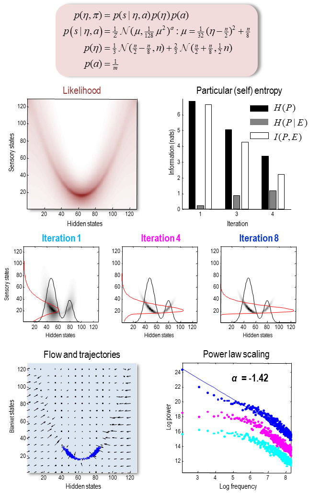
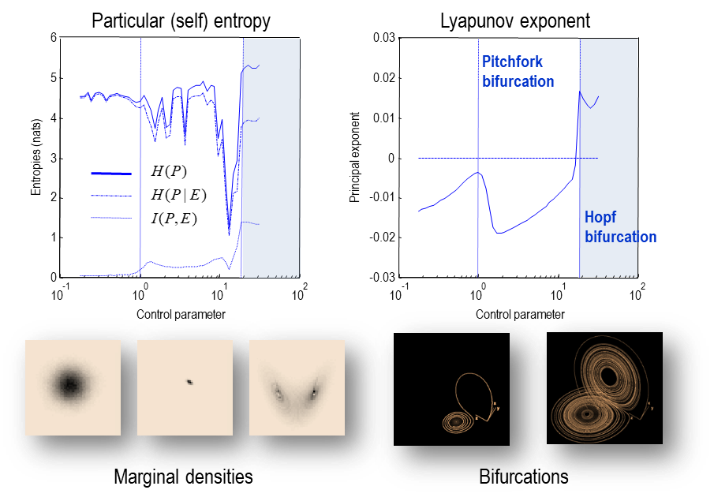
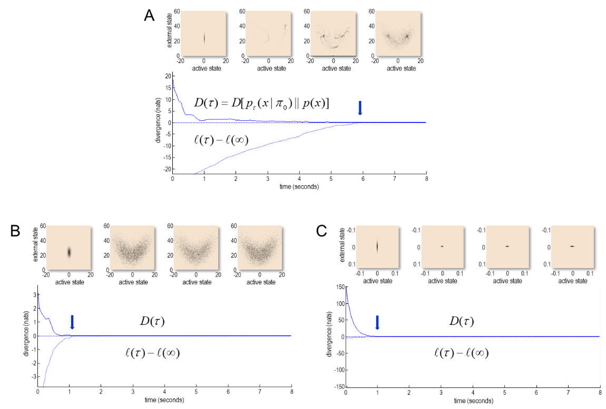

### 대칭 깨짐과 자기조직화

_"물리학과 화학이 어떻게 생명체의 공간 경계 내에서 일어나는 시공간의 사건들을 설명할 수 있을까?"_(Schrödinger, 1944)

마르코프 담요의 도입과 입자의 외부 상태와 내부 상태 사이의 구분은 앙상블 밀도에 대한 게임을 다소 변화시킵니다. 파티션 없이는 우리는 밀도의 엔트로피와 그것이 시간에 따라 어떻게 변하는지에 대해서만 이야기할 수 있습니다. 그러나 파티션의 설정에서는, 우리는 특정 상태의 엔트로피를 숨겨진 상태(또는 그 반대)에 대해 고려할 수 있습니다. 이 상대적인 엔트로피는 상호 정보로 알려져 있습니다. 그렇다면, 우리는 높은 상호 정보를 가진 시스템에 관심이 있는 건가요, 아니면 낮은 상호 정보를 가진 시스템에 관심이 있는 건가요? 답은 우리가 상태 공간을 탐색하지만 잘 정의된 매력적인 다양체와 낮은 측정치(즉, 낮은 엔트로피)를 가진 입자에 관심이 있다는 점에서 둘 다인 것으로 밝혀졌습니다. 이것은 상반되는 제약 조건 사이의 방언에 대한 것입니다. 간단히 말하면, 특정 상태의 비평형 안정상태 엔트로피가 작다면, 외부 상태가 주어졌을 때 특정 상태에 대한 평균 불확실성은 작아야 합니다. 다시 말해, 외부 상태를 알면 특정 상태에 대한 모호성이 해결됩니다. 그러나 동시에, 외부 상태와 특정 상태 사이의 상호 정보 또는 결합도도 작아야 합니다. 그렇지 않으면 외부 상태와 특정 상태를 구분할 수 없게 되어 입자가 분산되거나 해체될 위험이 있습니다. 직관적으로, 이것은 우리가 그들의 외부 환경과 구분되는 마르코프 담요을 식별할 수 있다는 사실을 가능하게 합니다(예를 들어, 그것이 수영하는 물에서 물고기를 구분함), 동시에 특정 동역학과 외부 상태 사이의 복잡하고 자기 조직화된 결합을 관찰합니다(예를 들어, 특정 물고기가 물에서 수영함). 더 단순하게 말하면, 물고기는 그것의 무결성을 보존하는 수많은 섬세한, 맥락에 민감한 행동에도 불구하고 물고기로 남아 있습니다 (Clarke et al., 2015). 이어서, 우리는 이 방언이 어떻게 정보 이론을 사용한 간단한 통계 처리에서 나타나는지 고려합니다.

시스템 상태의 분할을 설정한 후, 이제 우리는 자기조직화 시스템의 종류를 정의할 수 있는 위치에 있습니다. 간단히 말해, 이러한 시스템은 공간을 채우는 무작위 동적 유인자를 가지고 있고, 그 측정치는 낮습니다. 즉, 그들의 확률 질량은 작은 부피에 집중되어 있으며, 이 부피들은 상태 공간을 통한 궤적의 이동(즉, 떠돌이)을 허용하는 방식으로 연결되어 있습니다. 이는 한 유인자의 다양체에서 다른 다양체로 이동합니다: c.f., 결정론적 시스템에서의 위상 변환에 의해 생성된 침투(Vespignani and Zapperi, 1998). 암시적인 대칭성 파괴(즉, 근접한 궤적이 다른 상태-공간의 체제로 분산)는 평형이 아닌 동역학의 특징(Evans and Searles, 2002)이며, 동적 시스템에서의 자기조직화 임계성과 같은 현상과 밀접하게 관련되어 있습니다(Bak et al., 1988; Vespignani and Zapperi, 1998). 실제로, 복잡성 과학의 많은 부분은 다중 척도, 떠돌이, 그리고 혼돈적인 동역학을 어떻게 형식화하는지에 대한 문제를 다룹니다. 이것은 광범위한 분야로서, 재정규화 군 이론, 척도 불변성, 임계성, 그리고 보편성을 포함합니다(Kwapien and Drozdz, 2012; Nicolis and Prigogine, 1977; Schwabl, 2002). 이 논문에서는, 우리는 많은 더욱 세부적인 부분들(그리고 분기점, 좌절, 그리고 위상 변환과 같은 현상들)을 회피하고, 자기조직화 시스템의 흥미로운 행동이 적절한 형태의 평형이 아닌 상태 밀도에 의해 포착될 수 있다고 가정할 것입니다.

그렇다면, 적절한 형태는 무엇일까요? 우리는 특정 상태들에 대한 주변 (비평형 안정상태) 밀도를 고려함으로써 시작합니다. 외부 상태와 특정 상태로의 분할이 주어지면, 엔트로피 생성의 관점에서 자기 조직화의 간단한 형태를 특성화하는 것은 직관적입니다. 이것은 자율적인 상태 $\alpha=\{a,\mu\}\in A$ 와 감각 상태 $s \in S$ 사이에 분리가 있기 때문에 따라옵니다. 결정적으로, 정의에 의하면, 자율적 상태의 흐름은 외부 상태 $\eta\in E$ 에 의존하지 않습니다. 이것은 자율적 상태가 특정 상태들 $\pi\in P$ 의 자기-정보 또는 놀라움과 그것의 장기 평균, 즉, 그들의 엔트로피를 억제하는 것처럼 보일 것이라는 것을 의미합니다. 주변 흐름의 보조 정리 (1.21)로부터, 우리는 다음과 같은 것을 얻습니다 (활동적 상태와 감각 상태 사이의 회전 형태의 결합을 무시하고):

$$
\begin{equation} \tag{2.1}
\begin{aligned}
f_{\alpha}(\pi) 
  &= (Q_{\alpha\alpha} -\Gamma_{\alpha\alpha})\nabla_{\alpha}\Im(\pi) \\
E_{p(\pi)}[\Im(\pi)]
  &= lim_{\tau\to\infty}\frac{1}{\tau}\int_{0}^{\tau}\Im(\pi(t))dt \\
  &= H(P)
\end{aligned}
\end{equation}
$$

우리는 특정 상태의 엔트로피를 특정 혹은 자기-엔트로피라고 부를 것입니다. (2.2)의 흐름은 자율적 상태가 평균적으로 특정 상태의 엔트로피를 최소화하려고 하는 것처럼 보일 것입니다. 기본적인 정보 이론에서, 자율적 상태는 외부 상태와 특정 상태 사이의 상호 정보를 최소화하려고 하는 것처럼 보일 것이며, 동시에 외부 상태가 주어진 특정 상태의 엔트로피를 최소화하려고 할 것입니다. 이것은 상호 정보가 특정 상태에 대한 불확실성을, 외부 상태가 주어진 상태에서의 불확실성을 뺀 것이기 때문입니다 (즉, 외부 상태를 알고 있음으로써 불확실성이 감소되지 않을 때, 상호 정보는 0입니다).

(self) 엔트로피의 분해는 상호 정보와 조건부 엔트로피로 표현될 수 있으며, 통계적 관점에서는 이것을 놀라움의 분해로서 부정확성과 복잡성으로 표현할 수도 있습니다:

$$
\begin{equation} \tag{2.3}
\begin{aligned}
\Im(\pi)
  &= E_{p(\eta|\pi)}[\Im(\pi)] \\
  &= E_{p(\eta|\pi)}[\ln p(\eta|\pi) - \ln p(\pi|\eta)] \\
  &= E_{p(\eta|\pi)}[\ln p(\eta|\pi) - \ln p(\eta) - \ln p(\pi|\eta)] \\
  &= \underbrace{
      E_{p(\eta|b)}[\Im(\pi|\eta)]
    }_{\text{inaccuracy}} + 
    \underbrace{
      D[p(\eta|\pi)||p(\eta)]
    }_{\text{complexity}} \\
\\
E_{p(\pi)}[\Im(\pi)]
  &= \underbrace{H(P)}_{\text{entropy}}
   = \underbrace{H(P|E)}_{\text{ambiguity}} +
     \underbrace{I(E,P)}_{\text{risk}} \\
\underbrace{H(P|E)}_{\text{ambiguity}}
  &= \underbrace{H(P)}_{\text{entropy}} -
     \underbrace{I(E,P)}_{\text{info gain}} \\
\end{aligned}
\end{equation}
$$

여기서 복잡성은 통계적인 의미로 사용되며, 이는 외부 (숨겨진) 상태에 대한 사후 분포와 사전 분포 간의 발산을 측정하는 것입니다. 반면, 정확성은 사후 분포 하에 특정 상태의 기대 로그 확률입니다. 이 관점에서, 조건부 엔트로피는 예상되는 부정확성 (즉, 모호성)이며, 상호 정보는 예상 복잡성 비용 (즉, 위험)이 됩니다. 마지막 방정식은 상호 정보에 따르는 변증법을 보여줍니다: 한편으로, 엔트로피를 최소화하려면 위험의 역할을 하는 상호 정보를 최소화해야 하며, 다른 한편으로, 모호성을 최소화하려면 정보 획득의 역할을 하는 상호 정보를 최대화해야 합니다. 이러한 보완적인 역할은 모호성과 위험 (또는 부정확성과 복잡성)이 단순히 자기-엔트로피라는 같은 동전의 양면일 뿐이라는 점을 주목하면 쉽게 화해할 수 있습니다.

복잡성은 최적 제어 이론과 베이지안 통계에서 흔히 사용되는 비용 함수입니다. 최적 제어에서 복잡성은 감각적이고 활동적인 (제어) 상태가 주어졌을 때 예측된 외부 상태와 목표 상태 간의 발산을 측정합니다 (Kappen, 2005; Kappen et al., 2012). 경제학에서 이는 위험 민감 제어로 불립니다 (Fleming and Sheu, 2002; van den Broek et al., 2010). 베이지안 통계에서 복잡성은 숨겨진 상태에 대한 사후 밀도가 사전에 얼마나 발산하는지 측정합니다. 즉, 숨겨진 상태에 대한 사후 믿음을 인코딩하는 데 필요한 자유도를 측정합니다 (Spiegelhalter et al., 2002). 복잡성 비용을 줄이는 것은 옥캄의 원리를 지지합니다. 즉, 최선의 설명은 사후 믿음이 사전 믿음에 비해 가장 작게 변화하는 정확한 설명을 제공합니다 (Penny et al., 2004). 공식적으로 이는 비평형 시스템에서 적응적 행동을 모델링하는 인과적 엔트로피 힘 개념과 밀접하게 관련되어 있습니다 (Wissner-Gross and Freer, 2013). 마지막으로, 인과적 엔트로피 힘 자체는 Jaynes의 최대 엔트로피 원칙과 관련될 수 있습니다 (Jaynes, 1957).

불확실성 용어는 주관적인, 불확실성을 줄이는 해석을 가지며, 이때 자율 상태의 마진 흐름은 외부 상태가 주어진 센서 상태에 대한 불확실성을 최소화하는 것처럼 보일 것입니다. 다시 말해, 자기 조직화는 외부 상태가 모호하지 않은 센서 상태를 유발하는 상태 공간의 영역을 찾는 것처럼 보일 것입니다 - 마치 잃어버린 열쇠를 찾기 위해 가로등 아래를 찾는 것처럼 (Demirdjian et al., 2005). 이 동역학은 평균적으로) 자율 상태가 특정 상태의 엔트로피를 줄이는 것처럼 보이므로 자기 조직적입니다. 이 특정 엔트로피는 담요와 외부 상태 간의 상호 정보량과 주어진 외부 상태에 조건화된 그들의 조건적 불확실성입니다. 즉, 자율 상태는 외부 상태와의 통계적 결합 (즉, 상호 정보량)을 최소화하는 것처럼 보이면서 동시에 주어진 숨겨진 상태 아래에서 그들의 분산을 저항할 것입니다.

우리는 이런 적극적인 분산 저항을 엔트로피 생산의 용어로 표현할 수 있습니다 (엔트로피 생산에 대한 전체 처리는 아래의 열역학 섹션에서 찾을 수 있습니다). 자율 상태의 흐름으로 인한 엔트로피 생산은 다음과 같이 표현할 수 있습니다:

$$
\begin{equation} \tag{2.4}
\begin{aligned}
\dot{H}^{\alpha}
  &= \int p(\pi) f_{\alpha}(\pi)\cdot\nabla_{\alpha}\Im(\pi)d\pi \\
  &= -\int p(\pi)\nabla_{\alpha} \Im(\pi)\cdot\Gamma_{\alpha\alpha}\nabla_{\alpha}\Im(\pi)d\pi \leq 0
\end{aligned}
\end{equation}
$$

그 결과로, 자율적인 엔트로피 생산은 항상 제로 또는 그 이하입니다(왜냐하면 무작위 요동의 공분산은 양의 정적이고, 회전류 흐름은 취소되기 때문입니다). 다시 말해, 평형 상태에서는 자율적인 흐름이 무작위 요동과 외부 상태의 영향으로 인한 특정 상태의 분산을 저항합니다. 우리는 센서 상태 하에서 기대되는 자율 상태의 마진 흐름을 고려함으로써 이 엔트로피 감소 행동을 더 자세히 살펴볼 수 있습니다. 마진 흐름의 보조 정리 (1.22)에 따르면, 다음과 같습니다:

$$
\begin{equation} \tag{2.5}
\begin{aligned}
f_{\alpha}(\alpha)
   = (Q_{\alpha\alpha} - \Gamma_{\alpha\alpha})\nabla_{\alpha}\Im(\alpha) \Rightarrow p(\dot{\alpha}|\alpha)
   = \mathcal{N}(f_{\alpha}(\alpha), 2\Gamma_{\alpha}) \\
\end{aligned}
\end{equation}
$$

(1.11)을 따르면, 무작위 변동이 지배할 때, 자율 상태의 가장 가능성 있는 (마진) 경로는 그들의 행동을 최소화합니다:

$$
\begin{equation} \tag{2.6}
\begin{aligned}
\delta_{\alpha}\mathcal{A}(\alpha[\tau]) 
  &= 0 \\
  &\Rightarrow \dot{\alpha}
   = f_{\alpha}(\alpha)
   = (Q_{\alpha\alpha}-\Gamma_{\alpha\alpha})\nabla_{\alpha}\Im (\alpha) \\
  &\Rightarrow \alpha[\tau]
   = argmin_{\alpha[\tau]}\mathcal{A}(\alpha[\tau]) \\
\end{aligned}
\end{equation}
$$

그렇다면 이것이 무엇을 의미하는가? 자율적인 동적성에 대한 직관을 구축하기 위해, (2.3)에서처럼 도트 제품을 사용하여 자율 상태의 놀라움을 복잡성 비용과 감지 상태를 조건으로 하는 정보 획득의 관점에서 표현할 수 있습니다:

$$
\begin{equation} \tag{2.7}
\begin{aligned}
\Im(\alpha)
  &= E_{p(\tilde{\alpha}|\alpha)}[\Im(\alpha)] \\
  &= E_{p(\tilde{\alpha}|\alpha)}[\ln{p(\eta|\pi)} - \ln{p(\eta)} - \ln{p(\eta|\pi)} + \ln{p(\eta|\alpha)} - \ln{p(\alpha|\eta)}] \\
  &= E_{p(\eta|\alpha)}[\Im(\alpha|\eta)] + E_{p(\tilde{\alpha}|\alpha)}[
      \underbrace{D[p(\eta|\pi)||p(\eta)]}_{\text{complexity}} -
      \underbrace{D[p(\eta|\pi)||p(\eta|\alpha)]}_{\text{information gain}}
    ] \\
E_{p(\tilde{\alpha}|\alpha)}[\Im(\alpha)]
  &= H(A) = I(A,E) + H(A|E) \\
  &= H(A|E) + \underbrace{I(E,P)}_{\text{risk}} - \underbrace{I(E,S|A)}_{\text{active information}} \\
\end{aligned}
\end{equation}
$$

여기서, $\tilde{\alpha} ={\eta,s}$는 자율적인 상태의 보완입니다. 이 분해는 자율적인 상태의 마진 흐름이 그것의 놀라움을 최소화하고, 이것은 외부 상태에 결합하려는 시도와 그들의 분산 효과에 저항하려는 시도 사이의 대립을 반영하는 항으로 분해될 수 있음을 의미합니다. 이 분해에서, 모호성 감소는 정보 획득의 관점에서 표현됩니다:

$$
\begin{equation} \tag{2.8}
\begin{aligned}
\underbrace{E_{p(\pi)}[D[p(\eta|\pi)||p(\eta|\alpha)]]}_{\text{expected information gain}} = I(E,S|A) = I(E,S) - I(E,S,A) \\
\end{aligned}
\end{equation}
$$

이 방정식은 아래의 상위 순서의 상호 정보에 대한 자기 조직화의 특성화와 연결을 맺기 위해 도입되었습니다. 정보 획득은 때때로 인공지능과 로보틱스에서 지식 가치 또는 내재적 동기라고 불립니다 (Friston et al., 2015b; Oudeyer와 Kaplan, 2007; Schmidhuber, 2010). 이것은 자율적인 상태에 의한 감각 상태에 의해 제공되는 외부 상태의 확률 밀도의 변화에 해당합니다: 즉, 감각 상태가 없는 사후 밀도와의 Kullback-Leibler (KL) 발산, 자율적인 상태에 의한 조건부입니다. 이것은 또한 자율적인 활동에 의해 제공되는 감각 상태와 숨겨진 상태 사이의 상호 정보입니다. 생명 과학 (예: 인지 신경 과학)에서 이 측정은 종종 베이지안 놀라움 또는 중요도로 참조됩니다 (Itti와 Baldi, 2009; Mirza et al., 2016; Sun et al., 2011). 이러한 해석에 대해서는 세 번째 부분에서 다시 다루겠습니다. (2.8)의 예상 정보 획득에 대한 표현은 외부 상태와 감각 상태 사이의 상호 정보를 포함하고, 세 번째 순서의 상호 정보 (외부, 감각, 자율적 상태 사이)를 뺀 것입니다.

요약하면, 자기 조직화는 자기 엔트로피 (또는 놀라움)의 자율적인 억제로 표현될 수 있습니다. 차례로, 자기 엔트로피는 위험 (또는 복잡성)과 모호성 (또는 부정확성) 해결 요소로 분해될 수 있으며, 이는 자율적 상태의 흐름에 의해 매개된 것처럼 보입니다. 분명히, 어떤 의미에서는 모든 흥미로운 시스템이 무작위 동적 유인자를 가지고 있다면 어느 정도의 자기 조직화를 보일 것입니다. 자기 조직화를 자기 엔트로피, 위험, 모호성의 관점에서 표현하는 것은 단지 자기 조직화를 지각적, 지식적 행동의 관점에서 이야기하고 정량화할 수 있다는 것을 의미합니다.

#### Self-organisation and self-evidencing - 자기 조직화와 자기 증거

통계학에서 특정 상태의 놀라움은 주변 가능도 또는 증거의 음의 로그로 알려져 있습니다. 이는 자기 조직화를 자체 증거 제공의 의미로 이해할 수 있음을 의미하며, 가장 가능성이 높은 자율 상태의 흐름이 놀라움을 줄이고 따라서 증거를 증가시킵니다. 이 해석은 컴퓨테이셔널 및 인지 신경 과학에서 고려되는 행동을 이해하는 데 있어서 세 번째 부분에서 중요한 역할을 할 것입니다. 여기서 취하는 입장은 자기 조직화가 어떻게 생겨나는지를 묻는 것이 아니라, 자기조직화 시스템이 어떤 속성을 보이는지를 묻는 것입니다. 이것은 마치 우리가 어려운 문제를 피하고 있는 것처럼 보일 수 있지만, 실제 세계에서 마주치는 거의 모든 시스템은 더 크거나 더 작은 정도로 자기 조직화되어 있습니다. 이는 자기 조직화가 자체적으로는 별로 놀랍지 않다는 것을 의미합니다. 다시 말해, 시스템이 자기 조직화하지 않았다면 우리가 그것들을 관찰할 기회가 있기 전에 그들은 이미 퍼져 있었을 것입니다. 이는 자기 조직화가 어떤 것처럼 보이는지, 그리고 그것이 어떤 종류의 기계학을 필요로 하는지에 대한 질문이 흥미롭다는 것을 의미합니다.

다음에서는 자기 조직화가 어떻게 나타나는지 살펴보고, 세 번째 부분에서 베이지안 기계학에서 생겨나는 명백한 목적론에 대해 다룰 것입니다. 물리학자의 관점에서 이것은 우리가 무작위 동적 유인자를 가진 어떤 흥미로운 시스템이 그것의 유인 집합으로 안착하는 과정에서 그것의 엔트로피를 줄일 것이라는 가정에서 출발한다는 것을 의미합니다. 이것은 닫힌 시스템의 엔트로피 증가에 대해 일반적으로 호소하는 통계 열역학과는 대조적입니다. 그러나 시스템의 매우 폐쇄성 - 즉, 마르코프 담요에 의한 외부 상태로부터의 절연 - 은 더 흥미로운 문제일 수 있습니다. 다시 말해, 열 욕조 또는 용기가 어떻게 생겨났는지, 그리고 그것의 지속성을 무엇이 설명하는지에 대한 문제입니다. 이것은 고전적인 (그리고 평형) 통계 기계학이 사라진다는 것을 의미하는 것은 아닙니다: 우리는 후속 부분에서 그들이 마르코프 담요 내에 포함된 마르코프 담요의 앙상블을 고려할 때 특별한 경우로서 어떻게 나타나는지 볼 것입니다.

#### Self-organisation, frustration and supersymmetry - 자기조직화, 좌절과 초대칭성

앞서 자기 조직화에 대한 설명은 경험적으로 도입되었지만, 이는 복잡성에 대한 여러 가지 설명과 관련하여 어느 정도의 구성 유효성을 가지고 있습니다. 아마도 가장 직접적인 관계는 고차 상호 정보와 동적 시스템에서의 (기하학적) 좌절(frustration)과 관련된 불규칙한 동력학 사이의 관계입니다(Kaluza and Meyer-Ortmanns, 2010). 특히, 3차 상호 정보가 음수인 앙상블 사이의 상관 관계는 "두 개체의 선호가 동시에 만족되지 않는다"는 의미에서 좌절로 간주될 수 있습니다(Matsuda, 2000) p3099. 이러한 상관 관계는 스핀 글라스와 같은 좌절 통계 시스템에서 특히 중요합니다. 이러한 시스템에서, 경쟁하는 상호작용이나 기하학적 제약 때문에 좌절이 복잡한 상 전이, 부분적 무질서, 비 지수적 이완을 유발할 수 있습니다(Fierro et al., 1999; Matsuda, 2000). 흥미롭게도, 고차 상호 정보는 (Tononi et al., 1994)에 의해 도입된 신경 복잡성 측정의 기초를 이룹니다: (Ay, 2015) 참조.

현재의 공식 (무작위 동역학 시스템의 관점에서)는 아마도 확률적 시스템의 초대칭 이론 (Parisi와 Sourlas, 1982)과 관련하여 가장 잘 고려될 것입니다. 여기서 다루고 있는 것과 같은 연속 시간 동역학 시스템에 대한 모든 확률적 미분 방정식은 위상 초대칭 (Ovchinnikov, 2016)을 갖습니다. 위상 초대칭(TS)은 위상 공간 연속성의 보존을 나타냅니다. 즉, 무한히 가까운 점은 노이즈가 있더라도 연속 시간 진화 중에 가까이 유지됩니다. 자발적인 위상 초대칭 위반은 혼돈, 난류 및 자기 조직화된 비정상성 (Ovchinnikov, 2016)과 같은 유비쿼터스 동적 현상을 뒷받침합니다. 이 유형의 초대칭 위반은 골드스톤 정리 (Goldstone et al., 1962)에 의해 장거리 동적 행동의 출현을 수반합니다. 이것은 1/f 노이즈와 Zipf 법칙에 따라 형식화된 갑작스러운(순식간에 발생하는) 과정의 규모와 무관하게 통계로 나타납니다. 예: 지진, 신경 세포 폭발, 태양 폭발 등., (Beggs and Plenz, 2003; Kauffman and Johnsen, 1991; Newman, 2005; Plenz and Thiagarajan, 2007; Shew et al., 2011).

이러한 종류의 동적 행동을 설명하기 위해 일부 무작위 동역학 시스템이 임계점에 수렴한다는 제안이 있습니다. 이것은 자가 조직화된 비정상성 (SOC)의 현상학적 접근 방식입니다 (Bak et al., 1987; Bak et al., 1988). 자발적인 위상 초대칭 위반은 비정상 현상을 비판적 현상에서 제외하고 노이즈 유발된 대칭 위반으로 간주하는 대안적인 관점을 제공합니다. 경험적으로 이것은 서로 다른 유인 다양체들 사이의 노이즈 유발된 터널링으로 생각할 수 있습니다. 그림 2는 자기 엔트로피가 감소함에 따라 위상 초대칭 위반의 출현을 이해하는 데 도움이 됩니다. 보완적인 그림은 자기 엔트로피가 떨어짐에 따라 동적 불안정성 (즉, 비정상성)의 출현을 보여줍니다.

FIGURE 2 

*자기증거화, 자기조직화, 그리고 규모불변 동역학*. 이 그림은 자기 엔트로피의 감소 - 그리고 외부 상태와 담요 상태 사이의 상호 정보와 함께 발생하는 이동성, 규모 불변 동역학을 보여줍니다. 이 간단한 예시는 고정된 형태의 우도로 시작하며 (왼쪽 상단 패널) 이는 외부 또는 숨겨진 상태를 입자의 상태로 매핑합니다. 간단하게 하기 위해, 이 시뮬레이션에서는 내부 상태가 없으므로, 입자는 담요 상태로 구성됩니다. 여기서, 하나의 숨겨진 상태는 상태 의존적인 분산 (숨겨진 상태의 이차 함수로 모델링된)과 함께 비선형 (이차) 함수를 통해 담요 상태로 매핑됩니다. 자기 엔트로피는 숨겨진 상태에 대한 마진 밀도에 대해 최소화되었습니다 (기울기 하강을 사용하여). 그 결과 나타나는 결합 분포는 중간 행에 표시되며, 상호 정보가 기울기 하강의 반복에 걸쳐 감소합니다. 검은색과 빨간색 선은 각각 숨겨진 상태와 담요 상태에 대한 마진 밀도에 해당합니다. 여기서 주요 관찰 사항은 결합 분포가 상호 정보를 줄이는 영역에서 확률 질량을 점진적으로 집중시키면서, 감각 상태에 대한 높은 조건부 불확실성이 있는 영역을 피한다는 것입니다. 이것은 오른쪽 상단 패널에 표시된 상호 정보 측정치에 반영됩니다. 이 예시에서, 자기 엔트로피의 감소는 상호 정보 (즉, 예상 복잡성 또는 위험)의 감소를 의미하며, 조건부 불확실성 (즉, 모호성)의 약간의 증가를 동반합니다. 결합 분포를 주어진 상태로, 특정 궤적을 해결하기 위해 흐름을 도출할 수 있습니다 (여기서는 220개의 시간 단계에 걸침). 왼쪽 하단 패널은 화살표 그림의 흐름과 궤적의 일부를 보여줍니다 (무작위 변동의 진폭이 1이고, 회전류의 흐름이 4분의 1이라고 가정하면, 210개의 시간 단계에 걸침). 이 세그먼트는 노이즈에 의해 유발된 터널링을 보여주기 위해 선택되었습니다; 즉, 수렴 집합의 두 영역을 연결하는 궤적입니다. 기술적으로 이것은 인스턴톤(Ginzburg, 1987)이라고 알려져 있습니다. 관련 동역학은 궤적이 수렴 집합 내에서 방황함에 따라 이동성을 보여줍니다. 이어지는 규모 불변 행동은 하단 오른쪽 패널에서의 멱법칙을 통해 보여집니다. 여기서, 로그 스펙트럼 밀도가 로그 주파수에 대해 그려졌으며, 대략적으로 선형 관계를 보여주며 멱법칙 지수는 -1.42입니다. 기술적으로, 이것은 노이즈에 의해 유발된 (N-상) 위상 수퍼 대칭 파괴에 해당하거나, 더욱 대중적으로는, 수렴 집합의 한 영역에서 다른 영역으로의 노이즈에 의한 터널링에 해당합니다. 이 규모 불변 동역학은 비정상적인 확산 - 보통 비균직 (또는 비 가우스) 동역학과 연관되어 있지만; 예를 들어, (Pavlos et al., 2012) - 이것은 결합 밀도가 자기조직화 흐름을 유도하도록 최적화된 상황에서 광범위한 (가우스) 동역학에서 발생합니다. 청색과 마젠타색 점은 이전 반복에서의 동일한 시뮬레이션에 해당하며, 멱법칙 스케일링의 등장을 보여줍니다. 이 시뮬레이션은 두 상태 각각에 대해 128개의 빈을 가진 이산화 상태 공간을 사용했습니다. 궤적은 단순한 오일러 스킴을 사용하여 적분되었습니다.

FIGURE 3 

*대칭 파괴와 이분법*. 이 그림은 특정 (즉, 자기) 엔트로피와 대칭 파괴의 기반이 되는 궤적의 지수적인 발산 사이의 관계를 (확률론적) 로렌츠 시스템에서 보여줍니다 (Agarwal and Wettlaufer, 2016; Lorenz, 1963). 이 예제는 이분법과 그것들과 관련된 (랜덤) 수렴 집합에 따라 엔트로피가 어떻게 변하는지를 보여줍니다. 여기서, 우리는 로렌츠 시스템을 통합했습니다 (시간 단위 1/64의 $ 2^{18} $ 시간 단계에 대해) 레일리 (제어) 파라미터의 증가 값으로, 결정론적 시스템에서는 피치포크 이분법을 유발합니다 (at $ \rho $ = 1) 그리고 그 후의 (부분적으로) 홉프 이분법 (at $ \rho $ = 24.74). 우리가 흐름에 작은 (표준 편차 1/128) 무작위 변동을 추가했기 때문에, 노이즈에 의해 유발된 위상 대칭 파괴는 $ \rho $ = 14 주변에서 나타납니다 (일반적으로, 카오스 전이의 영역에서). 궤적의 지수적 발산은 최대 리아프노프 지수로 측정되었습니다 (궤도에 대한 평균). 결과적인 리아프노프 지수의 변화 (오른쪽 패널)는 수렴 집합이 공간을 채우게 만들며, 이와 관련된 자기 엔트로피와 상호 정보의 변화를 가져옵니다 (왼쪽 패널). 여기서, 우리는 로렌츠 시스템의 흐름이 세 번째에서 첫 번째 상태로의 링크가 누락되어 있다는 사실을 활용했습니다. 이는 우리가 첫 번째 상태를 활성 상태, 두 번째를 감각 상태, 마지막을 외부 또는 숨겨진 상태로 연결할 수 있음을 의미합니다 (여기에는 내부 상태가 없으며 특정 상태는 담요 상태로 축소됩니다). 이 시뮬레이션에서 놀라운 결과는 최대한의 자기조직화 - (활성 및 감각) 담요 상태의 엔트로피의 반영 - 이 확률적 카오스의 시작 직전에 깊은 하강을 보이며 - 결정론적 시스템에서의 임계 감속과 관련된 영역에서 이루어집니다. 삽입된 그림은 이분법과 수렴 집합을 궤적 (오른쪽) 및 관련 앙상블 밀도 (왼쪽)의 관점에서 보여주며, 궤적의 최소 및 최대 값으로 임의로 재조정됩니다. 주요 이분법은 수직선으로 표시되며, 수평선은 주요 리아프노프 지수가 처음으로 (확률적) 카오스의 시작에서 0을 교차하는 시점을 나타냅니다. 상호 정보 측정치(첫 번째와 나머지 상태 사이)는 상태 공간을 세 차원 각각에 32개의 빈으로 이산화하여 평가되었습니다. 이 예제는 단순한 자기 조직화의 정의 - 담요 (즉, 특정) 상태의 엔트로피 측면에서 - 가 확률적 카오스에서의 자기조직화 임계성과 어느 정도의 구성 유효성을 갖는지 보여주기 위한 수치 연구로 제공됩니다: 이것은 일반화 될 수도 있고, 그렇지 않을 수도 있습니다. 여기에서 보여지는 동역학은 각 상태가 무작위 변동으로 갖춰져 있기 때문에 결정론적이지 않습니다. 나중에 우리는 이것이 로렌츠 끌개의 각 상태가 내부 상태에서 빠른 변동을 상속하는 더 낮은 규모의 담요 상태의 혼합으로 모델링된다는 것을 볼 것입니다.

#### Self-organisation and information length - 자기 조직화와 정보 길이

지금까지, 우리는 특정 엔트로피 측면에서 자기 조직화를 고려했으며, 여기서 낮은 엔트로피는 대칭 파괴와 자기조직화 임계성의 현상학과 함께 가는 것처럼 보입니다. 이는 질문을 불러일으킵니다: 이런 종류의 이동성을 어떻게 정량화할 수 있을까요? 한 가지 접근법은 정보 길이라는 개념을 빌려오는 것입니다. 즉, 시스템이 불균형한 정상 상태로 가는 도중 통과하는 식별 가능한 확률적 구성의 수입니다. 다시 말해, 이동하는 대칭 파괴 (생물학적 시스템에서 볼 수 있는 종류)를 특정 상태에서 불균형한 정상 상태까지의 긴 정보 길이와 연관시킬 수 있습니다. 정보 길이의 사용은 높은 자기 엔트로피와 낮은 자기 엔트로피의 의미에 대한 어려운 질문을 피하며, 이는 오직 더해지는 상수 내에서만 정의됩니다 (Jones, 1979). 반면에, 정보 길이는 우리가 정량화하려는 방황하는, 이동하는 동역학을 점수 매기기 위해 어떤 밀도 동역학에도 적용될 수 있는 척도입니다.

정보 길이에 대한 직관을 구축하기 위해, 그림 4는 흐름과 무작위 변동이 이동하지만 구조화된 동역학을 생성하는 역할을 보여주는 세 가지 예시를 보여줍니다. 이 그림에서, 우리는 그림 3의 로렌츠 시스템을 사용하여 초기 밀도 - 주어진 특정 상태 - 가 불균형한 정상 상태 밀도로 어떻게 수렴하는지 다른 방법을 보여줍니다. 상단 패널은 낮은 진폭의 무작위 변동을 사용하는 로렌츠 끌개에 의해 유발된 익숙한 자기 조직화를 보여줍니다. 이 영역에서, 시스템은 레일리 파라미터 28을 사용하여 보장된 홉프 이분법을 겪었습니다. 초기 밀도의 진화는 다음을 통해 평가되었습니다: (i) 비평형 안정상태밀도 $D(\tau)$ 에 대한 KL 발산 - 그리고(ii)시간에 따른 밀도와 최종 (정상 상태) 밀도 사이의 정보 길이 차이  $\Delta(\tau)$ .

$$
\begin{equation} \tag{2.9}
\begin{aligned}
D(\tau) 
  &= D[p(x,\tau|\pi_0) \parallel p(x,\infty|\pi_0)] \\
\delta(\tau)^2 
  &\leq \frac{1}{2}D(\tau) \\
\\
\Delta\ell(\tau) 
  &= \ell(\tau) - \ell(\infty) \\
\tfrac{1}{2}d\ell(\tau)^2 
  &= D[p(x,\tau+d\tau|\pi_0) \parallel p(x,\tau|\pi_0)] \\
\\
D(\tau) 
  &= 0 \Leftrightarrow \Delta\ell(\tau) 
   = 0 \Leftrightarrow \delta(\tau)
   = 0 \Leftrightarrow d\ell(\tau)  
   = 0 \\
\end{aligned}
\end{equation}
$$

위의 부방정식은 핀스커의 부방정식으로 알려져 있으며, 여기서 $ \delta(\tau) $ 는 총 변동 거리 (Rényi, 2007)라고 부르며, 이는 우리가 발산 길이라고 부를 $ D(\tau)$ 에 의해 상한선이 정해집니다. (1.18)에서 기억하십시오, 통계적 거리 $ D(\tau) $ 와 $ \Delta(\tau) $ 의 특성화는 KL 발산을 사용하는 방식에서 관련되어 있지만 다릅니다. 경로 길이는 정보 길이가 거리의 (리만) 척도인 것을 보장하기 위해 시간에 걸친 작은 증가에 대한 발산의 누적입니다. 반면에, 초기 밀도와 최종 밀도 사이의 발산 길이는 그렇지 않습니다. (2.9)의 최종 표현은 충분한 시간이 지난 후 밀도가 출발한 특정 상태에 대해 '잊어버린다'는 것을 말합니다. 즉, 발산과 정보 길이의 증가는 0이 됩니다. 반면에, 초기 상태를 '기억하는' 입자는 이동하는 밀도 동역학과 함께 긴 정보 길이를 가집니다.

긴 정보 길이는 실질적으로 초기 밀도가 최종 밀도에서 멀리 떨어져 있으며, 따라서 수렴하는 데 더 오래 걸린다는 것을 의미합니다(그림 4의 작은 파란색 화살표로 표시). 이 예에서는 정상 상태로의 수렴이 약 8초 걸립니다. 이는 초기 밀도가 짧은 정보 길이를 가진 빠른 수렴의 예를 보여주는 하단 패널과 대조됩니다.

(1.1)을 살펴보면 직관적으로 알 수 있듯이, 정보 길이를 줄이는 두 가지 방법이 있습니다. 첫째, 흐름을 고정하면서 무작위 변동의 진폭을 증가시킬 수 있습니다. 이를 통해 궤적이 상태 공간을 빠르게 탐색하고 어떤 초기 밀도에서든 그들의 어트랙팅 세트를 찾을 수 있습니다. 패널 B는 무작위 변동의 진폭을 증가시켜 - 그들의 로그 정밀도를 8에서 0으로 줄이는 방식으로 - 이를 보여줍니다. 이는 정보 길이를 뚜렷하게 감소시켜 불균형 정상 상태로의 수렴이 1초 미만으로 줄어듭니다. 대안으로, 무작위 변동의 진폭을 바꾸지 않고 흐름을 바꿀 수 있습니다. 패널 C의 예는 Rayleigh 파라미터를 28에서 1로 줄였을 때 정보 길이의 같은 감소 - 그리고 수반하는 KL 발산 -을 보여줍니다. 이 흐름 상태에서, 로렌츠 끌개는 포인트 끌개가 되고, 확률론적 혼돈으로 인한 이동성이 사라집니다(그림 3 참조).

일반적으로, 정보 길이는 시스템의 동역학의 선형성을 유지합니다. 예를 들어, 선형 흐름에서는 친숙한 Ornstein-Uhlenbeck 과정이 있으며, 정보 길이는 무작위 변동의 진폭과 함께 감소합니다. (Kim, 2018)에 따르면:

$$
\begin{equation} \tag{2.10}
\begin{aligned}
f(\pi) 
  &= -\gamma\pi + \omega \\
  &\Rightarrow \ln{\ell(\infty)}=\ln{|\pi_0|} + \tfrac{1}{2}\ln{\gamma} - \tfrac{1}{2}\ln{\Gamma} \\
  &\Rightarrow \frac{\partial\ln\ell(\infty)}{\partial\ln{|\pi_0|}}
   = v
   = 1
\end{aligned}
\end{equation}
$$

반대로, 비선형 흐름은 기하학적 구조의 선형적 비율을 변화시켜 대칭성 파괴, 이동성 및 자기조직화된 임계성의 특성인 승수 법칙 $v \ne 1$을 생성합니다[^note-7]. (Kim, 2018)의 혼돈 시스템의 수치 분석에서 흥미로운 점은 정보 길이가 초기 상태에 따라 달라진다는 것으로, 불안정한 혹은 임계점이 가장 짧은 정보 길이를 갖습니다. 그림 3의 수치 분석에서, 노이즈가 유발하는 터널링이 불안정한 점들에서 불균형 정상 상태로의 '단축 경로'를 중재한다고 상상할 수 있습니다. 선형 경우는 무작위 변동이 큰 진폭을 달성함에 따라 모든 초기 조건이 정상 상태에 가까워지며, 함축적으로, 자기조직화가 불균형 정상 상태로 (거의) 순간적이라는 것을 제안합니다 (그림 4의 패널 B 참조). 나중에 우리는 이런 종류의 행동을 작은 (양자) 입자와 연관시킬 것입니다.

> [^note-7]: Kim, E.-j., 2018. Investigating Information Geometry in Classical and Quantum Systems through Information Length. Entropy 20, 574.를 참조하여 정보 길이를 음악에 적용하는 추가적인 논의 및 (재미있는) 응용에 대해 확인해 보세요.

세 번째 부분에서, 우리는 긴 정보 길이를 가진 시스템에서의 자기조직화를 더 자세히 살펴보고 - 이들 입자를 짧은 정보 길이 시스템, 예를 들어 양자와 다른 작은 입자 (예: 바이러스)와 비교할 것입니다. 이 관점에서, 정보 길이는 작은 (양자) 입자의 단순하고 빠르며 '뜨거운' 자기조직화와 큰 (고전) 입자의 이동성 있는, 느리고 '차가운' 행동을 구분합니다.

FIGURE 4 

불균형 정상 상태로의 수렴. A: 이것은 그림 3의 로렌츠 시스템을 사용한 불균형 정상 상태로의 (거의) 결정론적 수렴의 간단한 시연입니다. 결정적 해답(래일리 매개변수 28)은 8192개의 초기 상태에 대해 8초 동안 적분하여 얻었습니다(시간 단계는 1/64 초, 로그 정밀도 8의 낮은 진폭 무작위 변동). 초기의 특정 상태는 각 해결책에 대해 동일했지만, 그들의 최종 밀도는 시간이 지남에 따라 불균형 정상 상태로 수렴합니다. 이것은 샘플 밀도와 최종 (비평형 안정상태) 밀도 사이의 발산이 축소되는 형태로 나타납니다 - 이는 각 시간점에서 집단 밀도에 대한 가우시안 근사치를 사용하여 평가됩니다. 상단 삽입 도면은 네 시점에서 전파된 샘플 밀도를 보여줍니다. 시간이 지남에 따라 이 밀도는 로렌츠 끌개의 익숙한 나비 형태를 가지게 됩니다. 그러나, 이 해결책들은 상태 공간을 통한 궤적이 아니라, 시작 위치의 집단에서 경로의 끝점입니다(오른쪽 그림에 표시됨). 비교를 위해, 상대 정보 길이에 대한 수렴도 보여집니다. 정보 길이가 발산이 0일 때 효과적으로 증가를 멈추는 것을 볼 수 있습니다. 하단 패널은 로그 정밀도 0의 무작위 변동을 사용한 동일한 시뮬레이션을 보여주지만(즉, 분산 1) - 패널 B - 그리고 래일리 매개변수 1 - 패널 C. 이러한 시연에서, 우리는 로렌츠 시스템의 첫 번째 상태를 활성 상태로, 두 번째 상태를 감각 상태로, 그리고 세 번째 상태를 외부 혹은 숨겨진 상태의 역할을 하는 것으로 다루었습니다. 이 지정은 첫 번째 상태가 세 번째에 의해 영향을 받지 않는 사실에 기반을 두고 있습니다. 이 수치 예시는 초기 (특정) 상태가 알려져 있을 때도 입자의 상태에 대한 불확실성이 시간에 따라 어떻게 외부 상태에 대한 불확실성을 유발하는지 보여줍니다.

#### Summary - 요약

이 부분에서의 처리는 자기조직화 시스템이 외부 상태 (또는 다른 마르코프 담요)와 무작위 변동에 의해 허용되는 한도 내에서 자체 엔트로피를 줄인다는 것을 제안합니다. 정보 이론을 사용하면, 이러한 종류의 행동을 통계적 명령으로 해석할 수 있습니다. 즉, 복잡성 비용 (즉, 위험)과 부정확성 (즉, 모호성)을 피하는 것입니다. 간단한 자기조직화의 니르바나는 특정 혹은 자체 엔트로피의 완전한 해결입니다: 여기에는 특정 밀도가 점 질량 (즉, 델타 함수)으로 축소되는 상황이 포함될 수 있습니다. 이러한 간단한 해결책에 우리가 관심을 갖지는 않지만, 작은 입자들이 우주가 시작된 방식으로 돌아가려는 노력이라는 사실에 대해 생각해 보는 것은 흥미롭습니다. 이동적인 자기조직화의 더 흥미로운 예는 그림 4에서 제공됩니다. 세 번째 부분에서, 우리는 자기조직화의 출현과 대칭성 파괴로 돌아올 것입니다. 간단히 말해서, 이러한 특성을 가진 시스템은 항상 변분 자유 에너지의 최소화를 통한 능동 추론 (즉, 자기증거화)에 참여한다고 해석될 수 있습니다.

표 1은 이 섹션에서 소개된 정보 측정의 요약을 제공하며, 나중에 참조할 것입니다. 그러나 자기조직화의 의식적 기반을 다루기 전에, 우리는 마르코프 담요에 관한 비평형 안정상태 보조정리 (부록 B)를 언패킹하는 데 시간을 보낼 것이며 (1부의 나머지 부분), 그리고 이것의 양자, 통계, 고전 역학과의 관계 (2부에서) - 나중에 능동 추론의 처리를 문맥화하기 위해서입니다 (3부에서).

TABLE 1  
**Information measures of particular states that characterise self-organisation**

 Measure                          | Definition                                               | Comments
|---------------------------------|----------------------------------------------------------|-------------------------------------------|
| Self-information                | $\Im(\pi) = -\ln p(x)$                                   | A.k.a. suprise,surprisal or nagative log-evidence, where evidence is also known as the marginal likelihood |
| Self-entropy                    | $H[P]=E_{p(\pi)}[\Im(pi)]$                               | The antropy of particular states |
| Complexity                      | $D[p(\eta\vert\pi)\parallel p(\eta)]$                    | The divergence between the posterior and  prior over external(i.e.,hidden) states|
| Risk (expected complexity)      | $I(E,P)=E_{p(\pi)}[D[p(\eta\vert\pi)\parallel p(\eta)]]$ | The expected complexity or mutual information between external and particular states|
| Accuracy                        | $E_{p(\eta\vert\pi)}[\ln p(\pi\vert\eta)]$               | The expected log likelihood for particular states|
| Ambiguity (expected inaccuracy) | $H(P\vert E)=E_{p(\eta,\pi)}[\Im(\pi\vert\eta)]$         | Negative expected accuracy or log likelihood. This is the conditional entropy of particular states given external states |
| Information                     | $D[p(\eta\vert\pi)\parallel p(\eta\vert\alpha)]$         | A relative entropy, a.k.a. intrinsic value, salience and epistemic value|
| Expected information gain       | $I(E,S\vert A)=E_{p(\pi)}[D[p(\eta\vert\pi)\parallel p(\eta\vert\alpha)]]$| Expected information gain or mutual information between sensory and external states, conditioned on active states |

[TABLE 1](./img/t1.png)