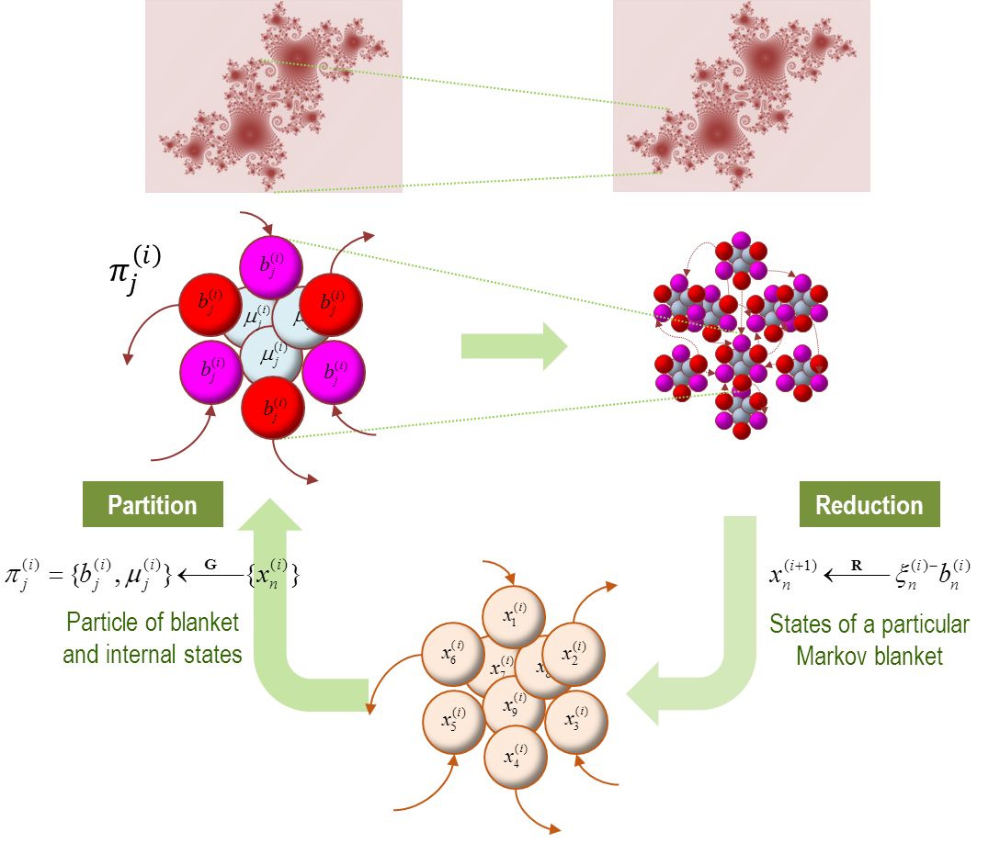
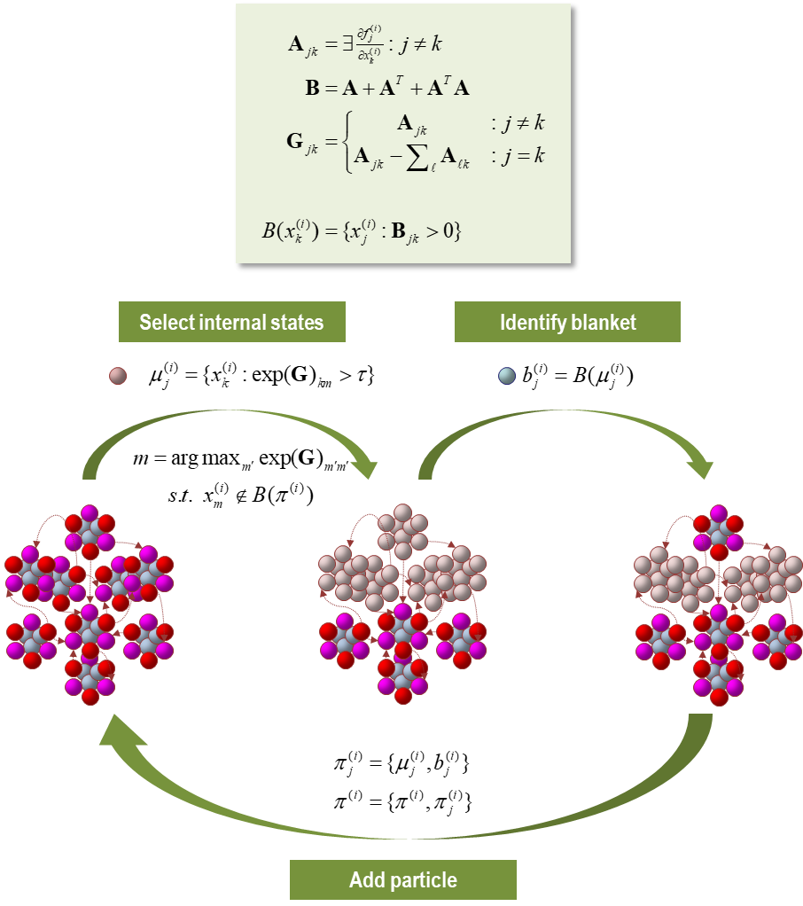
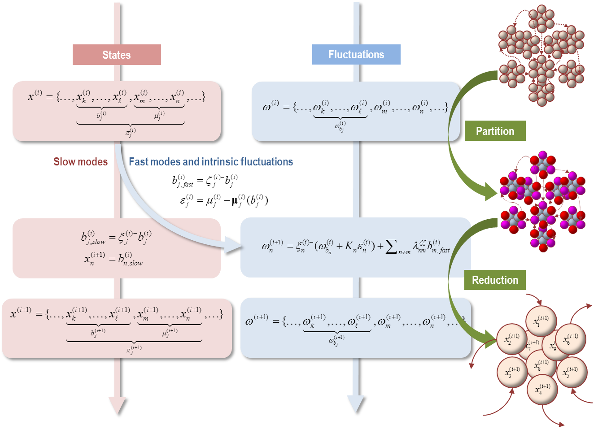
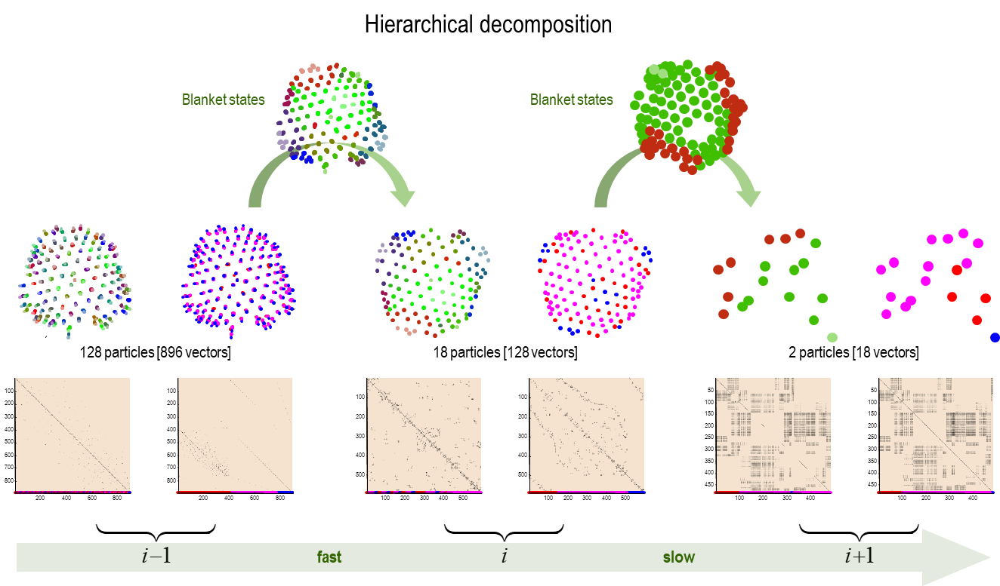
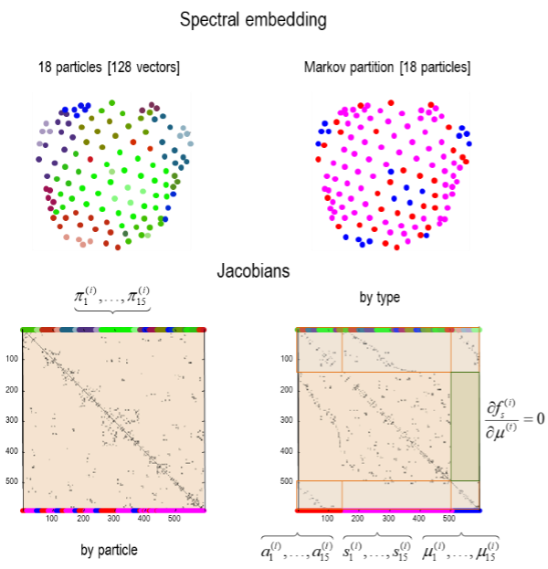

### 상태, 입자 그리고 요동

우리가 시작한 곳, 즉 랑주뱅 방정식 (1.1)으로 돌아가서 간단한 질문을 하자: 상태와 변동의 차이점은 무엇인가? 이 섹션에서 제공하는 답변은 변동은 그렇게 빨리 변하기 때문에 우리가 그들의 시간 상관 관계를 무시하고 일반적인 위너 가정을 채택할 수 있는 빠른 상태라는 것입니다. 이 구분은 앞으로 따를 핵심 원칙을 강조합니다. 즉, 단열 가정을 허용하는 시간 척도의 분리로, 느리게 변하는 상태와 빠른 변동을 분리할 수 있습니다. 이제 더 근본적인 질문을 던져 봅시다: 상태란 무엇인가? 이 질문은 다음과 같은 무한 회귀에 호소함으로써 해결할 수 있습니다:

>상태란 무엇인가? 상태는 입자의 마르코프 담요의 고유 상태입니다.

>입자란 무엇인가? 입자는 담요 상태와 내부 상태로 구성된 특정 상태의 집합입니다.

>상태란 무엇인가? 상태는 … 등등

여기서 고유 상태는 담요 상태의 고유 모드 표현을 의미합니다. 즉, 그들의 야코비안 (즉, 흐름의 상태에 대한 변화율)의 주 고유 벡터입니다. 이러한 혼합물은 느리고 불안정한 고유 모드의 진폭을 반영하는 시너제틱스의 순서 매개 변수와 형식적으로 동일합니다 (Haken, 1983). 센터 매니폴드 이론의 관점에서, 그들은 느린 (불안정 혹은 중심) 매니폴드의 해에 해당합니다 (Carr, 1981; Davis, 2006)

간단히 말해서, 입자의 마르코프 담요는 고유 상태가 상위 척도에서 담요 혹은 내부 상태를 포괄하는 벡터 상태의 집합을 구성합니다. 주의할 점은, 고유 상태는 항상 하위 척도에서 담요 상태의 혼합이며, 고유 상태는 상위 척도에서 마르코프 담요 상태나 내부 상태가 될 수 있다는 것입니다. 이는 다른 (마르코프 담요) 상태에 영향을 미치는 상태만이 '중요한' 상태라는 사실로부터 나옵니다. 다시 말해, 유일하게 관련 있는 연결은 담요 상태 간의 연결입니다[^note-8]. 본질적으로, 우리가 여기서 하는 모든 것은 노예 원칙을 적용하거나, 센터 매니폴드 정리 (Haken, 1983)를 마르코프 담요의 마르코프 담요에 재귀적으로 적용하는 것입니다. 보완적인 시각은 리노말리제이션 그룹 접근법 (Cardy, 2015; Schwabl, 2002)에서 제공되며, 다음은 상태 (및 요동)의 보편성을 설정하는 시도로 볼 수 있습니다, 즉 보편성 클래스를 구성하는 의미에서. 파트 1의 마지막 섹션은 이 구조를 분석적으로 (그리고 수치 시뮬레이션을 통해) 풀어 냅니다.

> [^note-8]: 리노말리제이션 그룹 이론의 의미에서 관련성이 있다: Schwabl, F., 2002. Phase Transitions, Scale Invariance, Renormalization Group Theory, and Percolation, Statistical Mechanics. Springer Berlin Heidelberg, Berlin, Heidelberg, pp.327-404.

#### 끝에서 시작하기 

주어진 척도 또는 레벨 (i)의 설명에서, 우리는 다음과 같은 답안을 생각해 볼 수 있습니다: 무작위 동역학 시스템은 상태의 연결된 부분 집합으로 특징 지어질 수 있으며, 이 중 n-번째 부분 집합 $x_n^{(i)} \subset x^{(i)}$는 입자의 벡터 상태 또는 비선형 진동자를 구성합니다:

$$
\begin{equation}\tag{4.1}
\begin{aligned}
\dot{x}_n^{(i)} &= f_n^{(i)} + \textstyle\sum_m \lambda_{nm}^{(i)}x_m^{(i)} + \omega_n^{(i)}\\
x^{(i)} &= \{x_1^{(i)},\dots,x_N^{(i)}\} \\
\\
E[\omega_n^{(i)}(\tau)\cdot\omega_n^{(i)}(\tau^{'})] &= \begin{cases}
2\Gamma_n^{(i)}\delta(\tau - \tau^{'}) & n=m \\
0 & n \neq m
\end{cases}
\end{aligned}
\end{equation}
$$

n-번째 입자의 상태에 대한 운동 방정식은 몇 가지 기본적인 흐름(현재 위상 공간에서의 포인트)과 해당 입자의 상태와 다른 입자의 상태에 의해 결정되는 내적 및 외적 구성 요소를 포함합니다. 이 형식에서, 결합 행렬의 대각 요소, $\lambda_{nn}^{(i)} \in \cnums$는 외적 변동과 무작위 변동에 대한 진동 반응의 주파수와 감쇠를 결정합니다. 다음에서는 (4.1)이 상위 (거시적) 척도에서 입자의 상태에 대한 등위 표현을 생성하는 것을 볼 수 있습니다. 이 재귀적 유도의 개략적 요약을 위해 그림 8을 참조하십시오.

FIGURE 8

_담요의 담요_. 이 도식은 하급 수준에서 차례대로 더 크고 (더 느린) 척도의 동역학이 어떻게 발생하는지를 보여주는 재귀적 절차를 보여줍니다. 그림의 하단 (하단 패널)에서 우리는 벡터 상태의 앙상블 (여기서는 아홉 개)에서 시작합니다. 이 벡터 상태들 사이의 조건부 의존성 (즉, 고유 상태)이 입자로의 특정 분할을 정의합니다 (상단 패널). 중요하게도, 이 분할은 각 입자에게 마르코프 담요와 내부 상태로의 이분법을 갖추게 하며, 마르코프 담요 상태는 활성 (빨간색)과 감각 상태 (자홍색)를 포함합니다. 각 입자의 행동은 이제 그 마르코프 담요 상태의 (느린) 고유 모드 또는 혼합물의 측면에서 요약될 수 있습니다 - 다음 레벨 혹은 척도에서 고유 상태를 생성합니다. 이들은 벡터 상태의 앙상블을 구성하며 프로세스는 다시 시작됩니다. 형식적으로, 이것을 시스템의 동역학을 두 가지 연산자를 통해 대략적으로 분류하는 것으로 이해할 수 있습니다. 첫 번째는 특정 파티션을 사용하여 상태의 부분 집합을 그룹화하는 것(**G**), 두 번째는 결과적인 마르코프 담요 상태의 고유 모드를 사용하여 차원을 줄이는 것(**R**)입니다. 상단 패널은 단일 입자에 대한 양분 (왼쪽 패널)과 입자 앙상블을 보여줍니다. 즉, 자체적으로 특정 파티션 (오른쪽 패널). 상단에 있는 삽입물은 한 척도에서 다음 척도로 이동할 때 그림적으로 묵시적인 자기 유사성을 보여줍니다. 이 그림에서 사용된 변수의 정의는 본문을 참조하십시오.

#### 마르코프 담요 분할

외부 결합이 비자명한 희소성을 가지고 있다면, $\lambda_nm^{(i)}=0:\exists(n,m)$, 우리는 $N^{(i)}$ 상태를 $J^{(i)}$ 입자들 (즉, 마르코프 담요와 내부 상태들)로 분할할 수 있습니다. 그러므로, $j$-번째 입자를 구성하는 상태의 흐름은 다음과 같은 형태를 가져야 합니다. 이는 마진 흐름 정리에 의해 주어집니다:

$$
\begin{equation}\tag{4.2}
\begin{aligned}
\dot{\pi}_j^{(i)} &= 
\begin{Bmatrix}
   \dot{a}_j^{(i)} \\
   \dot{s}_j^{(i)} \\
   \dot{\mu}_j^{(i)} \\
\end{Bmatrix} =
\begin{Bmatrix}
   f_{a_j}^{(i)}(b_j^{(i)},\mu_j^{(i)}) \\
   f_{s_j}^{(i)}(b_1^{(i)},\dots,b_j^{(i)}) \\
   f_{\mu_j}^{(i)}(b_j^{(i)},\mu_j^{(i)}) \\
\end{Bmatrix} +
\begin{Bmatrix}
   \omega_{a_j}^{(i)} \\
   \omega_{s_j}^{(i)} \\
   \omega_{\mu_j}^{(i)} \\
\end{Bmatrix} \\
\\
&= 
\begin{Bmatrix}
   \dot{b}_j^{(i)} \\
   \dot{\mu}_j^{(i)} \\
\end{Bmatrix} =
\begin{Bmatrix}
   f_{b_j}^{(i)}(\mu_j^{(i)},b_1^{(i)},\dots,b_j^{(i)}) \\
   f_{\mu_j}^{(i)}(\pi_j^{(i)}) \\
\end{Bmatrix} +
\begin{Bmatrix}
   \omega_{b_j}^{(i)} \\
   \omega_{\mu_j}^{(i)} \\
\end{Bmatrix} \\
\\
\pi^{(i)} &= \{\pi_1^{(i)},\dots,\pi_j^{(i)} \} \\
&= \{x_1^{(i)},\dots,\underbrace{\underbrace{\underbrace{x_k^{(i)},\dots,x_\ell^{(i)}}_{a_j^{(i)}},\underbrace{x_m^{(i)},\dots,x_n^{(i)}}_{s_j^{(i)}}}_{b_j^{(i)}},\underbrace{x_o^{(i)},\dots,x_p^{(i)}}_{\mu_j^{(i)}}}_{\pi_j^{(i)}},\dots,x_N^{(i)} \} \\
\end{aligned}
\end{equation}
$$

여기서, 활성 상태는 그들이 참여하는 마르코프 담요와 그들이 둘러싸는 내부 상태에만 의존합니다. 마찬가지로, 내부 상태는 자신과 그들의 마르코프 담요에만 의존합니다. 반면에, 감각 상태의 흐름은 모든 다른 상태들 (마르코프 담요들 뒤에 숨겨진 내부 상태들 제외)에 의존합니다. 마지막 방정식에서 암시된 분할은 Markovian 분할이 입자들로의 분할이며, 각 입자는 blanket와 내부 상태의 분할 그 자체라는 점을 강조합니다.

이제 $j$-th 마르코프 담요의 흐름의 Taylor 확장을 고려해 보세요, 여기서 본질적인 동작은 무작위 요동으로 흡수됩니다. 표기법의 단순화를 위해, 우리는 현재 상태가 일반화된 좌표의 원점을 구성한다고 가정할 것입니다: $x_0 \equiv x(0) = 0$. 그래서 우리는 모든 것을 지역적 편차의 용어로 표현할 수 있습니다:

$$
\begin{equation}\tag{4.3}
\begin{aligned}
\dot{b}_j^{(i)} 
  &= f_{b_j}^{(i)}(b_0^{(i)})+\textstyle\sum_k J_{jk} b_k^{(i)}+\dots+K_j\varepsilon_j^{(i)}+\omega_{b_j}^{(i)} \\
\varepsilon_j^{(i)}
  &= \mu_j^{(i)} - \pmb{\mu}_j^{(i)}(b_j^{(i)}) \\
\\
J_{jk}
  &\triangleq\partial_{b_k}f_{b_j}^{(i)}(b_k^{(i)}) \\
J_{jj}
  &\triangleq\partial_{b_j}f_{b_j}^{(i)}(b_j^{(i)},\pmb{\mu}_j^{(i)}(b_j^{(i)})) \\
K_{j}
  &\triangleq\partial_{\mu_j}f_{b_j}^{(i)}(\pi_k^{(i)}) \\
\end{aligned}
\end{equation}
$$

이 확장에서, 마르코프 담요가 자신의 흐름에 미치는 영향은 직접적으로 - 활성 상태와 감각 상태 간의 상호작용을 통해 - 그리고 내부 상태를 통해 간접적으로 중재됩니다. 다시 말해, 마르코프 담요의 모든 상태에 대해, 마르코프 담요의 흐름에 기여하는 예상 내부 상태 $\pmb{\mu}_j^{(i)}(b_j^{(i)}$가 있습니다 - 보다 구체적으로는, 활성 상태: (4.6)을 참조하세요. 이는 내부 상태의 기여가 그들의 기대치에 대한 요동에 의존한다는 것을 의미합니다. 이 내재적 요동 $\varepsilon_j^{(i)}$은 조건적으로 외부 상태 (즉, 다른 마르코프 담요들 아래의 내재적 요동)와 독립적이기 때문에 오직 해당 마르코프 담요에만 영향을 미칩니다. 이 조건적 독립성은 내재적 요동이 각 마르코프 담요에 고유하다는 것을 의미합니다.

$$
\begin{equation}\tag{4.4}
\begin{aligned}
E[\varepsilon_j^{(i)}(\tau)\cdot \varepsilon_k^{(i)}(\tau)]
  &=
\begin{cases}
  \sum_j^{(i)} & :j=k \\
  0 & :j \neq k \\
\end{cases}\\
\end{aligned}
\end{equation}
$$

내재적인 요동을 랜덤한 요동과 연관시킴으로써, 우리는 그들이 담요에서 독립적이며 빠르게 변동한다는 것을 요구합니다. 후자의 요구사항은, 마르코프 담요 상태에 조건이 된 예상 내부 상태가, 매니폴드 위의 흐름보다 훨씬 빠른 속도로 내부 상태 궤적을 끌어당기는 불안정한 또는 중심 매니폴드를 제공하는 한 보장됩니다[^note-9].

> [^note-9]더 세밀한 중심 매니폴드의 구성은, Takens' (지연 임베딩) 정리를 통해, 마르코프 담요 상태의 일반화된 움직임에 대해 예상 내부 상태를 조건화할 수 있지만, 간단히 하기 위해, 우리는 단지 일반화된 상태 자체를 다룰 것입니다. 움직임의 일반화된 좌표에 대한 논의는 (부록 E)와 Friston, K., Stephan, K., Li, B., Daunizeau, J., 2010. Generalised Filtering. Mathematical Problems in Engineering vol., 2010, 621670, Kerr, W.C., Graham, A.J., 2000. Generalized phase space version of Langevin equations and associated Fokker-Planck equations. European Physical Journal B 15, 305-311을 참조하십시오.

위의 동역학을 중재하는 야코비안들 (즉, 상태에 대한 흐름의 변화율)은 마르코프 담요에 의해 시사된 조건적 독립성을 존중합니다. 즉, 활성 상태는 직접적으로 외부 상태 (즉, 다른 마르코프 담요)에 의해 영향을 받을 수 없으며 - 그리고 감각 상태는 직접적으로 내부 상태에 의해 영향을 받을 수 없습니다. (1.21)에서:

$$
\begin{equation}\tag{4.5}
\begin{aligned}
J_{jk}
  & \triangleq \partial_{b_k} f_{b_j} 
    =
\begin{bmatrix}
  0 \\
  \partial_{b_k} f_{s_j} \\
\end{bmatrix} & : j \neq k \\
K_j & \triangleq \partial_{\mu_j} f_{b_j} =
\begin{bmatrix}
  \partial_{\mu_j} f_{a_j} \\
  0 \\
\end{bmatrix} & : \forall j \\
\end{aligned}
\end{equation}
$$

마지막으로, 자신의 마르코프 담요에 조건부한 예상 내부 상태는 다른 담요에 의해 영향을 받지 않습니다(즉, 다른 담요에 대해 조건부 독립입니다).

$$
\begin{equation}\tag{4.6}
\begin{aligned}
\pmb{\mu}_j^{(i)}(b_j^{(i)}) \triangleq E_p[\mu_j^{(i)},\dots,b_J^{(i)}] = E_p[\mu_j^{(i)}|b_j^{(i)}] \\
\end{aligned}
\end{equation}
$$

그림 9는 특정 분할(입자로)이 어떻게 진행될 수 있는지를 설명합니다. 그림 9의 절차는 특정 분할을 형성하는 많은 방법들 중 하나이며, 주어진 시스템에 대한 특정 분할의 수는 분명히 많습니다. 이것은 특정 분할이라는 용어에 반영되어 있는데, 이는 입자로의 분할을 나타내지만, 동시에 가능한 많은 분할 중 하나인 의미에서 특별합니다. 이 절차는 기본적으로 그래프 라플라시안에 기반한 소수의 내부 상태와 그들의 마르코프 담요을 식별합니다. 나머지 (외부 상태)는 모든 상태가 처리될 때까지 재귀적으로 입자에 할당됩니다. 나중에 이 절차를 우리의 합성 수프에 적용할 것입니다. 그러나 먼저, 특정 분할이 주어진 경우 담요 상태의 동역학을 다루어야 합니다.

FIGURE 9

_특정 파티션_. 이 개요도는 벡터 상태(작은 색깔 공)를 입자(9개의 벡터로 구성)로 분할하고, 각 입자는 6개의 담요 상태(활성 상태와 감각 상태 각각을 빨강과 보라색으로 표현)와 3개의 내부 상태(청색)를 가지는 것을 보여줍니다. 상단 패널은 특정 파티션을 생성하는 데 사용되는 연산자들을 요약하고 있습니다. 서로 다른 벡터 상태 간의 결합을 특성화하는 인접 행렬을 형성하여 시작합니다. 이는 야코비안에 기반하며, 암시적으로 벡터 상태의 흐름에 기반합니다. 결과적으로 생성되는 인접 행렬은 자식, 부모, 그리고 자식의 부모를 식별하는 마코프 담요 형성 행렬(**B**)을 정의합니다. 동일한 인접 행렬은 그래프 라플라시안(**G**)을 형성하는 데 사용되며, 이것은 이웃하는(즉, 결합된) 내부 상태를 정의하는 데 사용됩니다. 먼저 그래프 라플라시안을 사용하여 내부 상태 집합을 식별합니다. 여기서 $i$ 단계의 $j$-번째 내부 상태 하위 집합은 가장 큰 그래프 라플라시안을 가진 벡터 상태와 밀접한 결합에 기반하여 선택됩니다. 그래프 라플라시안의 열에서 일정한 임계값을 초과하는 내부 상태를 선택하여 결합합니다. 실제로, 나중에 사용되는 예시에서는 계층적 분해의 각 단계에서 원하는 내부 상태의 수를 지정합니다. 새로운 내부 상태 집합을 식별하면(이미 식별된 어떤 입자의 구성원이 아닌 경우), 그 마코프 담요은 마코프 담요 형성 행렬을 사용하여 복구됩니다. 내부 및 담요 상태는 새로운 입자를 구성하며, 식별된 입자 목록에 추가됩니다. 이 절차는 모든 벡터 상태가 고려될 때까지 반복됩니다. 일반적으로, 이 절차의 마지막 부분에서 후보 내부 상태는 소진되고, 남은 미할당 벡터 상태는 모두 이전에 식별된 입자의 마코프담요에 속합니다. 이 경우, 다음 입자는 활성 상태 또는 감각 상태가 될 수 있으며, 이는 다른 것에 의해 영향을 받지 않는 활성 상태의 하위 집합이 있는지에 따라 달라집니다. 여기서는 이미 4개의 입자를 식별하였고, 절차는 5번째(맨 위) 입자를 입자 목록에 추가함으로써, 남은 벡터 상태 9개를 고려하게 됩니다.

#### 단열 감소

내부 상태를 효과적으로 제거하여 마코프담요에 대한 자율적인 운동 방정식을 형성한 후, 이제 우리는 단열(adiabatic) 근사를 적용하여 빠른 동력학과 느린 동력학을 분리합니다. 이 분리는 각 마르코프 담요에 대한 야코비안의 고유벡터에 기초하며, 여기서 우리는 작은(느린) 및 큰 음수(빠른) 고유값을 가진 고유벡터를 분리할 수 있습니다(–로 왼쪽 고유벡터나 오른쪽 고유벡터의 일반화된 역을 표시합니다):

$$
\begin{equation}\tag{4.7}
\begin{aligned}
\begin{bmatrix}
\lambda_{11}^{(i)} & \dots & \lambda_{1J}^{(i)} \\
\vdots & \ddots & \vdots \\
\lambda_{J1}^{(i)} & \dots & \lambda_{JJ}^{(i)} \\
\end{bmatrix} &=
\begin{bmatrix}
\xi_1^{(i)} &  \zeta_1^{(i)} \\
\vdots & \vdots \\
\xi_J^{(i)} &  \zeta_J^{(i)} \\
\end{bmatrix}^{-}
\begin{bmatrix}
J_{11} & \dots & J_{1J} \\
\vdots & \ddots & \vdots \\
J_{J1} & \dots & J_{JJ} \\
\end{bmatrix}
\begin{bmatrix}
\xi_1^{(i)} &  \zeta_1^{(i)} \\
\vdots & \vdots \\
\xi_J^{(i)} &  \zeta_J^{(i)} \\
\end{bmatrix} \\
\\
\lambda &= [\xi_j^{(i)},\zeta_j^{(i)}]^{-} J_{jj} [\xi_j^{(i)},\zeta_j^{(i)}] =
\begin{bmatrix}
\lambda_{jj}^{\xi\xi} &  0 \\
0 &  \lambda_{jj}^{\zeta\zeta} \\
\end{bmatrix} \\
\lambda &= [\xi_j^{(i)},\zeta_j^{(i)}]^{-} J_{jk} [\xi_k^{(i)},\zeta_k^{(i)}] =
\begin{bmatrix}
\lambda_{jk}^{\xi\xi} &  \lambda_{jk}^{\xi\zeta} \\
\lambda_{jk}^{\zeta\xi} &  \lambda_{jk}^{\zeta\zeta} \\
\end{bmatrix} \\
\\
[\xi_j^{(i)},\zeta_j^{(i)}]^{-}[\xi_j^{(i)},\zeta_j^{(i)}]&=I,\space\space 0 \geq Re\lambda_{jj}^{\xi\xi} \gt \epsilon \geq Re\lambda_{jj}^{\zeta\zeta}
\end{aligned}
\end{equation}
$$

이 [고유(eigen)] 분해는 블록 행렬의 형태로 표현되며, 선행 대각선 블록은 고유값의 선행 대각선 행렬을 포함합니다. 실질적으로, 고유벡터들은 외부적인, 내부적인, 또는 무작위적인 요동에 의해 교란을 받은 후에 소멸하는 상태의 혼합물을 나타냅니다. 여기서, $\epsilon < 0$ 은 빠른 고유모드가 소멸하는 비율에 하한을 두는 작은 음수입니다. 위의 방정식  시스템을 고유벡터에 투영하면, 느린 동력학과 빠른 동력학에 대한 두 세트의 방정식을 각각 얻을 수 있습니다:

$$
\begin{equation}\tag{4.8}
\begin{aligned}
[\xi_{j}^{(i)},\zeta_{j}^{(i)}]^{-}\dot{b}_{j}^{(i)} &=
\begin{Bmatrix}
  \xi_j^{(i)-} \dot{b}_j^{(i)} \\
  \zeta_j^{(i)-} \dot{b}_j^{(i)}
\end{Bmatrix} =
\begin{Bmatrix}
   \dot{b}_{j,slow}^{(i)} \\
   \dot{b}_{j,fast}^{(i)}
\end{Bmatrix}\\
&= \begin{Bmatrix}
  \xi_j^{(i)-}   f_{b_j}^{(i)}(b_{0}^{(j)}) + \sum_k \lambda_{jk}^{\xi\xi}     b_{k,slow}^{(i)} \\
  \zeta_j^{(i)-} f_{b_j}^{(i)}(b_{0}^{(j)}) + \sum_k \lambda_{kj}^{\zeta\zeta} b_{k,fast}^{(i)}
\end{Bmatrix} +
\begin{Bmatrix}
  \xi_j^{(i)-}  (\omega_{b_j}^{(i)}+K_j\varepsilon_{j}^{(i)})+\sum_{k\neq j}\lambda_{jk}^{\xi\zeta} b_{k,fast}^{(i)} +\dots \\
  \zeta_j^{(i)-}(\omega_{b_j}^{(i)}+K_j\varepsilon_{j}^{(i)})+\sum_{k\neq j}\lambda_{jk}^{\zeta\xi} b_{k,slow}^{(i)} +\dots
\end{Bmatrix}\\
\end{aligned}
\end{equation}
$$

상단의 방정식은 다른 마르코프 담요에서의 느린 외부 동력에 의해 주도되는 느린 동력을 가진 흐름 (즉, $j$-번째 마르코프 담요의 흐름)을 설명합니다. 이 방식에서, 내부적인 및 무작위 변동이 다른 마르코프 담요의 빠른 변동에 의한 영향으로 보충됩니다. 이 단열(adiabatic) 전개에 내재된 시간 척도의 분리는 느린 모드의 동력에 비해 내부적인 (및 외부적인) 변동이 빠르다고 가정할 수 있음을 의미합니다. 이 가정은 초기 ansatz (4.1)와 같은 형태로 느린 모드의 동력을 표현할 수 있게 해줍니다:

$$
\begin{equation}\tag{4.9}
\begin{aligned}
\dot{x}_{n}^{(i)} &= f_{n}^{(i)} + \textstyle\sum_m\lambda_{nm}^{(i)}x_{m}^{(i)}+\omega_{n}^{(i)} \\
\dot{x}_{n}^{(i+1)} &= f_{n}^{(i+1)} + \textstyle\sum_m\lambda_{nm}^{(i+1)}x_{m}^{(i+1)}+\omega_{n}^{(i+1)} \\
\dot{x}_{n}^{(i+2)} &= \dots \\
\\
x_{n}^{i+1}        &\triangleq \xi_{n}^{(i)-}b_{n}^{(i)}=b_{n,slow}^{(i)} \\
f_{n}^{i+1}        &\triangleq \xi_{n}^{(i)-}f_{b_n}^{(i)}(b_{0}^{(i)}) \\
\lambda_{nm}^{i+1} &\triangleq \xi_{n}^{(i)-}j_{nm}\xi_{m}^{(i)}=\lambda_{\xi_n,\xi_m}^{(i)} \\
\omega_{n}^{i+1}   &\triangleq \xi_{n}^{(i)-}(\omega_{b_n}^{(i)}+K_n\varepsilon_{n}^{(i)})+\textstyle\sum_{k\neq n}\lambda_{nm}^{\xi\zeta} b_{m,fast}^{(i)} +\dots \\
\end{aligned}
\end{equation}
$$

우리의 분석의 끝점은 한 수준에서의 동력 형태를 위한 ansatz가 하위 수준에서의 조건적 독립성의 결과로서 나타납니다. 이는 흐름이 재귀적 방식으로 분해될 수 있음을 의미하며, 이는 점차 더 높은 공간 및 시간 척도에서의 동력을 설명합니다 (예: Cholesky 분해에 내재된 재귀적 가우스 소거법 참조). (4.9)의 마지막 방정식은 중심 극한 정리를 통해, 낮은 수준에서의 변동의 혼합물이기 때문에 변동이 가우스인 것을 보장합니다.

이 구조에서, 입자들 (즉, 물체들)은 설명의 인접한 수준들 사이의 매핑에 대해서만 정의됩니다. 즉, 입자의 (매크로스코픽) 상태 $x_n^{(i+1)}$는 입자의 (마이크로스코픽) 상태들의 비선형 혼합물 [^note-10] 입니다: $b_n^{(i)} \subset \pi_n^{(i)}$, 여기서 $J^{(i)} = N^{(i+1)}$ 입자들의 담요들은 더 높은 수준에서의 [고유]상태들을 아우릅니다. 다시 말해, 입자 - 또는 특정 파티션 - 은 입자의 _매크로스코픽 상태_와 마이크로스코픽 상태의 입자 사이의 매핑을 보증합니다. 그림 10은 특정 파티션에 의해 제공된 단열 감소를 보여줍니다.

> [^note-10]:혼합물들은 고유 벡터들이 현재 상태의 함수이기 때문에 비선형입니다. 이는 야코비안들이 상태 의존적이기 때문에 발생합니다.

FIGURE 10

_단열 감소(Adiabatic reduction)_. 이 그림은 내부 상태의 제거와 느린 담요 모드의 보존을 포함하는 계층적 분해의 두 번째 부분, 즉 단열 차원 축소를 보여줍니다. 이 개략도는 세 개의 열로 제시되었습니다. 처음 두 열은 상태들의 파티션 (왼쪽 행)과 관련된 랜덤 변동 (중간 행)을 표시합니다. 오른쪽 행은 이전 그림들과 동일한 형식의 개략도를 사용합니다. 여기에서, 우리는 수준 $i$서 상태들의 파티션으로 시작합니다. 입자들의 담요와 내부 상태로의 특정 분해를 따라, 단열 감소는 각 입자의 담요 상태를 빠른 모드와 느린 모드로 분해합니다. 느린 모드들은 이제 다음 수준의 벡터 상태 (즉, 고유 상태)를 구성합니다. 반대로, 빠른 변동 모드는 내재적 변동에 추가되어 다음 수준을 위한 랜덤 변동을 생성합니다. 이 과정이 완료되면, 우리는 시작점으로 돌아옵니다. 즉, 벡터 (즉, 하위 수준의 입자들의 담요 상태의 느린 모드)와 랜덤 변동으로 상태들을 파티션화 합니다. 이것은 오른쪽에서 수준 $i$의 많은 벡터 상태를 특정 파티션 및 (단열) 축소를 통해 다음 수준의 더 적은 수의 벡터 상태로 변환하여 나타냅니다. 이것이 단열 감소라고 불리는 이유는, 담요 상태의 모드 또는 혼합물을 다음 수준의 벡터 상태에 배정하는데 사용되는 고유값이 기본 야코비안의 라이아프누프 지수에 해당하기 때문입니다. 이 고유값의 실수 부분은 시간에 따른 모드의 감소 속도를 반영합니다. 이 그림에서 사용된 변수들의 설명은 본문을 참조하십시오.

#### 제거와 재정규화

요약하자면, 계층적 규모 간의 재귀적 연결은 두 단계에 의존합니다. 첫째, 특정 파티션은 마르코프 담요에 대한 조건부로 내부 상태를 제거하고, 다음 수준에서의 랜덤한 변동성으로 내재적인 변동성을 흡수함으로써 가능하게 됩니다(그림 8에서의 변환 **G**로 표시됨). 둘째, 남아있는 (마르코프 담요) 상태의 고유 벡터들은 느리고 빠른 동력학으로의 단열 분해를 가능하게 합니다. 이로 인해, 다음 수준에서의 랜덤 변동성으로 빠른 동력학을 흡수함으로써 빠른 동력학을 제거하는 것이 가능하게 됩니다(그림 8에서의 변환 **R**로 표시됨). 이것은 다음과 같이 요약할 수 있습니다:

$$
\begin{equation}\tag{4.10}
\begin{aligned}
x^{(i)} &=\{ x_1^{(i)},\dots,
  \underbrace{
    \underbrace{x_k^{(i)},\dots,x_\ell^{(i)}}_{a_{j}^{(i)}},
    \underbrace{x_m^{(i)},\dots,x_n^{(i)}}_{s_{j}^{(i)}}
  }_{b_{j}^{(i)}},
    \underbrace{x_o^{(i)},\dots,x_p^{(i)}}_{\mu_{j}^{(i)}},
    \dots,x_N^{(i)},\} \\
x_{n}^{(i+1)} &= \xi_{n}^{(i)-} b_{n}^{(i)}
\end{aligned}
\end{equation}
$$

이런 시각에서, 입자의 (거시적인) 상태는 하위 수준에서의 입자의 (미세한) 담요 상태들의 혼합에 해당합니다. 연속적인 분해는 내부 상태들과 충분히 빠르게 변동하여 무작위 변동으로 취급할 수 있는 담요 상태들의 혼합을 제거합니다.

이런 분해의 존재는 무작위 변동의 기원에 대해 흥미로운 관점을 제공합니다. 예를 들어, 우리가 주어진 수준에서의 입자들이 충분히 유사하다고 가정하여 $J_{nm} \approx J_{nn} \Rightarrow \lambda_{nm}^{\xi\zeta} \approx 0: \forall n \neq m$이라면, 그들의 느린 모드와 빠른 모드는 연결되지 않고, 무작위 변동은 다음으로 줄어듭니다:

$$
\begin{equation}\tag{4.11}
\begin{aligned}
\omega_{n}^{(i+1)} &= \xi_{n}^{(i)-}(K_{n}^{(i)}\varepsilon_{n}^{(i)} + \omega_{b_n}^{(i)}) \\
\omega_{b_{n_j}}^{(i)} &= \xi_{b_{n_j}}^{(i-1)-}(K_{b_{n_j}}^{(i-1)}\varepsilon_{b_{n_j}}^{(i-1)}+\omega_{b_{n_j}}^{(i-1)}) \\
&\space\space\vdots
\end{aligned}
\end{equation}
$$

우리는 이를 앙상블 가정이라고 부를 것이며, 이것은 빠른 모드와 느린 모드 사이의 약한 결합을 의미합니다. (4.11)에서 암시되는 재귀적 치환은 무작위 변동이 어떻게 내재적 변동에서 그들의 동적을 상속하는지를 보여줍니다; 즉, 내재적 변동의 연속적인 축적과 혼합을 통해서입니다[^note-11] (그림 10 참조). 다시 말해, 담요의 변동은 하위 규모에서의 내재적 변동의 혼합입니다. 이어지는 그림은 빠른 미세 상태와 느린 거시 상태를 구분하는 공식화와 일치합니다: 예를 들어, 시너제틱스에서의 느린 (불안정한) 순서 매개변수와 빠른 (안정한) 모드 사이의 차이 (Frank, 2004; Haken, 1983); 통계 역학에서의 미세 상태와 거시 상태 사이의 차이 (Seifert, 2012) 그리고 이분과 중심 매니폴드 이론에서의 불안정한 매니폴드와 안정한 매니폴드 사이의 차이 (Carr, 1981). 이 처리의 중요한 측면은 빠르고, 안정적이며, 미세하며, 그들을 둘러싸고 격리하는 마코프 담요의 관점에서 동적을 공식화할 때 내부 상태의 제거를 통해 생기는 소산적인 동적입니다. 이런 변동은 그 다음에 성공적으로 높은 수준에서 감독하는 느린 모드와 분리됩니다.

> [^note-11]: 간단하게 하기 위해, 우리는 더 높은 수준에서의 무작위 변동 사이의 상관 관계를 무시하였는데, 이는 내재적 변동 사이의 상관 관계에 의해 유발됩니다. 원칙적으로, 이들은 빠른 고유벡터의 아핀 변환에 의해 처리됩니다, 이것은 $\xi_{n}^{(i)} \rightarrow \xi_{n}^{(i)} \Rightarrow \xi_{n}^{(i)-}(K_{n}^{(i)}\Sigma_{n}^{(i)} K_{n}^{(i)T} + 2\Gamma_{b_n}^{(i)})\xi_{n}^{(i)} = 2\Gamma_{n}^{(i+1)}$ 이 원하는 형태를 갖도록 합니다.

이 단열 감소에 대한 다른 관점은 재정규화의 개념에 의해 제공됩니다. 이론물리학에서, 재정규화 그룹(RG)은 다른 규모에서 측정될 때 시스템을 특징짓는 변환을 말합니다 (Cardy, 2015; Schwabl, 2002). 재정규화의 작업 정의는 세 가지 요소를 포함합니다 (Lin 등, 2017): 무작위 변수의 벡터, 대략적인 연산, 그리고 연산이 라그랑지안(또는 동적의 등가 설명)의 기능적 형태를 변경하지 않는 요구사항입니다. 우리의 경우, 무작위 변수는 상태입니다; 대략적인 연산은 특정 분할과 단열 감소(**R**)로 그룹화(**G**)에 해당합니다 - 이는 동적의 기능적 형태(및 관련 라그랑지안)를 변경하지 않습니다. 예를 들어, (1.2)와 (4.9)에서 우리는 재정규화 그룹의 스타일로 어떤 규모에서든 입자의 라그랑지안을 작성할 수 있습니다:

$$
\begin{equation}\tag{4.12}
\begin{aligned}
\cal{L}(x_{n}^{(i)},\dot{x}_{n}^{(i)}) & = \tfrac{1}{2}[(\dot{x}_{n}^{(i)}-\phi_{n}^{(i)})\cdot(2\Gamma_{n}^{(i)})^{-1}(\dot{x}_{n}^{(i)}-\phi_{n}^{(i)})+\nabla\cdot\phi_{n}^{(i)}] \\
\phi_{n}^{(i)} &= f_{n}^{(i)}+\textstyle\sum_m\lambda_{nm}^{(i)} x_{m}^{(i)} \\
\\
\{x_{n}^{(i)}\} &= \pmb{R}\circ\pmb{G}\circ\{x_{n}^{(i-1)}\} \\
\{f_{n}^{(i)},\lambda_{nm}^{(i)},\Gamma_{n}^{(i)}\} &= \beta(\{f_{n}^{(i-1)},\lambda_{nm}^{(i-1)},\Gamma_{n}^{(i-1)}\})
\end{aligned}
\end{equation}
$$

여기서, 한 규모에서의 입자의 라그랑지안은 대략적인 변환 또는 블로킹 변환 $\pmb{R}\circ\pmb{G}$ 후에 하위 규모에서의 상태들을 통해 표현되었습니다. 이 변환은 하위 레벨에서의 내부 상태를 제거하고 담요 상태의 관련 eigenmodes를 유지함으로써 상태의 수를 필연적으로 줄입니다, 여기서 (앙상블 가정 하에서):

$$
\begin{equation}\tag{4.13}
\begin{aligned}
\{x_{n}^{(i)}\}       &\xrightarrow{G}      \{b_{j}^{(i)}\} \subset\{b_{j}^{(i)},\mu_{j}^{(i)}\} \\
\\
\{b_{n}^{(i)}\}       &\xrightarrow{R}      \{x_{n}^{(i+1)}\} = \{\xi_{n}^{(i)-} b_{n}^{(i)}\} \\
\{f_{n}^{(i)}\}       &\xrightarrow{\beta}  \{f_{n}^{(i+1)}\} = \{\xi_{n}^{(i)} - f\} \\
\{\lambda_{nm}^{(i)}\}&\xrightarrow{\beta}  \{\lambda_{nm}^{(i+1)}\} = \{\xi_{n}^{(i)-}\partial_{b_m} f_{b_n}^{(i)} \xi_{m}^{(i)} \} \\
\{\Gamma_{n}^{(i)}\}  &\xrightarrow{\beta}  \{\Gamma_{n}^{(i+1)}\} = \{\xi_{n}^{(i)-}(\Gamma_{n}^{(i)}+\tfrac{1}{2}\partial_{\mu_n} f_{b_n}^{(i)} \Sigma_{b_n}^{(i)} \partial_{\mu_n} f_{b_n}^{(i)T})\xi_{n}^{(i)} \} \\
\end{aligned}
\end{equation}
$$

여기서, 라그랑지안의 매개변수들은 흐름, 결합 매개변수들, 그리고 요동의 진폭으로 받아들여집니다. 이들의 변화들은 매개변수 공간에서의 재정규화 그룹 플로우 (또는 RG 플로우)를 유발한다고 말하는 베타 함수에 의해 구현됩니다. 이 플로우의 핵심 측면은 단열(adiabatic) 감소에 근거하는데, 이것은 - 구조상 - 오직 느린 모드들만이 대략적인 그룹화에 의해 유지되기 때문에, 연속적인 거시적 규모에서의 동력학을 점차적으로 느리게 만듭니다. 예를 들어,

$$
\begin{equation}\tag{4.14}
\begin{aligned}
E[Re(\lambda_{nn}^{(i)})] \leq E[Re(\lambda_{nn}^{(i+1)})]\ldots\leq 0 \\
\end{aligned}
\end{equation}
$$

이에 대응하는 RG 플로우는 요동의 진폭 $\Gamma_n^{(i)} \geq \Gamma_n^{(i+1)} \ldots \geq 0$에 대해, 고진폭의 빠른 요동을 갖는 동력학(예: 양자역학)에서 느린 동력학이 지배하는 결정론적 시스템(예: 고전역학)으로의 점진적인 이동을 보여줍니다. 결정론적 시스템에서, $E[Re(\lambda_{nn}^{(i)}(x_n^{(i)}))]$는 Lyapunov 지수(즉, 임계 지수)의 역할을 하며, 이는 무한히 가까운 궤도들의 분리 속도를 정량화합니다(Lyapunov and Fuller, 1992; Pyragas, 1997). 이것은 우리가 한 규모에서 다음 규모로 넘어갈 때, 무작위 요동의 진폭 감소와 동적 이동성 경향이 동시에 있는 것을 제안합니다(Cessac et al., 2001; Pavlos et al., 2012).

이 (RG) 설정에서, 관련 변수는 시스템의 거시적 행동을 설명하고, 관련없는 변수는 그렇지 않다고 말합니다. 우리의 관점에서, 문제가 되는 관련 변수들은 (4.13)에서 유지되는 느린 모드에 대응하고, 관련없는 변수들은 빠른 모드와 내재적 요동과 관련있을 수 있습니다(그림 10 참조). 그림 11과 그림 12는 이전 섹션의 합성 스프의 (특정) 파티션들의 계층적 연속에 대해 단열 adiabatic 감소를 적용하는 예시를 제공합니다.

#### 소멸하는 구조로서 마르코프 담요 

우리는 몇 가지 축소적인 가정을 제시하였고, 이에 대한 설명이 필요합니다. 첫째, 비평형 정상상태가 무작위 (동적인) 끌개로의 자기 조직화로 규정되었습니다 (Arnold, 2003; Crauel et al., 1997; Crauel and Flandoli, 1994). 이는 두 가지 질문을 제기합니다. 첫째, 이것은 고도로 불균형한 시스템을 특징짓는 방산 구조의 적절한 수학적 이미지인가? 둘째, 비평형 정상상태와 균형 정상 상태를 구별하는 것은 무엇인가? 두 번째 질문에는 간단한 답이 있습니다: 균형 상태의 시스템은 동적으로 안정적인 고정점을 둘러싼 끌개를 가지고 있습니다. 다시 말해, 그래디언트 흐름은 지역적으로, 상태 공간에서 하나의 점으로 향하므로, 이는 이동성 – 그리고 비평형 정상상태를 특징짓는 공간을 채우는 끌개 –를 방지합니다.

첫 번째 질문은 좀 더 섬세합니다[^note-12]. 방산 구조 – Prigogine의 의미에서 (Nicolis and Prigogine, 1977; Prigogine, 1978) – 는 위상 [초] 대칭성 파괴와 이동성의 자발적인 출현을 특징짓는 동적 구조입니다; 예를 들면, 난류, 회오리바람, 그리고 생명 체계(England, 2015). 특히, 방산 구조는 그것이 발전하는 재현 가능한 (정상 상태) 상태를 가집니다. 우리의 관점에서, '시스템'은 그것의 마르코프 담요에 의해 존재합니다. 따라서, 무작위 동적 시스템의 담요 상태들은 방산 구조를 구성합니다. 마르코프 담요를 방산 구조와 연관시키는 것은 매력적입니다, 왜냐하면 담요 상태들은 동적 흐름에 의해 유발된 조건부 독립성에 의해 정의되기 때문입니다. 요약하자면, 마르코프 담요들은 구조화된 흐름에서 발생하는 방산 구조입니다.

> [^note-12]: 이 문제에 대한 응답에 감사드립니다; Klaus Harisch.

이렇게 말한 후, 무작위 동적 끌개의 가정은 방산 구조(이 종류의)를 방랑 집합(Birkhoff, 1927)의 용어로서의 표현을 배제합니다. 다시 말해, 그것은 마르코프 담요를 구성하는 입자들이 시간이 지나면서 떠돌아 다니거나, 실제로는 교환되거나 갱신될 수 있다는 사실을 쉽게 수용하지 않습니다. 이 경우의 대표적인 예는 양초 불꽃의 담요 상태들이며, 그 구성 입자들(즉, 가스 분자들)은 지속적인 흐름에 있습니다. 이것은 위에서 다룬 처리를 방랑 집합[^note-13]을 다룰 수 있도록 일반화하는 데 있어 흥미로운 도전에 대해 언급합니다. 하지만, 우리는 적절한 시간 척도에서 담요 상태들이 잘 정의되어 있다 – 끌개 상태의 하위 집합으로서 – 라는 단순화된 가정을 하겠습니다.

> [^note-13]: 예를 들어, (주기적인) 경계 조건과 흐름 연산자의 사용에 의해, 담요 상태들이 상태 공간 경계의 한 위치에서 다른 위치로 운송되며, 동일한 비평형 정상상태 퍼텐셜과 액션(즉, 흐름)을 가집니다.

#### 요약

요약하자면, 우리는 구조화된 동력학이 어떻게 하나의 수준(예: 생물물리적 상태들)에서 계층적으로 파생되어 중간의 것들(예: 매크로 분자들)을 생성하고, 이것들이 더 높은 차수의 방산 구조들(예: 세포들)로 조립되어 식별 가능한 공동체(예: 소기관들)를 형성하는지 보았습니다. 각 (자기) 조직의 수준에서, 구성 입자들의 무결성은 '것들'에 대해 이야기하게 해주는 (Ramstead et al., 2017) 또는 실제로, 것들이 어떻게 것들에 영향을 미치는지 (Constant et al., 2018) 마르코프 담요의 보존에 의해 보증됩니다. 이 원고의 두 번째 부분에서, 우리는 자기 조직의 다른 규모에서 볼 수 있는 물리학의 종류에 대해 살펴볼 것입니다.

FIGURE 11

_활성 물질의 계층적 재정규화_. 이 그림은 그림 5의 합성 스프에 대한 계층적 재정규화(즉, 재귀적 특정 분할 및 단열 감소)의 적용을 보여줍니다. 이 그림은 느리고 더 큰 규모에서의 동력학을 구성하기 위해 두 번의 연속적인 재정규화를 보여줍니다. 하단의 이미지들은 세 단계에서의 [고유] 상태의 야코비안(즉, 상태에 대한 흐름의 변화율)을 보여줍니다. 야코비안들은 한 쌍으로 제시되며: 왼쪽 야코비안은 상태가 속한 입자에 따라 정렬되며, 오른쪽 야코비안은 상태의 유형 – 활성(빨강) 감각(자홍색) 및 내부(파랑) – 에 따라 정렬됩니다. 이 지정은 각 야코비안의 하단 마진을 따라 점들의 색으로 인코딩됩니다. 가장 낮은 수준(왼쪽에서)부터 시작하면, 특정 분할을 따르면 896개의 벡터 또는 고유 상태를 128개의 입자에 배정할 수 있습니다. 입자들 간의 종속성 또는 연결은 그림 9의 그래프 라플라시안의 고유 모드에 해당하는 스펙트럼 또는 임베딩 공간을 생성하는 데 사용될 수 있습니다. 직관적으로, 이는 각 입자가 위치할 수 있는 좌표 체계를 제공합니다. 결과적으로 생기는 스케일링 공간은 이웃 입자들 간의 연결이 그들의 근접성에 따라 스케일링된다는 것을 의미합니다. 이 스펙트럼 임베딩은 두 번 보여지며, 먼저 입자에 따라 색상이 부여된(각 쌍의 왼쪽 이미지) 그리고 활성(빨강) 감각(자홍색) 또는 내부(파랑) 고유 상태인지에 따라 색상이 부여된(각 쌍의 오른쪽 이미지) 것입니다. 야코비안에 의해 암시된 종속성 구조가 스케일링 공간에서 복잡한 기하학을 유발하는 것을 볼 수 있습니다. 다음 단계로 넘어가서, 내부 상태(파랑)는 제거되고, 나머지 담요 상태의 고유 상태는 다음 수준의 벡터 상태를 구성합니다. 이 예시에서는, 우리는 입자의 896개의 미세한 상태를 128개의 벡터 또는 입자의 고유 상태로 특정 분할하여 시작합니다. 이들은 우리의 스프를 구성하는 매크로 분자에 해당합니다. 특정 분해를 따라, 이 스프는 18개의 입자로 분해되며, 이 중 5개는 내부 상태를 가지고 있습니다. 이것은 18개의 세포 모음으로 간주될 수 있습니다. 더 깊은 분해 후에, 우리는 두 개의 입자를 얻게 되는데, 이 중 하나(녹색 입자)만 내부 상태를 가지고 있습니다. 이 조직 단계는 세포 모음(예: 소기관) 또는 박테리아 앙상블, 또는 커뮤니티로 간주될 수 있습니다. 상단의 이미지들은 내부 상태의 선별을 임베딩 또는 하위 수준의 스케일링 공간에서의 고유 상태의 위치를 그려 표시하지만, 그들이 속하는 후속 수준의 입자에 따라 색상을 부여하여 보여줍니다. 스펙트럼 임베딩은 그림 6의 매크로 분자의 공간 위치를 연상시키는 훨씬 단순한 위상을 보여줍니다. 이는 시뮬레이션의 유클리드 위치가 입자 또는 매크로 분자들 간의 조건부 종속성을 결정하기 때문입니다. 야코비안들은 다음 그림에서 더 자세히 설명되는 중요한 특성적 특징들을 보여줍니다. 이 예에서, 야코비안들은 그림 5에 표시된 미분 방정식의 512번의 반복 후 64개의 시간 단계에 걸쳐 흐름의 평균 변화율에 기반하여 생성되었습니다. 이 야코비안들의 더 상세한 분석은 다음 그림에서 가능합니다. 여기서, 우리는 각각의 세 단계에 대해 입자당 하나, 네 개, 그리고 하나의 내부 상태를 명시했습니다.

FIGURE 12

_동력학과 종속성_. 이 그림은 우리가 매크로 분자로부터 세포와 같은 (분산적) 구조의 출현에 관련시킨 자기 조직화의 중간 수준에 대한 이전 그림의 결과를 재현합니다. 이전 그림에서 언급했듯이, 마르코프 담요을 지지하는 스펙트럼 임베딩과 공간적 종속성은 그 구성 요소 상태의 흐름에 의존합니다. 이것은 하단 행의 야코비안으로 인코딩됩니다. 하단 왼쪽 패널은 입자 멤버십에 따라 상태를 정렬했을 때의 야코비안을 보여줍니다. 여기서는 18가지 색상(이미지 상단에 표시됨)으로 색상 코드화되었습니다. 하단 오른쪽 패널은 정확히 동일한 종속성을 보여주지만, 18개의 입자 각각이 활동적인 상태(빨강), 감각 상태(자주색), 또는 내부 상태(파랑)인지에 따라 상태의 순서를 정렬한 후입니다. 이 재정렬은 마르코프 담요의 존재로 인해 내부 상태가 감각 상태에 어떤 영향도 미치지 않는 것(밝은 녹색으로 표시됨) 등, 특정 종속성의 희소성을 드러냅니다. 나머지 조건부 독립성은 블록 대각선 형태(밝은 색상의 직사각형으로 표시됨)로 나타납니다. 이 블록 대각선 형태는 내부 상태와 활동 상태를 고려할 때 대각선 이외의 블록(즉, 입자 간 결합)이 0이라는 것을 보장합니다. 다시 말해, 자율적인 (즉, 활동적인과 내부) 상태의 공통적인 특성은 다른 입자에 의해 직접적으로 영향을 받을 수 없다는 것입니다 - 그들은 오직 질문의 입자에 속하는 상태에 의해서만 영향을 받을 수 있습니다. 이 조직 단계에서는 18개의 입자가 128개의 고유 상태(예: 매크로 분자 상태)를 분할하며, 각 벡터또는 고유 상태는 두 개에서 여섯 개의 상태로 구성됩니다. 이들은 하위 수준의 각 매크로 분자의 이차원 속도, 위치, 전자 역학을 요약합니다.