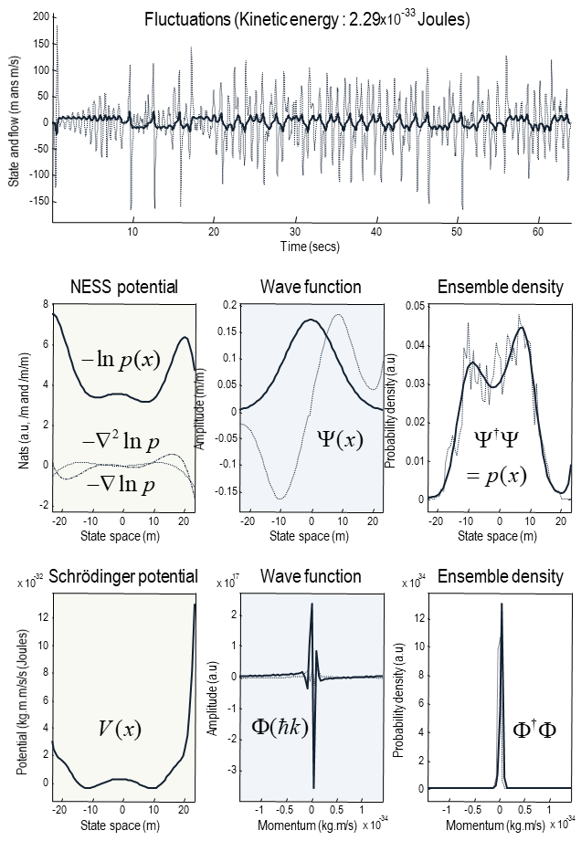

## 2부: 특수한 경우들

### 작은 것들의 이론: 양자역학

이 섹션에서는 비평형 정상상태 밀도의 제곱근을 처리함으로써 효과적으로 밀도 동력학의 양자 형식을 고려합니다. 이 복소수 근은 파동 함수의 역할을 합니다. 간단히 말해서, 우리는 특정 상태의 비평형 정상상태 밀도를 입자의 충분한 설명으로 고려할 것입니다. 이 설명은 작은 입자들이 무작위 변동에 의해 부여된 짧은 정보 길이를 가지고 있으므로, 따라서 균형이 아닌 정상 상태를 매우 빨리 획득한다는 점에서 충분합니다. 이것은 양자 입자에게 고전 역학이 포착하지 못하는 특정한 성질을 부여합니다. 예를 들어, 무작위 변동을 고전 입자가 제약되어 있는 최소 작용 경로 주변의 경로(상태 공간을 통한)를 탐색할 수 있게 하는 것으로 생각할 수 있습니다. 이 탐색은 아래에서 보게 될 것처럼, 입자의 효과적인 '질량'[^note-14]을 결정하는 무작위 변동의 진폭에 의해 결정됩니다. 이로 인한 결과적인 행동은 특성적인 양자 현상을 이끕니다. 예를 들어, 무작위 변동이 없는 경우, 놀라움의 국소 극점에서의 특정 상태는 흐름이 없을 것이며 영원히 그곳에 머무를 것입니다. 그러나 양자 입자의 비평형 정상상태 밀도는 놀라움의 국지적인 풍경을 탐색할 수 있어, 최소값에서 '누출'할 수 있게 해줍니다. 즉, 양자 터널링 (Brookes, 2017) 및 파동과 같은 성질의 행동을 나타냅니다. 우리의 관점에서 이것은 그림 2에서 보여주는 종류의 소음 유발 터널링[^note-15]의 측면에서 고려될 수 있습니다.

> [^note-14]: 고전 경로 주변의 이탈이 (감소된) 질량이 약 0.02mg의 플랑크 질량에 접근할 때 무시할 수 없게 됩니다.
> [^note-15]: 이 문맥에서 '터널링'이라는 개념은 약간의 오해를 일으킬 수 있습니다. 왜냐하면 변동은 퍼텐셜 장벽을 '보지' 못하기 때문입니다 - (열역학적 또는 슈뢰딩거) 퍼텐셜은 흐름에 관련이 있습니다. 이는 변동이 잠재적 경사를 초월한다는 것을 의미하며, 마치 그들이 존재하지 않는 것처럼 보입니다.

이 동적 앙상블을 파동 함수로서의 설명으로 전환함으로써 얻게 되는 핵심적인 통찰력은 상태에 대한 밀도의 푸리에 변환이 (비평형 정상상태 보조정리의 효과에 의해) 흐름에 대한 밀도가 된다는 것입니다[^note-16]. 이것은 유사한 고전 역학에 따라 흐름의 분산이나 분산을 계산하여 에너지의 척도를 만들 수 있음을 의미합니다. 이러한 유사성은 무작위 요동의 진폭을 역질량과 연관시키고, 비례상수는 플랑크 상수임으로써 확립할 수 있습니다. 간단한 차원 분석은 흐름의 단위 (초당 nats)와 비평형 정상상태 퍼텐셜의 기울기 (미터당)가 주어진 질량의 개념을 동기부여합니다. 일단 질량이 그림에 포함되면, 우리는 흐름을 운동량과 연결시키고 그 분산을 운동에너지와 연결시켜 양자 형식에 고전적인 유사체를 해석하는 데 필요한 것들을 갖추게 됩니다.

> [^note-16]: 직관적으로, 특정 상태의 확률 질량이 위상 공간에서 한 점 주변에 집중되어 있다면, 흐름은 무작위 요동에 대항해야 합니다. 이는 흐름이 요동만큼 퍼져 있다는 것을 의미합니다. 반대로, 흐름이 제한된 범위 내에 있다면, 무작위 요동은 특정 상태를 상태 공간 전체에 퍼뜨릴 것입니다. 간단히 말해, 상태와 그 흐름의 분산은 균형상태에서 서로를 보완해야 합니다.

밀도 동력학을 파동 함수의 용어로서 형식화하면 밀도 그 자체의 용어로서의 처리와 몇 가지 흥미로운 차이점이 나타납니다. 특히, 이를 통해 슈뢰딩거 퍼텐셜의 용어로서 밀도 동력학을 요약하고, 파동 함수가 슈뢰딩거 방정식의 해가 될 수 있도록 합니다(슈뢰딩거 퍼텐셜이 제공된 후). 다음에서는 슈뢰딩거 퍼텐셜이 비평형 정상상태 퍼텐셜에서 어떻게 파생되는지, 그리고 암시적으로 파동 함수가 비평형 정상상태 밀도와 어떻게 관련되는지 보게 될 것입니다. 우리는 푸리에 변환의 사용이 공개하는 파동 입자 이중성과 흐름과 운동량 사이의 암시적 관계에 초점을 맞출 것입니다. 이 섹션의 방증적 메시지는 비평형 정상상태 레마(Appendix B)가 기본적으로 파동-입자 이중성을 해소하는 것입니다. 이는 모든 확률 밀도(즉, 파동) 함수가 특정(즉, 입자와 유사한) 특성을 가지고 있다는 관점에서 보게 됩니다. 더 엄밀한 처리에 대해서는 (Koide, 2017)와 (Wang, 2009)를 참조하십시오.

미세한 (양자) 규모에서, 우리는 무작위 요동이 솔레노이드 흐름을 지배하며, 이에 따라 이 섹션에서는 후자를 무시한다고 가정할 것입니다. 이 규모에서는 주로 미세 상태에 대한 균형상태 밀도에 관심이 있습니다. 다음에서는 비평형 정상상태 형식에서 양자물리학을 유도하게 될 것입니다. 간단히 말해서, 이는 비평형 정상상태 밀도를 복소 함수와 그 켤레의 곱으로 표현하는 것을 포함합니다. 결과적으로 나오는 _파동 함수_는 일반적으로 물리적 시스템의 가장 완전한 설명으로 간주됩니다. 단일 입자에 대해서:

$$
\begin{equation}\tag{5.1}
\begin{aligned}
p    &= \Psi \cdot \Psi \\
\Psi &= \Psi(x)e^{-iEt/\hbar}
\end{aligned}
\end{equation}
$$

이러한 방식으로 확률 밀도를 인수분해하는 것이 왜 유용한지 물을 수 있습니다(토론을 위해 (부록 D)를 참조하십시오). 핵심 동기는 플랑셸 레마에서 따르는데, 이는 푸리에 변환 후 함수의 제곱 크기의 적분이 보존된다는 것을 보장합니다 (예를 들어, 공간과 주파수에서의 파워는 동일하다). 디랙 표기법의 측면에서 이는: $\braket{\Phi^\dagger|\Phi}=\braket{\Psi^\dagger|\Psi}=1$, 여기서 $\Phi(k)$는 $\Psi(x)$의 푸리에 변환입니다. 이는 _확률진폭으로서_ 둘 모두를 다루는 것으로 활용될 수 있으며, 그 제곱 크기는 확률 밀도입니다. 아래에서는 주파수 모드가 파동-입자 이중성과 하이젠베르크 불확정성 원리와 같은 것들을 근본적으로 지지하는 흥미로운 해석을 가지고 있음을 볼 것입니다. 간단히 말해서, 비평형 정상상태 밀도의 복소근을 사용하면 푸리에 변환을 사용하고 상태 공간에서의 파장에 대해 이야기할 수 있습니다. 차례로, 경계 조건(예를 들어, 밀도 함수의 연속성)은 밀도 함수에 형식적 제약을 부과합니다(예를 들어, 원은 유한한 수의 파장으로만 나눌 수 있습니다), 이로 인해 양자 행동이 나타납니다.

우선, 우리는 비평형 정상상태 밀도가 (시간 독립적인) 슈뢰딩거 방정식의 해로부터 회복될 수 있음을 증명할 것입니다. 이는 거의 모든 실증적인 분자, 원자, 그리고 소원자 측정에 대한 정확한 설명을 제공합니다:

$$
\begin{equation}\tag{5.2}
\begin{aligned}
\pmb{H}\Psi &= E\Psi \\
\pmb{H}     &= V(x)-\tfrac{\hbar^2}{2m}\cdot\nabla^2 \\
V(x)        &= \tfrac{m}{2}f\cdot f + \tfrac{\hbar}{2}\nabla\cdot f \\
\end{aligned}
\end{equation}
$$

여기서 $\pmb{H}$는 입자의 에너지 $E$를 반환하는 헤밀턴 연산자에 해당하며, $V(x)$는 입자의 상태에 대한 슈뢰딩거 퍼텐셜입니다. 다른 텍스트와의 일관성을 위해, 이 섹션에서는 입자의 상태를 $x\equiv \pi_k$로 표시할 것입니다. 슈뢰딩거의 방정식은 양자역학의 거의 모든 응용에 중심적입니다; 이에는 특수상대성 이론과 양자역학을 결합하는 양자장 이론이 포함됩니다. 또한, 스트링 이론과 같은 양자중력의 형식화는 슈뢰딩거의 방정식을 수정하지 않습니다. 위의 시간 독립적인 (단일 입자) 슈뢰딩거 방정식은 다음과 같이 유도될 수 있습니다.

#### 제일원리에서 슈뢰딩거 방정식

우리의 시작점은 흐름을 비평형 정상상태 밀도와 요동의 진폭의 관점에서 표현하는 것이며, 여기서 진폭은 (줄어든) 질량과 플랑크 상수의 관점에서 표현됩니다. 이를 통해 우리는 흐름의 관점에서 파동 함수의 그래디언트를 표현할 수 있습니다.[^note-17]:

> [^note-17]: 이 최종 방정식은 $\Psi^\dagger\Psi\in\R\Rightarrow\Psi^\dagger\nabla\Psi=\Psi\nabla\Psi^\dagger$ 라는 사실을 활용한다.

$$
\begin{equation}\tag{5.3}
\begin{aligned}
\Gamma     &= \tfrac{\hbar}{2m} \\
p          &= \Psi^{\dagger}\Psi \\
f          &= \tfrac{\hbar}{2m}\nabla\ln{p}=-\Gamma\nabla\Im \Rightarrow \\
pf         &= \tfrac{\hbar}{2m}\nabla p = \tfrac{\hbar}{2m}\nabla(\Psi\cdot\Psi^{\dagger}) \Rightarrow \\
\Psi^{\dagger}f\Psi &= \tfrac{\hbar}{2m}(\Psi^{\dagger}\nabla\Psi+\Psi\nabla\Psi^{\dagger}) \Rightarrow \\
\nabla\Psi &= \tfrac{m}{\hbar}f\Psi \\
\end{aligned}
\end{equation}
$$

이러한 방정식들은 이제 밀도 동역학 (즉, Fokker Planck 방정식)에 대입할 수 있습니다.

$$
\begin{equation}\tag{5.4}
\begin{aligned}
\dot{p} &= \tfrac{\hbar}{2m}\nabla^2 p - p\nabla\cdot f - f \cdot \nabla p \\
        &= \tfrac{\hbar}{2m}\nabla^2\Psi^{\dagger}\Psi
           - \tfrac{1}{2}\Psi\nabla\cdot f\Psi^{\dagger}
           - \tfrac{1}{2}\Psi^{\dagger}\nabla\cdot f\Psi
           - \Psi f\cdot\nabla\Psi^{\dagger}
           - \Psi^{\dagger} f \cdot\nabla\Psi \\
        &= (\tfrac{\hbar}{2m}\nabla^2)+(\tfrac{\hbar}{2m}\nabla^2) \\
        \\
V(x)    &= \tfrac{m}{2}f\cdot f+\tfrac{\hbar}{2}\cdot f \\
        &= \tfrac{\hbar^{2}}{4m}(\tfrac{1}{2}\nabla\Im\cdot\nabla\Im-\nabla^2\Im)
\end{aligned}
\end{equation}
$$

이를 통해 우리는 집합체 동역학을 파동 함수에 작용하는 Fokker Planck 연산자와 동일한 역할을 하는 (Hamiltonian) 연산자의 용어로 표현할 수 있습니다:

$$
\begin{equation}\tag{5.5}
\begin{aligned}
i\hbar\dot{p} &= \Psi^{\dagger}i\hbar\Psi + \Psi i\hbar\Psi = \Psi^{\dagger}E\Psi - \Psi E\Psi^{\dagger} = 0 \\
-\hbar\dot{p} &= \Psi^{\dagger}\pmb{H}\Psi + \Psi\pmb{H}\Psi^{\dagger} = 0 \\
\pmb{H}       &= V(x) - \tfrac{\hbar^2}{2m}\nabla^2 \\
              &\Leftarrow \\
\pmb{H}\Psi   &= i\hbar\dot{\Psi} = E\Psi \\
\end{aligned}
\end{equation}
$$

이것이 시간 독립적인 슈뢰딩거 파동 방정식(단일 입자에 대한)입니다. 사실상, 이것은 밀도 동역학을 다른 방식으로 표현하는 것이며, 연산자의 고유값이 에너지에 대한 해석을 얻게 됩니다. Fokker Planck 연산자와 Hamiltonian 연산자 사이의 형식적 유사성을 각각의 연산자에 대한 Fokker Planck와 (시간 독립적인) 슈뢰딩거 파동 방정식의 용어로 표현함으로써 확인할 수 있습니다:

$$
\begin{equation}\tag{5.6}
\begin{aligned}
\dot{p} &= \pmb{L}p(x) \\
\pmb{L} &= \tfrac{\hbar}{2m}\nabla^2 - \nabla\cdot f \\
\\
i\hbar\dot{\Psi}(x) &= \pmb{H}\Psi(x) \\
-\tfrac{1}{\hbar}\pmb{H} &= \tfrac{\hbar}{2m}\nabla^2 - \tfrac{1}{\hbar}V(x) \\
\end{aligned}
\end{equation}
$$

이러한 방정식들은 이 섹션의 주요 결론을 예고합니다. 즉, Fokker Planck 공식화와 그 비평형 정상상태 해는 흐름에 의존하며, 슈뢰딩거 파동 방정식의 해는 슈뢰딩거 퍼텐셜을 필요로 합니다. 서론에서 언급했듯이, 우리가 비평형 정상상태 밀도의 Fourier 변환에 대한 매개변수화를 고려할 때 사물들이 흥미롭게 변합니다. 이는 다음과 같습니다.

#### 파동-입자 이중성과 드 브로이 가설

일반성을 잃지 않고, 우리는 파동 함수를 그것의 푸리에 변환에 대해 표현할 수 있습니다. 이는 다음의 푸리에 변환 쌍을 제공하며, 여기서 $k$는 파장의 수를 나타냅니다:

$$
\begin{equation}\tag{5.7}
\begin{aligned}
\Psi(x,t) &= \Psi(x)e^{-i\omega t} = \Psi(x)^{-iEt/\hbar} \\
\Psi(x)   &= \frac{1}{\sqrt{2\pi}}\int_{-\infty}^{\infty}\Phi(k)\cdot e^{ik\cdot x}dk \\
\Phi(k)   &= \frac{1}{\sqrt{2\pi}}\int_{-\infty}^{\infty}\Psi(x)\cdot e^{-ik\cdot x}dk \\
\end{aligned}
\end{equation}
$$

디랙 표기법을 사용하면, $\nabla\Psi = \tfrac{m}{\hbar}f\Psi$ 와 $\braket{\Phi^\dagger|\Phi}=\braket{\Psi^\dagger|\Psi} $ (플랑셔렐 Plancherel 정리에 의해)를 사용하여, 우리는 다음과 같이 쓸 수 있습니다:

$$
\begin{equation}\tag{5.8}
\begin{aligned}
\braket{\Psi^{\dagger}(x)|-i\hbar\nabla|\Psi(x)}
  &= -i\hbar\int_{-\infty}^{\infty} \Psi(x)^{\dagger}\nabla\Psi(x)dx \\
  &= -i\hbar\int_{-\infty}^{\infty} \Psi^{\dagger}\frac{m}{\hbar}f\Psi(x)dx = -imf\\
  &= \braket{\Phi(k)^{\dagger}|\hbar k|\Phi(k)} = \hbar k \Rightarrow mf = i\hbar k \\
\end{aligned}
\end{equation}
$$

세 번째 방정식은 (5.7)을 첫 번째 식에 대입함으로써 얻어집니다. 여기서 흥미로운 것은 우리가 (축소된) _질량_ 곱하기 예상 _흐름_ 을 공간의 파장수 예상값과 연관시킬 수 있다는 것입니다. 이는 자연스럽게 드 브로이 가설에 따른 운동량 해석으로 이어지며, 이로 인해 양자론적 처리와 관련된 일반적인 에너지 및 운동량 연산자로 이어집니다.

$$
\begin{equation}\tag{5.9}
\begin{aligned}
\pmb{H}\Psi &= i\hbar\Psi = h\omega\Psi = E\Psi \\
\pmb{p}\Psi &= -i\hbar\nabla\Psi = \hbar k\Psi \\
\\
E &\triangleq \hbar\omega \\
p &\triangleq \hbar \pmb{k} = m\pmb{f} \\
\end{aligned}
\end{equation}
$$

고전 물리학과의 유사성에 따라 - 아래의 식 (7.8) 참조 - 햄릴턴을 운동 에너지 연산자와 위치 에너지 연산자로 구성된 것으로 해석할 수 있습니다. 여기서 운동 에너지 연산자는 운동량 연산자의 이중 적용입니다:

$$
\begin{equation}\tag{5.10}
\begin{aligned}
\pmb{H} &= \pmb{T}+V(x) \\
\pmb{T} &= \tfrac{1}{2m}\pmb{p}\cdot \pmb{p} = -\tfrac{\hbar^2}{2m}\cdot\nabla^2 \\
\end{aligned}
\end{equation}
$$

이를 통해 햄밀턴 연산자가 반환하는 기대값을 운동 에너지와 위치 에너지와 연관시킬 수 있습니다. 이는 흐름과 그 발산의 형태로 표현될 수 있습니다:

$$
\begin{equation}\tag{5.11}
\begin{aligned}
\braket{\Psi^{\dagger}|\pmb{H}|\Psi}
  &= \underbrace{\braket{\Psi^{\dagger}|\pmb{T}|\Psi}}_{\text{kinetic energy}}
  +  \underbrace{\braket{\Psi^{\dagger}|V(x)|\Psi}}_{\text{potential energy}} \\
  &= \underbrace{\tfrac{m}{2}\braket{f\cdot f}}_{\text{kinetic energy}}
  +  \underbrace{\braket{\tfrac{m}{2} f\cdot f + \tfrac{\hbar}{2}\nabla\cdot f}}_{\text{potential energy}} = E \\
\\
\braket{\nabla\cdot f}
  &= -\Gamma\braket{\nabla^2\Im} = -\Gamma\braket{\nabla\Im\cdot\nabla\Im} = -\tfrac{2m}{\hbar}\braket{f\cdot f}
\end{aligned}
\end{equation}
$$

이러한 처리에서 (기본 상태의) 에너지는 0입니다. 왜냐하면 비평형 정상상태에서의 위치 에너지는 운동 에너지로 균형을 이루기 때문이고, 둘 다 놀라움 놀라움 의 곡률을 반영합니다: 자세한 내용은 (부록 C)의 (13.1)을 참조하십시오. 무작위 변동없이 (5.10)을 그것의 고전적인 유사항 (7.8)과 비교해 보십시오. 흥미롭게도, 우리가 빛의 속도로 움직이는 자유 입자를 고려하면 우리는 아인슈타인의 유명한 방정식(Einstein, 2013)을 회복합니다

$$
\begin{equation}\tag{5.12}
\begin{aligned}
f(x)=c \Rightarrow E = mc^2 \\
\end{aligned}
\end{equation}
$$

아마도 원래 의도했던 방식과는 약간 다르게 이해될 수 있습니다. 슈뢰딩거 방정식의 라그랑지안 형식화와 관련된 해밀턴 방정식의 좌표 표현에 대한 완전한 처리에 대해서는 (Arsenović 등, 2014)를 참조하십시오.

#### 하이젠베르그 불확정성 원리

위의 인사이트 중 하나는 파동 함수의 푸리에 변환에 의해 제공되는 모멘텀과 흐름 사이의 동치성입니다. 이 설정에서, $p(x)=\Psi^\dagger\Psi$ 와 $p(k)=\Phi^\dagger\Phi$는 위치와 파수, 모멘텀 또는 흐름에 대한 확률 밀도를 제공합니다. 푸리에 변환은 자연스럽게 하이젠베르그의 불확실성 원리로 이어지는데, 이는 이러한 각각의 분포의 불확실성 (즉, 표준 편차)에 하한을 둡니다:

$$
\begin{equation}\tag{5.13}
\begin{aligned}
\sigma_x\sigma_p \geq \tfrac{\hbar}{2} \\
\end{aligned}
\end{equation}
$$

이는 유명하게도 동시에 입자의 위치와 운동량을 정확하게 측정할 수 없음을 의미합니다. 불확실성 원칙은 비평형 정상상태 조건에 대해 직접적으로 흐름을 통해, 어떤 상태라도 가우스 분포를 가정함으로써(단순히 하기 위함) 입증될 수 있습니다[^note-18]. 위치와 흐름의 분산 또는 편차에 대해:

> [^note-18]: 가우시안 가정하에는 (5.13)의 부방정식이 방정식이 됩니다.

$$
\begin{equation}\tag{5.14}
\begin{aligned}
\Sigma_x\Sigma_p
  &= E[x\cdot x]E[mf\cdot mf] \\
  &= (\tfrac{\hbar}{2})^2 \Sigma_x^{-2}E[x\cdot x]E[x\cdot x] = (\tfrac{\hbar}{2})^2 \\
  \\
\Im(x)
  &= \tfrac{1}{2}x\cdot \Sigma_x^{-1}\cdot x \\
f(x)
  &= -\tfrac{\hbar}{2m}\nabla\Im = \tfrac{\hbar}{2m}\nabla^2\Im\cdot x \\
\Sigma_x^{-1}
  &= -\nabla^2\Im \\
\end{aligned}
\end{equation}
$$

간단히 말해서, 하이젠베르그 불확정성 원리는 - 비평형 정상상태에서 - 만약 입자의 상태가 정확하게 알려져 있다면, 그것의 흐름에 대한 불확실성이 있고, 그 반대도 마찬가지라는 것을 의미합니다. 직관적으로, 이는 만약 상태가 상태 공간의 특정 지점 주변에 대부분의 확률 질량을 가지고 있다면, 흐름은 무작위 흩날림의 효과를 대항하기 위해 모든 방향에서 경사를 열심히 재건해야 한다는 것을 의미합니다. 이는 흐름에 대한 확률 분포가 흩어져 있다는 것을 의미합니다. (5.13)이 양자 이론의 가정에 의존하지 않고 바로 비평형 정상상태 보조정리에서 나온다는 사실을 생각해보는 것은 흥미롭습니다.

#### 추론, 측정 및 파동 함수 붕괴?

포커-프랑크 방정식에서 슈뢰딩거 방정식을 도출하거나, 경로 적분 공식에서 도출하는 것 자체는 별로 놀라운 일이 아닙니다. 위 도출에서 흥미로운 측면들은 비평형 정상상태 흐름을 슈뢰딩거 방정식에 대입하는 것에서 나옵니다. 이 대입은 양자 처리에서의 운동량이 질량 곱하기 흐름에 해당한다는 것을 제안함으로써, 흐름에 대한 밀도가 운동량에 대한 밀도가 되는 파동 입자 이중성에 대한 관점을 제공합니다. 또한, 흐름의 이차 통계는 고전 역학에 비유하여 운동 에너지와 연관될 수 있습니다(아래 참조). 유의할 점은 운동 에너지와 슈뢰딩거 퍼텐셜 모두 파동 함수의 곡률을 반영한다는 것입니다. 직관적으로, 이는 높은 에너지 밀도가 높은 음의 곡률을 가지며, 잠재적이고 운동적인 부분으로 분해될 수 있는 뚜렷한 피크를 가진다는 것을 의미합니다 - 그리고 적절한 연산자를 파동 함수에 적용하여 양화할 수 있습니다.

어디에서 양자 행동이 나오는지 물어볼 수 있습니다. 일차원 상태 공간에서 주기적인 경계 조건을 갖는 파동 함수와 관련된 이산 에너지를 직관적으로 이해할 수 있습니다. 암묵적인 연속성 제약조건은 공간 파장(역파수)이 제한되어 있음을 의미하며, 상태 공간의 주기적인 지지에 유한한 수의 파장이 '맞춰져야' 합니다. 직관적으로, 무작위 흩날림의 효과는 확률 밀도 동역학에 대한 부드러운 해를 요구하며, 만약 방사선 대칭성으로 장착되어 있다면, 유한한 수의 해만을 채택할 수 있습니다. 실제적인 예로, 구면 극 좌표 $x = (r,\theta,\phi)$에 있는 수소 원자의 (해석적) 해는 무작위 흩날림의 진폭과 슈뢰딩거 퍼텐셜에서 얻을 수 있습니다. 다음과 같이:

$$
\begin{equation}\tag{5.15}
\begin{aligned}
\Gamma
  &= \tfrac{\hbar}{2m},\space\space\space V(x) = -\tfrac{\hbar^2}{a_0 m_e r} \\
  \\
\Psi_{n\ell m}(x)
  &= \sqrt{Z}e^{\rho/2} \rho^\ell L_{n-\ell-1}^{\ell+\ell+1}(\rho)Y_\ell^m (\theta,\phi) \\
\rho
  &= \tfrac{2r}{na_0},\space\space\space Z = (\tfrac{2}{na_0})^3\tfrac{n-\ell-1}{2n(n+\ell)!}
\end{aligned}
\end{equation}
$$

여기서 $m_e$는 전자 질량, $a_0$는 보어 반지름이고, $L_{n-\ell-1}^{\ell-\ell+1}$과 $Y_\ell^m$은 각각 일반화된 라그랑주 다항식(차수 $n-\ell-1$)과 구면 조화함수(차수 $\ell$과 순서 m)입니다. 여기서, $n,\ell,m$은 이산적인(직교 정규화된) 해를 특징짓고 수소 원자에 양자 행동을 부여하는 방위각, 자기 양자 수입니다.

양자 연산자의 적용은 일반적으로 측정에 대한 해석으로 이해되며 - 그리고 암묵적인 파동 함수 붕괴에 대해 논의됩니다. 이 서적에서, 우리는 측정이 불균형 안정 상태의 본질적인 부분이기 때문에, 파동 함수 붕괴의 해석적 문제를 피합니다. 다른 말로, 측정은 측정 시스템 외부의 상태와 관찰자의 내부 상태 사이의 확률적인 매핑에 해당합니다. 다행히도, 입자의 상태와 그 외부 상태(즉, 측정 시스템이나 관찰자의 담요 상태) 사이에 중첩이 형성될 때 명백한 파동 함수 붕괴가 예측됩니다. 결정적으로, 시스템과 관찰자의 결합된 파동 함수는 계속해서 슈뢰딩거 방정식을 따릅니다(Zurek, 2009). 우리는 Part Three에서 측정과 추론을 고려할 것입니다 - 내부와 외부 상태 사이의 일반화된 동기성에 대한 관점에서. 이는 현재의 관점에서 파동 함수의 붕괴는 본질적으로 불필요하다는 것을 의미하며, 따라서 보흠, 앙상블 또는 '많은 세계' 해석(Ballentine, 1970; Bohm, 1952; Garriga and Vilenkin, 2001)과 더 일관성이 있습니다.

파동 붕괴 또는 양자 디코히어런스의 다른 해석과 비평형 정상상태 보조정리에 의해 제시된 관점 사이의 상응 관계는 이러한 해석들이 얼마나 위의 관점에 가깝게 떨어지는지에 따라 결정됩니다. 기본적인(불균형 안정 상태) 해결책은 매우 빠르게 진화하는 시스템의 상태에 대한 확률 분포 또는 파동 함수입니다. 시스템이 불균형 안정 상태에 있는 한, 측정 가능한 양의 상태 공간 평균(즉, 고유 상태)은 시간 평균에 해당할 것입니다. 이는 상태의 앙상블이나 많은 세계를 통계적으로 구분할 수 없는 빠른 진화의 단일 궤적에서 해석될 수 있습니다. 흥미롭게도, 이 빠른 측면은 양자 형식화의 기본적인 전제에 의해 보장됩니다. 이는 질량이 플랑크 상수보다 작아야 한다는 사실로부터 따르는데, $\Gamma > 1 \Rightarrow m < \tfrac{\hbar}{2}$는 거의 순간적이 될 것입니다. 간단히 말해서, 어떤 사람은 양자 기계적 행동을 확률적 의미에서만 측정(측정) 될 수 있는 매력적인 다양체에서의 굉장히 빠른 흐름의 측면에서 해석할 수 있으며, 결과적으로 나타나는 앙상블 밀도(또는 파동 함수)의 푸리에 변환은 입자의 상태에 파동 같은 성질을 부여합니다.

위의 운동량과 운동 에너지 개념은 고전 역학에서 상속되었으며, 여기서 운동량은 질량과 예상 흐름의 곱으로 연관되어 있었으며, 질량은 요동의 정밀도를 대표합니다. 이 단계에서, 운동량은 속도의 속성이 아닙니다. 다시 말해, 상태의 흐름 또는 _상태의 움직임_은 _움직임의 상태_가 아닙니다. 나중에(고전 역학에 대한 섹션에서), 우리는 움직임의 좌표를 도입할 것이며, 어떤 상태(즉, 감각 상태)는 다른 상태(즉, 활동 상태)의 고차 움직임이 될 것입니다(움직임의 방정식을 통해). 이는 우리가 단일 양자 상태의 설정에서 운동량에 대해 얘기할 수 있는 이유를 설명하는 미묘한 점입니다 - 고전 역학과 대조적으로, 일반적으로 위치와 운동량을 포함하는 일반화된 상태를 주장합니다. 위안스럽게도, 우리는 나중에 작은 요동의 고전적 한계에서 상태의 움직임이 움직임의 상태가 됨을 보게 될 것입니다.

#### 요약

양자역학에 익숙한 독자들은 위의 처리가 다소 가볍다는 것을 인지할 것입니다. 현재 분석의 범위를 벗어난 양자역학의 많은 문제들이 있습니다. 이 분석은 생물체의 거시적 규모에서의 자기조직화를 이해하는 것을 목표로 하고 있습니다. 따라서, 요동이 지배적인 미세한 규모나 큰 (천문학적인) 규모에는 덜 관심이 있습니다. 이 절은 단지 나중에 고려되는 작은 규모와 큰 규모 사이의 다리 역할을 합니다. 얽힘, 양자 정보 이론 및 열역학 사이에는 이 다리에 관한 많은 예견적인 연결점이 있습니다 (D'Alessio et al., 2016; Esposito et al., 2009; Parrondo et al., 2015); 특히 양자 진동 정리들(Alhambra et al., 2016a; Alhambra et al., 2016b; Holmes et al., 2019)[^note-19]. 다음 절에서는 입자의 앙상블에 대한 확률 열역학을 통해 진동 정리들을 소개합니다. 그 다음 파트 3에서는 마르코프 담요에 의해 유도된 정보 기하학의 측면에서 '측정'에 대한 적분 진동 정리를 소개합니다; c.f., (Sengupta and Friston, 2017). 그 시점에 우리는 측정 문제와 파동 함수 붕괴 개념을 간단히 다시 살펴볼 것입니다.

> [^note-19]: 이 문제에 대한 응답 해 주신을 Peter Morgan과 Biswa Sengupta에게 감사드립니다..

각각의 비평형 정상상태와 양자 표현을 고찰하고, 두 표현이 서로에게 제공하는 것이 무엇인지 생각해 보는 것은 흥미로운 접근입니다. 확률 분포와 흔들림의 진폭을 알고 있다면 비평형 정상상태 밀도의 고유해를 알 수 있다는 것을 비평형 정상상태 보조정리가 말해줍니다. 반대로, 밀도와 흔들림의 진폭이 주어지면 기대 플로우와 관련된 슈뢰딩거 퍼텐셜을 계산할 수 있습니다. 반면 양자 계산은 흔들림의 진폭(또는 축소된 질량)과 슈뢰딩거 퍼텐셜을 알아야 하는 비평형 정상상태 밀도(파동 함수를 통해)의 솔루션을 지정합니다. 중요한 것은 슈뢰딩거 퍼텐셜은 그레디언트와 곡률을 통해 확률 분포로부터 유도될 수 있다는 점입니다: (5.4) 식 참조. 그러나 비평형 정상상태 밀도는 파동 방정식의 해를 통해서만 슈뢰딩거 퍼텐셜로부터 복원될 수 있으며, 이는 많은 경우에 해결하기 어렵습니다. 그림 13은 우리의 합성 수프에서 입자를 수치적으로 분석하여 이 점을 설명하려는 시도를 합니다. 이 그림에서 주요한 점은 플로우 (및 관련된 비평형 정상상태 밀도)로부터 슈뢰딩거 퍼텐셜 (및 관련된 파동 함수)을 도출할 수 있다는 것입니다.

결론적으로, (양자) 행동에 대한 완전한 설명은 흔들림의 진폭 (또는 축소된 질량)과 비평형 정상상태 밀도 (또는 슈뢰딩거 퍼텐셜)을 지정할 수 있다면 가능합니다. 테이블 2는 이러한 방식으로 설명할 수 있는 시스템의 다양성을 보여주는 몇 가지 일반적인 예시를 제공합니다. 그러나 이제 우리는 입자의 앙상블 동작에 대해 다루어 보겠습니다. 이 경우 입자들이 플로우에 대해 동일한 제약 조건을 공유할 만큼 충분히 유사하다는 (앙상블) 가정 하에 다루게 됩니다.

FIGURE 13

_특정 양자역학_. 이 그림은 우리 합성 수프의 외부 입자의 하나의 마이크로상태를 양자역학적으로 처리하는 방법을 보여줍니다. 이 예시의 목표는 상태의 역학을 슈뢰딩거 퍼텐셜과 이에 따른 운동 에너지로 특성화하는 방법을 보여주는 것입니다. 또한, 비평형 정상상태 보조원리를 사용하여 슈뢰딩거 방정식의 해결을 피할 수 있는 방법도 이 예시에서 보여줍니다. 여기서 우리는 해당 상태의 흐름이 다른 모든 상태에 대한 주변 또는 기대 흐름의 (선형) 혼합물과 일부 빠른, 무작위 흔들림으로 가정하여 이 하나의 (마이크로) 상태를 고립하여 고려합니다. 이러한 흔들림이 어떻게 생성되는지에 대해 많은 지식이 있지만, 우리는 이것을 확률적이고 충분히 빠른 것으로 취급하고 흥미로운 동작이 슈뢰딩거 퍼텐셜에 의해 포착되는 것으로만 가정합니다. 시간 간격은 상태 (실선 - 임의로 할당된 미터 단위)과 흐름 (점선)으로 상단 패널에 표시됩니다. 상태의 시간에 따른 표본 분포는 64개 구간에 대한 샘플 밀도의 음의 로그에 대한 6차 다항식 적합을 사용하여 비평형 정상상태 퍼텐셜을 기반으로 평가되었습니다. 그 결과 추정치와 해당 도함수는 왼쪽 중간 패널에 표시되었습니다. 이를 통해 방정식 (5.4)는 슈뢰딩거 퍼텐셜 (왼쪽 하단 패널)을 지정합니다. 그런 다음 슈뢰딩거 방정식을 해결하여 상태 공간에서 위치에 대한 파동 함수 (중간 패널)와 운동량에 대한 푸리에 변환 (하단 중간 패널)을 평가할 수 있습니다. 위치 및 운동량에 대한 해당 밀도는 오른쪽 패널에 표시되며, 해당 표본 밀도 위에 겹쳐져 있습니다. 마지막으로, 운동량에 대한 밀도는 방정식 (5.11)을 통해 운동 에너지를 지정합니다. 여기서 운동 (및 퍼텐셜) 에너지는 $2.29 \times 10^{-33}$였습니다. 이 에너지 (및 슈뢰딩거 퍼텐셜)를 계량화하기 위해 무작위 흔들림의 크기 - 혹은 동등하게 줄어든 질량 -을 알아야 합니다. 이는 흐름의 기대치 또는 주변 흐름을 제거한 후 흔들림의 잔차로부터 간단하게 계산할 수 있습니다. 이 양자 시스템의 줄어든 질량은 $5.52 \times 10^{-38}$이었습니다. 이로써 비평형 정상상태 퍼텐셜을 사용하여 어떻게 운동의 특성을 표현하는지를 설명하는 것으로, 이 그림의 결과는 슈뢰딩거 방정식을 풀지 않고 비평형 정상상태 퍼텐셜에서 직접 유도되었습니다. 다시 말해, 앙상블 밀도는 비평형 정상상태 퍼텐셜에서 직접 지정되므로 파동 함수 (및 그 푸리에 변환)는 앙상블 밀도로부터 직접 지정될 수 있습니다. 여기서는 앙상블 밀도를 대칭 가우시안 성분과 비대칭 (양수) 잔차로 임의로 분리했습니다. 그런 다음 (제곱근을 취한) 두 성분을 파동 함수의 실수부와 허수부로 할당했습니다. 파동 함수의 이 보완적인 유도는 본문에서 언급한 점을 설명합니다. 즉, 앙상블 밀도에서 직접 파동 함수를 생성하거나 슈뢰딩거 퍼텐셜에서 시작하여 슈뢰딩거 방정식을 풀 수 있습니다.

TABLE 2 
Some common (analytic) solutions ot Schrödinger wave equation

| System                      | Schrödinger potential                                                  | Fluctuations                          | Remarks |
|-----------------------------|:-----------------------------------------------------------------------|--------------------------------------|---------|
| Free particle               | $V(x)=0$                                                               | $\Gamma=\tfrac{\hbar}{2m}$           | In the absence of a potential the particle is free, and the wave function has an exponential solution  |
| Quantum harmonic oscillator | $V(x)=\tfrac 1 2 m\omega^2x^2$                                         | $\Gamma=\tfrac{\hbar}{2m}$           | The quadratic potential well gives Gaussian solutions modulated by Hermite polynomials |
| Electrostatic potential     | $V(r)=-\frac{e_1e_2}{4\pi\varepsilon_0 r}$                             | $\Gamma=\tfrac{\hbar}{2m}$           | This potential corresponds to Coulomb potential energy for two point charges $e_1$ and $e_2$|
| Hydrogen atom               | $\begin{aligned}V(r)&=-\frac{\hbar^2}{a_0 m_e r}\\&=-\frac{e^2}{4\pi\varepsilon_0 r}\end{aligned}$ |$\begin{aligned}\Gamma&=\tfrac{\hbar}{2m}\\m&=\frac{m_p m_e}{m_p+m_e}\end{aligned}$ | Here, $m_p$ and $m_e$ correspond to the mass of a positron and electron respectively and $e$ is electron charge |
| Pöschl-Teller               | $V(x) = - \frac{\lambda(\lambda+1)}{2}sech^2(x)$                       | $\Gamma=\tfrac{\hbar}{2m}$           | These solutions are Legendre functions of tanh(x) |

[TABLE 2](./img/t2.png)