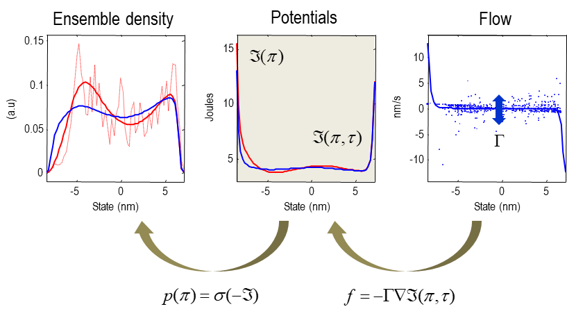
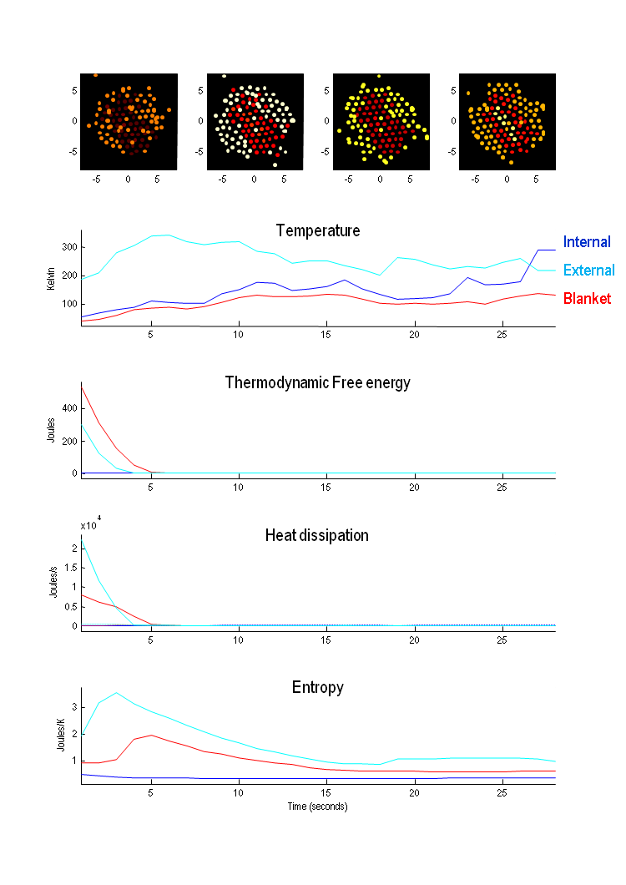

### 대규모의 작은 것들의 이론: 통계역학

_"만약 물리 이론들이 사람이라면, 열역학은 마을의 마녀일 것입니다. 세기에 걸쳐, 일반 상대성 이론과 양자역학과 같은 물리학의 주요 혁명에도 불구하고 다른 이론들이 생기고 사라지는 가운데서, 그는 조용히 웃음을 지으며 다른 이론들이 그녀를 다소 이상하게 여기는 것을 인정하고 있지만, 모두가 그녀에게 조언을 구하러 가고, 아무도 그녀를 반박할 수 없는 것이죠."_ (Goold et al., 2016); p1.

이 섹션에서는 하나의 작은 입자의 행동에서 여러 개의 작은 입자 앙상블로 전환합니다. 예를 들어, 마르코프 담요로 둘러싸인 많은 내부 입자들로 구성된 앙상블입니다. 이 과정에서 위에서 언급한 앙상블 가정을 사용합니다. 다시 말해, 앙상블의 상태는 각 구성 입자의 상응 상태와 동일하다고 할 수 있도록 구분됩니다. 이를 통해 비평형 안정상태 밀도를 앙상블 밀도와 연관시킬 수 있습니다. 다시 말해, 시간에 따라 특정 상태에서 단일 입자를 샘플링하는 확률을 묘사하는 것뿐만 아니라, 비평형 안정상태 밀도는 동일한 (또는 이웃) 상태를 점유하는 입자의 수를 묘사합니다. 중요한 점은, 비평형 안정상태에서 모든 입자가 동일한 앙상블 밀도를 공유하고, 그들의 흐름은 동일한 앙상블 퍼텐셜(즉, 비평형 안정상태 퍼텐셜)로 묘사될 수 있다는 것입니다. 그러나 비평형 안정상태 이전에는 흐름을 묘사하는 (열역학적인) 퍼텐셜은 앙상블 퍼텐셜이 될 수 없습니다. 그렇지 않으면 비평형 안정상태 보조원리가 만족되지 않을 것입니다. 우리는 두 가지 간의 내재적인 차이가 열역학적 자유 에너지에 해당한다는 것을 알게 될 것입니다. 앙상블 가정은 약한 결합 가정을 함의하며, 이는 이 섹션의 후반부에서 비평형 안정상태 이론을 통해 통계 역학의 중요한 결과인 '자르지스키 관계'와의 연결시 중요한 역할을 합니다.

간단히 말해서, 입자의 흐름을 앙상블 밀도와 관련시킬 수 있는 능력을 가지면, 우리는 경로를 퍼텐셜과 힘으로 묘사할 수 있습니다. 이를 통해 경로에 작업과 확률적 엔트로피와 같은 속성을 부여하여, 열역학의 제 1 및 제 2 법칙을 이루는 균형 방정식을 얻을 수 있습니다. 이러한 균형 방정식은 단일 경로 (단일 입자의 경로)나 앙상블 평균 수준에서 표현될 수 있으며, (변동) 이론은 기대되는 측정 가능한 양의 진화에 대한 제약을 제시합니다. 효과적으로, 이러한 변동 이론은 제 2 법칙을 일반화하고 확장시킵니다. 이 섹션은 (Seifert, 2012)의 처리를 따릅니다. 이 논문은 확률적 열역학을 포괄적으로 개관하고 (개별 경로에 대한 앙상블 평균 개념을 통해) 이를 통계 역학의 기초로 삼습니다. 시간에 따라 변하는 밀도를 다루므로, 우리는 비평형 안정상태의 등장과 이것이 열역학적 자유 에너지와 엔트로피 생성에 어떤 영향을 미치는지에 초점을 맞출 것입니다.

#### 확률적 열역학

확률적 열역학에 대해 생각해 봅시다. 고려해야 할 입자 앙상블은 열탕 욕조 또는 저장소와 같은 역할을 하는 높은 수준의 마르코프 담요에 속하는 입자들 ${\pi_1^{(i)},\pi_2^{(i)},\ldots,}$ 입니다. (4.2)로부터 k번째 특정 상태의 흐름은 랑주뱅 형식으로 표현될 수 있습니다.

$$
\begin{equation}\tag{6.1}
\begin{aligned}
\dot{\pi}_k^{(i)}
  &= f(\pi_k^{(i)},b^{(i)}(\tau))+\omega_k^{(i)} \\
  &= f(\pi_k^{(i)},\tau )+\omega_k^{(i)} \\
\end{aligned}
\end{equation}
$$

이는 다른 입자들의 담요 상태에 대한 종속성을 시간에 따라 변하는 흐름으로 표현한 것입니다. 표기의 편의를 위해 첨자와 위첨자를 생략하고 특정 상태를 나타내는 $\pi \triangleq \pi_k^{(i)}$를 사용하여 (열역학적인) 앙상블을 구성하는 특정 상태를 표현합니다. 앙상블의 (통계적인) 물리를 개발하기 위해 우리는 랑주뱅 동역학을 열역학적 퍼텐셜 $U(\pi,\tau)$와 관련된 힘 $f_m(\pi,\tau)$로 표현하는 방법을 사용합니다. 이를 위해 헬름홀츠 분해를 사용합니다.

$$
\begin{equation}\tag{6.2}
\begin{aligned}
f(\pi,\tau)
  &= (\mu_m - Q_m)f_m(\pi,\tau) \\
  &= (Q_m - \mu_m)\nabla U(\pi, \tau) \\
  \\
f_m(\pi,\tau)
  &\triangleq -\nabla U(\pi,\tau) \\
Q
  &\triangleq Q_m k_b T \\
\Gamma
  &\triangleq \mu_m k_b T \\
\end{aligned}
\end{equation}
$$

마지막 방정식은 아인슈타인-스몰루호프스키 관계로 알려져 있으며, 여기서 $\mu_m$은 이동성 계수입니다. 즉, 무작위 변동의 크기 $\Gamma = \mu_mk_BT$를 이동성과 온도로 인수분해한 것입니다. 볼츠만 상수 $k_B$는 에너지를 온도로 나눈 차원을 가지며, 국제 단위계에서는 캘빈당 줄로 표시되는 쥬울(J/K)의 단위를 갖습니다. 일관된 차원 분석을 보장하기 위해 우리는 섀넌 엔트로피 또는 예상되는 놀라움 expected 놀라움의 스케일된 버전, 즉 열역학적 엔트로피를 사용할 것입니다.

$$
\begin{equation}\tag{6.3}
\begin{aligned}
S(\tau)
  &\triangleq k_B H(\tau)\\
H(\tau)
  &\triangleq E[\Im(\pi,\tau) \\
\end{aligned}
\end{equation}
$$

흐름 $f=(\mu_m−Q_m)f_m$가 힘 $f_m=-\nabla U$로 표현되어 있다는 점에 유의하세요. 또한, 열역학적인 퍼텐셜은 그래디언트를 최소제곱의 확률 흐름으로 예측해서 첨가상수에 대해 정의되기 때문에 새로운 의미를 가져옵니다. 따라서 열역학적 퍼텐셜은 앙상블 밀도 $p(\pi,\tau)$와 해당하는 (시간에 따라 변하는) 놀라움 $\Im(\pi,\tau)$와 연관시킬 수 있습니다. 이는 앙상블의 분배 함수 (즉, 정규화 상수) $Z$를 정의하여 열역학적 퍼텐셜을 확률 밀도로 표현할 수 있게 합니다.

$$
\begin{equation}\tag{6.4}
\begin{aligned}
p(\pi,\tau)
  &\triangleq exp[-\Im(\pi,\tau)]=\tfrac{1}{k_b T(\tau)}U(\pi,\tau)]\\
k_bT\cdot\Im(\pi,\tau)
  &= U(\pi,\tau) - F_m(\tau) \\
F_m(\tau)
  &= -k_b T(\tau)\ln Z(\tau) \\
\end{aligned}
\end{equation}
$$

지금까지 우리는 단지 앙상블의 동역학을 일부 퍼텐셜과 상수로 형식화했습니다. 앙상블이 비평형 안정상태에 접근함에 따라 열역학적 퍼텐셜은 놀라움(즉, 비평형 안정상태 퍼텐셜)에 비례하게 되며, 온도가 비례상수입니다.

$$
\begin{equation}\tag{6.5}
\begin{aligned}
\Im(\pi)
  &= \lim_{\tau \to \infty}\Im(\pi,\tau) \\
  &\Rightarrow U(\pi) = k_B T\cdot \Im(\pi) + F_m \\
  &\Rightarrow f(\pi) = (Q_m - \mu_m)\nabla U(\pi) = (Q-\Gamma)\nabla\Im(\pi) \\
  &\Rightarrow \dot{p}(\pi) = 0
\end{aligned}
\end{equation}
$$

그렇지 않은 경우, 앙상블 밀도가 시간에 따라 변화하는 동안 비평형 안정상태와 열역학적 퍼텐셜 데이터가 다르게 됩니다. 이를 열역학적 자유 에너지의 기대값으로 표현할 수 있는 퍼텐셜 차이로 표현할 수 있습니다.

$$
\begin{equation}\tag{6.6}
\begin{aligned}
F_\Im(\tau)
  &\triangleq E[U(\pi,\tau)] - E[(k_B T\cdot\Im(\pi)] \\
  &= E[U(\pi,\tau)] - k_B T \cdot H \\
  &= E[U(\pi,\tau)] - T \cdot S  \\
  \\
  &= k_b T\cdot E[\Im(\pi,\tau) - \Im(\pi)] + F_m(\tau) \\
  &= k_b T\cdot D[p(\pi) || p(\pi,\tau)]+F_m(\tau) \Rightarrow \\
\Delta F_m
  &= k_b T\cdot D[p(\pi) || p(\pi,\tau)]=F_\Im(\tau) - F_m(\tau) \\
\end{aligned}
\end{equation}
$$

이것은 열역학적 엔트로피, 내부 에너지 및 자유 에너지 간의 잘 알려진 열역학적 관계를 비평형 안정상태 역학으로 일반화합니다. 여기서 엔트로피는 예상 놀라움이고 내부 에너지는 예상 열역학적 퍼텐셜입니다. 이 정식은 열역학적 자유 에너지를 비평형 안정상태와 앙상블 밀도 간의 상대 엔트로피 (즉, KL 다이버전스)로 정의합니다. 다시 말해, 이는 앙상블의 진화를 열역학적 자유 에너지의 최소화로 설명하여 비평형 안정상태로 수렴합니다 (이는 두 번째 법칙으로 특징 지어진 엔트로피의 증가 개념과 대조됩니다). 이 정식은 실제로 모든 흥미로운 앙상블 (측정 가능한 특성을 갖는)은 수렴하는 무작위 동역학적 유치체를 가져야 한다는 것을 의미합니다. 이 관점에서 열역학적 자유 에너지는 앙상블이 비평형 안정상태에 접근함에 따라 감소하며 (즉, 무작위 동역학적 유치체), 발산이 사라지고 자유 에너지가 최소화되고 $\Delta F_m = 0 \Leftrightarrow F_\Im = F_m$입니다. 우리의 합성 수프를 사용한 수치 예시는 Figure 14에서 볼 수 있습니다. 열역학적 자유 에너지는 (2.9)에서 대칭성 파괴를 특징짓는 발산과 동일한 역할을 합니다. 그러나 여기에서는 특정 상태의 초기 불확실성 전파가 아닌 특정 상태에 대한 시간에 따른 앙상블 밀도의 변화를 다루고 있습니다. 또한, 이 열역학적 설정에서는 기대값이 비평형 안정상태 밀도에 대해 수행됩니다. 따라서 (6.6)의 엔트로피 $H = E_{p(\pi)}[\Im(\pi)]$는 시간에 따라 변하지 않습니다. 모든 무거운 작업은 비평형 안정상태로의 수렴을 특성화하기 위해 열역학적 자유 에너지가 수행됩니다. 그러나 아래에서 볼 수 있듯이 앙상블 밀도 $H(\tau) = E_{p(\pi,\tau)}[\Im(\pi,\tau)]$의 엔트로피를 고려할 수도 있습니다.

직관적으로 (6.6)은 앙상블이 균형으로부터 멀리 떨어져 있을 때 일을 수행하기 위한 열역학적 에너지인 자유 에너지의 개념과 일치합니다. 그러나 열과 일에 대해 이야기하기 위해서는 확률적 동역학을 일차 법칙적인 양과 연결해야 합니다. 이를 위해 상태 트라젝토리의 확률적 에너제틱스를 통해 이를 할 수 있습니다.

FIGURE 14

_앙상블 밀도와 열역학적 퍼텐셜_. 이 예시적인 퍼텐셜과 밀도 함수는 후속 그림의 분석에서 가져온 것입니다. 간단히 말해, 이들은 입자의 앙상블 (여기서는 시뮬레이션 마지막 부분에서의 합성 수프의 외부 상태)의 확률론적 열역학을 특성화합니다. 이 특성화는 위상 또는 상태 공간의 두 가지 함수를 추정하는 것을 포함합니다. 첫 번째로 (빨간색으로 표시된) 비평형 안정상태 밀도 $\Im(\pi)$를 특성화하는 놀라움 또는 자체(self) 정보입니다. 두 번째로 (파란색으로 표시된) 각 상태 공간 지점에서의 흐름을 예측하는 동형 퍼텐셜 함수 $\Im(\pi,\tau)$입니다. 비평형 안정상태에서 이 두 함수는 동일합니다. 다시 말해, 열역학적 퍼텐셜은 자체 정보에 온도를 곱한 것입니다. 이는 비평형 안정상태로부터의 거리 또는 엄밀히 말하면 발산을 연관된 확률 밀도 함수들 간의 KL 다이버전스로 정량화할 수 있음을 의미합니다 (왼쪽에 표시됨). 이러한 밀도가 수렴하면 앙상블 밀도는 더 이상 변하지 않고 비평형 안정상태 밀도가 됩니다. 즉, $\Im(\pi,\tau)=\Im(\pi)$ 입니다. **가운데 패널**은 앙상블 및 열역학적 퍼텐셜 (즉, 놀라움)의 추정치를 보여줍니다. 앙상블 퍼텐셜은 상태의 (로그) 샘플 분포에 다항식 근사를 적용하여 추정되었습니다. 해당하는 밀도 함수는 **왼쪽 패널**에 표시되어 있으며, 샘플 분포는 점선으로 표시됩니다. **오른쪽 패널**은 시뮬레이션에서 샘플링된 흐름을 예측하는 열역학적 퍼텐셜의 그래디언트 (파란색 선)를 보여줍니다. 이 그림에 나열된 변수들에 대한 설명은 본문을 참조해주십시오.

#### 확률적 에너지학

(Sekimoto, 1998)에 따르면, 랑주뱅 동력학을 통계역학적 해석으로 전환할 수 있으며, 일 법칙에서 가져온 개념을 사용하여 개별적인 변동 경로를 고려할 수 있습니다[^note-20]. 예를 들어, 단일 경로에 대해 일과 소멸된 열을 고려하여 일 법칙을 표현할 수 있습니다.

> [^note-20]: 엄밀히 말하면, 우리는 열역학적 퍼텐셜의 변화를 무시하기 때문에 비평형 안정상태를 유지하는 데 소멸되는 '유지열'만을 고려하고 있습니다. 완전한 처리를 위해서는 Seifert, U., 2012. Stochastic thermodynamics, fluctuation theorems and molecular machines. Reports on progress in physics. Physical Society (Great Britain) 75, 126001을 참조하십시오.

$$
\begin{equation}\tag{6.7}
\begin{aligned}
w(\pi[\tau])
  &= \pmb{q}(\pi[\tau]) + \Delta U\\
\Delta U
  &= U(\pi_\tau)-U(\pi_0) \\
  \\
\pmb{q}(\pi[\tau])
  &= \int_0^t \pmb{\dot{q}}d\tau = \int_0^t f_m (\pi,\tau)\cdot\dot{\pi}d\tau \\
\end{aligned}
\end{equation}
$$

(6.7) 식에서 첫 번째 등호는 일을 힘과 거리의 곱으로 표현하는 일 법칙의 적분 형태입니다. 마찬가지로, 확률적 열생산은 소멸된 열과 비소멸적 열생산 또는 보존적 엔트로피 생산과 관련하여 정의될 수 있습니다. 이는 단일 경로의 확률적 엔트로피를 자신의 놀라움 또는 자기 정보와 관련시켜 사용하는 것에 의존합니다. (1.6)에서 $\Gamma\nabla p = f(\pi,\tau)p(\pi,\tau)$를 사용합니다:

$$
\begin{equation}\tag{6.8}
\begin{aligned}
\Im(\pi,\tau)
  &= -\ln p_\tau : p_\tau \equiv p(\pi,\tau) \\
  \\
\dot{\Im}(\pi,\tau)
  &= -\frac{\dot{p}_\tau}{p_\tau} = -\frac{\partial_\tau p_\tau}{p_\tau} - \frac{\nabla p_\tau}{p_\tau}\cdot\dot{\pi}(\tau) \\
  &= \underbrace{\frac{\partial_\tau p_\tau}{p_\tau}-\frac{j\cdot\dot{\pi}(\tau)}{\Gamma p_\tau}}_{\dot{\Im}^p\space\text{conservative}}
      - \underbrace{\frac{f\cdot\dot{\pi}(\tau)}{\Gamma}}_{\dot{\Im}^p\space\text{dissipative}}
      = \dot{\Im}^p - \dot{\Im}^q \\
\end{aligned}
\end{equation}
$$

이는 확률적 엔트로피의 변화율을 소멸적 부분과 보존적 부분(종종 총계라고도 함)으로 분해할 수 있다는 것을 의미합니다. 소멸적 부분은 열 소멸을 통해 상실된 확률적 엔트로피에 해당합니다:

$$
\begin{equation}\tag{6.9}
\begin{aligned}
\pmb{\dot{p}}(\pi,\tau)
  &= f_m\cdot\dot{\pi} \\
\dot{\Im}^q(\pi,\tau)
  &= \tfrac{1}{\Gamma}f\cdot\dot{\pi}
   = \tfrac{1}{k_B T} f_m \cdot \dot{\pi}
   = \tfrac{1}{k_bT}\pmb{\dot{q}} \\
\end{aligned}
\end{equation}
$$

흥미로운 점은 이 소멸적 부분이 라그랑지안의 경로 독립적인 항에 해당한다는 것입니다. (1.2)에서 솔레노이드 흐름을 무시하면 다음과 같습니다:

$$
\begin{equation}\tag{6.10}
\begin{aligned}
\cal{L}(\pi,\dot{\pi}
  &= \underbrace{\tfrac{1}{4\Gamma}(\dot{\pi}\cdot\dot{\pi}+\tfrac{1}{4\Gamma}f\cdot f)+\tfrac{}{}\nabla\cdot F}_{\text{path-dependent}}
     -\underbrace{\tfrac{1}{2\Gamma}\dot\pi\cdot f}_{independent}\\
  &= \underbrace{\tfrac{1}{4\Gamma}(\dot\pi \cdot \dot\pi+\tfrac{1}{4\Gamma}f\cdot f)+\tfrac{1}{2}\nabla\cdot f}_{non-dissipative} - \underbrace{\tfrac{1}{2k_B T}\bm{\dot p}}_{dissipative} \\
\end{aligned}
\end{equation}
$$

This is the part of the action that is odd under time reversal: $\pi^\dagger (\tau) \equiv \pi(t-\tau)$ where,

이것은 시간 역전에 대해 홀수인 작용부분 입니다: $\pi^\dagger (\tau) \equiv \pi(t-\tau)$ 여기서,

$$
\begin{equation}\tag{6.11}
\begin{aligned}
\cal{A}(\pi^\dagger[\tau])-\cal{A}(\pi[\tau])
  &= \int_0^t \cal{L}(\pi(t-\tau),\dot\pi(t-\tau))-\cal(\pi(\tau),\dot\pi(\tau))d\tau \\
  &= \ln\frac{p(\pi[\tau]|\pi_0)}{p^\dagger(\pi^\dagger[\tau]|\pi_0^\dagger)} = \Delta\Im^q = \tfrac{1}{k_BT}\pmb q \\
\end{aligned}
\end{equation}
$$

다시 말해, 시간 역전에 따른 경로 적분에서 상쇄되지 않는 유일한 라그랑지안의 부분은 소멸 또는 경로 독립적인 항입니다. 직관적으로, 언덕을 오르고 다시 내려오면 소멸된 열은 얼마나 높게 올라갔는지에만 의존합니다. 식 (6.11)은 깊은 물리적 해석을 제공합니다. 두 점 사이의 정방향과 시간 역행 경로의 확률의 로그 비율은 정방향 경로를 따라 소멸된 열을 의미합니다. 이 비율은 이 섹션의 마지막 부분에서 고려되는 변동 정리를 뒷받침합니다. 우리는 나중에 (6.18)에서 어떠한 경로에서도 예상되는 보존적인 확률적 엔트로피 생산이 양수임을 볼 것입니다. 이는 단일 경로에 대한 제2 법칙의 정밀화로 볼 수 있습니다 (Seifert, 2012).

엔트로피 자체는 놀라움의 앙상블 평균에 해당하며, 이에 상응하는 엔트로피 생산 (Ao, 2008; Friston and Ao, 2012; Seifert, 2012)이 있습니다. 간략히 말해서, 식 (1.6)의 $\dot p_\tau=-\nabla\cdot j_\tau$와 $j_\tau= f_\tau p_\tau-\Gamma\nabla p_\tau$를 사용하여 엔트로피 생산을 표현할 수 있습니다:

$$
\begin{equation}\tag{6.12}
\begin{aligned}
H(\tau)
  &= E[\Im(\pi,\tau)]=\int p_\tau \Im_\tau dx \\
\dot H(\tau)
  &= \int \dot p_\tau \Im_\tau + p_\tau \dot\Im_\tau dx
   = \int \dot p_\tau \Im_\tau - \dot p_\tau dx
   = \int \dot p_\tau \Im_\tau dx \\
  &= -\int\nabla\cdot j_\tau \Im_\tau dx
   = \int j_\tau \cdot \nabla \Im_\tau dx
   = -\int \frac{j_\tau}{p_\tau}\cdot \nabla p_\tau dx \\
  &= \dot H^\omega(\tau) - \dot H^f (\tau) \\
  &= \dot H^p(\tau) - \dot H^q(\tau) \\
  \\
  &= \underbrace{
     \int\frac{\nabla p_\tau \cdot \Gamma \cdot \nabla p_\tau}{p_\tau}
     }_{\dot H^\omega \geq 0\space fluctuations}
     - \underbrace{
     \int f(x,\tau)\cdot\nabla p_\tau dx
     }_{\dot H^f\space flow} \\
  &= \underbrace{
     \int\frac{j(x,\tau)\cdot j(x,\tau)}{\Gamma p_\tau}dt
     }_{\dot H^p \geq 0 non-dissipative}
     - \underbrace{
     \int\frac{j(x,\tau)\cdot f_m(x,\tau)}{k_B T}dx
     }_{\dot H^q\space dissipative}
\end{aligned}
\end{equation}
$$

마지막 두 식은 각각 확률 그래디언트와 전류에 대한 엔트로피 생산을 나타내는데, 마지막 식은 $j_\tau = f_\tau p_\tau - \Gamma\nabla p_\tau$를 사용하여 그래디언트를 제거합니다. 끝에서 두 번째 식은 무작위한 요동 $\dot S^\omega = k_b \dot H^\omega \geq 0$와 플로우 $\dot S^f = k_B \dot H^f$의 상대적인 기여를 강조합니다. 직관적으로 말하면, 무작위한 요동은 항상 앙상블 밀도를 분산시켜 엔트로피를 증가시키는 반면, 플로우는 확률 그래디언트를 '재구성'함으로써 엔트로피를 감소시킵니다 (즉, 확률 흐름가 더 높은 밀도 영역으로 흐르는 곳). 다시 말해, 무작위한 요동은 상태를 놀라움(그리고 암시적인 열역학적 퍼텐셜)이 높은 영역으로 분산시키는 반면, 힘에 의한 경사 플로우는 암시적인 분산에 대항합니다. 이 관점에서 무작위한 요동은 힘에 의해 유발되는 퍼텐셜 에너지 그래디언트(예: 장벽)에 대해 '무감각'하며, 따라서 [열] 역학을 뒷받침합니다.

비평형 안정상태에서 이러한 상반된 효과들은 균형을 이루며 엔트로피 생산은 제로입니다. 확률 흐름를 이용한 두 번째 식은 통계역학과 관련이 있으며, 두 번째 항 $\dot S^q=k_B\dot H^q$는 힘에 의해 유도된 일을 통해 생성된 열역학적 엔트로피의 앙상블 평균입니다. 비평형 안정상태에서는 열역학적 엔트로피의 두 구성 요소가 확률 흐름가 제로로 감소함에 따라 사라집니다. 즉, 보존적인 플로우와 소멸적인 요동은 균형을 이룹니다. 앙상블 엔트로피에 대한 이러한 균형 방정식은 열역학의 제2 법칙을 구성합니다. 그림 15는 주요한 마르코프 담요와 그 내부 상태를 구성하는 입자들의 온도, 자유 에너지 및 엔트로피의 진화를 추적하는 데에 위의 관계를 사용한 수치적인 예시를 제공합니다. 이 예시에서는 볼츠만 상수의 표준값을 사용하여 정량적인 특성을 제공했습니다.

요약하면, 특정한 상태에 대한 앙상블 가정을 통해 열역학의 법칙을 효과적으로 재구성하는 일련의 균형 방정식이 등장합니다. 이 균형 방정식은 단일 경로나 앙상블 평균 수준에서 적용할 수 있습니다. 이제 이 섹션을 요동(fluctuation)에 관한 제2 법칙의 일반화를 자세히 살펴보며 마무리하겠습니다.

FIGURE 15

_확률적 열역학_. 이 그림은 우리의 합성 수프(또는 활성 물질)를 고전적(확률적) 열역학의 관점에서 특성화한 것을 보여줍니다. 분석은 다음과 같이 비교적 간단하게 진행됩니다. 먼저, 특정한 상태 집합(예: 합성 바이러스의 내부 고분자)을 앙상블로 처리할 수 있습니다. 다시 말해, 어떤 입자의 동작은 모든 나머지 입자가 동일한 열역학적 퍼텐셜에 반응하고 있다고 가정한 것과 마찬가지로 처리할 수 있습니다. 그런 다음 특정 상태의 흐름을 가장 잘 설명하는 열역학적 퍼텐셜을 평가할 수 있습니다(그림 14 참조). 예상되는 또는 예측된 흐름을 고려하여 무작위한 요동의 분산 또는 진폭을 평가하고, 이동성 계수와 함께 어떤 시점에서의 온도를 계산할 수 있습니다(우리는 이동성 계수를 0.2로 설정하고 위치는 나노미터 단위로 가정했습니다). 이것이 가능한 이유는 앙상블 상태의 분포를 시간에 관찰될 것으로 예측되는 동등한 통계와 연관시키고 있기 때문입니다. 온도와 열역학적 퍼텐셜을 고려하면 연관된 앙상블 밀도와 비평형 안정상태 밀도 간의 KL 다이버전스를 사용하여 자유 에너지를 평가할 수 있습니다. 앙상블 상태가 무작위 동적 끌개에 접근함에 따라 이러한 밀도 함수들은 수렴하고 앙상블 밀도는 변하지 않게됩니다. 이 시점에서 앙상블 밀도는 비평형 안정상태 밀도가 됩니다. 시간에 따른 앙상블 밀도의 내재적인 변화는 엔트로피 생성을 통해 특성화할 수 있으며, 다양한 방식으로 분할할 수 있습니다(본문 참조). 이 예시에서는 온도에 의해 곱해진 확률 흐름에 의해 발산된 엔트로피에 초점을 맞추었습니다. 이는 열 이산화에 해당합니다. 이 다소 휴리스틱한 설명에서는 (단순화를 위해) 주된 마르코프 담요에 둘러싸인 내부 상태의 일차원 위치에 초점을 맞추었습니다(한 차원을 고려하므로 솔레노이드 요동은 무시할 수 있습니다). 이 담요은 그림 6의 작은 바이러스와 유사한 입자입니다. 앙상블 및 비평형 안정상태 퍼텐셜을 추정하기 위해 위치의 4차 다항식 확장과 적절한 최소 제곱 추정기를 사용했습니다. 열역학적 퍼텐셜은 특정 상태의 확률적 흐름을 가장 잘 예측하는 것이며, 앙상블 밀도는 샘플 밀도를 가장 잘 예측합니다. 더 효율적인 추정을 위해 시스템 진화 동안 256개의 시간 구간에서 28개의 연속적인 간격으로 평균을 계산했습니다. 주요 마르코프 담요이 형성되는 자기 조직화의 열역학적 상관을 설명하기 위해 32번째 시간 구간에서 시작했습니다. 흥미를 위해 담요와 외부 입자에 대한 분석을 반복했습니다. **상단 행**은 (뜨거운) 색상 척도를 사용하여 온도의 진화를 보여주며 입자의 위치에 점으로 나타냅니다(이차원에서). **두 번째 패널**은 시간에 따른 세 개의 앙상블에서 온도의 대응하는 진화를 보여줍니다. 흥미로운 점은 여기서 내부(파랑)와 담요(빨강) 입자가 동일한 온도에서 시작한다는 것입니다. 그러나 자기조직화 과정 중에 내부 입자는 점차적으로 온도가 상승하여 외부 입자(청록색)보다 높은 온도가 됩니다. 이 예에서 내부 입자의 온도는 담요 입자의 약 두 배가 되었습니다. **세 번째 패널**은 각 앙상블에 대한 해당하는 자유 에너지를 보여줍니다. 가장 주목할 만한 점은 앙상블과 비평형 안정상태 퍼텐셜이 수렴함에 따라 시간이 지남에 따라 자유 에너지가 감소한다는 것입니다. 이것은 외부와 덮개 입자에 가장 두드러진 형태로 나타납니다. 이 입자들은 내부 입자를 조직화하기 위해 자유 에너지를 소모한다고 생각할 수 있습니다. 약 다섯 초 후에는 시스템 내에 거의 자유 에너지가 남지 않습니다. 이는 대응하는 열 이산화를 보여주는 **하단 패널**에 반영됩니다. 이것은 외부 입자에 가장 두드러지게 나타납니다. 여기서 열 이산화가 낮은 수준까지 감소할 수 있지만, 합성 바이러스의 온도는 비교적 높습니다(여기서 온도는 약 300° 켈빈, 즉 대략 체온입니다). 이는 내재적인 불규칙한 내부 입자의 내부 상태의 내재적인 불규칙한 요동에서 기인하는 무작위한 요동이 아직 작용하기 때문입니다. 이러한 요동은 특정 상태를 열역학적 퍼텐셜 전체에 걸쳐 분산시키고, 퍼텐셜 경사를 따라 그라디언트 플로우는 앙상블 밀도를 재구성합니다. 효과적으로, 이 플로우(및 거리)는 내재적인 불규칙한 요동이 생성하는 열입니다. 비평형 안정상태에서는 이 두 가지 과정이 균형을 이루며 열 이산화가 사라집니다. 확률적인 현재는 상태 공간의 모든 지점에서 확률 흐름이 제로이기 때문입니다. 하단 패널은 시간에 따른 해당 엔트로피를 보여줍니다. 외부 입자의 엔트로피는 초기에 증가하다가 시스템이 무작위 동적 끌개를 찾을 때 감소합니다. 향후 상호작용에 따라 밀접하게 결합될 내부 입자들의 엔트로피는 점진적으로 감소합니다. 따라서 이러한 멀리 떨어진 평형 상태 시나리오에서는 두 번째 법칙을 위반하는 것이 예상됩니다. 이는 실제로는 앙상블 가정 하에서 확률적 동력학의 이상화된 설명이지만, 실제로는 동역학이 더 복잡하며 여기서의 처리는 일반적인 평균장 근사로 해석될 수 있습니다. 이 근사를 통해 열역학의 제 1법칙과 제 2법칙을 기반으로 한 구조를 갖는 확률적 동역학을 직관적으로 특성화할 수 있습니다.

#### 요동 정리

요동 정리는 초기 분포가 명확하게 정의된 앙상블에서 추출된 요동 경로를 통해 평가된 (작업, 열 또는 엔트로피와 같은) 상태 측정량 $\Omega(\pi)$에 대한 어떤 밀도 $p(\Omega)$의 보편적인 특성을 나타냅니다. (Seifert, 2012)에 따라, 우리는 간단히 세 가지로 현상학적으로 분류 할 수 있습니다. 즉, 적분 요동 정리, 상세 요동 정리 및 (일반화된) 요동 정리 - 특히, 적분 요동 정리와 Jarzynski 방정식 (Jarzynski, 1997)에 중점을 둡니다. 이 분류의 요약은 Table 3을 참조하십시오.

TABLE 3  
Phenomenological classification of fluctuation theorems

| Theorem and relation                                                                                | Remarks                                                                                              |
|-----------------------------------------------------------------------------------------------------|------------------------------------------------------------------------------------------------------|
| *Integral fluctuation theorems (IFT)* A functional $\Omega(\pi[\tau])$ obeys an integral fluctuation theorem if $\\ \\ \begin{aligned}E[exp(-\Omega)]&=1\Rightarrow\\ E[\Omega]&\geq 0\end{aligned}$| The convexity of the exponential function implies $E[\Omega]\geq0$ recapitulating the well-known thermodynamic inequality related to the second law. The IFT implies the existence of trajectories for which $\Omega(\pi)$ is negative, which have been characterized as ‘violating’ the second law. However, the probability of such events is exponentially small (for sufficiently large systems). This reconciles the validity of macroscopic thermodynamics with the occurrence of such violations.|
| *Detailed fluctuation theorems (DFT)* A detailed fluctuation theorem corresponds to the stronger relation:$\\ \begin{aligned}p(-\Omega)/p(\Omega) &= exp(-\Omega)\Rightarrow\\ E[\Omega]&\geq 0\end{aligned}$ | This relation constrains ‘one half’ of the density function. In other words, the even moments of  $\Omega(\pi)$ can be expressed by the odd moments and vice versa. A DFT implies the corresponding IFT.|
| *(Generalized) Crooks fluctuation theorems* The general form of these theorems can be expressed as $\\ \begin{aligned}p^\dagger(-\Omega) &= p(\Omega)exp(-\Omega)\Rightarrow \\E[\Omega] &\geq 0 \end{aligned}$ | These relations compare the process of interest with the density of the same physical quantity for a ‘conjugate’ (mostly the time-reversed) process.$p^\dagger(-\Omega)$ , which implies the IFT (but not the DFT).|

[TABLE 3](./img/t3.png)

요동 정리(FT)은 원래 경우별로 유도되었습니다. 그러나 확률적 열역학은 시간 반전 아래의 경로를 고려함으로써 FT에 대한 통합적인 처리를 제공합니다 (Seifert, 2012). 요동 정리는 경로 $\pi[\tau]$를 가진 과정에 대해 가장 일반적으로 '쌍대' 경로 $\pi^\dagger[\tau]$에 대한 '쌍대' 동역학을 가정하여 유도됩니다. 요동 정리를 이끄는 중요한 양은 쌍대 경로의 로그 우도 비율에 해당하는 마스터 함수입니다.

$$
\begin{equation}\tag{6.13}
\begin{aligned}
R(\pi[\tau])
  &\triangleq \ln\frac{p(\pi[\tau])}{p^\dagger(\pi^\dagger[\tau])}
   = \ln\frac{p_0(\pi_0)}{p_0^\dagger(\pi_0^\dagger)}
   = \ln\frac{p(\pi[\tau]|\pi_0}{p^\dagger(\pi^\dagger[\tau]|\pi_0^\dagger)} \\
\end{aligned}
\end{equation}
$$

이 비율은 마스터 요동 정리로 이어집니다: 쌍대 동역학에 대해 정의된 특정 패리티 $\varepsilon = \pm 1$와 대응하는 모든 함수 $S^\dagger(\pi^\dagger [\tau])= \varepsilon S(\pi[\tau])$에 대해, 동일한 물리량을 나타내는 마스터 요동 정리는 임의의 함수 $g$에 대해 다음과 같이 말합니다:

$$
\begin{equation}\tag{6.14}
\begin{aligned}
E[g(\varepsilon S^\dagger (\pi^\dagger[\tau]))]^\dagger
  &= E[g(S(\pi[\tau]))exp(-R(\pi[\tau]))] \\
\end{aligned}
\end{equation}
$$

(Seifert, 2012)의 13쪽을 참조하십시오. 적절한 $g$ 선택으로, 표1(Table 1)의 요동 정리를 이 일반 정리의 특수한 경우로 정식화할 수 있습니다. 가장 간단한 선택인 $g \equiv 1$로 하면, 모든 알려진 IFT 관계를 얻을 수 있는 가장 일반적인 형태를 얻게 됩니다.

$$
\begin{equation}\tag{6.15}
\begin{aligned}
E[exp(-R(\pi[\tau]))]
  &= 1\\
\end{aligned}
\end{equation}
$$

예를 들어, 역동학(reversed dynamics) $\pi^\dagger(\tau) = \pi(t-\tau)$를 복합 역학(conjugate dynamics)으로 선택하면, (6.13)과 (6.11)의 정의에 따라 다음과 같습니다:

$$
\begin{equation}\tag{6.16}
\begin{aligned}
E \left[ \frac{p_0^\dagger(\pi_0^\dagger)}{p_0(\pi_0)}exp(-\Delta\Im^q) \right]1
  \Rightarrow
E \left[ \ln\frac{p_0^\dagger(\pi_0^\dagger)}{p_0(\pi_0)}-\Delta\Im^q \right] \geq 0 \\
\end{aligned}
\end{equation}
$$

여기서, $p_0(\pi) \equiv p(\pi,0)$는 초기 분포를 나타내며, $\Im^q$는 (6.8)에서 통계적 엔트로피의 확산적인 부분에 해당합니다. 이 방정식은 초기 조건과 임의의 길이의 경로에 대해 성립합니다. 비평형 안정상태에서는 (6.9)에 따라 다음이 성립합니다:

$$
\begin{equation}\tag{6.17}
\begin{aligned}
\dot\Im^q(x,\tau)
  &= \frac{f}{\Gamma}\cdot \dot\pi(\tau)
   = -\nabla\Im\cdot\dot\pi(\tau)
   = -\dot\Im(\tau) \\
  &\Rightarrow \Delta\Im^q
   = -\int_0^t \dot\Im dt
   = \Im(\pi_0) - \Im(\pi_t) \\
  &\Rightarrow exp(\Delta\Im^q)
   = \frac{p(\pi_t)}{p_0(\pi_0)} \\
\end{aligned}
\end{equation}
$$

식 (6.16)에 대입하면, 최종 상태에 대한 비평형 안정상태(비평형 안정상태) 밀도 $p_0(\pi) = p_0^\dagger(\pi_0^\dagger)$는 시간 역방향 프로토콜 아래의 초기 밀도로 해석될 수 있습니다. 마찬가지로, 포커-플랑크 방정식의 해는 보존적 엔트로피 생성 $\Im^p$에 대한 IFT (요동 정리)를 제공합니다 (Seifert, 2012).

$$
\begin{equation}\tag{6.18}
\begin{aligned}
E[exp(-\Delta\Im^p)]
  = 1
  \Rightarrow E[\Delta\Im^p)] \geq 0
  \Rightarrow \Delta S^p \geq 0 \\
\end{aligned}
\end{equation}
$$

이 IFT는 제2법칙의 세부 사항으로 볼 수 있습니다. 즉, 보존적 엔트로피 생성은 0보다 크다고 예상됩니다 (Seifert, 2012). 시간에 따라 변하는 퍼텐셜 $U(x, b(\tau))$과 제어 매개변수 $b(\tau)$ - 여기서는 담요 상태와 관련이 있음 -에 대해 다음과 같은 IFT를 (6.16)의 특수한 경우로 얻을 수 있습니다. 여기서 (6.9), (6.7) 및 (6.4)를 따릅니다:

$$
\begin{equation}\tag{6.19}
\begin{aligned}
E \left[
  \frac{p_0^\dagger(\pi_t,b_\tau)}{p_0(\pi_0,b_0)}exp(-\Delta\Im^q)
  \right]
  &= E[exp(-\Delta\Im-\tfrac{1}{k_B T}\pmb{q}]
   = 1 \Rightarrow \\
E[exp(-\tfrac{1}{k_B T}W)]
  &= exp(-1\tfrac{1}{k_B t})\Delta F_m \\
  \\
\Delta\Im^q
  &= \tfrac{1}{k_B T}\pmb{q}:\pmb{q}
   = w - \Delta U \\
\Delta U
  &= k_B T\cdot\Delta\Im+\Delta F_m \\
\Delta\Im
  &= \ln p_0(\pi_0,b_0)- \ln p_0^\dagger(\pi_\tau,b_\tau) \\
\Delta F_m
  &= F_m(b_\tau) - F_m(b_0)\\
\end{aligned}
\end{equation}
$$

이것은 자르진스키 관계 (Jarzynski, 1997)로, 초기 평형 상태에서 시간에 따라 변하는 퍼텐셜으로 시스템을 구동할 때 소비된 일과 초기 및 최종 상태 사이의 열역학적 자유 에너지 차이를 관련시킵니다. 이는 (척도화된) 소비된 일 $w - \Delta F_m$에 대한 IFT (Seifert, 2012)입니다. 이 관계의 중요성은 비평형 측정으로부터 진정한 평형 특성인 자유 에너지 차이를 결정할 수 있다는 점입니다. 간단히 말해서, 이는 (ensen's) 부방정식으로부터 따라오는 익숙한 제2법칙을 강화시킨 것입니다.

$$
\begin{equation}\tag{6.20}
\begin{aligned}
E[exp(-\tfrac{1}{k_B T})]
  = exp(-\tfrac{1}{k_B T}\Delta F) \Rightarrow E[w] \geq \Delta F_m 
  = E[\Delta U]-T\cdot \Delta S \\
\end{aligned}
\end{equation}
$$

이것는 (6.6)식과  비교할 수 있습니다.

#### 요약

흥미롭게도, Jarzynski 관계의 원래 유도는 "시스템과 그 저장소 사이의 약한 결합을 일반적으로 가정" (Jarzynski, 1997) p 2693에 의존합니다. 현재의 맥락에서는 이는 내부 입자와 그들의 마르코프 담요 사이의 약한 결합으로 번역됩니다. 이 약한 결합은 우리가 시작한 곳입니다. 즉, 앙상블 가정입니다. 더 일반적으로, 이 섹션에서 가정된 느리게 요동하는 퍼텐셜과 특정 (내부) 상태를 구성하는 빠른 내재 요동 간의 시간적 규모 분리는 Seifert의 포괄적인 접근에서 잘 요약되어 있습니다:

*"상태, 일 및 내부 에너지, 즉 경로 수준에서 첫 번째 법칙에 진입하는 성분들의 식별은 이러한 상태들을 연결하는 마코브 동력학을 가정하는 것과 논리적으로 독립적입니다. 중요한 단계는 모든 자유도를 느리고 빠른 자유도로 분리하는 것이며, 후자는 항상 느린 자유도의 즉각적인 값에 의해 강제로 균형을 이룹니다."* (Seifert, 2012) p44.
