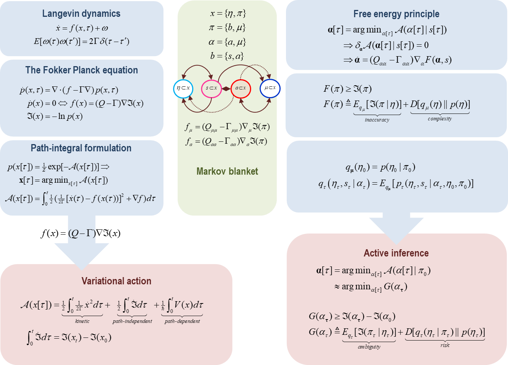
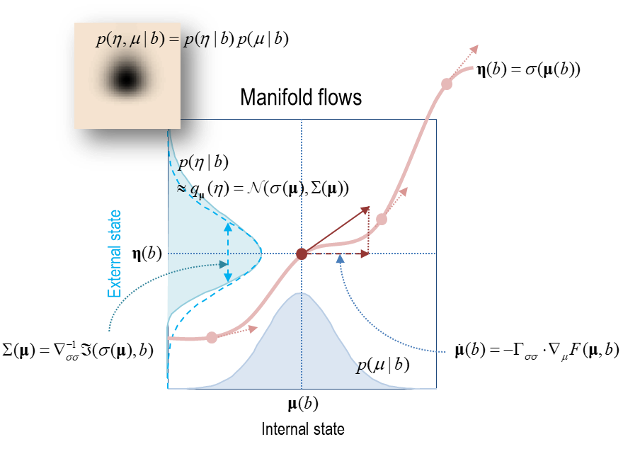

## 3부: 특정한 경우

### 자율적인 것들의 이론: 베이지안 역학

이 절에서는 마르코프 담요의 존재에 기반한 능동 입자를 위한 베이지안 메커니즘에 대해 살펴보겠습니다 (Bressloff and Newby, 2013; Keber et al., 2014; Khadka et al., 2018). 간단히 말해, 마르코프 담요은 내부 상태가 확률론적 의미에서 외부 상태를 나타낼 수 있음을 나타내줍니다. 직관적으로 이해하면, 이는 내부 상태에 확률론적 믿음을 부여할 수 있다는 것을 의미합니다. 즉, 외부 상태에 대한 것입니다. 이 해석은 외부 상태에 대한 변분 밀도에 기반하며, 이 밀도는 내부 상태에 의해 매개변수화됩니다.

$$
\begin{equation}\tag{8.1}
\begin{aligned}
q_\mu(\eta)
  &= p(\eta | b)
   = p(\eta | \pi) \\
\pmb \mu(b)
  &\triangleq argmax_\mu \space p(\mu | b)
\end{aligned}
\end{equation}
$$

이 변분 밀도는 다음과 같이 마르코프 담요에 의해 발생합니다: 만약 우리가 내부 상태와 외부 상태를 담요 상태에 조건을 건다면, 모든 담요 상태에 대해 가장 가능성이 높은 내부 상태가 있어야 합니다 - 그리고 그 담요 상태에 조건이 걸린 외부 상태에 대한 조건부 밀도가 있어야 합니다. 이는 내부 (통계적) 다양체와 외부 상태에 대한 조건부 밀도 사이의 매핑을 의미합니다[^note-22]. 차례로 이것은 내부 다양체 $\mu(b)$가 위의 변분 밀도에 의해 정의되는 정보 기하학을 얻는다는 것을 의미합니다.

> [^note-22]: 내부 상태의 수나 차원이 담요 상태의 수보다 크다는 가정하에, 내부 (통계적) 다양체의 차원은 담요 상태의 차원에 해당합니다

마르코프 담요에 의해 시사되는 또 다른 주요 대칭성은 내부와 능동 상태의 흐름이 같은 양, 즉 특정 상태의 놀라움에 대한 (solenoidal) 경사 흐름2으로 표현될 수 있다는 것입니다. 우리는 내부 상태와 능동 상태를 외부 상태에 영향을 받지 않는 자율적 상태라고 참조할 것입니다. 여백 흐름의 보조정리 (1.21)에서:

> [^note-23]: 경사 흐름에 대해 언급할 때, 우리는 경사에 직교하는 솔레노이드 성분을 허용합니다. 이를 (솔레노이드) 경사 흐름이라고 참조하겠습니다 

$$
\begin{equation}\tag{8.2}
\begin{aligned}
f_\alpha(\pi)
  &= (Q_{\alpha\alpha} - \Gamma_{\alpha\alpha})\nabla_\alpha\Im(\pi) \\
\alpha
  &= \{a,\mu\} \\
\pi
  &= \{s,\alpha \} \\
\end{aligned}
\end{equation}
$$

마르코프 담요의 이러한 두 가지 측면은 베이지안 메커니즘을 보증하며, 이 메커니즘에서는 내부 상태가 외부 상태에 대한 베이지안 신념[^note-24]을 가지고 있으며, 그 신념 하에 능동 상태가 외부 상태에 작용하는 것에 대해 이야기할 수 있습니다. 이는 놀라움에 대한 경사 흐름을 위의 변분 밀도의 자유 에너지 함수를 최소화하는 것으로 표현할 수 있기 때문입니다 - 이 함수는 베이지안 추론을 보증하는 함수입니다.

> [^note-24]: 여기서 베이지안 믿음은 사후 또는 조건부 확률 밀도를 의미합니다. 이것은 명제적 믿음이 아니지만 베이지안 '신념' 업데이트와 '신념' 전파의 의미에서 사용됩니다.

우리는 자유 에너지의 두 가지 형태 - 특정 상태의 특정 자유 에너지와 담요 상태만을 고려하는 변분 자유 에너지를 고려할 것입니다. 이들은 비평형 안정상태 동력학을 각각 정확한 및 근사 베이지안 추론으로 해석할 수 있는 방향을 제시합니다. 특정 자유 에너지는 수학적 '손놀림'으로 해석될 수 있으며, 이는 그것이 규정적으로 자유 에너지를 놀라움으로 정의하여 놀라움과 자유 에너지에 대한 경사 흐름을 동의어로 만드는 의미입니다. 그러나 이 공식화는 자율적인 (즉, 능동적이고 내부의) 상태를 대칭적으로 처리하고 베이지안 추론의 용어로 자기 조직화의 설명을 설정하는 데 사용할 수 있습니다. 특정 자유 에너지를 사용하여 기본 형식을 설정한 후, 우리는 내부 상태와 능동 상태를 별도로 다루는 변분 자유 에너지와 근사 베이지안 추론으로 전환할 것입니다. 실용적으로 말하면, 변분 자유 에너지는 능동 추론 형태의 자기 증거를 정량화하고 시뮬레이트하는 데 사용될 수 있으므로 더 흥미롭습니다. 또한, 이것은 흥미로운 질문을 불러일으킵니다: 자기 조직화는 근사 베이지안 추론인가, 아니면 베이지안 추론이 자기 조직화를 근사하는가?

우리는 먼저 자유 에너지 보조정리의 기본 형식과 미래에서 가장 가능성이 높은 자율적 상태에 대해 언급하는 적분 요동 정리에 대해 살펴볼 것입니다. 이 절에서는 논증의 기본 형태를 설정합니다. 다음 절에서는 라플라스 가정이라는 것 하에 근사 베이지안 추론에 의해 변분 밀도의 성질에 대해 다룰 것입니다.

**보조정리 (특정 자유 에너지)**: 주어진 변분 밀도: $q_\mu(\eta) = p(\eta|b)$ 에 대해, 감각 상태를 고려한 가장 가능성이 높은 자율적 상태의 경로는 입자의 상태의 자유 에너지 함수에 대한 (솔레노이드) 경사 흐름으로 표현될 수 있습니다: $\pi = {b, \mu} = {s,\alpha}$

$$
\begin{equation}\tag{8.3}
\begin{aligned}
\pmb a[\tau]
  &= argmin_{\alpha[\tau]} \cal A(\alpha[\tau\ | s[\tau]) \\
  &\Rightarrow \delta _{\alpha[\tau]}\cal A(\pmb a[\tau] | s[\tau])
   = 0 \\
  &\Rightarrow \pmb{\dot a} = (Q_{\alpha\alpha} - \Gamma_{\alpha\alpha})\nabla_a F(\pmb a, s)
\end{aligned}
\end{equation}
$$

이는 가장 가능성이 높은 경로가 최소 행동의 변분 원칙을 준수한다는 것을 의미하며, 여기서 특정 자유 에너지 $F(\pi)\triangleq F[\pi, q_\mu,(\eta)]$는 놀라움에 대한 상한선입니다:

$$
\begin{equation}\tag{8.4}
\begin{aligned}
F(\pi) 
  & \underbrace{
      \triangleq E_q[\Im(\eta,\pi)]
    }_{energy} 
    - 
    \underbrace{
      H[q_\mu(\eta)]
    }_{entropy} \\
  &=\underbrace{ 
      \Im(\pi)
    }_{suprisal} + 
    \underbrace{   
      D[q_\mu(\eta) \parallel p(\eta, b)] 
    }_{bound} \\
  &=\underbrace{
      E_q[\Im(\pi|\eta)]
    }_{inaccracy}+
    \underbrace{
      D[q_\mu(\eta)\parallel p(\eta)]
    }_{complexity} \geq \Im(\pi)
    \\
q_\mu(\eta)
  &= p(\eta|b):\pmb \mu = argmax_\mu \space p(\mu|b)
\end{aligned}
\end{equation}
$$

이 함수는 여러 형태로 표현될 수 있습니다; 즉, 기대 에너지에서 변분 밀도의 엔트로피를 뺀 것, 이는 특정 상태와 관련된 자기 정보 (즉, 놀라움)와 변분 밀도와 사후 밀도 사이의 KL 발산 (즉, 바운드)을 더한 것과 같습니다. 차례로 이것은 특정 상태의 음의 로그 가능성 (즉, 정확도)와 사후 밀도와 사전 밀도 사이의 KL 발산 (즉, 복잡성)으로 분해할 수 있습니다. 간단히 말해, 특정 자유 에너지는 자율적 상태의 기대 흐름에 대한 Lyapunov 함수를 구성합니다.

**증명**: 행동을 최소화하는 가장 가능성이 높은 궤적은 자율적 흐름에 대한 무작위 요동이 그들의 가장 가능성이 높은 값인 0을 취할 때 얻어집니다. 여백 흐름의 보조정리에 따르면, 이는 가장 가능성이 높은 자율적 상태의 흐름이 놀라움에 대한 (솔레노이드) 경사 흐름으로 표현될 수 있음을 의미합니다. 즉, 정의에 의하면, 특정 자유 에너지로 표현될 수 있습니다:

$$
\begin{equation}\tag{8.5}
\begin{aligned}
\pmb a[\tau]
    &= argmin_{\alpha[\tau]} \cal A(\alpha[\tau] | s[\tau])] \Rightarrow \\
\pmb{\dot \alpha}
    &= (Q_{\alpha\alpha} - \Gamma_{\alpha\alpha}) \nabla_\alpha \Im(\pmb \alpha, s) \\
    &= (Q_{\alpha\alpha} - \Gamma_{\alpha\alpha}) \nabla_\alpha F(\pmb \alpha, s) \\
\end{aligned}
\end{equation}
$$

가장 가능성이 높은 내부 상태에 대해, $\pmb \mu \subset \pmb \alpha$ :

$$
\begin{equation}\tag{8.6}
\begin{aligned}
F(\pmb \alpha, s) 
  &= \Im(\pmb \alpha, s) + 
    \underbrace{
      D[q_\mu(\eta) \parallel p(\eta | \pmb \alpha, s)
    }_{bound}
   = \Im(\pmb \alpha, s)\\
\end{aligned}
\end{equation}
$$

특정 자유 에너지와 특정 상태의 놀라움 사이의 등치성은 바운드를 0으로 만드는 변분 밀도의 정의에서 나옵니다.

특정 자유 에너지는 변분 밀도의 함수적이거나 충분한 통계의 함수로 표현될 수 있음에 주의하십시오. 위의 결과들은 어떤 비평형 상태의 시스템에 대해서도 유효하며, 특정 자유 에너지에 대한 최소 행동의 원칙으로 간주될 수 있습니다. 마르코프 담요 하의 경사 흐름의 이런 규정적인 재구성을 감안할 때, 이제 초기 특정 상태에서의 자율적 상태의 가장 가능성이 높은 경로를 고려할 수 있습니다. 비평형 안정상태의 존재 자체가 미래의 자율적 상태에 대해 몇 가지 흥미로운 함의를 가지고 있습니다 - 나중에 '미리 계획하기'를 형식화하는 데 활용할 것입니다. 이 장기 행동은 마르코프 담요에 대한 적분 요동 정리를 바탕으로 다음과 같이 요약할 수 있습니다:

**부속정리 (기대 자유 에너지)**: 미래의 자율적 상태의 놀라움은 기대 자유 에너지에 의해 상한선이 주어집니다:

$$
\begin{equation}\tag{8.7}
\begin{aligned}
G(\alpha_\tau)
  &\geq \lim_{d\ell(\tau) \to 0} \Im_\tau(\alpha_\tau | \pi_0)\\
\end{aligned}
\end{equation}
$$

기대 자유 에너지는 최종 상태의 함수입니다:

$$
\begin{equation}\tag{8.8}
\begin{aligned}
G(\alpha_\tau)
  &\triangleq 
    \underbrace{
      E_{q_\tau}[\Im(\eta_\tau,\pi_\tau)]
    }_{energy} -
    \underbrace{
      H[q_\tau(\eta_\tau|\pi_\tau)]
    }_{entropy}  \\
    &=
    E_{q_\tau}[
    \underbrace{
      \Im(\pi_\tau)
    }_{suprisal} +
    \underbrace{
      D[q_\tau(\eta_\tau|\pi_\tau) || p(\eta_\tau)]
    }_{bound} ]\\
    &= 
    E_{q_\tau} [
    \underbrace{
      \Im(\eta_\tau,\pi_\tau)
    }_{ambiquity} +
    \underbrace{
      D[q_\tau(\eta_\tau|\pi_\tau)||p(\eta_\tau)]
    }_{risk}] \geq E+{q_\tau}[\Im(\pi_\tau)] \\
    \\
q_\tau(\eta_\tau,s_\tau|\alpha_\tau)
  &\triangleq p_\tau(\eta_\tau,s_\tau | \alpha_\tau, \pi_0)
  = E_{q_\mu}[p_\tau(\eta_\tau,s_\tau | \alpha_\tau, \pi_0, \eta_0)] \\
\end{aligned}
\end{equation}
$$

여기서의 기대값은 초기 입자 상태와 최종 자율 상태에 따른 숨겨진 상태와 감각 상태에 대한 예측 밀도 아래에 있습니다. 여기서 이 예측 밀도는 변분 밀도 $q_\mu(\eta_0) = p(\eta_0|\pi_0)$의 용어로 표현됩니다.

(8.8)의 기대 자유 에너지는 복잡성과 정확성 항이 위험 (즉, 예상 복잡성)과 불명확성 (즉, 예상 부정확성)이 되는 (8.4)의 특정 자유 에너지와의 형식적 대응을 강조하기 위해 공식화되었습니다. 또한 (8.8)의 기대 자유 에너지 표현식을 (2.7)의 자율 상태의 놀라움과 비교할 수 있습니다. 위의 부속정리는 미래의 자율적 상태의 확률에 대한 하한선을 제공하기 때문에 중요합니다. 이 확률은 현재의 특정 상태의 함수입니다. 이 경계는 불균형 안정 상태로의 수렴하에서 유지됩니다. 반대로, 만약 입자의 활동 (즉, 그것의 자율적 경로)이 기대 자유 에너지를 최소화하는 자율 상태로 이어진다면, 불균형 안정 상태로의 수렴이 보장됩니다.

**증명**: 초기의 $\pi_0 \equiv \pi(0)$ 특정 상태에서 최종 상태 $\pi_\tau \equiv \pi(\tau)$까지의 경로를 고려하십시오. 만약 정보 길이가 수렴하면, 시스템 상태에 대한 예측 밀도와 비평형 안정상태 밀도 사이의 발산은 사라집니다. (2.9)에서, 우리는 최종 상태의 시간 종속적 놀라움 $\Im_\tau(\pi_\tau|\pi_0) \equiv -\ln p_\tau(\pi_\tau |\pi_0) \equiv -\ln q_\tau(\pi_\tau)$를 그것의 기대 자유 에너지의 용어로 표현할 수 있습니다:

$$
\begin{equation}\tag{8.9}
\begin{aligned}
d\ell(\tau)
  &= 0 \\
  &\Rightarrow 
    D[q_\tau(\eta_\tau, \pi_\tau) || p(\eta_\tau,\pi_\tau)]
    = 0
  \\
  &\Rightarrow 
    E_{q_\tau}[G(\pi_\tau) - \Im_\tau(\pi_\tau | \pi_0)]
    = 0
  \\
  &\Rightarrow 
    G(\pi_\tau) 
    = \Im_\tau((\pi_\tau | \pi_0)
  \\
  \\
G[\pi_\tau)
  &= E_{q_\tau}[\Im(\eta_\tau, \pi_\tau)] - H[q_\tau(\eta_\tau | \pi_tau)]
  \\
q_\tau(\eta_\tau, \pi_\tau)
  &= p_\tau(\eta_\tau,\pi_\tau | \pi_0)
\end{aligned}
\end{equation}
$$

(8.9)에서의 발산은 (6.6)에서의 열역학적 자유 에너지와 같은 역할을 합니다. 즉, 진화하는 밀도와 불균형 안정 상태에서의 밀도 사이의 발산입니다. 그러나 여기서는 앙상블 밀도가 아니라 미래 상태에 대한 예측 밀도를 다루고 있습니다. 방정식 (8.9)은 또한 적분 변분 정리의 형태로 작성될 수 있습니다; (6.16)과 비교하여,

$$
\begin{equation}\tag{8.10}
\begin{aligned}
E_q
  \left[
    ln\frac{q_\tau(\eta_\tau | \pi_\tau)}{p(\eta_\tau|\pi_\tau)} - \Delta\Im_\tau
  \right]
  \geq 0, \space\space
\Delta\Im_\tau 
  = \Im_\tau(\pi_\tau | \pi_0) - \Im(\pi_\tau) \\
\end{aligned}
\end{equation}
$$

$d\ell(\tau) \rightarrow 0$일 때 동일합니다. 간단히 말해서, 미래의 어떤 시점에서, 특정 상태의 기대 자유 에너지는 그것의 놀라움이 되며, 그 시점에서 정보 길이의 추가적인 증가는 없습니다. 우리는 이제 예측된 감각 상태에 대해 특정 상태의 기대 자유 에너지를 평균화하여 자율 상태의 놀라움에 대한 상한선을 만들 수 있습니다. Jensen의 부방정식에 의하면:

$$
\begin{equation}\tag{8.11}
\begin{aligned}
G(\alpha_\tau)
  &= E_{q_\tau(s_\tau|\alpha_\tau)}[G(\pi_\tau)]
   = E_{q_\tau(s_\tau|\alpha_\tau)}[\Im_\tau(\pi_\tau | \pi_0)]
   \geq \Im_\tau(\alpha_\tau | \pi_0) \\
  \\
G(\alpha_\tau)
  &= E_{q_\tau}[\Im(\eta_\tau,s_\tau, \alpha_\tau)] - H[q_\tau(\eta_\tau| s_\tau, \alpha_\tau)] \\
q_\tau(\eta_\tau,s_\tau | \alpha_\tau)
  &= p_\tau(\eta_\tau,s_\tau | \alpha_\tau, \pi_0) \\
\end{aligned}
\end{equation}
$$

(8.11)을 (8.8)에 대입하면 (8.7)이 됩니다.

#### 위험과 모호성

요약하면, 특정 자유 에너지는 (현재의) 특정 상태의 놀라움에 대한 상한선이며, 기대 자유 에너지는 (미래의) 자율 상태의 놀라움에 대한 상한선입니다. 중요한 점은, 특정 자유 에너지와 기대 자유 에너지 모두 특정 상태의 함수이므로, 입자에 의해 '평가'될 수 있다는 것입니다. 다시 말해, 특정 자유 에너지와 기대 자유 에너지의 최소화는 입자의 단기 및 장기 행동에 대한 자기 일관적인 설명을 제공합니다.

기대 자유 에너지의 따르는 정리는 (8.12)에서의 자기 엔트로피 분해시 위험과 모호성을 사용할 수 있게 합니다. 2절에서 복잡성 비용은 불균형 안정 상태 밀도에 대해 기대되는 위험이고, 모호성은 외부 상태가 주어졌을 때 특정 상태의 예상 가능성이라는 것을 기억하십시오. 이러한 기대치는 특정 상태와 외부 상태 사이의 상호 정보량과 외부 상태가 주어진 특정 상태에 대한 조건부 불확실성 (2.3)에 해당합니다. 그러나, 예상 자유 에너지의 분해에서의 해당 수량들은 어떤 자율적인 행동 (즉, 자율 상태의 경로)에 조건이 된 예측 밀도 아래에서의 기대치입니다. 이 상황에서, 위험은 자율적인 행동의 속성으로, 예측된 (외부) 상태와 불균형 안정 상태에서의 상태 사이의 발산에 해당합니다. 마찬가지로, 모호성은 외부 상태와 자율 행동이 주어진 특정 상태의 예상 가능성이 됩니다. 간단히 말해서, 자율적인 입자는 미래 결과에 대한 사전 (불균형 안정 상태) 믿음에 대해 위험을 적극적으로 최소화하는 행동을 선택하면서, 외부 상태에 대한 행동으로 모호성을 해결하는 것처럼 보일 것입니다.

비평형 안정상태와 예측 밀도에 따라 정의된 위험과 모호성 사이의 차이는 두 밀도가 수렴할 때 사라집니다. 이것은 특정 자유 에너지와 기대 자유 에너지의 기대치에서 반영됩니다. 특정 자유 에너지는 놀라움에 대한 상한선이므로, 불균형 안정 상태에서 기대되는 자유 에너지는 자기 엔트로피에 대한 상한선입니다:

$$
\begin{equation}\tag{8.12}
\begin{aligned}
E_{p(\pi)}[F(\pi)]
  &\geq E_{p(\pi)}[\Im(\pi)]
  = H(P)
  = 
    \underbrace{
      H(P|E)
    }_{ambiguity}
  + 
    \underbrace{
      I(E,P)\\
    }_{risk}
\end{aligned}
\end{equation}
$$

이것은 특정 자유 에너지를 최소화하는 것이 자기 엔트로피 또는 동등한 모호성과 위험 (2.3)을 최소화한다는 것을 의미합니다. 마찬가지로, 미래의 자율 상태에 대한 예상 자유 에너지에 대한 해당 기대값은 다음과 같습니다:

$$
\begin{equation}\tag{8.13}
\begin{aligned}
d\ell(\tau) 
  &= 0 
  \Leftrightarrow q_\tau(\eta_\tau,\pi_\tau)
  = p(\eta_\tau, \pi_\tau)
  \Rightarrow E_{p(\alpha_\tau)}[G(\alpha_\tau)]
  =
    \underbrace{
      H(P|E)
    }_{ambiguity}
  +
    \underbrace{
       I(E,P)\\
    }_{risk}
  =
    H(P)
  \\
\end{aligned}
\end{equation}
$$

외부 상태에 대해서 오직 활성 상태를 통해서만 작용하는 입자에 대한 흥미로운 경우가 발생합니다. 이 상황에서, 외부 상태에 대한 예측 밀도는 오직 미래의 자율 상태에만 의존합니다. 따라서 다음과 같이 표현될 수 있습니다:

$$
\begin{equation}\tag{8.14}
\begin{aligned}
q_\tau(\eta_\tau|\pi_\tau) 
  &= p(\eta_\tau | \alpha_\tau)
  \Rightarrow G(\alpha_\tau) 
  = E_{q_\tau}[ 
      \Im(\pi_\tau) - 
      \underbrace{
        D[p(\eta_\tau|s_\tau,\alpha_\tau) \parallel p(\eta_\tau | \alpha_\tau)]
      }_{\text{information gain}} 
    ]\\
\end{aligned}
\end{equation}
$$

이 경우, 예상 자유 에너지의 일부로서 (2.7)의 정보 이득을 복구합니다. KL 발산의 부호가 이제 음수인 것에 주목하세요. 이는 예측 밀도와 비평형 안정상태 밀도가 바뀌었기 때문입니다. 이는 예상 자유 에너지를 최소화하는 것이 정보 이득을 극대화하는 것을 의미합니다. 우리는 외부 상태가 오직 활성 상태에 의해서만 영향을 받는 이산 상태 공간 모델을 다룰 때 이 경우로 돌아올 것입니다. 표 4는 그들의 각각의 역할을 설명하기 위해 정보 이론적인 용어를 그들의 변분 대응체와 함께 보여주는 표 1의 버전입니다.

목표론적으로 말하면, 비평형 안정상태 밀도는 경사 흐름 (즉, 특정 자유 에너지 레마) 또는 미래 상태 선택 (즉, 예상 자유 에너지 추론)의 측면에서 자율적인 행동이 생각되는지에 따라 두 가지 명백히 다른 해석을 가질 수 있습니다. 통계학자의 관점에서, 경사 흐름 공식화는 비평형 안정상태 밀도를 생성 모델로 간주합니다; 다른 말로 하면, 숨겨진 원인의 감각적인 결과에 대한 확률적인 명세입니다. 이 동적성은 자기 조직화를 통계적 (즉, 베이지안) 추론의 측면에서 해석하는 것을 허가합니다. 우리가 예상 자유 에너지를 고려할 때 상황은 변합니다. 여기서, 우리는 생성 모델 하에서 가장 가능성이 높은 자율 상태의 궤적 (즉, 활동적이고 내부적인 상태)을 선택하고 있습니다. 이러한 관점에서, 생성 모델 (즉, 비평형 안정상태 밀도)은 미래에 마주칠 감각 상태 (및 그들의 외부 원인)에 대한 사전 신념을 제공하는 것으로 간주될 수 있습니다. 다시 말해, 생성 모델은 입자가 자율적으로 향하려는 집합 (즉, 가장 작은 예상 놀라움, 즉, 예상 자유 에너지를 가진 유인 상태로 이어지는 경로를 선택함으로써)을 규정합니다. 단순하게 말해서, 이는 외부 상태로의 다시 결합이 – 활동 상태를 통해 – 자기 증거를 행동적인 측면을 부여한다는 것을 의미합니다. 이 측면은 생성 모델이 감각 상태에 대한 설명이면서 입자가 지향하는 (외부적이고 특정한) 상태의 명세처럼 보이게 합니다.

특정 밀도가 초기 상태에서 비평형 안정상태 밀도로 진화하는 시간 스케일은 관련 정보 길이의 측면에서 자기 조직화의 이동성을 특징짓습니다. (8.9)를 중요 시간 $\tau$의 측면에서 자기 증거를 특징짓는 것으로 재해석할 수 있습니다. 이 시간 이후에 특정 상태의 놀라움이 그들의 예상 자유 에너지가 됩니다:

$$
\begin{equation}\tag{8.15}
\begin{aligned}
G(\pi_\tau)
  &= \Im_\tau(\pi|\pi_0):\forall\tau \geq \pmb \tau\\ 
  &\Rightarrow D[q_\tau(\eta_\tau,\pi_\tau)||p(\eta_\tau, \pi_\tau)] \approx 0 \Leftrightarrow d\ell(\pmb \tau) \approx 0\\
  &\Rightarrow G(\alpha_\tau) \geq \Im_\tau(\alpha_\tau|\pi_0) = \Im(\alpha_\tau) \\
\end{aligned}
\end{equation}
$$

이것은 '이동성(순회)'의 개념을 운영화하며, 정보 길이를 명시적으로 언급하지 않고도 미래의 중요 시간 이후의 상태의 예상 자유 에너지를 표현할 수 있게 해줍니다: (8.16)의 부방정식 및 그림 17 참조. 이 시간 이후에, 자율적 상태의 예상 자유 에너지는 그들의 비평형 안정상태 놀라움의 상한을 형성합니다 – 그리고 초기 상태는 '잊혀집니다'. 중요 시간이 짧은 입자들은, 효과적으로, 비평형 안정상태로 빠르게 수렴하며 간단한 종류의 자기 조직화를 보일 것입니다. 반대로, 중요 시간이 긴 입자들은 시간적 깊이를 가진 이동성 밀도 동력학을 보일 것이며, 훨씬 더 많은 확률적 구성을 경험할 것입니다. 우리는 이후에 일반화된 저차 항상성(homeostasis)과  고차 항상성(allostasis)를 나타내는 입자들 사이의 차이라는 측면에서 이 구분으로 돌아올 것입니다. 그림 17은 마르코프 담요이 작용할 때, 어떻게 베이지안 역학이 랑주뱅 동력학에서 유래하는지에 대한 개요를 제공합니다. (변분) 추론 측면에서의 자기 증거를 풀어내기 전에, 우리는 잠시 마르코프 담요이 (양자) 측정 및 내부 상태의 정보 기하학에 대한 함의에 대해 고려할 것입니다.

TABLE 4  
Information measures and particular free energy

| Measure                         | Definition                                               | Variational homologue                                                |
|---------------------------------|----------------------------------------------------------|----------------------------------------------------------------------|
| Surprisal                       | $\Im(\pi)-\ln p(\pi)$                                    | $\Im(\pi_0)\geq F(\pi_0)$                                            |
| Self-entropy                    | $H[P]=E_{p(\pi)}[\Im(\pi)]$                              | $H[P]\geq E_{p(\pi_0)}[F(\pi_0)]=E_{p(\alpha_\tau)}[G(\alpha_\tau)]$ |
| Complexity                      | $D[p(\eta\vert\pi)\parallel p(\eta)$                     | $D[q_\mu(\eta_0)\parallel p(\eta_0)]$                                |
| Risk                            | $I(E,P)=E_{p(\pi)}[D[p(\eta\vert\pi)\parallel p(\eta)]]$ | $D[q_\tau(\eta_\tau\vert\pi_\tau)\parallel p(\eta_\tau)]$            |
| Accuracy                        | $E_{p(\eta\vert\pi)}[ln\space p(\pi\vert\eta)]$          | $E_{q_\mu(\eta)}[\ln\space p(\pi_0\vert\eta_0)]$                     |
| Ambiguity                       | $H(P\vert E)=E_p(\Im(\pi\vert\eta)]$                     | $E_{q_\tau}[\Im(\pi_\tau\vert\eta_\tau)]$                            |

[TABLE 4](./img/t4.png)

FIGURE 17

*랑주뱅 역학에서 베이지안 역학으로*. 이 그림은 랑주뱅 역학에서 베이지안 역학에 이르는 개념적 움직임을 개요로 제공합니다. 간략하게 말해서, 이는 (i) 마르코프 담요의 설정에서 밀도 역학의 표준 공식을 풀어내고, (ii) 정보 기하학을 갖춘 밀도 역학에 변분 밀도를 도입하며, (iii) 베이지안 추론의 관점에서 기본적인 그래디언트 흐름(자유 에너지 원칙)과 미래의 경로(*능동 추론*)을 해석합니다. **왼쪽 패널**은 랑주뱅 역학, 폭커 플랑크 방정식에 의해 설명되는 밀도 역학, 그리고 경로 적분 공식 등 무작위 동적 시스템의 세 가지 공식을 요약하고 있습니다. 여기에서 중요한 결과는 밀도 역학(즉, 폭커 플랑크 방정식)의 비평형 안정상태 솔루션에 의존하며, 이 경우 동역학은 놀라움에 대한 그래디언트 흐름(비평형 안정상태 보조정리를 통해)으로 설명할 수 있습니다. 이 솔루션을 경로 적분 공식에 대입하면, 경로 또는 경로의 확률을 그것의 행동에 대해 표현할 수 있습니다. **중간 열**은 외부와 내부 상태를 분리하는 분할을 소개하는데, 이는 (감각적이고 활동적인) 담요 상태에 의해 분리됩니다. 따라서 조건부 독립성은 비평형 안정상태를 특징짓는 그래디언트 흐름이 특정한 형태를 가지게 됩니다. 즉, 입자의 자율 상태(내부 및 활동 상태)는 입자의 (특정) 상태에 대한 (소레노이달) 그래디언트 흐름으로 표현될 수 있습니다. 이는 자율 상태의 가장 가능성이 높은 흐름을 특정 상태의 놀라움을 최소화하는 것처럼 나타내는데, 이는 (평균적으로) 그들의 엔트로피를 구성합니다. **오른쪽 패널**은 특정 자유 에너지라는 특정 그래디언트 흐름을 풀어내는데, 이는 내부 상태에 의해 매개변화된 외부 상태에 대한 밀도를 유도합니다. 이 변분 밀도는 마르코프 담요에 의해 반드시 존재해야 합니다(담요 상태에 대한 외부 및 내부 상태를 조건부로). 이 베이지안 해석에서, 자율 상태의 그래디언트 흐름은 놀라움에 대한 특정 자유 에너지 경계를 최소화합니다. 반대로, 미래의 자율 상태의 놀라움(그리고 암묵적으로 초기 상태로부터의 경로 독립적인 행동)은 예상 자유 에너지에 의해 상위에 제한됩니다. 적절하게 재배열하면, 예상 자유 에너지는 위험과 모호성 등의 항을 포함하게 되는데, 이는 놀라움을 최소화하고, 증거를 최대화하며, 그래디언트 흐름을 지각적이고, 목적적이고, 위험을 최소화하는 행동에 의해 문맥화된 지식적인, 모호성을 줄이는 동역학의 해석을 가능하게 합니다. 이 시점에서, 자기조직화 그래디언트 흐름의 관점에서 비평형 안정상태의 정식적 설명은 자기 주도적으로 입증하는 것을 위한 자기 조직화를 설계하는 측면에서, 미리 선호하는 (즉, 비평형 안정상태) 상태로 활동 입자의 자기 조직화를 시뮬레이트할 수 있는 방식으로 작성될 수 있습니다. 즉, 자기 입증하는 자율성을 기준으로 자기 조직화를 설계하는 것을 의미합니다.
#### 추론과 측정

우리의 양자역학에 대한 처리에서, 우리는 어떤것을 '측정'한다는 것이 무슨 의미인지에 대한 토론을 이 섹션까지 연기했습니다. 하나는 (양자) 상태의 확률적 설명이 그들의 '측정'에 충분하다고 주장할 수 있습니다: 다시 말해, '측정'을 것들의 (외부) 상태를 추론하는 것으로 이해할 수 있습니다. 이 읽기에 따르면, 측정은 '단지' 내부 상태에서 외부 상태에 대한 확률 밀도로의 매핑입니다; 즉, 다른 입자의 천천히 변하는 담요 상태입니다. 경험적으로 보면, 이것은 우리가 절대로 외부 상태를 '알 수 없다'는 것을 의미합니다 - 관찰자는 오직 '신념'을 가질 수만 있습니다. 외부 상태에 대해, 이는 내부 상태에 의해 매개변수화 되어집니다. 차례로, 이것은 외부 상태를 확률 밀도 (또는 파동 함수)의 측면에서만 설명하는 것이 충분하다는 것을 의미합니다. 왜냐하면 이것들은 유일하게 측정 '입자' 또는 관찰자의 (내부) 상태에 합법적인 방식으로 매핑하는 구조물이기 때문입니다.

만약 우리가 측정을 추론으로 받아들인다면; 즉, 관찰 시스템의 담요 상태의 원인에 대한 (확률적) 신념을 가지거나 표현하는 것, 그러면 우리는 양자 측정에 대한 간단한 설명을 가질 수 있으며, 이것은 (디랙 표기법에서) 다음과 같이 표현될 수 있습니다:

$$
\begin{equation}\tag{8.17}
\begin{aligned}
\pmb \mu
  &= \braket{\Psi^\dagger(\mu)|\mu|\Psi(\mu)}  \\
  \\
p(\eta|b)
  &= \Psi^\dagger(\eta)\Psi(\eta) = q_\mu(\eta) \\
p(\mu|b)
  &= \Psi^\dagger(\mu)\Psi(\mu) \\
\end{aligned}
\end{equation}
$$

분명히, 이것은 측정에 불확실성을 부여하며, (양자) 상태를 '알고' 있는 것은 정확한 추론의 한계 케이스입니다. 이런 방식을 택한다면, 측정, 얽힘, 그리고 디코히어런스의 개념들은 외부, 내부, 그리고 담요 상태로 나눈 삼방향 파티션 하에서 조건적 동기화의 결과물로 나타납니다. 파동 함수 붕괴에 대한 논쟁의 해결 - 양자 디코히어런스를 언급하는 -이 관찰된 상태, 관찰자, 그리고 환경 상태로 나눈 삼방향 파티션에 의존한다는 것은 흥미롭게 보일 수 있습니다 (Goold et al., 2016; Schlosshauer, 2004).

추론의 관점에서, 파동 함수 붕괴에 대한 일화적 개념은 사전 분포의 붕괴가 (정확하거나 확정적인) 사후 밀도로의 붕괴일 수 있습니다. 실제로, 측정 문제를 고려할 때 이것은 일부 수용성이 있습니다 (Zurek, 2003): 즉, 측정이 이벤트로 처리되면, 신념 갱신은 사전 신념의 붕괴를 사후 신념으로 특징짓는 것으로 표현될 수 있습니다. 그러나, 이런 관점은 베이지안 역학에서는 유지할 수 없습니다. 왜냐하면 측정 (즉, 추론)은 동적인 과정 (이벤트가 아님)이기 때문입니다. 이 상황에서 사전 붕괴에서 사후 붕괴까지의 '붕괴'는 비평형 안정상태 동력학의 내재적이고 지속적인 부분입니다. 그렇다면, (8.8)의 제한에 대한 파동 함수 붕괴 개념을 다시 도입할 수 있을까요? 즉, 추론의 동력학에 대한 설명으로서 붕괴하는 제한을 들 수 있을까요? 특정 자유 에너지의 관점에서 이를 틀에 맞추면, 이는 규정적으로 사실입니다 - 변분 및 사후 신념을 구분하는 경계는 정의적으로 붕괴되어 있습니다. 우리는 이를 아래에서 변분 자유 에너지 (특정 자유 에너지와 대조적으로)의 최소화로서의 자기 증명을 통해 추구할 것입니다. 이어지는 베이지안 역학은 추론의 관점에서 자기 증명의 명확한 표현을 제공하고 파동 함수 (즉, 확률 밀도 함수) 붕괴의 형태를 재확인합니다.

요약하자면, 엄청난 과소화 단순화에도 불구하고, 양자 측정에서의 얽힘과 디코히어런스는 베이지안 역학에서의 조건적 동기화로 대체될 수 있습니다. 베이지안 역학에서, 관점은 외부, 내부 그리고 담요 상태의 공동 공간에 대한 비평형 안정상태 밀도에서 변분 밀도에 의해 제공되는 정보 기하학으로 넘어갑니다; 즉, 외부 상태에 대한 확률적 신념입니다. 우리는 이 monograph의 나머지 부분에 대해 이 관점을 유지할 것입니다.

#### 정보 기하학

Einstein, 1949: *"[I]t는 좌표가 바로 메트릭 의미를 가져야 한다는 생각을 버리는 것이 그리 쉽지 않다."* (Schilpp, 2000)

이 시점에서, 우리는 정보 길이와 기하학의 개념으로 돌아갈 수 있습니다. 정보 기하학은 통계적 다양체에서의 거리를 측정하는 리만 메트릭에 기반을 두고 있음을 기억하세요 (Amari, 1998; Ay, 2015). (1.15)를 따르면, 두 가까운 점 $\mu$ 와 $\mu^{'}=\mu+d\mu$ 사이의 거리 $d\ell$은 메트릭 텐서 $g$를 통해 표현됩니다 :

$$
\begin{equation}\tag{8.18}
\begin{aligned}
d\ell^2
  &= g_{ij}d\mu^i d \mu^j\\
\end{aligned}
\end{equation}
$$

통계적 다양체에 대해, 이 텐서는 확률 밀도가 통계적 다양체 상에서 움직일 때 변화하는 속도를 측정하는 피셔 정보 메트릭입니다. 기술적으로, 정보 메트릭은 인접한 점들이 떨어질 때 밀도 사이의 KL 발산의 곡률에 해당합니다. (1.15)에서:

$$
\begin{equation}\tag{8.19}
\begin{aligned}
g &= \pmb I(\mu) 
   = \nabla_{\mu^{'}\mu^{'}} D[q_{\mu^{'}}(\eta) \parallel q_\mu(\eta)]\space |_{\mu^{'} = \mu}
   = E_q[\nabla_\mu\ln q_\mu(\eta) \times \nabla_\mu \ln q_\mu(\eta)] \\
\end{aligned}
\end{equation}
$$

중요한 점은, 내부 상태 공간이 통계적 다양체를 포함하고 있으며, 외부 상태에 대한 (변분) 밀도를 매개변수화하는 내부 상태 때문입니다. 이는 내부 다양체가 이중 측면 기하학을 취득한다는 것을 의미합니다. 통계적 다양체의 역할을 하는 덕분에 정보 기하학을 가지며, 동시에 비평형 안정상태 밀도와 내재적 정보 길이에 의해 부여되는 자체 기하학을 가지고 있습니다 (Kim, 2018). 우리는 이 두 기하학을 그들의 각각의 메트릭 텐서 - (1.15)과 (8.19)에서 - 내부 상태에 대한 밀도의 충분한 통계로 $\lambda$를 볼 수 있습니다.

$$
\begin{equation}\tag{8.20}
\begin{aligned}
g_\lambda
  &= \pmb I(\lambda)
   = \nabla_{\lambda^{'}\lambda^{'}} D[p_{\lambda^{'}}(\mu) \parallel p_\lambda(\mu)] |_{\lambda^{'} = \lambda} \\
g_\mu
  &= \pmb I(\mu)
   = \nabla_{\mu^{'}\mu^{'}} D[p_{\mu^{'}}(\eta) \parallel p_\mu(\eta)] |_{\mu^{'} = \mu} \\
\end{aligned}
\end{equation}
$$

개념적으로, 여기서 핵심적으로 이해해야 할 점은 내부 다양체가 정보 기하학을 갖추고 있으며, 이는 외부 상태에 대한 확률 밀도를 표현하기 때문입니다[^note-25]. 이것은 마르코프 담요에 의해 수반되는 조건부 종속성의 필연적인 결과입니다. 정보 기하학의 유용성은 수학 통계, 모델 선택, 열역학, 실제로는 양자 정보 기하학에 대한 방대한 문헌에서 반영됩니다 (Caticha, 2015a). 이 절에서는 특별한 경우를 고려합니다; 즉, 놀라움이 지역적으로 이차 형태라는 라플라스 가정 - 그리고 따라서 변분 밀도는 가우스 형태입니다[^note-26]. 이 가정은 베이지안 역학의 특정한 표현식을 이끌어내는데, 여기서 (피셔 정보) 메트릭 텐서는 변분 밀도의 정밀도 행렬이고, 놀라움의 곡률입니다 (Friston et al., 2007).

> [^note-25]: 현재로서는 $\sigma(\mu(\tau)) \approx \sigma(\pmb\mu(b(\tau)))$라고 가정하므로, 모든 내부 상태가 변분 밀도를 매개변수화합니다.

> [^note-26]: 가우시안 근사치 선택 (즉, 라플라스 가정)은 임의적이지 않습니다. 이것은 가우시안 분포가 첫 번째와 두 번째 순서의 순간에 제한된 매개 변수를 가진 확률 밀도의 가장 큰 엔트로피를 가지고 있다는 사실에서 나옵니다. 이는 (8.4)의 변분 엔트로피 항이 다른 형태에 비해 최소화되도록 보장합니다. 또한 라플라스 가정을 지수 클래스 (예: 정규 밀도)에서의 어떤 밀도에 대한 두 번째 순서 근사치로 볼 수도 있습니다.

통계적으로 말하면, 변분 밀도의 규정적 정의 - 숨겨진 상태에 대한 사후 확률로서 - 는 내부 상태의 가장 가능성 있는 궤적을 _정확한 베이지안 추론_을 수행하는 것으로 해석할 수 있음을 의미합니다. 이 규정적 정의를 완화하고 놀라움에 대해 (지역적으로) 이차 형태를 가정하면, 내부 동력학은 근사 베이지안 추론, 즉 변분 베이즈 또는 좀 더 구체적으로는 _변분 라플라스_의 측면에서 해석될 수 있습니다. 실질적으로, 이는 내부 상태를 잘 행동하는 변분 밀도와 연결할 수 있음을 의미하며, 이는 예상 자유 에너지를 평가하는 데 사용될 수 있습니다. 이는 미래적 측면을 획득하는 자율적 행동 측면에서 자기 조직화에 대한 취급 가능한 설명을 제공합니다. 우리는 먼저 라플라스 가정하에서의 근사 베이지안 추론의 본질에 초점을 맞추고, 이후 섹션에서는 능동 추론의 표제 아래에서 자율적 행동으로 돌아올 것입니다.

#### 변분 베이즈

비록 비평형 안정상태 보조정리가 표준 결과로부터 나오는 것이지만, 이에 수반되는 흐름에는 놀라운 점이 있습니다: 내부 (그리고 외부) 상태의 흐름은 본질적으로 (회오리치는) 놀라움에 대한 경사 하강입니다. 경사 흐름은 비평형 안정상태 밀도의 등고선에 순환하는 발산이 없는 (솔레노이드형) 구성요소를 포함하고 있기 때문에 회오리칩니다 - 산길을 내려가는 것처럼. 이는 내부 (또는 외부) 상태가 외부 (또는 내부) 상태의 함수가 아닌 흐름에도 불구하고, 가장 자주 차지하는 상태 공간의 영역으로 향하고 있다는 것을 의미합니다 (Friston, 2013). 요컨대, 내부 상태는 마치 그들의 담요 뒤에 있는 외부 상태를 '보는' 것처럼 행동합니다. 여기서 놀라울 것은 없습니다: 이것은 단지 놀라움의 기울기가 내부 상태에 대해 외부 상태에 의존하지 않는다는 것을 의미하는 것뿐입니다. 그렇다면 이것이 내부 상태와 외부 상태 사이의 관계에 대해 무엇을 의미하는가?

마르코프 담요은 내부 상태와 외부 상태가 조건부로 독립적임을 보장합니다. 이것은 담요 상태에 조건을 달았을 때 가장 가능성 있는 내부 상태와 외부 상태 사이에 매핑이 있어야 한다는 것을 의미합니다. 우리는 이 매핑을 조건부 동기화 다양체라고 부르고 이를 사용하여 라플라스 가정 하에서의 자유 에너지 보조정리를 다시 정리할 것입니다. 조건부 동기화 다양체의 존재는 내부 상태가 마르코프 담요을 통해 외부 상태를 '감지하거나' 또는 '추적하고' 있는 상태에서 (최대 사후 확률) 내부 상태와 외부 상태 사이의 관계를 특성화하는데 허용합니다. 이 감각 개념은 다음 보조정리[^note-27]로 공식적으로 표현될 수 있습니다:

> [^note-27]:이 접근법은 동적 시스템의 맥락에서 근사 베이지안 추론의 일부 미묘한 부분을 회피한다. (베이지안 필터링이라고 종종 언급됩니다.) 더 일반적인 형식에서는 일반화된 좌표가 높은 운동의 차수 $\vec x = (x,x^{'},x^{''},\ldots)$와 함께 증가합니다 : (부록 E)와 Friston, K., Stephan, K., Li, B., Daunizeau, J., 2010. Generalised Filtering. Mathematical Problems in Engineering vol., 2010, 621670를 참조하십시오. 효과적으로, 이는 숨겨진 상태의 (지역적) 역사나 궤적을 수용하게 해줍니다 (테일러 확장을 통해). 또한, 이는 와이너 가정을 무시하고 분석적인 (스무스한, 미분 가능한) 요동성을 처리하게 해줍니다. 그러나, 이는 그들의 공분산 $\Gamma(\omega,\omega^{'},\omega^{''},\ldots)$에서 대각선이 아닌 항을 유도하며, 이는 비평형 안정상태 보조정리의 도출을 복잡하게 만듭니다.

**보조정리** (근사 베이지안 추론): 담요 상태에 조건을 달았을 때, 약하게 혼합하는 무작위 동적 시스템의 내부 상태는 변분 자유 에너지의 최소화를 통해 외부 상태에 대한 근사 베이지안 추론을 수행하는 것으로 볼 수 있다.

근사 베이지안 추론은 내부 다양체의 흐름이 (음의) 베이지안 모델 증거의 상한선을 감소시키도록 요구합니다. 라플라스 가정하에서 이 상한선은 근사 사후 확률 (즉, 변분) 밀도의 (자유 에너지) 기능입니다 $q_\mu(\eta) = \mathcal N(\sigma(\pmb\mu),\Sigma(\pmb\mu))\approx p(\eta|b)$ 이는 가장 가능성 있는 내부 상태에 의해 매개변수화됩니다:

$$
\begin{equation}\tag{8.21}
\begin{aligned}
\pmb{\dot\mu}(b)
  &= -\Gamma_{\sigma\sigma}\nabla_\mu F(\pmb \mu, b)\\
\pmb{\dot a}(\pmb \mu)
  &= -\Gamma_{aa}\nabla_a  F(\pmb \mu, b)\\
  \\
F(\pmb \mu,b)
  &\geq \Im(b) \\
F(\pmb \mu,b)
  &\triangleq
    \underbrace{
      E_q[\Im(\eta,b)]
    }_{\text{energy}}
    -
    \underbrace{
      H[q_\mu(\eta)]
    }_{\text{entroy}} \\
  &= 
    \underbrace{
      D[q_\mu(\mu) \parallel p(\eta |b)]
    }_{\text{evidence bound}}
    -
    \underbrace{
      \ln p(b)
    }_{\text{log evidence}} \\
  &= 
    \underbrace{
      E_q[\Im(b|\eta)]
    }_{\text{inaccuracy}}
    +
    \underbrace{
      D[q_\mu(\eta)\parallel p(\eta)]
    }_{\text{complexity}} \geq \Im(b) \\
  \\
q_\mu(\eta)
  &= \cal N(\sigma(\pmb \mu), \Sigma(\pmb \mu)) \\
 \end{aligned}
\end{equation}
$$

여기서, $\Gamma_{\sigma\sigma}$은 자유 에너지가 시간에 따라 감소하도록 보장하는 메트릭 텐서의 역할을 하는 양의 준정부호 행렬입니다. 변분 자유 에너지는 담요 상태의 (음의 로그) 주변 가능성 (즉, 모델 증거)보다 큰 것이 보장되며, 이는 (8.21)의 KL 발산 (즉, 증거 경계) - 근사치와 참 사후 밀도 간 - 가 0보다 작을 수 없기 때문입니다 (Beal, 2003). 변분 자유 에너지가 특정 상태가 아닌 담요 상태의 놀라움의 상한선임에 유의하십시오; (8.4)에서처럼. 이는 내부 상태가 증거 경계를 줄이는 것에 의해서만 변분 자유 에너지를 최소화할 수 있다는 것을 의미합니다.

**증명**: 증명은 (8.21)을 만족하는 근사 사후 밀도의 존재를 입증하는 데 있습니다. 이는 마르코프 담요에 의해 조건이 부여된 가장 가능성 있는 내부 및 외부 상태 간의 (미분 가능한) 매핑과 관련된 조건부 동기화 다양체에 의존합니다. 이를 최대 사후 확률 또는 조건부 모드라고 부르겠습니다:

$$
\begin{equation}\tag{8.22}
\begin{aligned}
\pmb \eta(b)
  &= argmax_\eta p(\eta|b)\\
\pmb \mu(b)
  &= argmax_\mu p(\mu|b)\\
  \\
\pmb \eta(b)
  &= \sigma(\pmb \mu(b)) 
   \Rightarrow \pmb{\dot \eta}(b)
   = \nabla_\mu \sigma \cdot \pmb{\dot \mu}(b)
\end{aligned}
\end{equation}
$$

이 부드러운 ($C^1$ 이상) 맵 $\sigma:\pmb \mu \to \pmb \eta$의 존재는 담요 공간의 모든 점에 대해 외부 및 내부 상태 공간의 조건부 모드의 고유한 쌍이 있기 때문에 보장됩니다. 이 맵은 마르코프 담요에 의해 유도되며, 일반화된 동기화의 관점에서 내부 및 외부 모드의 흐름을 관련시킬 수 있게 해줍니다 (Barreto et al., 2003; Hunt et al., 1997). 기술적으로, 이것은 조건부 다양체 $M={(\pmb\mu,\pmb\eta):\sigma(\pmb\mu)=\pmb\eta}$의 차원이 담요 상태의 차원과 같기 때문에 강한 동기화의 인스턴스입니다[^note-28]: $(μ,η)\in \R^{|B|}$. 마지막 방정식 (8.22)은 조건부 모드의 흐름이 동기화 다양체 위에 있어야 하기 때문에 따른 것입니다.

> [^note-28]: 약한 동기화는 다양체의 차원이 내부 (또는 외부) 공간보다 클 때의 연결을 특징짓습니다. 

체인 규칙 $\nabla_\mu\Im(\sigma(\pmb\mu)|b)=\nabla_\mu\sigma\nabla_\eta\Im(\pmb\eta|b)$을 사용하면, 이제 내부 모드의 동력학을 외부 모드의 놀라움에 대한 경사 흐름으로 표현할 수 있습니다:

$$
\begin{equation}\tag{8.23}
\begin{aligned}
\pmb{\dot a}(\pmb \mu)
  &= -\Gamma_{aa}\nabla_a\Im(b|\pmb \mu)\\
\pmb{\dot \eta}(b)
  &= -\Gamma_{\eta\eta}\nabla_\eta\Im(\pmb \eta|b)\\
\pmb{\dot \mu}(b)
  &= (\nabla_\mu \sigma)^{-}\pmb{\dot\eta}(b) \\
  &= (\nabla_\mu \sigma)^{-}(Q_{\eta\eta}-\Gamma_{\eta\eta})\cdot(\nabla_\mu \sigma)^{-}(\nabla_\mu \sigma)\cdot \nabla_\eta \Im(\pmb \eta | b)\\
  &= -\Gamma_{\sigma\sigma}\nabla_\mu \Im(\sigma(\pmb \mu)|b) \\
  \\
\Gamma_{\sigma\sigma}
  &= (\nabla_\mu \sigma)^{-}(\Gamma_{\eta\eta} - Q_{\eta\eta})\cdot (\nabla_\mu \sigma)^{-}\\
\end{aligned}
\end{equation}
$$

여기서 $(\nabla_\mu\sigma)^-$는 내부 및 외부 모드 간의 매핑의 일반화된 역입니다. 식 (8.23)은 내부 모드의 흐름이 실질적으로 외부 모드의 놀라움에 대한 경사 하강을 수행하고 있다고 말합니다. 이제 내부 모드가 가우시안 밀도를 매개변수화하게 합시다:

$$
\begin{equation}\tag{8.24}
\begin{aligned}
q_\mu(\eta)
  &= \cal N(\sigma(\pmb \mu), \Sigma(\pmb \mu))\\
\Sigma(\pmb \mu)
  &= \nabla_{\sigma\sigma}^{-1}\Im(\sigma(\pmb \mu),b)
\end{aligned}
\end{equation}
$$

놀라움이 이차라는 라플라스 가정하에(즉, 고차항과 미분을 무시하고), 변분 자유 에너지 식(8.21)에 대입하면(상수를 무시하면) 다음과 같습니다:

$$
\begin{equation}\tag{8.25}
\begin{aligned}
F(\pmb \mu, b)
  &= \Im(\sigma(\pmb \mu),b)+\tfrac 1 2 tr[\Sigma(\pmb\mu)\nabla_{\sigma\sigma}\Im(\sigma(\pmb \mu), b)]-\tfrac 1 2 \ln|\Sigma(\pmb \mu)|\\
  &= \Im(\sigma(\pmb \mu),b)-\tfrac 1 2 \ln|\Sigma(\pmb \mu)|
  \\
\nabla_a F
  &= \nabla_a\Im(b|\sigma(\pmb \mu))
   = \nabla_a\Im(b|\pmb \mu) \\
\nabla_\mu F
  &= \nabla_\mu \Im(\sigma(\pmb \mu|b) \\
\nabla_\Sigma F
  &= \tfrac 1 2 \nabla_{\sigma\sigma}\Im(\sigma(\pmb \mu),b) - \tfrac 1 2 \Sigma(\pmb \mu)^{-1} 
   = 0 \\
  &\Rightarrow \nabla_{\sigma\sigma}\Im(\sigma(\pmb \mu),b)
   = \Sigma(\pmb \mu)^{-1} 
   = \pmb I(\pmb \mu) \\
\end{aligned}
\end{equation}
$$

이 식은 조건부 정밀도가 변분 자유 에너지를 최소화하고, 변분 자유 에너지의 그래디언트는 외부 모드의 놀라움의 그래디언트인데, 이는 내부 모드의 흐름을 결정합니다. 좀 더 구체적으로, (8.25)를 (8.23)에 대입하면 (8.21)을 얻을 수 있으며, 여기서 내부 상태와 활성 상태는 변분 자유 에너지에 대한 그래디언트 흐름으로 표현될 수 있습니다:

$$
\begin{equation}\tag{8.26}
\begin{aligned}
\pmb{\dot \mu}(b)
  &= -\Gamma_{\sigma\sigma}\nabla_\mu F(\pmb \mu, b)\\
\pmb{\dot a}(\pmb \mu)
  &= -\Gamma_{aa}\nabla_a F(\pmb \mu, b) \\
  \\
\Gamma_{\sigma\sigma}
  &= (\nabla_\mu \sigma)^{-} \Gamma_{\eta\eta} \cdot(\nabla_\mu \sigma)^{-}
\end{aligned}
\end{equation}
$$

솔레노이드 흐름이 사라지는 이유는 $Q_{\eta\eta}$이 반대대칭이기 때문입니다. 이로 인해 $\Gamma_{\sigma\sigma}$는 양의 준정보호(positive semi-definite)가 됩니다(무작위 요동의 공분산이 양의 정부호이기 때문입니다).

**따름정리** (예상 자유 에너지). 라플라스 가정에 따른 예상 자유 에너지에 대한 해당 코롤라리는 (8.8)의 에너지 항에서 내부 상태를 제거함으로써 얻을 수 있습니다. 즉, $\alpha_\tau=(a_\tau,\mu_\tau)$를 $a_\tau$로, $\alpha_\tau=(b_\tau,\mu_\tau)$를 $b_\tau$로 대체합니다. 정확한 베이지안 추론에 대한 논증을 따르면, 임계 시간 이후에 우리는 다음을 얻습니다:

$$
\begin{equation}\tag{8.27}
\begin{aligned}
G(a_\tau)
  &\geq \Im_\tau(a_\tau|\pi_0) \\
G(a_\tau)
  &\triangleq E_{q_\tau}[
    \underbrace{
      \Im(b_\tau | \eta_\tau)
    }_{ambiguity}
    +
    \underbrace{
      D[q_\tau(\eta_\tau|b_\tau) \parallel p(\eta_\tau)]
    }_{risk}
   ]
  \geq E_{q_\tau}[\Im(b_\tau)] \\

q_\tau(\eta_\tau, s_\tau|a_\tau)
  &\approx p_\tau(\eta_\tau,s_\tau|a_\tau, \pi_0)
\end{aligned}
\end{equation}
$$

마찬가지로, 라플라스 가정 하에서, (8.12)와 (8.13)은 다음과 같이 변합니다:

$$
\begin{equation}\tag{8.28}
\begin{aligned}
E_{p(b)}[F(\pmb \mu,b)]
  &\approx E_{p(b)}[\Im(b)]
   = H(B) \\
E_{p(a_\tau)}[G(a_\tau)]
  &\approx H(B)
   = 
     \underbrace{
       H(B|E)
     }_{ambiguty}
    +
     \underbrace{
       I(E,B)
     }_{risk} \\
\end{aligned}
\end{equation}
$$

다시 말해, 담요 상태의 평균 변분 자유 에너지 - 그리고 활동적 상태의 예상 자유 에너지 - 는 담요 상태의 엔트로피를 근사화합니다. 이것은 어떤 입자도 마르코프 담요의 확산을 활동적으로 저항하면서 근사적인 베이지안 추론을 수행하는 것처럼 보일 것이라는 것을 의미합니다. 나중에 이 해석에 대해 다시 다루겠습니다. 먼저, 마르코프 담요의 이런 새로운 성질에 대해 몇 가지 다른 관점을 고려해 봅니다.

조건부 정밀도는 조건부 모드에서 평가된 놀라움의 곡률임에 유의하십시오. 결정적으로, 라플라스 가정에 따르면, 이 곡률은 또한 (8.19)의 피셔 정보 메트릭이기도 합니다:

$$
\begin{equation}\tag{8.29}
\begin{aligned}
\pmb I(\pmb \mu)
  &= \Sigma(\pmb \mu)^{-1}
   = -\nabla_{\sigma\sigma} \ln q_\mu(\eta)\\
  &= E_q[\nabla_\sigma \ln q_\mu(\eta) \times \nabla_\sigma \ln q_\mu(\eta)]
\end{aligned}
\end{equation}
$$

다시 말해, 외부 상태에 대한 불확실성은 내부 통계 매니폴드를 대표적인 (즉, 정보) 기하학으로 갖추는 피셔 정보 메트릭으로 나타납니다 - 놀라움의 곡률 측면에서 거리가 측정되는 기하학입니다. 이 관계에 대한 일러스트는 그림 18을 참조하십시오.

식(8.25)는 라플라스 가정을 사용하여 변분 자유 에너지 그라디언트를 놀라움의 그라디언트와 연관시킵니다: $\nabla_\mu F(\pmb\mu,b)=\nabla_\mu\Im(\sigma(\pmb\mu),b)$, 효과적으로 외부 상태에 대한 비평형 안정상태 밀도의 첨도 (및 상위 차원 순간)를 무시합니다. 이것은 최대 사후 (MAP) 추정이라고 알려져 있으며, Variational Laplace의 일반적인 유도를 따르며, (8.23)의 해는 변분 밀도에 대한 자유 에너지의 요동을 0으로 만듭니다. 즉, 2차까지의 변분 자유 에너지를 최소화합니다 (Friston et al., 2007):

$$
\begin{equation}\tag{8.30}
\begin{aligned}
\begin{Bmatrix}
 \pmb{\dot \mu}(b) &= 0 \\
 \nabla_\Sigma F &= 0 \\
\end{Bmatrix} 
  &\Rightarrow
\begin{Bmatrix}
  \nabla_\mu \Im(\sigma(\pmb \mu),b) &= 0 \\
  \nabla_{\sigma\sigma} \Im(\sigma(\pmb \mu), b) &= \Sigma(\pmb \mu)^{-1} \\
\end{Bmatrix}
  \Rightarrow \delta_qF = 0 
  \Leftrightarrow \partial_\mu F = 0
  \\
q_\mu(\eta)
  &= \cal N(\sigma(\pmb \mu),\Sigma(\pmb \mu))
\end{aligned}
\end{equation}
$$

명백하게, 이러한 해결책들은 동적 설정에서는 절대 얻을 수 없지만, 움직이는 참조 프레임에서는 일반화된 운동 좌표를 통해 복구할 수 있습니다. (Friston et al., 2010) 그리고 (부록 E)를 참조하십시오. (8.30)의 마지막 방정식은 변분 자유 에너지와 변분 베이즈가 왜 '변분'이라고 불리는지 설명합니다 (Beal, 2003; Fox and Roberts, 2011; MacKay, 1995). 우리의 관점에서 중요한 것은, 우리가 정확한 베이즈 추론 - 변분 밀도가 진정한 사후로 정의되었던 것 -에서 근사적인 베이즈 추론으로 이동했으며, 내부 상태들이 놀라움에 대한 변분 경계를 최소화하는 것처럼 보인다는 것입니다. 이 구분이 생기는 이유는 우리가 변분 밀도에 대한 특정한 형태, 즉 놀라움이 지역적으로 이차인 라플라스 가정 하에 가우시안 형태를 택했기 때문입니다.

마지막으로, (8.26)의 마지막 방정식은 양의 준정부호 행렬들이 메트릭 텐서의 역할을 하는 것을 보여줍니다. 이는 다음과 같습니다:

$$
\begin{equation}\tag{8.31}
\begin{aligned}
g[\pmb \eta]_{k\ell} 
  &= g[\pmb \mu]_{ij} D_i^k D_j^\ell
  \Leftrightarrow \Gamma_{\eta\eta} = (\nabla_\mu \sigma)\Gamma_{\sigma\sigma}\cdot(\nabla_\mu \sigma)\\
\Gamma_{\eta\eta} 
  &= (g[\pmb \eta]_{k\ell}) \\
\Gamma_{\sigma\sigma} 
  &= (g[\pmb \mu]_{ij}) \\
(\nabla_\mu \sigma)_{ki}
  &= D_i^k
   = \partial\pmb \eta^k / \partial\pmb\mu^i \\
\end{aligned}
\end{equation}
$$

이것은 내부 상태에 의한 외부 상태의 암시적 표현이 무작위 요동의 진폭에 의존한다는 것을 제안합니다. 여기서 '표현'이라는 단어의 사용은 내부 상태가 외부 상태에 대한 _베이지안 신념_ 과 연관될 수 있다는 사실로 설명됩니다. 이것은 내부 다양체에 표현적(즉, 관계적) 의미를 부여하며, 이것은 그것의 정보 기하학에서 상속됩니다. 다시 말해, 내부 상태들이 매개변수화하거나 인코딩하는 신념(대략적인 사후 밀도)은 _어떤 것에 대한 것_ 입니다. 즉, 외부 상태에 대한 것입니다.

FIGURE 18

_조건부 동기화 다양체상의 흐름_. 이 도표는 근사 베이지안 추론이 근본적으로 어떤 동력학을 가지는지 보여줍니다. 여기서 우리는 담요 상태에 의해 조건부화된 동기화 다양체상의 흐름에 관심이 있습니다. 간단하게 하기 위해, 우리는 단지 하나의 외부 상태와 하나의 내부 상태만을 고려할 것입니다. 다양체는 담요 상태가 주어진 상태에서 가장 가능성이 높은 내부 상태에서 해당하는 외부 모드로의 매핑을 보여주는 푸스 색상의 선으로 표현되어 있습니다. 이 다양체상의 흐름(즉, 접선 흐름)은 항상 내부 모드의 변분 자유 에너지 함수에 대한 경사 흐름으로 표현될 수 있습니다. 중요한 것은, 구성상 외부 상태에 대한 대략적인 사후(즉, 변분 밀도)가 내부 모드에서 복원될 수 있다는 것입니다. 이 구성의 미묘한 부분은 대략적인 사후의 분산이 외부 상태의 놀라움의 곡률에 해당하며, 이는 (내부 상태의 함수에 대한) 내부 상태에 관련된 것입니다. 외부와 내부 상태는 어떤 담요 상태에 주어지면 조건부로 독립적이라는 점에 주목하십시오(왼쪽 상단 삽입물 참조). 직관적으로 이것은 시간이 진행함에 따라 내부와 외부 모드가 조건부 동기화 다양체상의 궤적을 따르게 되며, 이로써 모드간의 미분 가능한 매핑을 보장한다는 것을 의미합니다. 이 궤적은 변분 자유 에너지의 기울기를 따르며, 이것은 가장 가능성이 높은 내부 상태의 흐름에 대한 리야프노프(Lyapunov) 함수가 됩니다. 이러한 내부 모드들이 대략적인 사후를 매개변수화하기 때문에, 내부 상태의 변분 자유 에너지 _함수_도 사후 신념의 _함수적_ 으로 여겨질 수 있습니다. 간단히 말해서, 내부 상태들은 베이지안 추론의 의미에서 '외부 상태를 '표현'한다고 말할 수 있습니다.

#### 요약

요약하면, (8.21)의 예상된 내부 상태의 흐름은 라플라스 가정 하에 외부 상태에 대한 조건부 또는 사후 확률 밀도를 변분 밀도가 근사화하도록 보장합니다:

$$
\begin{equation}\tag{8.32}
\begin{aligned}
q_\mu(\eta)
  &= \cal N(\sigma(\pmb \mu(b)), \Sigma(\pmb \mu(b)))
   \approx p(\eta | b) = p(\eta|\pi) \\
\end{aligned}
\end{equation}
$$

더 나아가서, 내부 상태에서 내부 매니폴드로의 사상(예: 비선형 혼합)인 $\xi:\mu\to\pmb\mu$을 가정하면 다음을 얻습니다:

$$
\begin{equation}\tag{8.33}
\begin{aligned}
\pmb \mu(b(\tau))
  &\approx \xi(\mu(\tau)) 
   \Rightarrow q_\mu(\eta) = \cal N(\sigma(\xi(\mu)), \Sigma(\xi(\mu))) 
   \approx p(\eta | b) \\
\end{aligned}
\end{equation}
$$

이 가정은 변분 밀도의 충분통계량이 내부 상태의 비선형 혼합에 의해 인코딩된다는 것을 의미합니다. 이 가정이 성립하는 범위 내에서, 모든 내부 상태는 내부 조건부 동기화(즉, 통계) 매니폴드의 일부가 되며, 정보 기하학을 획득합니다. 비선형 혼합 가정은 차원 축소(내부 상태의 차원에서 내부 매니폴드의 차원, 즉 담요 상태로)를 함축합니다. 이는 정보 길이 측면에서 미세하게 가까운 축소된 내부 상태가 존재할 것이라는 것을 의미합니다.

그렇다면 이 추론적 해석은 어떻게 전통적인 통계적 의미에서의 추론과 관련이 있을까요? 근사 베이지안 추론 보조 정리는 마르코프 담요을 가진 모든 무작위 동적 시스템이 작은 통계학자인 것을 의미할까요? 답은 (8.25)의 놀라움에서 $\Im(\sigma(\pmb\mu(b),b)=-\ln p(\pmb\eta(b),b)$이 베이지안 통계에서 생성 모델 역할을 하는 것에 주목하면 찾을 수 있습니다. 즉, 원인(외부 상태)과 결과(담요 상태)가 서로 어떻게 의존하는지에 대한 확률적 설명입니다. 이는 비평형 안정상태 밀도가 생성 모델을 지지한다는 것을 의미합니다. 반면에, 어떤 데이터를 마주한 통계학자는 특정 생성 모델을 선택하고, 그녀의 사후 신념의 근사형을 지정한 다음, 변분 자유 에너지를 최소화(즉, 모델 증거를 최대화)합니다. 그러나 내부 상태는 생성 모델을 '알지 못합니다'. 즉, 생성 모델이 명확하게 표현되지 않습니다. 이것이 우리가 이전에 주장했던 에이전트가 그의 세계에 대한 생성 모델을 '가지고 있다'는 것이 아니라, 생성 모델이 '되어 있다'는 점입니다 (Friston, 2013). 예를 들어, (8.25)의 곡률, 즉 불확실성을 보증하는 것은 내부 상태에 '알려지지 않았으며', '표현되지 않습니다'. 그러나, 통계학자와는 달리, 자기 증명의 '자연 추론'은 마르코프 담요와 함축된 생성 모델의 등장을 통해 이미 선택된 정확한 생성 모델을 사용하게 보장합니다. 요약하면, 마르코프 담요에 의해 함축된 자연 통계학자는 항상 그의 감각 데이터가 어떻게 발생하는지에 대한 더 나은(더 낮은 자유 에너지) 예상을 생성하지만, 그가 그 예상에 도달한 방법을 알지 못하거나(즉, 표현하지 않음)합니다. 간단히 말해서, 모든(활동적인) 입자는 '마치' 베이지안 추론을 수행하는 것처럼 보일 것이며 - 다음 섹션에서 볼 것처럼 - 베이지안 신념은 내부 상태에서 복구될 수 있습니다. 그러나, 이 '마치' 추론은 경쟁하는 가설을 고려하지 않거나 - 보통의 베이지안 통계의 의미에서 베이지안 모델 선택을 수행하지 않습니다. 왜냐하면 항상 참 모델을 사용하기 때문입니다. 모델 선택과 계획의 등장은 우리가 마지막에서 두 번째 섹션에서 고려할 깊은 생성 모델에 기초합니다.

비록 근사 베이지안 추론 보조 정리가 다소 복잡해 보일 수 있지만, 간단한 해설이 가능합니다: 여기서 우리가 하는 모든 것은 비평형 안정상태에서는 담요 상태에 대해 내부와 외부 모드의 쌍이 있어야 한다는 것을 주목하는 것뿐입니다. 이러한 모드 간의 매핑을 알고 있다면, 내부 상태는 외부 상태의 분포에 대해 우리에게 정보를 줍니다: 즉, 내부와 외부 모드 사이에는 직접적인 대응이 있고, 외부(즉, 숨겨진) 상태의 암시적 분산은 조건부(즉, 사후) 놀라움의 곡률, 주어진 담요 상태입니다. 이는 차례로 외부 상태가 주어진 담요 상태(즉, 데이터)와 연관된 조건부(즉, 가능성) 놀라움의 곡률과 여기에 대한 주변(즉, 사전) 놀라움의 곡률입니다. 이 모든 것은 베이즈 규칙으로부터 자연스럽게 이어집니다 - 따라서 베이지안 역학입니다. 여기서 공식적인 문제는 사후 확률의 성격과 존재입니다. 우리는 이것이 가우스 밀도로 근사화될 수 있다고 가정했습니다. 이러한(라플라스) 가정은 운동의 일반화된 좌표에서 작업할 때 더욱 설득력을 얻습니다 (Friston et al., 2010), 이것은 Takens 임베딩 정리 (Deyle와 Sugihara, 2011; Takens, 1980)에 의존하여 조건부 동기화 매니폴드의 존재를 확립하는 것을 허용합니다.

요약하면, 이 섹션은 (약하게 혼합되는) 무작위 동적 시스템에서 마르코프 담요의 존재는 내부 상태를 외부 상태에 대한 베이지안 신념 또는 (근사적인) 사후 확률 밀도를 파라미터화하는 것으로 취급할 수 있음을 제안합니다. 더 구체적으로 말하면, 외부 인상에 의해 유발된 가장 가능성이 높은 내부 상태 - 마르코프 담요에 의해 - 가장 가능성이 높은 외부 상태와 일치합니다. 이러한 신념은 내부 상태가 특정한 방식으로 유동하는 경우에만 유효합니다 - 즉, 내부 상태가 자유 에너지를 최소화합니다. 이 의미에서, '자유 에너지 최소화'는 내부 상태가 외부 상태의 상태에 대한 '신념'을 가질 수 있는 (자연) 메커니즘을 설명합니다. 이것은 내부와 외부 모드 사이의 상관 관계와 베이지안 역학을 채택한 결과입니다. 다음 섹션에서는 내부 상태가 어떻게 '베이지안 신념'을 가질 수 있는지에 대해 논의합니다.

다음으로 발생하는 표현들은 가장 가능성이 높은 내부 상태와, 함축적으로, 내부 매니폴드 상의 궤적에 의해 인코딩됩니다. 실제적으로 이것은 내부 상태의 평균 반응을 취해야 그들의 지각적 본성을 밝혀낼 수 있다는 것을 의미합니다. 우리는 이 문제를 다음에 다루며, 이는 이벤트 관련 평균화를 사용하는 경험적 연구의 맥락에서입니다. 여기서 중요한 점은, 생명 과학, 특히 신경 과학에서, 인식의 표현을 인코딩할 때 거의 항상 평균을 취하는 것이 관여한다는 것입니다. 흥미롭게도, 이 평균화는 현재의 처리를 통해, 조건부 모드(또는 평균)의 사용을 통해 요구됩니다. 다음 섹션에서, 우리는 바이러스나 박테리아와 같은 상대적으로 단순한 시스템에서도 추론과 표현이 어떻게 익숙한 방식으로 나타나는지 살펴보게 됩니다.
