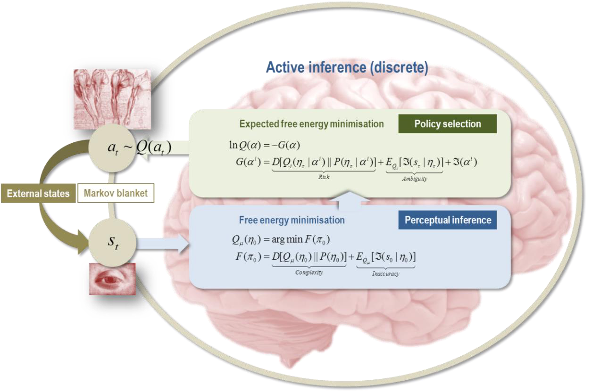
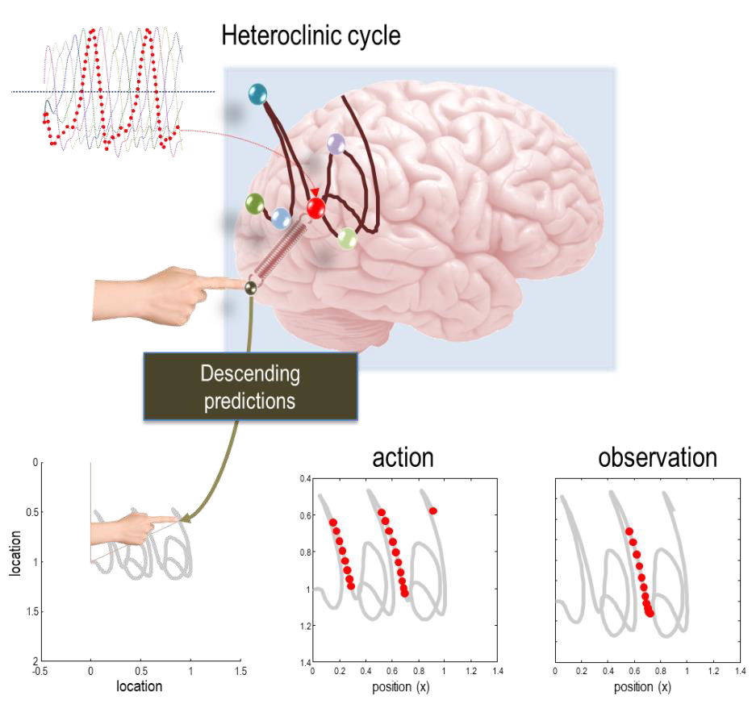
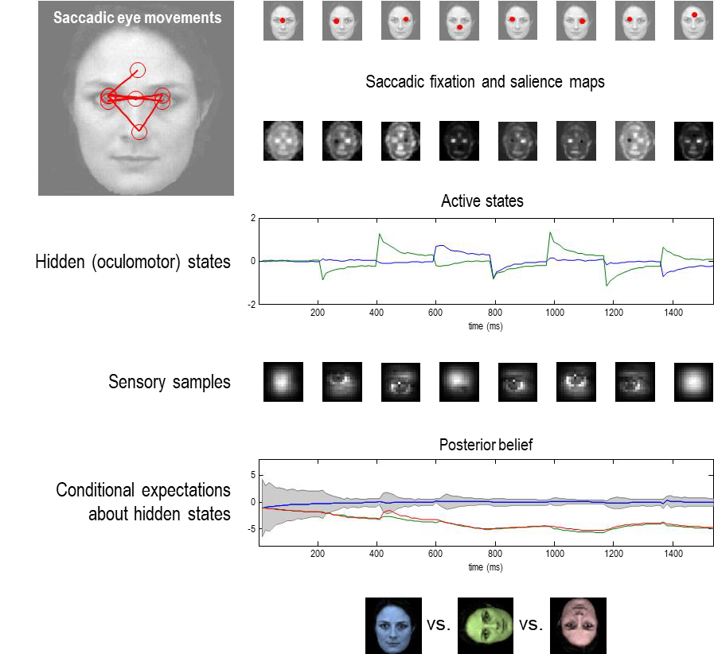

### 능동 추론과 자기 증명

*"우리가 객체의 모습을 바꾸는 모든 움직임은, 우리 앞의 현상의 불변한 관계, 즉 그들의 확정적인 공간적 관계를 정확하게 이해했는지 테스트하기 위해 설계된 실험으로 생각해야 합니다."* (헬름홀츠, 1878 (1971)) p.384

앞선 섹션에서, 내부 상태의 기대 흐름은 담요 상태에 조건부로 숨겨진 상태에 대한 근사 및 참 (사후) 확률 사이의 KL 발산을 줄이는 변분 자유 에너지의 최소화와 일치한다는 것을 보았습니다:

$$
\begin{equation}\tag{10.1}
\begin{aligned}
q_\mu(\eta)
  &\approx p(\eta|b) 
    = p(\eta | \pi) \\
\end{aligned}
\end{equation}
$$

이것은 내부 상태에 대한 설명을 제공하는데, 그들은 외부 상태에 대한 사후 신념의 충분한 통계량 역할을 하는 것처럼 보입니다. 그렇다면 활성 상태에 대해서는 동일한 설명이 있는가? 내부 상태는 마르코프 담요 뒤에 있으며 외부 상태와 직접적으로 영향을 미칠 수 없으며, 따라서 다른 입자의 마르코프 담요에도 영향을 미칠 수 없습니다. 이는 그들의 영향이 활성 상태를 통해 간접적으로 중재된다는 것을 의미합니다. 그렇다면 우리는 활성 상태에 대해 어떤 것을 알고 있을까요?

(8.21)에서, 가장 가능성이 높은 자율 상태의 흐름은 라플라스 가정 하에서 변분 자유 에너지에 대한 기울기 강하로 표현할 수 있습니다.

$$
\begin{equation}\tag{10.2}
\begin{aligned}
\pmb {\dot \mu}(b)
  &= -\Gamma_{\mu\mu}\nabla_\mu \Im(\pmb \mu| b)
   = -\Gamma_{\sigma\sigma}\nabla_\mu F(\pmb \mu, b)\\
\pmb {\dot a}(\pmb \mu)
  &= -\Gamma_{aa}\nabla_a \Im(b |\pmb \mu)
   = -\Gamma_{aa}\nabla_a F(\pmb \mu, b)\\
   \\
\nabla_\mu F(\pmb \mu, b)
  &= \nabla_\mu
    \underbrace{
      D[q_\mu(\eta) || p(\eta | b)]
    }_{\text{evidence bound}} \\
\nabla_a F(\pmb \mu, b)
  &= \nabla_a
    \underbrace{
      E_q[\Im(b | \eta)]
    }_{\text{inaccuracy}}
\end{aligned}
\end{equation}
$$

이는 자율 상태가 특정 상태로 인해서 주도되는 제약과 일치합니다.식(10.2)는 또한 내부 모드와 활성 모드 양쪽다 숨겨진 상태 너머의 암시적 신념의 자유 에너지 함수를 효과적으로 최소화하려고 한다는 사실을 강조합니다. 이는 감각 행동의 기본적인 설명을 제공하는데(Friston 등, 2017a), 이 설명은 근사 베이지안 추론과 머신러닝에서 사용되는 동일한 자유 에너지 함수에 기초하고 있습니다(Beal, 2003). 위의 마지막 방정식은 내부와 활성 상태의 기울기와 후속 흐름을 결정하는 (8.21)에서의 항을 유지합니다. 즉, 증거 경계와 정확도입니다. 인간적인 시각에서, 내부 상태는 따라서 외부 상태에 대한 진실한 신념을 형성하려고 노력합니다(c.f., 지각), 반면에 활성 상태는 이어지는 신념을 가능한 한 정확하게 만들려고 노력합니다(c.f., 행동). 이것은 종종 지각-행동 주기라는 용어로 표현됩니다(Friston 등, 2006; Fuster, 2004). 이 해석은 순전히 인식론적 연습으로 읽을 수 있습니다. 즉, 자기 증명을 특정 놀람 또는 로그-증거에 대한 기울기 흐름으로 표현할 수도 있습니다: (10.2)를 참조하십시오. 그렇다면, 변분 자유 에너지는 무엇을 더 제공하나요?

무엇이 더 흥미로운지는 우리가 _기대 자유 에너지_ 를 통해 자율 행동을 고려할 때입니다. 다음에는 우리는 기울기 흐름을 기반으로 한 자기 조직화의 설명을 기대 자유 에너지를 최소화하는 궤적 선택을 기반으로 하는 설명과 비교하고 대조할 것입니다. 그러나 기대 자유 에너지를 평가하려면 사후 예측 밀도가 필요합니다. 이는 변분 자유 에너지 공식화를 지지하는 외부 상태에 대한 사후 신념을 통해 가능합니다(즉, 근사 베이지안 추론). 간략히 말하면, 내부 상태가 증거 경계를 최소화하면 변분 밀도는 기대 자유 에너지를 평가하는 데 필요한 진정한 사후 밀도의 좋은 근사값이 됩니다. 차례로, 기대 자유 에너지의 최소화는 자기 조직화에 전망적이고 의도적인 측면을 부여하는데, 이것을 우리는 지금 더 자세히 살펴볼 것입니다.

#### 연속적인 상태의 능동 추론

지금까지, 내부 상태는 숨겨진 상태에 대한 근사 사후분포를 인코딩하며, 이는 능동적 상태가 (보이는 것처럼) 실현할 감각 상태를 예측하는 데 사용되는 구조를 가지고 있습니다(8.21). 이 실현은 특정 상태에서 자율적인 상태의 가장 가능성이 높은 궤적으로 특징지어질 수 있습니다. 기대 자유 에너지의 보조 정리(8.7)에서 기억하시겠지만, 미래의 자율적인 상태의 놀라움은 기대 자유 에너지의 용어로 표현될 수 있습니다:

$$
\begin{equation}\tag{10.3}
\begin{aligned}
D[q_\tau(x_\tau) || p(x_\tau)]
  &= 0
   \Rightarrow G(\alpha_\tau) \geq \Im_\tau(\alpha_\tau|\pi_0) \\
  \\

G(\alpha_\tau)
  &= E_{q_r}[
     \underbrace{
       \Im(s_\tau| \alpha_\tau, \eta_\tau) 
     }_{\text{sensory ambiguity}}
     +
     \underbrace{
       \Im(\alpha_\tau |\eta_\tau)
     }_{\text{active ambiguity}}
     +
     \underbrace{
       D[q_\tau(\eta | s_\tau, \alpha_\tau) || p(\eta_\tau)]
     }_{\text{risk}}
   ]
\end{aligned}
\end{equation}
$$

이는 능동적인 (그리고 내부) 상태의 궤적이 $\pi_0$으로부터 (보이는 것처럼) 기대 놀라움 (즉, 미래의 결과에 대한 불확실성)을 최소화할 것이라는 것을 암시합니다. 이는 리스크와 애매함을 최소화하는 것과 동등합니다. 여기서 리스크 (즉, 복잡성 비용)는 (사후) 예측 및 사전 밀도 사이의 기대 KL 발산입니다. 이는 시스템이 일반적으로 점유하는 상태를 설명합니다. 다시 말해, 능동적인 상태는 마르코프 담요을 넘어서 상황에 대한 사전 신념을 이행하려고 시도할 것으로 보일 것입니다.

(10.3)에서, 우리는 감각 상태의 애매함 (즉, *감각 애매함*)과 숨겨진 상태가 주어진 자율적인 상태의 기대 놀라움 (즉, *능동적 애매함*)으로 애매함을 구분하였습니다. 후자는 자율적인 상태의 (음의 로그) 가능성에 해당하며, 이는 (사후) 예측 밀도하에서 입자의 가장 가능성이 높은 반응을 반영합니다. 이 가능성은 때때로 심리학과 기계 학습에서 상태-행동 정책으로 특징지어집니다; 예를 들어, (Dolan and Dayan, 2013; Gershman and Daw, 2017; LeCun et al., 2015). 위의 마지막 두 용어 사이의 구분 (_능동적 애매함_ 과 리스크)은 심리학에서 습관적인 행동과 목표 지향적인 행동 사이의 구분과 잘 매칭됩니다 (Balleine and Dickinson, 1998; Dezfouli and Balleine, 2013; Dolan and Dayan, 2013). 이 구분은 예측된 상태와 선호하는 상태 사이의 발산을 최소화하는 것에 내재된 목표 지향적인 행동의 문맥 민감성에 근거하고 있습니다. 반면에 습관은 추론된 상황에 대한 가장 가능성이 높은 반응으로 유발됩니다. 그러나, 이 두 요소는 감각 상태에 대한 조건부 불확실성을 최소화하는 지식적 명령에 의해 문맥화되므로 능동 추론을 설명하는 데는 충분하지 않습니다. 인지 신경과학에서, 이는 최종적으로 애매함을 줄이는, 호기심이 많은 행동으로 이어져 자기 증거를 입증하는 탐색적 (즉, 지식적) 포식 행동을 특징지어줍니다 (Baranes and Oudeyer, 2009; Berlyne, 1950; Friston et al., 2017b; Schmidhuber, 2006; Still and Precup, 2012).

간단히 말하면, 입자가 기대 자유 에너지를 능동적으로 최소화한다면, 그것은 자기 조직화할 것입니다. 동등하게, 자기 조직화하는 입자들은 기대 자유 에너지를 최소화하는 것처럼 보일 것입니다. 여기서 중요한 것은 기대 자유 에너지가 특정 상태의 함수이며, 그것만의 함수라는 것입니다. 이는 비평형 정상상태에서 입자를 관찰하면, 내부 상태가 능동적 상태를 안내하는 것처럼 보일 것이라는 것을 의미합니다. 이어지는 행동은 평균적으로 리스크와 애매함을 최소화하는 방식으로 불확실성 (기대 놀라움)을 최소화하는 것처럼 보일 것입니다.

리스크와 애매함의 용어로서의 기대 자유 에너지의 구성이 사회학적 설명을 넘어서 어떤 이점을 제공하는지 의문을 가질 수 있습니다. 아래에서 우리는 숨겨진 상태에 대한 신념 (그것이 리스크를 구성하는)에 대해 기대 자유 에너지를 정의하는 것이 가능하다는 것을 보게 될 것입니다. 이는 생각하는 시스템의 동태를 명시하는 데 유용할 수 있습니다. 이는 사전 신념 $p(\eta_\tau)$ 또는 선호 (Friston et al., 2015b)라는 용어로 정의되는 유인 세트로의 자기 조직화를 시뮬레이션하는 데 유용할 수 있습니다. 이것은 단순히 자기 조직화를 특징짓는 것을 넘어서, 능동 추론에 참여하는 시스템을 만드는 중요한 단계입니다. 간단히 말해서, 선호하는 상태의 용어로서 자기 조직화를 규정할 수 있습니다. 이는 (10.3)을 만족하는 자율적 궤적에 대해 풀어내는 것입니다.

흥미롭게도, 기대 자유 에너지는 보편적 계산에 기반한 인공 일반 지능의 (계산 불가능한) 공식화와 수학적 유산을 공유합니다; 즉, 솔로모노프 유도(Solomonoff induction)와 순차적 결정 이론의 결합 (Hutter, 2006). 이 유산은 변분 자유 에너지의 복잡성 용어와 알고리즘 복잡성 (Hinton and Zemel, 1993; Wallace and Dowe, 1999) 사이의 관계에 근거하고 있으며, 이는 정보 길이와 전체 요동 거리의 용어로 표현될 수 있습니다. 그러나 솔로모노프 유도와 달리, 변분 자유 에너지는 경계 근사치를 사용하기 때문에 계산 가능합니다 (Feynman, 1972). 이제 우리는 기대 자유 에너지를 좀 더 자세히 살펴보고, 그 최소화가 어떤 행동을 나타낼 것인지 살펴볼 것입니다.

#### 이산 상태의 능동 추론

이론 생물학의 마지막 단계는 특정 생성 모델을 가정하고 예상 자유 에너지가 우리와 같은 지각하는 생명체의 행동을 설명하는 데 충분한지 묻는 것입니다.우리는 비평형 정상상태 역학이 근사 베이지안 추론으로 해석될 수 있다는 것을 보았습니다. 이제 이 모델이 활성 상태에 따라 외부 (숨겨진) 상태의 종속성을 포함하면 어떻게 될지 물을 수 있습니다. 이로 인해 내부 상태가 활성 상태에 대한 신념을 매개변수화하는 흥미로운 상황이 발생할 수 있으며, 이는 특정 자유 에너지 보조정리에 부합하는 활성 상태 자체와 입자의 활성 상태에 대한 대략적인 사후 신념 사이의 근본적인 구분을 초래합니다. 이러한 사후 신념은 기대 자유 에너지 보조 정리에 따르는 활성 상태의 궤적(즉, 정책)에 대한 사전을 갖춘 생성 모델에 기초하고 있습니다. 이것은 궤적의 생성 모델과 자기 조직화의 더욱 전망적인 형태를 수반하는 더욱 능동 추론을 이끕니다. 이것은 자기생성(즉, 생물학적인 의미에서의 자기 창조)와 비슷하게 보이는 자기 조직화의 형태를 내포하고 있습니다. (Maturana and Varela, 1980; Thompson and Varela, 2001). 이런 종류의 입자는 자신의 행동을 추론하고 있으며 실제로 그것이 가장 가능성이 높다고 추론한 위험에 민감하고 애매함을 줄이는 정책에서 행동을 선택하고 있다고 보일 것입니다.

여기에서의 실용적인 움직임은 주어진 역학에서 비평형 정상상태 밀도를 유도하는 것에서 - 폭커-플랑크 공식을 사용하여 - 주어진 밀도에서 역학을 유도하는 것으로 전환하는 것입니다 - 예상 자유 에너지를 사용하여. 능동 추론의 맥락에서, 비평형 정상상태 밀도는 외부 상태에 대한 사전 선호도에 해당하며, 이는 미래의 자율적 상태에 대한 이전 정보를 명시합니다. 즉, 자율적 행동에 대한 신념입니다.

이 설정에서 일반적으로 고려되는 모델은 연속 상태 공간을 고려하는 것으로 - 예측 코딩과 같은 체계를 이끌어내는 것(Bastos et al., 2012; Rao and Ballard, 1999) - 또는 실험 설정에서 이산 선택과 결정을 모델링하는 데 더 적합한 이산 상태 공간 모델(Friston et al., 2017a)입니다. 이어서, 우리는 이산 모델 하에서의 예상 자유 에너지의 최소화를 간략하게 살펴보겠습니다. 이산 상태에서, 예상 자유 에너지는 다음과 같이 표현될 수 있습니다 (자세한 내용은 (부록 F) 참조):

$$
\begin{equation}\tag{10.4}
\begin{aligned}
G(\alpha^i)
  &= 
    \underbrace{
      D[Q_i(\eta_\tau|\alpha^i)||P(\eta_\tau|\alpha^i)]
    }_{risk} 
   +
    \underbrace{
      E_{Q_i}[\Im(s_\tau|\eta_\tau)]
    }_{ambiguity} 
   + \Im(\alpha^i)
   \geq \Im(\alpha^i | \pi_0) \\
Q_i
  &\triangleq P(\eta_\tau,s_\tau|\alpha^i, \pi_0)
    \\
\end{aligned}
\end{equation}
$$

이 맥락에서, 사전 선호도 $P(\eta_\tau|\alpha^i)$는 활성 상태의 시퀀스의 사전 확률(일반적으로 정책, $\alpha^i=(\alpha_1^i,\ldots,\alpha_\tau^i)$로 표시됨)에 대한 한계를 명시합니다. 이 구조는 우리가 지금까지 다루었던 연속 상태 공간 공식보다 약간 더 단순합니다. 여기서, 변분 밀도는 활성 상태에 의존하지 않는 감각 가능성에 따라 명시됩니다(왜냐하면 감각 상태는 생성 모델에서만 숨겨진 상태에 의존하기 때문입니다; 예를 들어, 숨겨진 마르코프 모델과 마르코프 결정 과정).

방정식 (10.4)는 입자가 비평형 정상상태로 자기 조직화할 때 정책이 어떻게 샘플링되는지 설명합니다 - 이것이 '선호' 상태가 됩니다. 반대로 말하면, (10.4)에 따라 정책을 샘플링하는 어떤 입자든 자기조직화, 자기 입증 행동을 보여야 합니다:
$$
\begin{equation}\tag{10.5}
\begin{aligned}
p(a^i|\pi_0) 
  &\approx \pmb \sigma(-G(a^i))
   \Leftrightarrow \Im(a^i|\pi_0)
   \approx G(a^i)\\
\end{aligned}
\end{equation}
$$

정책이 예상 자유 에너지를 최소화하기 위해 선택되어야 한다는 사전 신념을 포함하기 위해, 일반적으로 각 허용 가능하거나 그럴듯한 정책에 따른 궤적의 생성 모델을 가정합니다. 그러면 변분 자유 에너지의 최소화는 신념 전파 또는 가능성 행렬과 정책 종속적인 상태 전이 행렬에 의해 지정된 생성 모델 하에서의 변분 메시지 전달을 사용하여 진행됩니다 (Friston et al., 2017c). 그림 20은 (10.4)에 의해 암시되는 계산 아키텍처를 보여주며, 그림 설명은 신경과학에서 그 응용의 몇 가지 예를 나열합니다. 여기서 중요한 점은 이러한 모든 응용이 위에서의 자기조직화 처리를 따르는 예상 자유 에너지의 최소화에 근거하고 있다는 것입니다.

자유 에너지 최소화의 이산 형식화에 의해 제공되는 계산 효율성은 두 가지 유형의 자기 입증 행동 사이에 질적인 구분을 나타냅니다. 즉, (i) 반사적인 단기 자기조직화 - 홈에오스타시스(Ashby, 1947; Bernard, 1974)와 유사하며 (ii) 깊이 있는 장기적인 능동 추론 - 계획 및 알로스타시스(Attias, 2003; Botvinick and Toussaint, 2012; Ramsay and Woods, 2014; Stephan et al., 2016; Sterling and Eyer, 1988; Sutton et al., 1999; Toussaint and Storkey, 2006)에 대해 이야기합니다. 정보 길이 관점에서 이 구분은 각각 짧고 긴 임계 시간을 가진 입자와 연관될 수 있습니다 (8.15). 우리는 이 섹션을 경사 흐름과 최소 행동 경로 선택에 관한 얕은 (단기) vs. 깊은 (장기) 구분을 다시 살펴봄으로써 마무리하겠습니다.

FIGURE 20

*베이지안 메커니즘과 능동 추론*. 이 그림은 변분 및 예상 자유 에너지 최소화에 내재된 신념 업데이트를 요약합니다. 이는 행동 경제학의 게임(FitzGerald et al., 2015) 및 강화 학습(Schwartenbeck et al., 2015)부터 언어(Friston et al., 2017d)와 장면 구성(Mirza et al., 2016)에 이르기까지 다양한 애플리케이션과 시뮬레이션에서 사용된 일반적인(활성) 추론 체계를 제공합니다. 이 설정에서, 이산 액션은 세계의 숨겨진 또는 외부 상태에 대한 대략적인 사후 신념을 알리는 감각 결과를 요구합니다 - 즉, 가능성 있는 정책 하에서 변분 자유 에너지를 최소화하는 것을 통해(지각 추론). 그러면 대략적인 사후 신념이 예상 자유 에너지를 평가하고 이후 액션에 대한 신념을 형성하는 데 사용됩니다(정책 선택). 이 구성에서 세밀하면서도 중요한 움직임을 주목하세요: 예상 자유 에너지는 정책에 대한 이전 _신념_ 을 제공합니다. 이것은 몇 가지 관점에서 흥미롭습니다. 예를 들어, 이는 에이전트가 정책을 추론하고, 암시적으로, 활성 상태를 추론한다는 것을 의미합니다. 다시 말해, 정책에 대한 신념 - 내부 상태에 의해 인코딩된 - 은 에이전트의 마르코프 담요의 활성 상태와는 별개입니다. 더 정교한 체계에서, 에이전트는 가능성 있는 정책 하에서 은닉 상태를 추론하며, 이는 마르코프 결정 프로세스를 기반으로 하는 생성 모델을 사용합니다. 이는 에이전트가 어떻게 행동할 것인지 예측하고 그 예측을 감각 샘플을 기반으로 검증한다는 것을 의미합니다. 즉, 에이전트는 자신의 행동에 대한 증거를 수집하고, 적극적으로 자기 증명을 합니다. 이 설정에서, 변분 자유 에너지는 특정 정책이 추구되고 있는 놀라움 또는 증거를 반영합니다. 결론적으로, 이는 에이전트가 그것의 실행적인 자아에 대해 기본적인 신념을 가지게 될 것임을 의미합니다 - 위험을 구성하는 이전 선호에 의해 목적감을 부여하는 신념. 시뮬레이션에서 얻은 주요 통찰 중 하나는 생성 모델의 형태가 외부 상태가 감각 상태를 생성하는 방식과는 매우 다를 수 있다는 것입니다. 결국, 이는 에이전트(즉, 입자)가 Econiche 구성(Bruineberg and Rietveld, 2014)과 밀접한 관련이 있는 방식으로 자신의 감각 영역을 창작하는 것을 가능하게 합니다. 기술적인 세부사항에 대해서는 (Friston et al., 2017c)를 참조하고, 뇌에서 암시적인 신념 업데이트가 어떻게 구현될 수 있는지에 대한 논의는 (Friston et al., 2017a)를 참조하십시오.

#### Deep inference: gradient flows or least action? - 깊은 추론: 경사 흐름 또는 최소 작용?

예상 자유 에너지 따름정리는 특정 정책의 확률이 부분적으로 세계의 숨겨진 상태에 대한 불확실성을 해소하는 그것의 지식적 가치에 해당한다고 말합니다. 휴리스틱하게, 이것은 미래의 감각 샘플로부터 얻을 수 있는 정보 획득을 극대화함으로써, 지식적 행동을 더욱 확률적으로 만듭니다. 즉, 특정 행동 경로에서 예상되는 불확실성의 감소입니다. 이것을 때때로 _지식적 허용성_ 이라고 부릅니다(Calvo and Friston, 2017; Proust, 2015).

이것은 우리가 설명하려고 하는 입자들의 종류의 정의에서 거의 자명하게 따릅니다. 다시 말해, 자기 입증 입자들은 숨겨진 또는 외부 상태가 주어졌을 때 그들의 담요 상태에 대한 조건부 불확실성을 최소화하기 위해 자기 조직화될 것입니다. 즉, 모호성(2.3). 이것은 뉴로사이언스에서 인식에 대한 많은 영향력 있는 공식화의 기반이며, 최소 중복성 원칙(Barlow, 1961; Barlow, 1974), Infomax 원칙(Linsker, 1990) 및 정보 이론과 인공적인 호기심에 관한 지식 탐색 공식화를 포함합니다(Bialek 등, 2001; Itti와 Baldi, 2009; Schmidhuber, 2010; Still과 Precup, 2012; Sun 등, 2011; Tishby와 Polani, 2010). 현재의 공식화에서, 내부 상태는 외부 상태에 대한 신념을 매개변수화합니다. 이것은 불확실성이 없는 감각 상태의 활동적 샘플링을 가능하게 합니다. 결정적으로, 이것은 내부 상태가 외부 상태를 추론하게 하며, 이것은 대부분의 자기 조직화의 처리에 참여하는 순환 인과성을 언급합니다(Haken, 1983).

특정 자유 에너지 보조 정리(8.3)에서, 우리는 자기 조직화를 변분 자유 에너지의 용어로 제시된 최소 작용 원칙으로 요약할 수 있습니다:

$$
\begin{equation}\tag{10.6}
\begin{aligned}
\pmb \alpha[\tau]
  &= argmin_{\alpha[\tau]} \cal A(\alpha[\tau]|s[\tau]) \\
  &\Rightarrow \delta_\alpha \cal A(\pmb \alpha[\tau]|s[\tau]) 
   = 0 \\
  &\Rightarrow  \pmb{\dot \alpha}_0 
   = (Q_{\alpha\alpha} - \Gamma_{\alpha\alpha})\nabla_\alpha F(\pmb \alpha_0, s_0)
\end{aligned}
\end{equation}
$$

이 변분 원칙은 자생적인 행동이 형태 발생과 자기생성의 설정에서 상대적으로 단순한 시스템에서 잘 시뮬레이션되는 데 널리 사용되었습니다(Friston et al., 2015a). 보다 깊은 자기 조직화는 변분 자유 에너지를 정의하는 생성 모델 $\Im(\eta,s,\alpha)$에 시간적 깊이를 부여함으로써 나타납니다. 이 시간적 깊이는 궤적 또는 경로 $\Im(\eta[\pmb\tau],s[\pmb\tau],\alpha[\pmb\tau])$를 포괄합니다. 이 깊은 생성 모델은 미래의 활동 상태에 대한 사전 가정을 요구하는데, 이는 (8.7)에 따르면 자율 경로의 종점의 놀라움에 대한 상한선으로 제공됩니다. 만약 우리가 (1.10)의 행동의 경로 독립적인 항을 유지한다면, 그러면 (8.15)로부터 가장 가능성이 높은 자율적 행동의 진행은 예상 자유 에너지를 최소화합니다:

$$
\begin{equation}\tag{10.7}
\begin{aligned}
G(\alpha_\tau)
  &\geq \Im(\alpha_\tau) - \Im(\alpha_0) \propto \cal A(\alpha[tau]|\pi_0)\\
\pmb \alpha[\tau]
  &= argmin_{\alpha[\tau]} \cal A(\alpha[\tau]|\pi_0) \\
  &\approx argmin_{\alpha[\tau]} G(\alpha_\tau) \\
\end{aligned}
\end{equation}
$$

이 공식은 시각적 포집 행동과 인지 신경과학에서의 의사결정 시뮬레이션에 광범위하게 사용되었습니다; 예를 들면, (Mirza et al., 2016). 이런 응용에서, 흥미로운, 자기 조직화하는 매력 집합을 특징짓는 목표는 뒤집혀지고 (10.7)은 지정된 생성 모델에 따른 정책(즉, 행동의 경로)을 선택하는 데 사용됩니다. 이 깊은 능동 추론은 우리가 우리의 시각적 세계를 사카딕 눈 운동으로 샘플링하는 방식(Mirza et al., 2016)부터 생성 모델에 대한 증거를 축적하고 그 후에 결정을 내리는 방식(Friston et al., 2015b)에 이르기까지 행동의 많은 면을 설명하는 데 충분하다고 보입니다. 간단히 말해서, 능동 추론을 근거로 하는 변분 원칙은 이미 생물학과 사회 과학의 많은 부분에 내재되어 있습니다.

위의 방정식은 자율적 행동을 해결할 두 가지 방법을 제안하는데, 그것은 변분 자유 에너지 (10.6)에 대한 경사 하강을 수행하거나 예상 자유 에너지 (10.7)를 최소화하는 경로를 선택하는 것입니다. 두 가지 모두 지각하는 존재와 생물학적 측면이 있는 그럴듯한 행동을 이끕니다. 그림 21은 손글씨의 간단한 형태(그리고 그것의 관찰)를 재현하는 첫 번째(경사 흐름) 솔루션에 기반한 자율적 행동의 예를 보여줍니다. 이 예시는 생성 모델의 예측에 대한 활동적 반응을 에뮬레이션하기 위해 체인 규칙을 사용했는데, 이는 신경생물학에서의 고전적인 반사활(또는 반사궁)를 매우 닮았습니다 (Adams et al., 2013):

$$
\begin{equation}\tag{10.8}
\begin{aligned}
\pmb{\dot a}
  &\approx -\Gamma_{aa}\nabla_{\vec s} F(\vec \pi)\cdot \frac{\partial\vec s}{\partial\vec \eta} \cdot \frac{\partial\vec\eta}{\partial a}\\
\end{aligned}
\end{equation}
$$

이 체인 규칙의 사용은 움직임의 일반화된 좌표에서의 동역학의 공식화를 요구하는데, 이는 $\vec\pi\triangleq(\pi,\pi^{'},\pi^{''},\ldots)$: (부록 E)와 (Friston et al., 2010)를 참고하십시오.

방정식 (10.8)은 활동적 상태의 변화가 이 예시에서는 외부 상태의 일반화된 움직임에 의해 매개된 감각 상태의 고차 움직임 변화를 유발한다는 것을 의미합니다. 이 예시는 두 가지 포인트를 보여줍니다. 첫째, 모든 흥미로운 행동은 내부 상태(여기서는 간단한 뇌)에 인코딩된 신념에 의해 생성됩니다. 다시 말해, 끌어당기는 끌개와 연관된 비평형 정상상태 밀도는 입자의(즉, 에이전트의) 신념에 완전히 규정되어 있습니다. 직관적으로 이것은 입자가 외부 동역학과 그로 인한 감각 세계의 저자 또는 에이전트라는 것을 의미합니다. 두 번째로, 보다 기술적인 포인트는 움직임의 일반화된 좌표를 사용함으로써 우리는 사실상 로컬 경로나 궤적의 동역학을 명시적으로 정의했다는 것입니다. 이는 테일러 전개로부터 나옵니다:

$$
\begin{equation}\tag{10.9}
\begin{aligned}
\pi(\tau)
  &= \pi_0 + \tau\pi_0^{'} + \tfrac 1 {2!} \tau^2\pi_0^{''}+\ldots\\
\end{aligned}
\end{equation}
$$

이러한 경로가 로컬인 이유는 무작위 요동성으로 인해 과거나 미래에 대한 의미 있는 정밀도로 궤적이 명시되지 않았기 때문입니다. 이로 인해 다음과 같은 의문이 생깁니다: 우리는 예상 자유 에너지를 사용하여 더 긴 경로에 걸친 능동 추론을 명시할 수 있을까요?

그림 22는 예상 자유 에너지를 사용하여 연속적인 활동 상태를 명시하는 예시를 보여줍니다. 이 예시에서는 시각적인 장면(여기서는 얼굴)의 지식적 탐색을 재현하기 위해 사적 안구 운동이 시뮬레이션되었습니다. 지식적 탐색은 외부 상태에 대한 불확실성을 해결하는 적절한 감각을 유발하는 행동을 선택하는 것을 의미합니다. 이 예시는 두 가지 추가적인 핵심 포인트를 제시하는 데 사용됩니다. 첫번째는 예상 자유 에너지를 사용하여 능동 추론을 시뮬레이션할 때 나타나는 지식적, 불확실성 또는 모호성을 해결하는 행동에 대해 이야기합니다. 이 행동은 이 경우 생성 모델이 외부 또는 숨겨진 상태에 대한 사전 선호도를 가지고 있지 않았기 때문에 발생합니다. 즉, 단순히 (8.14)의 정보 이득(a.k.a. 중요성)만 남습니다. 간단히 말해, 시각 장면의 활동적 샘플링은 감각의 원인에 대한 불확실성을 해결하기 위한 순수한 정보적 요구에 의해 주도되었습니다. 두번째 포인트는 다음 질문에 근거합니다: 우리는 경사 흐름 공식을 사용하여 이 행동을 재현할 수 있었을까요?

답변은 아니오입니다. 이는 예상 자유 에너지를 최소화하는 자율적인 활동에 높은 확률을 부여하는 것이 실질적으로 미래 상태의 자기-엔트로피를 최소화하고, 이로 인해 목적성이 있는 활동이 나타나기 때문입니다. 이것은 마치 열역학적 비용이나 중력에 민감하지 않은 것처럼 움직이는 입자, 즉, 자율적이고 목적적이며 정보를 찾는, 선호도를 충족하는 활동이 물질 입자에 적용되는 법칙을 위반하는 것처럼 보이는 놀라운 운동성을 만들어낼 수 있다고 상상할 수 있습니다. 이런 자율적이고 목적적인, 정보를 찾는, 선호도를 충족하는 활동은 생물학적 자기조직의 특징일 수 있으며 – 이는 고전 법칙을 보증하는 랑주뱅 역학에서 물려받은 것일 수 있습니다.

FIGURE 21

*자율 운동(Autonomous movement)*. 이 그림은 세계의 숨겨진 상태에 대한 조건부 기대치, 결과적인 감각 입력에 대한 예측, 그리고 이어지는 행동에 관한 능동 추론(여기서는 글씨쓰기)의 시뮬레이션 결과를 보여줍니다. 이런 행동을 보증하는 자율적인 역학은 롯카-볼테라(Lotka-Volterra) 역학을 따르는 상태에 대한 사전 예상에 기반을 두고 있습니다: 이것이 왼쪽 상단 패널의 여섯 개(임의로) 색칠된 선입니다. 이 생성 모델에서 각 상태는 에이전트의 손가락을 끌어당기는 유클리드 공간 내의 위치와 관련이 있습니다. 실질적으로 내부 상태는 그러면 에이전트의 신념이 사실이라면 감각 상태가 어떤 것을 등록해야 하는지에 대한 예측을 제공합니다. 활동 상태는 반사적으로 예상되는 각속도의 변화를 충족시키므로 예측 오차를 억제하려고 시도합니다(즉, 정확도를 최대화합니다). 이를 통해 에이전트의 관절에 힘을 가합니다(보여지지 않음);. 이어지는 팔의 움직임은 왼쪽 하단 패널에서 그려져 있습니다. 이 궤적은 합성적인 필기체처럼 보이도록 움직이는 참조 프레임에서 그려졌습니다(예: 'j'와 'a' 글자의 연속). 왼쪽 하단 패널은 '행동'과 '행동-관찰'하에 있는 하나(네 번째)의 숨겨진 상태의 활동을 보여줍니다. 행동 중에는 감각 상태가 움직임의 시각적이고 지각적인 결과를 모두 등록하며, 행동 관찰하에는 다른 에이전트를 보는 것처럼 오직 시각적인 감각만이 가능합니다. 빨간 점들은 이 상태가 임의의 단위 두 개를 초과하는 진폭 임계값을 넘는 동안의 시간 빈을 나타냅니다. 여기서 주목해야 할 주요한 것은 이 단위가 모터 궤적이 하향 스트로크를 만들 때, 그리고 그 때만, 선호적으로 반응하지만 상향 스트로크는 만들지 않는다는 것입니다. 자세한 내용은 (Friston 등, 2011)을 참조하십시오. 또한, 약간의 지연과 함께, 이 내부 상태는 행동과 행동 관찰 중에 반응합니다. 생물학적 관점에서 이것은 미러 뉴런 활동이라는 경험적 현상에 대해 언급하는 것이기 때문에 흥미롭습니다 (Gallese and Goldman, 1998; Kilner et al., 2007; Rizzolatti and Craighero, 2004).

FIGURE 22

*지식적 탐색(Epistemic foraging)*. 이 그림은 얼굴이 에이전트에게 제시되고, 그의 반응이 눈의 움직임 후 예상되는 자유 에너지를 최소화하는 활동 상태를 선택함으로써 시뮬레이션된 시나리오의 결과를 보여줍니다. 에이전트는 자신이 샘플링할 수 있는 자극에 대해 세 가지 내부 이미지나 가설(똑바로 세운 얼굴, 뒤집힌 얼굴, 회전한 얼굴)을 가지고 있었습니다. 에이전트에게는 똑바로 세운 얼굴이 제시되었고, 그녀의 사후 기대치는 다음 단속운동이 발생할 때까지 16개의 (12ms) 시간 구획 동안 평가되었습니다. 이 과정은 여덟 번의 단속운동에 대해 반복되었습니다. 이어지는 눈의 움직임은 각 단속운동의 끝에 있는 빨간 점으로 상단 행에서 보여줍니다. 동일한 눈의 움직임 순서는 왼쪽 상단의 삽입물에서 보여지며, 여기서 빨간 원은 대략적으로 샘플링된 시각 이미지의 비율에 해당합니다. 이 단속운동들은 두 번째 행의 중요도 맵에 기반한 시선의 방향에 대한 사전 신념에 의해 주도됩니다. 이 중요도 맵은 정책의 기능으로서의 예상 자유 에너지로, 즉, 다음에 어디를 볼 것인지를 나타냅니다. 이 맵들은 숨겨진 상태, 자극 포함,에 대한 사후 신념이 점차 더 확실해지면서 연속적인 단속운동으로 변화한다는 것을 주목하십시오. 또한 이전 단속운동에서 중앙부를 본 위치에서 중요도가 소진된다는 것도 주목하십시오. 왜냐하면 이 위치들은 더 이상 지식적 가치(즉, 불확실성 또는 예상 자유 에너지를 줄일 수 있는 능력)를 가지고 있지 않기 때문입니다. 경험적으로, 이것은 반환 억제라고 알려져 있습니다. 눈의 움직임에 대한 반응은 세 번째 행에서 수직 및 수평 눈의 움직임에 해당하는 두 가지 숨겨진 눈의 움직임 상태의 관점에서 보여집니다. 각 단속운동의 끝에서 샘플링된 이미지의 관련 부분들은 네 번째 행에서 보여집니다. 마지막 두 행은 각각 충분한 통계와 자극 카테고리의 관점에서 동반되는 사후 신념을 보여줍니다. 사후 신념은 여기서 사후 기대치와 90% 신뢰 구간의 관점에서 표시됩니다. 주목해야 할 주요한 것은 참 자극에 대한 기대가 대안적인 기대를 초월하고, 결과적으로 자극 카테고리에 대한 조건적인 확신이 증가하고(그리고 신뢰 구간은 기대치로 축소된다)는 것입니다. 이것은 감각 상태를 가장 잘 설명하는 가설이나 지각을 선택할 때의 증거 축적의 본질을 보여줍니다. 단속운동 내 축적은 초기 고정 중에도 분명하며, 눈에 띄는 정보가 연속적인 단속운동에서 샘플링됨에 따라 불확실성이 더욱 단계적으로 감소합니다. 자세한 내용은 (Friston 등, 2012)를 참조하십시오.

#### 요약

요약하면, 이 섹션에서는 두 가지 수준에서 읽을 수 있는 지각 동력학의 물리학을 검토했습니다. 일차원적인 관점에서, 이것은 특정한 종류의 끌개집합을 가진 (약하게 혼합된) 무작위 동적 시스템의 설명일 뿐입니다. 즉, 그것들은 우연히 공간을 차지하지만 자기(자체) 엔트로피 측정치가 낮은 것들입니다. 다시 말해서, 이러한 무작위 동적 시스템이 존재한다면(즉, 마르코프 담요을 소유하고 있다면), 그것들은 최소 작용 원리(10.6)를 준수하는 것처럼 보일 것입니다. 여기서 작용은 내부 상태에 의해 인코딩된 확률적 신념의 함수입니다. 대안적으로, 자유 에너지 보조 정리를 자기조직화 또는 보다 구체적으로는 자기 증거 제공의 설명으로 간주할 수 있습니다.

간단히 말해, 이 보다 목표적인 설명은 다음과 같습니다: 마르코프 담요에 의해 유발된 외부와 내부 상태 사이의 조건적 동기성 덕분에, 자기 조직화는 능동 추론하에 나타납니다. 이 동기성은 내부 상태에 의한 '밖의 세계'(즉, 외부 상태)의 확률적 표현을 제공합니다. 이 차례로, 숨겨진 상태에 대한 불확실성을 능동적으로 최소화함으로써 조건적 동기성을 보장하는 정책(자율 상태의 궤적)의 선택을 가능하게 합니다. 이 설명은 자기생성(클라크, 2017; 마투라나와 바렐라, 1980; 세스, 2014)의 한 형태를 보증하는 원인의 순환성을 강조합니다. 결국, 이는 (음의 로그) 증거의 상한선인 변분 자유 에너지 기능을 최소화합니다. 따라서, 자기 증거 제공(Hohwy, 2016).

자율 상태의 우세는 그들이 비평형 정상상태를 이끌 확률을 반영합니다. 이런 의미에서, 활동 상태들은 '마치' 그들이 예상 자유 에너지(즉, 자기 엔트로피)를 최소화하기 위해 선택된 것처럼 보일 것입니다. 이것은 무작위 동적 끌개로 자기 조직화하는 시스템의 단순한 설명에 불과합니다. 그러나, 시스템의 생성 모델이 시간적 깊이를 획득하고 - 그리고 그것의 행동이 예상 자유 에너지를 최소화한다는 사전 신념 - 베이지안 역학의 '마치' 설명적 측면은 더 깊은 자기조직화 형태로 이어지게 됩니다. 여기서 활동 상태들은 실제로 입자에 의해 보유되고 있는 '신념'에 의해 유발됩니다. 형식적으로, 이처럼 심층적으로 구조화된 자기증거는 미래 경로의 명시적인 생성 모델을 필요로 하며, 여기서 중요한 것은 기대되는 자유 에너지의 (경로 적분)이 정책에 대한 사전 정보를 제공한다는 것입니다.

자기증거 동역학은 그 자체로 자발적으로 나타나는 특성(자발적 비평준성과 유사함)인가? 이 질문은 현재의 논의에서 다루기에는 너무 복잡한 것일 수 있습니다. 그러나 (강한) 인류 원리(Barrow et al., 2015)를 넘어서서 - 우리는 측정 가능한 마르코프 담요의 세계에서 추론 시스템으로 존재합니다 - 우리는 출현 질문을 쉽게 피할 수 있습니다. 더 흥미로운 가능성은 자기증거를 어느 정도 보여 주는 무작위 동역학 시스템의 범위에 있습니다. 그들의 지속성(그리고 따라서 우주에서 발견될 확률)은 (10.7)에 내재된 계획의 깊이와 밀접하게 관련될 수 있습니다. 다시 말해서, 생성 모델이 충분히 깊은 입자 - 자율적 행동의 긴 시퀀스에서 선택할 수 있는 - 는 우리가 점점 더 정교해지는 생물체 시스템과 관련된 시스템일 수 있습니다. 때때로 가상적 깊이(counterfactual depth)라고도 합니다(Seth, 2015). 이것은 생성 모델과 미래(그리고 과거)의 표현의 본질에 관한 흥미로운 문제에 대해 이야기합니다. 이 문제는 다른 곳에서 다루어집니다(Friston et al., 2015b). 이것은 또한 순례, 정보 길이 및 관련 열역학의 관점에서 자기조직의 특징으로 우리를 돌아오게 합니다.
